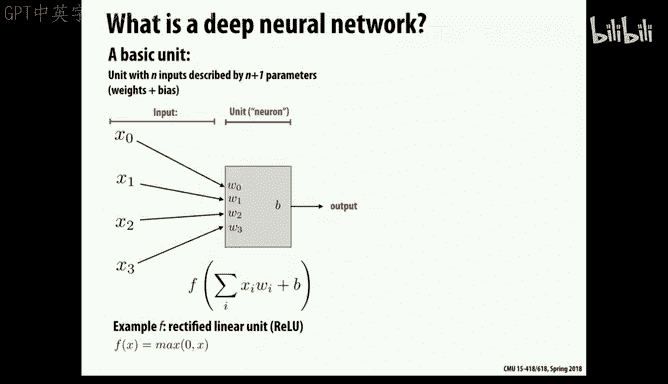
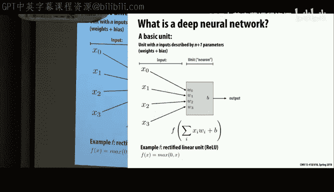
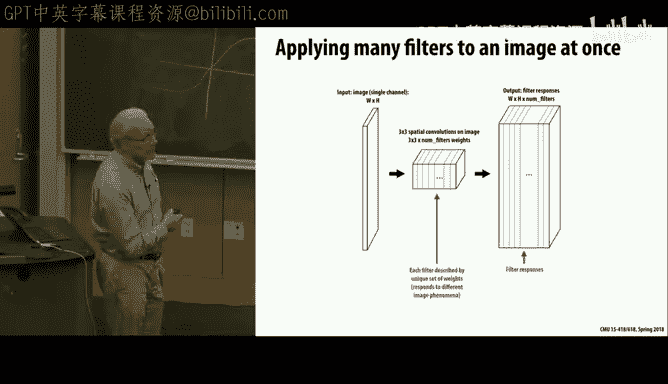
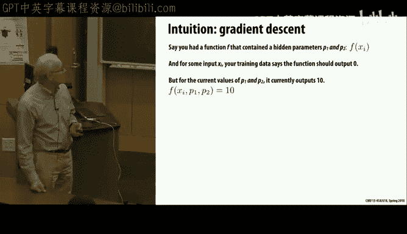
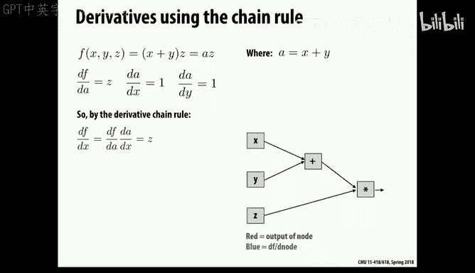
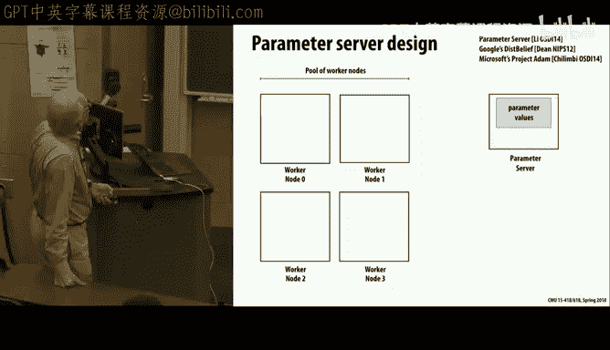

# CMU《并行计算机架构与编程｜CMU 15-418 Parallel Computer Architecture and Programming sp18》 - P29：Lecture 29 - 4-2-18 - Carnegie Mellon University.zh_en - GPT中英字幕课程资源 - BV18b421J7cA

So today I'd like to talk about a topic that I'm sure is of interest to a lot of people。

 and that's namely the relation of parallel computation and deep neural networks。

 so you probably know that deep neural networks have absolutely eventually revolutionized the area of AI and machine learning。

And it's hard to describe the， the range of。Of all the impact it's had。

But you've heard about the recent wins by Google Deep Mind in。

 in the game of Go and also tremendous advances in the fields of image recognition， where at first。

 there was just the question。Can you， is there a cat in this picture？ And now it's a question of。

Where is the cat in this picture， So can you I actually localize things， Can you describe。

 is the cat walking or sleeping or eating and what breed of cat is it？ So increasingly refined。

 And this goes also in areas such as speech。Recognition。

 language translation have all completely given over to deep neural network， so I remember。

Visit I had to Google several years ago where of the top people there said we' basically ripped out all of our fancy infrastructure we developed for specific applications and just replace it all with deep neural networks and we just train it all on huge amounts of data and weve got it go and so a lot of problems that used to require sort of intricate domain knowledge they just throw in a lot of training data and make it go so it's a huge evolution and one of the interesting aspects of it is。

Brings AI back into the world of numerical computation。And very structured numerical computation。

 So it looks much more like a scientific computing problem than was previously the case。

So let's look at the basics of this， and I'm sure many of you have seen different parts of this before。

 but let's understand what we really mean about neural networks and deep neural networks in particular。

So this idea actually comes from the。The late 70s or something。

 the idea or even before that at some level of some very thinking of computation。

 sort of very elementary computation that is performed by a network of computing elements。

 and the basic one is that you have a weighted sum of some inputs。

Imagine these are real valued numbers and real valued weights。 And so you compute a sum。

Awaited some of them with some particular offset bias。And then you apply a function to that。

 that's a non nonlinear function。 And in the past， there were various elaborate functions People came up with to do it。

That gives you some sense of。Of of。A sort of rate limiting step。 So a classic。

Examples would look sort of like this。Where there's， if this is the input。

We would tend to sort of generate an output that's saved between0 and1 or in some bounded range by sort of damping off。

 but not completely eliminating the higher order， you know， the number as it goes。

 not really clamping and is more like approaching something。In the women。

So that is where the old versions。 But most recently， it's just changed to this。A crazy。

 simple function， which is。Just to say it's the max of the value in zero。

And so this is sometimes called a rectified linear unit or。

Or sometimes referred to as a hinge function that it's non nonlinearar， obviously。

 but it's extremely simple。 And this is proved to be very effective。

 And what it means is if the output is in some range。

It will be that the result of the box will be just that value。 And if it's a negative number。

 it will just be that the output is essentially disabled from that block。

And this is vaguely informed by biology and how real neurons work。 But to say it's really you know。

 based on some real fundamental theory of brain activity is a complete nonsense。 It's brain inspired。

 but not brain mimicking。

And so there is some truth that in the neural system。There are。

Sent sort of connections between neurons called exxons。

 and they tend to communicate or send information by a pulsing。

 And it's essentially the rate of pulse。That defines what the strength of the output is and that these values are then all absorbed。

Into the neuron which then will produce output that fires at a certain rate。

 So it does have this idea of collecting together information and then generating an output。

 and it does have this sort of feature of generally some nonlinear output function。

 but that's about the extent of it。 Everything else。

 just think of this as this is just a model computation。

 We don't claim this is how the human any animal brain really works。

And they sort two distinct models with。modes that we're using these systems in。

 One is if we have a neural network all created and trained and ready to do something。

 then we want to apply it over and over again。 So for example。

 as I mentioned in language translation， they train it using trillions of words of text in some case。

 you have， for example， some text that's in both English and Chinese the minutes of the Hong Kong Parliament is one of those。

And so you can just say here's this general， these words in English generally correlate with these words in Chinese。

And so you train it on that。To to sort of be able to mimic what seems to be the correlations that are observed there and also to train it on the target language specifically。

 that these are sort of typical Chinese language sentences。 and therefore。

 this is the structure that you are trying to emulate in some form。So that's training。

 and that that takes days， weeks， months huge amounts of computing power and the Google data center will burn on that information for you know。

 a huge number of nodes for several days just to build up that model。

 But now the evaluation side of it is okay， somebody has just typed in some text into a Google search window in English and wants to translate that into Chinese。

 Well， that's a problem of now feeding it into this network and doing the evaluation of all these neural values。

 And that's relatively quick and simple。 but still we're talking about。Potentily。

A billionaire more computations。 and especially if we want to do this on our individual phones or in some area where we don't have lots of computing resources。

 we want that to be fast energy efficient and so forth。

 So even though the evaluation part is way simpler than the training part。

 we will do the evaluation many times more and often in a system with limited resources。

So we'll focus first on evaluation and then on training。

So the idea of a neural network then is that we have these computing elements or neural elements。

 and we build up a network。Of with some structure with the idea that we take whatever the input is。

 say an image and the output will be a wish to a group of classifiers。

 Is this a cap or is there a cat in this picture。And then we have these so-called hidden elements that lie between the input and the output。

 and each of these， remember， has some set of weights associated with all their input values。

 as well as the offset the bias， and so there's multiple weights and magically assume for the valuation purpose that these weights are determined we'll figure out how to do that later。

 and so the evaluation processes then from left to right， do all these computations。

And the structure of the network that is still a bit of black magic of how you actually set up what is a good network for a given task。

And that's still done by basically trial and error and some general expertise。

But you can imagine there's different types of connectivity。

 So one is what's called a fully connected layer where we allow all。

 all the neurons in one level have provide values to all the neurons in the next level。 And that。

 of course， as you know， a complete graph is。Is an expensive thing to do。

 And so that's a relatively exotic one， but often there'll be cases where we have sort of a sparse connection。

 for example， in image processing where we naturally have some locality that we're trying to preserve as we progress through this network so we won't do full connectivity。

So a lot of this comes back to， you'll recall our image operations of convolution。

 and we looked at the very simple case of a。哎呀。Filtering operation where we had equal weights。

On the nine closest values to a given pixel， imagine generalizing that to arbitrary weights。

 and that looks a lot like the first part of the neural network that we do。

 this weighted sum of the inputs。嗯。And the other thing you'll recall about this so called convolution operation。

Is that we apply the same weights。At every point in the image。And so those are often。

 there's a class of networks， in fact， called convolutional neural networks that are just the sort of neural network equivalent to this。

 that we have weights， but within。For the given positions。啊。Of our connectivity。

 the weights are all equal。 It's the same filter operation is applied across the entire。嗯。

Input that we're processing。And so those are called convolutional layers。

 and the good thing about convolutional layers is since there's fewer weights。You can。

It makes it easier to train， easier to store， easier to evaluate。

 So these are sort of preferred when you can get away with it。

And sometimes you want to do this in a way that doesn't just preserve the number of inputs and outputs。

 but actually reduces it。 so effectively， imagine an image， you want to kind of shrink it down。

To be something smaller。 And often the way you do that is with a type of an convolution operation。

 For example， this shows if we just took the average of each a pixel， but we only did it for every。好。

We skip every other position。 So what we're effectively doing is getting an image that's half the size。

But each of these will be then computed as a weight of。Of not。Of sort of overlapping pixel sets。

 and again， the weights here don't have to be uniform， they can be something more interesting。So。

In fact， let's look at possible convolutions of interest and what those could be。 So， for example。

 this is a a。Set of weights where the center the pixel that we're preserving。

Is has the highest weight。 And you'll notice that the weight sort of falls away。

 the further further it is。 if you think of either in。

Euclidean or space or any space that it tends to go away as a function of the radius。

 and so this particular filter is just an approximation of a Gaussian blur。

That it has the value of the weight it sort of diminishes as a Gaussian function of the radius away from the pixel of interest。

And so typically， if you have a， that's the way you introduce a blur into a picture。

 So this brick wall you show， and this is a close up of it， all pixelated。

And this is what happens when you do a Gaussian blur on it。

So very common type of filtering operation。Here's some filters that have negative values。

So can you imagine what filters like this might be doing？These are edge detectors， right。

 exactly they try and essentially take a derivative。

 You can think of it almost a spatial derivative in either X or Y。Or gradient。

And so for the brick wall， you'll see that this sort of horizontal gradient will pick up the vertical。

Seems between the bricks and the horizontal， the vertical gradients will then pick up the again， the。

 the horizontal seams in it。So often these are used in image processing for various edge detection operations。

And in general， we might want to apply a number of the same type of filter to an image。

 but using different weights。 And so those are usually depicted as this stack here。

But think of this as， actually。Each of these is really an independent。A filtering operation。

 convolution operation applied to this input and producing its own unique output with its own weights。

 So don't think of this stacking as there're somehow passing information between these little blocks。

 In each case， we're taking。This is our input。 We're doing。K， independent computations。Num filters。

 it said here， and producing numb filters different results。 So that's just the way we picture these。

 It's not a computational model。Because you can imagine in an image。

 you want some edge detectors of various different flavors。

 horizontal vertical things looking for twists and turns and other things。

So for example， we might want a filter。To take an image like this and do various types of。

 you can see these are doing various types of gradient operations at different angles。

 And these are doing ones that will take a color image and sort of pick out and highlight some of the colors in this image as well。

 and coming out as a result。With the response， we'll be picking out certain features of this image and either enhancing or averaging amount。

嗯。And so， now the。What you can think of a network as doing that's sort of a neural network is there's some amount of these convolutional filters。

And that will produce。A a set of numb filters independent。 These are purely weighted linear examples。

 but then we might pass those through the this。This function here。

Or some other non nonlinear function to do sort of。

Some it turns out if you only use linear functions。 you don't get very interesting results。

 That's an old result from the first people that tried this。 they called them perceptrons。

 and they couldn't figure out why nothing interesting happened。

 And it's because pure linear functions just you need some non nonlinearity in the system to make it effective。

So anyways， we'll take all these and pass them through this nonlinear function。And now， often。

 what we have is we still have These things are still the size of the original image。

And we might want to。S those down。 And a common way to do it is some type of a pooling so that you might compute an average over all。

 say， four pixels into one。Would be one form of pooling。

 But the more common one is what they call max pooling。

 You just take the maximum of the four pixels and you let that pass through。 So there， and again。

 as I mentioned， there's a certain amount of black magic。 What structures should the networks be。

 What functions should you put there。 But this max pooling is one of the common ones。And。

 and so again， that's a sort of data reduction scheme。

 You only want to push through the things that are the most important。

And so this is an example of a network。That is。In real use。For image processing。

And you'll see it involves all these layers that there's some initial computation that takes it down。

To from a 2，24 by 2，24 image to 55 by 55。With some type of strideed。Convolution。

And then Max pool5 by fives down。And then Max pool again。

 three by threes down so that now we're just talking about。We've reduced。Each image only 13 by 13。

 but multiplied by 384 different。啊。Coopies in， of different of， with different filter weights。

And we keep doing these。 We do here，3 by three convolutions。3 by three convolutions， and so forth。

And then we end up now， so now we have all our data has been compressed then into 13 by 13 by 256 different values。

 and then we go through some dense fully connected neural networks to sort of pick up information out of those a couple layers。

 and then finally come up with our output， you know， our classification information。

 which is a much smaller set。啊。And usually using a function we call soft， that's called soft max。

WIthich approximates taking the， the， the maximum out of it。So that would be。

 you know this is a real network， not one that I made up， but one that's actually used in process。

 and you get a feeling for some of these are convolutional。

 meaning that the weights are the same across all the filters and others typically in these dense area are totally arbitrary so that you'll have for every single weight。

 it can be different for every single point in every single one of these copies so a huge number of weightss possible。

So let's now look at at what it would take to do that evaluation。

 So we're assuming that somehow this network got created。

 Some figured out how to set all these weights。 Now， how can we evaluate this network。

 given so our task is given some new。224 by 224 by3， it's RGB。imageage。

How do we come up with these hundred different values here。Well， one way is to write。

Very nested loops。This is just for a single convolutional layer。So as we've seen before。

 you can take these。And this is actually doing it for， we assume in this case， we have。

An input height and width。 So that's the image size， input depth being typically three for RGB。

And we're trying to produce。An output of the same size。 But with some number of layers to that。

And we have enough weights to sort of capture all those things。And so basically。

 the nesting then includes that there's an image。 and we do this for every image in a batch。

 potentially。 So we're doing this over multiple images。Over the input sizes， the length width。

dimensions over a number of filters。Over the number of inputs。 and， of course。

 the ordering of this nesting determines sort of how you in the inner loop。

 are you striding through data and row form， column form or different parts。

 depending on how the eras are organized in memory。And then at the end。

 the innermost levels are just doing over the X and Y dimensions of the convolutional filter。

So in the end， you can see you've got a lot of。Computing of， of multiplication and addition。

So you've already seen this at various points along the way that if you organize。Your computation。

 depending on how you order the nested loopops in a computation like this。

 you can get either better or worse cash performance。And so， for example， this one is。

Not a particularly well， it's not bad， but it's not particularly good。

 in that to compute this element here in the inner loop， we're striding over all the rows and A。

 which is not terrible because it's。You know， you get at least spatial locality。

And all the columns in B， which is pretty bad because there is no spatial locality。

 But in both cases， we have no， no temporal locality whatsoever that we're。

So we're really only not making very good use of the cash。And so if we've seen in various contexts。

 it's often better to introduce some amount of blocking in there to improve spatial locality。

That we hold some sub matrix of A And B。 We do the complete computation over its elements before we move on。

 in this case， to the next sub matrix of B。And so we get better， both temporal and spatial locality。

Of course， the annoying thing is this introduces yet more work you have to do in programming to keep track of all these blocks and do the appropriate indexing things。

But we can see the similar thing going on in these convolutional networks that there's a lot of potential for data reuse here。

So one way to think of it is that。If we took all these pixels and just did them in。

 say row major order， then we'd get something where we have the width times the height rows。

If we enumerate all the pixels and for each row， we can do it as multiplying a weight matrix because remember the weights are the same across all the pixels。

So a weight vector times appropriate set of the x values， the inputs to this。

 where the x values you'll see。 and so if， in general。If this is a three by three filter。

Then this would be， say，9 columns， because we have9 weights here。

And you'll see that the X values here are some subrange of the values from。The， the original input。

 So they're replicated in some form。And in particular， you'll see that in general。

 these are all cases where we're along a boundary。 but in general。

 you'll have some little subrange of， of three。Of a 9。You know， a9 by 9 block within the input。

So one thing that works well is to now， as we showed before。

 instead of viewing each filter computation as an independent thing。

 is to block together all the different filters we're trying to evaluate。And therefore get better。

 And this is presumably a reasonably small number here in terms of both how many filters there are and how。

有。For each filter， how many weights there are。 And so we can get for each of these。

 we can make use of。And do multiple computations of those。

So we get spatial locality or temporal locality by reusing each of these rows nu filters times。

 and we get some also improvement as we're going through this in row major order。

 there's a lot of correlation from one row to the next of which values it is。

But you can see that this particular is is increasing our amount of of data reuse。

 and this will typically we're going to do this for the entire thing。

 So these weights will stay in cash the whole time。And this is true， too。

 if we expand this to multiple channels， say RGB。Then again， we， it pays to know。

 triple the number of weights。And， and get the data reuse there， too。

 So that's part of the reason why if you look at the original code back there。

 the ordering in which the loops nested sort of set this up that they at the toward the bottom。

 they were。Using the， the all the different weights for all the different channels in in one of the more inner loops to。

 to be able to improve that reuse。But even then， if you look at the amount of， of data required。嗯。To。

 to do the processing。What you'll see is that the。Proble ones are up here in the convolutional layers。

 where we still have。A high degree of， of， you know， a very large array， relatively speaking。

 And we have many different。Filters that we' applying 64。 So that's 12 mebys， which isn't horrendous。

 of course。 And then down here， the problem becomes in the fully connected units since it's no longer convolutional。

 we have。Every， every connection has its own weight。And those can be very large numbers。

 So you have not just a fully connected graph， but each of those edges has its own weight value。

 So that also becomes problematic。So what could we do like I said。

 imagine this is inside your phone or inside a portable system of some type。

 you're trying to evaluate these neural networks to do， say， vision processing or speech。

 And you really don't want to be blowing off lots of power。 And so here's a really rough。

 if we believe that it takes 640 picojoules just to read 32 Bs from a DRA。

 We really can't afford to be doing。That many。Data accesses。

So there's been some work on how to do essentially data compression for these networks and one of the tricks is you can revisit the original problem and say I don't have to make I can sort of play tricks on some of the characteristics of these networks that will make it possible to reduce the data size。

So。One of them is to find that if a weight is small enough， you can just set it to 0。Right。

 so if there's some connection that's pretty weak， you can just cut it and。嗯。

And a second trick is to say， as you see， for example。

 these blue weights are all sort of roughly too。And so let's just set them to 2。 And some。

 these green weights are sort of generally around -1。 So let's just set them to -1。

And reuse as much as possible the same data values and make a table now that says you have an index into a table。

 and that gives the actual weight。And so in both of these cases。

 if you just went through the network and started doing that arbitrarily， you could。

Make a kind of a mess out of things。 So what you can do， though。

 is some amount of retraining of the network。 as you set these to 0。

 if you group the weights together， it introduces some error。

 but you can do a certain amount of retraining。That will sort of improve it。

 even within those constraints。So， again， taking advantage of it。

 And this particular trick of pool of。Combining into reducing the number of weights。

 there's machine learning methods of clustering that let you sort of out of the data。

 instead of you guessing in advance how things should be clustered will extract what seem to be good ways to reduce it to some smaller number of values。

 so calledled K means clustering。So those are ways then that you can reduce the。

The cost of soaring the weight。And。Then you can also use sort of standard data compression techniques。

 such as Huffman encoding or other ways， basically just to。

Reduce the number of bits used for storing things by having a smaller sort of value for commonly used ones and larger ones for less common ones。

Sort of the way phone numbers worked。 You know， there's a local phone number。

 There's one with an area code and one with a country code。 So， but a more principled way to do that。

And so here's a table out of a paper that shows basically they can overall get a reduction of about 50 out of one of these standard networks。

 the one we just looked at。And here it shows that you get some amount of weight reduction by just cutting out setting things to0 that are close to 0。

Some amount by quantizing， limiting the number of， of。Total waits you a while。

And then introducing Huffman encoding as well。 And so。

This shows all the reductions you get out of each part for each layer。

 But the bottom line is you get a 50 times close to 50 time compression。That'总啊 right。So， going from。

嗯。Let's see， I don't know if this table gives the original number。

But it gets it down to 138 MB from some number of GB。And then here， they show the。Oh yeah。

 So here is the。No， I'm sorry it， it reduces then the original 550 MB down to 11 MB。And。

 interestingly， enough。It's actually slightly better performance。Well， no。

 it's a little bit worse performance。 Oh no， this is the error rate。

 So it's a little bit better performance。 But roughly by retraining it and sort of reopimizing a few times。

 you can avoid sort of just arbitrary errors being introduced into it。So， of course。

 this has become a big driver of in the hardware world。

 both the valuation side and the training side。 and a big part of the GPU business today。 actually。

 I'm told if you go to fries in。The Bay Area。 And you look for a GPU。

 you'll find the shelf is' empty。Due to bitminrs。bititcoin miners is 40% higher for the for these units。

 Yeah， Yeah， I don't know。 I think those will all come back in the use market as a bit。 You know。

s a very。Don't be in a bitcoing business unless you live in a place with cheap electric power。

 That's my。M one piece of advice to you and don't actually pay real money for bits。But anyway。

 there was a lot of driving it just sort of was this perfect marriage in heaven that。

The GPU business was ramped up originally for game boxes。And then。Along came deep neural networks。

 which were perfectly matched these sort of very structured array computations for GPUs and have then even taken off even further。

A couple years ago， the biggest customer of NviDdia was Google。

That might not be true anymore because Google is building their own。

So the point being that there's a lot of structure to this with a lot of arithmetic intensity。

 especially these convolutional layers where you have。

Relatively small amount of weight data sort of So you can get good arithmetic intensity。

 A lot of structure that can be exploited in various different ways。

And good opportunities for data compression that sort of exploit the characteristics of this computation without。

嗯。Without reducing quality。嗯。So let's move on now to the other part。

 which is way more intensive computationally。 But again。

Level relatively less done and mostly done nowadays in big data centers。

Where you have a lot more resources。So the idea of it is， imagine we have。

This network we've picked out。 We've， we've chosen。

 We want this particular neural network for whatever reason。

But we don't know what the weight should be。 And so how do we set those weights？

 And you saw there's a lot of weights to set in it。 So how could we possibly do that。

So imagining one image classifier。 and so there's images coming in of a certain size。

 and our output should be for every possible category we want to assign to it。

 There should be basically a one bit flag saying this is a dog or this is a cat。And。In this example。

60 million weights to assign。So let's just come up with a more local task。

 Imagine you had images of faculty professors for courses and you want to use this to determine which courses to take。

 and so you have。哎呀， you know。Attributes of professors that either like or don't like。

And you want to use that。So you'd take an image in。

 somehow itd run through and come back saying he's a boring nerd。So how do we get that？ Well。

 what you start with is you start with a bunch of images of your sample set。

 maybe with a few thrown in that sort of throw you off that are all have some tag that's been assigned by。

 say crowdsourcecing。And I won't tell what my colleagues should be， but I confess to being a nerd。

And I'm a proudner。Proud of my  nerve。So basically， what it means is at any given time。

 we've got these weights assigned to this network。And we can take a training image through and run it through。

 And it will come back with some result。啊。And it may or may not。Be the correct result。

But we have a label， maybe， you know， just a one label that's been assigned to this person that may or may not be perfectly accurate。

 but it's better than。More likely true than not。 And so that's the ground truth。

 And so what this shows is that there's some error。啊。Not too big。

 but some error between what this is predicting and what it what it should be predicting。

And so what we want to do is now go back and tweak these weights。

A little bit in a way to make it better， but not to change it so radically。 in a。

 for a given an image， it would be relatively trivial to make it be absolutely perfect on that one piece of data。

 But we want to do this somehow over our vast， huge sample size。

 have them all produce generally good results。 And the bigger thing is we want it to work not just for the ones we've trained it on。

 But now if we throw other images of previously un known or unlabeled cases。

 they should tend to produce。The right values for it。 And so often the。

 the way we test this is we'll take our original training data and we'll split off。

 Some part of it is， is just used purely for evaluation。 So we'll train it on one set。

And then we'll evaluate the quality on another set。 But from a statistically similar population of。

 of data。 And that's what we'll measure is sort of the quality of our training。So typically。

 then you can think of it as that what we want is if you had a number of real numbers coming out of this。

 you want it to sort of pick like if you just pick the maximum out of this。

 that would be a reasonable thing to do。But what we typically do is more put it through a some type of operator that is sometimes called a soft max。

 meaning that it will tend to sort of take these values， and。Give you。

Emphasize the the highest number， but not just throw away all the other numbers。

 And that's partly to make this function differentiable in and。

 and sort of be able to get a finer resolution on the information than just a simple max。

So what we say is the loss then。In other words， the。

 the error is some function of what the predicted value was versus what it should have been。

 And so what we're trying to do is minimize that loss。But we're trying to minimize it。

Across the entire training set。 So we want， in the end a set of weights that across the entire training set。

 if we summed up the loss for each element， each image， wed minimize that overall quantity。

And our hope is， you know。That that if somehow the training set is。

 is representative enough of the real world， that we will。

If we can minimize the loss over this training set， then it will also do well on。

 on things that are not in the training set。And so the simplest way to do this is using and you can imagine a sort of as a function you're trying to optimize。

 this is a hugely difficult optimization problem。 It's very high。 so the question is。

 how do we set all these weights， these 60 million weights to minimize that loss function。

 And so it's a hugely nonlinear multidimensional optimization problem and extremely difficult。

 essentially no possible way to do an exact solution on it。

So the typical way is to do hill climbing or what's gradient descent。

 So we're trying to minimize loss。 So we're trying to go essentially down find the low point。

 But in a space with many local optimum and a very irregularly structured， multidimensional space。

So the typical technique to do it is what's known as gradient descent。

And the idea of it is that we choose locally。 We find sort of what's the gradient of our function。

 So imagine taking the， the。Derivative。Across all the individual weights here， relative to the。

 the current setting of the weights， all those partial derivatives and take the direction that will have the greatest。

 you know， the steepest descent from there。 And then we'll just。

Move a little delta along that gradient。 We won't jump too far and we'll redo this。

 So we'll keep sort of。呃。Each time， sort of taking the， the most steepest path down。

 just a small step in that direction， redo the evaluation and keep doing that。 And hopefully。

 out of this all， finding a fairly good overall minimum。So that that's in a nutshell。 what stoastic。

 what's known as stochastic gradient decent。So the idea is。

 then the loop is while we we still have too high a loss。What we'll do is we will。

 for each item in the training set， we will find its gradient。And we will。

Increment our set of parameters， our weights， according to their。

 And each of these imagine is a vector operation。So， this gradient is。

Across the space of all weights。RightAnd the parameters is across the space of all weights。

The step size is， is just a scalealar value。So think of these as a vector of 60 million elements。

 not just some little tiny computation。And these are typically done by breaking up the training set into what are called mini batches。

And it looks a lot like the batch order processing that you did in the， the rent simulation that you。

Instead of trying to do each one， each image， update the weights， do another one。 You。

 you sort of parallelize over a batch and say all of them will based， be based on the set of。啊。

Current parameters will sum up the gradient across all of those。And use that as our change。

So very much like you saw before that just for practical purposes。

 especially to get some amount of data parallelism。

 we will sort of not feel obligated to process the image in strict order。

 We will do them in these batches。And it's all based on fairly elementary calculus， in fact。

 the chain rule and the point of these operators。That we've seen。

 So the typical operators we've seen are。

2。Do addition to do multiplication by weights， an addition of data values。And。

All of those are differentiable， though。And so we can start with our output and work our way backward and compute the derivatives with respect to ultimately。

 what we want to do is get back and find derivatives with respect to all the weights。

And the three operators we've looked at， addition， maximum multiplication， all are differentiable。

So max， of course， is non nonlinear， but what we can just say is that whatever your current output is。

 that's its derivative。Or it's just the derivative is one respect of the thing。

 That's the current maximum and 0 for the rest。So the point is， they're all differentiable。

And so we can build up these networks。And use the chain roll。To work our way back。And compute。

 what is the， the derivative with respect to each weight。On the value at the output。

In the current state。 So you'll notice， for example， if there's other things coming into this max。

Well， this is an example of a max with respect to 0。 So if like these are currently negative values。

Then the， the partial derivative of any of these weights， with respect to the output is 0。

 has no impact whatsoever。But if it's so you'll have， if you imagine going back through the network。

 all those different weights， some of them will have no derivative， you know， derivative zero。

 So they won't show up at any kind of weight change， but others will。

 but you can see that and one of the challenges for deep neural networks。

 And part of the reason it took a couple decades before they even come onto the scene。

After neural networks is because as you go back into the network， So the impact of each weight。

Down deep in the network becomes very small and very sensitive to what the other weights downstream of it are。

And so the training can be extremely problematic if you have too many weights and too complex a network。

But if we think about it from a matrix computation， we consider of。With some steps。

 you can think of it as for a given layer， at least a given convolutional layer。It looks again。

 just like a matrix computation。That we're taking the。The loss。With as a function of the output。

And then we worked that backwards to saying， what。How is that loss with respect to the weights for this particular layer。

 And it turns out to just be a matrix computation with respect to the current values of all the the。

That that that are in the network right now。So one problem， this means， though。

 is that to do this back prop， as they call it， we have to keep track of all these intermediate values along the way to propagate it through。

 So our data with the feed forward。We can just sort of forget。Data。

 as we march our way through the network with the back prop， we have to keep track of， of。

Not just the data， the output or the input， but all the intermediate data as well。

So if we look at that same network。And what needs to be kept track of。

The problem is that we have to keep track of。All these， all the weights。

And all this intermediate data as well。So how can we get some parallelism。Well， as I mentioned。

 this idea of a mini batch， as they refer to them， is the same idea as the batch order processing of rats that you can。

 for each image within a batch。You can， and I don't know why they call them mini batches。

 but they do。 You can do those all completely independently。 And then you take their。

 each of those will generate a gradient。And then you do the sum。 Again。

 this is a vector sum across the gradient。 But first of all。

 there's a lot of computation involved in this part。And this is a relatively smaller part。

 And we already know various tricks for doing some reduction。 right， We can。

 It's the sosociative operation we can assume and very。So anyways。

 we see that the problem here is threefold。 One is that there's a lot of computation to do。

The second is there's a lot of data to do。And third， that it's not just flat out。

 Everything can be done in parallel。 There have to be some sequence of this updating of parameters and how we do the evaluation。

 So it's a little reminiscent of what you saw with the rat simulation that sure you can get parallel within a batch。

 But then from one batch the next， you have to do some amount of of。

Combining information and synchronization。So this is is just the same idea then that we can within the batch。

We can。Just do local evaluation。 Then we need some sort of barrier before we can do the summation。

 We're assuming this is over not just one machine， but many。And then we do all that summation。

 and then we can update the parameter values。So this is not unlike if you think about it。

 what your code looked like for。Assignment3。So what can we do more to sort of get beyond this sort of batch parallelism。

 What can we do to get more parallelism out of this And， of course， you know， within each layer。

 there's obvious data parallelism that you can do that you're doing， all these convolutions。

 you're doing a number of independent filter operators。And and same with the。

Back prop that at each layer， it looks like a matrix computation。 So that， you know。

 there's parallelism in that。Well， one technique that's used。

Is。To basically take advantage of。How shoe。I didn't get my slides updated。

To take advantage of the particular nature of this problem。

And exploit it to improve the ability to use parallel， distributed processing。

And so the main point is that this is a convergent computation。

 There's nothing like if you think about， there's nothing magic about the ordering in which I put the training examples。

There is nothing。That says I have to be absolutely perfect in every computation。

As long as I end up with the right result。And so if you assume that sort of life is good。

And this saying will tend to converge to a decent set of weights。

 no matter what order you do the processing in， and even if you make a few mistakes along the way。

 then it gives you a lot more flexibility in the implementation。So， I actually。咁咩啊。

I'm gonna to go to the class Webp page。Becauseuse the slides on there are more up to date than what I have on this computer。

Maybe what I'll do。So let's see how this works。so good is it？Good enough。O。Good advice。

So as I mentioned， there's some tricks we can play there。That exploit the characteristics of that。

And so as I mentioned， one is that it's a convergent computation。

 So there's many ways that will get you to the same place。 And remember。

 there's no precise definition of what correct is either。 it's our metric。 and the end is。

Is the loss in some。Test cases sufficiently small。 So there's not like a unique correct answer at all。

And so there's some tricks we can use both within a single machine with multi threading。

And across machines。So let's just look at within a single machine。

Imagine that what we do is we assign within the multiple cores of a single machine。

 a different training data。Within a single mini batch。

And so we do the evaluation in parallel for those two sets of training data。

 while we do it across the two cores。 and so the good news is that they'll get to share the set of parameter values because they're in the same mini batch。

And the bad news is thatll， it'll increase our memory footprint because they'll each have separate sets of of。

The values you propagate from the image forward will be different。But there'll be some。

 some sharing in the caches。And the other trick we can play。Is。We won't synchronize that。Well。

 we won't try and synchronize the parameter updates。So remember。

 each of them is computing an updated value for each of the possible weights， potentially。

And we won't put any locks in that。 So， first of all， the chance of them hitting the same。

W to increment or decrement at the same time are extremely remote。And second， so what。

 So we screw it up。 You know， So one little parameter weight you know。

 gets incremented incorrectly out of the two。 It doesn't really matter。

 You consider think of it as noise in the training process that。

If this is a sufficiently robust system， it's really not going to make any difference。

 So that's an example of places you can sort of exploit the problem structure。

Reduce the cost of synchronization。嗯。And that's whats shown here。

And here's another one that's become common is to。mapap these to a system。

 typically a distributed cluster。 Think of a Google cluster where you have。

Access to tens of thousands of compute nodes。And the problem is that。

Its you can't rely on the performance of any given one of them。 So if you tried to say。

 let's take all the images in this mini batch。Process them all。 put a barrier in。

The problem is that some of the mini batches are going to go faster than some of those are going to go faster than others。

Think of the case where you have 0。You know， negative values。

 And so the back prop is saying the derivative with respect to these weights is whole。

Poential huge subpart of the network。 the derivative is zero。

 so you won't get any deltas on there at all。 So the time you spend evaluating and computing these can vary greatly from one image to the next。

So。That would normally be expensive barrier sync workload imbalance kind of problems。

In a typical system， well， what we'll do is we'll just sort of break the rules。 We'll say， okay。

If we get some changes。We'll just sort of build those up incrementally。 But what we'll do。

 And along the way， some of these processor might fail altogether。know。

 because we assume that it's at such a scale that you can't assume perfect operation。

 some will have bad disk drives and just be poky and various things will go wrong。

So what we'll do is we'll set up a very carefully designed， highly fault tolerant parameter server。

 And that is sort of holding the state of the training。At any given time， it will be redundant。

 It will be very carefully engineered to be as resilient as possible。

And we'll just sort of asynchronously use it。 We will grab the parameter values out of it。

Do some training that will produce some changes to the gradients。

 and we'll push that back to the parameter server。 and it will do the appropriate set of increments and decrements。

And then when there's another request for parameters， the updated ones will come out。

 but we're not going to be fussy at all about the order in which these occur。

 If some of them end up failing altogether， don't worry about it。 If a couple get done redundantly。

Not that big a deal。 So we'll sort of relax a lot of the notion of what we mean by how we do this computation。

And basically， hope for the best。So some variant of that is used by basically all the big。

Machine learning operations， the list here papers， one parameter server was here from CMU。嗯。

Google has a paper， Microsoft has a paper。 so this is an area that's become pretty much the standard。

And the one that was from CMU， the main guy behind that now to Amazon。 So have we used an industry。

 too。So anyway， thats part of it is。Most of the company is really interested in this。

Our companies that their compute model are based on these big data centers。

 and this sort of fits more naturally into their way of doing things。ok。Go back to the ones before。

And beyond that， you can imagine cases where you want to。 The parameters are too big。 Well。

 you can build a bigger parameter server or you can split it。 You know。

 The parameters are naturally very partitionable， and you can do those。 And again。

Even if it means you're getting inconsistent values for the parameters because they're coming from different sources。

 you don't worry about it。 just what because these things tend to change fairly slowly over time。

 So even if some parameters are a little behind the others。

 it's not going to have that big an effect on the overall scheme of things。So that all works。

 What gets really hard is if your network is so big。That you can't hold the whole for training。

 that you can't hold the whole thing in your。In a single processor， or at the very least。

 So one thing you might think of trying to do is split across。

The end to end set and partition it into separate parts of each layer。

And you can imagine that the communication required between that and actually the synchronization is pretty high。

Another way you can do it is part。By layer。And that's。

Somewhat more feasible in both for both the evaluation and for the training。

Except if you think about from a training perspective， it would mean that typically。

You you have trouble with with load imbalance。And keeping them all busy。

 because usually what happens is while you're training。Well， just to keep the numbers to work。

Because to get the back top， you have to first take everything forward and then apply the chain rule coming back。

And doing that。 So if you've partitioned it。Across this way， typically。

 you've got things moving from one step to another and then coming back。

 but they're not uniformly active。And in this direction。

 if you try to split up the model into independent parts。

 then the problem is you have all this communication because of the connectivity of the graph。

So both of those are are much more difficult than all the other ones we looked at。

 Were basically partitioning across the training set。If you try and partition across the model。

 it's much more difficult。So there's actually a lot of interest out there to say， well。

 because it just happened that the people that really started this。

 their sort of mindset was toward these data centers which typically have sort of low quality compute nodes。

 but they've all been enhanced with GPUs or or equivalents from Google， but they have。

Fairly low quality connection networks in terms of performance and reliability。

 And so it's all been implemented with this sort of data center mentality that we have to。

Build in fault tolerance and redundancy。 And just assume everything is kind of asynchronous。

But another viewpoint says， hey， look。We supercomputer people have been doing this for decades。

 We know how to take a computation， put in a lot of compute power， a lot of connectivity。

 heavy structure， careful design， and make things really run fast。

And we can do that because we know how to do it。 And as I， if you think about it。

 these computations look a lot like sort of traditional scientific computing， very structured。

Access to data， floating point data。So there's a lot of interest in that in the world of supercomputing。

 And， of course， the question is， it's a trade off is。Basically， Google is not invested in in in。

Supercomputers because they say， look we've got data sets with data centers filled with processors。

 Let's figure out how to use those better。And then there's sort of an intermediate version that says。

 okay， well。We're not going just go off and buy the world's biggest supercomputers to do this。

 but we can build up sort of GPU clusters and connect them by an infinib band network using Nolonox switches。

 of course， to sort of give you a sort of a system that will give you a lot of performance。

 So maybe a 64 GPUus connected by a fairly high performance switch network to do it。

 So that kind of level is become somewhat popular as well。But this is still an。

 the jury's still out as what's the best approach to try and sort of exploit。

Structure or try and make it as asynchronous as possible。Think we already covered this。啊。

And so there's still a lot of work out there。In。And where's this all going to go？

You can think of it as we kind of stumbled on this technology and there's still a lot of black magic in terms of how are these networks structured。

 Why did we come up with that one particular network design。And is it like massive overkill。

 is there some way more efficient， simpler way to get similar results？And similarly。

 even down at the level of， do we really need 32 B floating point numbers here。And so。Let's see。

 I'm having trouble finding my s。出来。S am man。Got messed up with my copies here。

So there's a lot of interest in finding better ways to do that。

 And so a very simple example is that the more recent GPs now support 16 bit floating point because。

 again， you think about these numbers， there's nothing really。They just represent， sort of。You know。

 useful information and understanding。 There's nothing sort of magic about the particular numeric values。

 And so we can reduce it。 There's even work in going as small as just a couple bits。

 potentially that you representing information with even down to there's been some work on single bit。

Comication and neural networks。 so that you come in and you take the。

All the inputs are ones and zeros。Your compute awaited some of those over real values。

And then you apply a threshold function。That that just says everything above a particular threshold is counted as the one and everything below that threshold is a 0。

 So there's work on that。 And you can imagine how much that would change the。

The nature of the hardware and software involved。So。

You've probably seen announcements of Google's Tensorflow image processing unit。 Tensorflow。

 if you look at it， it's， if you've ever used nu pie， it's sort of like that。 It's a way to。

Expressed at a very high level matrix level operations or array operations。 So you can say A plus B。

 where A and B are 2。Marices or a tensor is sort of a generalization or a matrix， two tensors。

 and it will just magically compute them。And all the standard operations。 So tensor。

Flow is just a high level language that's a little like， you know。

 you could do in almost a mat labb setting。 It gives you access to a rain level description。

But with enough kind of hooks in it to make it so they can efficiently map it onto GPUs。

 And then the tensor flow processing unit is a custom built。

A unit they built that gives you sort of GPU style computation on it。And they're now， not just。

Using it for themselves， but making these available to others。The Zon Phi， as you see。

 is sort of built well to handle lots of floatinging point operations。

 And there's also some interest in in FPGA。 So Microsoft started with a project called Project Catapult that would integrate we saw pictures of that would integrate a small FPGA within a node for their。

Data centers。 And they， they really serve two purposes。

 One is they were using it to up to enhance some parts of the B search engine。 And basically， it's。

What doing what we're doing here。 And another was that it would also create a more。

Flexible networking environment within the data center。

 And those are now also available through Microsoft Azure。

 I'm not sure exactly what API they provide you with。But the point is。

 this is still an area thats very much in flux。 Deep neural networks really started。

About 10 years ago， becoming a viable option and tremendous amount of。

 of interest has gone on this in both the AI world， the。Machine learning world， the hardware world。

 the computer systems world， software world， and so this is a very active area。And to add to that。

 theres an increasing set of frameworks。For helping you both create the appropriate network structure and for。

啊。Doing the software for both the evaluation and for the training。

And so some example tools are cafe from Berkeley， which is specifically toward combinational neural networks。

And that's an interesting story。 And that the。It started off by a graduate student。Or a postdoc。

 I don't remember which。Built basically a convolutional neural network package on top of。

don linear algebra package wind pack。And。Which you can think of as， again。

 is this high level matrix level API。And。It got enough users that then NviDdia basically dedicated a team small team of engineers to make cafe run fast on NviIdia GPUs。

And so these things kind of build up momentum of their own that will create this sort of expertise that makes it so that you can get。

The right mappings and the high performance that you need。Theian， Theo is a。

A framework that's more designed to help you design the network itself。And Tensorflow。

 as I mentioned from Google， is another framework。There's a variety of these different。

 both commercial and academic based or open source based frameworks that have come along that have made a big difference。

 too。So anyways， it's a very interesting topic and certainly for some projects。

 these many project ideas you might work on in there。

Any questions I've just been wbbing away this whole time， anyone who knows this stuff？这可以。No， okay。

 well， very good。