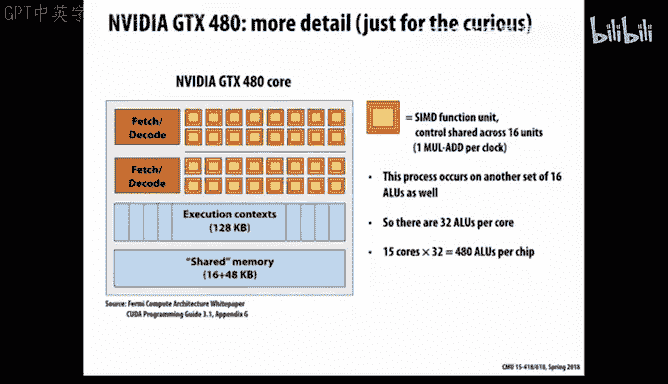

# CMU《并行计算机架构与编程｜CMU 15-418 Parallel Computer Architecture and Programming sp18》 - P2：Lecture 2 - 1-19-18 - Carnegie Mellon University.zh_en - GPT中英字幕课程资源 - BV18b421J7cA

So just if you're you might not have seen this， but I just announced on Piazza。

Recently that I'll be holding office hours this afternoon right after class for those of you trying to get moving on assignment1。

 otherwise our regular office hours will start on Sunday and you can see the schedule on the staff webpage。

So， that's。And I won't normally make announcements like that。

 except that this was such an recent post， and I know a lot of people will be pretty busy this weekend trying to get moving on assignment one。

So today what I want to do is talk about sort of a hardware perspective on parallel computing and make use of the sort of types of processors that you're familiar with in a laptop or desktop machine。

 a conventional processor。But then sort of show how that's been adapted and modified some of the concepts in it to create GPs。

 graphic processing units， which are a very important class of。Machines nowadays。

 for parallel computing。And I think the main theme of this is you'll find that in order to exploit parallelism。

 the hardware people have sort of set up potential for parallel computing at many different levels in the hierarchy。

 some of which are invisible， nominally invisible to the programmer and others which the programmer or the compiler must explicitly generate the appropriate code for it to do。

 And so this is a case where you kind of have to understand the hardware well enough to do the software work that will make the hardware reach its maximum potential。

I was so impressed， by the way， with my guest lectures。

 toys that I went to the Apple store yesterday and loaded up on them。😊。

So you remember from last time there was a discussion about what's been the problem。

 what happened in 2004 that had changed the face of computers in a very significant way。

 anyone remember。Yes， basically that picture of reaching the the power wall that once you go above about 100 watts on a chip。

It's just too darn hot。 Imagine a light bulb， a big， bright light bulb。Trying to put it in a box。

 you need a very large fan for that to work。And， of course。

 it's especially critical for something like a phone because not only would your battery disappear in about5 minutes。

 but also， you get a really hot and uncomfortable feeling there。So anyways， that was the。

 the sort of。Plaau that was hit。 I mean， people knew it was coming。

 but somehow nobody was prepared for it。 And it absolutely totally changed the face of things。

 And the shift for that has been。嗯。We've gone all parallel and all the sort of future predictions about how you're gonna get more performance out of machines is through parallelism。

And then what was it that you， you guys sort of wrote or implemented a few parallel programs last time involving adding numbers。

And so you saw some of the challenges for that。 You saw problems of load balance。

You saw problems of communication latency， You saw problems of underutilization when you're all trying to work collectively。

 But each of you probably only spent about two seconds a piece doing any real computation。

 And so in a way， the machine was very underutilized。

 So those are the kind of themes that we saw in a physical demonstration。

 But those show up over and over again in the real world as well。

So today is sort of a computer architecture， and as I said。And we'll look at performance。

One is parallelism。 The other is a big theme of this course is one of the biggest problems of scaling up computation is often just getting things from memory。

 from some or from one place to another more largely。 And you can have lots of parallel units。

 But if you can't feed them the memory values that they're looking for， then they。

 they won't be very useful。And so again， these are sort of ideas that we。

 well pick up and use in many different forms throughout the course。So let's look at parallelism。

 And we'll use this very simple piece of code as an example。 And what you'll see in it is that it。

The outer loop is over n， and n is basically n independent values of x for which we want to compute sine of x。

And we'll use a tailor expansion over some number of terms。

 And so you can think of that for each value of x， we want to expand out that equation down to， say。

15 terms and。But the main point to notice is that these are all completely independent of each other。

So you'll see we're computing over this value I。And there's no relation。 And this。

Within this group over I， you see that it's only referencing values of I or values that are the same across all values of I。

So this is sort of the perfect example of parallelism。

 what sometimes it's called embarrassingly parallel computation。

 meaning that you just have a bunch of completely unrelated。

 independent stuff you're trying to compute。 And so in principle。

 you should just be able to expand out and do as much of that as you have resources available。

So let's imagine we've compiled this code。And we we convert it and of course。

 the compiler generates assembly code and in 213，513， we all learned X86 and this is not。

 this is some generic assembly code that looks vaguely like either arm or MIPS code。

 so something we don't really cover you might not have seen， but in general。

 you should understand the general idea of it anyhow。

 and the main thing I'll say throughout this term， if you're used to X 86， especially the。

Remember the version that we look at the so calledled A and T format that 213 uses is it usually this code。

 everything's written backwards。 So， for example， this instruction here。ItMeans r0。

Gets the memory value that's read where you get the address from R1。No， that's kind of hard to read。

That's the left arrow。 So think of it。 The destination is on the left and the source is on the right。

 which is actually the more reasonable way to do it。

 We just had to get used to the sort of backward version that A and T code is in 213。

So and that's we'll use code like this。 And really the details of the code aren't that important except to sell and you can kind of guess what those instructions do。

 The first one loads。So it reads from memory and stores it into a register。

 the second one then multiplies register zero by itself。And stores that in R1。

 And then the third one multiplies register 0 by register 1 and stores that in R1。

 So you can see that that computation is for， this numerator computation here， the cube of x sub。

And the， the observation here is there's really not much。Potential for parallel is in here。So， well。

 that's jumping ahead a little。 So we sort of。When we talk sort of a simplistic view of computer architecture。

 you just imagine a machine that just will step through the code  one instruction at a time。

 It will start the first one and finish it。 and then it will start the second one and finish it。

 So it's completely classic sequential execution model。And so if we did that。

It would just tug along one step at a time doing these operations。

And we mentioned last time in class， that since about。嗯。The late 1990s。

 pretty much any microprocessor actually was what they call a superscale or one。

 meaning that it had multiple。呃。A ability to extract information from a single instruction stream and extract parallelism out of it。

 sometimes called ILP or instruction level parallelism。

And the idea of it is that there's sort of replicated logic for extracting instructions out of the instruction stream。

 and then multiple AUs to perform multiple operations in parallel。 but this has to be done。

 This is with just conventional code， no special software。

 And so this has to be done in a way that preserves the semantics of the program。

 meaning that you assume that things have to look as if they're going in a sequential fashion。

And so the problem in this code is you'll see that there's really not much potential for IOP in these instructions。

 I have to read。From memory， before I can start multiplying。

 I have to do the first multiply before I can do the second。

 So those three instructions would have to go in exactly that order without any making use of this super skill or hardware。

So already， it's a challenge to try and get actual true instruction level parallelism out of a program。

And that sort of that picture actually looks like what was called the original pentium processor。

Since。The late 1990s。at least all the upper end processors move to what they call out of order processing。

 and this was covered in one lecture。In 213，5，13， it's chapterpt 5 of a book that I know and love that you might find useful at various points in this course。

 but it's not really the topic of this course。 So the idea is that。

Starting at that point with what they called out of order execution。 at that point。

 it had reached this。We hadn't hit the wall yet， so we are still cranking up the speed of conventional processors。

And what they did was realize we can put a ton of hardware on a chip nowadays and take an ordinary program and extract out of it。

 all kinds of parallelism and get lots of stuff going on at once out of that。

 So the idea of it is to sort of create these souped up。

Deders that would yank a whole bunch of instructions out of the。Instruction stream， you know。

 where the program counter is and where it's pointing to for the next， say，10 instructions。

And basically map them into a new kind of computation。

 sometimes called a data flow computation that keeps track of which values here being generated。

Will then feed which instructions still to come。 So there sort of data dependencies in those instructions。

And then map it through a lot of fancy hardware and control onto a bunch of independent processing units。

That can each perform some subset of the possible operations。

 So this pentium form was one of the older ones， So it had one unit that could just read and write from memory。

 one that could do two that could do integer arithmetic。

 one that could do floating point arithmetic and a separate one that would use the so-called SD instructions that we'll talk about before。

A more recent version of this has a lot more of this has actually two way can load to and store one value at a time。

 It can do multiple floating point operations， multiple integer operations。

 All of those can do these so called SD operations。 So there's a lot of。😊。

Of raw computing power built into these processors。 If they can find enough stuff to do。From the。

 the instruction stream。 And that's not really the topic of this course。

 So we're not going to spend a lot of time talking about it here。

 but it's important to recognize that。At the sort of low level of even your pure sequential code。

 a lot can be done to make it run faster or slower based on how you write that code and how clever your compiler is。

There's also a lot of control logic that tries to kind of predict what's going on and deal with it when it predicts incorrectly。

 So， for example， that black logic shows what's called the branch target buffer。

 which keeps a record of all the， for all the control flow instructions， the jumps。And so forth。

 where they've gone in the past， predicting that they'll go there in the future again。

So to try and instead of having to wait and see if there's a conditional branch。

 which way it's going to go to basically guess and start predicting as if you are certain that's the way things will go。

beging executing those instructions。And hopefully it made the correct guess。

 and it can just zip along without having to wait for this conditional branching logic。

Or if it mis predicteddicted， it basically has to back out。

And undo the effects or actually what it does is doesn't commit those results to the actual registers。

 it will just flush away and act like it was a waste of time。So a lot of logic to do that。

And all that's managed by this lower black box called the retirementti unit that keeps track of which instructions actually should be completed and updating this state accordingly。

As an aside， you probably heard this latest。Couple of， of malware attacks。

That just got a lot of press， right， What are they called。Kneleltdown inspector。

So those involved some very clever people figuring out that this logic。Essentially。

 leaks information about what other processes are doing。

And it's hard to imagine how complex it is to exploit these。

 But what and people knew for years that there is this potential here。

 But for people to actually be able to exploit it， that's the new revelation。

 So the point is that if I mis predictdt a branch。嗯。

And I start executing some code that accesses some parts of memory that I wouldn't normally have the privilege to do。

Then I can look at the cache behavior of that and see whether I get hits or misss。

 And that gives me a little bit a tiny bit of information。 The conditional branching and the。

 the cache timings Give me a little bit of information about what would have happened if I'd actually access those memory locations。

And then this gets marked as failed。 You know， it fails these tests。Because it's out of。

 out of the range of valid addresses for this particular process。 But it gets。

 it leaks information via timings。And via changes to the branch prediction logic that can be exploited essentially。

 and you'll see that they're describing that they're extracting this information at relatively low rates in terms of bits per second that they're pulling this information out because you have to run over and over again and set it up in various patterns to get information from these timings。

 but that's in essence， what those are。 And it's really a huge problem because this is right down in the dirty。

 the main part of the hardware that's the most performance critical part of the whole system。

And so to make it so that this information doesn't leak out， No timing。

 These timing based attacks can't occur is really trick。

 So that's an interesting aside that happens to be in the news today。m。So anyways。

 if you look then up through 2004， people were the hardware designers were just adding more and more of this hardware onto the system to improve the performance of conventional code。

 essentially extracting only very low level parallelism out of the code itself， dynamically。

 as the instructions were fetched out of the。The instruction stream。

And so you could think of that the chip was dedicated to first a very big cash。

And a lot of control logic to do this out of order execution and branch prediction。And so forth。

 and actually， relatively little， the AOUs， if you look at the hardware， you know。

 the space on the chip actually took relatively little space。

 and now they've added more and more of those because essentially the hardware is free for that and the biggest problems have to do with this control logic and making the cache bigger。

So that's sort of where the things were going。But now as you know。

 we're in a different era where we can't just， first of all。

 they could only squeeze so much juice out of this rock that they could only extract some amount of instruction level parallelism about a three to five fold parallelism。

 and then there just wasn't more because the programs weren't written with parallel computing in mind。

But also， because this was just more and more， they couldn't just shrink the transistors and run the chips faster because they reach these power limits。

So the idea then was to say， well， if we're going to use all this hardware instead of just building one giant monolithic processor。

Let's。嗯。Let's go ahead and split it into multiple processors that each of them will be somewhat less capable than the original。

 but I'll have two of them。 So if you imagine， for example， these。

 each of these is 25% slower than the original one。啊。Or。7， the perform5， the performance。

 But if I have two of them， that would apparently give me a potential for a 1。5 times speed up。

 And so I'm ahead of the game。嗯。Well， there's a problem that this program that we've written is it' a pure sequential program。

 It has no parallelism in it at all。 So how am I supposed to， if I map this onto that machine。

That I just showed， it would only use one of those two cores， and it would run it 。

75 times the original program。 So that didn't seem very attractive。So one option。

 and this is essentially what the first part of the assignment 1 does is say。

 well I know how to write threaded code using P threads， and so here's a simple example。

 what I'll do is split my n numbers into two pieces of size n over2 approximately plus or minus1 each。

And I'll spin off one thread that we'll do。The first half of those numbers。

 and then I'll let my main thread do the second half of those numbers。

 so it's a very straightforward split， and of course it works in this case because this is a very trivial program to parallelize。

But it's kind of a pain now from a programmer's perspective， P threadreads is as you know。

 not a lot of fun to write the code for， and you'll find it's an even harder one to try and optimize performance on。

 there's just a lot of places where the code doesn't get the kind of speedups you'd expect it to。

So let's imagine instead， we had a more perfect world where we had a language where we could sort of describe this idea of embarrassingly parallel computing。

 We could say。😊，For all values of I between 0 and n -1。Do the following somehow。

You figure out software， you， compiler slash hardware， how to do this。

And it works in this notation here， because， again， if you look at that loop。Each iteration I is。

 is just a completely pure and independent computation from any other value of I。

 So there's nothing really there that has to be synchronized or coordinated or sequenced in any way。

 So this could be you could imagine。One version of it， just putting this into K different threads。

Spawnning K - one of them。啊。Having each work on their appropriate parts of it。

Come back together and get the result。 And so that's actually a kind of parallelism we'll look at later this term。

Another version might try to say。Well， let's look at a lower level of hardware because we're really trying to do the same computation for all values of I so we can kind of lock step these together and we'll look at that today as well。

So let's just imagine for a while。 And there actually is a language that has this general look and feel to it that you'll be using in assignment 1。

So once we have that kind of notation and program， then we can say， well， now we get to。

Sort of do whatever is the optimum trade off that we can build more but less capable processors。

 but we can。On a chip， but we'll be able to。Get parallel them that way。 And， and by the way。

 one thing you might ask is， well， how is this actually saving on power， It seems like you just。

Trying to。Run a bunch of processors at the same time， you're going to heat up the same way。

And to some level， that's true。 but it turns out that a big part of the power budget for a chip is the cost of driving signals from one part of the circuit to the another。

And so if you have a big processor spanning a big chip。

A lot of those signals have to go all the way from one end to the other。

 And that requires a big w in drive power to make that happen。

 Whereas if you have a smaller number of ones， then your communication cost。Is less。

 so there is some actual advantage。Just in pure power budget and also in time budget。

 because you can。You it doesn't take as long to get a signal from one side of the chip to the other this way。

So there's sort of you can imagine you know， coming up with various models of what the trade off is between power。

 performance。And a chip area and coming up and saying， now it's assumed ideal speed up。

 and you could come with forgiven technology， what would be the ideal number of cores to put on our chip。

And there's actually some， you can buy various。systemsystems that look a lot like this， in fact。

And you can see that a lot of the commercial designs have essentially done that analysis and come up with their own answers。

 And， of course， they have to do it。They don't often have control over the software。

 and so they have to do it based on their their estimation of what their customer software is going to look like in terms of these。

 how much can it be run in parallel， how much work will they do to make it go in parallel。

But you'll see that all modern processors have at least more than one core。

 even the ones in a cell phone or a laptop have at the very least two cores and often more。啊。And。

As sortr of an extreme version of that is these GPUs。

 graphic processing units took the idea of core and really pushed it even further。

 They sort of throw out all that baggage of branch prediction out of order。

 control logic and stuff and say that is just more ways to not get your computation done。 You know。

 it's just control logic。 that is。Not actually doing the real computation your program is asking for。

 and instead stuff this hardware with as many cores as it could and control it in a very special way that we'll discuss later。

And so another version of it is Intel created in a series of processes they call Zion Phis。

 which is a really unfortunate。Name has absolutely nothing to do with the zion of like， you know。

 the Zion processors we have in gates。I found this on the Web for reserved passages。 They call the5。

 which is。Unfortunate， Take a look。This is really funny。Reserve passages they call Zon 5。

 which is really unfortunate。That's right I neat。How did that happen。

 somehowhow it thought Siri has been listening to us。Oh。Okay。As technology。 So anyways。

 and we actually have Zion an earlier version of the Zon Ps in the， the gates machines。

 So we'll be using them later this term。And then Apple has gone through a series of chip designs。

 The greatest is called a 10 or 11 in the iPhone 10。And actually。

 one of Apple's big advantages over its competitors has been a very good inhouse chip development group that creates their own processor chips。

Which are fabricated actually， either in Taiwan or Korea。Not by Apple。That's another story。

So as I mentioned， one of the interesting parts of this code is you can imagine that。Theres like。

Each step， another way of viewing this is。Is thinking， I want to do。

X cubed for 1000 values of x all at the same time。 And then I want to， in the inner loop。

 I want to be doing these computations。But over all values of I simultaneously。

 so that's another way if you think of threads as sort of vertical splitting。

 I'll spawn off as many copies as I have of threads and each of them will responsible for taking one value of I or from beginning to end in this computation。

 another is to think of this horizontally that I can simultaneously do all the multiplication the first multiplication of x cubed and then Ill do the second multiplication of x cubed to get X cubed and so forth and step that whole thing one to another at each step doing it for all values of I。

And I can imagine doing that by throwing more A L Us into my processor that are capable of。

Of performing operations as assuming that there's no actual dependencies between the operations I'm performing so that they can all operate in parallel and doing it with a single instruction。

That will control will sequence these things。And so that' sometimes that is called S D processing。

 which stands for single instruction， multiple data。 So the idea is there's one instruction stream。

It's saying add， but it's saying。Add eight values。From eight values in one place and eight values from another and store those as eight different values。

 Sometimes those are referred to as vectors。 So imagine your data is aggregated into vectors of size 8。

 and you can do this all together。So this original program。啊。

We saw is just doing one value at a time。So it's a pure sequential， it would not make use of these。

Different AOs I've got because it's it's referring to just one one data value at a time。But。

 I could imagine。A new class of instructions that can operate on， say，8 different values at a time。

 And that's exactly what you have in the so called Sdi extensions that are supported by。Basically。

 all different processors。 And in Intel's latest iteration of these。

 Well Intel's current iteration of these， it's called A V X 2。

So AVX stands for advanced vector extensions。And the idea of it is you have special instructions that can operate on eight values at a time。

 Actually， it can operate on 32 B。Data at a time， 32 B of data at a time。 And if。

 if you're doing it with， we'll mostly talk about single precision floating point。

 So4 byte quantities， that means it can operate on eight of them。And you can actually。

 through a very painful and unpleasant experience。 you can write C code that operates and invokes these instructions explicitly。

 And so these are called intrinsics。 You're writing C code。

 but what you're really doing is essentially giving very detailed instructions to the compiler of exactly what instructions it should generate。

 what assembly code it should generate。😊，And so you'll see that this。all has the prefix MM 256。

 for some reason they measure these things not in bit bytes， but in bits。 so 32 bytes is 256 bits。

And so there's a special data type called an underscore underscore M256。

 which is just 32 bit bytes worth of information。And then there's in， essentially。

 these very low level codes that tell you what to do。 So， for example， load P S。

 So P means packed single。Meaning a vector is worth of single precision floating point quantities。

And then you give a pointer to the starting memory location。 And you'll see it the upper part here。

In this loop， that what we're doing is we're unrolling this loop by a factor of  eight because。

What we're going to do is fire off a series of vector instructions for the first eight values of I and come around。

 fire off the vector instructions for the next one and so forth and perform that computation sort of in blocks of eight data values at a time。

 but it has this feel， as I mentioned， this horizontal field that we're grabbing。We're doing all the。

 all the multi first set of multiplies for the first eight， you know。

 for eight data values at a time。 then the next ones and the next ones。

 But it's a single instruction。That does this， a special extension to the regular instruction set。

And this goes on， you can look at and you'll see that these all map。Pretty directly into the。

 the operations that were performed in the original code。 But obviously。

 this doesn't look anything like the original code。

 We had to rewrite the whole program in this very explicit notation。I don't recommend it。

If you can help it。But then if you look at the compiled code。

 you'll see it spits out these funny looking instructions。

That are each of those is operating on eight values。 So P S， again。

 is the notation means packed single。 And so it's a vector load packed single into a register called an XM M register。

Using some address。And。And all these various ones， there's the equivalent。 There' is the。

V Mle P is vector multiply packed singles from using two registers as the source and another register is a destination。

So the compiled code then looks very different from the compiled code of our original thing。

 We've very explicitly told the processor how to extract eightfold parallelism out of this code。

So now you can imagine juicing up。If we had our， our mythical 16 core machine， each of which had 8。

Of these ALU is worth of vector processing and I should mention。

 well we'll talk about it in a minute， but at least now just think of it as each SD instruction is operating on eight values and we'll talk about what happens if there are bigger。

 smaller words than that。So， I could potentially then。At relatively low cost。

Because these only take up the real estate of the A Os， which is relatively small。

 sort of juice up and get potentially 128 fold parallel as out of this program。

 But in order to do that， I have to have 128 things that are completely independent of each other that can be done parallel。

 That's question back there。So do this like you mentioned the different processor registers， x0。

 or are they different proposal registers？好。So。And this is in Intel。

 You remember registers like R X and R D X。 Those can only hold 64 bits。

 right The XMM registers are special 32 byte registers。

256 bit registers that are only used that are used to support these vector instructions。

So it's a whole different independent register set from the regular program registers。 Yes。

 the core has all these registers。And。Actually， nowadays， even the regular floating point。

The non vectorized floating point makes use of the XMM registers。

 but it will only make use of the sort of lower4 or8 bytes of that register instead of the full 32 question。

せか長た。Is a comment for。So that's a really good question。

 isnn't there some way I could have my compiler figure this out。

And not have to have me do it with intrinsics。And the idea is， wouldn't that be nice。

And the the longer answer is yes。 and you can go on the web and find。How GCC。

 what it will take to get GCC to automatically vectorize this code。

 And you have to stand on your head and give it all kinds of hints and special stuff and conditions。

 And finally， if it's all perfect， then Kaboom， it will vectorize the code for you。So。Unfortunately。

 people thought compilers would be able to do this。 And theres lot of。

 there's been a lot of work on it， but。Only for very structured。

 carefully written code can it do automatic vectorization。

So an interesting feature about this program that we've written。

As you could imagine exploiting both forms of parallelism， like I said。

 you could have multiple threads， each of which use CID processing to work on chunks of data。

And getting so that 128 fold parallelism。You can imagine via some type of compiler。Actually。

 pulling out of programs like this。But there's a few sticky points in this。

 And so let's look at the Sdi execution that previous example had the advantage that for all values of I。

 I was just doing the exact same thing。And so it's very easy to vectorize。

 But what happens if there's a conditional。So imagine there's some code in there that。

Looks at the value of A of I call it x and does one thing If x is greater than 0 and something different if x is less than or equal to0。

0。It doesn't matter exactly what it does。 but you， you get the idea。 Well。

 the idea in in in the Sdi world is to say， well， I potentially have to go both ways。

 But what I'll do。Is I'll set up a mask。So that， that x greater than 0 is a test that's performed on all eight values of x。

In parallel， and the result will be either true or false。And now I'll use that。

Set of truths and falsess as as a so called mask that determines what takes place next。

 So in particular， for all the cases where it's true。

I will go ahead and perform the operations that are was。

But I will disable the operations that are marked as falses。

 either I won't perform them or if I perform them， I won't save the results in the I'll prevent them from actually writing to the registers。

And similarly， I'll then do another phase where I'll say， okay， now let's flip that mask， invert it。

 and use that inverted mask to control the next sequence where I do all the work of the elses part of the branch。

And I enabled the ones that were false originally and disabled the ones that were true。So basically。

 you've taken this。This branch， and you've flattened it out into code that you can execute。

 so-called straight line code and just chug through it。 But for some of the data。

 we will allow those updates to occur and for others， we won't。

 And so that you can see as the general idea for how to handle this。啊。And of course。

 the problem you can see is， is that。啊。If you， if I。At best。

 I'm going to only get sort of 50% efficiency out of this。 if I have a。Two way branch。

 and their roughly equal computation has to be performed on each side of the branch。Because。Half。

 half the roughly half of the A Us will be idle on any given operation。So， and in the worst case。

 of course， if if all of them are true， then I don't have to do the false step。

 And if all of them are falses of these tests， I don't have to do the true parts。

 So I can skip over stuff potentially if I can detect that I have sort of uniform behavior。

 But in the worst case， you could imagine I I end up doing something only on behalf of one element。

 So all that fancy vector stuff I had， I'm wasting seven/8s of its computing power。

But the good news is after a branch like that， it sort of then comes back。

Together again and now can resume execution so if there's potential for because I've kept things all synchronized。

 I'm not kind of out of whack all these are at the same point in the program they've just come back together and now they can operation continue operating so that's sort of how the general idea of SD operation works that I can take even datadepend operations and executing them in this way by doing this trick of enabling and disabling some of the instructions。

So the term they use in this。In the Sd world， and we're going to see a lot of this because this is one of the main parts of GPUus as well。

 is what they call coherence And dont that term coherent comes up also when you talk about caches later in the term has evident nothing to do with it。

 So coherence in this sense means the extent to which everyone wants to do the same thing。

 And therefore， I can kind of maximize the utilization of this processing capability。

And anything that gets me away from that is referred to as divergence。

So you can think of converging to the sort of ideal of SMD or diverging away from that ideal。

Makes sense。So， as I mentioned before， the。Like the gates machines and most of the ones of modern era are based on the AVX。

 The current generation is called AVX2。And the idea is that you saw that prefix 256， that。好。

But that's bits。 And so essentially it gives you the choice。

You can actually do byte level operations on 32 bytes independently， like byte and and or。

 even byte level addition and arithmetic operations， similarly for shorts， you know，82 byte data。

4 byte data and 8 byte data。And what happens with these is。

 so the hardware is always working on 32 B。 It's just how those are broken up into blocks。

 And it has enough。Logic in there to do in parallel。Say。

As many multiplies as you're asking for and also floating point operations that can work on single precision or double precision。

And it's just the difference is it will'll only do four double precisions simultaneously。

Or a single precision simultaneously。So。And then the。

 the next generation of it that's just sort of around the corner and the Xon Phis that I mentioned that we actually have here use。

 they didn't go from A V X 2 to A V X 3。 They went from A V X 2 to A V X 5，12。5，12， of course。

 being the number of bits now and having nothing to do with the generation。

So they just did the obvious expansion to do that。嗯。And so that's nice。The the。

 the people I know that sort of know about this stuff say that's probably about as far as they should take it。

 that there's just not that many。 when you try to vectorize these things like divergence。

 how long are the vectors that people really operate on and so forth sort of argue against。

 just keep making the vectors longer and longer。 So the the sort of。

Common belief is this is as far as the 5，12 will be as far as they go。

But it's important to remember that this has to be the hardware has to be very explicitly told to perform these vector operations。

 And so the code that's generated is explicit specific to vector operations。

 And either you need a terribly clever compiler or a terribly patient programmer to generate that kind of code。

😊，And again， you can inspect the dot S files， the generated code。

 and you can see if your code got vectorized or not。So now let's talk about GPs。

 And GPUs are a kind of different beast that they give you essentially this model of， of。

It's called sometimes called SMD， single program multiple data。 So it gives you an image not of S D。

 single instruction， multiple data， but single program， multiple data， meaning that。

Different parts of the program can be doing different things。 But underneath the hood。

 they actually use Sdi to implement much of the logic。

 They use this sort of heterogeneous approach to， to getting this parallel。So at some level。

 you express your computation of saying， I want n different additions to take place。

Adding two vectors of n values each and producing an n value result。

But also with the capability of enabling and disabling which ones actually happen。啊。And then the。

 the hardware will figure out， since it doesn't actually have。

A million units just all sitting there ready to go。

 it will figure out how to parcel that out into blocks where the underlying block size is actually 32。

32 values， not 32 bytes。And so that's sometimes referred to as the Sdy width， which， as it mentions。

 they range from 8 to 32， but currently most of them are 32。

And so they are using the SD as this sort of low level implementation issue。

 and we'll see that this divergence is something that you have to。

 as a programmer be somewhat sensitive to。So just to give you a sense of some real hardware。

 the gateates machines。That you're using for your first assignment are a fairly recent 2016 model of Zons。

 and they have four cores。Each of which is has an actually AVX2， AVX generationration2 support。

 which if we think about for the purpose of this class， just think about4 byte data。

Itans we can do its like having AOUs that can operate in parallel。Later in the term。

 we'll be using a cluster that you can you can also make use of it， only handles batch jobs。

And it's a bigger version of the Gates machines。With 12 cores。

We also in the gates machines have attached to them NviDdia， fairly recent models of NviDdia。GPUs。

 and they have 20 cores。Each of which has 32 AOUs that， like I said， support SMD。

 but these cores look very different from an Intel processor core。Like I said。

 they sort of threw out all that fancy branch prediction。And a lot of that logic。

 in favor of much simpler control， but therefore the ability to do more work， you。

 more AOUs stuffed into the same amount of space。So in principle。

 if you add up the sort of raw compute capability across this whole thing。

 it can go at  eightter flops， 8 billion trillion floating point operations per second。

 which is well， it's a lot of  tariff flops。Right， a Zion。If you max this out。Let's see。

You can go a couple of gigapflps a piece。Per times 8。Say 20 per core times four cores。Is。You know。

 less than 100 gigapflps。Whereas a。We're talking。Potentially 8 tariff hopps out of the Nvidia。

 So that's an 80 to1 just in raw compute power difference。

So you can see the trade off by sort of casting out all this fancy control logic and spending all that on。

嗯。ALUs， you can get a lot more raw compute power。 It's a question of whether that can be used by programs。

So。Putting that together， then。For parallel execution。

 we can see that there's sort of both types of execution。

 there's multi corere and SD and of actually three kinds。 and then the low level。

 what's called superscale are exploiting instruction level parallelism out of sequential code。

And as you can imagine， if you can get all three of these working for you。

 that's what will get you real performance out of one of these machines。

So that's sort of getting computation done。 But what we'll find is an often more challenging problem is getting data in and out of the system。

And so we'll refer to that in terms of memory。So the problem is that。As you know。

 we've been able to make chips that run faster even despite the sort of power challenges。

 and we've been able to make memories that get bigger。

 but one thing that hasn't improved a lot over time is how much the time to get a bitete from memory into the processor。

And not that's the latency， as well as the throughput。 How many bytes can we stuff。Bs per second。

 can we run through the sort of very relatively narrow set of wires that link the memory to the processor？

So a typical number would be the DRAM access time， the memory access time would be measured in。

 say 100 nanoseconds， whereas a one gigahertz processor as a one nanosecond cycle time。And。

 of course， most processors are a couple gigHtz。 Similarlyly， the memory bandwidth。

 How many bytes per second can we get would be measured in some tens of gigabytes per second。

Which sounds like a lot， but it isn't if you're trying to feed something that can do 8  tariff flops。

8 trillion floating point operations per second。Then 20 gigabys per second doesn't sound like very much。

So what happens in the hardware is if it tries to do a read。

And the memory is not available in one of its closest in caches。It'll stall。

 It'll basically stop the processor。And wait until that gets filled， Actually。

 it'll keep the processor going， but that little unit down at the bottom that was the memory interface will basically just hang there and not return a result。

 and therefore the program will kind of hang there and wait until that memory value is available。啊。

And so that's a huge issue of the sort of latency of it。And that， of course。

 is part of the motivation for cacheching。 If I can take some of the data。

Most critical data and move it into a smaller， faster memory than I can and I can keep most of my axises confined to those caches。

 Then I will' have this 100 nanosecond waitency。 I'll have more like a one clock cycle waittency or maybe a five nanosecond waittency or something much closer to the clock cycle time。

And that's part of the reason for having these multiple levels of cache that you see。

 typically three levels on a machine。 The other thing you'll find is that on a multico machine。

 usually the cosar in caches are private to a particular core， whereas the L3。

 the larger cache will be shared across all the cores。

 And that's actually good and that I can communicate values between the cores by writing to memory in one and reading from the other and having it go through the L3 cache instead of having to dump all the way out to。

The main memory， the DRAM。So caches actually help you both for latency and bandwidth， latency。

 as I said， the difference between 100 nanoseconds and a few nanoseconds。

 and also bandwidth I can get because these caches are all on the same chip。

I can have a lot more wires that are a lot shorter and therefore get a lot higher bandwidth through them than I can going across the external chip。

 the DRAM chips and through the memory bus。So one thing that's gone on in hardware。

Is to try to guess， just like it guesses which way a branches will go。

 It also tries to guess what memory locations you're going to access net。And that's called prefeting。

 So it basically， if it sees a pattern going on that I'm accessing every fourth。Memory location。

Because it's some loop。It doesn't actually look at the code。 It just access， It sort of notices the。

 a pattern of， of addresses。 And it guesses that I'm going keep。Accessing according to that pattern。

 and it will actually start shifting， doing reads from the main memory into the caches to anticipate their need。

Which， by the way。Week's information。Of various sorts here。Based on what hits a not。

 but that's another point。But if I can do that， then at least I can reduce the impact of some of this waittency。

 If I can sort of anticipate where my fetches are going to occur。

Then I can get that going so that by time the time I actually hit the instructions that will do that load。

 the data will be available in cache。And essentially， all hardware does this now。So。

This happened to be some pictures that you've probably seen before。But what turns out。

 if you look at like the different editions of our book。You'll see that they actually look different。

 not just because some have， you know the y axis has changed。

 but the actual qualitative look is different。And part of it is prefetching。 So just to show you。

This is。This result was measured in my house。 I still have a 2008 vintage Mac and Mac imacac。

 and it used a processor that was quite the nice thing in its day。

 But you'll see that you'll remember with the memory mountain that。

This direction is the total amount of memory。 I'm stepping through an array of data。

 and this is the total array size。And over on this left end， I'm accessing one word at a time。

So what happens is up here， I'm in the L1 cache。 It's a very small amount of data。

 I'm cycling through it over and over again。 It's all in the L1 cache。 Life is good。Here。

I've gotten outside the L1 cache。 I'm filling up the L1 cache， oops。Mis， miss， miss miss。

And then I come back around and all that stuff is gone from the L1 cache。 so it's sitting there。

 it's comfortably in the L2 cache， and this drop in bandwidth is due to the relative performance of the L1 versus the L2 cache。

And then here， it falls into the main memory。 And so this system had an L1 and L2 cache。

 and then main memory。This is the gates machines number 32。

 and you see how much less this drop off is。 and it's not because the cache got oh and also there's an next hump because this is the L2 here。

 It's a relatively small bump， and then this is the L3 in here。嗯。

So but the main thing I'm pointing out is how much less？

The degradation is when you drop out of L1 into L2 and into L3， and that's prefetching。

The thing is seeing my pattern and it can't reduce， it can't improve throughput。

 but it can decrease latency， it can anticipate where those are occurring and stage those reads in advance from the main memory into the cache and keep it going。

But you'll see that once I fall out of L3 cache。I'm in trouble again。 I'm still just banging on the。

 the limited bandwidth capability of my memory bus。So anyways， you can see this effect。

's you have to go back to some pretty old machines or like I did this on a raspberry pie， you know。

 something like that in order to see what looks like without prefetching nowadays。

So now there's another way we can try to。Squeeze more， avoid these wait see problems。

 So the problem with wait see is。I'm。Basically， I'm stuck waiting for something to happen。

 a read to occur from memory say， and there's not much I can do until that's completed。

 And so the processor isn't really being used very well。 It's stalled。So what if there is？

happened to be some other instructions from another thread。That I could execute at the same time。

While I'm waiting for the read from one， why don't I execute a few instructions from the other？

 And so that's what we'll call multi threading。Where we're interleaving the processing of independent threads of execution。

On a single core。And here we'll talk about this as a way to avoid wait see。 So imagine， for example。

 we had several different threads。And the first one， imagine it's like these vector instructions。

 so it tries to do an eight way load into a vector register。And Kaboom it stalls。

 The value doesn't isn't in the cache。Well， what if I had another thread that also had eight reads ready to go。

 and I could just fire that off。And， and start that computation。 And it will hit。

Potentially the same vector load in its code。 Imagine they're executing the same program。Andtall。But。

 hey， I've got another thread waiting and so forth。 And so now basically I can。

 in the roughly the same amount of time I was spending for one thread。

 I'm executing multiple threads。And so what would that take to do that， It would take enough logic。

 well。I still have the same AU， but basically I have multiple what I'll call execution contexts。

 and execution context is minimally the register state of each of those threads。

And enough memory to store。Say the stack or at least the current part of the stack and other parts that are needed to execute each of the threads。

 and ideally you'd have as much also you see these wall all these threads willll be sharing the same caches and so forth。

 So if there isn't enough memory， they could start crowding each other out。On the other hand。

 they're sort of filling in the gaps where nothing useful would be happening anyhow。

 So we're not really losing much ground question。Yeahそる。本人。就声系の。Well， this is hyperthing。

So that's what we're leading up to。 You've probably heard that term hyperthing。

 And hyperthing is a form of this， exactly。Of multiplexing。

Multiple instruction streams on the same core at the same time。Okay， so， and it's also the same。

 We'll see that both GPus。And。Conventional processors use this same idea in slightly different forms。

But that I'm leading up exactly to that idea。So this is sometimes referred to as throughput oriented computing。

Meaning that I'm not going， because you'll notice in my example here that I actually。

Gave up some performance of my single thread， my first thread。

 because there'd be times when one of the other threads took priority over it。

 and I wasn't executing it， even though it was potentially runable。 I'd completed that stall。

 and I could have gone。 if I'd had the resources available。

 But I get held up waiting for another thread。 And in general。

 that's a theme that we'll see in this course a lot is。Often。

 the the advantage of having lots of parallelism is you can shift your。

Critical resource from time to， or latency to throughput。

 How much stuff could I push through the system。And this interweaving is a technique or multiplexing。

Is a technique to build more sort of hide latency by increasing throughput。

And that's a fairly critical idea。 Yes， question。Who should use these threats use these threats。What。

 what that'll depend on， I'm gonna， I'm talking in very general terms now。And in a minute。

 I'm going to fork whether it's a CPU or GPU。 And the answer will be different for those two parts。

Okay， so that's a good question。 And I'll be getting to that idea shortly。And the hardware， too。

 by the way。 So we'll talk about that。But the main point I'm trying to make。

 and this is a very general point is often you can through parallelism。

 one of the big advantages is it turns your critical resource into how much stuff you can pump through the system as opposed to how much time does any particular operation require。

Throughhput is easier to achieve。High throughput is easier to achieve than low waitency。

But there is this tradeoff that if I only have one thread I'm trying to run on this processor。

 I can devote the entire L1 cache to it， and I only have to have the register state for those registered。

If I'm trying to hyper do this multiplexy across 16 threads， then I have less storage。

 I can devote to any given one of them。And you get the idea。So， this shows。The general scheme。

For how that maps。 and this is called Intel， is called this hyperthing。

The the non commercial term for it is simultaneous multi threading。And it wasn't invented by Intel。

 by the way。They don't get rights to the naming， but the idea of it is in a modern out of order processor there's so much hardware there for doing other stuff that it's relatively cheap to throw in enough logic to support a couple of threads running on it。

 What you have to do is replicate the registers so that each of the threads has its own independent set of registers。

But they can share those execution units down there， and they can share the memory。

And the caches so that you can do that trick that I showed there of if one of the threads get stalled due to a memory problem。

 you can just- the hardware can just jump and execute another thread。So what happens with。

 and we're not going to spend a lot of time in this course。

 because this is really more the topic of a computer architecture course。

Then because it's not really a software issue。 But what happens is。

This hardware up here is sort of grabbing。Raw instructions out of the instruction stream。

 And you have enough of that to do it out of multiple for the different threads。So you end up know。

 sort of sharing that。 And at any given time， some logic is deciding which of the instruction streams I should be extracting instructions from。

But remember， I told you that sort of then forms this pool of operations that can be performed based on data dependencies。

 And those get mapped down into these functional units。 And so when that happens with hyperthreading。

Essentially， you're mapping。2 independent， you know。

 collections of operations from the the two different threads。

 or however many threads you support with this into this， these instruction units。

 and each of them will fire up。And go in parallel。And what happens， for example， on the memory case？

Is you'll load up a series of memory operations into there。And each of those can fire off。

 and it can detect when there's a dependency。Or when these are independent。

 So if there's two different threads in there， they just go in whatever order they happen to go in without。

Without any， you know， fancy， without any O S involvement at all。

 So the hardware is actually making the low level decisions of scheduling these operations in the case of hyperthing。

 But it's up to the O S to have mapped multiple threads onto this CPU。

So that it can apply hyperthing to it。So the O S scheduler is mapping the which threads go where。

In a multi core hyperthed processor， but the hardware here is deciding how to actually interleve the computation of these two different threads。

And it does it dynamically， based on which ones are waiting and which ones are ready to go。

It's actually pretty clever。So but the main idea of this is with multithreading is we're trying to make better use of the hardware of available。

 we're trying to hide the effects of these stalls by having more things we can do to fill in the gaps。

So again， imagine we had this。We're juicing up from our multi core SD multi threaded logic in this case that we' would。

Potentially have 512 way parallelism going on。 Well， we'd be limited， in fact。

 by what the A O Us could do for us， but。All this assumes that we have like 512 different things to independent computations that can be performed。

 And really， we could just sort of totally saturate the hardware and get it working at its maximum speed。

And so you can think of a GPU。As sort of taking this out to a whole different space in performance。

 So like I said， you can think of a modern CPU as having thrown starting in a world where we're just trying to extract maximum performance out of one thread and now saying。

 okay， well， I've got more than one thread。 but I still on a lot of performance out each of those ones。

To saying I'm going to have just really crappy performance on a per thread basis。

 but I'm going to give you a lot of threads。 You're going to really like this And it only works for places where the computation is extremely structured。

 and you can imagine it starting in the world of computer graphics where you have all these pixels or rectangles you want to shade things that are really very low level operations that you want to do the same thing over and over again on。

😊，So， let me。So in the world of GPUs， we're looking at NVIDdia， this sort of dominant manufacturer。

 but there are other companies too。What they referred to as a warp。

Is a collection of 32 SD operations that can be performed well。

Operations on 32 vectors of size 32 data， not bytes。In the Sdi mode。 And there's a little bit more。

Funkkiiness to this， this one is based on a particular model。That the hardware actually 16 A L Us。

 and it does what it called double pumping them， meaning that it would do first half。

 then the other half of the vector in order to perform a vector operation。 And as two of those。

So it has actually 32 AOUs。Each of which gets double pumped。 So it's going。Basically。

 it's getting 32 way parallelism at twice the rate。 Anyways。

 it's hard to exactly reconcile all this stuff。 But the point is that it's it's got。

A warp is a computation over- think of it as a vector instruction over 32 values。

But now what it will do is manage。嗯。Let me see。 I'm trying to。

I'll come later。Like this model 480 is a little bit older than the ones we have in the Gates cluster。

 it had 15 cores。嗯。And the idea is that on each of these units。

 it actually can process 48 warps worth of data。In， in a multi threaded sort of way。

Not quite the same as the simultaneous multi threadreading or hyperthreading。

 but the same idea that on every given step， the hardware will decide which of 48 different work vector operations to perform。

And it can use the same latency hiding stuff， meaning that if like one of them is a 32 way read from memory and that takes a while to complete。

 it can fill in with other vector operations that are ready to execute right away so it's an extreme version of this throughput oriented computing that its 48 essentially a 48 wired way threading on each of these cores。

 and then it has， in the case of a 480 has 15 of those cores。

And so if you multiply it out， that works in the case where you have 23。

000 some different data values that you can operate on independently。

 then you can keep this whole thing running。So， you know。

 the logical level of concurrency here is very high。

The other thing you'll find is that the memory system is tuned to provide very high throughput and rely on relatively smaller caches。

And even the main memories can't be as as big。These numbers have all increased in the last few years。

 but again， the engineering optimization they've made is is maximize throughput。

 get your throughput up， make sure that you've got enough parallelism to hide the。嗯。

To sort of account for and avoid lots of latency and therefore get very high throughput。

So that's a big part of the way it performs。 And by having smaller caches， again。

 it can devote more chip area to these A O U。So even for the， the relatively bad case for this。

You'll see the final problem is called Saxby。 Or even if I'm just reading in two vectors of data and multiplying them and writing them out。

 So this is actually a pretty bad。好。Performing code， because it has a lot of memory。 It requires。

Two reads in a write for every single arithmetic operation you perform。

What's called low arithmetic intensity to this code。So on this model of GPU。It has the potential to。

呃。Run 400 multiplications， every clock。But that would take a 6。4 TB memory pipe。

 which it doesn't have。 It has something less than that。Has 177 gig。 So in this case。

 what it will do is just run totally constrained by that pipe。And。嗯。But so it's only 3% efficient。

 It's basically starved by memory bandwidth。But that will still be seven times faster than you could pump through my。

 my comparable Zion processor。Because again， the Xion processor is limited。By its 25， Actually。

 the modern Zons are higher than that。 But still， it's。

 it's the bandwidth for memory that will dominate that particular computation。 And so that。

 that memory bandwidth of the GPU is not enough to kept it fully fed， but it。

 it beats what you can put on a CPU。And so one of the things we'll find is often memory speed is much more a limitation than arithmetic speed。

 And that's true for whether you're programming a GPU or a conventional processor。

 And so there's a lot of clever tricks you as a programmer can do to reduce the bandwidth for example。

 instead of computing something and storing it。😊，And using it multiple times。

 you just recompute it wherever you need it because it's a lot cheaper to compute something than to store it out to memory and then bring it back。

 So things that， you know， as computer scientists， we'd find totally non-intuitive become the right way to do things in a world where memory bandwidth is a more precious resource than than performing the cost of performing arithmetic operations。

So that gives you a sort of very high level understanding of it。

 and especially we'll try to refine our understanding of GPUs more over time。

 But you can see the main point of them is they're in a very different space than conventional CPUs。

 and they happen to work really well for certain classes of applications。

 and so they've really taken off in how dominant they've become in a lot of。

And how critical they are as a computing capability in many different application domains。

The biggest class of customers for Nvidia these days are car companies。

And the biggest single customer for NviDdia is Google。Fig that out。 It's pretty interesting。

 the world we're living in now， and how GPUs are changing things。Okay， now I'll just point out that。

The rest of the slides here are things you might want to look at on your own。

They step through the same kind of ideas as we've done before and have you think about these different ideas of where we're going to get the parallelism and what the limitations will be。

 so it's something worth doing on your own and I didn't really expect to do it in the class anyhow。

So we're good， thank you， have a good weekend。