# CMU《并行计算机架构与编程｜CMU 15-418 Parallel Computer Architecture and Programming sp18》 - P30：Lecture 30 - 4-4-18 - Carnegie Mellon University.zh_en - GPT中英字幕课程资源 - BV18b421J7cA

Great， thanks。嗯。I know from an experience that Dave Bahallowan's lecture is really spectacular。

 So I really recommend coming to that。 And I'll bet that thees chess AI thing is really interesting also。

Okay， so today's theme is we're going to some of the frameworks that you've been using are implemented。

 And the first part， first， I'm going to talk about what goes on in an implementation of message passing in the actual movement of the data when you send the messages。

 So I'm going to talk for about 25 minutes。 and then I'm going we're gonna switch and then Professor Raing will' talk about some other really interesting things。

Okay， so。As you've had this experience now of programming both with shared address space models and with message passing models。

And as you know， the， the primitive communication operation and message passing is to send a message from one processor to another processor。

And so the sender executes aend and the receiver does the receive。

 and that effectively ends up copying data from the address space。

 the private address space of the sender into some part of the private address space of the receiver。

 So this is all， I review。 You're familiar with this already。

And so the reason why we see a lot of systems out there that use message passing for a very simple reason。

 which is it's very， very easy to build a large scale message passing computer because you don't need any special hardware other than a reasonably fast internet。

So in particular， unlike a shared address space， you don't need cash coherence or any special support from the hardware and the memory system to make message passing work。

 you could even take， you know， cell phones or know Internet of things。

 devices or anything like that。 and they could all be in theory， you know。

 a big parallel computer by just sending messages back and forth to each other over some network。

 which is hopefully fast。Okay， so。Throughout the whole history of parallel computing。

 this has been a fairly popular way to build these big machines。 So and today in in cloud computing。

 lots of the servers in in the cloud operate this way。

 So when you've got separate blades or you know， separate nodes。

 they don't necessarily have cache coherence across them。

 So the easiest way to make the software work is to use message passing。

 So that's why it's fairly popular。 It's not necessarily popular because's the programmers number one choice for the most convenient way to write the software。

 you may have opinions on this yourself。 having done the assignments。

 But it's really great from a hardware point of view。😊，Okay。

 so now what we're I'm mostly going to focus on is the details of what happens。

 especially with buffering when we send messages， because there are some interesting choices to make。

 if you are implementing a system like MPI。 and it's worth knowing about these things。

 even if you're not building the system， but you if you're just using one。

 you should realize what's happening。 under the covers。

 So so fundamentally when you send a message with a network。

 you take data from as I said from the source， you copy it to the eventually it shows up in the address space of a destination。

 But in order to complete that transfer， there has to be both a send and a receive and they need to kind of rendezvous with each other and then make this happen。

And one thing that's really different about this is that this is fundamentally。

 at least in an abstract level。 This is just one way communication。

 You're just pushing it from the sender to the receiver。 Fundamentally。

 there doesn't necessarily need to be back and forth， Handhaking that's occurring。

 At least at a semantic level。And it turns out that that's going to create some issues， which we'll。

 we'll get into here。Okay。So before， before we talk about message passing。

 I'm just going to show you a picture of what happens under the covers with a shared address space just to contrast it with message passing。

 And you're already familiar with these steps from the discussion of cache coherence and。

 and and so on。But。我。When data is communicated with a shared address space。

 the interesting thing that happens is on a read to a shared address to when you read data that's shared。

 it gets brought into your processor cache。 And that's how data gets transferred primarily。

 So you update the data on right。 But it's a read that pulls the data over to the consuming processor。

So on a read， you take some virtual address， turn it into a physical address。

 The hardware does that and the Tbss and everything。 And now now that you have a physical address。

 the memory system hardware knows where to go look to find that data。

 So maybe it's the home memory node or maybe maybe it's already in your cache。

 But let's look at the more interesting case where it has to go somewhere else and get it like a dirty copy and another processor's cache or the home node。

 So it's going to send a request through the interconnect in the hardware。

 it'll find the data eventually and it'll come back。 So this is fundamentally。

 it's a request and response like a two-phase protocol。

 So you ask for the data and the data comes back and when the data comes back。

 you already have a place to where you're going to put it。

 you're going to insert it into the cache and you already have that location reserved。

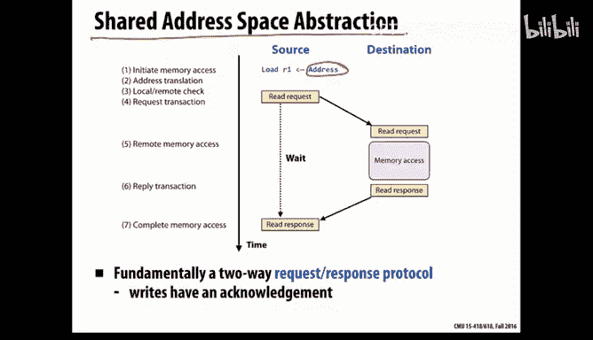

When the data arrives， you're， you're ready for the data。 In fact。

 you're probably more than ready for the data。 The processor has been sitting， waiting around， know。

 patiently， hoping that this data will arrive very soon。Okay。

 so that's what happens on a read in a shared address space。So a couple of， well。

 these points will probably make more sense later when I contrast it with message passing。

 but one thing is that the the address that we're talking about transferring in shared address space is simply the physical address。

The whole memory system understands physical addresses and what they mean。

 If you contrast that with message passing， with message passing， there's a source address。

 and then there's a destination address。 These are two different address。

 And the sender doesn't know the destination address。 In fact。

 even the the receiver know doesn't know that address until the software on the receiver' site executes a receive。

 because it's not until that point that it specifies where it should even go。Okay。

 so it turns out that。As you'll see， it'll look different when we look at message passing。

 but we don't have to have extra buffering or storage in some area outside of the address space right now。

 that probably doesn't seem like an interesting point。 But later。

 we'll see that that issue need to crop up。 And as I said， this is really like a request response。

 protocol for shared address space， which makes it nice and simple。 Okay， so。

Now let's talk about message passing。And as you may recall from many， many weeks ago。

 when you first looked at examples of the grid solver code with message passing。

 you probably talked about a synchronous and asynchronous version of the code。

 and so back then we introduced the idea that message passing could be synchronous。

 which means the sender stalls until the receiver has received it or asynchronous message passing。

 which is when you send it， you just buffer it and keep going， and then eventually later。

 the receiver will receive it and then they'll keep going。Okay， so at a very high level。

 without knowing much about what happens under the covers， if you heard about these two things。

 synchronous and asynchronous， your natural instinct might be to say， well。

 asynchronous just sounds way better， because it doesn't stall the sender。 You know。

 why should the sender have to stall when they're trying to send a message。

 We'd rather just keep going， right。

All right。Sos， let's start by looking at how you would typically implement the actual data transfer for synchronous message passing。

 So this is where the sender stalls until the receiver has fully received the data。Okay。

 so one thing that makes message passing interesting and a bit challenging is that the messages can be nontrivially large。

 So they're not just， say， one cache line。 they could be kilobytes， maybe even megabytes of data。

 possibly。 And in fact， we we told you earlier in the class that sending large messages is a good idea。

 and you probably experience this firsthand。 So sending you know tiny like single word。

 single byte messages that results in a lot of overhead。

 It's a better idea to group together that you descend these larger messages。

 So the system has to support transferring you know， well， first of all。

 they're arbitrary length messages and they can be large。Okay， so when you want to send a message。

 the， the， the sending processor。okay。Little fun with that。Okay。Oh， all right。

 maybe it's just a pen that's not working。 that's far。 okay， so I'll try my finger。 All right。

 that works okay。Okay， so the sender is trying to send the message。 So they execute the send。

 I think it's a little less precise here。

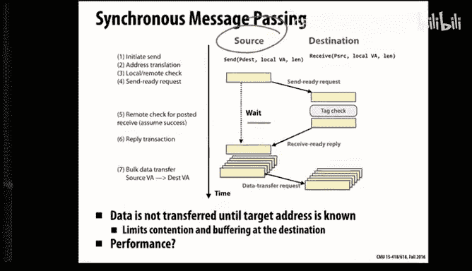

So here's what will actually happen。 It does not yet。

 it needs to notify the receiver that it wants to send a message。

 but it does not yet send the actual data from the message。 Instead。

 what it does is it sends a short message that says I have a message to send to you。

 here are you know， here's the tag。 And maybe the parameters of sending it。

 but I'm not yet sending the actual data。So this will arrive here on the receiver side。

 so they will look at， you know， sometimes you can have types for messages。

 So you want to make sure this matches the type of message you're looking for。

And assuming that the receiver has already。Executed a matching receive。 Then it's ready to。

 then it wants the message。 So you figure out， okay， yes， the receiver wants that message now。

 And then what happens。 So then it under the covers， this acknowledgement。

 this reply message is sent back to the sender saying， we're ready to receive it。😊。

And it will tell it， oh， by the way， here is， here is the target address。

 This is where it should go when it gets transferred。And now。

 when the receiver gets that message back， it's ready to transfer the data。

 And the nice thing is that now it's just， it is like a DMMA transfer meaning direct memory access transfer。

 It's just copying it from a known location in the address space of the sender into a known location in the address space of the receiver。

 because now the sender knows the destination address。

 So this is just copying things through memory question。😊，それで？嗯。The DNA。

Is why the senator needs to know。Yeah， so a nice thing is so once the now that the sender knows where to put it。

 it can just get copied straight into the address space of the receiver。

 So we don't need any extra extra buffering outside of the address spaces of the sender。

 the receiver in this case。So， okay， it turns out that。That from an implementation point of view。

 this， this approach is， is appealing for a variety of reasons。 It's， well。

 the main reason is that the data transfer should always work smoothly because once the sender knows where to copy it。

 it can just copy it to the right place and then we're finished。The main drawback of this approach。

 of course， is performance。 So the sender has to wait and stall until the receiver is actually receiving it。

 So in this picture， I drew it so that the receiver had already executed the receive。

 and it was actually ready to receive it。 So in that case， the sender would only be stalling。

 waiting for you， a message to go to the receiver and then come back again。 But remember。

 the receiver may not even be near the point of executing the receive operation yet。

 So you may stall for an arbitrarily long amount of time waiting for the receiver to get to the point where actually execute the receive operation。

So for that reason， from a performance point of view， this may not be the most attractive thing。So。

 so let's look at asynchronous method passing。 In this case， the sender， when they execute a send。

 the send is going to happen in the background。 They will， it will get buffered。

 and somehow itll just keep executing。 And then eventually， itll show up。

 and the right thing will happen somehow。Okay， so if you were sitting down to implement this。

 it's probably the first way that， that way that may come to mind to do this is if we're going to do this asynchronous send。

 then when we get to that point。 well， so somehow the main execution threads gonna keep executing soon。

 But in the background， let's just start sending the message。So that's this optimistic approach。So。

 in that case。You immediately， sorry， right finger。 Okay， immediately start sending the data。

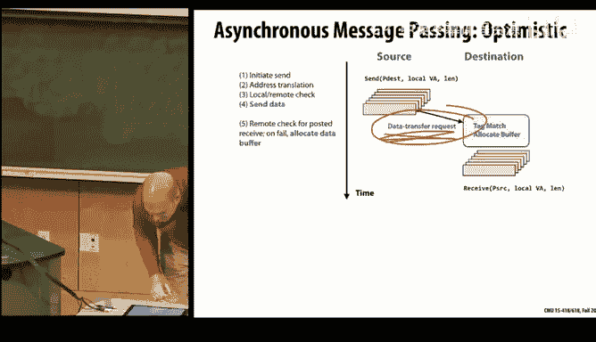

And the data shows up。On the receiving processors。It's been over on that side。However。

 the receiving has not yet necessarily executed a receive operation。 And until it does that。

 we don't know where the data is actually supposed to go in the address space。 So where does it go。

 It has to go into a buffer。So， at a system level， the message passing layer has to allocate buffer space to hold these messages。

Okay， so that eventually。When a receive is executed， then you'll note it。 Well， you'll look and see。

 you'll look in your buffers and see if there's something that you've already received that matches what you're looking。

And if so， then you'll just copy it locally into the right part of your address space。

 or maybe the OS can remap it for you or something like that。nice for that。Okay。

 so from a performance point of view， this looks attractive because the sender isn't blocked。

And it moves the data as soon as it can move it。So that should be good in terms of reducing the critical path of of actually pushing the message to the receiver。

But do you see any， does anything concern you about this，嗯。じ。And the number。Yep， exactly。

 So these messages can be large and an arbitrary number of them can be sent to you from other processors。

 and especially as the number of processors gets larger and larger。

 you can have maybe thousands or tens of thousands of processors all blasting messages at you that you haven't tried to receive yet。

 So this buffer space could grow to be arbitrarily large。

 it could be bigger than the amount of space that you have allocated and maybe even a really big fraction of memory or something scary like that。

Okay， so are these the only two options。 Fortunately， no， these are not are only two options。嗯。So。

Here's， this may be something that you wouldn not necessarily have thought of right off the bat。

 But here is another approach for implementing asynchronous message passing that has some advantages over what we just saw。

 So this is still going to be asynchronous， meaning the the sender doesn't block。

But unlike the optimistic case that we just saw in this conservative， asynchronous case。

 what is sent right away is not the data from the message。

 but a short message saying that you have a message to send。So that is sent。

 That's just a really short message。And continue executing。And then eventually。

 when receive the matching receive occurs， it will look in that's in its table of these request to transfer data that have it's already received。

 itll notice that something that it once has shown up in this table and now it'll send back to the sender a message saying I'm okay I'm ready to receive that data yet。

 and here is the destination address where it should go。When that message arrives。

 there's an event handler and the software that notices that it's gotten that kind of message。

 so it doesn't have to， you know， that meanwhile， the computation has continued executing。

 but you get interrupted and then an event handler wakes up notices that the receive the the receivers ready for the message。

 And at that point， it does the DMA transfer。So， yep。

It kind of has a similar problem for the Sunder because if the Sunder。

Does it need to keep that data once。Like it doesn't know if the receiver is actually interested。

 so it doesn't know how long to keep it around。Yeah， so that's a good， good point。

 So now what we've done is we've， we've avoided， weve in some sense。

 we've pushed the buffering problem into onto the sender。

 So now if the sender is gonna to keep going and let's say that the sender sends lots and lots of messages and the receivers of those messages haven't received them yet。

 that means that the amount of buffering on the sender side may grow and grow and grow arbitrarily。

 perhaps。Now， how scary is that， Like， is that if we compare having。😰。

This growing amount of buffering on the sender side versus having a this growing amount of buffering on the receiver side。

 which， which do you probably prefer to have。Or is it。The same or。Any thoughts on that？

Beable to have it on the send side。もと。呃。Sで。Distributed the。Yeah， yeah。

 and and a nice thing about having。 So what this means is on the sender side。

 if you try to send a message and youve run out of buffering on the sender side。

 then you then you stall， then you just block until those messages disappear。

 So it's a natural type of flow control。 It's just going to throttle back the senders。

 And now their sends are not really asynchronous anymore。 they're gonna block for a while。

 But that's a much easier problem to deal with。 because locally on the sender side。

 you notice out of buffering。 Well， that's fine。 I just won't put anything else into the message layer right now。

 basically just stall And then eventually it'll clear out on the receiver side。

 though it's a problem to deal with because if things keep flooding in。

 it's really hard to go back and say， hey， wait a minute。 you over there。

 Stop sending me things because it's over even sending me lots of things。わそ。O。Yep， yep， exactly。

 that's a trick they use is you just mark the page that you're yeah。

 one important thing in this case is if you， if you。

 if you write to that address in between doing the send and actually transferring the data。

 You want to make sure you're not overwriting the data and then sending something you didn't mean to send。

 So they use copy on write， that's exactly like a really nice trick for for doing that。

 Y Is there anything like。But。Request denied like， I don't。谁呢。嗯m。On the receiver side so yeah。

 we'll get rid of it if it needs。So usually when we write message passing programs。

 we don't necessarily， it would be usually a nasty surprise for the programmer if the system decided to just delete a message that might just cause your program to break。

 So if you end up， however， there can be this mismatch between the timing of sending lots of messages and then actually receiving them。

 So it's okay if we stall the senders but I'm not sure if this is what you're asking you about。

 but you don't want to be like deleting messages generally。

 we want to assume that the programmer really meant to send all the messages that they're sending or maybe you're asking something else。

 but。I'm asking about like a scenario that could cause。Like a。Okay。

 a bunch of messages and then only some of those messages。Like it's discovered at runtime。

 only some of those are needed， but the。That's a great point。 So in a couple of slides。

 I'm gonna get to exactly that。 So we have a fetch deadlock problem that we need to address。 So。

 so hold that thought for a minute。 That's a good point。😊，Okay， so。So， basically。These are。

These are like the most important slides。 So you see these different pictures here。

 There's the synchronous version where you handshake and figure out where you're sending from and where you're sending to。

 And then it's a DMA transfer。 And then the nice thing about this that buffering is never really a problem because these big messages don't ever get transferred until you're ready to transfer them。

 And you aren't doing lots and lots of sends because you block any time you try to send until you actually receive it。

 this approach， the optimistic case is going to immediately send the message。

 but that may be scary in terms of dealing with buffering on the receiver side。

 And then there's the conservative case that we just looked at。 Now。

 the conservative case does simplify buffering problem， but。Is it。

Strictly better than the optimistic case。 You know。

 do you see something What was better about the optimistic case。Yep。お何にて。Something back。Soce。

AndActually they。嗯嗯。Right， yeah， so there'll be the interrupt to do when the acknowledgement comes back。

 and also just if you have a computation where the performance is limited by the critical path of passing data between all the different processor。

 Let's， let's say， for example， you have a task queue or something like that where you're you're trying to get work or access some data and something is getting passed around between the processors。

 if it takes longer to send it around， that's going to hurt performance potentially。

 So here we have a minimum of three hops to send anything， even a really small message。

 So let's say you're just sending a flag you're going have you know several hops， three hops。

 at least just to send that short message。So。One thing that people do is there is， is there。

 is there a way to have。Like the best of both worlds。

 Can you imagine a scenario where you want to have when， when it， when it's safe to do so。

 you want to have the speed of optimistic message passing， asyner's message passing。

But not get into trouble if there is a potential scary buffering problem。So。

If you think of like a hybrid， how would a hybrid approach work potentially。

Choose like a message size that you。To buffer automatically。Like a message size that。Yeah， yeah。 So。

 in fact， so what you do， what。What we do， there's a scheme。I'm have to eight with my finger。

It's not going to look great， but there are the way that you can have a hybrid scheme is to have something that's credit based。

 So The idea is。You will pre allocatecate space a certain amount of space on the receiver side for all of the senders。

 And then at the within the message passing layer， it will advertise to them how much space has been pre allocatelocated for them。

 So let's say it's like 4 kB or whatever it is。 Then when you're trying to send a message on the sender side you keep track of how much of that space you've already used up。

And if you want to send a small message and you haven't used up that space yet and it will fit。

 then you can just go ahead and send it optimistically because you know that there's a place to put it。

Now， now， whenever messages get sent back in the opposite direction。

 you update what the that credit limit is。 So basically， when you send messages。

 your credit limit goes down when they get consumed， your credit limit goes back up again。

 And if you have messages that fit within that limit， you can send them optimistically。

 but if you don't have enough credit， then you do it conservatively， then you just say， okay。

 I would like to send you a message， but I'm gonna have to wait for you to handshake with me y。Slay。

Is。For an entire receiver。Receives give out。The second thing it's per sender。

 So for each each pair of senders， sender receiver combinations。

 So from the perspective of a receiver， it knows how many other processorers there are。 know P -1。

 And for each of them， it assigns them， it preallocs a certain amount of buffer space for them。

 And if they send messages that fit if the total amount of data。

 they've sent us so far fits within that space。 then they know they can just go ahead and send it。

 when they when they run out of space， then they have to do it conservatively。Youing to like。Specify。

But。Only certain。To much。Well， this is actually all done， actually。 in a message passing system。

 this is all somewhat virtualized。 So it's， it's。It's not per hardware processor。

 it's per like message passing layer， sender or instance。

 so it is basically at a process or it's more like at a process level than it's not don't think of it as although I've been showing you pictures where these have been like physical processors。

 it is virtualized a bit on top of that。So you may have processors sending each other messages that are actually on the same physical processor。

 if that can happen。Potentially， not that that's how you would like it to happen， but that。

Could happen。How am I doing。Okay。啊。Let's see。 So let me move on for a bit。

Answer more questions and second。 But okay， so nice thing is。

It's really nice when both the sender and the receiver agree on the addresses。

 because then you can just do a DMMA transfer。 And then that doesn't require any special buffering。

 If you do it asynchronously and optimistically， then you may end up in this situation where you have to put a lot of buffering outside of the address space。

😊，And as I discussed briefly， one way to have a hybrid approach is to have a credit scheme where you each sender is pre allocatelocated a certain amount of space and they can spend that down by sending things optimistically and then get that number goes back up again whenever it's consumed and then the receiver happens to send another message back to that same sender and it will piggy back along an updated credit limit for it。

And the programmer doesn't have to worry about this。 This is all happening at the。

 within the messaging layer。Okay， so there are two really fundamental。 I mean。

 two of the big problems to worry about when you're implementing a message passing layer。

 We've already been talking about one of them， which is。

That your input buffer could potentially overflow。 And we've been talking about the credit based scheme。

 You， there are other ways that you could potentially think about implement dealing with this that aren't necessarily very good ideas like you could just。

Basically refuse to accept more messages or you could drop packets or things like that。

 These are not recommended ways to deal with this because well first of all。

 the message hopefully would need to get retried so you're not really fixing the problem in any good way you're just having a very short term putting a short termm bandaid on something that's probably still going to be really bad for performance and probably deadlock。

So really， you want to attack the problem in one of the ways that we just described， you know。

 if you if you， for example， refuse to accept more messages， those have to get buffered somewhere。

 they might get buffered inside of the network or some other place that's eventually going to hurt the performance of the rest of the machine。

So， okay， so those are， those other ideas are not really good ideas， generally。Now。

 there's another issue that was raised earlier， which is deadlock。 So a scenario can occur。

Two different processors are sending messages to each other， and they're both sending a number， say。

 quite a few messages。 and they're going to do all these sends。 And then later。

 they're gonna do receives。And what could happen potentially is you could。

 They could fill up each other's buffers with all the sins。

And then never be able to drain those buffers because they can't make forward progress to the point of executing a receive。

 which is what they need to do to start draining the buffers。

So that problem is a very real problem to worry about。 The most popular way to solve this problem。

Well， fundamentally， one way to solve it is to have separate request and response networks。

And usually these aren't physically separate。 They're just logically separate。

 so you can take your interconnect and your set of buffers and divide them up logically so that you reserve。

 say some fraction， maybe half the bandwidth for requests and half the bandwidth for responses and that way the responses can keep making four progress。

 even if the requests are blocked because you've run out of buffering。

 So thats that's how it's typically done。You can also do other things。

 This is a little bit very much like the discussion you had earlier on Fech Dlock when you talked about bus based multi processor。

 So some of these other approaches can be used there。Okay， so I'm basically finished。

 but the last just to summarize what we looked at in message passing from the programmers' interface perspective。

 this is like a one-way transfer of data， but a one-way transfer is problematic in terms of knowing where to move it and not running out of buffer space。

You， you want to avoid any approach where you're going to require global knowledge of what's going on everywhere。

 because that will make your， your run， your run implementation not very scalable。

You also want to support lots and lots of。Concurrent messages flying around the system。

 because that's what a high performance system does。And we talked about input buffering。

And we talked about a credit based scheme。And the latency of sending these messages is nontrially large。

 which is why systems like to speculate and play tricks to try to overlap this with other things。

Okay， so。That's， that's all I have。 Okay， so， so now we're going to transition and Professor Raing。

 willll talk about some other interesting topics here。Can have question。All right。Now。

 for the second half or second。Three， fifth or whatever it's going to work out to be of today's lecture。

So we covered MPI。 Now we're going to talk about openmp and silk。

Two other parallel runtime that you may either have programmed in or at least had some lecture and explanation thereof。

 And so far， you're always just receiving the explanation basically Here is how the runtime works from you。

 The programmers's perspective。 How are you going to write parallel code in one of these runtime。

And for the most part， same as with working with MPI or others。This is good enough。

 It's good enough to add in the innotations and say， allright， my code is parallel。

 I will solve some of the performance issues I encounter。

 maybe use some of the tools I talked about some 9 or so lectures ago define find those issues， but。

😊，Fundamentally， I don't need to worry about what's going on under the covers。However。

 these things are well open source。And so the rest of the lecture is going to look at in some way。

 how do they actually do what they say they're doing。

And how does this sometimes result in some odd behaviors And along with it。

 there have been some of those questions， some of which have come up。

 I think after I gave the last guest lecturer， as well as in other semesters when I'm the instructor for this course that come in。

 how am I using Open& P， How might I get better performance out of it。

 should I actually be doing what I logically want to be doing。

 or is the system going to do something different。That may not work with what I intend。

 and I know more than the system knows， and I perhaps should write my code differently。

So our objectives are basically to look at what are the APIs。

 some of these basic API I going to go down into some very detailed ones。

 just the basic APIs that most everyone is going to use。

What are the costs that come from how they're implemented， and thus， how do these runtime operate。

So that either you can go forward and write more efficient code。

You can go forward and do research or other projects or improvements on these runtime systems。

 Or even just go ahead and write your own。 I was very impressed the first semester that I SAT in on 4。

18。 A group actually basically implemented silk。As their 4，18 project。Do you remember that one。哎哎。

I was like， you did what？So。Going forward， hopefully you could do the same。Now。

 the what they achieve versus what the actual system achieved certainly are differences。Yeah。

 but fundamentally， how do its APIs work， How could we use them？ So my basis of the lecture。

There are a variety of implementations to these systems。 Okay。

 so what I'm going to tell you is not going to be universally true。I'm sorry。But instead。

 what I'm going to tell you is based on the last time I poll。

The open source repositories for an open MP P runtime and for a silk runtime。

What was in that code and how did it actually function on a system。

 a machine that sits over in gates currently。And that system， particularly is going to use LOVM。

Being an open source compiler。And one that I regularly do research with。

Going to look at how did the LVM compiler， which knows about both OpenmpP and silk these annotations to the code and is thus going to change the code in some way when you tell it to compile。

😡，And it's not just like what you've done so far。 what you might be thinking with P threads。

 with P threads， you say P thread create， and it's a function。It's just a function call。

 And the compiler has at most might recognize the fact that when I call create。

 I've created some concurrency。But generally， it's a function the function is going to return。

And other than that， it's all opaque to the compiler。 But with these， these parallelism runtimes。

 they're not opaque to the compiler， and the compiler has to be aware of them。

 And generally if you're going to build with them， you're adding flags like dash F。

 Openmp P or dash F， silk plus。To tell the compiler not only to include the runtime library at link time。

 but that there are annotations that it needs to transform in some way to give you that parallelism。

So。What do they have in common？ besides， I don't know。 I'm giving them in a lecture together。

I'm going to show something， but there are a lot of correct answers。Yes， I think both have。

That share。Yeah， so they're both a shared memory paradigm。They're both。Yes。

They both have some fork join model。Sure。They might both be parallel。😀M。😊，They're basically just CPU。

 yeah。These are all different features， and there are a lot of things again。 And we can keep going。

 There are a lot of things in common。And for the course of this lecture， the interesting one is。

They both use P threads。So there are， you know， they might be a fork joint model。

 They're going to have a shared memory paradigm。 They're just on CPU。

 And what do we have on current systems that do that。

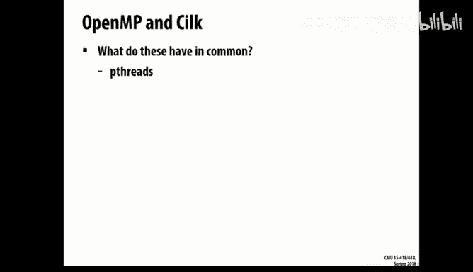

That's a fairly basic API。 It's P threads。And so under the covers in all of the open MP and Sil code。

I'll find basically， it's going to call P red C to do something。

It's going to use the basic P thread library in order to implement its。

Peraram and concurrency APIpis to you。Providing you this higher level。

 maybe richer way of describing your parallelism。That you don't have to worry about some of those issues。

 If you just had to actually call， Imagine having to write your code to call P3 and create and dynamically load balance a for loop。

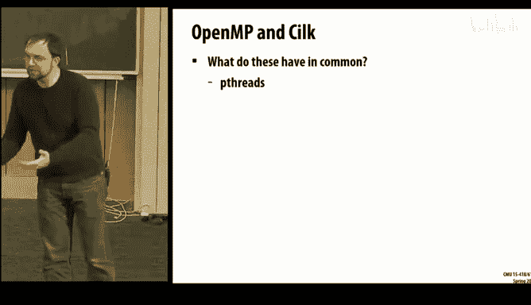

Aren't you happier that Open&P will do that for you？And so。Basically， as we go forward。

 be thinking about the fact that I have this abstraction versus implementation trade off。

That they've extracted away things。And it maybe makes your life a lot easier。

 but sometimes there is extra overhead associated with it。

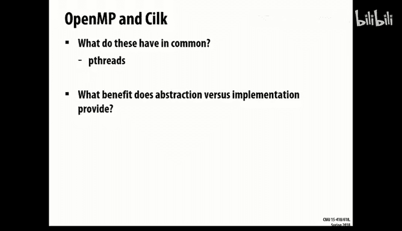

And there might be。Things that your code may know。

That aren't actually exposed to it， either。So for a really simple open and P code， This is so simple。

 it's in the runtime documentation。O。So the runtime documentation says， here is。

A simple for loop that we can make parallel。So if you were to write this code。

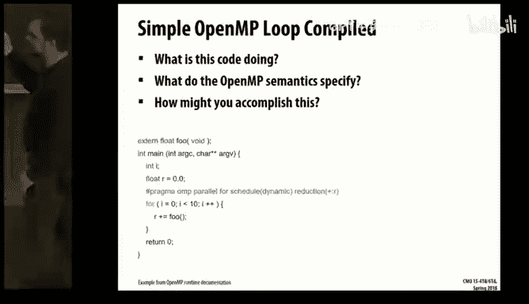

Or you're receiving this code now as a compiler。And you had so brilliantly said。

 I know the way to get of A on 418。 My project is going to be to implement open MP P。

How would you go about doing this？😡，What does this code do？早はもう。10。あじ。Storing the results somewhere。

😔，But actually。Reduce them。繁荣。Okay， so I have 10 pieces of parallel work。

 and I eventually get reduced from fo into some location。Maybe the compiler does it。Fry。

Add to a cell。Maybe。Does it have to。都臭。You could。Aren't you happier as a programmer that the compiler will make that decision for you。

Or aren't you unhappy if you went to Professor Brian and said this is my project。And he says， great。

 And now you're going to do， you know， a binary。A reduction tree。I don't know， I mean。What I have。

 again， is I have some code that's creating these 10 little parallel units of work。Open in P says。

 allright， we've created 10 parallel units of work。I've gone ahead and said。

 let me dynamically schedule them。So they could be running in some sense， in any order。

I might have 10 threads that are running in order to do all 10 pieces of work at the same time。

 Maybe I only have one processor， and it just does this serially。

 and I have explicitly specified I have a reduction that might be done through a tree。

But the semandics don't say。So， what we do know。If you compiled this code。You would get， well。

 you wouldn't get anything nearly this clean。 This is the runtime documentation version of this。

 You don't actually get to ever output。This code。 But if you looked at LVM and said L VM。

 when you do the compilation， stop at the I R， stop at some intermediate that isn't purely assembly。

 you're going to find that I's adding some additional variables。And it's going to tag that。 It has。

Some parallel region。Begin end。 We're going to be beginning open and。 We're going to end it。人。

My or went away。And instead， I want to call something called a fork call。

And I'm going to call some other routine and Ill look， here's R。So R is still hanging around。

 so I'm going to get the value R back。And the open anded documentation， its specification。

 says this fork call says， I have a function。Some main 7 parallel3。That is going to be called。

 and it should be called in parallel。With some arguments。So kind of like a P thread create。

 only I'm not creating one thread。I'm creating。Parallel work。Go do this in parallel。😡，And now， run。

So if I instead look， dive in， all right， what is what happened to my for loop， It went away。

 It became this function。And for Open in P， it says this is a microt。

 It's a little bit of work that some thread is going to grab as a piece of work。

That it's running in parallel， and it grabs this piece of work。

And we'll just run it until it runs out of work。 And when it returns。

 that thread is finished with this work。So at the start。

 this work is going to have to do some initializing local variables。Particularly。

 I have a local reduction。That's being created。And I have some iteration bounds。Now。

You told the compiler in your code， I want a dynamic schedule。

So the compiler now create transforms this loop and says， here is your for loop from before。

We're going to dispatch。And we're gonna， so we're going to do dynamic dispatching。

 We're going to run this code。 And as it runs， each time the thread comes through here。

 it gets some chunk of the work to do。How much I don't know， but it's going to get some chunk。

And it's up to openmpP to decide how much work each thread should receive here。

So when you call into here， now I get， here is my region of work。From lower to upper。Now。

 run your actual for loop。And when you finished this chunk of work。

Then go back and request another chunk。And therefore。

 dynamically schedule your work across your threads。And do all this work locally。

Updating your local version of the reduction。Such that。

When I finish。I now have to do。Some combination to do the global reduction。And in this case。

 it's transformed it to basically perform。Generally speaking， it's just doing an atomic ad on floats。

The compiler has not elected to create it。Create a tree。To combine。I don't know why。

But it has basically said， all right， this code will operate correctly。

And generate the combined value。So if we look back at all this code together。Again。

 our main that was here before， we're going to set up OpenM。 we call in parallel this code。

And what this code is going to do is then dispatch and run this for loop。In some parallel manner。

And then finally， combine all the values back together and reduce it all back together。

So I'm going to show you something for the moment。So I can instrument this code。

 I told you in the last time I lectured here。 I told you that I had compiler instrumentation that will run on these。

And when it runs， it could actually record how this code executed。And this is。

A representation of that program as it ran。The program started here。

 and it starts this parallel region。 It's going to create this concurrent work。

And we'll talk about in a moment what it's going to do here。 But basically。

 we end up with some number of threads。They get assigned to this parallel region，1，2，3，4，5，6，7。

8 threads。There's 9 here， but one of them is a dummy continuation，8 threads。 I think。

 that's interesting。 I think I'm on an 8。I think I'm running on a machine that has eight hardware threads。

That seems like it corresponds pretty well。 So by default， it just gave it 8 threads。Now， that said。

 some threads probably start running before others do。Here they ran。 They're going to start creating。

 as then they're going to start executing concurrent work。

How many units of concurrent work did it run，1，2，3，4，5，6，7，8，9，10 ha。

So I launched8 threads into this parallel region。Two of them got in there fast enough。

For my code to actually grab units of work， and those that grabbed the units of work were unbalanced。

 One of them ran six units of work， and the other ran four units of work。😊，So。

Even for this simple code， again， I can now observe。 Here is its execution and say， understand。

 all right， Was it balanced or not。And from my understanding of what that code was here。

That you don't see。 let's go back to the code。

From this code。I could actually look at how it was creating work and assigning threads etc。

So let's go into that next step。So the for call， okay。The fork call， remember， is saying。

 I am starting this parallel region， run this routine in parallel。And。By default。

 you haven't told it what it means to run it in parallel。 You're not helping open E P anything。

 You haven't said here's how many threads to sign it。Thus。If nothing else， be it every thread。

I have eight threads available。 You get all eight。But internally， it's making that decision。

Perhaps some of the worker threads are already busy。

 in which case other worker threads will be assigned。😡，And start to be able to run in that region。

Inside of here， it's going to set up further structures。

Which will manage the fact that I have a parallel region。And therefore， able to handle， say。

 when this parallel region ends。When it closes out。

How do the threads know that there's no more work to do？Versus say they've reached。A stopping point。

 And we'll continue running later。And， finally。Now that I've assigned threads and I have a parallel region ready to run。

 I set a flag basically and say parallel threads， you've all been assigned work。

 here's where you need to go。 Start running， do this work。😡，So that was the fork piece。

We also saw in that code。That I'm iterating。Now， you have two basic ways to iterate。

 I have as static and eemic schedules。If you give it a static schedule。

You'll find in the compiled code， a call to KM for static in。Telling it。

You're running in a four loop， you're running in some loop with some bounds。And we will at one time。

 provide you the specific bounds。Make this one call， and you will be told。

 here are the iterations you should run。And then you will go do them。Therefore。

 spliting up all the iterations。So this needs to know things like how many threads are going to be available。

 What are the actual bounds for the loop， etc。Our other side， basically。

 if you haven't chosen the static compiled time， we're on the dispatch next。

 which is what we saw from before。Where each time you finish。A chunk of work you call and request。

 is there another chunk of work available。If there is， you receive a lower and upper bound。

 You run that chunk of work。 and if not。Then you're finished executing。

 There's no more chunks of work。Necessary。At the end of their execution。

 there basically is a barrier。 Remember， there's always an implicit barrier at the end of parallel regions。

So at the end of execution， I reach this barrier。And the barrier has basically two phases to it。

It's gathering the threads。And then it will release the threads。Some thread。You may recall。

 is the master thread in any parallel region。The master thread is treated specially in a barrier。So。

 when they start gathering。The master is waiting until all the threads have finished gathering。

So every thread as they come and arrive here， they basically mark down Saint I've arrived。

 and the master sits and waits and says。Is everyone here？If not， I wait。 And once they are。

 now I can notify them all。That they're able to continue executing。

Going back to your suggestion before。The barrier does have internally a variety of implementations it can select。

The barrier may be a simple linear barrier， where I just have some one common variable。

We they're all going to be incrmining that variable。Whatever order I'm arriving。

 I'm just arriving here， I'm just counting up， and it's no big deal。For small numbers of threads。

 simple code。I'm not worrying too much about the concurrency and other bus traffic required for bouncing around this count。

On larger number of threads or。More unusual topologies。

 The barrier can have a different implementation internally。

 And this is partially just up to the runtime。 So the runtime can basically make its decision and say。

For this code running on this system。Perhaps it's better I select a different barrier。And so， run it。

So execute that way。Another keyword you've likely used Openimpomic。So now we've stepped away from。

The simple， parallel region。And we have this atomic keyword。When I gave the other guest lecture。

 I mentioned it briefly。That when you have some atomic keyword。

It transformed it into a sequence of assembly instructions。

When you provide the atomic keyword for just some type， the compiler。

 again is making a decision based on that architecture determining。

Is it able to do this with a single instruction for doing Read， modify， write？And if not。

It has to do。Compare and swap or a load length store conditional or some other loop。To do the update。

 atomically。That isn't available as a single instruction by the architecture。So， for example。

 if it's int， I can perform lock add。As the instruction on X 86。 But if it's float。

 I have to use log compare exchange。喂。Because the X86 architecture does not allow you basically to apply the lock prefix to floating point ads。

When you're doing them to memory。I mean I don't even recall if you can do them strictly to memory。没有。

For bonus points。Why。How long does it take to do an integer ad。Like a cycle。 It's short。 I mean。

 it might be more than a cycle because I I have to fetch the instruction。 I decode it， I， you know。

I am loading it from memory and so forth， but it's short。Floating point。Loger。Longer。

So perhaps there's the main reason is with A V X instructions。 you can't。Outgrade and。Yeah。Yeah。

 as I said， I didn't recall。You can also say， well， the architecture just doesn't let you。Do。

These simplified X 86 instructions where you say， I want to add this value from this register to this other location in memory。

But that's a whole。I'd say it's a computer architecture class， but the title of this class says。So。

So what else can you do in Open in P， There's also a task keyword。All right。

So you can annotate portions of your code in openimp P and say， this is a task。

And create any number of tasks。And have them， depending on values created by other tasks or modified by other tasks。

And provide that to open MP P and say， this is my parallel execution。 It's not a loop。

It's a directed acyclic graph that I want to execute。

And open in P when it receives a dependency like in out X。

 it's creating again microtasks just as it did for those parallel regions and the for loops from before。

 but now it's going to keep track of this basically by having a list of addresses and their lengths。

To know what are the variables that are being dependent on。So when a task finishes。It can record。

This task finished， here are its output dependencies。Do they sufficiently overlap with these things。

 depending on it as input。If so， I can now execute the next。是。

Once you get into structures like tasks。Now， we often think more like silk。In the fall。

 this is lecture 5， but I have to put a question mark because I don't know if it is actual lecture 5。

 that you covered silk。At the time。Lecture 5 or thereabouts。

You learned about sort of the what and the why。What is silk。

 Why is it doing some of the things it's doing。Now， again。

We're going to dive in and see how did the compiler transform code。For very simple silk routines。

And therefore， what is it doing to provide you that parallel。

And concurrency that you had desired and you had expressed in your code。So， again。

Here is a simple portion of silk code。What is this code doing？What did the silk semantic specify。

And particularly， think back。On the spa keyword。Which one is the child。

 which one is the continuation？What does semantic specify then。

O。And minus。The child。不。N minus1 is all seen。Doing like。好ello。And minus2。They put return。They return。

So。Like if you imagine it。Like they both break off。Bches。They've reached sufficiently。

I let's ignore the fact。 if you're a compiler， you can't say。

 do you know that Fibonacci has a close form solution，You can't say， man， if you only had picked。

 you know， a language had lazy evaluation。That when you call Fibonac of n -1。

 it's going to call Fi n -2。 And so we can just linear run this thing through。We I agree。

 we' gonna have to set aside from those ones。But you are correct。 This is the child。

 and this is the parent， or this is the continuation。Which one do you run？You hit a spawn call。

 Silk says you run one of these now。 Which one does it basically tell you to run。All right。

Which one runs if the silk Spwn keyword did nothing。It runs in -1。And so in silk， I say。

 even with this keyword being here。We run the n minus1 first。We leave。

 we're going to leave behind a continuation for the n -2。Code sequence。

Which could be run in parallel。But we're going to run -1。

And you likely had an example that showed why this does so much better for creating lots of concurrency。

And not blowing out， say， stack and memory resources。So。What is a continuation。

 how do you create one of these？A continuation needs a lot of state。It needs。

All these register values， it needs a stack。So forth。All right。You've all taken 213 or 513。

What function lets you do this？😡，What function would let you jump。

In your code to a prior point of execution。For all of its stack and register values。Set。

 jump in long jump。 Yes， set， jump and long jump。I。

 I don't know about I don't know about your reaction， but my reaction。

 when I first discovered that this is how silk was implemented。

 was to sort of take a very long walk outside。I cannot face this fact。 I just need to。

 I need a little bit time to just step away from the code and deal with the fact that they're using set jump and long jump。

I mean， it's it's basically appropriate use， but。So what is set jump do。

 It saves all of our stack context to some environment location， and I can return by a long jump。

And I'll be told if I am the saving call or if I'm the jump and returning call。All right。

I'm going to show you a bunch of boxes。😡，Op P was nice to read。 You may not think it。

 but it was a much nicer to read than what the silk is about to become。

I'm going to talk about something called a basic block。 If you've done compiler work。

 If you've done a lot of computer architecture， you'll recognize this term。 but basically。

 a basic block is some set of instructions in the code where if you run one of them。

 you'll run all of them。

So the last instruction in one of these is either a branch， a function call。

 or just an implicit you enter another block， which can be targeted by some other branch。

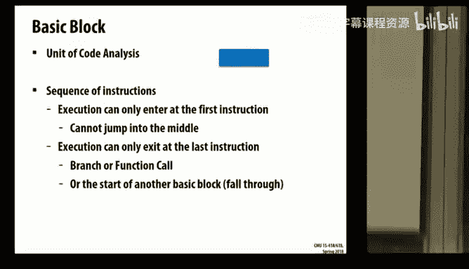

So I'm going to look at that Fibonacci code from before。When you compile it using clang。That code。

 even though it was something like8 lines of code， maybe 10 lines of code。

 will transform into something like 500 lines of intermediate representation。

I'm going to draw this with pictures because pictures are worth thousands of words and that can describe basically what it's doing。

So。Here is our program revisited。 I have an entry， I'm eventually going to return。😡，哎。

When the code is going to run。I'm going to get to a set jump because I need to create a continuation because I want to do a spawn。

I have two paths out of my set shop。The zero path says， I've created this continuation。Therefore。

 I am now the child。😡，To execute as the child， I have to go through a little sequence of。

Exposed internals。Because rather than making a simple function call。

 the silk compiler decide to put just。

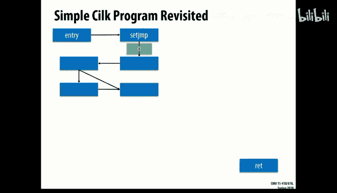

Raw extra blocks of code that are just going to be modifying in its internal state。

So you can view their internal state and you could mess it up。And eventually。

 this internal state is basically going to be setting up the stack context so I can actually make the function call Fibonacci in -1。

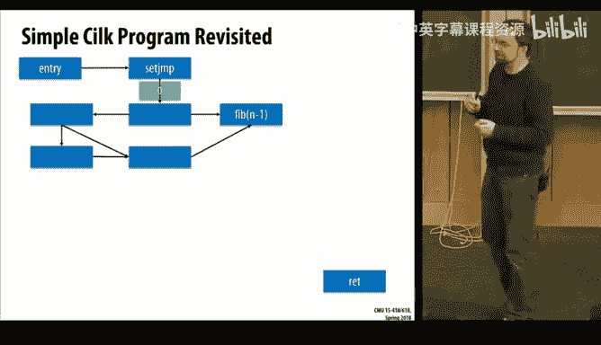

Now。When your program runs。I'm， we're certainly going to call n -1。

But it's running in a concurrent program。How am I going to call in -2， I have two routes，1。

 I left a continuation behind， and someone may jump to it。And become that continuation。

 stealing it from my work cue and calling the Fibonacci in -2。Or it might be。

Maybe this is the maybe When I finish in -1， I return back。And now I am my own continuation。

And so I'm going to set a real quick flag basically to say， I'm now consuming my continuation。

 nobody call it。My continuation just got consumed。 I don't have to make a long jump into my own continuation。

I just set the flag and say， allright， this continuation is no longer available。So。

If I've run serially， this is really simple。I called in -1。 I returned from it with some value。

I stored it there。 And now， because I am my own continuation， I'll call in-2 get a value。

 and I can add them together in return。But what if you're not serial。

 because the whole idea was to be parallel。So if it's parallel， now I have to ask， okay。

I need a sink。I have a continuation。😡，All right。Hows that continuation finished。二的。

Has my child finished here？😡。

Perhaps from the time I called in -2， I started running here because my child didn't use its own continuation。

 but the child finishes。So when it comes time to sing， all right， the child's finished。But if not。

 well， I don't want to lose threads when I'm on a silk sink。So when I reach a silk sink。

I may have to create a continuation。😡，Saying here is work to do， which is waiting until。

The threads have finished。Create this piece of work here。 I am now blocked。

 I don't want my thread to be blocked。😡，It's out of a pool of work or threads。

 Why doesn't the thread go off and do something else。喂。We things that are past to sync。Yes。

So this continuation is for all the work that's basically past that sink。So。

 I create this continuation。If I am the continuation， I call the sync routine saying。

 block this thread， it's now waiting on something else， don't resume it until that work finishes。😡。

And if you are resuming the work。Then you come back out here。

And you're going to then do the addition。

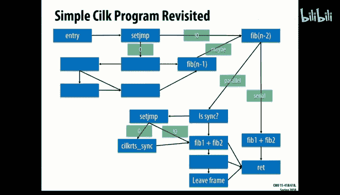

So here is the parallel。 Have， If we've already synced， I can add the two values together。

 It's already the child has finished its value。 I have my value。 I can add them together in return。

 And depending on which paths I've taken through here， I may have some additional cleanup to do。

So what started as。Some very simple code that said， let's implement Fibonacci in parallel， became 4。

8，12。16 basic blockss of code。All to implement the appropriate scent jumps and long jumps。

In order to actually give this code parallel to you and still have the correct semantics。So， again。

Stuff like saving the continuation。So inside of silk。Alright， just about finish。 Alright。

 inside of silk。We have workers。These are just threads that have been created。

 and each one' is going to run around in some sense and try to steal work。If the work item is found。

 if there is something， now I'm going to call long jump because I have some continuation to jump into。

😡。

Otherwise， if there really isn't any work。Then I can just wait on a smaphoore that basically will notify when work has been created。

Now， the fun part is， which I showed a little bit before。

 The fun part is all this code was done on P threads。😊，Linux supports P threads。

 Linux supports thread， local storage。These runtime don't know just have to treat the thread local storage as programme state cannot modify it。

 And so since silk and open appear using P threads。

 I actually can get values into the layer beneath though。😡。

Which is what let me generate that picture for OpenM。😡，And also。What it lets me do。

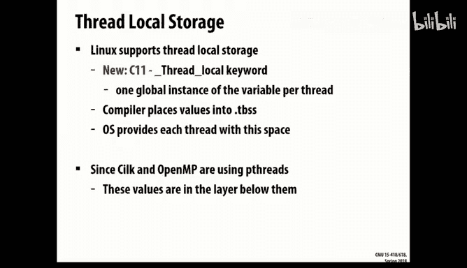

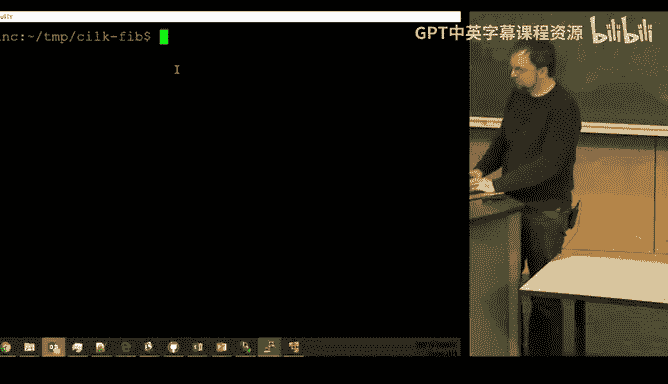

What it lets me do is basically， when I run。This Fibonacci program， I can instrument it。

 and I can observe。Threads。I can observe when the threads are stealing each other's work。

 and I can observe when they're going to continue running。

 I can observe when they're sinking with each other。So again， the same as I saw for Open and P。

 Now for Sil， I can also see what is sort of the balancing of this work。🤧。

And then fun part as well is。In some cases， what you can actually see is， well。

 if you're running Fibonacci under like， say， Fibonacci 6 or so， it's too fast。

 no other thread can actually steal any continuation。

And it will just run serially。😡，But above that point。

 you've now taken enough time that I start having continuations that start getting stolen。

And I can watch them jumping around between the different threads。I know。 this is very。

Lots of numbers that even for me， I have to sit here of my secret decoder ring。

To understand what's going on here， especially part the demo broke。For whatever reason。

 when I ran this last fall， I actually saw thread stealing from each other。 And now today， I did it。

 so。嗯。It is a little fragile。For silk。O。I it。Now you can go back out and brave。

Our nice spring weather。