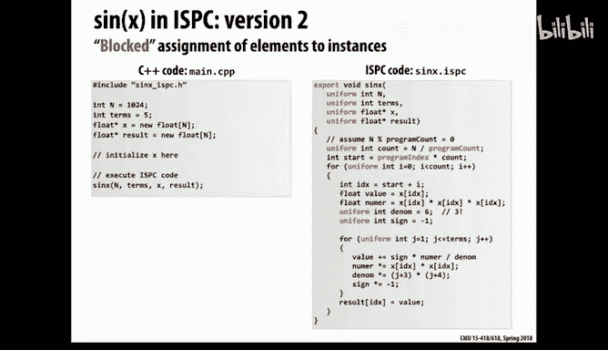
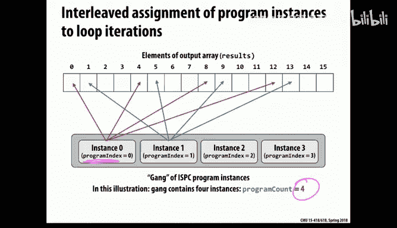
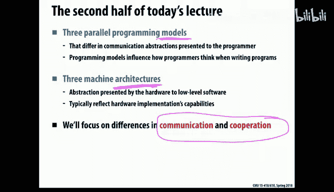
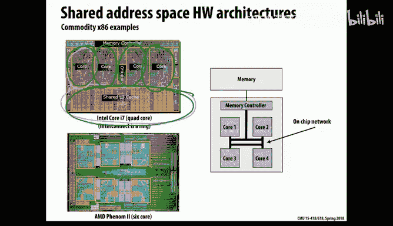
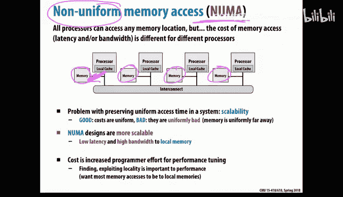
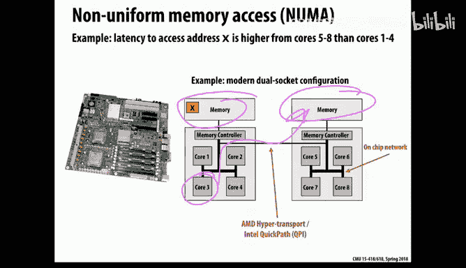
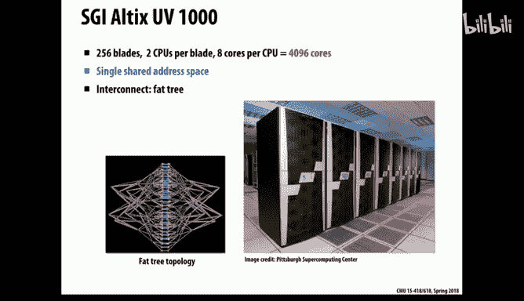
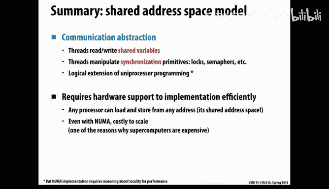
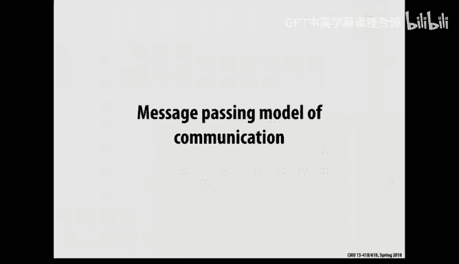
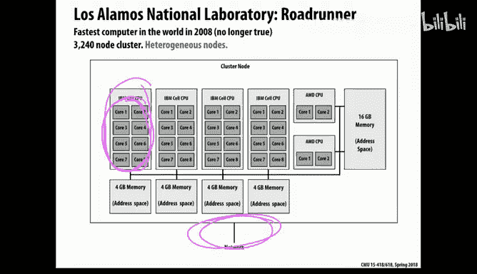

# CMU《并行计算机架构与编程｜CMU 15-418 Parallel Computer Architecture and Programming sp18》 - P3：Lecture 3 - 1-22-18 - Carnegie Mellon University.zh_en - GPT中英字幕课程资源 - BV18b421J7cA

Okay。ます。整个调。Okay so welcome back to 418。 so today we're going to start talking about parallel software last week we talked about parallel hardware and next the theme for all of this week and most of next week will be how we actually write parallel code。

😊，And， in fact， so today's theme is the difference between abstraction and implementation。

 So abstractions are things that we create to make life better for programmers。

 to make it easier to express your code and debug it and so on。

 But these abstractions need to be implemented。😊，And when we're talking about parallelism。

 it's easy to make the mistake of confusing abstraction and implementation because these abstractions are used to express concurrency and communication and the system is also doing communication and managing concurrency and you don't want to get these things confused with each other。

 so we're going to go through a specific example first。

 which is a really interesting parallel language called ISPC from Intel。And after that。

 I'm going to talk about several other very popular and common abstractions。Okay， so ISPC。

 this is a language that you can download， it's available on GitHub， it was developed at Intel。

 and it has a abstraction called the acronym for it is SPMD。

 which stands for single program multiple data， which is a fancy way of saying that you have concurrency where each of the concurrent。

A lot controls I'm trying hard not to say thread。 So you could say thread。

 Each of the logical threads， at least， are executing the same code。

Now they may or may not be executing it at exactly the same time， but you hand them all the same。

 say procedure or chunk of code and they go all go off and execute that on their own data on separate pieces of data。

 and that's how you get parallelism。 So that's a very common way of writing parallel code。

 if you think about it， what's the alternative to that。

 it would be to have completely different programs operating on different pieces of data。

 for example， Now that is something that happens sometimes if you write something like say a web browser。

Or some piece of software where you have completely different tasks unrelated to each other that are doing their own thing。

 they have completely different procedures that they're executing。

 but in our class when we're trying to make things run faster。

 usually we're giving them the same code and they're executing that way。Allright， now。

 as you may recall from Friday， this was an example from the lecture。

 This is not necessarily the most interesting procedure in the world， but it fits on one slide。

 and we're going to use it as an example today when we talk about ISPC， at least。

 So this code is computing signs using Taylor expansion。

 So we have an outer loop where it's going to generate lots of different values of output。

 And then there's an inner loop where it's computing each of these terms。😊。

So now we're going to look at doing this in parallel。Okay， so in IS PCC， the way that this works。

 it's a very， it's a restricted model where what you do is you take the pieces of software that you want to run in parallel and you pull them out and put them into their own separate files。

And their file the code looks a lot like C code， but it has。The file name， instead of it being dot C。

 it's dot ISPC。So those things will run in parallel， as I'll talk about that more in a second。

But then you have the code around that that calls that parallel code。 So theres， in this case。

 main dot CPP， our main file， it's going to actually execute sequentially until it gets to the point where it calls。

A method that's in an ISPC file。Okay， now in this abstraction。

You'll notice we're not going to use the word thread。 Instead。

 we talk about something that sounds a little squishy or a little bit vague。

 So the idea is what it's going to spawn is not actually threads。

 but it's going to have this collection or gang of program instances。

 So things that are operating concurrently。Okay， and。If we animate what this looks like。

 basically what happens is when you're over here in the main in the main file here。

 until you call that method， you're executing sequentially。 So there's no concurrency there。

 You're just operating sequentially， then you hit this method that's in an ISPC file。 at that point。

 you're running concurrently， And then when you return from it。

 then you go back to running sequentially again。 So you express all of your parallelism by way of creating the separate ISPC files。

Okay， now there are other interesting things about this。 So， so so far。

 I just was talking at a high level。 Now， let's look in a little more detail at some of the new keywords that we see in the IS PCC file。

😊，So。First of all， there are a couple of。Variables program count and program index。

 So program count is the number of concurrent instances in the gang。So。

 so how many things are we running in parallel， An interesting thing about ISPC is that you don't set that。

 the system， the runtime system decides what that value should be。

 So you can read it in the software as the programmer， but you don't set that。

So you can see that we're looking at program count here。

 So that's the total number of concurrent things， program instances。 But sometimes you want to know。

 well， which， which instance am I specifically， And that's the point of program index。

 So that program index variable。Tells you your instance number from 0 to n -1。

So if you look at the code here， you can see what it's done is it we've rewritten the outer loop so that instead of incrementing it by one。

 we're hopping ahead by program count so if program count is say four then we'll be hopping jumping ahead by four。

 and there will be four concurrent instances running in parallel and they do separate work because this index is calculated taking into account that offset that their particular program index。

So you can see that that's then used to access whatever data they're working on。 So because of this。

 each instance is actually working on separate work。

So so one thing that I forgot to say is what if we just took the original method sine X。

 and we simply took it as is and put it into an ISPC file and called it。 So what would happen then？

Well， it would create program count number of concurrent instances of that code。

 but since each one of them would do exactly the same work。

 they would actually be entirely redundant with each other。

 so it would not actually make the program run any faster。

So what you want to do to make it run faster is you have to divide up the work。

 so that's the point of having this extra extra stuff in here is that we're not just we don't want each of them to do all of the work because then we don't run any faster。

 we have to divide it up and that's how it's working in this example。Now， there's one other。

Keyword in here， which is uniform， And this is actually just a hint for optimization purposes。

 What uniform means is that each program instance， you， if you use that as a type modifier。

 it means that that variable， each copy of that variable will have exactly the same value across all of the concurrent instances。

So there are things that do not have that。 So for example。

 index is not uniform because each concurrent instance is going to have a different value of index。

 depending on what program index and I happen to be。Okay， so。Any questions about that。

 we'll be talking more about this。How is the uniform thing implemented， it like？のてたで。

YThat's a great question so in a minute I'm going to pull back the covers and show you this really surprising thing about how this is implemented and then hopefully it'll make sense why you need to bother to think about uniform because it is an unusual type of hint normally when we're writing parallel code in many other abstractions you do not have something like uniform but when I explain what it really does under the covers hopefully it'll make more sense and if not we'll talk more about it then which will be in just a few minutes here。

😊，Okay。As I was describing a minute ago， we're using the combination of I and program index to figure out this I D X variable。

 And that controls what data each concurrent instance is， actually。

Executing and just to look at that that that style of decomposition is called interleaved。

 So just to illustrate this graphically， let's imagine that we have four program instances。

 So program count would be4。 now as we're executing along what this means is that instant 0。

 since its program index is 0。 And since we'd be bumping up the outer loop by 4 at a time。

 it's going to be jumping ahead by4。 So it would start off with 0，4，8 and so on。

 And then the next instances would have the values after that。 So that's oops so that's。😊。

That's what innerlea looks like。Now， that's not the only way to do it。

 There's another way we can implement this。

嗯。Oh， yeah。 So actually， I'll hold that up for a second。

 So now I'm going to actually explain what's going on under the covers so。

ISSPC was designed for a specific reason， which is actually to make it easier to write code that takes advantage of SD vector instructions。

😊，So you can write code with Sd vector instructions by just sticking in these special macros or pragmas that where you can say。

 okay， don't do an ad， do a vector ad and now do a vector multiply。 It's a little painful to do that。

 So the idea is， you programmers have this abstraction， which is， hey。

 we're not writing Sd vector code。 We're just writing。😊，Plain old， more or less generic looking。

 concurrent code。 And now the compiler will play some tricks and generate some interesting code under the covers。

So the abstraction is that we have these program instances。Which are not separate threads。

 It turns out， what it generates is just a single thread of execution。

 but it uses the Cdi vector instructions to take advantage of the parallelism。

So we'll look at the code in a second here。And so in fact， having now that I've told you that。

 you can probably guess what the value of program count is。

 which is it's the vector width of the machine basically taking into account the width of the data types you're operating on basically。

So。That's the idea。And okay， so that's what it's doing。

And I think later I believe I'll show you what the code looks like maybe yes we'll get to some examples where we actually see some of the code that's generated in a couple of slides。

 but before I get to that， a minute ago， remember， I showed you the fact that this code that we've looked at so far is doing interleaved access of data。

Now there's another major common option for accessing the data。

 which is called blocked assignment rather than interleaved assignment。

 so here instead of going round Robin across the data elements。

 you break up the data into contiguous chunks instead。

 so youre not interleaving you' getting these chunks。

So here's what the code looks like that will do that。

 so notice that the logic here is a little bit different。Now。

 what we do is we figure out how many contiguous elements are we operating on and for now ignore the fact that that may not divide nicely。

And then we figure out which- so basically we're going to take this array of data。

 so lots and lots of elements here。And then what we do is we divide this into chunks like let's say there are four chunks because there are four program instances and now they need to know how wide is this and where do I start and that's what all of this code is doing down here so you figure out where you start and you know how many of them there are and then you just go ahead and have an inner loop that looks very much like the inner loop we saw before。

Or code inside of that that is。Allright， so these are two options。 Oh。

 and then here's what this would look like。 You saw interleaved already。 So in the blocked case。

 you hand out contiguous elements instead of interleaved elements。😊，Okay。

 so which of these things do you think is better， blocked or interleaved？Yep。

 it depends on your data。Okay。Okay， so do you have an example of when one or the other might be better or well in the case of the data that you're working on？

Ha different amounts of work。嗯。First。就7。と。嗯 did。Maybeally you spread out the hard work。Yeah。

 so speaking generically， not necessarily for this specific code that we're looking at。

 but a common disadvantage of blocked assignment is if the computation time say scales with the index into the data。

 let's say it's like n squared time or something and it gets more and more expensive。

 if I divide this into even chunks it may be that the one way over on the left has very little computation to do and the one way over on the right has a whole lot of computation to do。

 so for that reason， interleaving tends to be a little less risky if you have like contiguous properties in terms of how long the computation takes so that's a potential advantage of blocked any other thoughts。

😊，what我。搞啲诶。If you know， they can。A rail。对意外的发。Yeah， so another thing about。

 you know as you learned from 213， spatial locality is good for caches。

 So one thing when we look at this picture is accessing contiguous data。

 that sounds more cache friendly。 and in fact， for most in many situations that would be a valid argument。

 It turns out in a case of ISPC that's not really very compelling because it's just one thread and we're going to kind of look at some details about that。

 But in general， if you had separate threads and they were accessing data in separate caches then normally blocked would have a big advantage from spatial locality。

😊，Any other thoughts？So it turns out that for ISPC。

 there actually is a very clear winner between blocked and interleaved。

 It's really not it's not close。And it's not for any of the reasons I've heard so far。Oh， yeah。は全つ。

Yes， yes right。 So in fact， and that actually has a big that's the root cause of the big advantage for ISPC。

 So if if we look at this over time， what happens is so in the pictures I showed you before。

 I was actually showing you what it looks like from the perspective of a particular program instance。

 But if we think about what's happening in time in the interleaved case， the first four iterations。

 you know0 through3 they are being computed on by a vector by one vector instruction and so。😊。

That's what's happening at any moment in time。 So we actually march along like this。 okay。

 that's interleaved。 And if we look at now what's nice about that is when I want to bring that data into the register。

 the vector registered to operate on it， the data that I want for the vector happens to be contiguous in memory and there are vector load instructions that will bring in big chunks of data and they work really well as long as the data you're bringing in is contiguous already。

😊，So with one vector load， essentially the cost of one load operation。

 we can bring in all of that data。 In fact， if the vectors wider than this。

 if it has8 or 16 elements， we could bring it all in in basically one cycle。

 assuming it hits in the cache。Now， if you compare that with blocked。

This is what happens with blocked。 Now， although from the perspective of a particular instance。

 things look like they're contiguous。 that's not what's happening in time。 In time。

 now we're jumping across different elements。 We need to load 0，4，8 and 12 all at once。Now， okay。

 what do you think happens in the hardware for that？So。

It turns out there is an instruction that will allow you to do this。

 there's a vector gather instruction thatll lets you load lots of non-contiguous data into one vector with one instruction。

 but how long does that take， do you think does it take one cycle？

Well for those of you who are doubleE or if you've studied much about hardware。

 that's to take that's not going to be anywhere near as fast as doing the vector load because what the hardware really has to do is effectively the moral equivalent of four or8 or however。

 many separate loads。 So it appears to be one instructions from the assembly language programmer's point of view。

 but performance wise， this is a costly thing to do。 So for that reason。

 interleaved is actually much faster in this case。 So that's surprising that's a case where because of what we're doing because it's targeting S vector instructions that was the clear winner。

Okay， now you might look at that and say， it's not fun to have to write all that low level code to specify。

 blocked or interleaved。 And what if I pick one and get it wrong， That's a shame。

 Wouldn't it be nice if this clever compiler and language could just figure this out for me。

So that's the idea of another primitive， which is called for each。 So for each is essentially。

 it's like a for loop， but you're handing over control of the assignment of the loop iterations to the system。

 So what you're telling the system is you can execute these iterations in parallel and you figure out the order in which you want to do that。

So since the computations are independent for each value of I in the outer loop。

 we can do them in any order。 And so we'll let the system choose。 So。

 so from the programmer's point of view， they're just pointing out the source of parallelism and they're letting the language synthesize the code。

 And in the case of IS PCC， what it'll do is itll synthesize the interleaved code that we saw earlier。

 the first code that we saw in this case， because of the loading of vectors。Okay， so。

So just to recap what we saw so far， so there's an abstraction which is that it looks like we have almost conventional single program multiple data parallelism where we say。

 okay here's a procedure and instances of that will be executed in parallel， but in fact。

 the implementation of it was SD vector instructions where there only is one thread of control and the concurrency is coming only from these vector instructions and it's saving us the headache of having to insert all those macros and think about all those low-level details。

😊，Now， one other so before we move on， though。Just to sort of maybe test your understanding of this a little bit。

What happens in the case where we want to do a reduction in IS PCC。 So here。

 this is a different procedure where what what we want to do is just add up all the values in an array。

 So we want to calculate this sum and return， return that sum。Okay。

 now interesting thing about this is。So。Well， in fact。The sum， the sum that we get back。

 everyone should agree on the sum， right， the return value， which is the answer， should be one thing。

So maybe we want to stick the tight modifier uniform in front of the declaration of some。

 It turns out that if you do that and try to compile it， IS PCC will say this is a compilation error。

 You can't do that。So why is that？So what the。一毕就。Right， they're all adding different values into it。

 So yeah， so the problem is that x sub I， the thing they're trying to add into it。

 this is definitely not uniform for every instance they're all reading different values。

 So if you're trying to concurrently add all these things into it that would if you just did something naive here would break。

 So here's code that would work in ISPC where you're trying to do essentially the same thing where what you need to do instead is you're going to calculate partial sums So each instance is going to first have a loop where it calculates its portion of the total sum and those are not uniform。

 those are different for each instance and after we do that then we will put them together into the final answer but we'll use a special ISPC primitive called reduce add which allows us to take a set of different values and turn。

😊，Im into a value that ought to be uniform across all the threads， ultimately。Okay。That would work。

 And in fact， for fun， I'm not going to spend time going through all the details of this。

 but here's an example of what that actually compiles into。 So here， well， first of all。

 what you can see is here are these vector instructions like ads and loads and stores and things like that。

😊，So up here， what we're seeing is。The first part up here。 So that's basically this loop。

And then down here in the bottom。This is the reduction。

And notice the reduction is actually not using vector instructions because what it's doing is it's just adding up all the elements of a vector using conventional instructions。

But that gets the right value。Okay， so that's ISPC。So， okay。

 couple last last thing to say about IS PCC is that。the size of a gang。

 so the program count variable is set by the system and it's usually the vector width。

But many machines have more than one core on them， so if I wanted to run parallel code using ISPC and I have multiple cores。

 the code I've shown you so far would actually only run on one core and it wouldn't take advantage of any of those other cores。

 so ISPC has another piece of their mechanism which is you can create a task and a task is a thread of control that can run on on different cores。

 so it's basically a thread， it gets turned into a thread。So。That's ISPC。Okay， so that was part one。

 Next， we're going to move on and talk about several other important parallel programming abstractions。

So we're going to talk about the abstraction from the programmer's point of view。

 and I'm also going to talk about some examples of machines that support these abstractions。And。The。

 the things that are really different in parallel in parallel processing are that we have to have the。

 the concurrent instances of code communicate and cooperate with each other。

 So that's what we're going to focus on when we talk about these abstractions。 You know。

 what part of the abstraction do you use to talk about how you communicate and cooperate。

Okay。All right。How do we implement an abstraction？ So if abstractions could be implemented through software or hardware or both。

 And， in fact， software is not just one thing。 There are layers to our software stack。So for example。

 you're writing in some high levell language and you have a compiler and runtime and some libraries that are taking the source code and turning it into something to execute。

 that's running on top of an operating system， which is software。

 which is running on top of hardware。Okay， so just as some examples of how these things can be done very differently。

 let's start by looking at P threads， so you're familiar with P threads already from 213。

 I think so P thread you can create this new thread and so how is that implemented， well。

 there is a library call into P thread create？And you know that's implemented somehow。

 there's usually some kernel support for that， so the kernel nose needs to know that you've created this if you want it to run on a different core。

So that's something that the operating system knows about。

 and then that's the operating system is already managing execution of things on different cores。

 so it's already kind of talking to the hardware to make that work。So in the case of P threads。

Really， a lot of it is happening at the library level and the kernel level。But in the case of ISPC。

The compiler， the operating system is actually not involved normally because what we do is the compiler simply generates vector instructions and these are just directly executed and the hardware will simply go ahead and do them in parallel and we don't have to get any special libraries or the kernel involved to do that。

 just the compiler， so the compiler did all the heavy lifting in that case。

So that's something to keep in mind， which is that these abstractions can be implemented through different combinations of hardware and software and different parts of the stack。

Okay， so now you know it actually， I think I'm going to take an intermission break now。

 So I like to stop in the middle for a minute or two。 So we're not quite at the halfway point。

 but I'm about to launch into a lot of stuff here。 so we'll take like a two minute intermission break so I don't like leave the room。

 but you can stand up and move around and get the blood flowing into your brain again。

 and then we'll start up after that。😊，嗯。Yeah， design can see。查死。Yeah， probably yeah。

So now we're going to discuss three abstractions for parallel programming， shared address， space。

 message passing and data parallel。 So I'll walk through all three of these。

And you'll be using all of these in this class， you'll be using them in the assignments， for example。

 the first one you'll use in assignment3， the second one you use in assignment 4。

 and the third one you use in assignment2， confusingly。Okay， so shared address space。

 So the idea here， the way that to think about this as the program from the programmer's point of view is that the way that youre now I'm going to actually go ahead and use the word threads because I'm just used to saying that。

 So the way that the threads interact with each other is that the whole machine has a common address space。

So if threads want to communicate， they can read and write the same memory when they choose to。

 and they can also choose to have private variables and access just their own data。

 but when they want to cooperate and communicate， they do it by reading and writing the same data。

 and this is a little bit like if you were trying to work together with friends and you were standing in front of a whiteboard。

 and the way that you communicate it was you wrote things on the whiteboard and then other people could look at those things on the whiteboard and read them。

 that's a little bit like what it's like。Now a thing about this this is actually very similar and this is the smallest change of all of the abstractions we're going to talk about。

 this is most similar to just conventional sequential programming because in the normal case when we have different procedures。

 parts when different parts of your code are interacting with each other。

 how do they do that well they do it by reading and writing data in the address space that's。😊。

That should seemed very familiar。Okay。All right， so the communication part is really easy in the shared address space case because you can always communicate by reading and writing the same data。

😊，The wrinkle though， is synchronization， so how do you know when the data that you want is there？So。

 for example， if I just read an address and memory。

 how do I know whether I got the up to date copy of the value or I got an old out of date copy of the value。

 Usually， that's the part that requires some extra work。So for example。

 so that's one type of synchronization is knowing whether something is ready to be read。

 another type of synchronization is around mutual exclusion， so for example。

 if we are incrementing a variable， if two concurrent threads simultaneously try to increment the same variable。

 then you can end up with the wrong answer because they both read the initial value。

 then in their registers， they increment that and then they store back an updated value。

 but you just lost one of the increments potentially， so if you've taken 410 or if you take 410。

 you'll spend a lot of time thinking about that problem because that shows up a lot in kernels。Okay。

 so。So the idea is you just communicate by reading and writing shared variables and the extra work that you do is adding things like locks and other types of synchronization。

 So in a future lecture， well soon we'll look at real examples of code written in this style。

 And what you'll see is a lot of the extra code that shows up is all due to the synchronization primitive。

😊，嗯。

Okay。Now。I said that this， the idea is that we have a common address space。

 So how do you think this might be implemented in the hardware？

 So one way to do it is to physically share the same memory。So in fact。

 in the early days of these kinds of machines， this is how everybody thought of the problem。

 which is we have memory， so memory sitting here and we have something like a bus or some other kind of interconnect。

 and then we have more than one processor plugged into this bus。whatever it is。

 And then they can just， they can all go and access memory。Okay， so。Well， for what it's worth also。

 this is also called sometimes a dance hall architecture。

 you may wonder what does it have to do with dancing and the inspiration was this is like like a middle school dance where like everybody's lined up on the edge of the room and nobody's like in the middle So all the processor are on one side。

 all the memories on the other side。 that's where that term comes from。

 But the thing that it's actually also called is symmetric multiprocesing in the sense that each processor is equally far away from memory。

 memory is not closer to any processor than any other processor。😊，Now。

 that may sound like a good thing， but I'm going to come back to that in a minute。 So yeah。

 it's equally bad for everybody。

There's one way to think of it。 Okay， so now this an interesting part of the hardware。

 If you want to design something this way， where everything is the same distance from memory is。

 well， how do you make the interconnect that connects processors to memory。

 How does that continue to be fast， as we add more and more processors and more and more memory modules。

😊，So a really inexpensive kind of interconnect is just a bus。

 but only one thing can be on the bus at a time。 So that that obviously doesn't have scalable bandwidth。

 So later， we'll have a whole lecture on how you build scalable interconnects。

 I'm not going to really get into that。 Now， there are fancier things that you can do。

 but they start to get more and more expensive。Okay。If we look at real hardware。

 So where do we see this approach to building an shared address space， Well， first of all。

 on a modern。Processor， you have， say four cores， let me you a different color here。

 so we've got say four cores and they all physically share the same cache。😊，And so in that case。

 at least to get to that cache， that is shared by all the different cores equally。

 so that's one way that you can design things like this。

And AMD has you other processor that are a bit like this Now this is a different processor。

 this is the sun Niagara 2， this is designed to support lots and lots of latency tolerant tasks so they had far more processors here they have eight processors but in order to connect eight things to lots of other things they had to have a fancier interconnect and what you can notice on the dye is that interconnect is starting to get nontrivially large it's almost as large as one of the processors。

Okay， so simply trying to build so building a large machine with say hundreds or thousands of processorers in it and having them all be equally far away from memory turns out to be really hard so。

The， the way to get around that problem。Is to give up on the idea of everybody being equally close to all of the memory。

 And instead， everybody gets a nearby piece of the overall physical memory。😊。

But they can still access all of the other pieces。 It just takes longer to get there。

So this is called non uniform memory access or Nuumma。And so the idea is that the memory。

 everybody can still access all the memory， but but there's a piece of the memory that's near each processor。

 So this is good because now you there are things like my stack and my code that should always be private to me So I will just keep those in my own local memory。

 I don't need to go far away to get those。 also as you'll see later。

 the way to get a parallel program to run really fast is you divide up the data and hopefully you're mostly working on data that other processors aren't working on so we can put that data in our local memory I can still access the other data。

 but if I'm spending 95% of my time going to just my local memory then that's good for two reasons。

 First， the latency is nice and low because I can get there quickly and it's also good from a bandwidth point of view because that traffic isn't going out over the bigger interconnect。

😊，And slowing down all these other axises。So this is a way to build large scale shared address based machines。

It come does introduce a new complication though for the programmer potentially。

 which is now memory might be nearby and faster or far away and slower。

 so the programmers may have to think about that now。So in terms of examples of this。

 if you just have a machine， like even a laptop or a desktop that has two sockets in it。

 then you in today， you have a non uniform memory access machine because the memory is actually shared。

Across these two sockets。 So if this core over here wants to get to the memory over here。

 it's going to take a little bit longer to get there。

Okay， and then if you want to build a really big machine that has a shared address space。

 here's one example of this， the SGI altics， then you can do that。

 just it's just going to take longer to get to some of the memory than to other parts of the memory。

 but the abstraction still works， and you can still get good performance this way。

Okay， so then that's the， that's the first model that I wanted to talk about。

 which is the shared address space machine。 So it's a simple idea from a programmer's point of view。

 which is we just all share the same address space。Now， okay， it turns out that。

From a programmer's point of view， this sounds great。From a hardware implementation point of view。

 there are some challenges。 It's not so much about the memory。 It's about the caches。

So once we start caching data and we're all sharing the data。

 then we have a coherence problem where different copies may get out of sync with respect to each other。

 so we'll actually have a couple of lectures on the topic of how the memory system works under the covers and they are interesting details about that so we'll get to that later on in the class。

Okay。

In part， because there's some extra cost involved with implementing cash coherence。

 There's also been this long tradition of building parallel machines that don't depend on any special hardware support。

 So this next abstraction I'm going to talk about is message passing。And。

The idea here is that each thread has only private data。 There is no shared address space。

 The addresses that you can access are always private to you。

And if you want to communicate with another thread。

 the way that you do it is you put together a message and you send it through the network to that other thread。

 and it receives the message and then it interprets it and decides what to do with that。

So for example， if I've got some and usually the things you say send and receive are contiguous or at least it works well that way。

 so maybe here's some variable and I want to send it over to this other thread。

 so I will say I'm going to send it， here's its starting address。

 I'm sending it to thread too and maybe you add a tag to it so that it can interpret what kind of message it is and then on this thread it's going to execute explicitly receive。

 it'll say here's where it should go， you might specify who you're receiving it from or that might just be left as a wild card and maybe you have a special tag that you only want to receive messages with that specific tag。

Okay， so。So this is another approach。 A big advantage of this is that it doesn't require any special hardware at all other than a network。

 If you can get onto a network and send information between computers。

 then you can write code that will work with message passing。Now most people， well。

 okay first of all， in assignments three and four， you will get to contrast these two programming models because you're going to write a particular program in an assignment3 using the shared address space model and then you're going to write the same program for assignment 4 in message passing and you can conclude for yourself which of these you prefer or maybe you like them both equally well。

 many people， I'd say the vast majority of people prefer shared address space model because this one is a little structure a little more rigid in terms of how communication works and we will go through examples of this in the next week or two you'll see code written in this style。

But the big selling point of this is that it's really easy to build a hardware for these machines。

 If you want to have an enormously large machine， then you can it's easy to do that。

 All you need is a fast interconnect and you don't need any other special hardware to worry about coherence or anything like that。

 you can just plug it together and start running message passing code。😊，Okay。

 so there have been a lot of examples of this。 So， for example， IBM， well， first of all， a while ago。

 they had a machine called Deep Blue that was the first computer to beat the best human in the world a chess。

 And it had this kind of message passing architecture。 Then they had something called blue gene and。

And， and you can also just take you know， just any kind of machine and just stick them together。

 So in your usual like data warehouse place where you've got lots and lots of racks of servers。

 they could all be working together with this model。So， for example， even in this class。

 we'll be using a cluster of machines that we call late days。And well。

 there are details about all the nodes， but you can write message passing code on top of them。

 but the performance of the communication performance is not so great because they're communicating through Ethernet。

 which is not especiallyly fast。 So the good news is it's easy to plug machines together and write code。

 but the bad news is there's a decent chance that the interconnect is going to be a bottleneck for you。

😊，So for that reason， the people who build high performance message passing machines build really exotic and fast interconnects。

Okay， so we've talked about both shared address space and message passing。

 And I said it's important not to confuse abstraction and implementation。

 And I was talking about hardware for shared address spaces and hardware for message passing。

 But it turns out that you can actually implement either of those models on either type of hardware。

 They're not tied rigidly to one type of hardware。 So， for example。

 let's say you like to do message passing， or maybe you know your evil instructor is making you do message passing。

 even if you don't want to。 can you run that on on a machine that has a shared address space。 Well。

 yes， in fact， there are really fast implementations of message passing。

 which is if where built based on shared address spaces because to send a message with a shared address space。

 all you do have to do is pass a pointer that points to it in memory。 For example。

 you don't actually have to copy it through the network or anything like that。 So theyre， in fact。

 really fast implementation。😊，Of message passing built on shared address， space， hardware。

You can go the other direction， but that's not as nice。

 So I can write shared address space code and run it on a machine that has no hardware support for a shared address space。

You can use tricks in the operating system where you write protect pages and use page fault handlers to move data back and forth and emulate what the hardware does in the cache is。

 and it will functionally work， but it's usually quite slow so it's possible。

 but that's not usually very fast。Okay。Now， the next the last major model I want to talk about is data parallel。

 And this is the one you're going to be focusing on first in， in this class。Okay。Let's see。

 So comparing data parallel with what we've talked about so far。

 the shared address space model is really the least restrictive because because you have that shared address space。

 you can communicate however you choose to communicate。

 It's very easy to do that with message passing。As as you'll see。

 when you start actually writing software this way。

 it makes the communication more structured because you want to bundle things together into messages。

 You don't want to send individual bytes as messages because that's too slow。

 So usually you end up restructuring your code a bit to try to send messages as infrequently as you can。

 So it makes it constrains that a little bit。The data parallel case is the most restricted in terms of its applicability。

 So there， there are programs where this works really well and cases where it just doesn't work at all。

 when it works well， though， it works very， very well， and it's very nice for programmers。

 and GPs are built all around this idea of data parallelism。 So it's， it's an important model。 And。😊。

We'll talk about that。Next here。So。In the old old days of computers。

 we had vector supercomputers which did lots of things in parallel by having vector instructions。

 these were much wider even than the ones we see today。

 you could maybe do 100 or more elements in parallel。

 and in that case you were giving every the thing that was being done in parallel was one instruction。

And today， though， we've moved to， as I said， this single program multiple data model。

 which is we're going to basically do the same work over a lot of data。

 but we're not going to rigidly march through one instruction at a time necessarily。

 We're going to say， here's a function。 and we want to apply the same function to all of our data。

 So go do that somehow， but we're not necessarily going to constrain them to be doing an absolute lockstep。

😊，Okay。So。In IS PCC， which we talked about already， there's something in terms of data parallelism。

 There's something that's a little bit like data parallelism， but only in a very loose way， which is。

 I talked about the four each。Primitive。 And I said that I can point to a loop and replace the normal four loop with a for each loop。

 and this is telling the system that it can take all the iterations of the loop and operate on them in parallel。

Now， technically， this is only control parallelism。

 I've just said the iterations of the loop can be run in parallel。

 The ISPC doesn't really think or care about what's going on with the data inside of that loop。

So if you I'm going to show you examples in a second， but you can easily break your code this way。

 if you give it code where the operations are not actually independent。

 then strange things can happen not。Thinking about data in a principled way when it comes to data parallelism。

Okay， so， but let's look at some examples here。 So for example。

 here's a new made up IS PCC function where what we want to do is compute the absolute value of something。

 and then generate two copies of it。 So， for example， if I have say one negative 2， negative 3。

 Then what I want to generate is。I'm generating two ones。2， twos，2， threes。And so on。Okay， so thats。

 that's what this code is doing。 I'm not sure why that's very interesting， but it fits on the slide。

So you can see that we've got elements of I and I is going to correspond to the input elements。

 and then we're generating two output elements， so we're taking absolute values and then we're copying it。

Okay， so that is like a form of data parallelism。 We're getting the parallel out of the fact that we can do it independently for across all of our input data。

Okay， well， I forgot about that。Hang on。 Let's， what's。All right。Okay， that'll take too long， right。

This is a valid ISPC program， so that will compile。

But it wasn't really thinking at all about what was going on in in the loop。

 So here's another example。 And what we're doing is。呃。

Looking at an element to see whether or not it is negative。And if the input element is negative。

 then we're going to copy it to- we're going to shift it left one position。And if it's not negative。

 then we're just going to copy it to the same position in the output。

So you may copy it one to the left， or maybe just straight down into the output array。

So ISPC is completely happy with this in the sense that it will generate code and it will run it in parallel。

As a programmer， would you be completely happy with this？So。What can happen here？Right。

 so if you have like positive and negative values next to each other。

 then two different concurrent instances may be writing to the same output and so what will happen from the programmer's point of view is that the program can become nondeterministic now so the value that we get out now actually an ISPC because it's sort of rigidly walking through with vectors and loops。

 it won't actually be nondeterministic nondeterministic unless you use tasks。

 but if you wrote something that was data parallel like this。

 and if it was a little less rigid then you would have something that was nondeterministic。Okay。

 so that's all right。So。What we could do， I don't。 let's see。

 I don't want necessarily want to get super hung up on all these details。 But you know。

 what we could do is so what。How can we take advantage of data parallelism in a more principled way so that we don't have weird problems like the one that we just saw。

 So what we can one abstraction for this is something called streams。

 where the idea is that we have input data coming in。

 and we're going to generate output data going out。 and we have some function。

 pure function that we apply to the inputs and we use that to generate the outputs。So for example。

 if I want to- I have two arrays， x is my input， y is my output。

 and I simply want to generate the absolute value of the input as the output。So that's。

 this is an IS PCC program that does that。 So it just tests。 if it's negative。

 then we invert it to make it take its absolute value， and we generate output that way。

 And that would be great in the sense that there's no nondeterminism。 It would run in parallel。

 that all looks good。😊，Okay， now so in this model， in the stream model we have streams。

 this is the data that we are operating on， so it's some collection of elements and we know that we can process each element independently。

 so that's good。And then the kernel， the thing that we apply to it， so in this case。

 this is our know quote unquote kernel， this is some side effect free function so we can apply them in any order since there are these nice pure functions。

So that's， that's the basic idea of the stream model。

 That's one way to have data parallelism and avoid some of these data races or things like that。

So for example， let's say we want to do more than one thing to it in the previous example we are just calculating the absolute value。

 but let's say we have multiple things that we want to do to the data so we're applying F first because that's our standard procedure name and then bar so we do F and we do bar and we can just stream the output of F into make it the input into bar so we create a temporary stream or array and that gets generated in the middle and then the compiler can take this and understand what's going on and then create a lot of parallelism。

So this is one way that we can think about data parallelism with stream programming。Okay。

 now I won't belabor this too much， but。It turns out， though。

 if I just back up and look at well this example， one thing that's a little unfortunate here is I have to create this temporary thing in the middle。

 The thing that starts to happen if you start using streams a lot is you realize， well。

 it's kind of a waste that we have to write the temporary out or in waste bandwidth doing that。

 It' would be nice if we could bring something in and compose together both fo and bar and do them together and maybe the compiler doesn't necessarily know how to do that without some help from the programmer。

 So you may end up wanting to have new operators that do fancier and fancier things。😊，So。

 for example， several slides ago， I showed you code that would take an input array。

 take the absolute value， but then double the number of elements in the output。

 So we get twice as many output elements as input elements。And if we want to do that。

 that's not necessarily a great match for this stream model of one to one input and output。

 So we might want to have a new primitive which says， okay。

 double the number of elements in the array for every input generate two outputs。

 and then we can take the absolute value of that。 and then that would all be nice。

So the issue is that then， okay， so one potential disadvantage is we may need to add more and more。

YouThings into the model to make sure we can capture everything we want to do stream programming。

 So if you're doing。Relatively simple things with a stream model。 It works well。

 If things start to get really complicated， then it starts to get a little less nice。

So some other important parts of the stream model and these primitives show up in other places too in data parallelism is that often the data that you want to operate on or produce may not be contiguous to begin with。

 but you really do want to compute on it as contiguous data so then the primitives that are helpful here are things called gather and scatter which you've probably heard about already。

 So the idea with gather is that you not only you say well here's my input what I want to do is this is pointing to memory and then this is another element and this array contains the indices that I actually want in wherever they are and this is saying go grab all of these and arrange them contiguously into this array。

And then I can use that as input to some stream routine and now it'll be nice and contiguous and all is good。

 that's what gather does and then scatter does the output version of that。

 so with scatter I have some output and indices where I want to actually store it and then it will go actually store them there。

So you can see here is the equivalent ISPC code for gather and scatter， as I mentioned before。

The Intel's vector instructions do include a gather load instruction。They do not include a scatter。

 though。Okay， so then this is the visualization of what gather does。 We give it a pointer。

 it says gather。This R1 is pointing to where the array begins， r0 is the indices。

 so here's our indices。And then we want to， oh sorry， that's the memory base。

 So that's pointing here。 We want to generate the result here。

 And so it's just going to do a whole bunch of effectively memory loads and stick things together contiguously for you。

So that's what what Ga does。So GPUs typically do have support for gather and scatter。

 so you will see those operations there。

Okay， so to summarize the data parallel model。This is designed for the case where you have so so the thing is if the thing you're trying to calculate involves effectively applying the same computation to lots of data。

 then data parallelism should work very well and things like GPUs are all built around taking a lot of advantage of data parallelism。

 So if this fits what you're trying to do， then this is very nice。

And it's basically like mapping some function onto a large amount of data。And even， in fact。

 even if you are targeting a machine that supports message passing or shared address space。

 if your program has data parallelism， then you should be able to get some really good performance。

 And when we start talking about specific code examples， you'll see that in practice。

 So data parallel is not just a programming abstraction。

 It's a good way to think about how you're going to structure your code。

 even if you're targeting some other model。😊，Okay， so just to wrap things up here。

 couple just a couple more slides here。 So to review， we talked about three different models。

 shared address space， message passing and data parallel。

 The shared address space is communication occurs through loading and storing memory in the shared address space in message passing。

 It's all about sending messages to it's all done through sending messages to other threads because you only have a private memory address space。

 there's no shared address space。 And in data parallel。

 you're taking effectively some function or some computation and you're mapping it across some collection of data。

😊，So。Okay。Now。All right， so one of the reasons， one of the last things I want to emphasize here is that in practice this it's not the case that you just get to form an opinion about your favorite programming model。

 you say， I really like Sha address space。 I really don't like message passing。

 I'm lukewarm on data parallel or whatever it is， you really want to be good at all of these different models because in practice。

 you usually have to do all of the above if you're really trying to take full advantage of high end machines。

So so in particular。Within a multicore chip， you will always have shared address space support because they just physically share caches and it's really easy to support it there。

 So you're always going to see shared address space at a small scale at a large scale。

 you may not have the hardware support for cache coherence。 So at a larger scale。

 you may need to use message passing to communicate。

 And it's also very common that we have not only CPUs。

 but GPUus and GPUus are all about data parallelism。

 So you may be mixing a very data parallel oriented style of execution with using either either one of the other two models for the parts of your code that don't fit data parallelism so well。

 and they may be talking to each other that way。 So for example。

 the roadrunner machine So this is at Los Alamos National labs。 is this was 10 years ago。😊。

The fastest computer in the world for some period of time。 And it had。

 it was basically composed of lots and lots of things at this， at this smaller scale。

 We've got lots of these。😊，IBM cell GPUs。 And within them， they had a shared address space。

 But across across different nodes， you did not have a shared address space。 You had message passing。

 So you had to have one program that would take advantage of both of those models at the same time。

Okay， so to wrap things up， we've been talking about abstractions and implementations。

 and we saw IS PCC as one example。 And then we talked about three other abstractions and。Let's see。

 So when you're designing a new abstraction。 So just historically。

 the way these abstractions came about， actually， usually when somebody invents a new abstraction。

 it's because at a low level， they think they have a really efficient way to implement it in hardware。

 So initially， these things all started off as things that were very tied to hardware。 But over time。

 people realized， oh， wait， you know， really， this abstraction is less tied to the hardware than we thought we can implement it on different machines and so on。

Okay， and one thing that's important， as I just said a minute ago。

 is you'll want to be able to think about things in from multiple different perspectives。

So that's actually it for today for once we're finishing ahead of schedule， which is not bad。Okay。

 so I'll see you on Wednesday and we'll talk more about parallel programming now。

