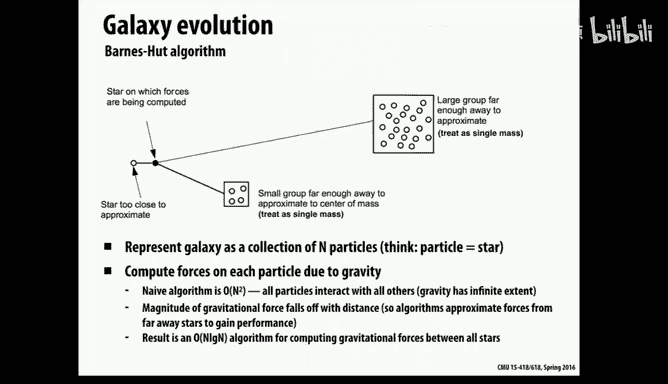
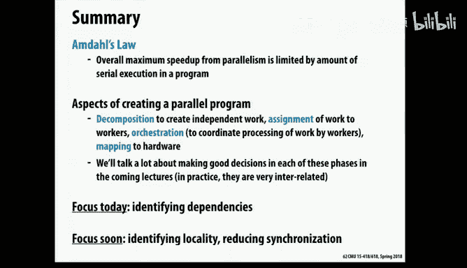

# CMU《并行计算机架构与编程｜CMU 15-418 Parallel Computer Architecture and Programming sp18》 - P4：Lecture 4 - 1-24-18 - Carnegie Mellon University.zh_en - GPT中英字幕课程资源 - BV18b421J7cA

We're going to actually start looking at some code。On the other day。

 what we were discussing is we're talking about some parallel programming models， as you may recall。

 we talked about shared address space， message passing and data parallel。

 and now today we're going to use some simple examples and we're going to see what the software looks like if we want to have a functional parallel program written in these three different styles。

So today we're going to just get to the point of having functional， hopefully。

Not terribly performing parallel code， but we're not yet going to get to the point of really optimizing that the performance of that code。

 we will scratch the surface of those issues today。

 but in the upcoming lectures we're going to dive much more deeply into issues about how you really squeeze the most performance out of parallel software。

O。So talked about。What I'm going to do is introduce a couple of running examples now that are good examples of code that we might want to parallellyze so that I can have something to refer to and the first one of these is actually very similar to what we're going to look at later in our case studies。

So okay， so this first program， what it's doing is imagine you're an oceanographer and you want to simulate the physics of the ocean。

So the ocean is a three dimensional thing， however。

 in this case what they actually do is because the depth of the ocean is much。

compared to how wide it is， it's almost like not exactly a plane。

 but it's a very thin threedisional object， and also because pressure and temperature change as you go deeper into it。

 the way they represent it is a series as a set of these different layers。

 a set of twodial planes at different depths。So it is a 3D matrix。

 but really each layer is computed separately。Okay， so if we just flip one of these layers over。

 we have a 2D array and what's going on here is。Obviously the ocean is continuous and time is continuous。

 but when we do things in software we do them in a more discrete way， so we take the space。

 this is the two dimensional space and divide that into grid points， so these are approximations of。

That's the correct value at that particular point， but it's just discrete points。

 it's not every continuous point。So that's what the array elements represent。

 it's what's going on at that particular coordinate in the ocean。

 and then there's also a set of time steps because we don't just want a particular instant in time。

 we want to model what happens over time， so we compute the values for all the elements at a particular time step and then we move to the next time step。

And what we're doing is solving a set of partial differential equations and don't worry we won't ask you to reproduce this picture from memory on the museum。

 so there's a lot of equations that are being solved in the real version of this software that's modeling the ocean we're going to later on today we're going to look at a very simplified version of this code that captures the important communication and parallel challenges of the real software so I'm not going to get into all the details here。

 there's a lot of stuff that goes on， but the interesting part is it turns out that it spends most of its time。

 a vast majority of its time in a particular part of this computation。

 which is where for a particular time step， you are solving you're updating all of the parallel partial differential equations for all of the grid elements so that's what we're going to focus on later。

that's where it spends most of its time。Okay， so that's our first example application。

 and one thing you may have noticed about it is that it has a very regular structure。

 so we have a dense two dimensional array and we're going to be updating elements of that two dimensional array over time。

The second example， this is also a scientific simulation of something physical。

 but here what we're simulating is stars in in the universe。So the way what's happening here is。

 again， we have time steps， but what they're trying to do is model the gravitational interactions between different stars over time because they are exerting forces on each other and they cause things to move around。

 so just as hopefully this will show up here。

So here's just。

Like a little video of some the universe in the early early well。

 billions of years that is after the Big bangang， so you've got all these particles and they're moving around and they are attracting each other and then moving toward each other。

Okay， so that's that's the idea behind。This application。Now this application is a little different。

 so unlike the ocean simulation where we have a regular dense2 array。

 the locations of the stars in the galaxy， that's much more irregular。

So there are certain areas where they're really clumped together and then there may be a lot of emptyish space and then there may be some others clumped together in other places。

So we don't want to represent this with a dense array or matrix because a lot of the space would be uninteresting。

So this is a sparse data structure。And so basically you can think of it as a graph and another thing about it is。

If you did the naive computation， it would be very expensive because everybody body。

 every star is exerting a force on every other star。

 so if we did point pairwise comparisons of everything with everything。

 this would not scale well at all， if we had a large number of these things。

 a large number of these stars。So the trick that they use to make this more tractable is that if there are clusters of things。

 if there are things that are farther away， far enough away from a given star。

 then so if we're trying to update what's going on with respect to how the gravitational forces affect this particular star that have circled。

 there may be some that are relatively close to it that we want to consider individually。

 but then there might be another group of stars over here or over here。

 then they're far enough away that what we do is instead of considering them all individually。

 we just clump them together into one approximate mass and pretend that there's just one big star there so that way that saves computation time。

 so one parameter is there's a certain radius， if you're within the radius and everything gets computed individually if you go beyond that radius then you start to。

Agregate things together。So I've been talking about it in terms of simulating galaxies。

 but this is called an end body simulation， and this is something that's done in physics and a lot of other situations。

Okay so how is this represented Well it turns out that one of the things you need to do frequently is think about where things are in space so you need to know how you know what are the other stars that are close by as opposed to stars that are far away so a data structure that's useful for capturing that kind of spatial information is called a quad tree in two dimensions and it would be an op tree in predimens I'm showing it as a quad tree because that makes sense on a slide but in the real program it's actually threedimensional and it's at op tree so the idea is。

So this is the actual in physical space here， you can see that there are some regions where there aren't so many stars。

 so in this quadrant down here we have just，This one star and then there are other quadrants where we have more stars so what you do is you recursively subdivide each space and that gives you a tree and eventually you have leaf nodes where you're in your own particular space so for example right here we have some things that are clustered fairly close together and those are much deeper into the tree so the reason why this is a handy data structure is that if you want to find things that are nearby you usually only have to go a little bit up the tree and look around at other siblings or cousins or things like that。

So this is the data structure that'。Used in this computation。Okay。

 so in terms of what happens in this code。诶。Great， yeah， so in terms of what happens in this code。

 in fact we'll come back and talk more about this in a later lecture and go into a lot more detail about it。

 but there are time steps and an interesting thing is on each time step you have to rebuild this tree。

 this quad tree because things are moving and they may move out of the quadrant that they were in before so you may have to go back and reconstruct this tree。

 so there are time steps where you build the tree and then you go visit all of the nodes and figure out the collective impact of all the other forces and then you update the properties of each of it。

Okay， so。All right， so those are some examples that I'll refer back to。

 and now we're going to start talking more generally about some of the things we have to worry about when we're trying to take a program and turn into a parallel program。

So as you may recall， from， I think it was either。Monday or last week。

 I talked about how when we talk about performance in this class。

 we're going to use the term speed up， and that's the ratio of the time it took just on one processor versus the time it's taking on more than one processor。

😔，So we want to。Maximize speed up， which means hopefully this time is getting smaller and smaller。

Okay， so some of the things that we want to think about as we're doing this is we want to take the overall work that we're doing in the original sequential program and break it up into pieces so that the pieces can be given to different processors to work on。

So one of the steps is。Findine identify things that we can do in parallel。

And then we want to kind of divide that up into chunks that correspond to the number of crossers that we have。

And then finally， we need to have all of those different threads interacting with each other correctly。

 so we're going to go through this in a lot more detail in some examples here。Okay。

 and so this is like a more visual representation of what I just talked about。

 plus there's an extra step here。So we're going to go through all these steps here。

 but a way to think of it is。So this thing at the top。

 think of this as being some this blob is the computation that you need to do in this program。

So originally， when one processor is doing all the work， it's just one big block。

But then we want to divide it into smaller pieces， and we want to make sure that we have at least as many pieces of work as processors。

 if we have fewer pieces of work than processors， then we will definitely have some processor that won't have anything to do。

Now， what are these pieces of work， and we often call them task？So a task。

 so this first step is we call that decomposition， which is basically this is a mental step where you think about what you're doing and think what are some natural chunks of work that I could think about dividing up and doing these in parallel so for example。

 in the ocean simulation， each of those points in the 2D array needs to be computed。

 so each element is a potential task。Now， there turns out that there are way more of those elements than processors。

 so we're going to group them together into larger chunks。So that's what this assignment step is。

 so your initial another example of a task is in the end body simulation。

 updating each individual star， you know that's a potential an obvious task。But again。

 there are probably far more of those than there are processors。

So then the next step is to group together the tasks so that you end up with hopefully giving each processor the same amount of work hopefully we want to get that as evenly balanced as possible so remember from the very first lecture when I had four volunteers come up here and asked them to add up a total of 16 numbers。

 but it turns out that I gave one of the people eight numbers and yet the people had far fewer things to add up so when we did that the other three people ended up finishing early and then everyone was waiting around for the last unfortunate volunteer to add up their eight numbers。

So that's something we want to avoid， we want to divide up the work evenly like remember the second time they did that they passed around those numbers so that everybody had four things to add up and it was divided up evenly so that's another thing that we want to do okay so so far what you're basically doing is just dividing up work into chunks but then the next step is you have to have the threads actually work together and cooperate and that step is what we call orchestration and the details of that and very much on the programming abstraction and you'll see that when we go through examples today so that's going to look very different for shared address space versus message passing versus data parallel。

And then finally， the last step。Is。Not necessarily something that programmers worry about。

 but you can take these threads and decide how they actually get mapped to the physical hardware。

In many cases， programmers just let the system do whatever it naturally wants to do。

 but there are cases where you might want to be more careful about that and that would probably depend on if you have。

 for example， an interconnect where you can only talk to your nearest neighbors。

 then you may want to make sure that you map the computation onto the machine so that the communication is in fact happening between nearest neighbor。

Okay， so those are the steps， and now what I'm going to do is we're going to go through them。

We're going to start with decomposition， and we're going to talk about some issues to think about for all these different steps。

Okay， so the point of decomposition is to break up the code， so into the tasks。Now， okay。

 this usually is not a very difficult thing to do， the one of the most important things to realize is that you need to have at least as many tasks as threads。

If you，In fact， usually you'd like to have more tasks than threads because there's a good chance that you won't get this quite right。

t the task size won't necessarily， they won't all be equal。

 and you'd like to have some flexibility to maybe shift things around a little bit。

So you want them to be small enough tasks that you have plenty of them。

 you don't need to go crazy and make each task super， super。

 super small because there's going to be overhead with managing them at their two levels。

But it's reasonable to say， for example， that each star in the galaxy simulation is a task and for the ocean simulation。

 maybe individual elements and the array might be tasksed， or maybe rows or columns might be tasks。

 we'll come back and talk about that later。Okay， now the thing about tasks is you want to identify tasks that are independent of each other。

 so this involves thinking about dependencies， if you have potential tasks that were one of them can't begin until you finish computing the other one。

 and that's not really a source of perism， those are actually things that have to be done serial。O。

Now， one of the things we'll talk about for a minute here is a common mistake that you can make at this point is to get very excited about some portion of the execution that you decide that you can parallelze nicely and ignore other parts that are harder to deal with and think that that's a good thing to do。

So actually， how many people have heard of Andal's law？A bunch of people good okay good all right。

 so we're just going to review this quickly and Amel's law， it's named after Jean Aello。

 who was a researcher at IBM， and it basically what it says is the fraction of the program that we're running sequentially。

 the part that we're not running in parallel will ultimately create an upper bound on how much performance we can get with parallelism。

So let's just look at a practical example of how that could bite us。Okay。

 so here's imagine that we have an image processing algorithm where that involves two steps。

So the first step is that we want to double the brightness of every pixel。

And the second step is that we want to calculate the average of all the pixel values after we do that。

So a nice thing about the first step is that there are no dependencies there and step one。

 we can independently go to each pixel and just double a value there that's easy to do in parallel。

The second step。When we're computing the average of all the pixels。

 that's a reduction that's a little bit like the massively parallel example we had in our first class where you tried to add up all the numbers of how many courses you're registered for across the whole class。

 and remember that had a lot of dependencies in it， so maybe that's challenging。Okay。

 so let's say that since we have an end by N。Image will just say that roughly speaking are sequential。

 if we did this sequentially we would visit n squared elements and then we'd visit n squared elements again。

 so our time is proportional to two times n squared， let's say。O。All right now。

Let's start trying to do this in parallel。 And as I said。

 the first step is easy to parallelze because every computation。

On each pixel is entirely independent， so one that should go well。So this purple part。

 which is step one， we'd expect that to run p times faster on P processors because the work's completely independent。

 so the more processor we throw at it the faster it should run， hopefully that's nice and linear。

Okay， well what's that going to do overall， well the purple portion of execution time so the figure here。

 the way to explain this the X axis is horizontal axis is time and the Y axis is how much parallelism you're taking advantage of。

 so in the sequential program there's no parallelism so it's one in the parallel program。

 we have P processors， so we're running p times faster and the purple part but then not running a parallel in the green part。

So if you think about what happens to this execution time as we throw more and more clusterers at this。

呃。This is the we start off with 2 n squared time， that's this time。

And then we have n squared over P here that gets to be nice and small。

 especially as P gets to be large， but unfortunately this part here didn't get any smaller。

So in the limit， if you threw infinite processors at this。

 it would only run no more than twice as fast because we didn't do anything to accelerate the second step。

So we don't want to ignore that。So how can we deal with that second step？Well。

 there are data dependencies there， but a very common trick that people use in situations like this is we could have each processor compute a partial sum。

So they can add up the sum of they can average together all the pixels for the portion of the image that we've given them。

 they do that first because they can do that independently of each other。So that part。嗯。

So there's one part where that's nice and parallel， which is they compute their local sounds。

But then there's another step， which is we then have to add all of those together。

And that will be serialized。We'll probably we'll just do this one at a time。

 so that will take that won't be parallel， so that's this part here， so it's no parallelism here。

 but the width of that is only P。And given that N is probably much， much。

 much larger than P typically， then in fact we won't get perfect speed up but we'll get something close to real perfect speed up。

 so this is a way to get potentially very good performance on a program like this。Okay。

 but in general， the fraction of the execution time that you are not parallelizing will limit overall performance。

 so for example， if only 90% of the code is running in parallel then even if it's running very nicely in parallel。

 you're not going to get a speed up of more than 10。

And so on and if you have even 99% of it is running in parallel。

 ultimately you can't get a speed up of more than 100， for example。Okay。Okay。

 so we're talking about decomposition， which is thinking about taking the work and breaking it up into tasks。

And so how does that step normally happen？So it turns out that this is almost always done in the mind of the programmer。

 so this is an exercise for the programmer where they think about what's going on and they decide what would be a good set of tasks。

In an ideal world it would be nice if there were compilers or tools that could automatically figure this out。

 but that's a very hard problem for compilers so although people have worked on that problem for many years and in fact I've worked on it also there's only been like modest success in that area because it's difficult to think about all these dependencies。

 so this is something that programmers usually think about。Okay。

 so that's the first step is to identify tasks like where the updating the properties of each star and the galaxy simulation or each element in the ocean simulation。

And。Often， so the granularity of a task is usually defined by some natural piece of computation in the code。

 so for example， a star。But the size of the amount of work that you do。

That's not necessarily the right amount to give entirely to one processor and say that's all that you're going to do chances are you want to bundle together collections of these tasks and assign those to processors and that's the next step here。

Okay， so all right， there are interesting tradeoffs when you're trying to group together these tasks into the right bundles to give to each thread。

So。In an ideal world， what you would like to do is， first of all。

 give each processor the same amount of work。And as I mentioned a minute ago。

 we saw an example where that didn't work with the four people where I didn't balance the work nicely。

 but that's not the only goal another thing that' also really limits performance is communication overhead。

 so in order to perform your task if you have to get data from another processor。

 then that's going to be non-trivially expensive。Either that's a cash miss or you're waiting for a message。

 but somehow communication has to take place and possibly synchronization。

 then that can be a source of a lot of performance loss。

So the other thing you would like to do is minimize communication。

 so ideally the set of tasks that I give to one processor， it can do almost all of that work。

 hardly communicating it all with the other processors， hopefully， in an ideal world。

Now it turns out that。Unfortunately， these two things are at odds with each other and we'll talk more about that on Friday。

 but basically the thing that you might do， for example。

 a good way to ensure that you balance the load evenly would be to randomly assign tasks to processors because that would avoid any systematic biases or in cases where you accidentally give one far more work than the other ones。

 but that is absolutely the worst thing to do for locality， so that would maximize communication。

 similarly if you're completely trying to minimize communication in the extreme you would give all the work to one processor because then it wouldnt have to communicate at all right。

 but that would also not be so good for balancing the work。So we'll talk more about this on Friday。

 but that's another challenge。This grouping together in the assignment phase。

 that can either occur statically or dynamically when we do it statically， it means that。Basically。

 before the program starts to even do the work， you've already decided exactly how you're going to divide everything up。

When you do it dynamically， that means you haven't made that decision and you just work it out along the way。

 so I'm going to show you examples of both of those things。Okay， so remember in I PCC the other day。

 we looked at this code where in the case on the left over here。

 you can see that the work that we're doing，We were using program count and program index in this case to do interleaved assignment of the work to processors。

 so this is an example of static assignment because the software。

 we already know how we're going to divide up the work， we're going to interleave it。Across these。

Computational instances， which happen to be vector lanes in this case。Okay so that's static。

 but I said there's another option which is I could just say instead of going through all that work。

 I could simply say that the iterations of this outer loop。

 they can be done in parallel and I'll let the system decide how to do that。

Now the system could either take that for each and statically interleave or it could decide to just。

Hand things out on the fly。Okay。So now let's look at some more examples of both types of assignments。

 so for example， we're going to look at a different type of static assignment。

 so in this case we want let's say we have two processors。

 so we only need to divide the work and hand。And。We're going to call Sineex。

But what we're doing is we're adding more code here。And。

Effectively what this code does is we have an array and it has all these elements in it and this is the input values that we're calculating on and then we're going to generate an output array that has exactly the same number of elements。

And what we're doing here is we're just dividing it in half。So in fact， what it does。

 if you look carefully， it's calling P thread create。

It' creating a child thread and the child thread gets the right half and the parent thread gets the left half。

Or maybe vice versa， one of those， so we create another thread with P threads and now we have two threads and each of them do half of the work。

Okay， so what do you think about this？Is thiss this a good way to？

Write parallel software or do you see something that concerns you about this？

I'm not worried about the P thread part specifically， I just meant。

 what about this decision about how we're dividing up the work。

 are there any hazards to doing it this way？没南剧找的海歌。Right。

 yeah well at least in this caseve the code is hardwired to only create two threads。

 so if we run that on a processor that has four cores on it， well we only have two threads。

 so it's not necessarily going to take advantage of all the different all the hardware。

Let's say we just have two cores， though is there anything potentially not good about doing the assignment this way？

Yeah， one。Half of year might have like significantly。F。

I'm not sure if it applies for signs specifically， but significantly bigger numbers。

 which would take more time， whereas if you had them like。

Kind of do a thing where they meet in the middle they would。

And when they're both done yeah exactly so yeah so again thats a good point so set aside the specific details of what sign is。

 but if we think more generically about calling some routine fo and it's going to calculate something based on an input array。

 it may be that the amount of work varies quite a bit and it may also be the case that the work is much larger for the right hand side than the left hand side so a problem with this is although we've created two threads and in fact in this case they don't communicate probably at all so that's good。

 but don' we may not necessarily a balance the amount of work very much so it may be that one of them will finish far earlier than the other one。

So that's a motivation for a dynamic assignment。So the idea behind dynamic assignment is that you tell the system here's a set of work and you can think of this as being like a queue where you just stuck a lot of work into a queue and when you want to do work you grab something off of the queue and you process it and when you finish that you go back to the queue and you grab another piece of work and you do that and the processors are dynamically going to the queue to grab work so if one piece of work takes a long time that's okay because that processor will spend a while doing it but meanwhile the other processors they can finish their shorter task go back and grab more work and go back and grab even more work and hopefully it will all balance out in the end so for example I mentioned ISPC has something called a task and this is a way that you can specify work in this style where you say here are a bunch of chunks of work and then。

systemstem dynamically it has essentially a pointer that will point to the next task that is to be handed out。

 so initially you start running and each core gets a task and whichever one finishes first will go back so let's say this one finishes first。

 it'll go back and get the next thing and then this pointer will point to the next thing in the list。

Okay， so what do you think about this approach， not necessarily ISP specifically。

 but more generically speaking， what about runtime assignment or dynamic assignment？

So an advantage of it is probably does a good job of balancing the load。

 so that's an advantage do you see any disadvantages or dont read nowadays。

Com for like locking the data structure and making。Yeah， exactly， so grabbing something from a queue。

 well first of all there's software overhead to go to that queue and just to go access it。

 but not only is there some extra computation， but you probably have to have a block to protect that queue。

 so if the professors are all going at the queue at the same time。

 they're going to have to serialize trying to pull things off of that queue so may be there's typically more significant runtime overhead with dynamic scheduling with dynamic assignment。

And we'll get back to that- we'll talk a lot more about that on Pri。Okay。

 so now we've gotten through the first two steps and next comes this orchestration step。

 and this is where we need to put in。The software primitives that allow the threads to actually communicate with each other and synchronize with each other whenever they need to do that。

Okay， so。Here are the things that we need to worry about as a programmer more generically for this step。

 and you're going to see this and you're going to see examples of this as we go through our。

De our programming a little bit here， but first of all。

 you typically to minimize the overhead of communicating。

 you want to be thoughtful about how you structure the code around the communication for example。

 in message passing messages are usually contiguous chunks of memory and the overhead of sending each message is non-trivial。

 so it's in your interest to try to group together a number of a whole chunk of data to send to another thread。

 don't just send one byte or one word， you want to send a lot of things if you can。

 and by doing it less frequently than that helps to amortize the overhead of sending it。

Now on the other hand， if you go too extreme in that direction， then you may end up stalling a lot。

 so you have to be careful about that。Okay another thing to think about is synchronization。

 so if you're about to compute something but you depend on inputs from some other thread。

 you need to make sure you don't start too early， so that's another thing that you'll see。嗯。

And you'll want to think about how you organize your data structures to help this。

So if we do this well， this is a situation where we're trying to avoid some bad things。

 so in particular communicating and synchronizing can be potentially very expensive so we want to do it in a way where we don't waste a lot of time doing that if you do it in a good way。

 then potentially when you get to the point of saying okay I need to receive a message from another thread。

 it's already there so you don't have to actually stall and wait for it and if you want to grab a lock the lock is available。

 maybe you even have it in your cash already， so that might be very fast。诶。

We want to worry about locality and minimize overheads。

 so basically we want the code to behave correctly and waste as little time as possible on all of this synchronization and communication。

So last step here is mapping these virtual the threads onto the actual hardware。

And we're not really going to talk much about that in this class。

 it's not on the list of things that programmers worry about。

 this is the lowest thing on the list typically。So the way it often happens， so in many cases。

 if you think about just creating regular software threads like P threadreads。

 then it's really the operating system that's thinking about how to map them onto processors and in many cases it may not matter very much。

 if you have a large scale system with a particular type of interconnect and then it may be more important to control that。

It can be done by the compiler and that's what ISPC does because basically these virtual computation units。

 these are actually vector slots， so the compiler decides where they go in the vectors。And in GPUs。

 this mapping is actually done by the hardware。So as an aside。

 though one thing that might be interesting here is to what extent when you have to tie multiplex threads onto the same hardware。

 okay， well first of all， that's not necessarily something you always want to do in general。

 but we heard last week or last Friday we talked about how one way to tolerate latency of loading things is to have more concurrency than hardware resources so that you can actually swap between sets of threads。

 so that you can hide the latency of a read myth， for example。

But given that once you start time multiplexing a question is。

 should you put related or unrelated threads together on the same piece of hardware and it turns out that there are arguments for both things。

 if you put things that are closely related together， maybe that's good for communication locality。

 but on the flip side， maybe they have exactly the same kind of performance bottleneck。

 maybe for example they're both bandwidth limited， so putting them on the same processor may make that bandwidth problem even worse。

 as opposed to putting together things that are more diverse。In terms of their bottlenecks。Okay。

 and then a last thing before we start to get into our example is。

Thelob that I've shown you this picture of computation that we're dividing up。

 and technically I was talking about computation， but it's going to be very natural for you to also think about it as dividing up data。

 so in programs where you're performing essentially the same computation or very similar computations on a whole lot of data。

 then you can think of it as just carving up the data structure and then doing whatever you need to do to each part of those chunks of those data structures。

Okay， so what we're going to do right now is take our two minute inter break。

 and then after that we will go through an example of a parallel program。好。有。Yeah。So bad news。

 there's no quiz today。But。Stay tuned for that。Yeah， the worst news is there will be one on credit。

也就在个。今回か。しいます。然后还有这。しした。すみません。Yeah。是。は。あ。し。啥。现家结束。视频里边什么。没要把那个。は。Okay。

 so what we're going to do now is go through a first example of a parallel program。

And we need something that's simple enough that the code will fit on the slide and hopefully you'll even be able to read it。

From where you're sitting， and what we're going to look at is a simplified version of the ocean simulation。

remember the ocean simulation has these 2D arrays and we're updating each element based on some fancy partial differential equations。

 so we're going to since we don't really the math part isn't something that's super important for our discussion here so we're going to grossly oversimplify the computation as just averaging together elements now it turns out that in terms of communication and dependencies in all those things that's perfectly fine。

 we have the same communication patterns if we even if we just simplify that so the idea is we to update a particular element here a we are going to average together it and its neighbors so we take。

You knowIt and its four neighbors and we're going to average that together and that's the new value。

 so that's close enough for our purposes。Okay。And we have end by N grid。

 but we're going to add an extra row on the top and the bottom。

 so we actually add like an n plus2 by an n plus2 grid。And。

This is what the sequential code looks like， so I'm going to just talk through these steps here because we're going to be modifying this code three different ways for the different programming models。

Okay， so what's going on here， well we have our 2D array and we're just going to look at one array。

 actually you would do this for all the different layers。

 but to simplify it we're just going to look at one 2D array and somehow that gets initialized and we're not worried about that part。

But in the solver， one of the things that it does is it iterates until it thinks that the computation has converged close enough。

 so to do that there is a test that it computes so if it thinks that you're finished so you iterate until you're done and the test for whether you're done is that as it's updating each element it compares the new value with the previous value and then it adds up all the absolute value of all those differences and then it takes that and compares that to some threshold so once that difference sort of drops below a threshold then we stop iterating。

 so that's the outer loop around all of this stuff。And in the inter loop， it's fairly simple。

 so because of that， we have this diff。Value， that's the sum of the absolute value of the differences over all the elements as we're updating them。

And then you have in the middle we have a 2D loop， we just walk over both dimensions of the 2D array。

 and then we have to remember the old value so that we can calculate that difference。

 but then the key part is we just do this averaging that we saw on the previous slide。

 so it's not too complicated， that's the sequential code。So now we want to run this in parallel。O。So。

What doHow can we run this in parallel， so any thoughts on that？Well。

 one of the things I mentioned is dependencies。So first。

 we want to think about what is our source of perisms。

 if we think about updating each of those different elements， how do they depend on each other？Well。

 we're averaging an element with its neighbors， its left right up and down neighbors。

 so as we go through those two loops。We calculate something here in the middle based on these four things。

So that means that the particular iteration of J depends on the thing we produced in the previous iteration of J。

 and also depends on the element that we produced in the previous iteration of the outer loop also。

So these little red arrows are data dependencies。And you notice a lot of them there。

So if we just say， hey， let's just run those loops in parallel， what might happen？

IfWe just ignore the dependencies， what would occur？会是这的东西。微son condition定。Yeah。

 there'd be data races， so you'd get some answer and then you'd run it again and you get a different answer。

 it would be non deterterministic and basically things that be updating and not worrying about data dependencies。

 so maybe that's not so good。So。Is this hopeless？Do you see any path forward here。

 what's a way to be something you could do yet？哦诶。Instead of sort of hand delivers。

 you can isolate so you can first divide grid into multiple parts and you can isolate those parts and only communicate after say。

 like 20 round。Okay， we could do that， we could， that's one possibility。And any other thoughts。

 so a programmer could decide that that was okay that they were willing to do that。

 any other thoughts there's independence along the。要是。Yep， exactly。

 so it turns out that along the diagonals there is independence， as you just mentioned。

 so once once you calculate this node here， you can actually go ahead and calculate these nodes。

So we could rewrite for the loop structure and then go along these diagonals。

And that would not have database vs。What do you think about that performance wise？

How many drawbacks for that？Not all the diagonals are。That long。

 so like especially the end diagonals。A work of threads would just be sitting there。Yeah。Yeah。

 so some of those diagonals are really short， so we wouldn't have enough work to keep a lot of processors busy necessarily。

S performance。RightSo we're going to be accessing data and some weirdagonal access patterns。

 so that's probably not great for spatial locality and another thing is that there'd be more software overhead to calculate the indices if we're going along diagonals probably。

So this is， so we're not going to do this， any other thought。So okay， so we are going to。

 in a similar spirit to the suggestion that we just like relaxed the order a bit。

 we are going to relax things， but here's what we're going to do。Was there another comment？

So could you just use the older way and make new way okay that's a good suggestion so one thing that you may worry about with data races where the problem is we're in the middle of updating something and we're reading that thing that we're updating and that's causing the data races so one possibility would be create two copies of the matrix have and then you would basically flip back and forth in one iteration one of them would be the input and you'd be writing in the other one and then the next time you would go the other direction so if you did that then you would only be reading from something that wasn't changing and so that would work the reason we won't do that is it turns out that scientific programmers perhaps irrationally are unwilling to duplicate data like this because what they want to do is fill all of the memory in the machine with data and they're not even willing to cut that in half usually so most scientific programmers would。

Just say that's a non starter， you can argue about whether that makes sense or not。

 that that's the way they think。Okay， so it turns out that there's something that's almost like that that is。

Slightly different， so if I showed you a chess board。

Maybe that would give you an idea about what we could do so there's something called red black ordering and the idea here is instead of updating all of the elements at one time in one phase。

We update all of the red elements in a test board， and then we go back and we update all the black elements。

And this effectively gets us something similar to what we would get if we have two copies of the entire array。

 which is now when I'm updating something that's red， I only have to read itself。

 which isn't a problem and other elements that are black and the black elements are not being updated right now。

 so they should all stay the same throughout this phase。

 and then you flip and then you do the other color reading the other elements。

Now this technically this changes the output compared to the sequential program。

 you're not getting exactly the same answer you would have gotten if you just went through sequentially。

 but it turns out usually for these kinds of simulations。

 this is probably close enough and also it does have the advantage that it is deterministic。

 so we got rid of the data races and we didn't have to double the number of elements。

 but we didn't have to duplicate the whole。So this is what we'll do。Okay， so now。Okay， so。

What should be the grant of question？So that taste only what's with you。we update the red covers。

 then we' go to update the black， aren't the black surrounded by updated reds？Yeah。

 so they they will get the updated reds， but as long as we make sure that all those updates to the reds have been。

Properly pushed out and everybody can see them then there shouldn't be any data races so we have to entirely separate those two phases before you don't want to like when you're finishing the updates to the reds。

 you don't want any crossersors to be running ahead and starting to do updates to the blacks while other ones haven't finished doing updates to the reds so there's a synchrontization point in the middle called a barrier or we force all the threads to catch up before we move on in the next phase so if we do that then it will be deterministic if we didn't then we'd have a problem。

But in parenthees there， it says it saysRe dependency on a red cell， but it doesn't respect you。

Okay开。Well in other words， it's using the red cells from this time step as opposed to the previous time step right。

 so it's not it's actually it's realizing it doesn't need to respect that， Yes， that's right。

 that's correct。Yeah， there is some communication that used to occur when we we'll go look at the different programming models and hopefully make that clear。

 I mean that's not a very clear sentence though on this。

 so stay tuned and then hopefully it'll be more clear what that means。Okay。

 so what should the tasks be we have it could be individual grid elements。

 but we have a gigantic number of them， we have n squared grid elements and I'll just go ahead and tell you that n is going n itself is typically going to be much larger than P so we don't need to make。

Individual grid elements， the tasks， instead， let's make rows of the matrix tasks。

 because that's still more than enough tasks。For our purposes。So one question is， okay。

 so rows will be our tasks and then the next thing is to bundle them together so that we have the right number of bundles for P processors。

 so here are two options， we could do them like I've shown here where if we had if we were targeting four processors。

 we could do contiguous sets of rows as the bundles or we could do this， we could interleave them。

 so we could just go know01，3340123，01，23， this is actually 1234， so this is another options。Okay。

 so which of these is better？Or does it matter？Well I actually looked the answers on that。

Okay well it depends， we'll actually spend a while okay well how can we think about this so let's say for starters。

 let's imagine that we're targeting not a GPU or CMD vector instruction。

 but we're just targeting threads on cores， that's the machine that we're targeting。And。

Another thing that I should mention， which someone asked about before is we have to make sure that before you move on to the next phase of updating the black elements and vice versa。

 that you make sure that all the threads have finished updating the previous color。

 so there's a synchronization step here where you do you're working on the red cells and you have to make sure that everybody has caught up and once they've all caught up。

 then you will need to revalue that were produced possibly by other processors in the previous step。

So that is going to involve communication。So with that in mind。

 if our goal is to minimize communication， then there is a difference between these two approaches。

 so if when do you need to communicate well if I'm updating some internal node in the middle of my block here。

 I only need，These other nodes， and if these are all ones that are assigned to me and they were in my cache or my local memory。

 then I can read the values I generated the last time without communicating with any other processor。

However， when I'm updating this element here along a boundary。So for that one。

 I'm going to need all of these elements。And this one here was produced by another processor。

 so there has to be communication between processors along the boundaries between these sets of rows that we give with processors。

 so I've highlighted in gray， if you do it blockwise。

 then you only communicate along these block boundaries。

 if you do it interlea there's actually going to be many more boundaries。

 essentially every row is now on a boundary， so there'll be more communication because of that。

So on an idealized machine， the case on the left would probably be much better just because of communication now there are a lot of other things that go on in the memory system。

 so we'll come back and revisit this next week and talk about why there are other reasons why that may or may not be the best approach。

For now， we' are going to go forward with this assignment on the left。

 that's how we're going to divide up the order。Okay。

So it's time to now look at these three different versions of the code and we're going to start with the parallel。

So， okay。Here's the code for the data parallel over。啊，で啊这个。

Program and the thing that will strike you potentially。

And it'll especially be clear as we look at the other two versions is that not that much has changed in some sense。

 so a feature of the data parallel or programming paradigm is that the language and runtime system do a lot of the heavy lifting for you as a programmer mostly what you do is just effectively point at things and say yeah。

 do that in parallel there， you know I want to divide this up along you，Trumps of rows。

 make it happen system。 and then it kind of fills in a lot of the details for you。

 So what we did here is in the solver， we were paralyzing。We're only paralyzing along the outer loop。

 so we parallellyze along this loop， not along this one because entire rows always get assigned in the same process。

 so we don't need to put any special primitive around that。But we have a4O command here。

 which is like the4 each that I mentioned for IC， this tells the language that these iterations can be done in parallel。

And in fact， it's not shown here， but we would also give it a hint that would say。

 and please group them in contiguous blocks。So now we could leave that up to the system。

 it could maybe just do it however it wants to， but we could in these data parallel languages you can often give it a hint like that。

 we're not showing that hint here。Okay so what else is different Well。

 not much is different another thing that you see here is that at the part where we were adding up those absolute values of the differences between the old and new values。

 that has to be a special kind of reduction operation because when remember when I talked about ISPC and how you couldn't put you had to be careful about how you were doing a reduction in that code。

 while the same thing happens here， what you wanted to do is compute partial sums locally and then add them up serial later。

 so this reduce add does that， it will put in all of the work to do that。But basically。

 the code changed very little here， we just pointed to things and said。

 that's a source of parallelism， do it that way。O。So that was quick。诶。

Now let's look at the other models and the point of this exercise is not for me to convince you that data parallel is the best thing ever。

 sometimes it works really well if you have very regular data structures。

 but as your code gets more ir regular it may not map very well。

 but now let's compare this with how we would do this in the other two models。So first。

 we'll look at the shared address space code。Okay， so I showed this picture before and it's going to become more。

Both shared address space and message passing， those parallel programming abstractions are a bit lower level。

 the programmer has to fill in some more detail than what you just saw with data parallel where the language or compiler would doing almost all of the interesting stuff for us。

So the way that this will work is we'll have a computation phase where you update all of one color。

 and then you have to wait until everyone catches up and there's a special primitive for that called a barrier。

So a barrier is something that says， okay， everybody has to wait until everybody catches up and then you can go forward after that。

 so these yellow things are barriers。And then you go on and do the next phase and when you get to the next phase。

 communication will occur now in a shared address space model。

 communication just happens by loading and storing memory。

 so what you'll see is there's nothing special or different about that in the code that'll just happen because you have a shared address phase。

And you'll see there is a lock that we need for updating something so now let's look at that code okay well here this is the first draft of this code。

 maybe this isn't really what we want， but I want to talk through some things that are going on here so notice there's a lot more code now and。

Okay， so let me start with。What's going on up here in the declaration。

 so we need a barrier and we're going to need a lock。And we are going to do。

Static assignment in these blocks of rows。And the code is going to calculate that it needs to know its thread ID。

 this is a little bit like the program instance that we saw before with IPC。

 so based on your thread ID， which we somehow magically get。

 we use that to calculate the min and max。Based on like n and the number of processors。

 so in other words in this。In this chunk of rows， we want to know， okay。

 for me specifically where do I begin and where do I am。

 where am I beginning and ending rows in this， and then you're going to iterate across them。

So you'll see the outer loop。Is now iterating not from0 to n minus1， but from my mean to my max。

But you'll see that the inner part of the loop body looks the same as it did before。

 we just go ahead and access。The array elements， that looks just like it did in the sequential code。

One thing that's new though is want to add up， we want to accumulate all of these the sum of all of these differences。

 and we want to put in a lock for that because if we don't have a lock。

 then we can have a beta race and we can accidentally drop updates if two things read and then miss each other's updates。

So we put in a lock for that。And then we have some barriers also。In the code， okay。

Do you see anything here that looks sub optimal to you？So as it's written。

 this code will not be particularly fast。Do see is something kind of leaping out of you as a bottomne？

今 block。Great， a lot of for。Right， so in the inner loop。In the inter loop body。

 we are locking and unlocking， so how frequently will that occur。

 how much work is occurring in between those locks and unlocks Well the only other thing that we do is we do this addition。

So that's not going to take very long， just a couple of cycles。

 so if we have a lot of processors running and they will be contending very heavily for that lock。

 so that will probably be a major bottlement。诶唔好企我。We can fix that。Okay， so first of all。

 we need locks， I think hopefully this is a good review for people， but if we didn't have the locks。

 then we could lose updates because。You would bring things into registers on two different threads。

 try to update them， write them back， and end up losing one of the updates。

 so that's why we need locks。And locks can come in different flavors here I'm showing them just as。

A lock with an explicit variable， people have also proposed having just some wrapper that says all of this code here has to be done atically somehow。

 and then there are instructions to do this for just individual map operations。

 but for today we're just going to stick with regular locks and the same ideas would apply more or less to the other primitives。

Okay， so instead of putting the lock here， what else can we do。

 is there something obvious to do to make this faster？Each， each can store its own。After he finish。

 he just。还得是。Right， so it's the trick I talked about almost at the beginning of the lecture where instead of accumulating it all the time into a global thing。

 what we do is we will have local diF so each thread will figure out its portion of that total sum and only after we've finished iterating over all of our work at that point we can accumulate those partial sums into one global sum。

 but that will only occur once after we've done like both all of the work in our loops。

 so that will occur far， far less frequently， so that should help a lot to avoid that having that be abone。

Okay， so that's one trick。Now， what about the barriers？So。Brier。

 the way it works is you tell the barrier how many threads are trying to synchronize for the barrier and they will all stall until they all arrive。

 and I already talked about why we needed this， which is you when you're in the middle of updating the red elements。

 you don't want to have any process finishing early and then jumping ahead and starting to update black elements based on red elements that have not yet been updated。

 that would be a problem。Now， if we look at the code。

 it actually has three barriers in it in each iteration。Assuming if you have good eyesight。

 can anyone explain why are there three barriers here？I mean you would have expected one at least。

 but why are there three of them？这。So if you don't have a barrier in the end。

 some of the tricks can actually go through and go to the first barrier。

 So your first barrier will never to complete and so will your second barrier。Oh。

 one thing I've forgot to say about barriers is their're design so that if you hit them back to back。

 the right thing will happen。So if one thread jumps anyway， barriers are reusable。

 kind of back to back and they'll work， they basically reset themselves， but yeah。

 so if we didn't have， I took out this barrier， then the problem is that。

One thread could wrap around here and actually reset the overall difference before other threads were finished reading it to decide whether they should terminate so in fact some of them could get different result for whether they should terminate or not because someone would reset it to zero anybody who read it after that would go hey we're done wow or overall we've totally converge there was no difference at all so we don't want that to happen that's why this last barriers here why is this barrier here。

 this first barriers here is because before you want to make sure you finish resetting the difference before you start oh sorry it's about your local difference you want to reset that before you start accumulating into it。

And then finally， you don't want to test it until you finished all of those accumulations。

so it turns out that this is the reason why we have free barriers here is because of the awkwardness of dealing with this diIff variable and the my diff variable。

Turns out that there's a way to get around this， which is it's essentially just a naming problem。

 we could have an array with three instances of diF and effectively pipeline those things across different iterations。

So there's a little more work involved with that， but if you did that， basically you take。

You now want to reference index modulular3， it turns out if you do this。

 then it actually fixes this problem of overwritingiding diF before you should you know while the people are still busy accessing it because based on this index each thread would always be pointing to the right copy of diF anyway。

 and di it's only a scalar， so having three of them is not on space overhead。To worry about。

 and if we do that， now we can get away with just one barrier in this case。So that's interesting。

Okay， so that's another type of trick you might be able to use。嗯。Now。

 one thing about a barrier is that。Barriers might be- they're a bit heavyweight because one way to deal with dependencies is to just throw in a barrier and thatll force all the threads to all catch up to each other but if knew what if you had more precise information if you knew wait a minute。

 I don't need all of the data to be updated I just need a specific location to be updated。

 if you knew that more specifically then you could have more precise dependence information and maybe just wait specifically for the things you need and not force everything to catch up。

So for example， if you need X。And you realize that you could potentially imagine having some synchronization associated with it。

Now let's see， I going to draw like a little skull and crossbones here because the way that this code is written。

 this is incredibly dangerous code as written， never。

 never write this code because you need to have something in the middle called a fence。

And if you don't have a fence in this code。Then it will not work at all。

 and we have a whole lecture on that later this semester。

 so when we talk about memory consistency models， you'll see why this code as written as code you should never ever。

 ever read。Okay， so I'm not saying that the concept of breaking it up into smaller dependences is bad。

 I just meant don't write code where you use normal memory locations as synchronization flies because that will not work。

Okay so so far we looked at two of the models， data parallel and shared address space。

 and we have one more to go。And this one's going to look quite a bit different。So。

Remember that with message passing， communication only occurs through messages that you send to other threads and then they receive messages。

 and the only memory you can access is private memory。

So when we have a matrix and we're operating on different parts of the matrix。

That means that the different parts that we assign to the different processors。

 they live only in the local memory of those processors。

We can't just arbitrarily load and store anywhere in the matrix。

Only to the part of that's local to us。So if we are dividing this up by blocks of rows。

 the local memories will have only your portion of the addresses。So remember。

 that's not going to be an issue if I'm updating this thing and I need these four elements。

 that looks fine， but what happens when I'm updating this element here and I need this， this， this。

 this and whoops that？So the thing that I can't just reference that thing and expect something good to happen。

So one of the things that we do is， well， to not have our code be really awkward。

We will actually allocate an additional row along the boundary in memory。

 so is redundant this is extra。Memory， we call this a ghost row or ghost cells。

And this is a holding place where we're going to insert the data that we will have to get from other processors。

This is just to keep a code nice and simple， so that way when we're updating something here。

 we can just go ahead and use our original code that will reference something up here。

 even though that's not really necessarily up to date unless we're careful。

So then the idea is we're going to pass rows up and down。

And we're going to do this using send and receive so we will。At the boundaries of the computation。

 we're going to receive rows from our neighboring processors and we're going to copy that data into those ghost rows。

 and then we can go ahead and do that chunk of work， we can finish doing all the red or black cells。

 and then we have to pass them again and then wait and do that again。Okay， so here's。Yeah。

 this code gets。More complicated， so I'm going to go through parts of this here。嗯。

Let me explain what's happening there so in the middle I apologize this is really small fonts。

 it's hard to see but the part I just highlighted that's the main work in the middle and it looks very much like what we had in the other code。

 one thing that's different though is the loop index is just basically they're all the same because it's just from like zero to whatever the size is here。

 so you're just accessing your own local memory and that's what's going on but the interesting things are up here。

 we're passing these ghost rows back and forth。So you'll notice that you will send the rows and you'll receive the rows。

So you send them up and down now if you're the one on the very top of the very bottom you don't send them off the edge。

 so that's what the conditional test is there for and then you receive them from your neighbors and you copy them in and then you can go ahead and do the work。

Now what's all of this at the bottom so all of that is basically the reduction and test at the end so you can locally calculate the sum of the differences as you're updating the values。

 but now everyone has to agree on whether you've reached convergence or not。

 so the way that it does that is it picks one lucky processor processor zero。And。Processor 0 is。

If you're not processor zero， then you send processor zero message with your partial difference in it。

 it receives all of those messages adds them all up and then sends them back out to the other processors。

So the ones that are not processoror zero just do the send and then they wait to get the done flag。

 and if you are a processoror one， then you've got a lot of work to do here。

 getting all these messages， adding them up and then sending out those messages。Okay。

So now it turns out that that last step， because that pattern happens relatively frequently。

 the languages that support this usually have some kind of reduction primitive that will automatically do all the stuff that you saw there。

But if we look at。If we look at this code and what's going on here。

 so interestingly we're competing on our local address space and this code is sending entire rows at a time。

Not individual elements， and that's on purpose so that we can get decent performance。

Now it turns out the code that I showed you is badly broken， one important way， J we were using。

 okay， wella。Okay， the question is when you do ascend。What happens， do you wait。

 one possibility is that if you have a synchronous send。

 then when I try to send the message until the receiver has received it， I will block。

So let's assume we have that kind of sense。What's wrong with the code？

It turnss out this code will deadlock， why will it deadlock？Every is。Right， yeah。

 so Mary thread is saying okay， we start off， we all send a row down okay and then we all send a row up and wait a minute。

 nobody's doing a receive， why isn't anybody doing receive Oh right because we're all sending to somebody else and they're all waiting for somebody else to receive you。

You could have even processors send first and odd processors received first。

Exactly so and here's a picture of that so that's one way to solve the problem is we can switch evens and odds and then this is code that will not that block it's very similar but it fixed that problem Another thing that you can use is use non blocklocking Ss and receipt。

Okay so last slide here， so we talked at a high level about the different steps in writing a parallel code about decomposition and assignment。

 we looked at the different programming models， and in the next two lectures we're going to dive into more detail about issues。

そ大丈で。