# CMU《并行计算机架构与编程｜CMU 15-418 Parallel Computer Architecture and Programming sp18》 - P5：Lecture 5 - 1-26-18 - Carnegie Mellon University.zh_en - GPT中英字幕课程资源 - BV18b421J7cA

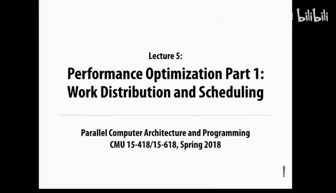

。老板都人家。说。So welcome back。So today。The recitation into Monday that was going to happen today。

 so today is just going to be a normal lecture we're going to talk more about。Okay。

 so where we left off was on Wednesday we were just we looked at examples of functional parallel programs。

 we looked at the grid solver， which was a simplified version of the ocean simulation。

 and we saw some basic parallel code in data parallel， shared address space and message passing。Okay。

 so today， actually today and then on Wednesday， so our next regular lecture。Monday。

We're going to dive into some important issues related to how you get better performance out of the parallel。

不是。So today we're sort of dividing that overall topic into two parts。

 so part one which we'll cover today is we're going to talk about how you divide up the work and schedule it on the processors。

 and then on Wednesday we'll talk about how we issues about communication and locality and how we want to do things to optimize the performance of that also。

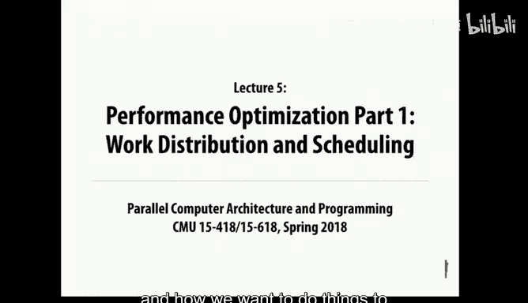

Okay， so one of the things I mentioned before is that parallel programming is a very iterative process。

 meaning you're very unlikely to get it right the first time。 In fact。

 you probably won't even get it right the second time or maybe even the third time。

So as you do the assignments， you'll get to experience the fact that you need to。

 it's really important that you measure performance and learn things from those measurements and use the insights from that to improve。

Things okay， even better。 Okay， so here are a couple of goals that we're trying to accomplish here。

 So， and we're going to focus on really the first one mostly today。

 which is we want to balance the work across all of the different threads so that they have the same amount of work to do。

 And sometimes that's easy and sometimes it's difficult。 So that's that's our major theme for today。

 At the same time， we want to minimize communication because communication is expensive。

 So we prefer to communicate。And then finally， we have to worry about the fact that not only communicating。

 but trying to be clever in any way to optimize the code often involves running more instructions in the program and that software overhead will also slow things down。

 so that's another source。

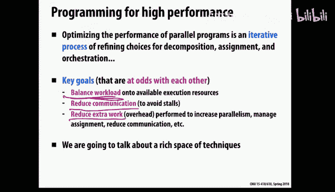

Of overhead。Okay， so our number one pro tip here is when you're trying to write parallel software for an assignment or for your project or anything。

 always start by implementing the simplest thing that might work first。

So it may be very tempting to start off by dreaming up some really creative， complicated solution。

 which you think might be very clever and make a very good performance， but it's very likely。

 as I said， that the first thing that you try won't work very well so what you do is get a measurement。

 use that measurement to learn what you need to tune and change when you do the second version。

So since your goal is to get a good measurement as soon as possible。

 then you want to start with something simple， where first of all， if it's simple。

 you can implement it faster and get that measurement earlier。

 and second it'll be easier to understand how to interpret the measurement if the thing that you're measuring is relatively simple and then go from there if you need to make it more sophisticated than you have a much better starting at that point。

Okay， so one of the things we're going to be worrying about today is balancing the workload。So again。

 as we saw in the very first class， when we had the four volunteers up in the front of the room。

 when the workload is not balanced evenly， then some processors will end up sitting around doing nothing。

 waiting for other processors to finish。So in fact。

 even if you get this almost completely right but not quite right， it can be very costly。

 so for example here we have four processors， and you might think we've done a fairly good job of balancing the workload because they're all within 20% of each other。

 in fact the first three we exactly the same and it's just this fourth form that's just taking a little bit longer。

 but while it's taking that little bit of longer time that's hurting performance because all the other processors don't the main thing to do。

 so we really want to try to balance the workload as evenly as possible。

Okay， so very so I'm going to talk about different strategies for dividing up the work。

And trying to balance the workload。And the first approach is what we call static assignment。

So the idea here is that we decide upfront how we're going to divide up the work across all the processors。

So we saw an example of this on Wednesday for the Great solve。

We divided the work up in the code that we finally looked at at the end。

 we used this type of block assignment， and we also discussed having an interlea assignment。

And there were some tradeoffs between the two of those things。But in either case。

 we've written into our code already the logic for assigning the computation this way。

 so it will always assign it this way to the processors。So it's determined ahead of time。

Now when I say it's determined ahead of time， there may still be a little bit of computation that occurs when the program runs because you may need to know the size of the input file。

 the size of the matrix or something like that， and probably the number of processors and do a little bit of computation based on that。

 but when you get to the point of actually doing the parallel work。

 you already have figured out exactly how everything's being carved up。Okay， now。

The nice thing about this， the big selling point of static assignment is that it has。

Close to zero runtime overhead。Because since you've already decided ahead of time how you're dividing up the work。

 there's not any extra work that you need to do while the program is running to think about this problem because you've already finished thinking about it。

So that's the big advantage of this approach。Okay， so that's a big advantage。

You you think that what would be a disadvantage of this approach？

When would you not want to do this if one of those assignments unexpected unexpectedly takes longer than you're stuck with it right so in the grid solver。

 it turned out that the computation was identical across all the elements and there may be cache misses and who knows maybe even page fault or things like that that may cause some of the memory accesses to take a little longer than other things。

 but basically we would expect it to be very uniform across all the computation。

 but that might not always be the case。So okay， so we'll get to what you do in a minute。

 I'll talk about what you do when you can't do a good job with static assignment。

 but first I want to just talk a little more about。

When we can apply static assignment or something very similar to it。

 because its very low runtime overhead is very appealing。

So the key thing that we need in order for this to work is that the runtime of the tasks need to be predictable。

Now嗯。

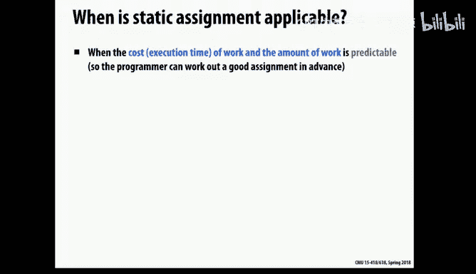

Let's see now the easiest way for them to be predictable is if they're all the same so in the grid solver。

 each computation at each grid point involves identical computations。

 so again modo cache misses or communication really to that。

 we would expect every task to take basically the same amount of time， so that's an easy case。

So if that's the case， this is fairly easy to think about it。

 then it's just a matter of assigning the same number of tasks to each processor， so for example。

 if you have 12 tasks and four processors then each of them will just get three tasks and we expect that that should work out fairly well。

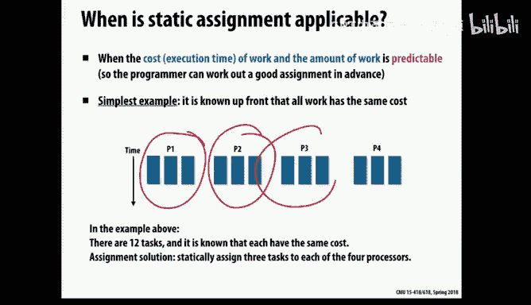

Okay。Now， as said， predictable， they don't necessarily have to be identical though。

 if you have a relatively inexpensive way to think about how long the different tasks will take。

So let's just as a really simple example， imagine that there's some input parameter to the task and you can very quickly predict the execution time based on that。

 let's say maybe it's just linear with respect to some parameter or something like that so in this case they may be different but you have a good way to predict how long they're going to take so here we see either are a lot of different tasks of different sizes。

But if they're predictable， then we have to do a little more work to make this work out。

 but you could potentially pack them together so that if you add up the expected time for all the tasks assigned to each processor。

 hopefully it will all balance out。

I'm liking this picture here。Okay， so this may not be perfect， but again。

 the big advantage is very little runtime overhead。

 so we're willing to give up maybe just a little bit of load imbal if we win more than that back with very low runtime overhead。

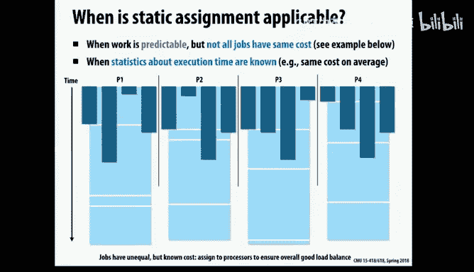

Okay， so here's one of these really good things to know about on this slide that you may not guess ordinarily。

hi is I'm going to talk about in a minute， I'm going to talk about dynamic assignments where you are fairly frequently making decisions about how to balance the work。

 but there's something in between which is called semit this is a very good trick to know about the idea here is that in many systems if you're say doing a simulation over time steps。

Although the amount of work per task may be changing over time and that may seem like it's hopelessly difficult to do its statically。

 it may be the case that that work is changing relatively slowly。So for example， last on Wednesday。

 I talked about。The Barnes H Galaxy simulation where we are modeling how stars are moving through galaxies over time。

 and I said that the amount of work is not uniform because you do these pairwise comparisons to compute gravitational forces and if you're in a neighborhood where there are a lot of other stars nearby。

 then you're going to have to do many more of these comparisons than for a star that's off here more or less by itself。

 because for the ones that are further away from other stars it's just going to summarize。

The mass of these other stars is one big block。Okay， so。The amount of work is non uniform。

 and it changes over time because the stars are moving around。But they're not moving that quickly。

 they're moving relatively slowly， so what you can do。

 the trick with a semist technique is that every now and then you decide what parameter makes sense。

 but you profile the time。Now that doesn't necessarily mean you do expensive CPU wall clock profiling。

 maybe you do something simple， like recording how many different computations you had to。

 how many different stars that I have to compare against a particular star。

 so you capture some number that will allow you to estimate execution time。

 and then you then divide up the work based on that。

 and then for some number of iterations you basically proceed as though it's a static schedule。

So you don't revisit how to schedule things for a while， and then after some amount of time goes by。

 you go back and then you re instrumentnstru things and you measure them and then you possibly change the partitioning。

So galaxy simulation is one example， there are a lot of other things in physical simulations。

 for example， if you're modeling aircraft in a wind tunnel， there are。

Things are moving around and changing a bit， but they tend not to change so radically that you have to this technique is likely to still be useful in that case。

Okay so this is a sort of midway point where you can think of it as static scheduling over some fixed time period。

 and then you go back and then you rethink how you reschedule。The assignment that is。Okay。

 so that's static scheduling， The other major option is dynamic scheduling。

 you probably could have guess that。So。The idea here is that as the program is running。

 it is the different threads are grabbing work as they need。That's effectively what it means。

So this is dynamically balancing out the assignment of tasks to processor。

So as one simple example of how you might code this up， if you had just a sequential program。

Where just you have a loop and the different iterations are independent of each other。

 and those are our tasks。So we could do it statically。

 we could just do it blockwise or interleaveated， but if we wanted to do it dynamically。

 we might do something like this， so we will have some counter。

And this will be a variable and this is actually effectively the loop index。

 so when a thread wants a loop index it's going to go read this counter and increment it and we have to put a lock around that or use some other kind of atomic instruction so that it doesn't get corrupted but each thread will go grab an iteration and now it will do work and if it turns out that some of the iterations take much longer than other ones。

 then hopefully this will all balance out in the end because you only go back and get more work when you're ready to grab more work。

So that's one example of how dynamic scheduling works， and this is something has a big advantage。

 which is it works when the amount of execution time is unpredictable and is likely to vary and you can't really predict the time very well。

O。And。Okay， any concerns about this picture on the right though？Actually， just a related question。

 in ISPC when you launch tasks so you use multiple courses。

 visit dynamically allocate the task to course。Yes。道大家可。That's right， I mean， the language doesn't。

 well， the implementation。Does it dynamically。The abstraction doesn't actually dictate how it does it。

 but the implementation happens to do it。So if one core finishes what it's doing。

 it'll grab the next。Okay， so okay， about the specific code here on the right。

 does anything if you look at this and think about performance， does anything concern you here？Okay。

 actually hold that thought， I realized I have a good followup slide and two slides before I get to that。

 and code is showing the work as loop iterations， but more generally if you have things that aren't necessarily loop iterations。

 you may have to have a data structure or something that describes a piece of work。And for example。

 the stars， okay the stars in the galaxy simulation。

 each one of these is a little node in a graph in that upre or quad tree data structure and we want to go visit all the nodes。

 so way you can think of this is that we take all of the stars if we want to do it dynamically。

Purely dynamically， we would have little data structures that would describe each of these tasks。

And we could put them all into some work queuee。So think of a big queuee。

 throw all the work into the view， and now you have worker threadreads so if we have say four cores and each one has a thread。

 then when they want some work， they'll go find something in the queue and they'll just go grab something out of a queue。

 so that's another way to think of this。

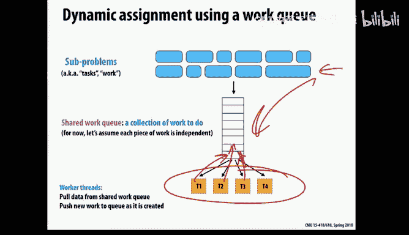

So all right， now I'll get back to my question before。嗯。Any concerns about this， performance wise。

 functionally， this is fine。But how how does。So fast you think this whole。

I'm not looking for an exact。Well， if you look at this。

 is there something that makes you- if you ran this and it was surprisingly slow。

 that might make sense to you and why might that be？Yeah。

The tasks are taking like roughly this amount of time。

 there's going to be a lot of threats contend for that walk so they can't get more working。おはい。Right。

 so the question is how long is it going to really take to do the work for a task so we're giving each。

The task size is one iteration in this case。And if that were T for test Priity。

 if that just takes a very small amount of time， then almost immediately you're going to go back and ask for another task。

And when you do that， there's a lock that's protecting that structure。

 so we could end up in a situation where the threads are frequently contending for each other or spending a lot of time trying to grab blocks。

So this is。This is called a fine grain dynamic。Assignment where in the extreme you know。

 tasks are normally things that。Makes sense intuitively to the programmer based on what the program's operating on。

 for example， stars in the galaxy simulation or something like that， maybe elements in grid。

So you may start off thinking， okay， here are my tasks， go the tasks into the queue。

Let's let it run oh boy the performance is really disappointing， it's not very fast。

 but how could we fix this so for this specific codeD is there a simple thing you can do to this to make it faster Yeah you could have each like。

Instead of computing only one or checking only one prime。You could have it check like five。

That way the。They'll ask for locks less frequently right that's right so in fact。

 before I go and talk about that so here's just a little visualization of if we're going if we're doing what's in this code here and we are only grabbing one iteration at a time。

 then what you might see if you measured performance over time so this is time going like this is that the blue parts are time when it's actually doing useful work and then the white parts maybe time when it's trying to go grab something off of the queue and trying to grab the lock and access the counter then you see a lot of white sections here。

 so it's possibly losing a lot of time and this is all Amal's law sequential time effectively it's not useful time。

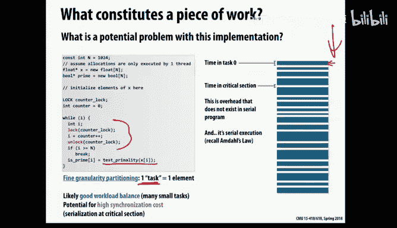

So an improvement， as she suggested， is why instead of grabbing one task， grab up several tasks。

So like for example， we could set it to be five or 10 or whatever number。

And now when we need work and we go in and grab something from the counter。

 we won't just get one iteration， we'll get several iterations， and now we'll walk over all of them。

And then the benefit of this is， well， it makes our tasks larger。

 so the sort of white part here where you're wasting time going back and grabbing a new iteration。

 that happens less frequently。Okay， so it should decrease that overhead。

So what's the downside of doing this？就。The courseer you may get。so if we make our tasks too large。

 then we may have load imbalance problems so what we want is this nice sweet spot in between wherere going we're spending relatively little overhead going and grabbing tasks。

 but we haven't made the tasks so big that we start to have load imbalance happening。

So this is another really important lesson。For parallel programming。

 which is many parallel program many novice parallel programmers think okay。

 they're static and there's dynamic， and when it's dynamic， a task is something that I grab。

 but then the programs suffer from a whole lot of runtime overhead so you should realize that you can this is a knob and you can adjust the number of tasks that you grab each time and so that's a really powerful way to balance the overhead versus lowbal treatments。

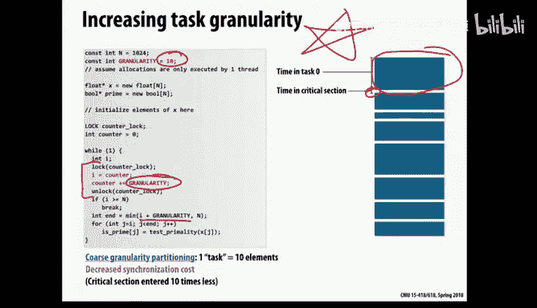

Okay， so to summarize what we were just saying， within this spectrum of setting the grain size for dynamic scheduling。

 on the one hand， we want to have at least as we don't want to have。

So few tasks are such large task that we start to hurt low balance。

 so that is going to cause you to want to have smaller tasks。At the same time。

 we want to minimize overhead and that will cause you to want to have larger tasks。

 like many things in parallel programming， the ends of the spectrum are not good。

 it's somewhere in between， there's a sweet spot in the middle and that's where you want to be。

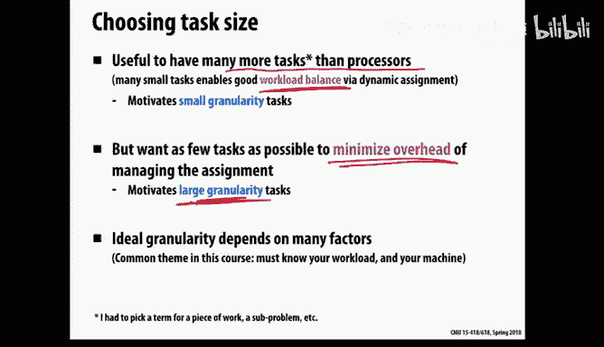

Okay， now for fun。Now that we've talked about that， let's look at a scenario here， which is we have。

 say a collection of work and we throw it all into our queue and it's not predictable and we enter it into the queue starting from left to right。

 so they're all in this order here。And we start handing out tasks。

 you know this one gets handed out first and this one and this one and this one。

 and the last task that we hand out is the one over here on the right。So。What。

What could go wrong there？O。

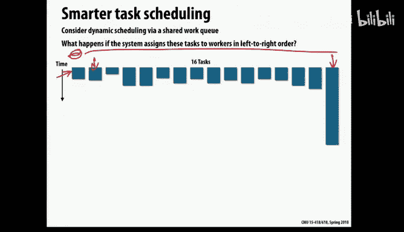

So we may end up with a picture that looks like this。So。What happened is。

We did dynamic scheduling and our green size was often maybe okay。

 but that we've got a little unlucky and the last task that we handed out here is going to run for a long time and then the other processor finished relatively quickly after that we started that task so now everyone has to sit around and wait for that big task to finish。

So that was unfortunate。So how can we address this？Well， first of all。

 if there was a way to break up that big task a bit more， that' would be nice。

 but maybe that's not practical for some reason， maybe there's not a good way to do that。嗯，Let's see。

So what would have been a better way to have handled this cue？

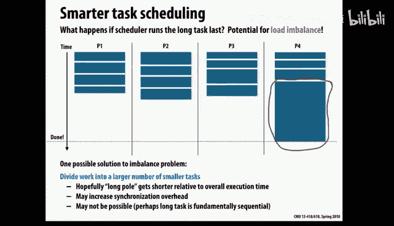

The work here。If you can assign the priority to。그他。谁留跟。Yeah。

 so if we had some way of knowing ahead of time that this was a large task。

 it would have been better to have handed it out early rather than at the end。

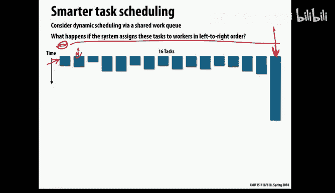

So if we've done the same work and had handed it up first like to P4 instead of as the last task to P4。

 then the work could have balanced out just fine， it would have turned out that P4 would have spent a while operating on that long task and meanwhile the other threads would have found other tasks to execute on and it would have been fine。

So if you think about it， this is getting a little deep into this topic。

 but if the task sizes vary like in this picture， the optimal way to schedule tasks is that early on in the execution。

 it would be nice to have larger tasks。

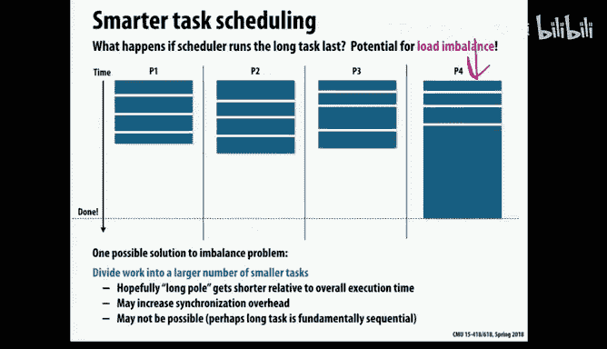

Because really， the only time that you need smaller tasks is at the end。

I meanThe point of having larger tasks has this advantage that you minimize runtime overhead。

And that's great until you get to the end and then oh you the pieces don't the puzzle don't fit very nicely anymore and now I'm wasting some time。

 so in a perfect world you would start with a big task and as you get further and further along you would start moving to the smaller and smaller tasks。

So you'd start with big boulders and end up with little grains of sand and then it would all hopefully smooth out nicely now that requires that you have to have some knowledge of some rough knowledge of which ones are bigger or smaller the other way that that insight might be helpful is sometimes you can dynamically adjust the grain size。

So in our example， a minute ago， I chose a aesthetic static green size of 10。

 but you could imagine that you could potentially adjust that over time and start with a larger grain size and then move it down to a smaller green size。

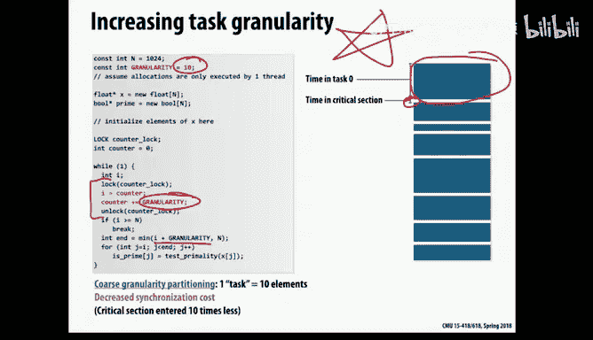

Possibly， you got closer here。Okay， now here's another important concept to know about， which is。

When you actually implement dynamic scheduling， several slides ago。

再个。I showed you this picture。Which is， I said， we could take all of our work and throw it into a queue and when you need to get work。

 you go to the queue and you get work。And I said that going to the queue frequently is bad。

 but even if we're going to the queue relatively less frequently。

 maybe we're not going there crazy frequently， but whenever we go there。

 if it really is one central queue， this has some disadvantages。

 which is we have to be communicating with the other threads frequently whenever we do this because there's a lock and somebody else has had the lock most recently and it's going to involve potentially some contention and some overheads。

So an alternative to that is instead of having one Q。

We could split up the cues and give each thread its own work。

So this is called distributed work queue。So we take the tasks。

And we have a h per processor or a hardware thread。So everyone has their own cue and you start off。

 you take your best guess at how to divide up this word method didn't look very good。

I divided it three ways。So anyway， you populate the hues with some work。

 maybe I divide that some more。You take your initial guess at how to divide up the work and you spread it across the cubes。

And then they start running， and now the nice thing initially is the deal is that the hardware thread will always go to its own queuee。

 and if sometimes when in these computations， when you're computing on something。

 it ends up generating more。You， more things to put in a queue。

 so it will always put those back into its own queue。So for much of the execution。

 this is wonderful because you have great locality。

 you can go to your queue and no one else is contending for your queue。

 so it eliminates the problem of having this contention for a shared queue。Okay。

 but as you can probably guess， maybe we use dynamic scheduling when it's difficult to do a great job of predicting execution time and carving up evenly。

 so there's a good chance that some hardware threads are going to run out of work。

And then what do we do Well so the simple thing to do would be just sit and wait。

You could have like a backup work queuee for threads that finish early。

 you would still have to use the lock thing foot。They could pull from that cu while the other threads are。

Still working out because。It's likely that not all threads are finished。

You'd have less people contending for the locks。Yeah。

 so actually so like just to maybe illustrate try to illustrate what you said， I could imagine。

Creating another cue， like an extra work cue， so maybe I take， I don't know。

 three quarters of the work and put it in the cues and I set aside a quarter of it in another backup。

You just do it from the other existing work cues。It is one a threat。it。

 it will steal it from the cue of another processor。

So that means you actually have lock on those cues。

 but it turns out that for the part of the program， for most of the execution。

 only one hardware thread is actually using that lock。

 and it turns out as you'll learn about it later in the class。

 you can cache the lock in your primary cache and it'll actually have almost no real overhead to go relock a queue that you just accessed recently yourself and that no one else has accessed。

So it's okay to put the locks in there。But the idea is that we can steal work from other cues when we run out of work。

 so in this way， we don't have to sit around and do nothing when we run out of work。

 we steal work from other cues。No。Okay， now there are a lot of。Okay。

 now stealing work is not totally cheap， I mean that's going to involve some communication and so on。

SoBut the good news is we don't have to do that until somebody runs out of work so for hopefully a lot of the execution。

 we don't have that overhead at all， but we still need to be careful about that overhead once it happens。

 we don't want to suddenly shift into this super slow mode once we start having to steal work where does the fence steal the work from？

That's a good question， so later today I'm going to talk about silk。

 which is a language that implement this in its runtime system and it does it randomly。

You could imagine stealing from the threat on your left or something like that and having a cycle。

Doing it randomly is actually probably fine。The thing you want to avoid is if a thing that would be bad。

 for example， is if everybody said， okay， we're going to steal from thread zero first。

And then thread one and then thread two， then you would end up you know creating other imbalances。

 so either random or something that's likely to be evenly distributed。

So a nice thing about this approach compared to the centralized approach is this is a good way to have both good load balancing because it's dynamic。

 but also good locality for most of the execution because until you actually have to start stealing youre accessing your own work from your own cue。

So， that's good。

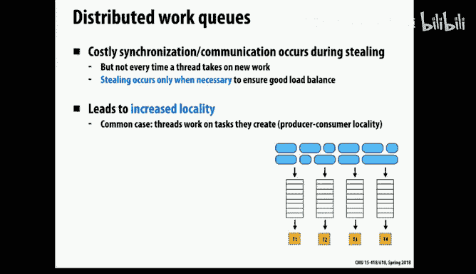

And there are a lot of interesting questions， so it's just asked。Which thread should we steal from。

 another really interesting question is how much should we steal？So。So should we take one task？

If you still work。Or more than one task。Yeah， it's better to take more than one task because if you take one task。

 odds are you're going to immediately be stealing work again very soon。So you， yep。原建。one内。家就内。終わりたし。

Yeah， so when we truly get to the very end and there's very very little work left and it's in one queuee。

 then there is going to be a lot of contention as they're trying to grab it。

 usually once threats start stealing， there's usually a decent amount of work in many of the cues so it's so often what you do is you take some proportion of the work。

 you don't take，Just say like half of it or something like that。

 you look at how much work is in the queue， you don't take one task。

 you also don't take all the tasks， that would be bad。

 that would cause that thread to suddenly run out of work。

 so maybe you take some reasonable fraction of the work。That's what you typically do Now again。

 at the very， very end there will be you not enough tasks eventually and then then you'll terminate。

So speaking of that， that actually。There's a little bit of。

Slightly nontrivial code there to figure out when you're done because you're only finished when there are no tasks anywhere。

 so to figure that out， you have to go look at the cues。

 all of them probably usually you cycle around through all of them and the other complication is that sometimes tasks can cause a thread to generate more tasks so you may go look at a queue and it may go put things back in it after you've finished so there's a little bit of complexity there but。

But anyway， this is a solvable problem so this idea of having a distributed cues with task dealing is a powerful mechanism to know about it。

 so this may be really helpful for you later on in the class。

 either maybe in some of the more advanced programming assignments or very likely in your project。

Okay， so we're almost done talking about task cues。

 but finally one last thing to say about them is the things that we put in the queuees。

 I said the other day that tasks， it's really good when tasks are independent。

 and ideally the tasks are completely independent of each other and we can just do the tasks in any order。

But sometimes it's very difficult to figure out a way to have fully independent tasks。

So another thing you can potentially do is have some。

 you can put information in your data structures where you describe any dependencies between tasks。

And then you only want to pull out tasks where all of their inputs are ready。

 so now the downside is that that adds some more overhead to thinking about that。

 but it's a way to potentially use this approach even when there are dependencies that you can't eliminate。

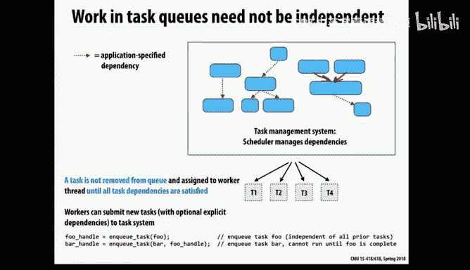

Okay， so this is the first half of today， we're about to take our inhibition break just a second after the slide。

 but what we saw so far is，In order to do a good job balancing work。

We looked at both static and dynamic assignments。诶。We saw some interesting things， so first of all。

 there's something called semit。Where you periodically measure things and then do something that's effectively static for some period of time。

 and you go back and do it again。And then when we looked at dynamic assignment。

 we also saw that dynamic assignment doesn't just mean fine grain dynamic assignment。

 it can be arbitrarily coarse grained。If that's a parameter that you can control in an ideal world。

 things would start out course and then maybe get a little finer over time。So okay， with that。

 we'll take our two minute interition break。We will start up after that。We can quiz up yet。よし。Well。

 we weren't actually because this is in your。系O好。Maybe we'llqui on that during this。Okay。

 noquis today。做然可能。Here。我就是て。感能。で。有不是一个。当是会有。きら。较手呢。做好了。咯。管一点。16点半关去。や。你家家就话。有て情。对。Yeah。会位。や。

Having a lot isn't necessarily a best。のいく。番。こし。然位。あます。は回次は。Yeah。我现在也拿到。Yeah对。First time of the day。

Why we just come discovered。We're going to look specifically at assignment and scheduling for fourth joint parallelism。

So one common scenario that we've mostly been talking about so far is you have a collection of data。

 maybe you have an array of elements and you just want to apply some computation to all the data in your collection and a loop is a good way to at a high level。

 we can think of this as just iterating over all the elements in your data。

 so what I've discussed so far has mostly been for this scenario where we have loops or things like that。

 mapping computation to data and that's our data parallel。

So another approach is that you create explicit threads。or hardware right？And in software。

 you decide at a higher level what you want them to do， and they can do arbitrarily different things。

So this works especially well if the code is not simply a matter of mapping the same computation across a whole lot of data。

So。Now the thing I want to talk about now is another。

 one- so how do we write a small amount of code that does something interesting with a large amount of data。

 well a loop is one way to go visit a lot of data， but another way is to recurse or have a recursive function that walks over your data。

 maybe it's a graph or a tree or something like that。

So so the interesting thing about that is usually when there's recursion。

 there are some dependencies as you're recursing， so you go down into a method into some procedure and you maybe have to calculate something first before you continue on so you can't simply say。

 oh， all of the things that I visit recursively just throw them all into one big task queue and do them all independently because they're not independent。

 there are dependencies as you're moving down。So as an example of this。

 we'll just look at a quick sort。So heres a very simple version of Quick sort where we have。

 say pointers to array elements， and so we're sorting all the elements within some range and what we do is we partition this data and then we basically recursively subdivide this into true parts。

So now we're sorting the left half and the right half separately。

 and then we keep recursively going down over that again and again。

 So this is called divide and conquer。 It's one way to。

do things in parallel now notice that there's a dependence here。

 so we have to complete this step we need to know what middle is before we can move on to calling this method。

So。Okay。But those two things are independent， once we've calculated middle。

 those two things can operate independently， and then once you get inside of them。

 they will also create more and more parallelism， so if you look at what happens over time。

 there are these dependencies， but we can quickly， after just a few levels。

 create potentially a lot of parallelism this way。Okay， so。

That's the scenario we want to talk about today。

And then we're going to discuss specifically as a case study。

 we're going to look at what happens inside of still plus。

So S+ is a language developed by a CMU graduate。He's a professor at MIT。In his group。

Carharl Lyson and friends。And it's in GCC and lots of other compilers you probably maybe you've even used it already。

 so the first I'm going to talk about the semantics or the part of the language that's relevant for today。

The most important primitive is to think about， there's something called silk spawn。

And then there's also silk sink， which you may or may not use sink。

 but you would definitely use silk spawn。And this is about exposing parallelism to the language what the meaning of silk spawn is you put this in front of what would look like a normal procedure call。

 and the semantics are that you will in fact execute who，That will happen。

 and you will also execute the code after the call of F。

But those two things may proceed concurrently。So。While F is executing。

 the things after the call of F may execute concurrently with it。

Whether that actually happens concurrently is up to the runfin。And that's。最近。Now。

Sinnc what this does is it's a join where I've used spawn to create potentially a lot of concurrency。

 and now I want to bring all of that I want to make sure that everything has sort of gotten back together again and whats silk。

 sorry silk sink will stall until all of the concurrent threads within this procedure have finished。

Now， another thing to know is。If you don't include one explicitly。

 the end of every function implicitly includes a thing。

 So you will never return to a procedure before you。

Syed up all of the spawns that you've created inside of the procedure。Okay， so then that's， that's。

High little picture。 So then。If you want to think about using this to create terrorismism。

 so this is just a very simple illustration here， so what we might do is。Cas Spwn with boo。

And then food can execute concurrenently， and then after that we want to do bar。

 so this is a way to tell the Sil plus runtime system that food and bar can run concurrently。Now。

 as a。Programr， you might be tempted to do this。You might say I want food and bar to run concurrently so I will do a silk spawn of food and a silk spawn of bar and then I'll do a sink because after all that'll make two things run concurrently and yes it does。

 but also the main thread now has really nothing to do so you've actually created potentially concurrent things where one of them is very uninteresting。

It's just about to immediately get the thing so in fact。

 if you really wanted to just run food and bar parallel。

 it probably look like the first thing and not the second thing and then here's an example where there are four things that you want to run in parallel so you just have a whole set of spawns and then something else after it。

So this is a way to express potential parallelism to the system。

And the system gets to decide which of those tasks it actually wants to run in parallel and in what order。

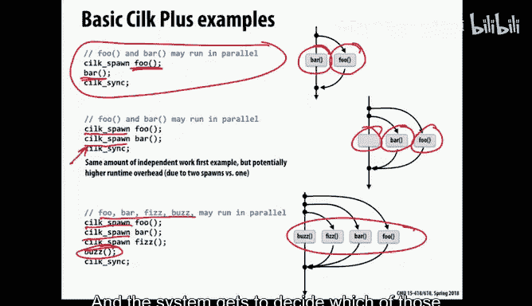

So。So this is important to realize a silk spawn does not compel the runtime system to actually create any concurrency。

 it could just ignore all of the silk spawns， in fact you can take a silk program and just ignore every macro in it。

 silk specific macro and the program will just run normally， it'll run sequentially。

 but it'll behave correctly。Okay， so the sink is a sort of a firm。

Sync has more of a firm contract than spawn， spawn can be ignored whenever you want to。

 you can't ignore a sink， a sink means no we really do have to bring together any thread if you have any concurrent threads。

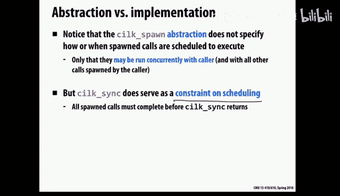

So let's go back and look at quick sort and how you might implement that in stillpl。

One thing to realize this looks very much like the code we saw before， there's one parameter here。

 which is。And this is a good thing to know about as a parallel programmer。

 as you start doing Diding and conquer， you'll eventually reach a point where it doesn't make any sense to keep dividing it further because once you have more than enough parallelism。

 you really don't need any more tasks， but also if you make your tasks very small。

 there's going to be a lot of runtime overhead for managing these tiny tasks。So what we do is we say。

 okay， when the number of elements to sort becomes small enough。

 just do it sequentially and that will be just a sequential chunk of work。

 but hopefully we will have already created a whole lot of parallelism above that。

So what happens is the thing that's different here is we had two calls to quick sort and we put a silk spa in front of the first one and that's telling the system that those two things can proceed concurrently。

So what probably happens is they do in fact start off going concurrently。

 at some point they get small enough and then that's a sequential task， but we have a lot of these。

 so hopefully we can keep all the parallel harbor busy this way。Okay。

 so that's an illustration of sort of the big picture here。Okay， so yeah。

 would Silk Spwn ever create a thread？Not enough course for it。I'm about to talk about that。

 that's a good question， so now what we're about to do is look under the covers at what really happens in the implementation of Sil+。

So we're going to talk about threads and what it really does with all of them。

 so that's a good question， I'll get to that just very soon。Okay。

 so think remember in an early lecture I talked about how it's important not to confuse abstraction and implementation。

 and this is one of these situations。Spawn is not a P thread create。

 it does not mean we are creating a new thread， it means we're telling the system that this is potential parallelism。

Okay， now how much parallelism do we want to create？诶。You。So in this picture here。

You can see that with divide and conquer， we may， in fact this is only this is dividing it by factor two at every level。

 if it was dividing it by even larger factor than that。

 you can imagine that after just a couple of levels of recursion。

 you're exponentially creating a very large number of tasks。So how many tests do we actually need？

Well， we don't need vast numbers of tasks。你问。To have more tasks than you have hardware threads because if you don't。

have static scheduling or you don't even have much work， so we want more tasks than hardware phrase。

 we don't need a million times more tasks。Part address probably that would be。

Definitely mean to have a lot of runtime overhead there to manage them。

So just as a very rough rule of thumb， having， some people think that if you have something like eight times as many tasks as hardware threads。

 maybe that's a good number， now your mileage will vary。

 but we're thinking about something in that rough ballpark。

 so a non trivialvial number but not a crazy large number of tasks。Okay。

So we want to create these extra tasks。Now， let's start with a very a naive implementation of silk。

So let's say we've described the semantics of silk and now you have to go build a runtime system。

And maybe the first thing you might try is well， spawn sounds like creating a thread and sync sounds like doing joins。

 So let's just use P thread create and P thread join for。For those things。Okay， well。

 so what's going to go wrong here？Y，' going have a whole bunch of。い friends。

of a whole bunch of thread states and all their different。And registers。しの声に。Y， that's right。

 so not only is it a problem， as I mentioned a minute ago。

 we don't necessarily need vast numbers of tasks。Threads are even a different story。

 so a thread is something that。Probably the operating system。

 or at least the thread Runtime library has to manage and whenever you。

 if you end up with more threads，Software threads， then hardware threads。

 then you have to time slice inB to pause one thread and start another thread on the same hardware content。

And that's nontrivially expensive， you have to save and restore or register state and this other stuff。

 if it involves the operating system， youre maybe trapping into the kernel。

 so we don't want to be generating lots of threads， we really don't want to have more threads than。

Of course， there are hardware threats。So if we did this。

We would have lots of thread switching overhead。So that wouldn't be good。

So in fact， what SLpl does is and this is a good general approach is that they when you start up the system。

 it will immediately create using something like PA create。

 it will create software threads for all of your hardware threads。

 each of them gets one software thread。So the way that you。

Deal with new work that's exposed because of a spawn is not that you create a thread。

 it's that the thread goes and looks at a data structure， which is your task view。

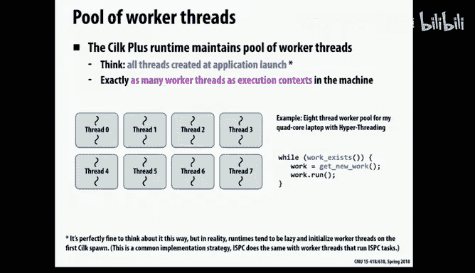

So what these threads are doing is each of these threads is looking for work in some implementation of our workC。

Similar to what we were just talking about before when I said we could have these distributed task cus or something like that。

Okay， so。So for example， if you have a quad core， like a typical laptop these days might have a quad core。

 and it may have probably has two hardware threads with hyperthreading。

 so maybe you want eight threads， so silk+ will just generate eight threads for you。Okay。

 so this is not about creating threads， it's about pointing threads at work to do。Now， okay。

 so now we're going to talk about some more low level details about what's going on inside Silk's runtime system。

And imagine that we。What happens when we are executing this code。

 so we want to execute who and v in parallel？So first， a little bit of terminology。

 so there are two things that can be potentially executed concurrenly in this example。

 both boo and bar。Can be executed concurrently， and we're going to call who the spawned child。

It's really the method that we're calling immediately， but then there's work after it。

 so we'll call the work。We'll have two words， child and continuation。

 continuation is what the work you would do after the call to approve， so in this case it's far。

So that's some terminology。And when we have a spawn， we can do food and bar concurrently。

 and if we have two hardware threads， which threads should do which one？

NowAt some level this may seem like a pointless question who cares where they're assigned just as long as they run in parallel and you don't really care maybe。

 but in general， if we look at， remember as this thing is running it's going to be generating more and more potential work so we want to have some policy about where we're scheduling things and turns out that this is interesting。

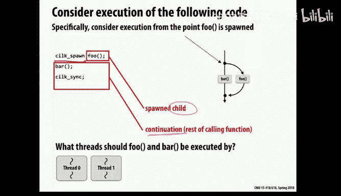

So okay， before I get into the details of how that works。

 let's just review quickly what happens when you run this on a single thread on like just sequentially and their normal execution。

 so if I just got to the point of。

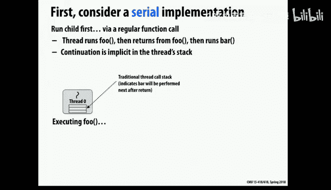

If I just executed this code。And there was no silk spawn in front of it。

 what I would normally do is I would go into food and execute food and then I'd return for food and then I would do bar。

And when Im。When I'm in fo， when I'm in the middle of executing foO。

 the way that I know what to do afterwards and how to get to bar is that in the thread stack。

 the continuation is there， so this is something you learned about in detail in 213 so you know you store the context that you're coming back to and that's how you know how。

O。So now， of course， if you're in the middle of if thread Ze is off executing fo。

And so it's off executing food and maybe at the time that it got to the silk spawn。

 there were no other threads that were looking for work， so it's decided okay， well。

 I will just go ahead and do food and then when I finish it I will do bar it doesn't look like anybody any other thread is available so I'll just do all the work probably。

But if in the middle of this thread executing foo， maybe now thread one becomes available and now it wants to do some work Now thread zero is already doing foo。

So thread one would hopefully figure out how to do bar。

So how is it going to figure out how to do bar？Well， in theory。

 maybe you could try to write some stack walking tool and try to go look in the stack of。

Dread zero and realize oh it's going to return to this address and here's parameters in the stack and maybe I'll steal them but then I have to stick something else into the stack so when it returns it doesn't do far also and that would well that would be ugly I mean conceptually you want to。

Somehow， threadread one needs to figure out that bar is something that connect execute。

And this has to work nicely in some way， so instead of thread Ze simply doing a normal call into F。

 what it does is it's going to do fo， say， for example， but before it does that。

 it's going to put something special into a work queue。

So it'll say here's some description of if another thread weight suddenly becomes idle and needs work to do。

 I will describe to it how it could continue through my continuation point by doing bar。

So you have some nice representation of， you know， here is how you would continue on beyond the point where I'm working。

Now if you finish Fo and come back and notice that this is still in your queue。

 then you simply go back and do that， so the thing that changes is when you return from a procedure for silk spawn。

 you don't just return like a normal return， you come back and then you look in your own cu and then you grab something out of it and that's how you continue on。

 so there's a little more softer overhead to do that。But the nice thing is now if this thread。

 if it becomes idle and needs work to do， if it will notice oh there's nothing in my cu。

 but now it can go steel work from the other Q， so it can go over and look at thread Zero's Q and say ah。

 you have some more work to do， I will grab that， move it over to my cu and now I can just start executing it so now barr has moved over to thread1 and now they really are running in parallel。

 so that's good。

Any questions about that？So。WhyWhy not instead？

Great， so that's exactly what we're going to talk about。That's a very good question。So。

So I just just sort of arbitrarily perhaps said that threadread Ze was going to few do Fu and put bar on the Q。

 but it would have been equally valid to do it the other way around。

 I could have put F on the Q and just done bar， so now we're actually going to discuss this for a while and just see which of these makes more sense。

 so there' are interesting tradeoffs between those two approaches。

So our choices are either do F first， which is our child。So in our terminology， that's our。

Do the child first。Or we would do bar。And that's the continuation， so it's either continuation first。

or child first and whichever one thread zero is going to actually do。

 it's going to put the other one into its queue and then that's the thing that'll be stolen by another thread so if you do the continuation first。

 another thread will steal the child， if you do the child first。

Getther right will steal the continuation。But basically， either who or bar。

 one of them you do and one of them you put in your queue。Does that choice matter？

So。Okay， so let's look first at doing the continuation first。

This is the opposite of what I described a little while ago。 so what if we actually did do。

The equivalent of bar first now to make this more interesting。

 I'm not just going to have two things I'm going to have a loop。

 so we're going to iterate over and instances where we're going to spawn to a spawn of food。

And so it's going to tell the system that there are a lot of things you can potentially do in parallel。

 there are lots of iterations here。If we did the continuation first， in practical terms。

 what would happen over time when we look at our cu？So。We get to iteration zero。

And we are going to put P with zero as the argument into our queue， so that will go into our queue。

And we set that aside and then we keep going because we're going to do the continuation and not the thing that we would have called not the child。

 so then we go around the loop， hit iteration1 and notice， okay。

 here's another silk spawn now I put foo1 in the Q and F2 and so on so it what it would do in effect is it would run through the loop and cu up all of the calls to foo that you see inside of the loop。

Okay， so this is a little bit like breadth first traversal of the call graph because it's going to。

Kind of eagerly put all of the work that you're about to call at a certain level into the queue right away。

 so that's what this does。One thing to notice about this is if you think about the order in which things would be executed。

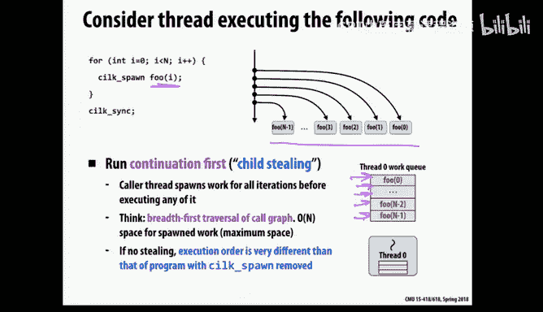

This is not going to be that similar to sequential execution， normally it's sequential execution。

When you call a method， you do that method first， and then you come back and do the thing after it。

 but here we're potentially going to reorder at it。theNow， in fact， things are occurring in parallel。

curency there anyway。

So that's if we do the continuation first， now what would happen in the other scenario。

 what if we do the child first， meaning that we are going to actually do foo sorry。

 we're actually going to do the fos that I call immediately and the thing that will queue up is the continuation of what would happen in the iteration after that point。

So what would happen here is。The thread reaches the silk spawn。

The thing that it puts into its cu is something that says， oh。

 this corresponds to being right here with I and equal to zero。So。If something comes。

 so then what it would do is it would then go do proofofs of zero。And when it comes back。

 it would realize， okay， now I'm just past that point in the loop。

 and now I'll loop back around again， and then I will do P with one as an argument。

So this is a bit like death first reversal， it's actually likely to visit the methods in the same order that you would visit them in in a sequential program。

So。Does it matter which are these ways you do it？Any thoughts from these two pictures？Well。

 if you do the second one， if another thread picks up your continuation。

You have no work and you have to wait until some other thread has。Right， so interestingly。

 if you look at these two pictures， if you look at this picture versus this picture from before。

 so in this continuation first approach。At first glance。

 this might look like a much better approach because we've just queued up all this work。

So if other threads come in and they need work， they can pull some work out of the queue。

 I put an abundant amount of work into my own queue。

 and there's a good chance that even if they steal some of the work。

 they'll probably work sitting there still for me to do when I finish doing food。

 for whichever food I'm doing right now。

And you compare it with this case what's sitting in my cu。

 only one thing which is to continue on and that's it and if somebody steals that then my cu is empty but's nothing for me to do so at first glance this may seem like the less good。

Approach。So any thoughts on that other if any other？So what do you think silk does？

So it does the second thing， actually。But one thing about， as you'll see in a second。

 the first approach is more eager， you know it's going to eagerly cu up lots of things and it will potentially do things in a slightly funny order。

 it will in a way that's legal， but it will。Throw lots of work into the queue。

 but a potential problem is， in fact， that this may cause the cus to grow to be quite large。

Because it's going to aggressively fill up cues， whereas the second one being is much more lazy。

 it's only putting like the minimum amount of work into the queue。

 it's not eagerly filling the queue， so it turns out in terms of cu size。

 you can make sure that the amount of space and all of the cues is nicely bounded in this child first approach。

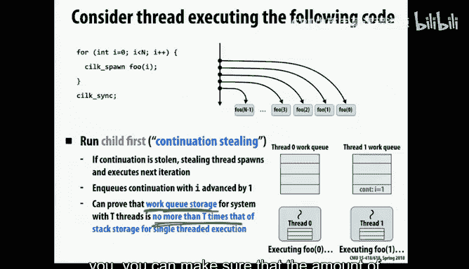

And。I'm going to then walk through what this looks like for a quick storage。

You can see why it is that this actually is reasonable just artifact。Okay， yeah。

 so maybe what you're asking is if you just had like say food and bar in some sense。

If they were really concurrent anyway， does it even matter which one was the continuation？そか。

AndAccording to you， is that what？first。Well yeah， that's true， so for the food and bar case。

 it's really somewhat arbitrary which one I put in this qua。When I put after it， I could have。

I could have switched them。So at some level， soman。In terms of program correctness。

 it doesn't matter， it really doesn't matter which of these two things we do。

 so all we're talking about now is like runtime performance。那。ThereNo correct。Okay。

 so but what I want to show you is what happens at runtime， so。

 it turns out that you dont the loop case was a little bit funny， so silk is more typically used。

 well it's often used for recursive programs and let's take a look at Quick sort。

 the code I showed you before and see what happens。To the hue， and this is with the second approach。

 so this is where we are doing where we're only putting the immediate continuation into the hue。

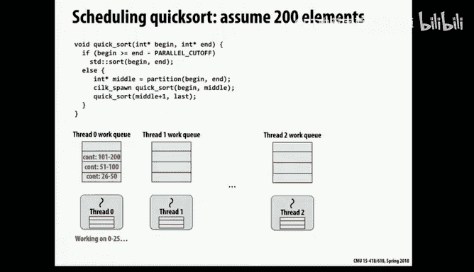

Okay， so then what happens is it。Over time， it starts off if we're starting with 200 elements。

 what it'll actually do is。诶。It will get in here and it'll start and the middle value initially will be say 100。

 so then we need to do the first part will be zero to 100。And then the second part will be 1012。Well。

 I guess it says 200。Probably 199 so if we're doing child first or continuation first， rather。

Child first， so we will put this into our queue， so that ends up in our queue。

And then we continue on and we're going to start doing zero through 100 and then what happens with that well then we recurse and then we come back and we divide that down again。

 and then we continue with half of it and we put the other half in the queue so now half of it's gone in the queue。

 we continue on the other half that happens again， eventually we drop below our threshold。

 whatever that is， so as we've been recursively going down the levels of recursion。

 we've been storing some of our work in the queue。Okay， now。嗯。All right。

 so then the way that this works， you have to this would not work well at all if it weren't for the fact that it does work stealing and it does it in a specific way。

 so now let's say we have these other shs and they need work， so what work should they steal？

So in particular。So thread one wants to steal some work， and here's some work that it might steal。

 should steal the work from this end of the queue or this end of the queue。

The top or the bottom of the cube。T or bottom in the picture。

 higher up in vertically or lower vertical。还你多。

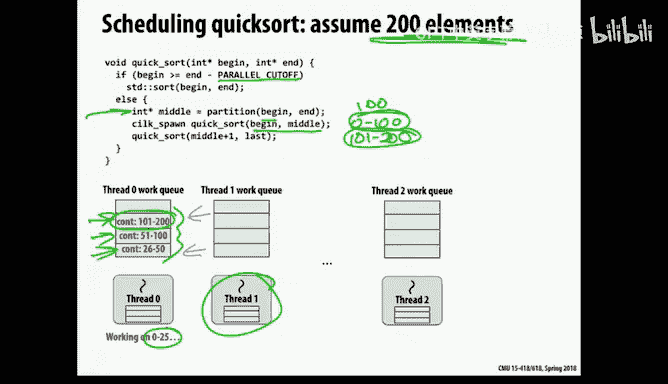

I would say hired。Right， so right， exactly remember we said？

It would be better to have larger tasks early on and then smaller ones later。

 so that's what Spl does， it will take the larger task。

 which is the thing that was queued up earlier。And we won't actually grab this。So in fact。

 you know this thread Johnson also， so it grabs what was on the top。

 this grabs what was over here and now the nice thing there are a couple of nice things about this question。

Yeah啊。こ？Oh it doesn't know， it just happens to be， so it doesn't know how much work is involved with doing the task。

 its policy is just， okay， which end of the work queue do we steal from。

 it's either the top or the bottom， you pick one or the other。

So do you feel the most recently in thing or the least recently in thing？

And it deals being least recently in Cu。I think it was longest ago， not most recently。

And that in this case， is the bigger amount of work because it turns out that in providingiding conquer。

If you're doing demand and conquer， you in bigger things early and smaller things later。

 so it's better to take the things that were in earlier they' likely to be bigger things。

So the way this is implemented is in cell+ is you have a double ended cube and it steals from。

 so you push things onto the bottom， but you steal from the top。

And so it does what you see in this picture。Okay， and then a question earlier was。

 which one of the cues does it steal from and it does this randomly？

Maybe random- so the only thing that you really want to avoid is systematically causing imbalance when you're stealing。

 so if you're doing it randomly， odds are that you're probably not causing some systematic problem like that by stealing。

Does silk or make guitar。In the，根据说分。Youton board。你说。You trust。这个这个。なっていうに。呃。Yeah， potentially。

 so it doesn't actually think about what the size is， it just takes those things。

This happens to generally work out。think about。Okay。

 so a couple of advantage of taking the thing from the top are that it tends to， well first of all。

 it's also nice because。The thread that owns the queue is busy。

In putting things on to this end of the queue， it also ines things down here。

 so you're not contending for the same end of the queue， one of other threads are steep from the top。

 but the local thread is accessing the bottom of the queue。

It also tends to be good for locality because when you grab something and start a big thing and start dividing it further。

 spatial locality independences are more likely to be preserved within that contiguous chunk of work。

 hopefully。O。So anyway， this works out reasonably well。

 they made these choices because it's often used for divide and conquer parallelism and this happens to be the right set of choices for a divide and conquer peril。

So that's I only have like two minutes， so that was the more interesting thing to talk about。

 the other thing to talk about is sync and I'm going to give you a slightly。An accelerated version。

That part of the talk。So there's really only one important point here。

We talked about what happens at SpN， now what happens here at sync， that sync time。

 you have to make sure that all the threads are finished and that we don't continue on past that point until we know everything is finished。

 so there's a data structure that's keeping track of the fact that other things are happening concurrently and they all need to come together。

So。Now， first of all， one thing to realize， okay， so we're going to have a picture here so all of our threads are working。

On various things， and maybe there's continuation here。

 and we have to somehow figure out that everybody's finished。Okay， so first， a really simple case。

 which is if you put a continuation into your if you did a spawn， if you reached a spawn。

I put something into your queuee。And no other thread stole it from you。Then when you hit the sink。

 you actually don't have to do anything to coordinate with other threads。

 if you can remember the fact that nobody ever stole from you。

 then there's no other coordination with need because you actually did all work yourself sequentially。

So that's an easy case。

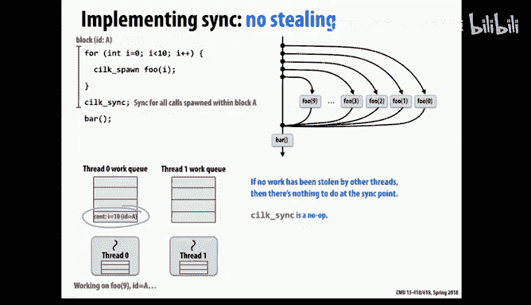

But that's probably not a very common case， so what happens if someone else actually steals it from you。

 turns out that there are two interesting choices。One choice is the thread that originally entered this started spawning things。

 you could say that that thread is always the one that will finish up the question is after the sync on which hardware thread do we continue executing so one choice is you spawn off other things and then they all come back and they coordinate without original thread。

So that's one approach that's called a stalling。好谁？

Okay so there's a low animation of that so for that you have a little data structure where you keep track of the fact that somebody still work for me。

 I need to remember how many things did respond， how many things have finished and acknowledged that they've finished and when you see as many things acknowledging you as you need to see then you know that you're finished and that thread could continue executing so that's。

Basically that's how that happens， there's a little animation here which you can look through later。

And then finally， the other option is a greedy policy。

 which is that the thing that can happen with the interesting thing here is that the thread that continues on after a sync is not necessarily the same hardware thread that entered the spawn to begin with。

So in other words， you still have a data structure that's keeping track of all of the synchronization that needs to occur that seemed to be finished。

But that thing can move around。And so the advantage of that is that the last thread that finishes has actually stolen that structure。

 so as soon as the last one finishes， it just continues on and at that point it's already gotten acknowledgecledgments from the other threads so you don't waste any time then waiting for synchronization so that's the disadvantage of the first policy which is it sounds simpler to implement。

 it is simpler to implement but it's a little slower because by saying it's always the first thread that continues on and it may just be waiting around for someone to come synchronized with it whereas the greedy case continues on with whoever just happens to finish last。

So it's a little more complexity to implement this， but that's what SL does。

 it does the greedy approach for performance reasons。

Okay， so that was the quick version of that。

And to wrap this up， we looked at Forjo parallelism and we saw that there are some interesting tradeoffs in terms of how we managed the parallelism and the goal was to have enough tasks。

 but not too many tasks and we saw how，So it does this with continuation。

 stealing and greedy going kinds of things。

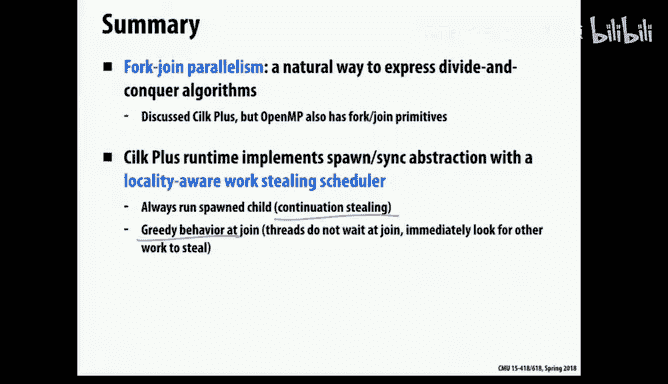

And that's it。