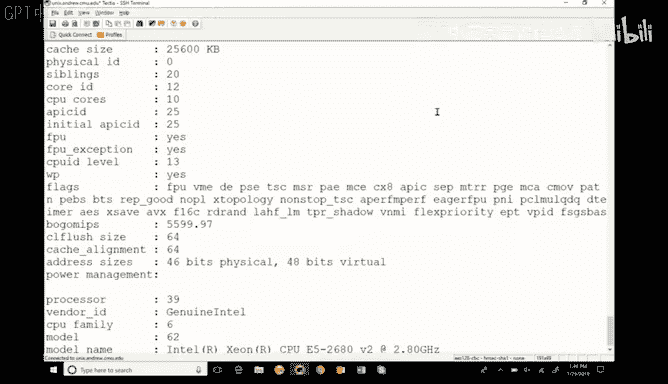
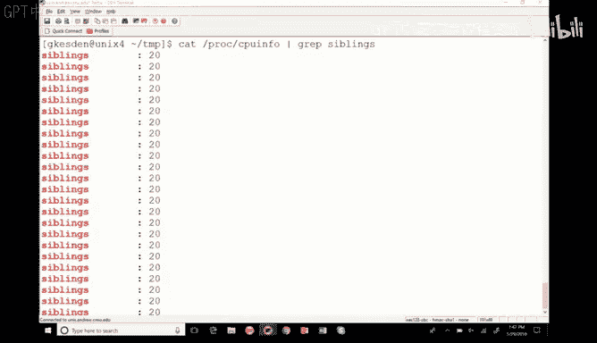
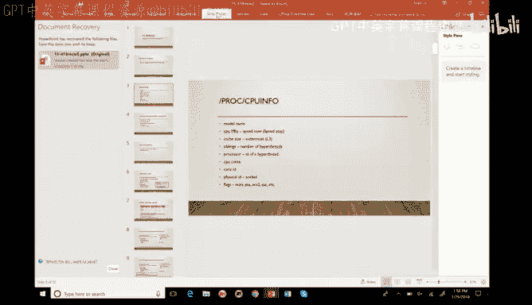
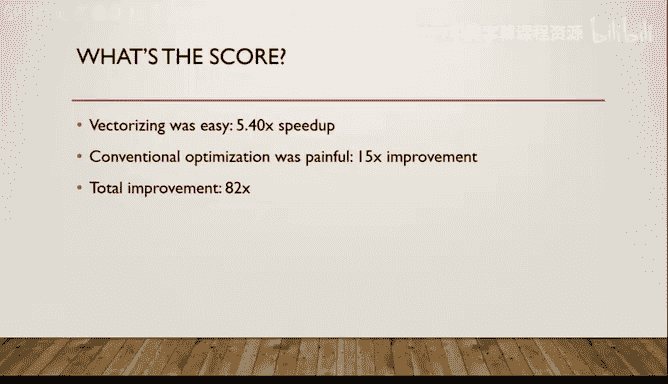

# CMU《并行计算机架构与编程｜CMU 15-418 Parallel Computer Architecture and Programming sp18》 - P6：Lecture 6 - 1-29-18 - Carnegie Mellon University.zh_en - GPT中英字幕课程资源 - BV18b421J7cA

All right， it looks like technical issues got fixed， so maybe in better shape than I thought。

So Gings my everybody， I guess this is the first time we' officially met and my name is Greg Kesten。

 I was at CMU from 1999 through 2015， when coming out of the beach to San Diego for a couple of years and now I'm back。

So I'm one of the cast of many instructors this semester， this is my first time through 418， Randy。

 as you've noticed， is sort of the lead instructor。

 Tod's the lead instructor of involved that I'm having fun。

If you bounce over to this directory in AFS， you'll find the code that's the basis for this recitation。

 you'll also find a PowerPoint version of these slides if you prefer them to PDF。嗯。You don't need it。

 so if you don't have your laptop， no problem at all， now that we've got projection。

 we're in good shape。And so play fast is sort of a grabback of miscellaneous things。

Related to the class so far， so we've talked a lot about optimizing performance you know for a processor。

 right？😡，How many of you guys have looked at s CPUU info before？How many of you not。Okay。

 how many of you are familiar with slashprock in general？How many are not？Okay。

 let's talk about that so back in the day you know。

 where it was uphill both ways to class and all those other things your grandparents might have said。

😡，But you wanted to get information from the operating system Colel？

What you actually had to do was make a system call and making a system call encountered a certain amount of overhead。

😡，And then you'd ask the operating system the question， it would answer， and it would come back。

 right， and then you'd have your answer。😡，In modern operating systems。

 there's this thing called slashrop， it's what's called a virtual file system。😡。

A virtual file system， it's not a real file system， but it looks like the file system。Okay。

 and so if you bounce over to， let's see。

Funds over to Uniunx Di Andrew。And you do NLS on slashpro。You can see Brazilion things there。Okay。

 this is information the kernel is exporting to you， it's showing you。😡。

And it's making it look like a file system just because that's an easy way for us as humans to access data。

 either as humans or programmatically， we can easily write programs that could open files。

 ref fileses， parse them， do whatever， right？😡，So slashPO exports a whole bunch of system state making it look like a file system。

😡，Because that's convenient for us and avoids the overhead of having to make a system call each time because the file system is already sort of baked in。

 if you take operating systems， you'll take a look at how that works。😡。

These things that you see that are numbered represent processes。😡，Those are process IDs。😡。

Okay so you see this whole list of directories to see all those numbers。

 each of those directories that's en numbered represents a particular process。😡。

And if I would do an LS on one of these， we'll say 15977。That one's gone now。

 so we'll look for another one。嗯。要大 by six。All right。

 let's do this but I do a piano who show me my own processes， my own process shell is 37684。

So I can do LS on s/37684 and I can see this directory that contains all sorts of information about my process。

 each of these files contain different things。😡，I don't want to spend a lot of time in this particular class diving through that because it's really not necessarily related to parallel programming。

 but it's a good thing to know。😡，Okay， and so if you look there。

 you'll see directories that relate to my file descriptors， relate to file info。

 relate to my memory map， and so on。嗯。If I do an L S on on。FD。

 you'll see a directory for each of the file descriptors I have opened。

 so you'll see a file representing my standard in， my standard out， you know file descriptors 15， 16。

 17， 18， 1902， right my standard error， and so on。嗯。也。You know， we take a look at。

Any one of these files， let's see。对过。啊，我 say map。We'll see my current process memory now。啊，嗰啲书费。

Cas my。理る。Firstly is way。识别我的区子。刷。Use your interface that very good。It。That's very big now。

 but that's okay， I mean when it comes to teaching。嗯。

I always wonder what it is that I can accomplish inside a single class。

 and I've been trying for years， but I haven't been able to figure out a way to sort of like core dump into a collection of students。

😡，And I'm not sure if I could actually cor up into your brains if you consider that know do you benefit or detriment。

 right， but what I've sort of discovered is that，😡。

I can tell you sort of what you need to learn and I can motivate you to learn it and sort of help you figure out like when you've learned it and that's sort of good enough because then you can go back and do that right and so if you sort of right now realize that SlashProC has a bunch of these different things。

😡，Then。I think that's sort of good enough for us。诶。How I can get back to my own super sake。It may be。

 but I think there may be a bigger issue。 We'll find out a second。

The thing that I want you to see from slashPt right now is this thing called CPUU though。

And CPU info gives you information shockingly and amazingly about your CPU。😡。

Nobody would have ever guessed that I know。嗯。And when you see a vendor ID of genuine Intel。😡。

I think you may wonder if this is an AMD processor。Model name。Again， shocking。Ziani 526。

 a version two at 2。8 gigahertz。Right。So this file tells you all about your process。😡。

And if you look the format is pretty easy， right， there's label， there's a colon。

 there's the information， it's designed to be easily read by humans and also easily processed by things like shell scripts and so on。

😡，Is there anything in this file that's unique to a specific process？The same file。

 but every process。There is nothing about this that you to process because in this particular case。

 every process is sharing the same processor。😡，Now。

 if we talk about looking at your process information， what they do is they use Uni file permissions。

To make sure that the owner of the process， that only the owner of the process can see the private parts of that process。

So although you can inspect your own file descriptors。

 I can't inspect your file descriptors to see what files you're voting。

 and although you can see your memory map， I can't go in and see your memory map。

So that's protected by the standard Uni readrite next permissions for the users of the group in the world。

Does that make sense。So it works really nicely in that you can dive down really deep into your own processes。

 you can get all the general information about the system state。

 and if you're the system administrator running is root。

 there are actually some of these things you can use they're called tuables you can actually change values of some of these files to change some of the system before parameter。

😡，And so slash drop is really a beautiful interface。IPa。要。

So this gives us a whole bunch of details about our processor。😡，And as it turns out。嗯。

Most of it is pretty intuitive， but some things get slightly strange。😡。

Like we see things like core ID。😡，And processor number。And so on。

And so you'll see that there's a processor one and processor two and processor three and processor four and processor you know。

 seven and block9 and so on， 11， do you think we actually have， I don't know？Look like。Twt 30。

 something actual 40 actual cores on this。Do you think we actually have 40 processors on this  zero to 39？

How do people think we actually have40 of what most people would consider processors on the system？

How many people think that there's something here that's looking like a processor that may not be an actual processor？

😡。

Yeah。So there's this thing called sibling。

Siblings，20。Well， we have 40 processors。And 20 siblings。What might that suggest？

What do you think might give us the impression of having more processes than we actually do get out in group？

What one process。20 cores。F forever。Yeah， we get a lot of hyperthing going on， right？

And that's exactly what this is， and so me bounced over back to my PowerPoint presentation for a second。

😡。

啊。Here are some of the things that are probably worth just。

Looking at the perspective of this class that。You know and how they're lay the model name is shockingly and amazingly the model name CPU megahertz is interesting because it's the speed right now。

😡，The speed right now， a lot of times the model name includes the maximum speed of the processor。😡。

The processor these days are really weird， right through speed stepping。

 where they'll actually slow down to save energy。😡，And they have a turbo mode。

 they can run in for a short period of time before they burn themselves out and they'll go into it for brief periods。

 then step back。And so what that CPU speed is， it tells you what speed it's running at right at this moment。

😡，As opposed to the information oftentimes given model name， which will tell you its maximum speed。😡。

I'm going to report yet。Simulating this is the number of e threads， why was it reporting 40？

Because when it reports a core in the way this is going to report it。

 is going to turn out to be include a hyperth because the hyperth is exposed to the operating system as if it's a core such that the operating system can schedule processes onto it。

😡，Because an operating system doesn't have an understanding of I hyper threading to about what he has an understanding of I need to dispatch a task。

Right，Ss of the number of hyper threats and we saw siblings 20， what we saw。Perco。Yes。

 that's multiplied cash size。Only the outermost cash is shown。😡，So when you look at these processors。

 oftentimes they have a cash per core， right， that's not shown here。

 what's shown here is effectively the level three cache， the cash that's shared by all the cores。😡。

Okay， so it's only showing that out of those cache。嗯。Tip to processor， CPU cores， core ID。

 physical ID， that's going to be the socket number。

 that's going to be like socket zero or socket one。

 so if you have a multiprocessor system you have like two processors。

 each of which has eight cores right that socket ID is going to tell you that。😡。

Flas will tell you about the capabilities of the processor， for example。

 we've been using AVX2 instructions。😡，And the flags will show you that these processors have that capability。

So there is just this treasure trove of information there and the trick to it is not to get distracted by all of it because it really is easy to open it up and sort of tap the room。

😡，Right， and you saw what I did when I was looking for something in particular， right。

 I made use of bread。😡。

I knew what information I wanted and I used B to go find it， how many people are familiar with B？😡。

Excellent， how many people would not familiar with G？Excellent， drop by my office， we'll chat。

Gred is a really great tool。Don't feel badly if you're one of the people who didn't raise your hand because you hadn't seen it before。

 still drop on my office will chat， that just means that you didn't happen to see it before。😡。

Prior exposure to BP is in fact after careful study。

 not any way related to success in computer science。😡，However。

 failing to learn and G what you've been told about it is in fact。

 related to future success in computer science。😡，So you should go a learn and bread if you have a dollar。

嗯。

Mently bandwidth isn't there and that's sort of a good thing to look at on power consumption is an interesting thing to know the code name。

😡，嗯。this is no longer stuff from slashproc， by the way。

 this is just good things to know about your process。😡，Okay。

 you generally want to know the memory bandwidth of your processor。

 and this is important if you think， for example， about one of the questions on the assignments right。

 that basically asks you to figure out where the bottleneck is。😡。

A we bottlenecking because we can't move the data into an out processor fast enough or are we bottlenecking because we haven't optimized the instructions enough。

 and it's taken too long。😡，The power consumption is interesting to know because power actually turns out to be really important in the world。

There are many environments that are actually power limited， believe it or not。😡。

If you're trying to operate at a data center in New York City， you're not getting any more power。😡。

You can't buy it， it's simply not for sale。Conadism is making all the power they're going to make。

 they've sold all the power they're going to sell， and that's just the way it is。😡。

They've been power limited in New York City since the '70s。That's just not going to change。

And there are many other places that are like that。

 and so when you think about power and you think about computation。

 the interesting thing is that at scale， how much power you use is a pretty good proxy for how expensive a computation is。

😡，If you can do a computation very quickly。😡，Using relatively little power at scale。

 you're going to be able to do that much cheaper than a competitor who's taking many more resources to solve that same problem。

😡，And so energy consumption is huge， in many cases we'd actually be willing to try a slightly slower result for a result that that uses slightly less energy because we pay for energy and if we're in our time budget。

 it doesn't matter。So energy is actually a really big deal you want to know the code name of the processors。

 like in our case， the code name is broad well， which has the same architecture as it has well。

 but it's done。The manufacturer is smaller。And that's important because that lets you look up the features of your processor to know what resources you have available in your program。

 you want to know how many adders you have and how many multipliers you have and how rapidly you can dispatch them because unless you know that you don't know how to optimize your code to make use of those resources。

😡，And so unless you know what processor you have at that level of detail， you can't look it up。

Once you know what process you have in terms of which micro architectureecture is using。😡。

In terms of exactly how it's implemented， now you can turn around and optimize your code because you know the functional units。

 you know the latencies， you know the cache sizes， and now you can start to make your code work well with that。

哦，I think most of you have probably opened this up and for those of you who haven't， you know。

 the devil is't the details and if you're looking for the details about our， yeah。嗯，对。

Remember you have4 tanos change the way they supposed to think about the event。

Does the fact that memory have channels think about the way you're supposed think about the banner。

 so when it comes to optimizing code for a machine？😡。

The frightening thing is that there is no thought。There is absolutely nobody。When I optimize code。

 I take a look at that top end bandwidth number， and I think I'm lucky to get half。😡。

That's the capacity that great with optimizing code。

Now I've seen some of the code that Randy's written。And I've seen him get 80X speedups。

 I got 40X speedups。Okay， or less。And so sure， if you know that memory has more channels and you really。

Really good， you may be able to use that to reason a little more about how many reasons write you dispatch simultaneously and so on。

😡，Can I， the answer is no。Is it not like utterly clear？These four。No。

 there is been a really clear rule， the reason is that because there's latency involved in memory a memory request。

In a hypercurling processor， you can have several dispats。And so the rule is least if there's one。

 I don't know。And the rule isn't as simple as。And force for。嗯。Now。

 I think it's really important that I say these things like no there's not rule。

 but I believe mean is no there's not rule that I know。

Because I have a feeling and there's probably not a simple。

I feeling that somebody knows way more than me could articulate。

Some scheduleched and discipline within their architecture。You know。

 that could be useful in some cases， I just don't have to know。嗯。

And you when it comes to that aggregate bandwidth， it's important to realize that you very rarely see all of that right that aggregate bandwidth maybe be with a particular request pattern that might be mostly reads or something right and now you have a mixed readwrite pattern and so you're not going to see that like I said。

 when I look at a better program and it's general purpose program and I see myself popping out at about you half of my memory bandwidth。

 I think geez， I'm probably not really going to get more than that。😡。

If I was in a situation where I had to， then I would probably start benchmarking the system and say。

 okay if I do all reads and I make this pathogenic process that's all reads。

 what can I get out of it and if I make this pathogenic process that's all write。

 what can I get out of it and as I started to interleave reads into my right stream。

 what am I seeing how does that change is that mix change？😡，Right。

 and then I would profile it in terms of my cash performance and so on。

 and I'd have to build a model of what that memory was。😡，And then once I built that model。

 then I would try to tune my programs to what I empirically saw。

 but in terms of a simple rule of thumb I haven't had。

That lost other then with just very coarse rules in terms of memory。Once I profile a system。

 like I said， I can often do better， but that takes a lot of work to be able to profile it。😡。

It has to be worth it。So here's a link to some processor to a document that's got a whole bunch of details about the architecture that we have。

 also chapterer 5 the your old 213 textbook， it's an amazing textbook。

 chapterpter5 also covers this architecture in a lot of detail and so you're looking for that information about the processor。

😡，A great place to belong。You know here's some stuff that I extracted from those documents all right。

 things that are interesting to know the functional units the parts of the processor actually do the work right remember our model of this processor is that it's sort of like an assembly lines right instructions come in。

 they get decoded， they get dispatched， they execute out of order right as long as there are no data dependencies or other structural hazards that prevent that right they come out into a retirement unit。

😡，Things get committed to the real world right in order out of that retirement unit。

 there are many copies of the registers in 213， we talked about a register set。

 but actually there are many copies of those registers within the processor that allow for things to happen in parallel。

 right？😡，With hyperthing， it's not just one instruction stream that can execute in parallel。

 but it can keep track of multiple instruction streams。😡。

So the operating system may dispatch two different processor or two different threads。

 thinking it's dispatching them to two different processors。

 because hyperthreads are represented as cores， when in reality those two processors are just hyperthreads associated with the same hardware。

😡，That just means that the processor has the ability to tag which flow they're part of。😡。

And keep them separate。Ass it retires them？Okay， so these functional units are actually like the stations inside the processor that are doing the work。

😡，Right and functional units can do different things and here we see the eight functional units and if you look at their capabilities。

 things like integer arithmetic， meaning ads and some tracks and things like that。

 branches and so on， we can see what we can actually do and how many of them we can actually do it at time saturating the functional units would mean that we're doing everything we can at a particular point in time。

 but that's usually not possible because the particular instruction screen we have doesn't support that there's not enough parallelism。

嗯。We can do four different independent integer operations。

Things like adss and some tracks and shifts。嗯。It takes two functional units to store an address。

 right， that's an interesting observation I think， right。

 one to compute the address and the other to store it。😡。

Which makes sense if you think about it because those are really very。

 very different types of things。One is sort of math and one is sort of memory。

In thinking about how it is that we can use these functioning units， right。

 there are a couple of things that we want to think about。😡，Latency and issue time。

arere two critical ones。Okay。Latency is how long it actually takes to do one instance of the instruction。

😡，How many clock cycles that takes？So something like a multiply is a much longer instruction。😡。

Then something like an appd or a shift in terms of the number of clock cycles。

But that doesn't tell the whole story。Because there's the issue time。

Which is the minimum number of clock cycles between times we can issue an instruction。😡。

Remember here our model is a pipeline。😡，So in an ideal world， even if it takes fourclock cycles。

 four stations in this pipeline to do something。We can start a new instruction every clock cycle because one moves down。

 one moves in， one moves down， one moves in， right？😡，That's the ideal assembly want。In reality。

 because of the way these things work， we may have to wait， we may have to put one in。

 let it move a couple of stations， and then put another one。😡，Okay， and so。That's our issue time。

All right， so those two parameters are sort of really important， right。

 how long it actually takes for a single instruction and how rapidly we can feed them into the processor。

😡，How well that pipelining is supporting that particular structure。😡。

The capacity is what we talked about earlier， how many functional units support this？😡，嗯。

Back in the day a simple capacity number was good enough right if you said that you could do four ads。

 that four ads was really descriptive right you said you could do four ads and three subtracts and two whatever that was really descriptive Now when you look at the modern processors。

 they get a little nuanced。😡，Because as you see here， some functional units。

Do sort of a basket of things， right， one or the other or the other， right？嗯。

And so you may not be able to do all the things at the same time。All right， here's a chocolate code。

And。Looking through what Randy did with this is sort of amazing actually。

 because I took this example and I optimized it as best as I could。😡，I mean， as I couldn't hand wave。

 I thought I had a pretty good answer。And I have like a 25 time speed up。

And then I went and looked at the bottom of Randy's notes in this recitation last year。

 and he had 80 times speed。And then I went back and Id really worked as hard as I could。

 and I had like 40 times speed up。And then I cheated and looked at his notes。嗯。

And so look at this code and if you look at this code。

 the first thing that you want to draw your eye to any time you're optimizing is the inner work loop。

😡， you guys remember Amds law？😡，Anybody。Abody老 film美演。If there's part of a program。

 that's sequential。这好は。Okay， so that's a specific instance of Aah's law that if there's a part of a program that' sequential if there's a parallel part of the program or a sequential part of the program。

 it's never going to run fast than the sequential part of the program if there's a part of a program that's not optimized。

😡，Okay， more generally， what's the most general form of ondo's law？😡，If you think about。

Your program's activity as a pie chart， okay？And you think about optimizing each of the activities as some pie slice。

😡，At the end of the day。If you pick a small slice， you can only make a small fruit。😡。

If your slice represents only 10% of the pie， you can't make more than a 10% improvement in that program。

😡，Right？Because you take that from 10% of the time to zero time。😡，You've eliminated 10% of the time。

And as a result of this， small optimizations。And more common activities tend to make a much bigger difference than big optimizations in activities that are really short。

 right？😡，So when we're trying to optimize a program。

 we usually focus in initially at the inner work loop。😡。

The parts of that program we spin and spin it bins， bins， bin， spins， spins， spins， bin。

 and spend all our time。😡，Because I could make even a small improvement。In an inner work loop。

 I probably made right that small improvement on the whole program。😡。

But if I make the first three instructions go away， right， I've made my whole program like 0。

5% faster， I've eliminated three instructions。😡，So when you're looking at something like this。

 you want to dive right into the inner workload， the parts of that program that are the ones that think get spun over and over and over。

😡，So in this case， it's pretty easy to see that we've got a nested forer。😡。

So we're going to dive in and focus on the interfo loop。Because that's the inner workload。

 that's where we're spending most of our time。😡，So that's where we can make the biggest difference in performance。

That bright red part。So now my question is， how many times is this being executed？😡。

And if we look at our for loop， it's for j equals 1， J is less than equal to terms。

And then we look at the outer loop and we see the outer loop is running right n times。😡。

So n times term times， right because the number of times E。😡。

Interloop runs times the number of times the outer loop runs because the inner loop runs。

 turns times for each run of the outer loop。😡，So this thing is really busy， right？

So we look at this in blue and we wonder like what's painful here？😡。

What could be costing us performance like where are we spending our time？😡。

Because optimizing some place we're not spending our time is not going to be helpful。😡，Well。

Multulipplications are really slow operations， right？😡，If I look at this。

 the most expensive operations I see are multiplications and divisions。

 divisions even more painful than multiplication。😡，So the focus here， at least initially。

 is going to be on reducing the number of multiplications and divisions， does that make sense？😡。

Be that we can reduce the number of multiplications and divisions in this inner work loop。

 light is to get better。😡，We initially benchmark this。And see which seven， nanoconds per。Okay。

 that's where we're starting and like Todd said last class。

 it's really important to get your initial measure。😡。

A lot of people will start out and they'll think about this in their head and they'll like， okay。

 this is going to be expensive and this is going to be expensive and this is going to be expensive and they'll start optimizing until they've even written it down。

😡，Don't do that。Okay。Successful software has grown。Sort of born。Your first goal is correctness。

Get it right。Express the idea as simply as you can。

 as correctly as you can and prove that it's correct。😡。

The last thing you want to do is go down the path optimization and then find out that you actually had a problem in one of these equations and have to change it。

😡，And now all of your optimization is wasted。Its a computation change。Sttop。You know。

 zero is get it correct。Then go down the path of optimization now that you have it correct。😡，Right。

 find out what you have。Get a good measurement。Get that measurement with as much precision as you easily can。

😡，Okay， if the innermost work blue happens to be in a function and you could measure the time in that function。

 prove that that's where you're spending your time。😡。

Get as much of a picture as you can to prove to yourself that you're going after the biggest slice of that pie because you can make no bigger a difference than the size of the slice that's Amol's ball。

And it's foolish to waste time optimizing something that doesn't matter because you didn't take a little bit of time to figure it out。

😡，It's foolish to spend more and more and more and more and more and more time on things。

 making smaller and smaller and smaller difference if there's a bigger space that you can go after and you get that by instrumentation。

😡，Back when I was a grad student， I wrote this。I wrote this proxy for the Department of Defense。

 it was a secure proxy。It certain Department of Defense systems to connect to the internet。

And it parsed all the traffic going up and back。And。When the thing was first deployed， they loved it。

Solve a billion problems。And then about three weeks later。

 we started getting calls that the whole thing was too slow。😡，Well， what happened？Well。

I took a look at what they were doing， they were no longer using it for simple web pages。

 they were using it for these huge monsters and I'm like okay， like these pages have 10。

000 times as much data as what we planned on。😡，No wonder slow。

And I went about the process of optimizing this code。😡，I spent months optimizing。

Okay I went and I dove into the inner work loops and I changed the representations of data structures。

 I used compression at various places， I optimized which order things were evaluated loops。

 they would short circuit faster， blah， blah， blah， blah， blah。

 I got something like you know a 2% performance improvement。😡。

I was getting ready to go on these strategies with even more performance。

 but all these things were good， I mean， if you looked at the part of the code I was working on。

 I had like， you know，😡，180% improvements but they were all these small little things。Right。

And you know， and then I graduated。And then I was with the faculty。

And it's my old advisor in the office across the hall for me。

And one day I'm sitting there in my office and he just walks in and does this。

Like follow him over to his office。And I see on his screen。My proxy cut。More precisely。

 I see the proxy code in one window and S trays in another window。😡。

How many of you guys are familiar with Estros？S trace traces system calls。And in particular。

 the entire screen was filled with calls to break。😡，Something like 14，000 of them。

And then I immediately knew what the problem was。You see。

 break is the system called that Malck uses to ask for more memory。😡。

Can you think of any reason why Malck should need to ask for many， many， many pages more memory 14。

000 times and moving a web page from here to here？You see。

 I knew immediately then what was wrong because I remember doing it。At about 3 a one night。

 when I had a deadline is be of team project meeting the next morning。😡。

I was too tired to figure out exactly how big a buffer needed to be I mean there was a static limit and I knew how to figure it out and if I worked my way through the state machine it would be I could figure it out。

 but I didn't want to get it wrong in the middle of the night and all I needed to have was a demo the next day。

😡，And so I wrote myself really quickly， grow a buffer with Malck and drop that in。

And since I didn't intend for this global buffer to be part of the final solution。

 I didn't bother put in a free。😡，Was that？Yes， that sounds painful by 14，000 times or so。

And then I offered to fix my bug because I knew what it was and of course he already had because it was like three minutes to figure out like what this was。

 I just didn't have it in me that particular night and I went sliing back to my office。

Because the last three months of my graduate program， I spent optimizing things that didn't matter。

Because I didn't bother to look to see what the bottleneck was in my coat。

If Id taken 10 seconds to profile that。😡，I would have seen that it was in system calls。

 not in computation。😡，And then I would have remembered that night and fixed it。

And this problem would have been fixed in legitimately less than five minutes。But instead。

 I spent three months optimizing。😡，And then。Now， a client spent three months suffering。

 and then my advisor had to fix it。😡，And the one that I could remember as I slinthered my way back to my office was what he had told me probably the first time I had met him。

😡，A conversation about entirely different things。Which is that human intuition is a poor indicator of system performance。

😡，没事。Because I think we were having a conversation about something else nice that I think， blah。

 blah， blah， and he said， no， no， no， human intuition is a poor indicator of system performance。

 measure it。😡，In other words， I don't believe a word you say， show me。He was right then。

 he was right when I graduated， he's still right today。

 although now he's retired living in the lakehouse。😡，So you need to benchmark。😡。

I can't emphasize that enough， whatever you think you know， it'll feel good to know that you know it。

All right。😊，嗯。Simple improvements。Okay。What am I doing here， you can see the bothface， right。

 those three lines on the left。😡，Computation is signed over on the right。😡。

It would be easier if you can see the original code on your own system。😡，But for those of you can't。

 you can look at it later， all we're doing is precomputing something。

 we're taking something out that was being computerd as part of the loop that didn't need to be part of computer as part of the loop。

😡，We're just refactoring it to get out of the innermost loop， putting it inside the other loop。

 because it wasn't actually changing。😡，That term was not changing。

 so we could just move it out by way。😡，So now we're down to 6。16。Okay， that's not a huge gain。

 but that was a gain that was cheap， right that was almost free。😡，So now let's focus on this。

The division here is very， very， very possible。😡，And it's also independent of the variable in the outermost loop。

😡，Nice， we've reed that division。😡，Go你来个 way。And now we're down to half of what we were before。😡，2ol。

Now let's take a look at that inter work loop bit assembly。They're just kidding。

 I actually like a something。So assembly is bad initially when you first start reassely。

 you don't know what the instructions mean and you look， well， not what is that。

 you can't even pronounce it right， and then you realize that it's afuse multiplying act。😡。

And once you get to the point where you can look at the instructions and know what they are。

 it's actually much simpler to read in some sense than like other code。

 so as long as you focus on a few lines right it's simple and direct。

 but you have to get to the point you actually can read。😡，And so over on the right。

 we see sort of we see the assembly code that we're looking at。

 and then we see you know the reverse engineered C code。😡，So we started out the C。

 we compiled it and got the assembly， and now for for the benefit of everybody here。

 we've now translated this back to C， so we're seeing the seed that represents the exact assembly so you can read the code on the right and that's going to mean to you the same thing as the code on the left。

😡，Otherwise might。All right。If we look at this， we'd see that this is all pretty simple stuff。

 you like an addition， right？😡，A knot equals， a test， that's really fast。

And if we think about our capacity for multiply， we see that the bottleneck。😡。

The problem with the multiply is when you insert a multiply。

 you have to wait three cycles before you put the next one in。😡，哎。

So now we're going to use a technique called loop Unrolling。😡，This is a 213 technique。

 you heard this very， very denaring your old 213 textbook， I'm not sure if you remember it or not。

 but loops are very painful。😡，They're good for humans。

 but they're very painful for actual code performance。😡，And the reason is you think about a loop。

And you think about。You know the nature of a loop， the idea for those loops is they repeat and they repeat and they repeat and they repeat and they repeat and they repeat and they repeat they repeat and they repeat and the end of the loop is the exceptional case。

 right a loop may run a thousand times and only end once。😡。

The problem with the loopts is you have to test that condition each one of those thousand times。

 right？😡，Even though it's only relevant once， so110 of1% of the time。

 does that test do anything useful， yet you have to do that test every time。😡。

So if you have a small loop， that test may be a substantial overhead on the amount of work you have to do。

To make it worse than that， they do bad things to processors。

 because processors right are these deep pipelines these days。😡。

and they pack this pipeline full of work and they do this because they predict right。

 they take this whole instruction stream and they start cramming into the processor。

 but when you get to a branch， there's a choice。😡，Do we go back to the beginning of this loop or not？

And if they guess wrong， that whole loop to that all that work inside the pipeline has to get thrown away。

 it's called flushing the pipeline。😡，O。So processors go from simple policies like predict the loop is taken because most of them are having statistical predictors。

😡，Okay。The bottom line is this right， loops are really painful okay the other thing about them in terms of instructional parallelism。

 Ive forgot this point is that if you think about the instruction flow and all you have is your work。

😡，It's very easy to parallelze that work inside the pipeline。😡，Unless there's a data dependency。

 youre out of order execution can execute it out of order。😡。

But once you start to have conditionals in there， that forms dependencies that serializes the work。

 even if the prediction isn't the problem。😡，So。Loops， right involve the overhead of the test。

 they have branch penalties， they decrease the opportunity for pers。😡，All right。

 so we had this technique called loop androll。😡，All right。

 and so maybe what we do is we unroll the loop。And we do。Two units of work， every loop。

 or four units of work， every loop， or eight units of work， every loop。😡。

And then we stopped the loop early， like we're trying to do 30 things。

And we have eight times unrolling， we may only get to 24 with our loop。😡。

And then we have the special case in the last three of the end， does that make sense？😡。

So what happens here is we've stretched out this loop。

 stretching out the length of code that's not interrupted by tests。

providing more opportunity for parallelism， not interfering with a pipeline as much。😡。

Okay so now we're in a much better position， of course there's a trade off here。

 and that that our code is now much larger because instead of our loop being three lines long。

 our loop is going to be many times longer because it's got to do each of those three things in sequence that before forward we're through iteration of the loop。

😡，Be were flattening out that loop to some extent。And then at the end。

 it has to deal with whatever special cases on over。

So this is a classic time of performance trade off。We're having a whole bunch more instructions。

In order to get them to execute faster。And in extreme， this is bad。Okay。

 because if I have a ton of instructions， now I'm not going to be able to take advantage of my instruction cash or my processor。

 right， because if I have a small set of instructions I'm looping over a lot， I have great locality。

😡，If I unroll those various same instructions， they're in different places of memory。

 they don't look alike， they have a much bigger footprint than my cache。

And now it pushes other things out of my cache。Were even going to sell out of the cash。

In older processes where general purpose registers were scarce。Right once we start unrolling loops。

 we may need more variables。😡，Because Asian instance of that loop is sort of an unrolled babyce。😡。

And now we may not have enough registers for our variables。

 and so now we end up the compiler may end up spilling variables onto the stack。😡。

Now when older processors， 32 bit processors that had very few general purpose registers。

 this was a very big concern。😡，On the modern 64 bit processors that coincidentally also have way more general purpose registers。

 you have to work some to causes this spill。😡，But you still want to see that in the assembly right。

 you'll actually see that in the generated assembly。

 if it takes the register and moves it to the stack and then moves it back from the stack and the register。

 you know that you've caused that。😡，Right。So it's observable。Also， in some types of embedded systems。

 there could be reasons not to do this for reasons of memory constraints or other events。😡，Okay。

So now if you go through and you can dive in， you can actually see the code yourself。

 it's in that directory， you see that this is our new inner work loop， the code is down on the right。

😡，So now we see we have six clock cycles for two elements。We've decreased multiplied by one。

 and maybe we've made a small difference， but we're not going to see a big improvement coming yet。

Now we're going to make a little bit of an assumption， which is at the floating point math。😡。

Is associatedsoci and distributed。Okay， just like real numbers would be。Technically speaking。

 Fing Point math is neither associative nor distriive。😡，Because of the weight flow points around。

 you do the same computation in different ways you may end up with slightly different values。😡，Right。

The advice I get everyone with floating points is never use the equal equal sign of floating point numbers。

😡，always attract them， right？And look for a difference less than a certain value。

Because if you do complex computation floating point numbers and you happen to compute them differently because you have a value coming from one system and you're doing a computation on another system or whatever。

 the rounding may work differently， and you may have two values that for all intents and purposes are exactly the same。

 but they're not because of floating point rounding。😡。

engineerers always talk about things in terms of tolerance close enough。

 and when you're doing floating point math， you have to assume the mindset of an engineer。

 you have to ask the question， are these two numbers within tolerance of each other。

 where the tolerance is， whatever it is for your application？😡，But for this point。

 we're going to assume that for the purposes of this particular code of the s function， right。

 this math could be distributive and associated without changing values。😡，In some sense。

 we're just assuming that the way we chose to distribute things originally and the association we chose to have was just coincidental based upon how we wrote it。

 we really didn't actually think about that， I mean we just wrote it out， right？😡。

So rational not changing。嗯。So now we've done that and because of that。

 we've been able to refactor this code。😡，嗯。So now we're reducing a delay three cycles。

 but we're computing two elements in that time， so our clock per element is down to one and a half。😡。

O。We're battling this one， right， we're doing all sorts of these micro optimizations。

 getting fighting for it， but we're getting benefit here。😡，Now we start to think about this。😡。

And this is more properly where you can tell the difference between Randy's skill and mind because this represented like a scling note in the corner of Randy's nose here。

 because it took him like three seconds to figure this out。😡，If we keep unrolling more。

 we'd be limited by addition to the update now。😡，系。嗯。So in other words。

 the addition is now becoming the bottom line。All right。

The fuse multiplying ad units are what's becoming limited。😡，Right。嗯。

And then we'd also start to become limited by the overhead of setting up the loop。

 not dividing things， even la and clean up all the other things we talk about in terms of loop unrolling over it。

😡，2。So if you look at the left， you can see the number of times of unrolling， two time unrolling。

 three time enrolling， four time unrolling， five times unrolling。😡。

And you can see the performance improved， it's not uniform。😡。

Because of all those artifacts we talked about， but you can see there's generally a downward trend。😡。

But we took the number of terms up to 16。😡，We see that we actually have a nice relative low at four times improvement y。

 4，8， 12， 16， no cleanup at the end。😡，So it divides evenly， so we do much better it。😡，Now this 0。

7 seconds nanoiseseconds per element， right that's like 10 times better than what we started right。

 I think it start on like seven and a half。😡，So we battled it right with a whole bunch of these old school optimizations。

😡，So， we've done。Pretty good results in the end。Okay。

 now we're going to let loose by vectorizing our best solution。😡，go go IPC。😡。

Right because this is sort of easy， I mean think about how much we've had to fight to fight and get into the dirt right to get the optimization we've had so far。

 think about how painful that's been。Okay。😊，We've tried some things。

 we've reasoned as best as we could， we've gotten it right sometimes， we've gotten it wrong。

 sometimes we' found this nonunform stuff and figured out why and picked the right values and so on。

 right？😡，I mean， it's been a 30 minute story in class， but in all seriousness。

 it probably took Randy three weeks to get there。I can assure you in three weeks， I didn't get here。

I got about halfway there。ok。嗯。So now。他だ。A quick lu ISPC right here to vectorize it。

 and we're going to be good to go。😡，I want you to notice the two bold face lines in the upper left。

There's a word there that I'd like us to pay attention to。Any idea what it is？女朋友。Uniform， yeah。

 the only word that's in common between be those two lines。

Somebody remind me what a uniform variable is。😡，Okay。The same across all instances。

 the same across all instances。 So if a value is computed。Upon a uniform variable in one instance。

Is that computed value going to be available in another instance or is it going to need to be recomputed there？

😡，What are you guys in the back thing？Back class， yeah， you won't get shit away， maybe onm dangerous。

All right， somebody back here， what do you think？O听。主个讲我啊。Where。はいこれ。

You compute this thing in one inity bell。Yeah， I mean， we don't make it uniform。

 then it're all under， right？If you change it one it doesn't change it in the other， right？

But if we make it uniform， then we change it in one place。This changes， right？我见。己是。Okay。

Now my question is， is that beautiful？就是。Ideally， it's good in this。Yeah， and so that depends。

 right I mean there's a reason you have to ask them somebody to be uniform or like leave it not。😡。

And the answer is depends。If we make something uniform A， it's shared by everyone。

 we will have multiple copies， and B， that change is visible everywhere。😡，If we don't。

 then we have multiple copies right and the changes depend， yes。In this case。

 I it would be good because。We are。Since这。Its not others gonna。

The population needs to be redone over and over， but it could be done by a normal or unit and not a vector unit。

I mean， that's actually I didn't actually think that， but you're exactuter。

 you're actually true as as a matter of how that's going to be through the pipeline now keep in mind that。

When we add vectorization， we're really changing the way we use the functional units。😡。

We're not necessarily adding more， but I think you're right。

 that's going to feed through the pipeline much better Yes。

 why does it feel like a lot of these optimistic？Talk about like the kind of thing。

You knowSo some of the optimization， the question is both and compiler do this for us。😡。

And the answer is in many cases it will。But some things it can， for example。

 it doesn't know whether that computation is distributed and associ or not。😡。

So it couldn't make any of those and worse than that。

 it could not only could it not make the optimizations initially with changing the association with the distribution。

 it couldn't make any optimizations that were apparent after doing that。😡，So yes。

 although compilers can do a lot of things， there is still a lot of optimization blockers。

They can prevent compilers from doing these。Which is why I always say benchmark at first， right。

 we didn't start optimizing the sea code， we started running it with flags and looking at what assembly it produced。

😡，And that's why we looked at that assembly。To see what did the compiler actually give us？

So if we unroll it we're not going to unroll that's done， that's not a problem。

I didn't know the exact flags that we used， but all these were relatively so three。

I don't know what a fast pass， like imagine he asked I just jumped about that。Again。

 that map has these things have trouble with mathematical rules and all sorts of other things。

 they don't know whether a conditions is likely to be true。

 you declare an energyer variable variable， you think it's from zero to n and it looks at it and says it can be from negative whatever to whatever。

😡，You know it's not going to overflow， it has to worry about。

 but there are a lot of things that come into mind as you actually look at the differences between the types as understood by the programmer and the type limits as understood by the hardware。

😡，Yeah， so any rate， the fact that those two are declared as uniform actually turns out to make the performance improvement because we don't have to recompute those values in each of the instances。

😡，All right。So。Diving in here。This ran in 0。63 nanoisecond per element versus 7。

16 the unvectorized code。Speed up of 9。83 times。😡，嗯。A speedup of more than eight times seems strange。

 right？Why does this speed up of more than eight times seem strange？Yes， it' an AY vector。

 so if I'm doing I go from doing eight things in series to eight things in parallel。

 I shouldn't see more than an8 x speedta。😡，But what I've done by declaring those as uniform is I've actually taken that work out of what has to be done eight times and made have done just once。

😡，ok ， yeah o。Done， however。Correct， but before we had that code was part of that in the work loop。😡。

And now by making it uniform， in effect gets pulled out of the inner workload and done once privilege。

😡，Not with each of the unrolls。So that work is now taking one eighth of what it was because we're parallellyzizing everything else and that's being factored out。

😡，And so the devil is really in the detail sometimes。啊受。不在。IfWe consider optimization to be a sport。

 right， we've got to keep score。😡，I we've got to keep score right so vectorizing was easy right thing about vectorizing is it was a free basically 5。

4 times the speed up。😡，Any of the individual optimizations we did。

 with the conventional optimizations got anywhere between effectively zero and seven times speed。😡。

But they were all painful。But collectively， conventional optimization guy 15 times speed up。

For the first three weeks of work。The last 15 minutes of work got us 5。4 times speed up。

For a total speed up of 82 times。😡，OkaySo I guess what's the point you know of today of this part of today's class。

 the point of this part of today's class is that we're spending a lot of time this semester talking about architectural features。

😡，And talking about ways of using those architectural features。😡。

But you can't forget your basic 213 program。😡，Because it got us three times the speed up of vectorization。

😡，In some sense， vectorization turned out to be the treat the cheap。😡，Now。If in the real world。

 you're writing code。😡，You're going to probably try this the other way around， right？😡。

You're can probably take 30 seconds or whatever， some short amounts of time and optimize the basics 213 style as best as you can。

😡，Not spend three weeks on it right， you're then going to turn on vectorization because that's free and then you're going to ask yourself。

 am I good enough？😡，Is this the best way to spend my time？In some cases the answer is yes。

 in some cases the answer is no。RightMost of the code we write is not inner work loops inside the most demanding parts of the kernels of our software。

😡，We write the code and our goal should be to make our code as express it as possible。😡。

They have to say make it' is easy to read and maintain。😡。

Which means that optimization hurts code quality。😡。

It makes it more likely that you or someone else will introduce a bug。

 which makes it more likely that your company is going to encounter some penalty as a result of what you've done。

 either a delay in the production of the software because the bug is going to have to be caught and fixed or an injury to a customer because they're going to experience a bug。

😡。

Right but once we get to these inner work loops inside the kernels in our software。

 then optimization matters because there's the difference between doing something for our customer and not。

😡，Being able to deliver that result before the customer hit the X in the upper right hand corner of the screen and not。

😡，Making that the activity in that game more realistic or not and so on。And then it actually matters。

And generally speaking， you need to get something within some budget。

 there's a certain amount of smoothness you need to have。😡。

And beyond that the human can't tell there's a certain amount of resolution you need to have and whatever it issue you're working on。

 and beyond that it doesn't matter and you're going to optimize it until you get within your budget。

😡，Any questions about that？Somehow I actually think that I ran through this 10 minutes faster than I expected。

And so I apologize that I actually thought I was going to run long。

But you get 10 minutes for alcohol from you next time。

And so plan on running 10 minutes late prior to you。嗯。As always guys， I'm here to help。

 if you go to my webpage and click on a little link， you can see my schedule and come find me。

 I've got office hours over in the OnBuild， but also here。

 but also not here engaged but also engage in the common area on the fifth floor so I'd love you to drop by saying hello Cha。

Have a great afternoon。