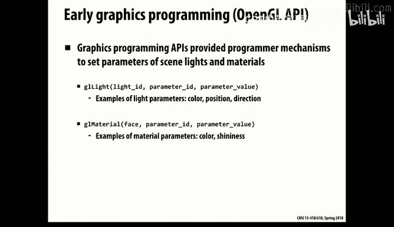

# CMU《并行计算机架构与编程｜CMU 15-418 Parallel Computer Architecture and Programming sp18》 - P7：Lecture 7 - 1-31-18 - Carnegie Mellon University.zh_en - GPT中英字幕课程资源 - BV18b421J7cA

So today we're going to start talking about。啊GPUus。

And I'd say GPUs are sort of one of the most exciting things to come along in high performance computing in the past several decades。

Because they really shifted the whole space of what's possible。Performance wise。

And now if you look at， could we turn down the volume on this？

So they really shifted the performance possibilities and now if you look at pretty much all major supercomputers。

 what they are， they've stuffed a bunch of GPUs together and that's really the way because the sort of raw compute power you can get out of amazing and the trick is to have both the appropriate applications and write your programs in the right way for it to work。

So that will be the topic of this lecture and of course， in the current assignment you're working on。

So we'll talk a little about how these came about and then we'll talk more about- it's an interesting thing because at some level of abstraction。

 you don't even need to understand the hardware to make use of these。

But if you actually want to get real performance out of it， you do。

 so you have to kind of enough about what's really going on underneath it when it executes programs to have a sense of how especially you can exploit some of the features that let you drop down to a little bit lower level and get much greater performance。

呃，So。You recall we've shown this picture before。 The idea of it is that on one chip。

prettyty big chip， you have a bunch of processors， each of which at some very vague level looks like a fairly conventional modern CPU。

 meaning it has ability to support multiple AOUs through SID instructions and it's able to support multiple threads in what Intel calls hyperthreading or more appropriately simultaneously multithreading。

These GPUs also exploit that kind of idea， but in a much more。

A way that that sort of actually gives you a fairly different model of computing overall than a conventional processor does。

 So it has a lot of these。 These are called S Ms in the。NVIDdia world， and this shows 16。

 this is based on a slightly older model， the ones you've got in the GHC machines have 20 of these。

 but the idea is you have sum number of execution units。

 each of which can support some number of arithmetic operations and a multiple execution context and then connected to a memory that in the world of memory is relatively small but the bandwidth to it is extremely high。

So let's just go through a little， as they're called graphics processing units。

 and that's for a reason， that's the context in which they。Rose。

 and the very first versions of these， that's all they did。

 All they were good for was computer graphics。 So let's understand enough about computer graphics to appreciate why this computational model is particularly well suited。

And the point is that in modern computer graphics， you have many small objects that you want to do some operation on。

 So a sort of data parallel model of computing is a very natural part of it。

And so this shows an example of if you want to render something like a three dimensional shape。

 you'll typically create a set of triangular patches that describe the shape of it。

in a set of finite elements， and then you want to add different features to each patch。

 what color it should be and other things， and then map those from a three dimensional plane。

 the actual object space onto a two dimensionsal viewing space， such as a screen。

 and that's what's involved in rendering。So， the。ideaas that we want to be able to do this and especially a lot of the market for this came in computer games。

 So it shifted from something like making a movie by Pixar where they could have a rendering farm of 5000 processors running for days to just render each frame of a movie to wanting something that people could plug into their have a game box or something that fits。

In a small box and does real time because as people travel through these games。

 you want to be able to render。 And， of course， the original early games were very primitive in terms of the graphics。

 but there's been a drive to be more and more realistic in it。

 And it turns out that getting more and more realistic in graphics is one where it gets sort of exponentially more difficult。

 the more realistic you want。 So even this scene， you'll see a lot of stuff going on。 For example。

 you'll notice that the parts in the distance are slightly fuzzier。And then the things in the near。

 And that's， of course， to show the ice idea of， of the atmospheric effects that the things further away。

 there's sort of more。呃。啊。Rendering more diffusion that you want to add to it， and you see。

 for example， up in those mountains， those sort of wispy clouds。

 those are instances of where you want to run a sort of diffusion model。

Through of the what the distant images look like before you render it。 So lighting。

 modeling where the light sources are coming from， how they reflect off of scenes。

 all of those things are， as you want to add more and more realism to it。

 you want to make it look good。 And also， if you add something like this boy running through the。

The grass， you want to render the physical motion of him as he moves that look somewhat like a real human being would be。

 And you can also imagine adding features like if you wanted to have a wind blowing or a breeze blowing that you'd want these blades of grass to be。

Waving and that becomes obviously a huge amount of computation just to create scenes like that。

 so the more features you add， sort of the more physics you want to add。

 the more lifelike you want it to be， you have to just keep adding more and more to your computational models。

And again， there's this huge market， not just video games。

 but something architect wanting to be able to show clients what the building would look like。

 the ability to do this and have the。The client be able to sort of move around and view this at different angles and again。

 realism in terms of the effect of clouds in the sky and what that will reflect off the glassy windows and different effects of lighting sources and things。

 just keep adding more and more complexity to it。So I'd sort of step back a bit and think about well what is it that builds up the set of steps you need in order to do this graphics display。

 so we'll talk about the entity， what are the objects that we want to work with or the nouns。

And so this goes from starting with some。Object in， in physical space。And then we'll pick out。

 We'll assign points。To create this triangulation of it will create the vertices of that。

 And then those vertices are connected to form the triangle。 So we have to start with something。

 in this case， a purely synthetic thing and。In 3D real space and then start creating pieces that we can manipulate as geometry。

And then when we look at something， we see the projection of that triangles which exist in three dimensional space onto the three dimensional space of the viewer。

 and in particular， since our screens are composed of discrete pixels， we want to。

 for each pixel assign a color value and RGB value to that pixel。 So somehow we have to go from this。

Oject in three dimensional space project it to a twodisal viewing space and at times actually combine the values of multiple objects in this case in this teapot。

 we could assume that it's an opaque object， and so we just have to render the triangle that represents the thing closest to the viewer。

 but as you saw with that example of rendering mist or clouds。You're，'re actually composing。The。

 the values of multiple。Parts in the distance to combine to form what's out of any given pixel。

So what operations do we want to perform on these entities then？Well。

 so imagine that we have a we're setting up on the right， what's called the graphics pipeline。

 the sort of sequence of processing steps that you go from some notion of a physical object to a rendered image。

And so we'll start in this case already pretty well along。

 We're not actually worrying too much about the physics of the modeling of， of。Things， we。

 we're jumping right into。 We've got something where we've。We've created a triangular mesh。

 And now we're ready to render that。So imagine that for each point vertex。

 we have its three coordinates in X， Y， and Z。And those defined in a series of triangles that will represent a list of vertices and say every three group of three of these is a triangle。

And。Again， those triangles exist in the physical real world。

 and we want to project them onto a twodiional screen as if from the perspective of the viewer or a camera。

 so there's sort of a mapping from three dimensional space projecting onto two dimensional space that depends on the angle and position of the viewer。

And。Then， that will generate。A series of primitives in this case sort of。

that will project our triangles now are sort of gotten flattened into the triangles that will compose the picture itself。

And then within each triangle， since we're turning it into these discrete pixels。

 that will represent a series of small squares that we have to assign color values to。

And then finally， we assign Co。 So you notice it' on the right。

 we've created this pipeline where each step we have。

Many objects that we're trying to do some operation on。 and it。

 but you see a natural parallelism in there that each object can be operated on independently。

 We start with a bunch of vertices。That we do this projective mapping onto。

Those are all for each vertex。 It's independent the other vertices。Similarly， for。

One of the things we'll end up doing is figuring out which which triangles occlude， which ones。

 what's the relative to position in the Z dimension。

And only and figure out what gets occluded as a result of that。And then that drops down。 So at first。

 we're working with vertices。 Then we're working with triangles。

And then we're working with individual squares， which we assemble into pixels。

 So our objects keep shifting and the operations we want to do keep shifting。

 But this idea if we have a bunch of stuff that has this very natural parallelism comes out。

And so you can imagine then if we can just make this go fast。

Then that will at least get us a long ways to this goal of being able to render graphics at this very high speed。

And so that gives us this pipeline And as I mentioned there you can just keep adding to the kind of features you'd like to build into this and basically add more stages to this pipeline that you might like to do。

 So for example， if you just look at the simple issue of light reflecting off of a surface。

 it's actually an incredibly difficult thing。 you see these different balls here。 And for example。

 this one in the upper left。Is a very diffuse image。 It's a very map finish to that ball。

 And so there's not much reflection。 It's a fairly straightforward。

 but even then you'll see that the curvature of it affects what color you get on different parts of that ball。

 And then you go to one like this where it's a highly reflective。And you'll actually see back。

 if you're looking closely at that， you'll see。The camera that was taking the picture being reflected back。

 but then also。Wped appropriately or something like this， where it's just a simple。Shape， but still。

 you'll see that reflection。And you'll see the reflection of the。Like a mirror image of the viewer。

 but also at the top， that little square is the specular reflection of the light source bouncing off。

So。So you can appreciate that。This is just a series of balls。 You can imagine more and more。

Involved in what is it we're trying to show？And so there's sort of standard software packages。

 open GL that let you apply operations and they're sort of also described in this sense that you can add parameters to your system。

 what is your lighting sources， what are the material properties of these objects that you're trying to add。

 and so you keep adding more and more information it's the job of the graphic system to then use that information appropriately。

And as I mentioned， if you look at， and it's kind of interesting， I'm not a graphics expert at all。

 but when you start to look at things and you start to look at detail。

 it makes you really appreciate the sort of subtlety of things。So， for example。

The statue in the middle of something like marble。 The light doesn't reflect just off the surface of it。

 It goes partway into the surface and then reflects back， and it also is partially translucent。

 So you get light shining through the object as well。 the thinner parts of it。

Something that's highly reflective， You know， metal has this mirror effect that then you have to。

 in principle， sort of figure out。To render that properly。

 you have to then sort of go backwards and find all the information that was caught caught in that reflection。

Natural things like skin and， you know， is even more difficult and materials such as leather adds a lot more complexity to it。

 too。But there are certain tricks that we can play， for example， this table cloth。

There's a sort of uniform pattern。 And so there's something called texture mapping， where。

relativelyative low cost effort， you can sort of take some uniform pattern and project it onto a surface of an object like this。

 and so that's something that's very commonly done and it's kind of a cheap way to create the illusion of complex patterns even though it's done in a。

Not very fancy way。And so these kind of。啊。Demons it you want。

You don't want to just lock all this pipeline into hardware because every time you add features or consider new features。

 you might want to add some sort of software functionality that describes what steps you want to take。

Did that just happen。Yeah就这样。Pug and unpug。Good。You can see by these pictures that we keep wanting to add little pieces of code like a shader is something that after you've created these fragments。

 something like I mentioned， the diffusion effect of those clouds。

You don't have to actually model the physics of light。 You can kind of just cheat。 You can say， well。

 any pixel in the distance。 I just want to now。Change its color。

 adjust its color a little bit to reflect the fact of it coming through。

 or it's a relatively local processing of that particular pixel。Other things require much more。

 like I said， to do reflection properly。 you have to actually do what's called ray tracing。

 which is you keep bouncing。You sort of work your way backward what a beam of light would be doing。

As it goes back and forth between objects back to its original white source。

That's a much more involved time。SoBut the point being that graphics is just a great example of a place where you have natural parallelism。

 you want it to run fast， but you want to have some programability to it as well。嗯。

So something like a shader and we won't look too much about the code。

 but the point is you want to be able to write these little pieces of code that will modify the pixel values according to some algorithm that reflects what particular property you're trying to impart on。

And you'll notice it looks not unlike ISPC， there's uniform varying， so things that are global。

 others that vary with particular points in the image and code that looks vaguely like C that's performing some operation on how do I want to modify this particular local value to implement some particular feature？

And this is an example of the idea of what I said， texture mapping。

 that you take some regular pattern and you map it onto a the surface of some object like this creature or the。

Ground that he or she is on to create the sort of more complex images， but done in a very。

It's a relatively straightforward operation compared to sort of real physical modeling。

So， you know， of course， from before that historically。

 this kind of work was done just with regular CPUs。

 and somehow we ran out of steam in 2004 to make a single CPU go faster。

 but still maintain the ability to have a lot of transistors on a chip。

 So the GPU sort of arose out of that。A recognitioncognition that we can make a lot of processing elements。

 it's just we can't have one monolithic processor that just executes a single conventional instruction stream and keep making that go faster。

So people， their early GPUs were designed really just purely to implement that graphic pipeline。

 and they were programmable， but only in a very constrained way that had direct relation to operations one would do in graphics。

 so they were programmable but specialized pieces of hardware。

And so some clever people recognize that， hey， this thing seems to be able to do a lot。

 and if I can sort of stand on my head， I can cast a lot of classic computational problems into things that would be called graphics operations。

 So the first thing they do is say， okay， I can only work with triangles。 Well。

 I can cover any square with two triangles。So now I've got that taken care of。And。

I can sort of create arrays of certain sizes and pretend that the values on that are actually numbers because they are that I want to perform certain operations on。

And so。There was quite a bit of work and you know this is now over 15 years ago。

 but taking these GPUs， these new very specialized computational devices and showing that they could solve interesting scientific problems。

 they could do sort of scientific simulation operations， you could implement the ray tracing。

 which is what I mentioned was this one of，of sort of working backward to the white source that was not supported directly in the early GPUs。

 but they figured out how to sort of fake it and turn it into other types of graphic operations and do ray tracing。

And then there was a project at Stanford， a graduate student who sort sort of started this transition of a language where the idea of it is what they refer to as a kernel。

 so the idea of a kernel is some computation you perform at every point in space。

 whether that point is like on a grid or ats a point like all the vertices you're operating on or some set of objects that operate in parallel。

And this idea is well known and understood in the world of computer graphics and image processing for a long time。

 but to sort of step that up and make that a whole programming model。

And this particular work had this language， which then was converted to open G。 L。

 which is the standard library for graphics。嗯。But that sort of became the basis of this language kudo。

 which is the one that we'll be using in our assignment。So， let's talk a little about。

This idea that imagine that we can express a program in terms of set a very data parallel style。

 an operation we perform on many elements of say a vector or matrix。

 and let's imagine now if we had that kind of code。

 how we would run it fast on hardware of this style we described。So。

If you go back now to a conventional multi core CPU。You see that there's just a lot of。

The operating system。Which is software， of course， is very much in control of over how this thing sequences。

 and that will limit how fast you can do it if you have software doing the scheduling。

You you can't do things very fast。But if you think about then how a conventional operating system maps code onto a multi core CPU。

 it's in control of the scheduling。 so it has to schedule to load the program into memory。

It has to select。好。Which of the multi core processes will actually execute this。

Because they all share the memory。 So the first step is independent。

It will usually use some interrupt mechanism so that it can keep changing。

That what process is running on any given processor to。

Both as a way to kind of let it do multiple things and also to support。

Os like IO or memory virtual memory operations， where there might be a long pause in the program execution。

So anyways， there's a lot of operating system， it's a relatively heavyweight process。

 even switching the context of a P thread， you're talking tens of thousands of clock cycles to do it well not tens of thousands。

 but。10 to 20000 is a typical number。 So that's。It can be done。Fast， I mean， we're talking。

Maybe a few nanoseconds， but still not a few microseconds， but that still。

Way too much overhead to do highly efficient use of these in a single program。嗯。So as I mentioned。

 there were these GPU chips that。Directly supported this graphic pipeline。

 and so you'd basically load up this GPU with all the configuration information necessary to describe what each stage should be。

And then you said， go， and it would start the pipeline going。 but it was not。

Viewed as something that you do very often。 you'd pretty much get the system configured。

 and then you'd let it run。啊。So now the， the newer versions of it then took this idea of the GPU。

To be， there was a few demonstrations that this was a more general purpose computational model than pure graphics and started adapting the hardware and the language so that it could support non graphics applications。

啊。But the， the thing we have to see is somehow this has to be done in a way that the O S doesn't get involved in the low level of scheduling decisions because it's just not going to run fast enough。

So we have a lot of raw hardware capability， but somehow we have to do it in a way that the hardware is actually in control of。

 of how things operate and how things get scheduled。So， but the overall model is， is not unlike。

What we said before that you， you have the GPU is， is called the device。And it's connected to a CPU。

 which is called the host。And so even now in programs， you do whats you'll。

Have you're actually writing code， some of which runs on the device GPU。

 some of which runs on the host， and you're setting up a exchange between them where typically the host will copy some data into the memory of the GPU。

It will then。Load some code for the GPU that it's going to execute。

 and then it will send a signal that says go and the GPU will go and after it's done it will come back and say。

 okay， I'm done， so there's still this going back and forth between the CPU and GPU model。

 but it's a more general capability than just a single graphics pipeline。

So this language called Kuda was introduced。Now， about 10 years ago， by NviDdia。

And it looks when you program in it， you sort of vaguely think that you're programming in C or C plus plus。

 but you're not。Because you're describing this very data parallel computation to be done。

And one thing that Kuta does， it does a nice job of giving you the sort of fairly high level abstract model that you can start with。

And then giving you enough hooks into some of the inner workings of the GPU that you can adapt it and do performance optimizations。

 which you have to do to get decent performance， but you can kind of do that incrementally。

 you can see where am I spending my time， how do I need to do it and always going back。

 I always like to say it's useful in software development to have sort of the golden functional model that might be slow but it captures what you're certain is a functionality。

 and then you keep refining that and tuning it， but you can always do comparisons between the two to make sure you're still getting the correct values。

嗯。So Kuta has these features， and Kuta keeps changing， by the way。

 as they keep changing some of the architectural features of these GPUs。

 So that's one frustrating thing about it。 There's not very good compatibility from year to year on this。

Theres an open source version。 they call it open C， L。That looks a lot like Kuta。And in general。

 theres a you know， if you look across all the courses we teach at CMU。

 we tend to favor things that are more open source， open standard。

 non- proprietaryprietary because well we don't want to be sort of the lapdog for any particular company。

 but this is one case in one instance where the proprietary version really is significantly better than the open source version and in some ways more widely used。

 so we stick with this。Proprietary version。So what I'll talk about today then is a little what Kuda looks like。

How it's actually mapped onto GPUs and go into enough details about the GPU architecture that you appreciate some of the features you start using。

So one thing you could think in your mind and we'll come back at the end。

 is it a data parallel programming model？啊。I will give my answers to this， but we'll come back to it。

IIs it based on a shared address space or a message passing model， you know。

 the two main ways we've said of looking at。Pllel programming。

And how do you relate what some of the primitives you saw in ISPC？

Both instances and tasks to how Kupa works。And what about a more conventional CPU thread model。

So one thing thats really frustrating。 and this is just generally true。

 you'll see a lot of terms that get used in one context that means something fairly different than another。

 and one of them in particular is the notion of thread。

So you've got an image and thread of P threads which are each is a very independent thread of execution of a program。

 so it has its own control， it can have its own data associated with it。

 it runs very independently of the other threads， there's ways for those threads to synchronize with each other。

 but in general there's no particular linkage of one to another。

A coupa thread is much different than that。 It looks more like a well。

 it doesn't look like anything like it。It is， a thread of execution of a program on data。

 but the multiple threads that are executed by Kuta are much more strongly coupled together and much more limited in what forms of interactions are possible。

So that said for most of the rest of the， when we use thread， I mean coupa threads， not P threads。

 so just keep that in mind。 So in particular， this is at the high level， it is a data parallel model。

 So a thread is just the execution of a program on some particular element of a larger set of data。

And so in coup terminology， they actually support。A sort of up to three dimensional vector matrix array representation of the data and give you fairly direct support for that。

And that's actually more of an illusion than anything built into hardware。

So if you look at this code， for example。Imagine I have a matrix with。12 columns and six rows。

So and I want to do operations on it。So what I， I can do。

Is partition that into blocks where each block。Is four columns wide。And three rows high。

 So my 12 by6 matrix， I'll divide into 6。Of these blocks。And。So there is a ina terminology。 when you。

 you'll see what we do。Is what we want to do is add two matrices。

 A and B of this particular size and store the results in C。

And so you'll see that the way we do it is we sort of set up some control parameters here。

And then we do what's called a thread launch。 And that's when you see these triple angle brackets here。

That's what's going on that we， this is host code。 So it's running on the CPU。

 But we're going do a launch， which is basically telling the。The device。Okay。

 go start executing something。And。There is a particular program。

 which you'll see is extremely simple that is used to add A and B。 But at the high level。

 all this stuff up ahead is just configuring。This block structure， it's saying。For each。

Block will be4 wide and3 high。 And those are called threads。

But it's each element of this matrix edition will be done by a separate coupa thread。

And then we will need enough blocks so that we have N divided by the x dimension of threads per block。

Which is four。And why divided by the number of threads in the y direction。

 So there's sort of a already built in notion of of multidisional array based on the same idea you've seen in。

213， a row major order。啊。So anyways， the point is that at some level we've given。

This operation that says go， but we've imposed this sort of hierarchical block structure on it from the outset。

And let's just look at this code here。That is what's called the kernel code。

 So the kernel code is what the GPU executes。 And it's based on this model that we saw from graphics of saying。

 I just imagine I'm one element， know element I comm a J of a matrix。

 And I just want to add a sub I J with B sub I J and sort of that in。See。

 except that I've got my eyes and Jays flipped。So the kernel you see is extremely simple。

 it just says。O， in this case， especially for element J comm I， just do the pointwise edition。

And you see that this。Part here， of where do I get I and J。

 Why do it by decoding this sort of standard。呃。Notation here that， again。

 is supported directly by Kuta has for every。In in each dimension， in this case。

 the X and Y dimension， it says there's some block dimension。 How wide is a block。In this case。

 which is four。Times。Thats a bach dimension。 And then the Bch index is assigned by Kuta for each of these。

嗯。Each of these blocks。You see the numbering scheme there block。啊。Is a pair。

 an estimatement of value and a wide value。 So those are。When the the。When the kernel starts。

 it's referring to it's partic。 This is one thread out of。Many for the block。

 And this block is one block of many blocks。 So you can recover。 The program can recover。

This information passed to it， what is the actual array elements that are being operated on？

One thing you'll see is this keyword， underscore global underscore underscore in one file you'll have code that runs on both the host and the device and the way you distinguish it is the kernels are the ones with these prefixed with this global decoration。

So this is a complete program almost that would run this matrix edition。

 And you see for something like that， it's， of course， a very simple program。

Does anyone have any questions or observations about this？一样。Yes， down here。一个。A block is a purely。

Virtual thing looking for his one。the hardware。Right。So we'll see it。

 but the basic idea is a block can't be too big in terms of the total number of elements。

 I think the max is 1024， and we'll see that each block gets mapped onto one of those execution units and executed。

 So there are limits on that， but it's more of an organization of your computation。

Breaking it into chunks rather than a specific piece of hardware。So think of it as。

I took my original you know so there's this sort of hierarchy。

 I took my original computational problem and broke it into smaller chunks that I'm calling blocks and then with each block there can be similar some smaller pieces that need to be done。

And this is， again， a reflection of Kuta。Having a partial view of the hardware that。

In the perfect data parallel world， you wouldn't have to do this kind of stuff。

 but Kuts is giving you some view into the real hardware that's saying， hey， by the way。

 I'm really going to break this into these blocks that I map each block onto a separate processor or what they call an SMM。

And you might as well know that， because that actually will be useful when you do more performance tuning down the road。

That's a good question。Other questions， these are important。Yes。the白。How， compared to CPUs。

 then how come they haven't hit the thermal wall。Well they do。

 like we had to get more air conditioning in the GHC clusters when we put all those GPUs in them。

 so they do like 180 watts。So。The reason why they get you- so they actually pretty high power they' big chips too。

Cost I think， you know， somewhere between $500，000 for a high end GPU。

 So they're pretty serious pieces of hardware。But the reason why they still have this fundamental advantage that they can cast out。

This ton of control logic that's been added to processors over the years to try and。

Scrape more parallelism out of sequential programs。 tremendous， know， branch prediction。

Out of order execution， speculative execution， so on and so forth。

 that we've kept adding to hardware to try and get it to go faster。And， a lot of caches。

 if you can just throw all that out， then all of a sudden。

 you have a lot more real estate available for doing addition and multiplication and other operations you might want to do。

So as I mentioned， this code。Distinguishes。啊。Between what's executing on the CPU。

And what's executing on the GPU。 And one are these so called kernels。

 which are prefixed with the global。 And that model of a kernel is it's a sort of data parallel function that its some operation where you have。

Some way of extracting an I and J， you know， various indexes over the data that you're doing because you're passing in。

A reference to a particular block in the larger data that you're working on。

And you can also write a standard function that's designed to be compiled and executed by the device。

 And that's prefixed by device。 And that just looks like a regular old function。

And then up in the host code， you see it can execute arbitrary C C+ plus。

 but it does these things called a thread launch， which is what these triple。Symbols mean is sort of。

 okay， this is a very special type of operation。So as we said that。

The idea of this is that the sort of block structure， the partitioning of data into smaller units。

 And as you mentioned， there's sort of upper bound of a total of 1024。啊。

Threads within a single block is a hardware limit。But one interesting thing is you often will write code that's designed to execute where the thing doesn't work out to be a multiple of your box size。

 so here's an example of correct code if even if my larger matrix were 11 by5。

 even though my primitive box are 4 by3。And you'll see that the change is。Inside the kernel code。

You're supposed to do a test here。And say， if the data。Indices are out of the bounds。 then well。

 if they within bounds， I go ahead and do the operation。 otherwise I don't。And you can see， actually。

 ultimately， this is going map down to Sdi operations。

And so this gets implemented the standard Sdi style that it will。啊。Lock all these together。

 but the one， the particular threads， execution context for which this doesn't satisfy will just be disabled from updating。

Yes。Yes， so wouldn't be faster to get the comparison this allocate a lot that's like of the thread size at the Well。

 you can do it here because it's pretty small。But imagine a much bigger example， a much bigger。

 also we'll see there's sort of some preference for certain numbers like 32 and other block dimensions because of again。

 the hardware。This is a pretty standard you'll end up seeing this in coUDa code quite a bit as some bounds testing and disabling and it doesn't really if you just sort of。

It's a relatively low cost。The test itself you consider is essentially zero cost。

 the only penalty is that you're not making use of all the possible functional units you could。

But it's not like in a CPU based code where every conditional test is a potential mispredicted branch。

 which is a potential source of huge slowdown。 It's not that way here。

And part of what we're going to exploit is the fact that we have way more things to do than we have hardware to do it on。

 so we can be fairly sloppy about scheduling and do it and still get a lot of maximize our use of the performance。

It's exploiting this very， highly， highly parallel world and doing what we discussed is it's often easier to。

Improve throughput， you know， get high throughput computing rather than very short delay computing。

ビピビドラニュース。you' be immediately pretty not creating away part of you。覚えてある。Other questions。

 is are perfectly reasonable questions？Am I right in thinking that？If we were to treat this array。

 it's one dimensional and like how to spread it。关照片。Oh，还怕还是。No， itll be the exact same。

So this business of the multi dimensions。Is directly is supported by Kuta， but in reality。

 it maps into you know。Just flattens out using grow major ordering。 Now， what you're asking is。

 would we get better utilization？I think don't get too wrapped up in that。

 but this is a relatively low cost， all that will mean is we'll disable a few of the threads from executing。

 but we've got a lot of threads to use so。It's not really a problem except at sort of some extreme edge of optimism。

But but my point is that there's sort of this trade off that we're making the code take into account something about this block structure。

And it shows up even in application code， but it's done in a way that it's not a terrible thing。So。

you understand pretty well how conventional processor executes。 KUa is what they call SPMD。

 so not S IMD， it's SPMD， single program， multiple data。

 meaning that same kernel code is being executed by multiple threads simultaneously。

One final thing I wanted to point out is one of the good things sort of is。

and we'll find that Kuta has to sort of break this into box and schedule blocks onto these different S Ms and make sure they all get executed and synchronized and stuff。

But it does that all in hardware。 We， as coupa programmers， just can make n sub x and n sub Y。

Essentially as big as we want to， and it will deal with how do we do the parting and scheduling。

 so we don't have to be down at this low level sort of creating a schedule or we can write this reasonably high level code and it will handle it in hardware。

And that's what I mean by this SPMD model， it gives you this illusion of a very pure data parallel execution。

 but that's not how the hardware actually works。Because it has limited processing power。

But there are some features of it。 like there's a memory。 Each the device has a memory， which is a。

Typically， on the scale of a few gigabytes。 So not， not huge， but not bad。

And you can do sort of shared memory operations。 but it has a very different concurrency model。From。

 say， P threads， that you have to be very careful of what you assume about the coherence of memory operations。

So one of the things you have to do though， explicitly。Is， but sort of。Ppping， getting the。

 the interaction between the host and the device。 They have separate memories。

 And so you actually have to explicitly in your code， say， I want to copy。

Data from one memory space to the other。And this will show up in someu way。Operation called Ka Malek。

 which is the way you allocate memory on the device。 So you'll。

 you kind of have to do this low level。Memory allocation。

 transfer back and forth type of things as well。Yes。くだ。本じ。Excuse me， what do you say。That point too。

Oh， souta all pretty much all of the KUa API。Return some error code。Just like a system call。

So whereas Malck returns a pointer to something， conventional mal， Ka Maloc returns some code。

 which indicates whether it succeeded or failed。And so all you end up passing arguments。

 pointer arguments to it too。Essentially， create。What you really want to return the result that you really want to get up。

This change the sea codinging convention over the years。

 the early sea libraries and functions generally return or they return。

Then you didn't know what you have。Most of your nueracy libraries don't do a mallo。Right。

 they return an  error code。Right。So。There's also just like there's a memory hierarchy on a。Of CPU。

 but it's somewhat hidden from you that the caches are all。Totally hardware controlled， and。

Basically， the coaster in caches are an image of。A conceptual image of the larger address space in Kuta in GPU。

 they also have a hierarchy of memories。 The memories are much smaller。

 but also they're more under software control。As far as instead of just caching。

 serving as pure caches， they can serve as what's sometimes called a software cache。

 where you and your code get to manage what's loaded into those or not。So in particular。

Each block has。A shared memory within that that cover all the threads in that block to share this memory。

 And we'll see that it can be very useful。And even each thread has a very small amount of memory it can operate on。

呃。And then， but also， they can reference the more global memory。

 So I've never written any code that did， or I don't know if there are primitives that let you do the Perth thread memory。

 but we'll see instances here of where you can make use of the shared memory。

And you can do you have since you have more control over it。

 you can sort of think about programmatically what you want to put there。Yes。

It's kind of an element of it。P block。Caュ。Yes， except the Pur block shared memory is under software control。

 so you get to define what it's going to have as opposed to it just demand loading in whatever's。

If you read from global memory， it won't necessarily show up in the shared。In the block。

So let's do a really simple example to carry this through。

 It's a fairly simplified version of operation you might want to do in graphics。

 which is a convolution。 So typically with a convolution here're sort of combining the value at each given pixel with the values of surrounding pixels。

 We're going to do this just in a single dimension。

 So we're going to say that we want to somehow combine。Actually， just compute the average of。

Of the center of this pixel and its two neighbors and assign that value to our output pixel。

And so we want to do this。 So typically， then we'll have。

EAn input vector that has two elements more than our output vector。

And so that's a sort of kernel operation we want to perform。So。

We can write this very simple code then。Of a kernelel that just says。啊。As you see in the red。

 it's just going to do adding together。 So'll access the global memory。

 Let's just work our way backward here。Input arguments are。Praaise。

 these will have to be in device memory。So these represent the global memory of the GPU。

And I will read them and write to them just like I would any array in C。And。So I will。

 and then within it， I just have this loop over the three elements that I want to sum together to。

Get my new pixel， and then I'll write it the output。

So you can imagine our goal here is to have this just be done for all values of I across the entire output vector to assemble the values for it。

 And so you'll see a few things。 this is we're making use of a shared address space model。

 a global memory， but it would be a bad thing if if you had。

A memory collision here that you're trying to assign。

Multiple values for a given value of the output array。That result will just be undefined。 There's no。

呃，It's not tested and it won't fail， but it's not a supported operation。

 There's no semantics for that。So， but the point is we want this thing to just somehow magically take。

 however a big n is to do this operation over the n elements， the output。

 the n plus two elements the input。So we'll write this by。呃，Just。Picking out some。

Some arbitrary constant 128， what is called threads per block。

 That will be the size of our our declared block size， and it's only a one dimensional。

 we're not going to do multidimensal here。So below。

 you'll see the code that does this all it runs Kudamalic。

To allocate the input and the output memories。As shown， there's a comment here。

 this is the code we don't show。 Some we're getting the setting up what the input should look like。

 typicallyyp a copy from the host to the device。And then we're going to do a thread launch。

Where we're going to say。啊。you can I showed you using a sort of something called a dim3， which is。

Couldut a data type for three dimensional indexing。But you can also just pass two ins。1 being the。

How many blocks there are and the other being what the v size is。So。But the point here。

 the host code is， at some level， I'm just saying， just perform this operation across it。

 and you hardware figure out how to make this happen。

But what we're actually going to do then is take this code。And break it into these blocks of size 1。

28 each， and then each block will be responsible for doing the appropriate set of computations and updates。

So that's sort of the straightforward version of it。And it works。But it's not。Very fast。

Can you see some parts of this， like for each。For each input。

For each how many reads to global memory is this code going to do approximately。

Remember don't assume caching。It's3 n， right， In other words， each thread is going to do three reads。

And they won't share that， because。Get away from your idea of caching， right， There is no caching。

 So when you say read， it will really read。 And if it takes a while to read， it will take that long。

 So this code is already has a sort of inefficiency in that。Even though I have three threads。

That are all going to be reading a given input value。They're not collaborating at all on that。

 And so it will become those reads will be totally independent。But this leadss you to this idea of。

 oh， but。You told me within the block。Is this little shared memory that I can use。Like a cache。

 But if I want to use it， I have to be explicit。 So this next， what we'll show is， yes， indeed。

 And that's the kind of code you're going to end up writing for these little efficiencies like that。

And that's what it looks like here， and it's a little bit。嗯。A little bit cry looking。

So you'll see that this is a。A new version of a kernelel。 And what we've done is， we've declared。

Some amount of memory。A local array called support。

But it's declared as an underscore shared declaration。

 And what that means is that memory gets this array gets allocated within the shared memory of the processor。

And so what these two red blocks show is the first part。This first wine here。Oops， I'm sorry here。

does a read into this array。啊。And you'll see that it's。Reading from this value index。

 which is an index into the global array。Using the appropriately scaled position in the global array。

 But it's storing it， according to a local。Offset， which is just the idea of this thread within the block。

So right away， we've got 128 of these。 So this little line of code is issuing 128 reads that will all be done simultaneously。

And then， this next one。嗯。You see is saying， and now for the first two。

Thread in the block will read the remaining two elements。Of this array。

 because remember to get to do。Hund30 input values。So this is， again， a sort of。Making use of this。

trickrick of enabling or disabling certain operations。

And now the so you can see that what I've done is I've gotten all my。

Threads within my block to work together collaboratively， to read in。

The data from the global memory that I need。But the memory model is still these threads are not totally locked together necessarily。

 And so then there's an operation called sync threads。Which is a barrier sink。And in general。

 if barrier sink， we'll get into these more later。No thread is allowed to go past this until they all reach it and agree to move wrong。

So when I hit the sync threads， what it will guarantee is all the threads that are executing simultaneously will all have completed their reads from global memory so that data will all be available now to all threads。

In general， if you don't put sync threads in you can have some race ahead of others in kdama and part of this is。

We'll get in this minute with the execution。 So I said it's sort of like S D。But it isn't because。

There's actually， we'll see that the SD part of this is on units of size 32。

And so the actual execution of a block will be involved in multiple executions。Of 32 wides。

So anyways， the point being that the sync threads is necessary to kind of get all the threads within the block。

😔，Caught up to this particular point in the program。And if you don't do it。

 then subsequently reads might not see the correct value。

And now you'll see this remaining part of the codebooks just like before。

 except that rather than reading from the global array， I'm reading from this local array。

And so what I've done is I've turned this three unreads into endreads。

 well n plus a little extra because on these overlapping twos。

I'll do each two different blockss we'll end up reading those。Still relatively speaking。

 I've reduced my total reads by about a factor。So but that gives you now all of a sudden we say。

 oh wait， this was this nice clean data parallelel language。

 and now you're starting to talk about blocks and synchronizing within blocks and things like that。

 so we're getting a bit of a mixed model of computation。And I think that's sort of the reality of。

Of programming it， that we could have this perfect idea of what the greatest programming language would be。

 but it would run really slow。And so we kind of what， you know。

 the artrc is to add just enough information about what the real hardware needs to don' know to be efficient。

That we can kind of tune it up without having to sort of destroy all notions of abstraction in the film。

And so I think Kuta strikes a reasonable balance。So we saw then this idea of sync threads this barrier thread gives you some notion of how things execute within a block。

There's also operations like Atomic a where you can。啊。

Are guaranteed that your increment will happen atically， meaning that。也啊。

That value will be incr by that amount。Even if multiple threads are trying to do the same thing。

Otherwise， all bets are off， and by the way I believe atomic ad is a relatively expensive operation。

 so you only use this if you don't have much other choice。

And then the other part of this that gives you some sort of synchronization is every thread launch I do。

It will complete。Before I begin another thread launch。

 so anytime the host gets involved in something， it will force the whole thing to come to a common point。

So a few things we've seen here then is this notion of a thread hierarchy。And in other words。

 blocks and。Within a block。 And then this distributed address space。

 The idea there's a host address space and a。Deevvicice and a little bit also the synchronization that we're control wise。

 we keep passing control to the GPU。 it does something， and then it returns These are all。

 by the way， and in more modern versions of this， theyve sort of tweaked it up so you can get other types of concurrency in the GPU。

 but we're not really going to cover that。But again。

 it's worth reflecting back at how different this is from。Say， a P threads model that they call it。

It looks like we're executing a program， but it's nothing like a P thread where if we try to fire off a million instances of P threads。

 we'd end up with a big mess on our hands it actually。嗯。

The program would you can't allocate that much。啊。嗯。So this is a much more constrained model。

A thread block， easily you can have lots of thread blocks。

So let's talk now a little about how this gets mapped onto the GPU hardware。And。

As this picture shows a sort of high end GPU has 16 or the ones we have， which are called 1080s。

Have 820 cores， so 20 of what they call SMs。And you can buy one cool thing about NVID is they can sell like GPU。

 a two processor version you can get。For relatively cheap。

 or they even have single core versions that are used， for example， in automobiles for doing。Well。

 a lot of stuff out。So they can kind of break this in sell you the sort of supermod or the lesser model in various different configurations。

And you as a programmer， don't really need to know that because it will sort of handle these multiple cores automatically as part of the assigning work to cores。

So， the。We won't look in detail about- and I actually don't know it myself is what the compiled KUuda code looks like。

 but there's a machine code for these GPUs that's generated by the CUDa compiler。

And it will tell you， it will describe both what it's supposed to be doing。

 what the actual low level code is for this kernel。

 as well as things like how many threads are there per block。

 how much local data it needs per thread。And how much， what's the maximum amount of。

Space that we'll use in the shared memory。So， now。Let's look at what happens when I do a Colel watch set。

Think about it that I've got。嗯。This one big computation I want to perform translates into。呃Many呃。

Blocks of computation， each of which involves multiple threads。And so now what I want to do。

 But the rule is basically that each of these blocks has to be。Are independent of each other。

At least it's assumed they are that they can execute in any order。

And it won't matter you'll get the same output as a result。

 so this is the perfect use of throughput oriented computing I've got a lot of work to do。

 I can do it in any order I choose， depending on resource constraints。

So that makes from a scheduling perspective way easier than a more complex scheduling problem。

And so this can be done in hardware。So there's a hardware scheduler built in that's mapping these blocks onto the actual processors。

 and then within the processor， it can support multiple block computations as well。And so again。

 that's part of the secret of performance is that we've made the whole issue of scheduling really simple here。

And so this slide gets back to， we saw in ISPC the tasks。I'm going to just move on。

That's a useful thing， but not too critical。But this is roughly。

 this is a picture of what it looks like inside， I realize I'm running out of time。The each of these。

Pieces to the left indicate it can maintain a stake。Of up to 64 warps。

 and a warp is just a 32 element chunk of a thread block。

And a warp is actually executed using a CD processing technique。啊，But。

But conceptually it's just a 32 element chunk out of this larger computation you're trying to perform。

 so it will schedule those dynamically， and then it will have a series of ALUs。

 a SD ALU capability that it can pull out to execute these。And。

The basic rule is at every every given step。I have got some。Sometimes I can execute。One step。

Each of these block asD AOs can execute one。AStep of one warps computation。

And it will pick up which warps are available and run that。

 but it can do this by sort of a hyperthreading version of it。

 time multiplexing these executions on these AOUs because all of these thread blocks are independent of each other so they can be executed in any order scheduled purely according to resources。

 so for example， if one's doing a memory read， it's going to take a while。

 it can just go and start executing other ones as well。

 so this is a sort of ideal case of multi-threading within a processor。

And then theres shared memory is shared across all these threads， but that's part of the reason why。

At the programming model， you have this block model and you're guaranteed certain things within a block。

 you can have shared memory access， but you can have shared memory access across blocks。

Within a block， the semantics are a little different than a cross。啊咁诶。お。Kind of covered these ideas。

And this just shows some of the hardware performance characteristics。

 this is based on a slightly older model than the one we have， the ones we have。

 all the numbers are a little bit better， but not fundamentally different。So。嗯。Just to。

The main point， and let me just finish off by saying this。 The main thing to understand is。

If you can understand this model at all， you'll have a better sense of what's really going on。

 So the real sense is that。I've got a block of computation I'm parting it into 32 elements at a time that's kind of water。

And each warp is a CD execution。But， I can。Run that across。All the works within a block。

I'll have the same things to do。If there's some conditional， just like in standard SD， if it applies。

啊。I'll use sort of selective execution to just decide which ones to do or not。然。

And if a whole warsworth have the same value of some conditional test， then it doesn't have to do it。

 so there is it's not a pureI model across the whole block。

But the rule has to be then I can execute blocks in any order， and so you'll see。For example。

If you can't do a。Conventional picture of a you know wait for some- there's not like a semaphore type of operation within a book。

There's atomic operation， so like atomic ad and the rule is simply that。The addition will take place。

 but you're not guaranteed what the order is， so you can do atomic add of one here and two there。

 the final value will be integrated by three， but in one order that takes place in there's no guaranteed and you can see that it's a very natural model on this execution that I'm just dynamically scheduling these works。

In whatever order is convenient to execute， and so whether I do one increment before the other is just purely a chance ordering in the thread schedule。

 and so you have to write your programs in a way that that would affect the outcome。

So that's a very quick finish， but we have time for a few more questions if there are。Yes。

Execution unit。Do they all mostly do the same operation？Can you practice visual get？

It's actually you'll find a lot like this thing， these things。Their peak execution capabilities。

8ter flos。And I will challenge you to make it go and8 careclock。 So the answer is no， for most part。

 you are way underut this， but。They have so much horsepower that even if you're operating at 10% efficiency。

 you're going。Really fast， so。There're sort of and then the performance tunes really do crank it up to bear。

 but you'll find you're not， but as long as your computation is sort of expressed in this way of。

Very same operations performed over independentent data。 you can really make things singing in this。

 and you'll find in this assignment。That things that you wouldn't think would be independent。

 You can do by various primitive operations。 So these are really quite remarkable pieces of hardware。

Okay， thank you very much。