# CMU《并行计算机架构与编程｜CMU 15-418 Parallel Computer Architecture and Programming sp18》 - P8：Lecture 8 - 2-2-18 - Carnegie Mellon University.zh_en - GPT中英字幕课程资源 - BV18b421J7cA

Testing 1，2，3， Yeah，1，2，3。200。That's better。So today' education is all about Kuda。

And so you know in last class Randy， I think explained to you the basic architecture of Kuta and sort of how it works。

 and so I'm going to do yes we can。你冇人啊。We just keep you guys guessing blank tuing out occasionally blank out the presentation occasionally。

觉是%。成立政府。I like the DGA， I like the laptop。ごいね。れ。问问题。これちょっと wrong。那个关没得事。All right。

 so I guess let me just move。便な。一据。Okay。3。All right， there we go so yeah， that doesn't make sense。

 let me know because I don't have competent， confident。いこにあくさい。Okay。

 I just want to review some of before we dive in a little further。

Review some of the basics of what we talked about so we talk about the idea of a CPU which you guys are very familiar with right you know the CPU is basically the brain of a typical compute and then we talk about this thing the GPU right the graphical processing unit。

😡，The graphic processing unit is basically the brain of a video board。Right。

We talked about the host versus the device， so when we're talking about programming GPUs。

 we talk about a host in a device， all right， the host is the computer itself。😡。

The device is the video one， so if we talk about memory on the hose versus memory on the device。

 that's the divide one。😡，Ker the compute unified device Vi architecture， right。

 that is invi's software framework for doing general purpose computing upon video boards。

There is an open version called openCL， that's sort of the generic version。

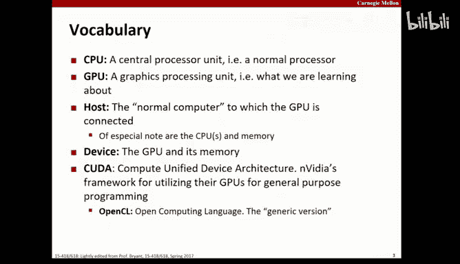

Global memory versus shared memory。Okay。嗯。Okay so global memory versus shared memory。

 global memory here means the memory on the device， it's global on the device。

 it's not global between know the host and the device。

 it's global on the device right so global memory， you know we do things like Kuta Malik Kupa free and Kuda Me copy right to get things between the host memory and the global memory。

😡，So shared memory is basically memory that's associated with a block。

 it's shared by the threads of that block。😡，Not across。

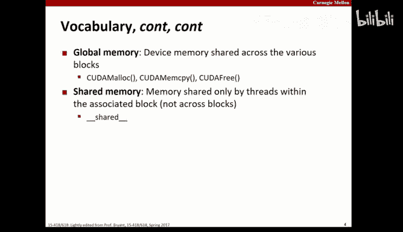

Colonel， that's the piece of code that we're representing out there across all the cores of the GPUs。

 right？😡，The thread is an abstraction for the work associated with the instance of the kernel。

And that's worth just a quick pause， right， a thread is an abstraction to the work associated with an instance of the kernel。

All right， so we had this kernel， which is a piece of work that we're going to want to do in a massively parallel way。

 and a thread is an instance of that， a single one of the many。

A thread block is a partition with threads， an associated work that will be dispatched to a so called streaming media processor SMM。

All right， so if you take a look at your GP at your video board。

 your video board has a whole bunch of these Ss。And each of these SMMs is sort of roughly analogous to a CPU on your computer。

😡，All right， obviously with very different capabilities。

 just like the CPU and your computer has a bunch of cores， each of the Ss can have a bunch of cores。

😡，So an SM is not a core， it's actually a processor that as it turns out。

 is a multi corere processor。So a thread block is a partition of the threads。

 right we have this kernel and we say， okay， we want this kernel to be run a massively parallel way。

 there going to be a bazillion instances of it。😡，All right。

 and now we're chopping this up in the blocks and saying， okay。

 of all these instances we want to run， this is one block， one collection of them。

 and this is another block and this is another block and this is another block。😡。

All those blocks together are set to form the grid， by the way。😡，Well。

The thread block is going to be dispatched to a particular SM。😡，All right， once it gets to an SMM。

 the SMM is going to figure out how to pushpat。

A P a core is， like I said， a core， it's one of the many processors inside of an S。😡，嗯。All right。

 a warp is a division of a block created within the SM to assign World to course。😡，All right。

 a division of a block created within the SM。To assign the work to course， in other words。

 we hand a block of these threads。To one of the S processors。

 the SM processors is further going to break it into warps and the warps are actually going to get dispatched to the wars。

Okay。Warps aren't scheduled until the core is available reach the red within the wararp。

 so in other words， we have a warp that has。😡，20 threads in it。

And the SM only has 16 cores available， it won't be dispatched。

You can't do like three quarters of a war， it'll dispatch the entire warf at a time。😡，All right。

 NBCC， obviously the compiler shared the quaifierr declared variable in per thread block memory。

Global， that's the qualifier we stick in front of the function in order to make it kernel。😡。

It becomes a function then we can run on the device， it can be called from the host。

 but it's actually executedd on the device。Kuta malic， Ka free， kMmcopy。

 these are the things that we use to play with memory on the device。

 it's how we allocate memory on the device versus memory on the host and how it is that we copy things from the host to the device。

Same threads， we talked about that right once we have all these threads running。

 we need to make sure that we can synchronize and make sure that a phase of work is done。

Right before we move on to another phase。You can imagine that that we're applying a whole bunch of filters to some image。

 and you want to make sure you apply the first filter before the second filter before the third filter before the fourth filter。

😡，And so you launch the first phase。That applies the first filter in massive parallel， right。

 you sync， you wait till everybody's done， and then you apply the second phase and so on。嗯。

We talked about the syntax Association of the Colel Watch， right where we have some function。

 the triple black bracket thing， and then the arguments to that function。

The triple bracket thing takes in two arguments I'm calling N& N and being the number of thread blockss and M being the number of threads per block。

So if you need to multiply n by N， that's obviously a total number of threats。

We have these variables we talked about， block IDX and thread IDX。😡，Okay， I D X is short。

Shockingly and amazingly index。All right， so we talked about doing things like threadIx。

X and block idx。X， I don't know we talked about why it's dotX do we mention that？😡，我在。😊，Yes。

 multiional， it's multidimenional， that's exactly right。

 So these things are actually blocks are actually three dimensional。😡。

And so depending upon the code you write， you may treat them as three dimensional or treat them as one dimensional。

 if we're treating them as one dimensional， we're only going to care about x。

 if we're treating them about two dimensional， we're going care about x and Y。

 Are we treating them as three dimensional， we're to care about x and Y and Z。

And that's true for both the thread ID and the block ID。Block dimension and grid dimension。

 the same thing， right， what's the dimension of a single block and how many blocks are there in the grid？

Like I say， if you take the total work and break it up into blocks。

The grid is said to be the set of those blocks。啊。那次去补的时候。And again。

 the grid is also three dimensional， and so we have to dimension using dimension as the field。

 we will to see it out。

Picture。Or at least a few words， right， so this is just a picture we show the device。

 we show the grid， which consists of the blocks。Within each block， we see the threat。

And that's the basic hierarchy。And we talked about the variables that give us visibility for this。

 the thread index， the block index， the block dimension， the grid dimension。All right。

So next phase here， I want to just offer you some possibly helpful tips。You know。In 213。

 we beat into your head that you should check the return of all library halls， right？😡。

I was like one of the big pilots。嗯。And we beat it into your hands， I hope beyond Saturday， right。

 I mean you were checking for the return on function calls and you can't do anything with it。

 they fail， right？😡，You want to think like that here too。Okay。

 you really do want to wrap your calls to Kuda and figure out if they succeeded or fail。

And figure out why， because if you're having trouble with your program and you're working on debugging it。

😡，And the basic dispatch of the program didn't work。

It's going to be really helpful for you to know that and to know why。So。If you take a look at this。

There's this thing， GPU assert。Okay， that's going to let us check that。And so basically。

What you can see is is we have the GPU As and then decide that we have it wrapped。

 if code not equal to Kupa success， then we get the Kuda errorstr。

And those are the basic two parts too， right if we didn't succeed。

If we're not equal to prove to success， then we get the error string to figure out why。嗯。Okay。

 in the case of kernel launches， you can't wrap the kernel launch itself， but you can ask。

For the last error。And so do your kernel launch and then check to make sure the last error is a success。

And then'll at least， you know， look， problems like this are not very common， right。

 but when they happen， they cause hours and hours of debugging for no good reason。

And so the 15 seconds it takes to add this to your code is really chief concerns against those bad days。

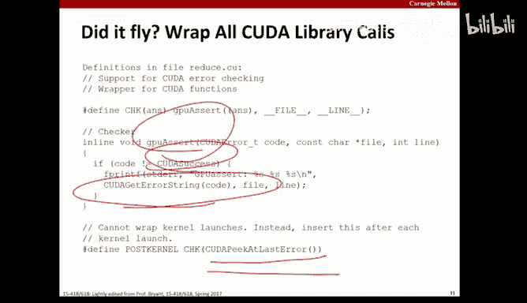

There is GDPB for Ca， your old friend is back and better than ever。😡，That's the right reaction。Yes。😊。

実跡。Oh， this going be bad ahead。In 213。Yeah， you know， you， you know。

People invent all these weird rules like you shouldn't use macros as arguments。

 you should use inline functions and so on。And look as a general principle。

 you should use inline functions because it makes it much easier， for example。

 when you go a debug into them。And all that good stuff。

But I think you've got to use your own judgment as to what's the right tool of the job？嗯。

I note that much of the 213 code， at least originally was written with macros。

 I think we eventually sterilized it all for you you know。

Eliminated this evil macros in favor of the nice and beautiful inline functions and like I said。

 again， inline functions are generally much cleaner， much nicer。You know。

 they make a code just as readable as macros， they let you debug into things。

 there's a lot of good reasons to use them。😡，All right，' your old friend GDP yeah。

 so GDP is back and works basically like you remember。

 you can switch between coa threads using the basic same syntax you had before but with kuda before it。

Info locals will give you information about cut threads also。

So it's really nice and really helpful don't ignore your old power GDB。

嗯。You know。Constents are still sort of evil， don't wire them down if you can avoid it。

 compute anything that you can compute and the reason is there are a lot of things that are going to seem like a constants right now for a particular board。

 and then you're going to sit down in a different computer or whatever technology is going to be upgraded and you're going to have a different board and all of those things that look like relative constants today turn out to be variables tomorrow。

So don't put magic numbers in your code， don't even put magic numbers in your code。

 pounds defined or constant to values， compute everything you can and have the most minimum set of constants。

😡，U，Againt the many， many， many， many， many， many computations you're going to be doing in anything you're going to be using a GPU for the amount of time it takes to divide in by the by the you know。

😡，By the number of blocks it's just not going to be a big deal。嗯。

Don't try to do the roundup stuff yourself right all over your code。

 you're going to find that you're going to round up the number of things you have right to a multiple so that you can divide it up。

😡，You don't want to sit there and do that roundup in your code constantly because it's ugly way。

 write an inline function， write a macro， do it once， wrap everything with it。嗯。

You want to know the correct answer before you try to parallelize something。😡。

Because there are a lot of ways that when you parallellyze something。It can go wrong。

And you saw that you can reach over and grab a value before it's computed。

 you can interfere with the computational of values across partitions and so on。😡。

So before you start， you want to know the correct answer。Okay。And that's the baseline that way。

 as you develop your code， you know whether or not you have a correct answer or simply a faster answer。

And my first job， I was optimizing a neural network。

And like the first thing I did is I built this neural network。

And then the next thing I did is I optimized it。I was a first year gra student。

Now I was really happy when I got this neural network built and had this strategy of getting it。

 we were all really happy。I built this thing， but it was really slow， it was really slow。

SSpice spent a couple of weeks or something optimizing this thing， and I got it to run way。

 way faster。😡，But the problem is never actually converge。At not always。

And so we had this status meeting where I told the boss， well， there's good news and bad news。

You know， the good news is we're running 100 times faster， right。

 the bad news is we don't get an answered。And that prompted my boss to turn around at his chair。

And type in， basically hello world and sea。Compile it and run it and say that runs faster than my network。

I'm like， what are you talking about， he then went deleted the printde line。😡。

And then said that does two。啊。Yeah， that was this point， because if I wanted a wrong answer。

 I could do that really fast。Like why would you trade away correctness for performance。

 like what are you doing？Like correct is the baseline。Something broke。

 you shouldn't have kept optimizing， you should have fixed it。😡。

Not expected it would have like somehow morph of itself backed correct by itself。And of course。

 the real answer is I didn't know it was broken right until I spent three weeks optimizing things and I ran my regression test before the meeting。

😡，They you don't want to be in that day。Don't do that。嗯。Like you're Carnegie Mel juniors and seniors。

 not like Clemson， grad students， you past that， right？All right， so you know。

 what you need to know here is you need to know the correct answer before you start and you also want to have correctness checkers that you can use to compare your answer to the correct answer and so on。

Right， that way you have some confidence， you don't want to be in a situation where you ask the question。

 is this all correct and that comes back and says no either？😡。

You'd like to be able to break it down steps and figure out where you've gone wrong。😡，啊。

Until the second generation of the Kup to architecture。

 there was no such thing as a print death within a kernel。嗯。And at some level。

 print up with an kernel doesn't really make a lot of sense because there's no console attached to a GPU kernel。

Good conversation。And I want toす。These are some of digital console attached to a GPU kernel， right。

 so this idea of a print within a kernel makes very limited sense。

It's also not clear what it means right， if you have a huge number of hundreds of things going on in parallel。

 right， what it means when you dump them out to your single console in some order。😡。

So print dev is really sort of confusing in this context， but because B programmers want printf。😡。

I mean at the end of the day， printde is the world's most commonly used debugging tool。In fact。

 in the second generation of this， they did in fact add printf， so you do add printf within kernelel。

😡，Of course， that tells you nothing about ordering blah blah， bh bh blah， bh， blah blah， blah。

If you're， yeah， and we can talk more about that in a。嗯。And again。

 like Todd said on the very first day， you always want to have a baseline。

 you want to have it done before you start paralyzing it so you know if what you're doing is making sense。

 and as I said， you know it's correct。😡，嗯。All right。嗯。Out of bound memory is bad and see， right。

 if you walk past the end of an array， this is a bad day， right？😡。

The good news is things like Do Rs and stuff will find that for you pretty quickly。

 and we have a pretty good understanding as to what happens。Right。You know。

 if you write out of bounds in memory and C， one of three things is likely to happen， right， A。

 nothing， B an incorrect result。😡，Or C， you'll find out that God likes you。

What happens if God likes you in your programming and you make a mistake like that？Saful。

Sat faults are actually proof that God exists and likes you。Because like option A， right。

 is that you write your code， you accidentally make one of these mistakes， right？😡。

And then at the end of the day， you compute the wrong result and don't know it。😡，That's a bad day。

Right。Your spaceship just crashed。All right， a good day is during testing。

 you run this thing that blows up with a Se fault。😡，You。Like my test set didn't find this。😡。

My tools didn't find this。😡，But they got a blue up。Or maybe it did blow up what you were testing。

 because now you know you have a problem， you know where the problem is。

 approximately or at least where the symptom is， and can go about finding。😡，So you know。

 as C programmers， we're really used to how things happen when we step past a raise and whatnot。

In Kuda， it's much more evil， generally what happens is you just get a wrong result。Right。

And that's really bad。So you want to basically put in a huge amount of bounce checking code。

 huge amount， check everything， check everything detail because all it's going to do is save you having to debug a bad result because if you're expecting 47 and you get 40。

 you know or 42 and you get 41 and a half， right， that's not good。😡。

And then you've got to figure out how。If you bound check everything。

 you could find out immediately where the mistake is and be able to debug whatever rounding function is causing it or whatever。

😡，The problem， of course， is that debugging everything does have some performance impact。

 and so you want to wrap these things。😡，debug stuff so that you can turn it off when you don't want。

嗯。We talked about the fact that。You know that colonel now has print death， the slide says。

 but it doesn't really work very well。And that depends how you define really well。

 it does what it does， it's not actually random， but there are a lot of constraints on printde。

 and we'll talk about that。😡，嗯。So if you're trying to figure out what's going on。

 sometimes what's helpful to do is to have a local host version of some code right and a parallel version of the code and be able to compare those two。

😡，So the slide says printef is pretty unreliable， I mean printde is what it is。😡，Okay。

 there are no dice involved in print。😡，There is nothing random associated with behavior of pre Dev and Ko。

 but there aren is like a bunch of details。Okay， the output is stored in a fixed size circular buffer。

😡，If you overwrite the circular buffer， you overwrite the circular buffer。😡，Okay。Yay big。

Print more than that， bad day for you。All right， what's worse than that is I didn't tell you there was an F flush in Kuda。

😡，Instead， Kuta is going to flush when it decides it's going to flush。

Which may not be when you want to flush， give the amount that you want to write and your fixed size buffer。

Do you see the problem？Yes。So now we can start to talk about when this buffer is flushed。

 the star of a kernel launch， called any of your synchronization functions。

 blocking memory operations， module loads or unloads， context destruction。😡，嗯。Interestingly enough。

 not program exit。😡，Although most of us do have something like who to deviceynchronize right before all of our stuff ends。

 and it actually will print out there， which is sort of like a programming。😡，And。

So the bottom line on this is you're much more likely to succeed with pre deaths if you use them sparingly。

😡，If you start to use them not sparingly， one output will overrite another output will overwrite another output and you may just get a mangled output because they may not be modulus of buffer size。

😡，And you may think like I'm not seeing in the output so it's not running。

 but really you just haven't hit one of these events that causes it to flush。😡。

Don't spend your time looking for a way to fix that， there is no coupa F flush。😡，不在个地方。

Can make a kernel cold flush。I mean， yeah， I guess。

Like we could do a lot of nothing in order to ensure our prints were。嗯。は。

I know another way to achieve that。Learn that from my old boss。All right。

 and I'm going to charge through an example now。I actually don't believe when to get through this entire stack of slides today。

What do buy more of them？Okay， I have no expectation of that。

My expectation is simply that we're not going to run out of slides today。😡。

Although I could surprise myself， I did last week。So don't feel badly when we don't get to the end of this day。

 because we have a second recitation about Kuta。😡，And so I'm going to pick up the slides we can cover this week and stick them to the front of that deck。

And that is the plan， so we will not be behind schedule when we do that。

 that's just simply the schedule。😡，All right， so you guys are familiar with Matrix up with you know。

With major multiple behavior， it's approximately evil。😡。

It may in fact be the most common form of evil in the computational universe。😡。

What is evil about something that's done this way with one row operation and one column operation？😡。

嗯。Well， I guess even before that， before even worry about rows and columns。

 what's generally evil about matrix multiplication？😡，ItInvolves a lot of。

What's the simplest word you can use to describe what it' been awesome lot of？Math， work。

It involves a lot of work， right？I mean， look at that summation。You。All right， I mean。

 that but they're like。More than one subscript there。Two squares involved。Okay， so to begin with。

 this involves a lot of work。😡，Now， when you start to think about it in terms of 213。😡。

you realize that when you have something that's two dimensional in storing the memory。

 it has to be put into memory in a row major word， right？😡，So we're going to take these rows。

 row after row after row after row after row after row。And that looks sort of nice。

With respect to the Browise operation。What does it not look nice with respect to？What's that B， yeah。

 that B thing， column wise operations？Right， because now for each element of the column。

 we're going to have to move a whole row。😡，Right。And I say move a whole roads。

 we're talking about caches here。And either cache is in the traditional sense of L1L2L3 or cache is in the sense of the memory that we're going to manage on the device。

O。So NQ bothplications。And then this memory access。

You've probably seen。The code associated with this， about 73 times in your career at this point。

We all love this as an example of painful you know。

Qudratic type of thing， right。2。So we always baseline what we're doing right。

 we always start out with a simple implementation that we can be really sure is correct and is really easy to debug if it's not。

😡，Right right what I like to refer to as the most expressive implementation。

 the one that's easiest to understand， that's where we start。😡，And then we benchmark。Now。

 213 question， look at the performance。What do you think is happening somewhere around like 128 to 512？

😡，Do you think our processor is suddenly getting slower？😡，Dreion。Yeah。

 we're having a problem with the cash right， as things get bigger。

 we can no longer fit a whole bunch of rows in， so we're threatening our column。😡，Makes sense。

When it's small， like I don't care a row major column major， just throw it all in there。

But as it gets larger。Right， because we have to load a whole row to access a column。😡。

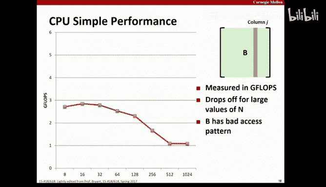

RightWe're pushing things out of our cash and our cash isn't big enough to tolerate that。😡，All right。

 so B has a very bad access path。All right， so one thing that we can do in optimization here。

 probably the simplest optimization that when we look at this performance curve and realize what the problem is。

 right， the simplest thing we can do is try to fix that colorwise access。😡。

Because that's just painful。So we can pre transpose B。😡，We can rotate it and develop a transpo be。

 and now we can perform this sorry with rowwise operations on both。

So we had one painful thing to do to rotate it， right， but once we have。

 now these operations are robust。😡，And that's much， much， much more cash from。

So the transpose， what to say， converting from row major to column major ordering， painful。

But we do want。

Okay， so the goal here is。That by paying the price to do that once。

We're going to save performance in the future， and if you think about that， right。

 this amortization should be in our favor because the work here is cute。😡，O。

So there's an implementation of pretranspo。嗯。You know， what to say， this work is square。

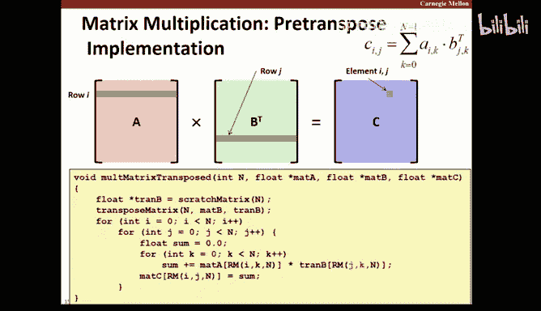

All right。So now if we look at this。And we've looked at basically the same plot we had before with gigcolops being what we're measuring as we increase the size。

 we see that our performance is much more steady now。We're encountering much less of a penalty there。

 and that's great。ok。By paying the price to flip that once。

 we now are having a much better cash footprint that we can beat on as we do the now rail order operations。

😡。

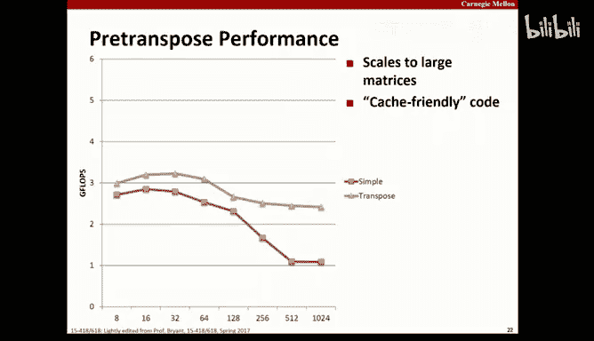

Okay。Well， our next step in this process。Is going to be to convert this to code around GPUs。😡。

All right， shoot， I forgot to turn my glossster， I'll go add that back later。Right SPMD。

 single program multiple data。All right， that's what we're talking about here。

So we have M processors all executing the same code。

 where do we find M processors to all execute the same code at the same time on one of the GHC 26 through 46 or whatever machines？

😡，The sudden plug into those machines that gives that to us。On the GPU board， right？

There's these little cars made by video， we plug it in， you can game really well or do your homework。

Palausible deniability。All right， yeah， so when we talk about the SBMD model， right。

 this is the model that basically we're playing with。

 we talked about using these graphics boards and kuda。All right。

 so we basically have M processors called kernels executing the same code。嗯。Okay。

They share a common global memory， there's no synchronization predatoritives what I mean by that is there are no shared memory synchronization predatoritives。

 okay， there are no mutexes， there are no semaphores， there are no condition variables。

 what we have is barrier synchronization。That is a synchronization primitive。

 it's just not a shared memory synchronization problem。嗯。All right。So we have these threads。

 but these threads are actually very simple and lightweight things。

 remember that a thread in this context is an instance of the kernel and execution。😡。

It's that kernel code running somewhere。

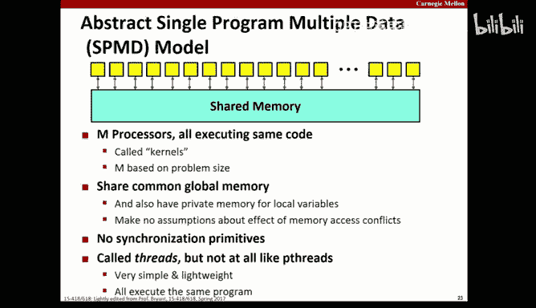

One instance that's a threat。And so the basic model that we're going to have is we're going to start out on the host。

😡，And we're going to set things up and copy some data onto the device and that data is going to be attacked in parallel by the device。

😡，Then because we don't have any other synronization primitives。

 we're going to synchronize with some type barrier sink， wait for everything to be done。😡。

And then so what we want to do next。Copy it back onto the board， let the board attack it in parallel。

 right？😡，Let all the threads finish。Synchronize。And we started。

 we're just going to go from phase to phase to phase。ok。As you might imagine。

 one limit you do see with these things is how fast you can move data to the board。😡。

There's a huge amount of computation but they can't actually find themselves Iiode price。嗯。All right。

 some performance limitations， sization requires waiting for the slowest task right。

 sometimes called the long tail problem， except the tail shouldn't be too too long。

 but the idea is that if something's finished before others， you end up waiting。😡。

So you imagine that if you're trying to build some scene by starting out with a scene and then applying a filter to make it look like a foggy day and then applying a filter to bring focus to certain things right those are separate phases you can't you know。

😡，Do the global focus until you， you've got the fog in place。

which means that if you partition this and there's a chunk of work left over。

 that chunk of work has to finish on the fog before you can turn around and start working on the rest of it。

😡，These phases do actually generally have synchronous。嗯。you know。

 no locality of data or synchronization， so the memory model here is what the memory model is， right。

 there's the host and there's the device and there's memory that's shared by the blocks。😡。

There's no cash， everything is explicitly managed。And no locality of synchronization basically means the synchronization we have again are the barriers。

啊。All right， executing threads or grouping into blocks。

 each block contains the same number of threads， the host program specifies the block size。

 right that's the block convention dies。And again， it doesn't have to be one dimensional。

 you can have two or three dimensional blocks。😡，The host program makes sure there are enough lock to generate some n number of threads。

In general， right in the ideal world。😡，The number of things and chunks of data we have would be an exact multiple event。

😡，In the real world， the number of chunks of data we have are not an exact multiple of events。😡。

Not common， right， and so we're going to have a few leftovers and that means that there's going to be one thread block that's not completely pulled。

😡，So some threads in that are just not going to do any useful for work。

Because there's no data for them to work。

So if you really think about this model， the host is acting as the controller。

 it's setting things up for the board， which is now doing the computation。😡，嗯。

The host does not have direct access to the device memory， right， the host has to copy things there。

😡，Why do you think they don't engineer some system？Right， because you could。

Where there is shared memory between the host and the device and。

The hose can read to it and write from it and soak in the device。Yeah。

 the CPU is center to GPU via the PCIE。Okay。At some level we can look at it and say right now。

 given the design we have， it doesn't exist because the connection is via network， the PCI bus。

 but why don't we design a solution to this problem？😡，Well， I mean。

 it sounds kind of nasty to do since you have these。Different model though。Yeah。

 we have different models of execution but our memory models are really on they're different than reading write。

Yeahや。😊，the numbering。卖什。Maybe it's because memory the graphics is much more vast。

 I if we could look at what the performance specs are and say， know。

 iss that a reasonable thing to do with perspective you know。这没。The idea what the challenge might be。

We try to have one memory shared by these two bikes。嗯。Okay。

 one thing might have to be intention practicing the memory， and a consequence of that might be go。

Memory controls have very different assumptions。So what would be a side effect of trying to unify over something？

这什么块面じ。2。So the real problem here， right， is that if we have multiple things asking us you the same memory。

 that memory becomes shared。As soon as we have a shared memory。

 something that multiple things can lead to right now。

We had to have some discipline that describes what the result is going to be in the life of concurency。

😡，And generally， the answer is going to be that。We're going to make very weak guarantees。

 which are approximately useless to a programmer。we're going to make very strong guarantees。

 which mean that approximately we're going to move at the speed of molasses。😡，In the winter。

 a day like today。Right because then we're going to have to go through the overhead of synchronizing access。

So we can't really unify that memory model without imposing significant performance constraints trends。

Especially when you're talking about something like a GPU。

 you're not talking about having two processes arbitrary for a bus。

 you're having to talk about a huge number of processes arbitrary for a bus。

 especially when you utilize these SMMs are composed of many， many cores。😡。

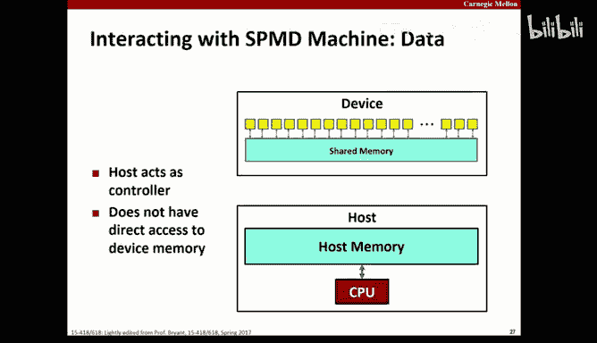

You guys know the drill on the kooer， we already talked about this。

 theCU file contains a mix of both stuff for the host and stuff for the device。

 I mean look you can take the Kooa compiler and you can compile host code。

 you can go back and like recompile your 213 stuff with that。It makes postcode just fine。

 it just also makes the Vicode and understands the extensions that let you integrate the two。

So if we go back and we take a look at our friendly。这是不可能。嗯。

Transforming this is really not very hard， Someone walked me through with this chunk of code says。😡。

如果要解。Unfortunately， I'm not going to pick argument rate。you see there's chair。えこれ。

So I can pick on two people for the price one。不。So what are you guys walk me through。

 what are you guys， walk me through with this？Blalock ID x。y times block dimension。y plus red ID x。Y。

So let's focus on block dimensions。Let's focus on block ID times to block。我只赞同去。不要彻底管。O中。还就。谢谢各位。但其。

Okay。唱首。Okay， so what you're suggesting to me is that back in 213。

 we talked about how we project a two dimensional array to a one dimensional memory。这回。冷气对。

You didn't work to too also。You wouldn't credit you wantt 12 professors that's okay with。全都没た。で。Okay。

So we popular earlier earlier in your career when it was 122 or 213， whatever you did， right。

 you talk with this idea of projecting a two dimensional array to one dimensional woman。

I we said it's real major work， and I'll show you the pages of the textbook later。Okay。

 now remember that when we try to figure out like we're in memory。

Where in the one dimensional memory wise。嗯。Something was we had to look at that two dimensional representation and say。

 okay， what row is it in？If it's in row 10， we have to begin by going to 10 times the size of a row。

😡，To skip past 10 rows to get to rot， zero， third second， third four foot， six， seven， eight， nine。

 now we're at the beginning of row 1。Then we added in the Y index。这这で个で。

The column index to get us the specific elements， right？So now when you look at this。

Comput blocklock indexex。y times block dimension。y plus thread indexdex。y。

Does that remind you of something？Maybe row index。Times row size plus color index。

This is just the real major computation。😡，So when we say we say in I equals y。

 all we're doing is finding the linearer address of I based upon x。而是呢。

And so what we're doing here is we're finding I and J。

Based upon their two dimensional row and column。😡，X and Y。Indexes。

In the one dimensional space that we're using here。We're just linearizing。That address。Okay。

And from there， this code is doing exactly what the other code basically did， right？

There's really no magic here。因为等 you写这我 doing表。If I is greaterd equals to n or j is greaterd than equals to n return。

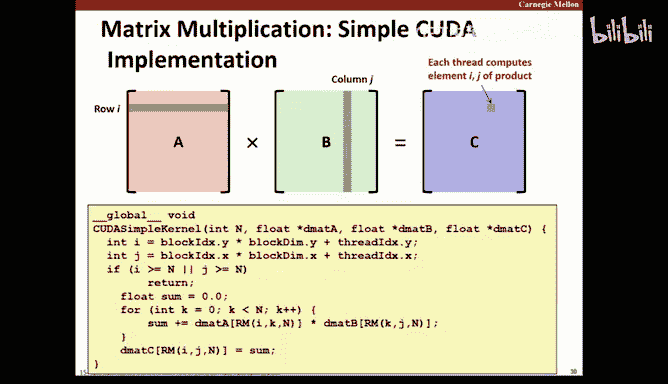

Make sure that we don't step out of the way。So now。

We come over here and we actually launch the kernels remember the you know the three angle brackets。

 that's a launch， that's a kernel launch。😡，Okay。嗯。And so if you take a look at that， right？

Threads per block。Right， marks。And then we launch it。All right。

 now we said that you don't want to sit there you when you need to round these things up。😡。

And you don't want to sit there and include that code and everything you do。

 and so we have this inline function up。😡，And you can see I views there。

And that's just going to be the division rounding up。It should be a multiple of 32。

I am now officially an evil person。😡，I' have said it has to be a multiple 32。

 but I haven't reminded you as to why。😡，Somebody remind me， what is 32 in Kuda？

There are 32 something things。Was that。ItIt's the warp size， it's the warp size。

 that's exactly right。Okay。😊，So when we take a thread block。

 we break it up inside one of these streaming processors。😡，And we actually handed to a core。

The warp size is what we're handing off。And we need to be a multiple of a work size。

So that's why we have 32。Okay。Now what an maximum value of 1k？

If it's larger than。And4。W。You're exactly right， if it's bigger than 124 things break。😡，Okay。

 don't work too hard on this one because I don't even know the answer。

 the answer I know is this is what's an the。At the end of the day。

 the hardware has some limitations and that's one of the published limitations。😡，Dis passionsion and。

That you would？Yeah， you dispatch an entire warp at a time。

 so within the processor right when the streaming processor gets a chunk of work。Okay， a block。

 it then takes that block into warps and dispatches the warps。😡，It can't dispatch a single thread。

 it dispatches a warworth。😡，Does that make sense。Technically speaking。

 the Wp is the instruction and the data is in the associatedso memory。😡。

But it's not a problem if you abstract and work to include the data because that's the model。😡。

So we basically have this whole hierarchy right we you know we take our work and we break it into these blocks and then we call it a grid and then we dispatch a block to an SMM right。

 and then the SMM dispatches the slice of that block， a warp to an individual port。😡，嗯。2。Yeah。

 we thank you。以后は。A我。西。Well， so that is interesting。

 but remember that the concurrencies allowed within those processors。Yes。That makes sense。O。

Now check this out。So now we've done really nothing but translate our code to Kuta。😡。

we have done intellectually nothing， we have simply sort of mechanically transformed our code from host representation to coup deformement。

 right？😡，Go， go parallelism。You can't even distinguish。Our old performance from zero by comparison。

Nice。Right， I mean， just massively embarrassingly parallel stuff fed to GPUs is like magic。😡，ちょっとない。

那。What's the difference between these two chunks of code？😡。

You can imagine if you'd like that there's a nested for loop there that walks through X and Y。😡，对。

They didn't worry about what the consequences might be， what's the difference？えこい。

X and Y flipped X and Y flipped。Okay， so like we're talking about。

 we've talked about row major ordering versus column major ordering。😡，You remember back from 213。

 we played the game flipping X and Y's and saw a performance difference。😡。

So。Here。Theses these two chunks of code obviously have x and Y split。😡。

So they're going to be approaching this with a different you know walking through the rows and columns differently right in one case we're going to walk through rows。

😡，Getting us to columns， in one case we're going to walk through columns， getting us to rows， right？

Here's the performance difference between those two。😡，Okay。The green。

Is the performance we saw a few moments ago？The pink。

Is the performance we invert the Rose and columns？Why？In 213， this was easy to explain， right。

 because we talked about level one and level two in level three cache， right？😡。

AndWe talked about footprint and cash。But now we're a GPU， there's no level one。

 level two or level three cache， Why are we seeing you color major row major ordering effects here？😡。

职类也就是关系。

So。Threads with the same value of Y are mapped to a single war。

Theres with the same value of y and consecutive values of x map the consecutive positions within a single one。

 boom， boom， boom， boom。When a single warp accesses consecutive memory locations。

There's no block to read or write， I'm sorry， they do block to read or write。😡，Okay。

When a single warp access to separate memory locations， it requires a gather or scanner。😡，All right。

 what is this talking about？Let's take a look。So when a single warp access is consecutive memory location。

They block me to right when a single warf accesses separate memory locations。

 it requires a gatherer or a sc。So。Read的。Threads in the war reference a single location， read B。

 threads in the work， do a block read。So a block read is when we take an entire block。😡。

And we read it together。Okay。Next thing， right B， we're doing a block right。

 we're taking a bunch of consecutive values and writing them together。😡，诶。嗯。

So the war breed right here are matching the memory organization。😡。

So things that are rowwater and memory are going to be written as a block together。😡。

Things that are column ordered cannot be written together。

 they have to be written and written and written and written and written。Does that make sense。

So we're no longer in a situation where we're worried about cash footprints。

We're worried about how long it takes to do the reads and write。😡。

If I have a bunch of data values together， I can do them in one right。

If I have a bunch of values that are separated。Value skip， values， skip， value， skip。

 value skip that takes multiple reads rest。第是呢。So when we talk about scatter mode and gather mode IO right in general。

 you know gather means take it from multiple locations and bring it together。

 scatter means take it from one buffer and put it in multiple places。

 you see that terminology scatter and gather all over its systems。

 you see it disscheduling and things like that， take one buffer and have to put it in different places on disk。

😡，So the penalty we're seeing here is that if we're not row major orders in terms of how we're using things。

We can't do it in one right。We're forced to do it in multiple rights， that is to say to scatter。😡。

Do you see the performance impact between that？Multiple values， one right。Versus multiple values。

 multiple rights。Scattered。So when we broke the row major order in with our indexes within a war。😡。

It didn't change our cash but because there's no cash to speak of。😡，It didn't change our memory。

 right， our memory is our memory， but what it did change is the technique by which those values had to be written。

😡，One at a time。Or altogether。So the warp reason writes match the memory organization。😡。

So I think I actually startedutter a little bit on this slide， but never mind。嗯。

2。So in terms of optimizing memory instruction performance， right？😡，You know。

 if we do things in one chunk， we're going to be able to load them faster than if we have to gather them from multiple places。

 we're going to be able to store them faster than if we have to scatter them from multiple places。😡。

嗯。We also want to avoid things we're competing for the same block of memory。😡，Because in the end。

 we have multiple threads and we have one memory。

And so。Here's another picture。Transpose operation， okay， we can see couda symbol。

 we can see couda transpose， and directly underneath that is couda simple and birds。

 those two are sort of lending together。

Good things to perspective。So in thinking about Kuta。

 you really do want to keep in mind how it's organized。😡。

Right that if we take a look at one of these things， we have our shared memory， right。

 know and then we have all of these S functional units basically， these things。Right。嗯。

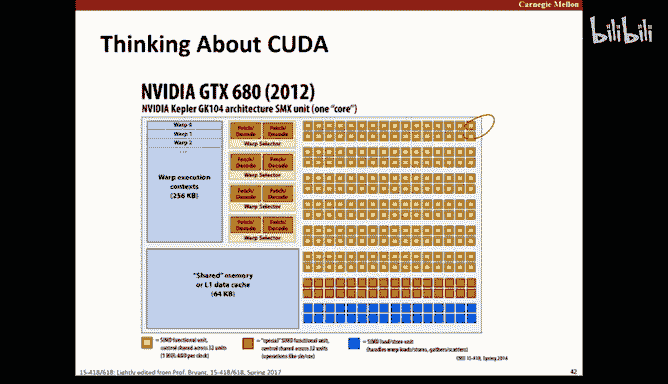

So in terms of the block hierarchy， we say that blocks have to be greater than equal to 32， right。

 and less than or equal to 1024。😡，And there need to be multiple of 32。嗯。within block synchronization。

 is going to be via asynchronous。Each block implemented a set of warps， 32 threads per warp。

Single instruction， multiple threads that guarantees they stay synchronized， so what does that mean？

Single instruction， multiple threads guarantees they stay synchronized。

So if I'm dispatching processors， if I'm dispatching different works。😡，Across those wars。

 there's absolutely no coordination， but within a warp， what's happening？😡，You have。2。心理的事。啊，毛泽东。

你个 objects and画。Okay locksstepap is the word that is exactly the word I was looking for right so when we dispatch multiple wars。

 those wars are independent in terms of their execution。

 but within a single work they're in lockstep， so there's no synchronization issue there。😡。

But use it hardware。

包玩出。So we localize computation within blocks， each performs a sequence of tasks。

 each uses shared memory and local synchronization。

So now we're going to continue to optimize this。😡，In our first approach of this。

 we took basically the matrix as a whole。Now what we're going to do is we're going to block this matrix up。

 and this technique should be familiar to you because we talked about something very similar to this in 213 for cash performance reasons。

😡，Okay so we're going to generate results on a block by block basis。

 we're going to localize the accesses to A and B and need not be multiple blocks of the block size。

 okay so what are we talking about here？嗯。The goal here is to break these things up into individual blocks。

😡，With the hope that by doing that， we're going to be able to keep our accesses within a block。😡。

And reduce the number of reads and rights。OK嗯。And need not be a multiple of the block size。

 meaning it's okay if the last block is in full。😡。

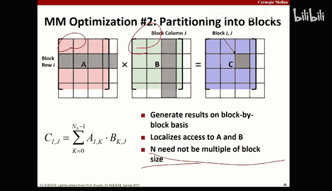

That doesn't actually break。We already determined that pre transpose is great。

 so we're going to continue to use pre transpose， right， nothing there is going to change。

So we're still going to be doing row wise operations。

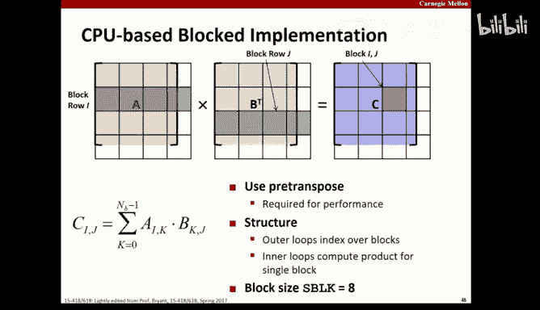

Soend the block size 8。So here we go。嗯。We blocked this just like we did in 2013。

If you want you can take a second a look through the code。

 if you want to study this in more detail and it's probably worth it。

 if you look inside the Standard directory AFS CSs academic class 15418-S18/p。

 you're going to find recitation3 and you're going to find the code for this all there。

This is probably worth a few minutes after recation going through it。

And make sure it makes sense one thing I learned is that reading code people doesn't generate any actual learning。

嗯。And so。So here we go。Now， notice I went to my block implementation in my post code。😡。

Before I did anything with Kuta。1。And we were writing C of code a minute ago。

 and now we're back to writing host code。😡，Just regular good old fashioned 213 Stcy code。喂hy。

Do you have。The implementation that you think is more likely to be heard。

Yeah， I have a reference implementation right I mean we talk to this sort of the beginning of the class you want to have a baseline right。

 so I want to have my original version of this and I want to prove my blocking algorithm is correct。

😡，Go， I want to compare those two now once I know my blocking algorithm is correct。

 now I can you know rewrite it for Kuda。😡，And compare the results again。

But I don't want to sit there and parallelize something that's incorrect。😡。

If I don't prove that my blocking strategy works， I might as well be。You know。

Just paralyzing nothing because I could get to the end and have the wrong result。Like I said。

 that's how lesson I sort learned in the hard way。Ok。So we're climbing up the performance。

Add in while we're at it， fast block with pre transpoposedse and unroll the on loopane times and reassociation。

You can tell Randy wrote this code。

All tricks apply。Except those who didn't think he could explained to me， you probably left those out。

O。So now we have a blocked version of this。Right。So we're going to use one now we're going to make it work with Kuta。

 so we're going to use one ka block for each block of the destination matrix。😡，Okay。

 so we divided up our actual data into these blocks in our code。

 and it obviously makes sense to represent those blocks with thread blocks。

 so that's what we're going to do。😡，We need to have enough of these coa blocks to cover the result matrix。

Each thread of the block accumulates a single destination value right because that's what we want to do。

 we don't want to do large amounts of work in threads right the idea is that each thread does a little work in massive parallelism。

😡，So each thread is going to accumulate one value。One value within that block。

 one block within that matrix。

All right。And since here we see this， this is our kernel it's declared as global。

 we can see the index computations as much as we did before。😡，Okay。

We can see our blocks our sub matrices， right， sub A and sub B are shared。

So these things are going to be on the device， on the GPU board and used by the multiple threads。

 and then we go loop over that and do our work。

Just like our old school 213。So with each of these threads。With each of these loops。

 these threads are going to play two different roles。

 they're going to affect fetch the element from the source memory， right。

 and they're going to compute in a value， they're going to have to do both。😡。

They can't do the computation until they read the document。Now， at the end。

 we're obviously going to have to synchronize to wait for this to be done， right？😡。

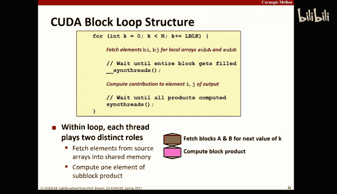

嗯。And again， we always want to check the ranges， right？

And make sure that we're within range because at some point we have a block that's not full and unless we check。

We're going to do bad things。And remember those bad things are not defined in Pda right you see we understand the memory model。

 we understand what happens if we go past the edge of an array。

 we understand the types of results we're likely to see and so on right here we really don't know what's going to happen that's just totally the model for that is not something that's exposed to us。

😡。

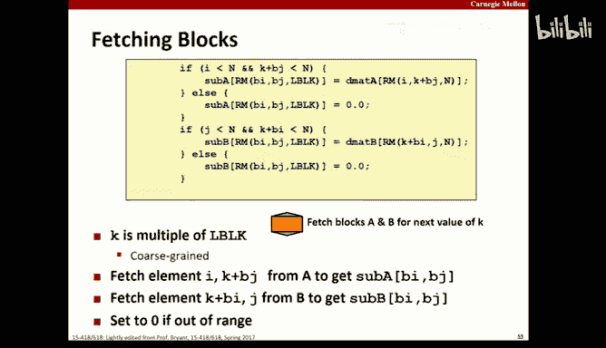

OnThe computer block。Wow。😮，Like that green bar was our first coD implementation。😡。

That thing on top is our new implementation。So what we have you now is a combination of。

Original 213 strategies and new couda strategies， right？We started out with a simple implementation。

 and we did sort of the nickel fix， we didn't think we simply converted to Kuda。😡，Beautiful。

 that generated a dramatically good result， right， because that line we can't distinguish from zero。

😡，Right， was that original implementation。I'm sorry。

 actually that last line we can't distinguish from zero was our blocked implementation。😡。

So our original P implementation involved almost no thought， right was？😡，You know。

30 to 40% of the way to the final solution， way better than anything we did in 213。😡。

Then they went through the 213 process， right， and generated a block solution。

And then turn that into a couda solution， and now we see， you know we're dramatically better。Now。

 again， the performance improvement we're seeing here is not related to a cache。😡。

In 213 we do is related to cash right now the performance improvement we're seeing is related to those access patterns。

 scatter versus scatter gather and contention memory。😡，嗯。Just to show it that new line you see there。

 first， second， third from the bottom。😡，This one。That's what happens if we mess up the indexes。

And we now have to scatter and gather it。

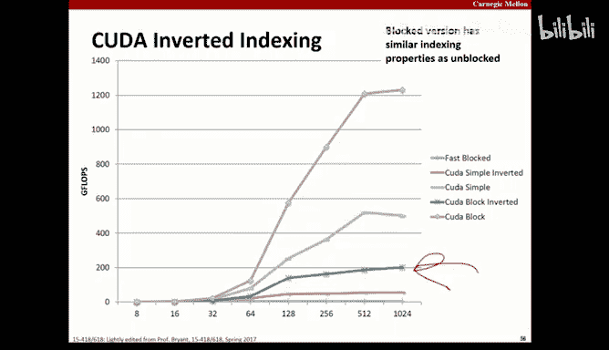

What's wrong with this code？Take a minute and figure it out。These are it continues getting create。

Large threat diverg。It can cause some threads to start。Okay， so explain that to me。

 so we want to be able to， we have these 32 elements operating in the award。

We want them all to basically be doing the same thing。Or if they're doing something different。

 we want to be able to just kind of skip that operation sort of mask that we did in the lab。佢紧议。

Continuing me。

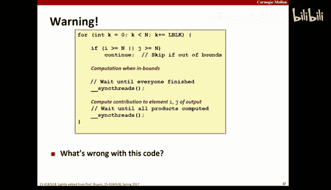

Some threads go up to the top of the loop。Then they're basically。Well， maybe it' cool。

What of thoughts do we have？Yeah。😊，Were all。业尾。Con skips over all the same threads that we。

The continuous skips over。喂。はいか。The underscores synchth， what do you mean by that？Well。

 I think I think you're on the right track and just。Trouble figuring out exactly which you are。人力病。

We don't need to worry about anything outside the fort loop。

 the problem is right here in the foret loop yeah so I think I get what he's saying when you continue here。

 you're never going to hit the synchronize operations so this will never finish。你个。

Size isn't divvisable by N。Ok。So if the size is greater than equal to n。

Or J is less than or equal to n， what does that mean， that means we're at bound right。

 that means we don't want to do that computation。So those threads are finishing。And。

They're not being synchronized。Yeah， which means they're never going to hit the barrier。

We're never going to go past the barrier。Well。They're never going to be weigh in line that。😡。

I'll give you that。ok。So what。The Uan。Get to the first finder。the barrier。

 they're not going to get to the barrier。The rest of the program。

 the other threads are also going to get as the barrier。

 nothings going Yeah that's exactly right right so for firstly make a past barrier all threads have to get to the barrier and that thread sink is not part of their code。

Yeah。O。嗯。So observations， right， understanding what the Kupa hierarchy is。

 right actually can really help on optimization， right？Shared access to fast memory。

 the impact of scatter and gather mode， lightweight synchronization。And so啊。

So the standard apply advice here is going to apply over and over and over again， get it right。

Right optimize from there right， so you want to your first implementation of anything I repeat this。

 I think five times this lecture。😡，Is to have the most expressive implementation you can。😡。

The one that's easiest to debuged and easiest to understand， and best articulates what you're doing。

😡，From there， you want to benchmark to know where you start。😡。

You want to know where you spend your time and you want to optimize based upon that。

And then you start want to move step wise， right， checking each time against that。

To make sure that you're correct。嗯。Watch out forization buttons like we just saw。嗯。

Watch out for memory referencing things right look memory is really slow， computation is really fast。

 you can waste a lot of computation， you can compare x to y a million times and it's not going to matter okay but if you mess up a memory access or mess up a bunch of memory accesses。

 that's going to bite you first。😡，It's not checking the balance that's going to cost you any significant amount of time。

 it's doing a gather operation when you can avoid that or doing a scatter operation when you can avoid that。

 or contending for memory when you can avoid that。😡。

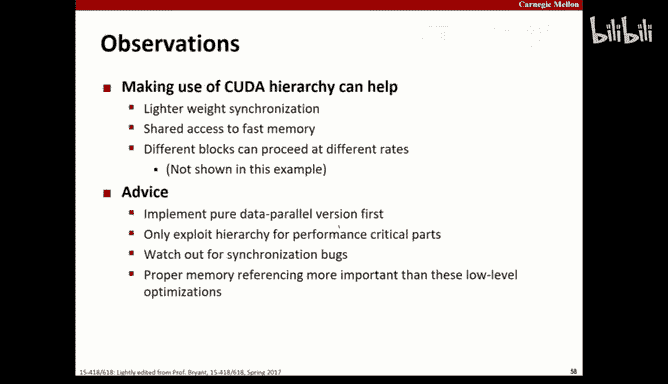

嗯。Okay。So Camon was anlum was a prior instructor of this， he's now， I think at Stanford。

 which is where he got his PhD， but here's another little picture。Okay，' remeing with F fours。

 quad blocks。

你是在这 up不见。嗯。So we read four elements from A， each red loop 16 times。

Why is this faster because we're able to make better use of the memory bus？😡。

The bottom line is we can break this up into from using single values to using groups of four。

We're able to get a higher memory throughput。And memory， you know if we're doing that。

 if we're keeping our processors full， doing computation。

 and we are these what we're dispatching is all these things， memory tends to be the bottleneck。Okay。

 so we come back， I guess I will see you again a week from today on Friday， Randy's teaching Monday。

 Wednesday， we're going to go through a whole bunch of optimization examples then。

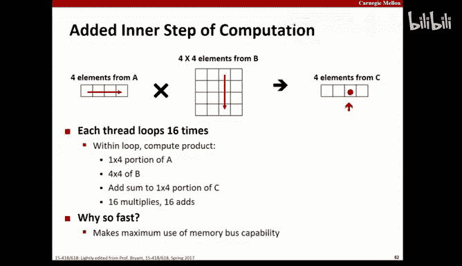

Any questions for we break？Have a wonderful weekend， stay warm out there。

