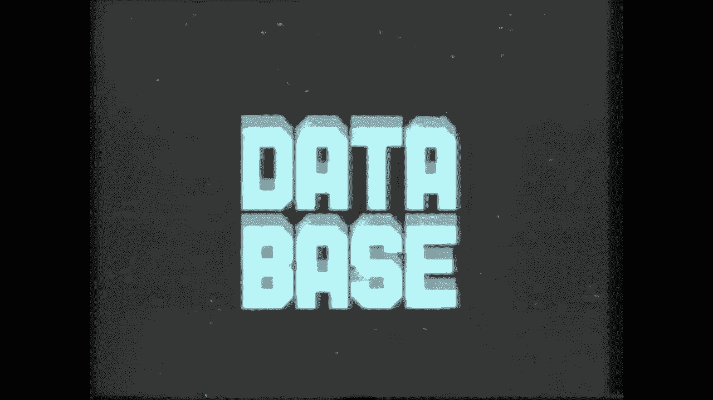
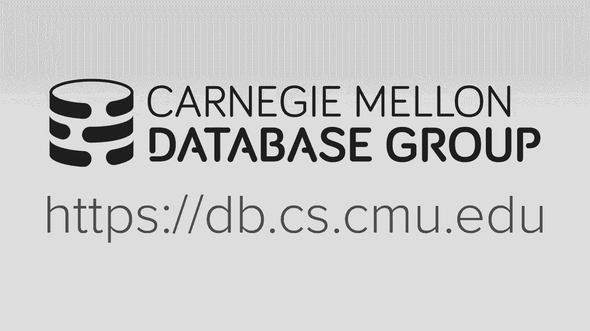
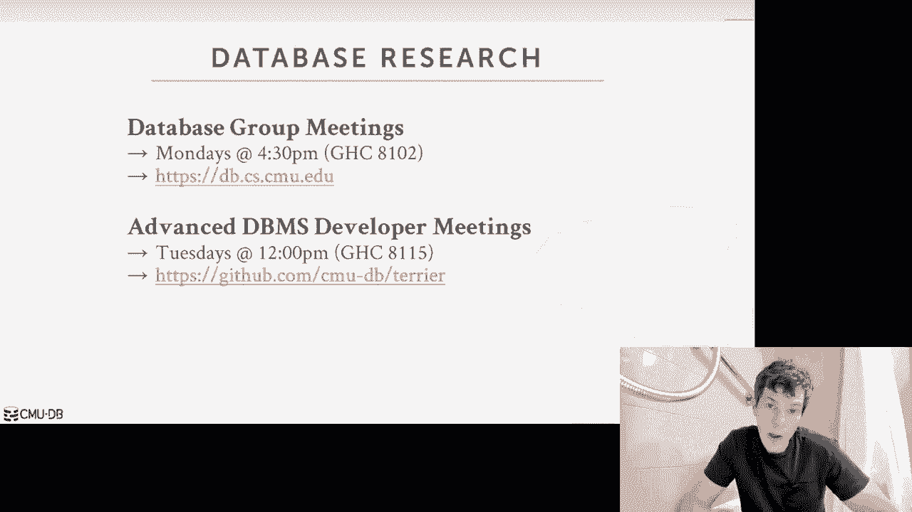
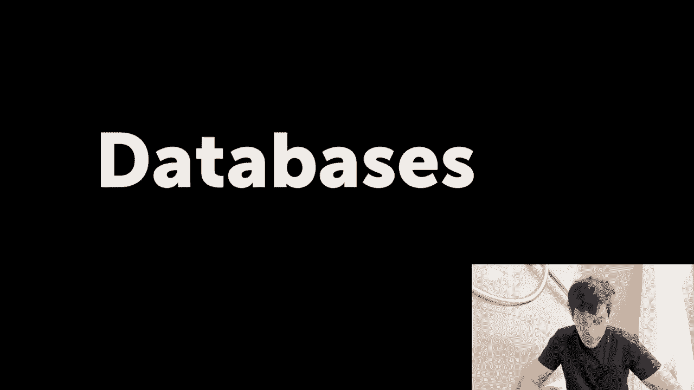
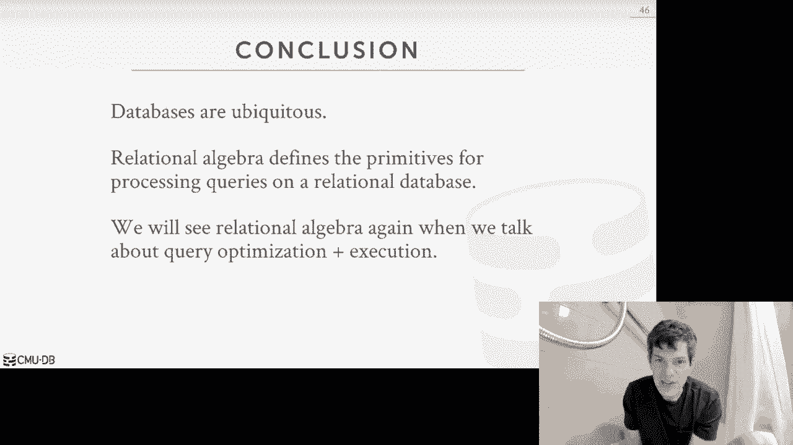

# 1：课程介绍与关系模型

## 概述

在本节课中，我们将要学习数据库系统导论课程的基本信息，并深入探讨关系模型的核心概念。课程将涵盖数据库管理系统的设计与实现，而本节课的重点是理解关系模型的基础知识，包括关系、元组、属性以及关系代数。

---

## 课程信息

我是这门课程的讲师 Andy。由于行程安排，本周的课程将通过录制视频进行。从下周开始，我们将恢复课堂授课。

Oracle 公司是本学期课程的重要合作伙伴。作为 20 世纪 70 年代最早出现的关系数据库管理系统之一，Oracle 至今仍被广泛使用和销售。它是全球部署最广泛的商业数据库系统，并且仍在积极开发中，不断加入现代化的新功能。本课程将涵盖传统或经典设计的数据库管理系统。Oracle 的专家将在学期中做客座讲座，分享他们在 Oracle 中实现的、超越本课程基础内容的更高级主题。

本讲座首先介绍课程的整体大纲和对学生的期望，然后用半节课的时间讲解关系模型和关系代数。这些知识将为整个学期讨论的各种主题提供必要的背景。

### 选课与候补名单

由于教室容量限制，本课程无法接收所有报名的学生。目前候补名单人数众多，如果你现在尚未正式选上课，最终被录取的可能性很低。欢迎旁听课程，但请注意我们无法为旁听生提供官方支持。学生退课后，我们将根据学生在选课系统 S3 上的候补位置顺序进行补录。

### 课程核心与相关课程

15-445/645 课程的核心是数据库管理系统的设计与实现。这不是一门关于如何使用数据库构建应用程序（如网站）或如何部署、管理数据库的课程。我们真正关注的是如何构建和设计作为数据库供应商的软件本身。

如果你对如何构建更好的数据库管理系统不感兴趣，卡内基梅隆大学还有其他相关课程可供考虑，例如 Heinz 学院的 95-703（信息系统管理），该课程侧重于如何设置和管理数据库管理系统，但不会深入探讨如何构建软件。本学期计算机科学系内唯一可用的数据库相关课程就是本课程。

### 课程大纲

我们将讨论如何构建一个面向磁盘的数据库管理系统。“面向磁盘”意味着我们假设数据存储在磁盘上。课程大纲按系统层次组织：
1.  首先在高层面上讨论什么是关系数据库。
2.  然后讨论如何存储数据、在其上执行操作、运行事务。
3.  接着讨论在系统崩溃或需要重启时如何进行恢复。

掌握到恢复为止的知识，是理解数据库管理系统工作原理的核心。在此基础之上，我们将讨论更高级的主题，如分布式数据库或其他类型的数据库，以及关系数据库的扩展。简而言之，我们将遍历构建系统的每一个层次，并在讲解完恢复机制后，完成对数据库系统基础工作原理的学习，随后探讨如何扩展系统以提升规模或在云环境中运行。

课程网站和教学大纲已在线发布。基本安排是每周两次讲座，每次讲座配有延伸阅读材料。请始终参考课程网页以获取最新信息。

### 学术诚信

这是一门高级课程，所有学生都应意识到，不得从互联网上随意复制代码，也不得相互抄袭。如果你对某项行为是否构成抄袭有疑问，请随时联系我进行讨论。我们会对作业进行检查。

所有课程相关的讨论和通知将在 Piazza 上进行。评分使用 Gradescope，最终成绩将发布在 Canvas 上。Piazza 的链接可在课程网页找到。

### 教材

本课程指定教材为《Database Systems Concepts》（数据库系统概念）。这是今年新出的版本。在我看来，这是目前最新、最好的数据库系统教材之一。对于教材未涵盖的主题，我会提供讲义。新版与旧版（第六版）在章节编号上可能有所不同，但核心内容差异不大。作业不会直接取自教材。

### 评分构成

课程评分构成如下：
*   **作业**：占 15%。
*   **课程项目**：占 45%。正是因为项目占比较高，本课程才符合计算机科学本科系统软件选修课的要求。
*   **期中考试与期末考试**：各占 20%。
*   **附加学分**：占 10%（可选）。几周后会公布具体内容。

本学期共有五次作业。第一次是 SQL 作业，之后的所有作业都是笔头作业，旨在练习课程中讨论的一些理论内容。所有作业都应独立完成。

### 课程项目

我对本学期项目感到非常兴奋。在整个学期中，你将从头开始构建自己的数据库存储管理器。你将逐步添加功能，构建出一个功能齐全的数据库存储管理器。关键词是“存储管理器”而非完整的“数据库系统”，因为你不会实现 SQL 解析器，但能够运行我们提供的、手动编码的查询。它比简单的键值存储复杂，但并非功能齐全的系统。

项目的关键在于必须跟上进度，因为每个项目都建立在前一个项目的基础上。你需要正确完成第一个项目，第二个、第三个项目才能正常工作。

本项目使用 C++17 编写。这是一门高级课程，助教不会教授如何编写或调试 C++。如果你对 C++ 不熟悉，现在就应该开始学习。我们期望在答疑时间讨论更高层次的数据库概念，而非基础的编程问题。

所有项目将在我们开发的新学术系统 **Bustub** 上实现。所有源代码将发布在 GitHub 上。Bustub 是一个基于磁盘的数据管理系统，支持火山模型查询处理。系统的不同部分具有可插拔的 API，允许我们插入不同的算法、索引数据结构、日志方案或并发控制方案。这样设计是为了每年可以完全更换项目内容，并逐年为系统添加新的特性和功能。因此，我们可以将其开源。

Bustub 目前是一个存储管理器，不支持 SQL，但你可以以物理操作符的形式编写查询。项目名称 Bustub 的含义我会在之后解释。我们为它设计了一个 Logo，并将在 Piazza 上发布 GitHub 链接。

### 迟交政策

每位学生有 4 个“宽限日”。在任何作业或项目提交时，你可以声明使用了多少个宽限日。用完宽限日后，每迟交 24 小时，总分将扣除 25%。如有医疗或其他紧急情况，请联系我，我们可以另行安排。

### 深入研究机会

如果你想深入了解数据库，卡内基梅隆大学数据库小组每周一下午 4:30 在 Gates 大楼有例会。此外，我们还在每周二中午 12 点在 Gates 大楼举行团队会议，开发一个功能更齐全的数据库系统。如果你想参与这类工作，欢迎参加。春季学期的高级课程 15-721 的项目就是基于这个新系统。

---

## 数据库与关系模型

上一节我们介绍了课程的基本信息，本节中我们来看看数据库为何如此重要，并深入探讨关系模型这一核心概念。

### 数据库的重要性

数据库在现实生活中至关重要，因为它们无处不在。任何复杂的计算机应用程序，无论是手机应用、桌面软件、网站还是复杂的计算机模拟，其底层几乎都离不开数据库。许多问题最终都可以归结为数据库问题。

我喜欢的数据库定义是：**数据库是一个以某种方式相互关联的数据集合，旨在模拟现实世界的某个方面**。它不仅仅是你笔记本电脑上随意存放的一堆文件。这些数据通常相互关联或有共同主题，试图模拟现实中发生的某些事情。

以数字音乐商店（如 Spotify 或 iTunes Store）为例。支撑这个应用程序的数据库将跟踪我们拥有的各种艺术家及其专辑。我们会将艺术家的基本信息以及他们发行的专辑信息存入数据库。

### 自建应用的挑战

假设我们不知道任何现成的数据库系统，需要在应用程序中自己编写代码来存储这些信息。最简单的实现方式可能是将数据存储在一堆逗号分隔值文件（CSV 文件）中，然后在应用程序代码中编写读取数据、提取信息以回答问题（即查询）的过程或方法。

例如，为“艺术家”和“专辑”这两个实体分别创建 `artists.csv` 和 `albums.csv` 文件，并编写代码来打开文件、解析每一行以提取属性。

以下是这种方法面临的一些问题，这也正是我们为何需要构建通用数据库管理系统的动机：

1.  **数据完整性**：如何确保专辑文件中的“艺术家”字段与艺术家文件中的记录完全一致？如何避免拼写错误？如果艺术家改名，如何确保所有相关记录都被更新？
2.  **数据类型验证**：如何确保存储的数据类型有效？例如，“专辑年份”应为四位数，但如果有人在此处输入了随机字符串怎么办？任何人都可以打开并修改文件，但我们的应用程序在解析时遇到非预期的字符串会抛出错误。
3.  **复杂关系**：如果一张专辑有多个艺术家怎么办？CSV 文件的单字段设计难以处理这种情况，需要添加复杂的解析逻辑。
4.  **查询效率**：如何查找记录？简单的例子是使用循环遍历解析每一行。如果文件有 30 行，这没问题。但如果我有 10 亿行呢？每次查询都打开文件、扫描解析每一行会非常慢。
5.  **多语言与共享访问**：如果我想用另一种语言编写另一个应用程序来访问同一个数据库怎么办？例如，Web 服务器用 Python 编写，而手机应用用另一种语言编写，就需要重复所有解析逻辑。此外，如何让多个线程或进程同时安全地写入文件？如果没有特殊处理，数据可能会丢失或损坏。
6.  **安全性与容错**：如何确保数据安全？如果我在更新记录时程序或机器崩溃了怎么办？更新应该存在吗？还是只更新了一半？如何判断正确状态？如果我想将数据库复制到不同机器以实现容错呢？

正是由于上述种种问题，我们才不希望在自己的应用程序中编写解析文件、读取数据的代码，而是希望将这些复杂的数据管理逻辑卸载给数据库管理系统。

### 数据库管理系统

**数据库管理系统** 是一种专用软件，它允许应用程序存储和分析数据库中的信息，而无需担心底层的实现细节。它是可以在不同应用程序之间复用的软件，避免了重复造轮子。

我们本学期讨论的通用 DBMS 旨在允许应用程序定义、创建、查询、更新和管理数据库。就我们的目的而言，我们假设数据库存储在磁盘上（当然也存在内存数据库、GPU 数据库等）。

数据库管理系统是一类非常特殊且重要的软件，其重要性足以支撑一门完整的课程来讲解如何构建它。几乎每个复杂应用程序的底层都运行着一个数据库。

### 关系模型的诞生

数据库系统并不新鲜。第一个系统大约在 1965 年出现在通用电气公司。人们很快意识到，需要专门的软件来管理大型数据集。

在 20 世纪 60 年代末，IBM 研究院的数学家 Ted Codd 注意到，从事数据库工作的人们花费大量时间反复重写数据库应用程序，因为数据库的逻辑层（存储什么）和物理层（如何存储）之间存在紧密耦合。

例如，如果你告诉数据库系统将数据存储为哈希表，它就会暴露哈希表的 API。但后来如果你想进行范围查询，就需要将数据结构改为树。这时，你必须转储所有数据，更改应用程序代码以调用树形 API 而非哈希表 API，然后重新加载所有数据。每次改变存储方式都需要重写代码。

Codd 意识到这很愚蠢，是在浪费人们的时间。当时人力比计算机便宜，但如今云计算廉价而人力昂贵，这个问题变得更加突出。

为此，Ted Codd 提出了 **关系模型**。他在 1970 年发表在《ACM 通讯》上的论文《大型共享数据库的关系数据模型》是开创性的，引发了关系数据模型的革命，并成为本课程的基础。

关系模型有三个关键原则：
1.  **简单数据结构**：将数据库存储在称为“关系”的简单数据结构中。“关系”本质上是“表”的同义词。实体之间的关系可以通过表中的元组来体现。
2.  **高级语言访问**：通过高级语言访问数据。我们只需写出想要数据库执行以检索数据的代码，而不必指定具体步骤。这个想法在当时是革命性的，因为之前人们都编写显式的过程式代码（如循环遍历表）。当时有人认为软件永远无法生成像人类手工编写那样高效的查询计划，这类似于 20 世纪 70 年代人们对编译器的争论。如今，编译器生成的代码通常比手写汇编更高效，数据库优化器也能生成非常高效的查询计划。
3.  **物理存储独立性**：数据库的物理存储策略留给 DBMS 的实现。我们在高层将数据库定义为关系，但这些关系实际如何存储完全由 DBMS 决定。这就在逻辑层和物理层之间实现了清晰的分离，这正是我们想要的。

### 数据模型与模式

关系数据模型不是唯一的数据模型，但它是最广泛使用且在许多情况下是最佳的数据模型。不同的工作负载可能适合不同的数据模型，但十有八九你可能需要关系模型。

**数据模型** 是描述数据库中数据组织方式的高级概念。
**模式** 是针对给定数据集合或数据库的定义，即我们实际存储了什么。

以下是一些数据模型的示例：
*   **关系模型**：MySQL, PostgreSQL, Oracle, DB2, SQL Server, SQLite。
*   **键值、图、文档（JSON）、列族模型**：通常被称为“NoSQL”系统。
*   **数组/矩阵模型**：用于机器学习，但不常见。
*   **层次和网状模型**：20 世纪 60-70 年代原始的数据模型，现在几乎只存在于遗留应用中。

本课程将专注于关系数据模型。

### 关系模型的组成部分

关系模型由三部分组成：
1.  **结构**：关系的结构，即模式，定义关系中有哪些属性及其类型。
2.  **完整性约束**：指定在给定模式下，什么是数据库的有效实例。
3.  **数据操作**：操作和访问数据库中数据的方法。

让我们回到音乐商店的例子，看看关系模型的具体实例。

一个 **关系** 是一个无序的元素或记录集合，这些记录具有表示关系中实体实例的 **属性**。关系中的一条记录在关系模型中称为 **元组**，它是该实体实例所有属性的集合。

在 Ted Codd 最初的关系模型中，所有值都必须是 **原子的** 或 **标量的**，不能是数组或嵌套对象。但现代关系数据库已经放宽了这个限制。

关系中还可以有特殊的 **NULL** 值，表示值未知或不存在。

一个具有 n 列的关系称为 **n 元关系**。术语“关系”、“表”可以互换使用；“元组”、“记录”也可以互换使用。

### 键

*   **主键**：一个或多个能唯一标识单个元组的属性。例如，可以为艺术家表引入一个唯一的 `artist_id` 字段作为主键。主键可以是自动递增的整数等。
*   **外键**：一种指定某个关系中的属性必须在另一个关系的至少一个元组中存在的约束。这是维护不同关系之间完整性的方法，可以防止插入引用不存在实体的数据。例如，专辑-艺术家关联表可以通过 `artist_id` 和 `album_id` 外键分别引用艺术家表和专辑表，从而支持多艺术家专辑，并确保引用的艺术家和专辑确实存在。

### 数据操作语言

DML 是操作和访问数据以产生所需结果的方法。有两种方式：
1.  **过程式**：指定 DBMS 应如何找到结果的高级策略。
2.  **非过程式/声明式**：只说明我们想要什么结果，而不指定如何产生。

我们将要讨论的 **关系代数** 是过程式语言的例子。而 **关系演算** 是非过程式语言的例子。本课程主要关注关系代数。

### 关系代数

Ted Codd 提出了关系代数的七个基本运算符。这种代数基于 **集合**（无序、无重复的集合）。每个关系运算符以一个或多个关系作为输入，并总是输出一个新的关系。通过将这些关系运算符链接在一起，我们可以构建复杂的查询。

以下是七个基本运算符：

1.  **选择**
    *   **符号**：σ
    *   **含义**：选取满足选择谓词的元组子集。可以看作一个过滤器。
    *   **示例**：`σ_{a_id=2}(R)` 表示从关系 R 中选择 `a_id` 等于 2 的元组。
    *   **SQL 对应**：`WHERE` 子句。

2.  **投影**
    *   **符号**：π
    *   **含义**：生成一个只包含输入关系中指定属性的新关系。可以重新排序属性或对属性值进行运算。
    *   **示例**：`π_{b_id-100, a_id}(σ_{a_id=2}(R))` 表示先选择，然后输出 `b_id-100` 和 `a_id` 列。
    *   **SQL 对应**：`SELECT` 子句中的列列表。

3.  **并集**
    *   **符号**：∪
    *   **含义**：取两个关系，生成包含出现在第一个关系或第二个关系或两者中的所有元组的新关系。要求两个关系具有相同数量和类型的属性。
    *   **SQL 对应**：`UNION ALL`。

4.  **交集**
    *   **符号**：∩
    *   **含义**：生成同时出现在两个输入关系中的元组。
    *   **SQL 对应**：`INTERSECT`。

5.  **差集**
    *   **符号**：-
    *   **含义**：生成出现在第一个关系但不出现在第二个关系中的元组。
    *   **SQL 对应**：`EXCEPT`。

6.  **笛卡尔积**
    *   **符号**：×
    *   **含义**：生成两个关系所有元组的所有可能组合。
    *   **SQL 对应**：`CROSS JOIN`。

7.  **自然连接**
    *   **符号**：⋈
    *   **含义**：根据所有同名的属性进行等值连接。只输出匹配的元组，同名属性在结果中只出现一次。
    *   **SQL 对应**：`NATURAL JOIN`。

除了这七个基本运算符，后来还扩展了其他运算符，如重命名、赋值、去重、聚合、分组、排序、除等。

### 声明式查询的优势

关系代数虽然比手写循环高级，但仍然指定了执行步骤的顺序。例如，查询“连接 R 和 S，然后过滤 `b_id=102`”可以有两种等价的代数表达式：
1.  `σ_{b_id=102}(R ⋈ S)`：先连接，后过滤。
2.  `(σ_{b_id=102}(S)) ⋈ R`：先在 S 上过滤，后连接。

从逻辑结果上看，两者相同。但从执行效率看，可能天差地别。如果 S 表有 10 亿行，但只有一行满足 `b_id=102`，那么第二种方式（先过滤）的效率远高于第一种（先连接 10 亿行数据）。

我们真正想要的是 **声明式** 查询：只告诉数据库系统“我想要连接 R 和 S 后 `b_id=102` 的结果”，而不指定先做什么。这样，DBMS 的优化器可以根据数据量、索引等情况，自动选择最高效的执行计划。如果未来数据量发生变化，也无需修改应用程序代码。

**SQL** 就是这样的声明式查询语言。它成为了标准，尽管历史上存在其他竞争者。SQL 查询会被 DBMS 翻译成关系代数表达式，进而生成具体的执行计划。关系模型的魅力在于，我们可以编写高级查询，而 DBMS 能够随着数据变化、系统升级或工作负载改变而自我适应和优化。

---

## 总结

本节课中