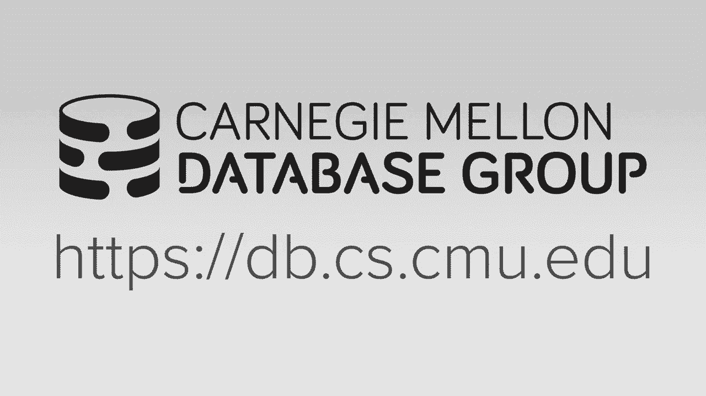
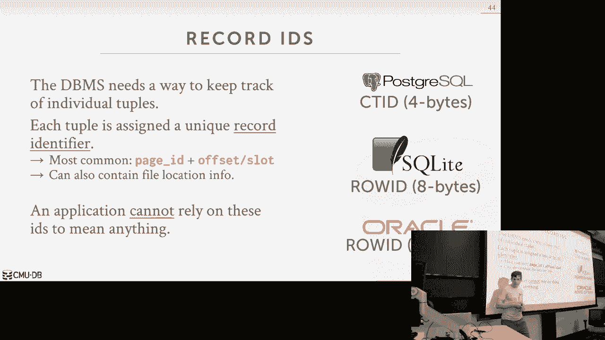
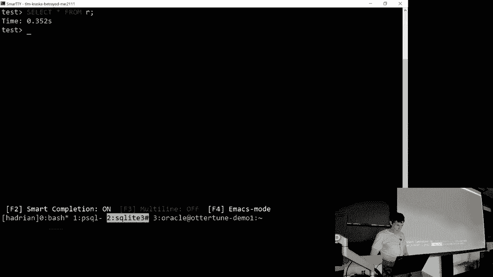
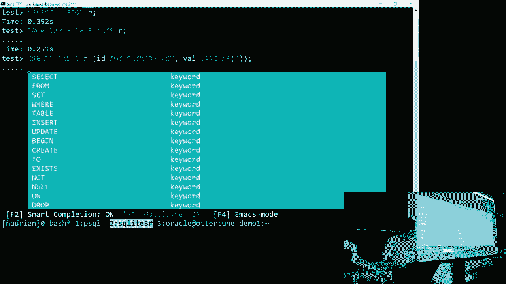
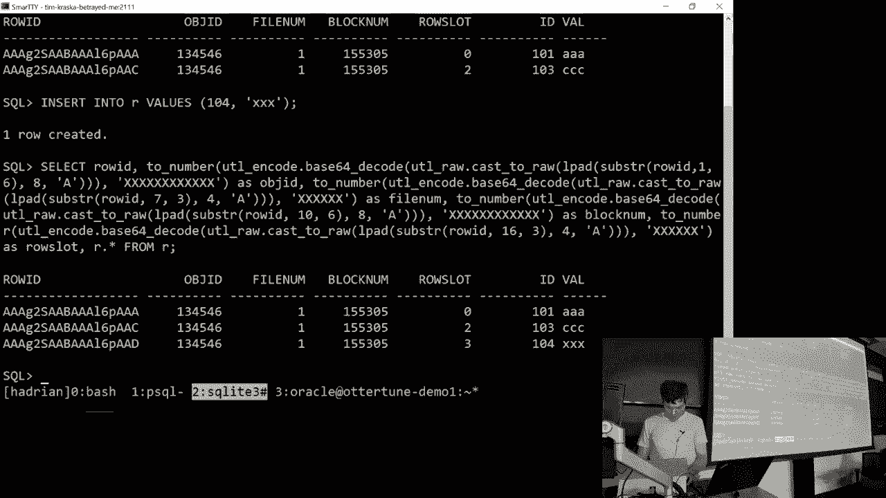
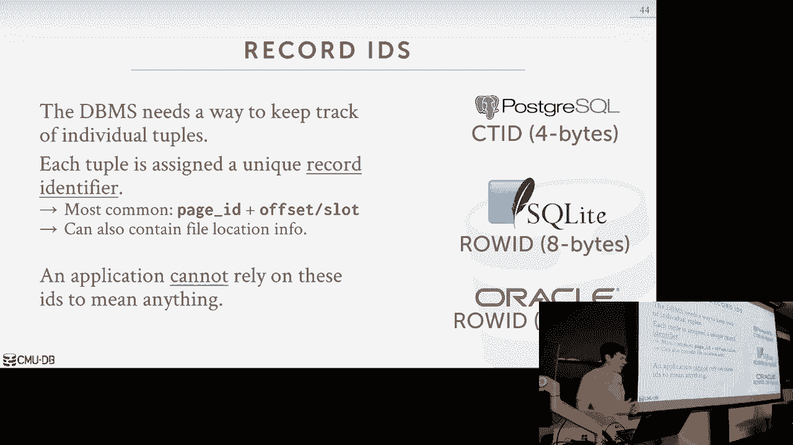
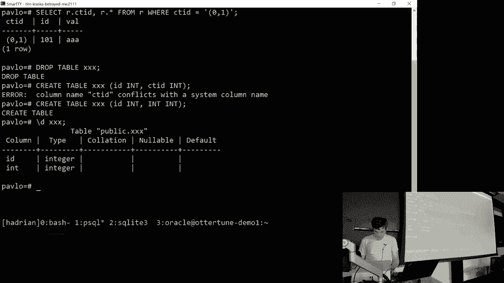

# 3：数据库存储 1 💾

在本节课中，我们将要学习数据库系统如何存储数据。我们将从宏观层面了解数据库在磁盘上的组织形式，深入到页面内部的数据结构，并理解为什么数据库系统需要自己管理存储，而不是依赖操作系统。

上一节我们介绍了数据库的逻辑视图（关系表和SQL），本节中我们来看看数据库系统在物理层面是如何组织和存储数据的。

## 存储层次结构与数据库假设

数据库系统通常被设计为**面向磁盘**的。这意味着系统假设数据的主要驻留位置是磁盘，而内存（DRAM）容量有限。因此，系统设计的核心目标之一是高效管理数据在磁盘（非易失性存储）和内存（易失性存储）之间的移动。

计算机的存储层次结构如下（从上到下，速度递减、容量递增、成本递减）：
*   CPU寄存器 / 缓存
*   DRAM（内存）
*   SSD / 机械硬盘
*   网络存储

对于数据库系统，我们最关心的是**易失性存储**（如DRAM）和**非易失性存储**（如SSD/硬盘）之间的分界线。从磁盘读取数据比从内存读取要慢数个数量级（例如，从内存读取可能需要100纳秒，而从磁盘读取可能需要10毫秒）。因此，数据库系统的核心挑战之一就是最小化访问磁盘带来的性能影响。

## 为什么数据库系统要自己管理存储？

一个自然的想法是：为什么不直接使用操作系统的**内存映射文件**功能（如 `mmap`）来管理数据在磁盘和内存间的移动呢？这样数据库系统就不需要实现复杂的缓冲池了。

以下是数据库系统选择自己管理存储的主要原因：
1.  **放弃控制权**：操作系统不了解数据库查询的**高级语义**（例如，哪些数据即将被访问，哪些数据是“热”数据）。它只能看到一堆低级的读写请求，因此其页面置换策略（如LRU）可能不是最优的。
2.  **正确性问题**：对于写入操作，数据库有严格的顺序要求（例如，写日志必须在写数据页之前刷新到磁盘）。操作系统无法理解这些约束，可能导致数据损坏。
3.  **性能瓶颈**：通用操作系统的优化策略无法针对数据库的工作负载进行定制。数据库系统可以利用自身知识（如下一个查询可能需要哪些数据）进行**预取**、更智能的缓存和I/O调度。

虽然少数数据库（如MongoDB的早期版本、LMDB）使用了`mmap`，但它们通常需要大量额外工作来规避上述问题。主流的生产级数据库系统（如PostgreSQL, MySQL, Oracle）都实现了自己的存储管理器和缓冲池。

**核心结论**：数据库系统总能比通用操作系统更好地管理自己的数据。

## 数据库文件的组织

数据库在磁盘上本质上就是**一个或多个文件**。有些系统（如SQLite）使用单个文件，而有些（如PostgreSQL）使用多个文件和目录。使用多个文件可以避免操作系统对单个文件大小的限制，并便于管理。

这些文件对操作系统来说只是二进制数据，其具体格式是数据库管理系统私有的。负责维护这些磁盘文件的组件称为**存储管理器**或**存储引擎**。

### 页面：存储的基本单元

数据库文件被组织成一系列固定大小的块，称为**页面**。页面是数据库在磁盘和内存之间传输数据的基本单位。

需要区分几种不同的“页面”概念：
*   **硬件页面**：存储设备（如SSD）保证原子写入的最小单元，通常为4KB。
*   **操作系统页面**：操作系统内存管理使用的单位，通常为4KB。
*   **数据库页面**：数据库系统内部使用的单位，大小可配置（例如512字节到16KB不等）。这是我们在课程中主要关注的。

每个页面都有一个唯一的**页面ID**。系统通过一个**页面目录**来维护页面ID到其在文件中物理位置（文件+偏移量）的映射。这种间接层允许系统在磁盘上移动页面而无需更新所有引用该页面的上层结构。

### 堆文件组织

堆文件是一种简单的组织方式，它是**页面的无序集合**。元组可以以任何顺序插入到任何有空间的页面中。系统需要提供API来：1）读取/写入指定页面；2）遍历所有页面（用于全表扫描）；3）找到有自由空间的页面（用于插入）。

以下是管理堆文件中页面的两种方法：

**1. 链表式堆文件（低效，仅作理解）**
在文件头部维护两个链表头指针：一个指向所有空闲页面的链表，另一个指向所有已包含数据的页面链表。要找到空闲页面需要遍历链表，效率低下。

**2. 页面目录式堆文件（常用方法）**
使用一个或多个特殊的**目录页面**。目录中的每个条目对应一个数据页面，存储了其页面ID、物理位置以及该页面中的**空闲空间大小**。当需要插入新数据时，系统可以快速扫描目录条目来找到一个有足够空间的页面，而无需遍历所有数据页面。

## 页面内的数据布局

现在我们深入到单个页面内部，看看数据（特别是元组）是如何存储的。

### 面向元组的页面布局：槽式页面

最常见的布局方式是**槽式页面**。页面被分为三个部分：
*   **页头**：存储元数据，如页面大小、校验和、数据库版本、事务可见性信息等。
*   **槽数组**：从页面**开头**向**尾部**增长。每个槽是一个“指针”，存储了对应元组数据在页面内的**起始偏移量**。槽号（从0开始）是元组在页面内的逻辑标识。
*   **元组数据区**：从页面**尾部**向**开头**增长。新插入的元组数据放在这块区域。

当需要插入新元组时，系统在元组数据区的尾部分配空间，并在槽数组的头部添加一个新槽指向它。删除元组时，只需标记对应的槽为“无效”，元组数据区可能产生“空洞”。系统可以定期运行**压缩**（Vacuum）进程来重整页面，回收空间。

**这种设计的优势**：
*   支持**变长元组**。
*   通过槽数组的间接层，可以在页面内移动元组数据（例如压缩时）而无需更新外部对该元组的引用。外部引用只需知道`(页面ID, 槽号)`。

### 元组标识符

系统通过**记录ID**来唯一标识一个元组，通常由`页面ID`和`槽号`组成。例如：
*   PostgreSQL: `ctid` (例如 `(0,1)` 表示第0页，第1槽)
*   MySQL InnoDB: 类似的概念
*   Oracle: `ROWID`

上层组件（如索引）存储的是记录ID。当需要访问元组时：
1.  使用`页面ID`查询**页面目录**，找到该页面的物理位置并读入内存。
2.  在页面内，使用`槽号`查找**槽数组**，获得元组数据的实际偏移量。
3.  访问该偏移量获取元组字节序列。

### 元组内的数据布局

一个元组本身是一个字节序列。其布局通常包括：
1.  **元组头**：包含元数据，如空值位图、事务ID等。
2.  **属性数据**：按照`CREATE TABLE`语句中定义的列顺序依次存储各个属性的值。

数据库系统根据**系统目录**中存储的表模式信息（各列的数据类型、长度等）来解释这个字节序列。

### 反规范化存储

通常，一个页面只存储单个表的元组。但在某些为了优化查询性能的场景下，可能会进行**反规范化**存储。例如，如果`Bar`表通过外键关联`Foo`表，且两者经常被一起查询，系统可以选择将`Bar`表的关联数据**内联**到`Foo`表的元组中存储。这实质上是物理层面的“预连接”，避免了运行时连接操作的开销。一些现代数据库（如文档数据库）常采用这种思想。

---

本节课中我们一起学习了数据库存储的基础。我们理解了为什么数据库要自己管理存储而非依赖操作系统，知道了数据库文件如何被组织成**页面**，并通过**页面目录**进行管理。我们还深入了解了最常见的**槽式页面**布局，以及如何通过`(页面ID, 槽号)`来定位元组。这些概念是构建数据库存储引擎的基石。下一节课，我们将继续探讨如何管理这些页面在内存中的缓存，即**缓冲池**的设计与实现。