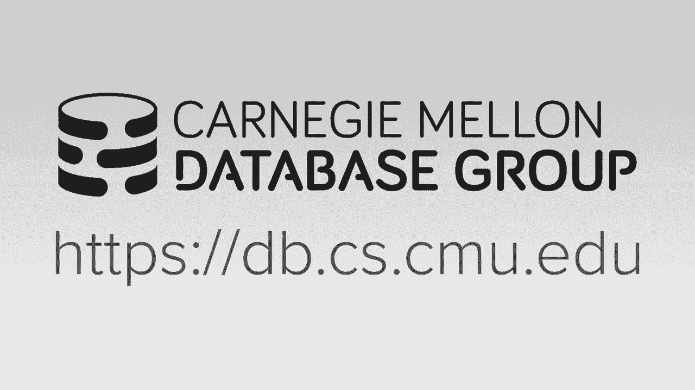
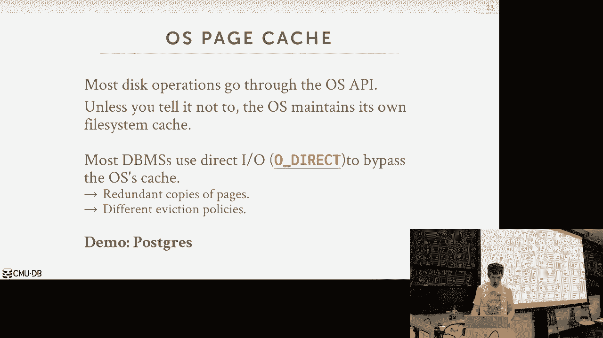
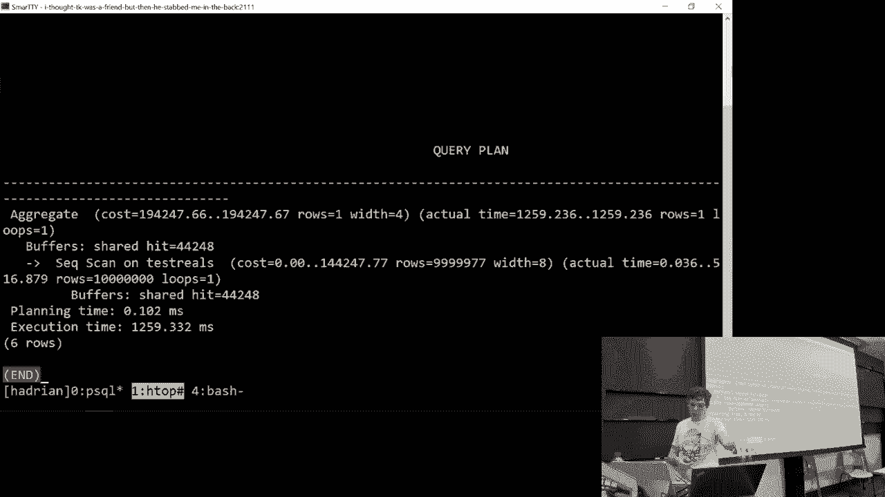
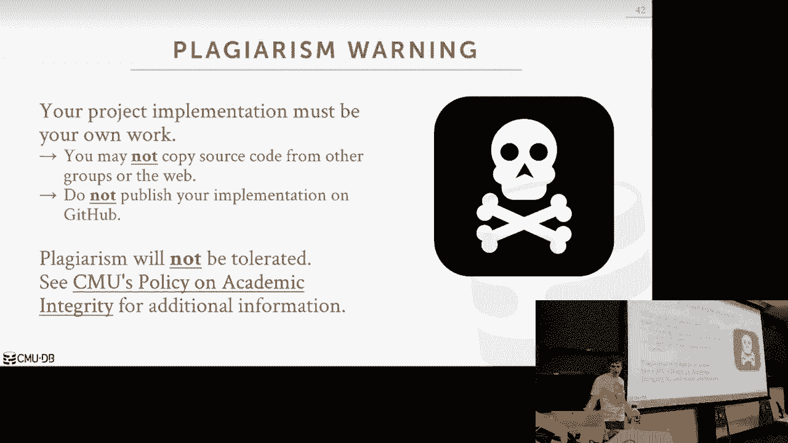

# 5：缓冲池与内存管理 🗄️

在本节课中，我们将要学习数据库系统如何管理内存，特别是如何通过缓冲池（Buffer Pool）高效地从磁盘读取数据页到内存中，以及如何制定策略来优化这一过程，以支持超过物理内存大小的数据库并最小化性能影响。

## 概述

我们已经讨论了如何在磁盘上表示数据库（如页面目录、槽式页面等）。现在，我们需要了解如何将这些磁盘上的页面有效地取到内存中进行操作。数据库系统无法直接在磁盘上操作数据，必须将数据页读入内存。缓冲池管理器（或称缓冲区缓存）就是负责这项工作的核心组件。它的目标是让系统表现得仿佛整个数据库都在内存中，同时最大限度地减少因数据不在内存而导致的查询延迟（Stall）。

## 缓冲池基础

上一节我们介绍了数据在磁盘上的组织方式，本节中我们来看看如何将它们带入内存。

缓冲池本质上是数据库系统在内存中分配的一大块区域。系统将这块内存划分为多个固定大小的块，称为**帧**（Frame），每个帧的大小与磁盘上的**页**（Page）大小相同。

当数据库执行引擎请求一个特定页时（例如“读取第2页”），缓冲池管理器会执行以下操作：
1.  检查该页是否已在缓冲池的某个帧中。
2.  如果在（称为“缓存命中”），则直接返回指向该帧的指针。
3.  如果不在（称为“缓存未命中”），则需要从磁盘读取该页，放入一个空闲帧中，然后返回指针。

为了追踪页在内存中的位置，系统需要维护一个**页表**（Page Table）。这是一个哈希表，它将**页ID**映射到**帧ID**。这样，系统就能快速找到内存中是否存在某个页以及它在哪里。

除了映射关系，页表还为每个缓冲中的页维护重要的元数据：
*   **脏位（Dirty Flag）**：一个标记位，指示该页自读入内存后是否被修改过。
*   **钉住计数（Pin/Reference Counter）**：一个计数器，记录当前有多少个正在运行的查询或线程正在使用该页。钉住的页不能被移出缓冲池，以确保使用它的操作不会出错。

在并发环境下，访问页表等数据结构需要使用**闩锁**（Latch）进行保护。闩锁是一种低级的、短期的同步原语（类似于互斥锁），用于保护数据库系统内部的关键数据结构和内存区域，与保护数据库逻辑内容（如表、元组）的**锁**（Lock）不同。

> **重要区分**：页目录（Page Directory）是磁盘上的持久化结构，用于定位文件中的页。页表（Page Table）是内存中的临时映射，用于追踪页在缓冲池中的位置。页目录必须持久化，而页表不需要。

## 缓冲池优化策略

一个简单的缓冲池可以工作，但为了获得最佳性能，数据库系统可以采用多种优化策略，这些策略利用了数据库系统比操作系统更了解查询意图的优势。

以下是几种关键的优化技术：

### 1. 多缓冲池

与其使用单个全局缓冲池，系统可以配置多个缓冲池实例。

**优势在于**：
*   **减少闩锁争用**：不同线程访问不同缓冲池的页表时，不会相互竞争同一个闩锁，提高了多核环境下的可扩展性。
*   **定制化策略**：可以为不同类型的数据（如表、索引）或不同访问模式的工作负载设置不同的缓冲池，并为每个池定制页面替换策略。

**映射方式**：
*   **扩展记录ID**：在记录ID中加入对象标识，通过查表确定对象属于哪个缓冲池。
*   **哈希法**：直接对页ID或记录ID进行哈希，根据结果分配到不同的缓冲池。例如：`buffer_pool_id = hash(page_id) % num_pools`

### 2. 预取

预取（Prefetching）基于查询计划，提前将未来可能需要的页读入缓冲池，从而避免后续请求时的等待。

**示例**：
*   **顺序扫描**：当查询开始全表扫描时，系统可以预判并提前读取接下来的若干页。
*   **索引扫描**：对于范围查询（如 `WHERE value BETWEEN 150 AND 250`），系统在遍历索引树时，可以预取即将访问的叶子节点页，即使这些页在磁盘上并不连续。这是操作系统难以做到的，因为数据库系统理解数据的语义和结构。

### 3. 扫描共享

扫描共享（Scan Sharing）允许多个查询共享同一个扫描光标（Cursor）。当一个查询正在顺序读取页时，另一个需要相同数据的查询可以“搭便车”，复用已读入缓冲池的页，而不是自己重新发起扫描。

**工作方式**：
1.  查询Q1开始扫描表。
2.  查询Q2稍后开始扫描同一张表。
3.  系统识别到这一点，让Q2附着在Q1的扫描光标上。
4.  Q2从附着点开始接收数据，并在Q1结束后继续扫描剩余部分。

这特别适用于关系模型，因为关系是无序的，从中间开始扫描得到的结果集仍然是有效的。

### 4. 缓冲池旁路

对于某些已知的、短暂的、不会重复使用的大量数据扫描（如大型排序的中间结果），可以绕过缓冲池。

**做法**：查询线程分配一小块本地内存，直接从磁盘读取数据到这块内存中进行处理，处理完毕后丢弃。这样做避免了污染全局缓冲池，也省去了查询页表和持有闩锁的开销。

## 操作系统页面缓存与数据库缓冲池

当数据库通过`read()`系统调用读取磁盘页时，数据通常会先经过操作系统的**页面缓存**（Page Cache）。这意味着磁盘上的一个页，可能在操作系统缓存和数据库缓冲池中各有一份副本。

大多数数据库系统（如Oracle, MySQL）倾向于使用**直接I/O**（Direct I/O）标志打开文件，绕过OS页面缓存，完全由自己管理缓存。这样做的好处是：
*   **避免双重缓存**，更高效地利用内存。
*   **完全控制写入顺序和时机**，这对于保证崩溃恢复的正确性至关重要（例如，确保日志先于数据页写入磁盘）。

**PostgreSQL是一个特例**，它默认依赖操作系统的页面缓存。这简化了数据库自身的缓存管理代码，但可能带来轻微的性能开销和双重缓存的问题。

## 页面替换策略

当缓冲池已满且需要读入新页时，必须决定将哪个现有页移出（替换）。目标是替换掉未来最不可能被使用的页。

### 经典策略：LRU与时钟算法

*   **最近最少使用**：跟踪每个页最后一次被访问的时间戳。替换时，选择时间戳最老的页。维护精确的时间戳开销较大。
*   **时钟算法**：LRU的一种高效近似实现。它为每个页设置一个**引用位**。有一个“钟表指针”循环扫描所有页：
    1.  如果当前页的引用位为1（表示最近被访问过），则将其置为0，指针移向下一个。
    2.  如果引用位为0，则选择该页进行替换。
    这种方法避免了全局排序，开销很小。

### 替换策略的挑战与优化

*   **顺序扫描污染**：一个全表扫描会读入所有页，并更新它们的引用位或时间戳，可能“挤掉”真正需要的热点数据页。
*   **优化方法**：
    *   **LRU-K**：记录页的最后K次访问时间，根据访问间隔的频率来预测未来访问可能性，而不仅仅是最近一次。
    *   **本地化策略**：结合多缓冲池，为不同工作负载使用不同的替换策略。
    *   **优先级提示**：查询执行器可以向缓冲池管理器提供提示。例如，对于B+树索引，根节点几乎总是被访问，可以提示将其“钉”在内存中。

### 处理脏页

替换一个**脏页**（被修改过）比替换**干净页**代价更高，因为需要先将脏页写回磁盘，然后才能复用其帧。

**优化手段**：
*   **后台写入**：系统周期性地扫描缓冲池，将脏页批量写回磁盘，使其变“干净”。这样在需要替换时，有更多干净的候选页可供选择，减少替换延迟。
*   **替换策略权衡**：策略需要在“替换一个很快能丢弃的干净页（但它可能很快又被用到）”和“替换一个需要额外I/O写回的脏页（但它可能不再需要）”之间做出权衡。

## 总结

本节课中我们一起学习了数据库内存管理的核心——缓冲池。我们了解了缓冲池的基本架构，包括帧、页表和元数据（脏位、钉住计数）。我们探讨了如何通过多缓冲池、预取、扫描共享和缓冲池旁路等技术来优化性能。我们还分析了数据库缓冲池与操作系统页面缓存的交互，以及关键的页面替换策略（如时钟算法）及其在面对像顺序扫描这样的挑战时的优化思路。

有效的缓冲池管理是数据库高性能的基石，它使系统能够智能地利用有限的内存资源，让基于磁盘的数据库系统获得接近内存数据库的响应速度。