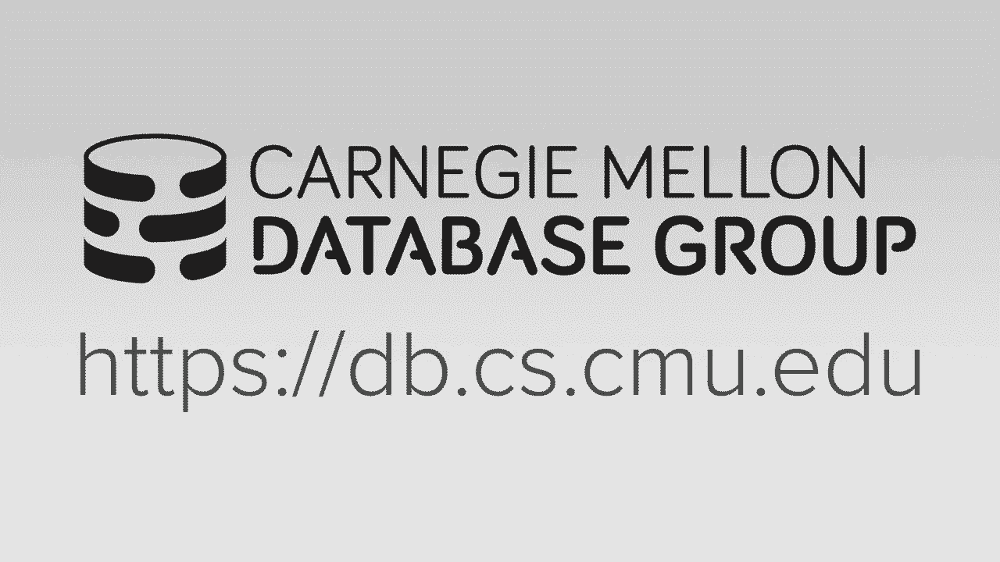

# 9：多线程索引并发控制 🔒




在本节课中，我们将要学习如何让数据库系统中的索引数据结构（如哈希表和B+树）在多线程环境下安全地工作。我们将重点讨论**锁存器**的使用，这是一种保护数据结构内部物理完整性的机制，确保多个线程同时读写时不会导致数据损坏或程序崩溃。

---

## 概述

到目前为止，我们在讨论哈希表和B+树等数据结构时，都假设只有一个线程在访问它们。但在真实的数据库系统中，为了充分利用多核CPU并减少I/O等待带来的延迟，我们需要允许多个线程并发地访问这些数据结构。本节课的核心就是介绍如何通过**锁存器**协议来实现这一点，确保并发访问时的**物理正确性**。

---

## 锁存器与锁的区别

在深入细节之前，我们需要明确数据库领域中两个关键概念的区别：**锁**和**锁存器**。

上一节我们介绍了并发控制的基本目标，本节中我们来看看实现这一目标的两类不同机制。

*   **锁**：这是一种高级逻辑概念，用于保护数据库的**逻辑内容**，例如元组、表或整个数据库。锁在**事务**的整个持续时间内持有，并且系统需要能够回滚锁保护对象上的更改。锁主要用于隔离不同事务之间的操作。
*   **锁存器**：这是一种低级保护机制，类似于操作系统中的互斥锁。它用于保护数据库系统**内部数据结构的临界区**，防止多个线程同时读写导致物理结构损坏（如指针失效）。锁存器只在一个操作的**短暂临界区**内持有，操作完成后立即释放，通常不需要支持回滚。

以下是两者的核心区别总结：

| 特性 | 锁 | 锁存器 |
| :--- | :--- | :--- |
| **保护对象** | 数据库逻辑内容（如元组、表） | 内部数据结构（如索引页、哈希桶） |
| **持有时间** | 整个事务持续时间 | 操作临界区持续时间 |
| **模式** | 多种（共享、独占、意向锁等） | 两种（读、写） |
| **死锁处理** | 通过事务管理器检测和解决（如超时、回滚） | 通过编码规范避免（如按固定顺序获取） |
| **回滚** | 支持，需记录日志 | 通常不支持，操作被视为原子 |

我们本节课的重点是**锁存器**，它确保数据结构的物理完整性。关于锁和事务的更多内容，将在后续课程中讨论。

---

## 锁存器的实现

锁存器是如何实现的呢？主要有两种方式：

1.  **操作系统阻塞式互斥锁**：例如C++标准库中的 `std::mutex`。使用简单，但获取失败时线程会被操作系统挂起，上下文切换开销较大，在高竞争场景下性能不佳。
2.  **自旋锁存器**：在用户空间实现，通常基于CPU的**原子指令**（如`compare-and-swap`）实现。线程会通过循环不断尝试获取锁存器（“自旋”），避免了陷入内核的开销，非常高效。

自旋锁存器的一个简单代码示例如下：
```cpp
std::atomic_flag latch = ATOMIC_FLAG_INIT; // 原子标志，表示锁存器状态

// 尝试获取锁存器
while (latch.test_and_set(std::memory_order_acquire)) {
    // 获取失败，可以在此处选择自旋、让出CPU或放弃
}
// 成功进入临界区...
// 执行操作...
latch.clear(std::memory_order_release); // 释放锁存器
```

在实际数据库系统中，我们通常需要支持**读写锁存器**，即在基本自旋锁或互斥锁之上，管理读线程和写线程的队列，以支持共享读和独占写。

---

## 哈希表的并发控制

对于哈希表（特别是线性探测哈希表）的并发控制相对简单，因为所有线程的探测方向都是一致的（从上到下，循环扫描），这从根本上避免了死锁的可能性。

实现时主要考虑锁存器的**粒度**：

*   **页级锁存器**：每个哈希桶（或页）有一个读写锁存器。优点是存储开销小，实现简单；缺点是可能降低并行度，因为访问同一页不同槽位的线程也会被串行化。
*   **槽级锁存器**：每个槽位都有一个锁存器。优点是并行度高；缺点是存储和管理开销大，遍历时需要获取和释放多个锁存器。

以下是两种粒度下线程操作的简要对比：
*   使用页级锁存器时，线程在访问一个页之前获取该页的锁存器，在跳转到下一个页之前释放当前页的锁存器。
*   使用槽级锁存器时，线程可以以更细的粒度交错执行，例如一个线程在槽A上等待时，另一个线程可以处理槽C。

由于所有操作方向一致，线程在跳转到下一个桶/页时，可以安全地释放当前持有的锁存器，因为目标位置由静态的哈希函数决定，不会被其他线程改变。

---

## B+树的并发控制：锁存器耦合

B+树的并发控制更为复杂，因为线程不仅可能修改同一个节点，而且在遍历过程中，下方的线程可能进行分裂或合并操作，改变树的结构，导致上方线程的指针失效。

解决这个问题的标准技术称为**锁存器耦合**（或锁存器爬行）。其核心规则是：当从父节点移动到子节点时，必须在**持有父节点锁存器**的情况下，尝试获取**子节点的锁存器**。获取子节点锁存器后，如果判断该子节点是“安全”的，则可以释放父节点的锁存器。

**“安全”节点的定义**：对于一个修改（插入/删除）操作，如果当前节点不可能因为后续操作而发生分裂或合并，则该节点是安全的。
*   **插入安全**：节点未满（有空间容纳新键）。
*   **删除安全**：节点超过半满（删除一个键后不会触发合并）。

让我们看看不同操作下锁存器耦合的流程：

*   **查找操作**：全程获取**读锁存器**。每到达一个子节点并确认其位置后，即可释放其父节点的读锁存器。
*   **插入/删除操作（悲观路径）**：从根节点开始，根据操作类型获取**写锁存器**。向下遍历时，只有遇到“安全”节点时，才能释放其所有祖先节点的写锁存器。这保证了在可能修改路径上持有必要的锁存器。

---

## 乐观锁存器耦合

悲观路径中，每次修改操作都从根节点开始获取写锁存器，这会使根节点成为性能瓶颈。为了提升并发度，我们可以采用**乐观锁存器耦合**。

其基本思想是：假设大多数修改操作**不会**导致叶子节点的分裂或合并。因此，首先尝试**快速路径**：
1.  像查找操作一样，使用读锁存器进行锁存器耦合，遍历到目标叶子节点。
2.  在叶子节点上获取写锁存器。
3.  检查操作是否真的会导致分裂/合并。
    *   如果**不会**，则直接完成操作，成功返回。这避免了从根节点开始的写锁存器竞争。
    *   如果**会**，则放弃当前所有锁存器，回退并重启整个操作，这次使用悲观的写锁存器路径。

在真实的数据库系统中，由于节点（页）通常较大（如8KB），能容纳很多键，因此大多数插入/删除操作不会触发分裂/合并，乐观假设通常是成立的，能显著提升性能。

---

## 叶子节点扫描与死锁处理

当B+树支持通过兄弟指针进行叶子节点范围扫描时，线程的移动方向就不仅是从上到下，还包括了在叶子层的水平移动。这引入了死锁的可能性。

例如：
*   线程1持有节点A的写锁存器，希望获取节点B的读锁存器以继续向右扫描。
*   线程2持有节点B的写锁存器，希望获取节点A的读锁存器以继续向左扫描。
*   双方互相等待，形成死锁。

在事务级别的锁管理中，有死锁检测器来处理这种情况。但在低级别的锁存器世界中，没有全局协调器。最实用和简单的解决方案是：**当线程无法立即获取所需的锁存器时，立即中止当前操作，释放所有已持有的锁存器，然后重试**。

这虽然可能导致重试开销，但实现简单，且能有效避免死锁。线程可以加入短暂的随机退避时间再重试，以减少冲突。

---

## B-link树优化：延迟父节点更新

为了进一步优化高并发插入场景，B-link树提出了一种改进：在叶子节点发生分裂时，**不立即更新父节点**。

具体步骤是：
1.  线程乐观地遍历到叶子节点，发现需要分裂。
2.  它仍然完成叶子节点的分裂操作，创建新节点，并设置好兄弟指针。
3.  但是，它**不直接更新父节点**来加入对新节点的引用，而是将一个“提示”（如待插入的键值及新页面ID）记录在一个与父节点关联的“临时区域”。
4.  该线程随后释放锁存器并返回。父节点的更新被延迟。
5.  后续**任何一个**线程在遍历到该父节点并需要获取其写锁存器时（无论是为了插入、删除还是其他分裂），会检查这个“临时区域”。如果发现有待处理的更新，则该线程会“好心”地帮助完成父节点的更新操作。

这种延迟更新技术减少了持有父节点写锁存器的时间，降低了竞争，提升了并发性。

---

## 总结

本节课中我们一起学习了数据库索引在多线程环境下的并发控制机制。

我们首先区分了保护逻辑内容的**锁**和保护物理结构的**锁存器**。然后，我们探讨了锁存器的两种实现方式：操作系统互斥锁和更高效的自旋锁。

接着，我们分析了如何为**哈希表**这种相对简单的结构添加并发控制，其关键在于所有操作方向一致，避免了死锁。

课程的重点是**B+树**的并发控制。我们深入学习了**锁存器耦合**协议，它通过按顺序获取和释放锁存器，并定义“安全”节点，来保证遍历过程中的结构完整性。为了提升性能，我们引入了**乐观锁存器耦合**，先尝试快速读路径，失败时再回退到保守的写路径。

最后，我们讨论了**叶子节点扫描**可能引发的死锁问题，并给出了“中止-重试”的解决方案。此外，还简要介绍了**B-link树**通过延迟父节点更新来优化并发插入性能的技术。


掌握这些底层并发控制技术，对于构建高性能、高可靠的数据库系统至关重要。这些思想不仅适用于数据库索引，也广泛存在于其他对性能要求苛刻的并发系统中。