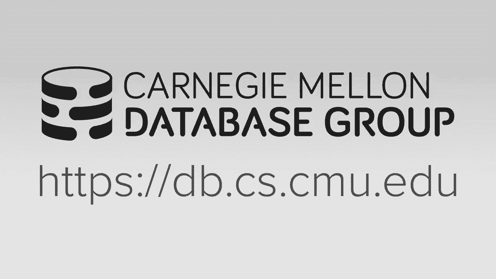

# 10：排序和聚合

在本节课中，我们将要学习数据库系统中两个核心的物理操作：排序和聚合。我们将探讨当数据无法完全装入内存时，如何设计高效的算法来处理这些操作。课程将重点介绍外部归并排序算法和基于哈希的聚合算法，并比较排序与哈希两种策略的优劣。

## 课程安排与背景

在深入今天的内容之前，我们先快速回顾一下接下来两周的课程安排。作业三今天发布，将于下周三（9号）截止。项目二也将在今天发布，期中考试定于16号（周三）正常上课时间进行，时长为80分钟，涵盖截至下周三（9号）课程的所有内容。

目前，我们已经学习了数据库系统的架构层次，包括如何在磁盘上存储数据页、如何通过缓冲池管理器将数据页调入内存，以及如何通过索引或顺序扫描访问数据。现在，我们将进入查询执行阶段，学习如何为SQL查询生成查询计划，并利用访问方法获取所需数据。

在接下来的两周，我们将首先讨论如何实现各种查询操作符的算法，然后探讨查询处理的不同方式（例如数据在操作符间的传递），最后讨论系统的运行时架构（如线程或进程的组织，以实现并行查询执行）。

## 查询计划简介

在深入算法细节之前，我们先简要了解一下查询计划。查询计划本质上是数据库系统执行给定查询的高级指令集，通常组织成树形结构或有向无环图。

例如，对于一个包含连接和过滤的SQL查询，其逻辑查询计划可能如下所示：叶子节点执行表扫描，然后将元组向上传递给连接操作符，连接操作符的结果再传递给投影操作符。逻辑计划只描述要做什么（如连接、过滤），而不指定具体如何做（如使用哪种连接算法、哪种扫描方式）。

本节课和下节课的重点，就是探讨实现这些物理操作符的具体算法。之后，在讨论查询优化时，我们会将这些算法结合起来，为查询计划选择最佳的执行策略。

设计这些算法时，我们必须考虑一个核心约束：数据（包括中间结果）可能无法完全装入主内存。因此，我们需要设计能够处理磁盘I/O的算法，并利用我们在第一个项目中构建的缓冲池管理器来管理超出内存容量的数据。与普通算法课程不同，我们需要特别关注数据的访问模式，尽可能最大化顺序I/O，因为顺序I/O比随机I/O高效得多。

我们将首先讨论外部归并排序算法，从中可以看到适用于其他操作符的高级分治策略。然后，我们将讨论聚合操作，它既可以依赖排序，也可以使用哈希，这自然过渡到下周要讲的哈希连接。排序和哈希是数据库系统中执行算法的两种主要方法，各有优劣。

## 为什么需要排序？📊

在关系模型中，关系中的元组本质上是无序的。我们不能假设读取数据时它们会按某种特定顺序排列。虽然聚簇索引可以基于某个键强制排序，但并非所有表都有聚簇索引，并且即使有，我们可能需要按另一个不同的键排序。

除了直接支持`ORDER BY`子句外，排序还能优化其他操作：
*   **去重**：如果数据已排序，只需扫描一次即可消除重复项。
*   **分组聚合**：如果数据已按分组键排序，可以一次扫描计算运行总计。
*   **批量加载B+树**：预排序数据后自底向上构建索引，效率更高。

因此，排序是数据库系统中一项非常有用的工具性操作。

如果所有待排序数据都能装入内存，我们可以直接使用任何经典的内存排序算法（如快速排序、堆排序）。问题在于数据无法装入内存时，像快速排序这样进行大量随机内存访问的算法会引发大量随机磁盘I/O，性能极差。因此，我们需要一种对磁盘I/O成本敏感、能最大化顺序I/O的算法。

## 外部归并排序 🔄

几乎所有支持超内存排序的数据库系统都使用**外部归并排序**算法。这是一种分治策略，基本思想是将待排序数据集分割成较小的块（称为“归并段”或“run”），先分别排序这些块，然后逐步合并它们，最终得到完全排序的结果。

该算法分为两个阶段：
1.  **阶段一**：将数据分成若干“归并段”，每个归并段的大小等于内存可容纳的页数（B）。将每个归并段读入内存进行排序，然后写回磁盘。
2.  **阶段二**：递归地合并已排序的归并段，生成越来越大的有序归并段，直到合并成一个包含所有数据的完整有序归并段。

这个过程可能需要对数据集进行多轮（pass）处理。

### 二路归并排序

我们先看一个简单的例子：**二路归并排序**。“二路”指的是在每一轮合并中，每次合并两个归并段。

假设数据集包含N个数据页，我们有B个缓冲页可用。在**第0轮**，我们每次读入B页数据到内存排序，然后写回磁盘，生成若干个大小为B页的已排序归并段。

在**后续轮次**，我们合并归并段。要进行二路合并，我们至少需要3个缓冲页：两个用于存放待合并的输入归并段的当前页，一个用于存放输出页。我们使用两个“游标”分别扫描两个输入归并段，比较当前键值，将较小的输出到输出页，并移动相应游标。当输出页写满时，将其写回磁盘。

**轮次数与I/O成本**：
*   总轮次数 = 1 + ⌈log₂ N⌉。其中1代表第0轮的排序阶段。
*   总I/O成本 = 2N * 轮次数。因为每一轮都需要读入和写出所有数据一次。

### 多路归并排序 (K-Way)

二路归并排序只使用了3个缓冲页，即使有更多可用内存也无法提升性能。我们可以进行推广，使用**多路归并排序**（K路），在一次合并中合并多个（K个）归并段。

假设有B个缓冲页可用。我们使用**B-1**个缓冲页来存放输入归并段（因为至少需要1个缓冲页用于输出）。因此，K = B-1。

**计算过程**：
*   **第0轮**：生成归并段。归并段数量 = ⌈N / B⌉。每个归并段大小为B页（最后一个可能小于B页）。
*   **后续轮次**：每一轮合并，我们将上一轮的归并段数量除以 (B-1)（向上取整），直到结果为1，即得到最终排序结果。
*   总I/O成本仍然是 2N * 轮次数。

**优化技巧：双缓冲**
一个简单的优化是**双缓冲**，即使用异步I/O预取下一批需要处理的数据页。这样，当CPU处理当前数据时，磁盘可以并行地读取下一批数据，减少I/O等待时间。

### 使用B+树加速排序

在某些情况下，我们可以利用现有的B+树索引来加速排序操作，避免昂贵的外部归并排序。

*   **聚簇索引**：如果表上存在聚簇索引，且排序键与索引键相同，那么数据在物理上已经按照该键排序。此时，只需遍历索引的叶节点即可按序获取所有数据，无需额外排序。
*   **非聚簇索引**：如果使用非聚簇索引来获取排序顺序，情况会很糟糕。因为索引键是排序的，但对应的数据记录可能分散在磁盘各处。每获取一条记录都可能引发一次随机磁盘I/O，效率极低。

因此，当查询需要按某个键排序，且恰好存在该键的聚簇索引时，查询优化器应选择使用索引，而不是执行排序算法。

## 聚合操作 🧮

接下来，我们看看聚合操作。聚合是另一个可以体现排序与哈希算法权衡的典型操作。通常，在磁盘I/O成为瓶颈的场景下，哈希方法往往表现更优，尤其是当我们可以设计哈希聚合算法以进行更多顺序I/O时。

### 使用排序实现聚合

如果数据已经排序，实现聚合（如去重`DISTINCT`或分组`GROUP BY`）非常高效。因为排序后，相同的键会相邻排列。我们只需对数据扫描一次，在扫描过程中即可完成去重或计算分组聚合值。

例如，一个查询需要获取成绩为B或C的**不重复**课程ID，并按课程ID排序。一个可能的查询计划是：
1.  **过滤**：首先过滤出成绩为B或C的元组。
2.  **投影**：丢弃不需要的列（如学生ID、成绩），只保留课程ID。
3.  **排序**：按课程ID排序。
4.  **去重**：扫描排序后的数据，移除连续的重复课程ID。

这个计划中，排序既满足了`ORDER BY`的要求，又为去重创造了条件，一举两得。但如果不要求输出有序，排序本身的开销可能就显得不必要了。

### 使用哈希实现聚合

哈希是另一种实现聚合的方法，特别适用于不需要有序输出的场景。

**内存哈希聚合**
如果所有不同的键可以装入内存，方法很简单：构建一个**临时哈希表**。扫描输入数据时，对每个元组的聚合键计算哈希值：
*   对于`DISTINCT`：如果键不在哈希表中，则插入；如果已在，则忽略（重复）。
*   对于`GROUP BY`聚合（如`SUM`, `AVG`）：如果键不在哈希表中，则插入并初始化聚合值（如计数和总和）；如果已在，则更新聚合值。

这种方法具有O(1)的查找/更新复杂度，非常高效。但问题在于，如果键的数量太多，哈希表无法完全装入内存，性能会因大量随机磁盘I/O而急剧下降。

**外部哈希聚合**
为了解决内存不足的问题，我们可以采用与外部归并排序类似的分治策略，即**外部哈希聚合**。它也分为两个阶段：

1.  **分区阶段**：
    *   使用一个哈希函数`h1`将元组分散到多个**分区**中。确保相同的键一定会进入同一个分区。
    *   我们使用B-1个缓冲页来存储这些分区的输出（每个分区在内存中有一个页缓冲区）。当某个分区的缓冲区满时，就将其写回磁盘。
    *   此阶段是顺序的：读入一页数据，对其中每个元组用`h1`计算其应属的分区，并写入对应的缓冲区。

2.  **探测阶段**：
    *   逐个处理每个分区。将整个分区读入内存（如果分区太大，则分批处理）。
    *   在内存中为当前分区构建一个新的（第二个）哈希表，使用另一个哈希函数`h2`。
    *   扫描该分区内的所有元组，对每个元组执行与内存哈希聚合相同的操作（插入/更新临时哈希表）。
    *   处理完一个分区后，输出该分区的聚合结果，清空内存中的哈希表，然后处理下一个分区。

这种方法的关键在于，**分区阶段**通过哈希将所有相同键的元组聚集到相同的磁盘分区中。因此，在**探测阶段**，我们可以在内存中完全处理一个分区的所有重复键，而不用担心其他分区的数据。这最大限度地减少了随机I/O，因为每个分区内的处理是顺序的，且分区之间无需交叉访问。

对于`GROUP BY`聚合，内存中的哈希表需要存储更复杂的状态。例如，计算平均成绩`AVG(GPA)`，哈希表的值部分需要存储两个值：该组的`GPA总和`以及`元组计数`。最终输出时，用总和除以计数得到平均值。

## 总结 📝

本节课我们一起学习了数据库系统中两个基本操作的实现：排序和聚合。

*   我们深入探讨了**外部归并排序算法**，这是一种用于超内存数据排序的分治算法。我们学习了二路和多路归并，并分析了其I/O成本。
*   我们了解到，如果存在与排序键匹配的**聚簇索引**，可以避免排序操作。
*   对于**聚合操作**，我们比较了基于排序和基于哈希的两种实现方法。
    *   排序方法在数据有序时效率很高，尤其当查询本身就需要有序输出时。
    *   哈希方法通常更快，尤其是对于不需要有序输出的聚合。我们重点介绍了**外部哈希聚合**算法，它通过分区和重哈希两个阶段，有效地处理了内存无法容纳所有键的情况。
*   排序和哈希背后的**分治与分区思想**，是数据库系统算法设计中反复出现的核心主题，我们将在后续课程（如连接操作）中再次看到它们。

在下节课中，我们将把注意力转向数据库系统中另一个至关重要且耗时的操作：连接（Join），并详细探讨排序合并连接和哈希连接等算法。

---

## 项目二说明

项目二是构建一个线程安全的线性探测哈希表。这个哈希表将基于你在项目一中实现的缓冲池管理器，这意味着它不是纯粹的内存哈希表，而是由磁盘页支持的。

**核心任务**：
1.  **设计页布局**：你需要设计哈希表头页和块数据页的布局，理解如何将缓冲池中的普通页解释为存储特定数据结构的页。
2.  **实现哈希表**：实现基本的插入、删除、查找操作，并保证线程安全（使用提供的读写锁存器）。
3.  **支持动态扩容**：当哈希表变满时，需要支持调整大小（扩容）。这需要锁住整个表，创建两倍大小的新表，然后重新哈希所有现有元素。

**实施建议**：
*   首先确保页布局正确无误，这是基础。
*   先实现单线程版本并保证正确性，再添加并发控制。
*   最后进行性能优化。项目会有一个排行榜。

请关注Piazza上的官方通知，获取最新的代码仓库和测试用例。请勿抄袭。

---

下节课我们将学习连接算法，特别是哈希连接。

