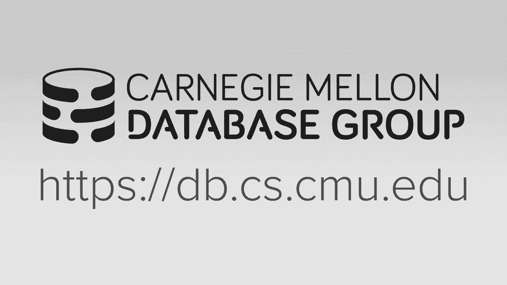
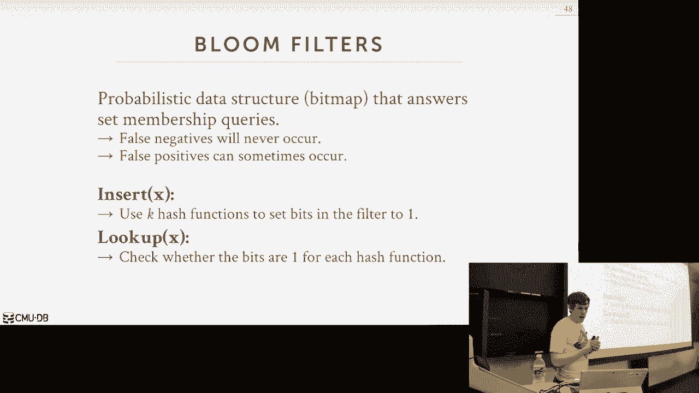

# 11：连接算法 🧩




在本节课中，我们将要学习数据库系统中一个至关重要的操作：连接（Join）。连接是关系数据库的核心，用于合并多个表中的数据。我们将专注于一次连接两个表的内部等值连接，并探讨几种主要的连接算法，分析它们的成本与适用场景。本节课结束时，你将理解嵌套循环连接、排序合并连接和哈希连接的基本原理与性能差异。

## 为什么要进行连接？🔗

连接是关系数据库系统规范化的副产品。为了减少数据冗余，我们将数据拆分到不同的表中。当需要查询跨表信息时，就必须通过连接操作来重建完整的元组。最常见的场景是通过外键关联表，例如订单表和订单明细表。连接操作允许我们高效地收集所有相关信息。

在分析型查询中，表通常非常庞大，因此选择高效的连接算法至关重要，这可能意味着分钟、小时甚至天级的性能差异。

## 连接算法的设计考量 ⚙️

在深入算法之前，我们需要明确两个设计决策：
1.  **连接算子的输出是什么？** 是发送完整的拼接后元组，还是只发送必要的属性或记录ID（后期物化）？这取决于系统的存储模型（行存或列存）和查询的具体需求。
2.  **如何评估算法的优劣？** 我们主要依据**I/O成本**来衡量。我们使用以下变量：
    *   表 R：共 M 页， m 个元组。
    *   表 S：共 N 页， n 个元组。
我们关注的是计算连接本身的成本，而非产生最终输出的成本，因为对于同一数据集，不同算法产生的输出结果是相同的。

我们主要讨论三类连接算法：嵌套循环连接、排序合并连接和哈希连接。

---

## 嵌套循环连接 🔄

嵌套循环连接是最基础、最直观的连接算法。其思想是：对于外表（左表）中的每一个元组，遍历内表（右表）中的每一个元组，检查连接条件是否满足。

### 基础版本（元组嵌套循环）

算法伪代码如下：
```
for each tuple r in R:
    for each tuple s in S:
        if condition(r, s) is true:
            emit output tuple
```
其 I/O 成本为：**M + (m * N)**。这非常昂贵，因为它为外表的每个元组都需要扫描整个内表。

### 优化版本（块嵌套循环）

我们可以利用数据以页为单位存储的特性进行优化。一次读取一个块（多行）到内存，基于块进行嵌套循环。

算法伪代码如下：
```
for each block Br in R:
    for each block Bs in S:
        for each tuple r in Br:
            for each tuple s in Bs:
                if condition(r, s) is true:
                    emit output tuple
```
其 I/O 成本为：**M + (M * N)**。性能有所提升。

### 进一步优化（缓冲块嵌套循环）

如果内存中有 B 个缓冲页，我们可以分配 (B-2) 个页给外表，1个页给内表，1个页用于输出。这样，我们可以一次将外表的 (B-2) 个块读入内存，然后只扫描内表一次。其成本约为：**M + ceiling(M/(B-2)) * N**。

**关键优化点**：
*   **选择较小的表作为外表**。
*   **尽可能利用内存缓冲外表**。
*   **如果内表在连接键上有索引，可用索引查找替代内表全扫描**，将成本从 N 降低到索引查找的常数成本。

尽管经过优化，嵌套循环连接本质上仍是一种暴力搜索，适用于小表或内表有高效索引的场景。

---

## 排序合并连接 📊

排序合并连接利用数据有序的特性来避免不必要的扫描。它分为两个阶段：排序阶段和合并阶段。

### 算法步骤
1.  **排序阶段**：使用外部归并排序等算法，根据连接键对两个输入表 R 和 S 进行排序。
2.  **合并阶段**：使用两个指针，分别指向已排序的 R 和 S 的开头，然后协同遍历。
    *   如果 R 的当前键 < S 的当前键，移动 R 的指针。
    *   如果 R 的当前键 > S 的当前键，移动 S 的指针。
    *   如果相等，则输出匹配的元组，并处理可能存在的重复键（可能需要回溯 S 的指针）。

### 性能分析
*   **成本**：排序成本（2 * 对每个表排序的成本） + 合并成本（约 **M + N**）。
*   **优点**：当输入数据已排序（例如，存在聚集索引）或查询本身需要有序输出时，效率很高。合并阶段通常只需对每个表扫描一次。
*   **缺点**：如果数据严重倾斜（例如，连接键只有一个值），排序带来的收益很小，可能退化为类似嵌套循环连接的行为。

排序合并连接在数据已预排序或查询包含 `ORDER BY` 子句（且排序键与连接键相同）时是理想选择。

---

## 哈希连接 ⚡

哈希连接是现代数据库系统中最常用且通常性能最好的连接算法，尤其适合大型数据集。其核心思想是使用哈希函数将数据分区，使得连接操作只需在对应的分区内进行。

### 基础哈希连接（内存可容纳）

假设哈希表可完全放入内存。
1.  **构建阶段**：扫描外表 R，对每个元组的连接键应用哈希函数 `h1`，将其插入内存中的哈希表（如线性探测哈希表）。
2.  **探测阶段**：扫描内表 S，对每个元组的连接键应用相同的哈希函数 `h1`，到哈希表中查找匹配项。如果找到，则输出连接结果。

其成本约为扫描两表的成本：**M + N**。

### 优化：布隆过滤器
在构建哈希表的同时，可以构建一个小的**布隆过滤器**。在探测阶段，先查询布隆过滤器。如果它说“键不存在”，则可以立即跳过该元组，避免昂贵的哈希表查找（尤其是当哈希表在磁盘上时）。布隆过滤器可能产生假阳性，但绝不会产生假阴性。

### 分区哈希连接（Grace Hash Join，用于内存不足时）
当哈希表太大无法放入内存时，需要使用分区哈希连接。
1.  **分区阶段**：
    *   使用哈希函数 `h1` 将两个表 R 和 S 分别分区成 k 个分区，并写回磁盘。目标是使每个分区都能被内存容纳。
    *   此阶段需要读写磁盘，成本约为 **2*(M + N)**。
2.  **连接阶段**：
    *   逐个处理对应的分区对 (Ri, Si)。将分区 Ri 读入内存并构建哈希表，然后扫描分区 Si 进行探测。
    *   此阶段成本约为 **M + N**。
3.  **递归分区**：如果某个分区仍然太大，可以对该分区使用另一个哈希函数 `h2` 进行递归分区，直到每个子分区都能放入内存。

哈希连接的总成本通常优于排序合并连接，因为它将随机比较转换为了顺序分区和分区内的高效查找。

---

## 算法对比与总结 🏁

以下是主要连接算法的简单对比：

| 算法 | 核心思想 | 最佳适用场景 | 关键成本因素 |
| :--- | :--- | :--- | :--- |
| **嵌套循环连接** | 双重循环暴力匹配 | 小表驱动，或内表有索引 | M + (m * N) 或优化后形式 |
| **排序合并连接** | 先排序，后合并指针 | 输入已排序，或需要有序输出 | 排序成本 + (M + N) |
| **哈希连接** | 哈希分区，分区内匹配 | 大型数据集，等值连接 | 约 3*(M + N) (分区哈希连接) |

**核心要点**：
*   **哈希连接** 在绝大多数等值连接场景下性能最优，是数据库系统的默认选择。
*   **排序合并连接** 在数据已排序或查询需要有序结果时更有优势。
*   **嵌套循环连接** 是最简单的后备方案，在内表有索引或表非常小时可用。

这些算法的存在体现了关系数据库和 SQL 的声明式优势：数据库优化器可以根据数据统计信息和系统资源，自动为查询选择最合适的连接算法，而无需修改应用程序代码。

---




本节课中，我们一起学习了三种基础的连接算法：嵌套循环连接、排序合并连接和哈希连接。我们了解了它们的工作原理、I/O成本模型以及各自的适用场景。掌握这些知识是理解数据库查询执行和性能调优的基础。下一节课，我们将探讨如何将这些算子组合起来，以管道或物化的方式执行完整的查询计划。