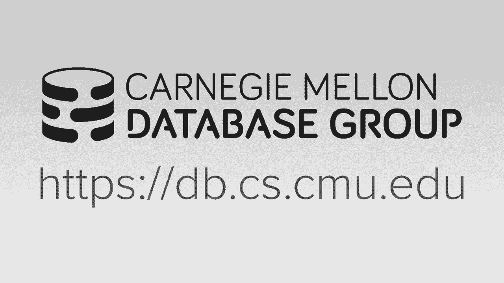
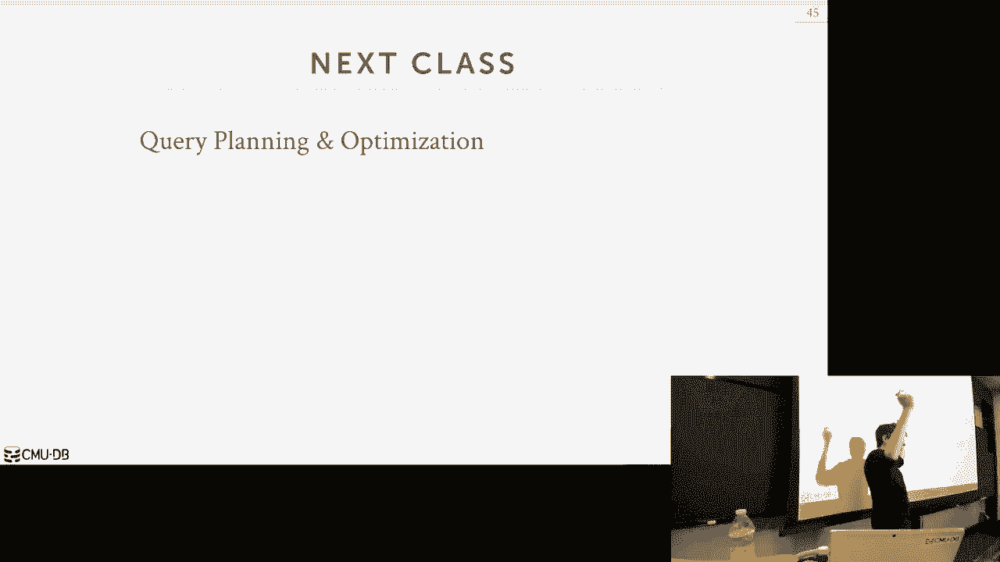

# 13：查询执行 2

在本节课中，我们将要学习数据库系统如何实现查询的并行执行。我们将探讨不同的进程模型、查询并行性的类型以及如何通过I/O并行性来提升性能。本节课的核心目标是理解如何利用现代多核硬件来加速查询处理。

上一节我们介绍了查询执行的基本模型和迭代器模式，本节中我们来看看如何将这些操作并行化。

## 进程模型

数据库系统需要组织多个工作线程或进程来处理并发请求。以下是三种主要的进程模型：

*   **每个工作者一个进程**：每个客户端连接由一个独立的操作系统进程处理。优点是进程间隔离性好，一个进程崩溃不会影响整个系统。缺点是需要通过共享内存来协调对共享数据结构（如缓冲池）的访问，开销较大。许多传统数据库系统（如Oracle, DB2的早期版本）采用此模型。
*   **进程池**：系统预先创建一组固定的工作进程。当新请求到达时，调度器从池中分配一个空闲进程来处理。这避免了为每个连接频繁创建和销毁进程的开销，并且池中的进程可以协作处理一个查询，实现查询内并行性。
*   **多线程模型**：整个数据库系统运行在单个进程中，但内部使用多个线程作为工作者。这是现代数据库系统最常见的方法。它允许数据库系统完全控制任务的调度，线程间切换开销低，并且所有线程可以自然地共享内存地址空间，便于管理全局状态（如缓冲池）。

## 查询内并行性

查询内并行性是指将一个查询分解为多个子任务，并利用多个工作者同时执行这些任务。主要有三种类型：

*   **算子内并行（水平并行）**：将一个操作符（如扫描、连接）的工作拆分成多个独立的片段，由不同的工作者并行执行。这通常需要一个特殊的**交换（Exchange）操作符**来合并或重新分发来自不同工作者的数据流。
    *   **聚集交换**：将来自多个工作者的输出流合并成一个单一的流。
    *   **重分区交换**：根据某种规则（如哈希值）将一个或多个输入流重新分发到多个输出流。
    *   **分发交换**：将一个输入流分发到多个输出流。
*   **算子间并行（垂直并行/流水线并行）**：查询计划树中不同层级的操作符由不同的工作者同时执行，一个操作符的输出作为流水线直接喂给下一个操作符。这要求操作符之间能够以流水线方式传递数据。
*   **Bushy并行**：这是算子间并行的一种扩展形式，允许同时执行查询计划树中不同分支上的操作符。它结合了水平与垂直并行的思想。

在实际系统中，这些并行方式可以组合使用，以最大化资源利用率和查询性能。

## I/O并行性

如果计算可以并行，但数据存储在慢速磁盘上，所有线程仍可能因等待I/O而阻塞。I/O并行性旨在通过跨多个存储设备分布数据来缓解这个问题。

*   **数据库分区**：数据库系统主动将数据分割并存储在不同的磁盘设备上。
    *   **垂直分区**：将表的不同列存储在不同的位置，类似于列存储的简化形式。
    *   **水平分区**：将表的行分割成不相交的子集（分区），存储在不同的设备上。这是实现分片（Sharding）的基础。
*   **RAID（独立磁盘冗余阵列）**：使用多个物理磁盘组合成一个逻辑磁盘，对数据库系统透明。常见级别包括：
    *   **RAID 0（条带化）**：数据交替存储在多个磁盘上，提高读写吞吐量，但无冗余。
    *   **RAID 1（镜像）**：数据完全复制到多个磁盘上，提高可靠性和读性能，但存储效率低。

通过I/O并行性，多个工作者可以同时从不同的磁盘设备读取数据，从而减少I/O瓶颈。

## 总结

本节课中我们一起学习了数据库查询的并行执行。我们首先探讨了组织并行工作者的三种进程模型，并指出多线程模型是现代系统的主流选择。接着，我们深入分析了查询内并行性的三种主要类型：算子内并行、算子间并行和Bushy并行，并认识了关键的交换操作符。最后，我们讨论了通过数据库分区和RAID技术实现I/O并行性，以打破存储瓶颈。理解这些并行执行技术对于设计和优化高性能数据库系统至关重要。