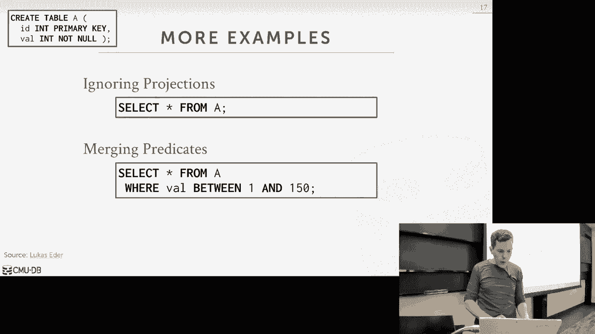
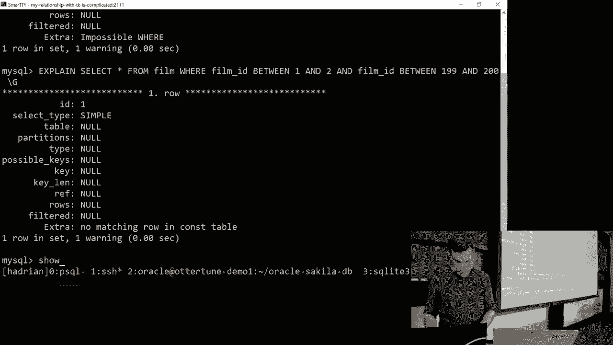
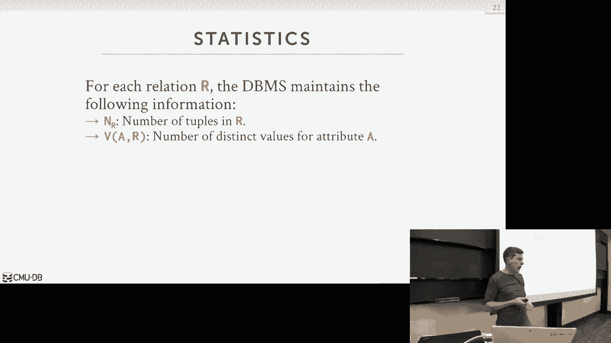

# 14：查询规划与优化 1


## 概述
在本节课中，我们将要学习数据库查询规划与优化的核心概念。查询优化器是数据库系统的关键组件，它负责将用户声明的SQL查询转换为最高效的执行计划。我们将探讨查询优化的两种主要方法：基于静态规则的启发式优化和基于代价的搜索优化，并理解其背后的基本原理。

## 查询优化的挑战与重要性
上一节我们介绍了查询执行的基本操作。本节中我们来看看如何为查询选择最佳的执行计划。SQL是一种声明式语言，它只告诉数据库需要什么结果，而不指定如何计算。因此，数据库系统需要自行决定最高效的执行方式。不同的执行计划（例如，选择嵌套循环连接还是哈希连接）在性能上可能存在巨大差异。查询优化器的质量是区分高端商业数据库系统（如Oracle、DB2）与开源系统的重要因素。

## 查询优化流程
查询优化通常遵循一个标准化的处理流程。以下是其核心步骤：

1.  **SQL重写器**：这是一个可选步骤，主要用于分布式数据库或视图，对原始SQL查询进行初步转换或注解。
2.  **SQL解析器**：将SQL字符串转换为内部的抽象语法树。
3.  **绑定器**：将查询中引用的对象名称（如表名、列名）转换为系统内部的标识符，并生成初始的**逻辑计划**。逻辑计划描述了要执行的高级操作（如扫描、连接），但不指定具体算法。
4.  **查询重写器**：基于静态规则和启发式方法，对逻辑计划进行等价变换以提升效率，例如谓词下推。此阶段通常只参考系统目录（元数据），而不查看实际数据。
5.  **优化器**：这是核心环节，进行**基于代价的搜索**。它枚举多个可能的执行计划，使用**代价模型**估算每个计划的执行成本，并选择成本最低的计划作为最终的**物理计划**。代价模型产生的数字是用于内部比较的相对值。
6.  **执行引擎**：执行优化器生成的物理计划，产生查询结果。

逻辑计划与物理计划的关键区别在于：逻辑计划描述“做什么”，而物理计划则明确指定“如何做”，例如使用索引扫描还是顺序扫描，使用哈希连接还是排序合并连接。

## 关系代数等价性与查询重写
查询优化的核心理论基础是关系代数的等价性。如果两个关系代数表达式（或查询计划）能产生相同的元组集合，则它们是等价的。利用这种等价性，我们可以对查询计划进行转换，以期获得更高效的执行方式。

以下是几种常见的基于规则的优化：

### 谓词下推
尽可能早地应用过滤条件，以减少后续操作需要处理的数据量。

**原始计划**：
```
π (σ (Student ⋈ Enrolled))
```
**优化后计划**：
```
π (Student ⋈ σ (Enrolled))
```
通过将选择操作 `σ`（过滤成绩为A的记录）下推到连接操作 `⋈` 之前，可以显著减少连接操作需要处理的元组数量。

### 投影下推
尽早移除查询中不需要的列，减少在操作符间传递的数据量，这对行存储或分布式数据库尤其重要。

### 无用谓词消除
数据库可以识别并移除永远为真或永远为假的谓词，避免不必要的计算或扫描。



**示例**：
```sql
SELECT * FROM table WHERE 1 = 0; -- 优化器可能直接返回空结果集
SELECT * FROM table WHERE 1 = 1; -- 优化器可能移除WHERE子句
```

### 合并谓词
将重叠的过滤条件合并，简化计算。

**示例**：
```sql
-- 原始查询
SELECT * FROM a WHERE val BETWEEN 1 AND 100 AND val BETWEEN 50 AND 150;
-- 可重写为
SELECT * FROM a WHERE val BETWEEN 1 AND 150;
```

## 基于代价的优化简介
当基于规则的优化无法做出最佳决策时（例如，决定多表连接的顺序），就需要进行基于代价的优化。其核心思想是：
1.  **枚举**：生成多个可能的查询执行计划。
2.  **估算**：使用代价模型估算每个计划的执行成本。
3.  **选择**：选择估算成本最低的计划。



代价模型依赖于数据库维护的**统计信息**，例如表的元组数量、列中不同值的数量、数据分布直方图等。这些信息通过 `ANALYZE` 等命令收集并存储在系统目录中。

然而，基于代价的优化面临巨大挑战：对于涉及N个表的连接，可能的连接顺序数量是阶乘级的（O(N!)），穷举所有可能性的搜索空间巨大。因此，实际的优化器必须使用智能策略来减少需要枚举的计划数量。




## 总结
本节课中我们一起学习了查询规划与优化的基本框架。我们了解到查询优化器通过将声明式的SQL查询转换为高效的物理执行计划来提升性能。我们探讨了基于静态规则的查询重写技术，如谓词下推和投影下推，并初步介绍了基于代价的优化所面临的挑战和核心思路。下一节课，我们将深入探讨代价估计的具体方法和查询计划的枚举策略。