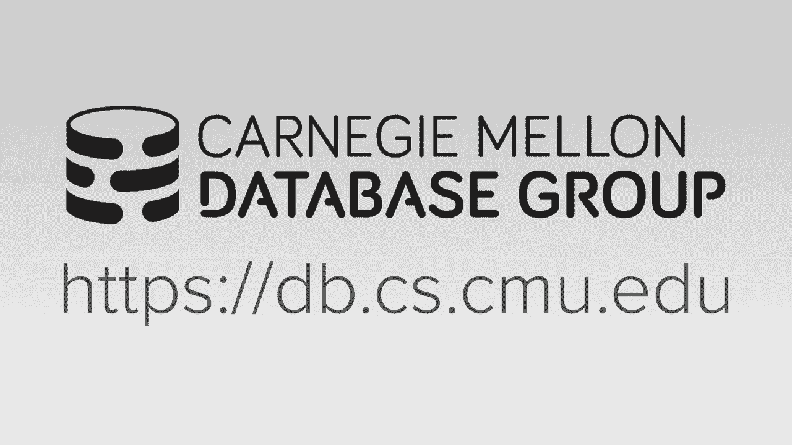
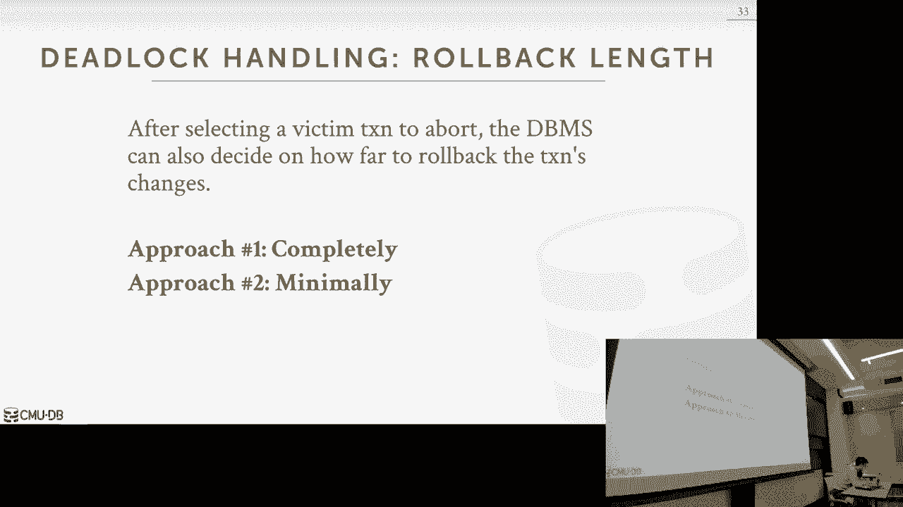
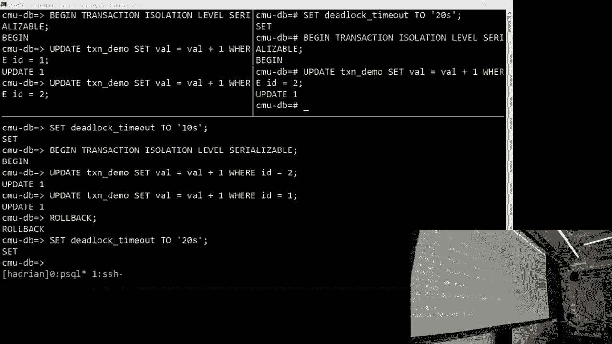

# 17：两阶段锁定并发控制 🔒

在本节课中，我们将要学习一种重要的并发控制协议——两阶段锁定。这是一种悲观的方法，通过锁来协调多个事务对数据的访问，以确保事务的隔离性，从而产生可串行化的调度。

上一节我们介绍了事务的ACID属性，并重点讨论了隔离性，以及如何判断一个调度是否是可串行化的。本节中我们来看看如何在实时运行的数据库系统中实现这种保证。

---

## 锁的基本类型

为了控制并发访问，我们首先需要定义两种基本的锁类型：

*   **共享锁**：用于读操作。允许多个事务同时持有同一个数据对象的共享锁。
*   **排他锁**：用于写操作。一个数据对象在任意时刻只能被一个事务持有排他锁，且持有排他锁时不能再授予任何其他锁。

这两种锁的兼容性可以用一个矩阵来描述：

| 当前持有的锁 | 请求共享锁 | 请求排他锁 |
| :--- | :--- | :--- |
| **共享锁** | ✅ 兼容 | ❌ 冲突 |
| **排他锁** | ❌ 冲突 | ❌ 冲突 |

事务在执行任何读写操作前，都必须向一个中央的**锁管理器**申请相应的锁。锁管理器根据其内部维护的元数据（如谁持有什么锁）来决定是授予锁还是让请求事务等待。

---

## 两阶段锁定协议

仅使用基本的锁机制可能会导致**不可重复读**等异常。为了解决这个问题，我们需要引入一个协议来规范锁的获取和释放时机。

**两阶段锁定** 协议要求每个事务必须分两个阶段处理锁：
1.  **增长阶段**：事务可以不断获取新锁，但不能释放任何锁。
2.  **缩减阶段**：事务可以释放锁，但不能再获取任何新锁。

这个协议保证了所有遵循它的事务调度都是**冲突可串行化**的。然而，它存在一个缺点：**级联中止**。即一个事务的 abort 可能导致读取了它未提交数据的其他事务也必须 abort。

---

## 严格两阶段锁定

为了解决级联中止问题，我们对两阶段锁定进行加强，得到 **严格两阶段锁定**。

严格两阶段锁定规定：事务持有的**所有锁都必须在事务提交（或中止）时才统一释放**。这意味着事务的“缩减阶段”被压缩到了提交那一刻。

以下是严格两阶段锁定的优势：
*   **防止脏读**：其他事务只能读取已提交的数据。
*   **避免级联中止**：一个事务的失败不会影响其他事务。
*   **简化回滚逻辑**：系统只需回滚 abort 的事务本身。

---

## 死锁处理

使用锁的协议（包括两阶段锁定）都可能导致**死锁**，即两个或更多事务相互等待对方释放锁，导致所有事务都无法继续执行。

处理死锁主要有两种策略：

### 死锁检测与恢复
系统周期性地构建一个 **等待图**，其中节点是事务，边表示事务A正在等待事务B持有的锁。如果图中存在环，则检测到死锁。

以下是检测到死锁后的处理步骤：
1.  **选择牺牲者**：系统需要选择一个事务进行中止以打破死锁。选择策略可能基于事务的年龄、已执行的工作量或已持有的锁数量等。
2.  **回滚牺牲者**：中止选中的事务，释放其持有的所有锁，从而让其他事务可以继续执行。

### 死锁预防
另一种思路是设计协议，从根本上防止死锁发生。常见的方法是基于时间戳分配优先级：

*   **等待-死亡**：如果请求锁的事务（T_req）比持有锁的事务（T_hold）更“老”（优先级更高），则 T_req 等待；否则 T_req 自行中止。
*   **伤害-等待**：如果 T_req 比 T_hold 更“老”（优先级更高），则 T_req 可以“伤害” T_hold，导致 T_hold 中止并释放锁；否则 T_req 等待。

这两种协议都通过确保锁请求遵循一个全局的序（如时间戳序）来避免循环等待。

---

## 锁的粒度与意向锁

如果事务需要访问大量数据项（如百万行记录），为每个数据项都申请锁将带来巨大的开销。为此，数据库系统支持**多粒度锁定**，允许在数据库、表、页、行等不同层级上设置锁。

为了高效地实现多粒度锁定，我们引入了 **意向锁**。意向锁是放在较粗粒度对象（如表）上的锁，用以“暗示”后续将在其子节点（如行）上请求特定类型的锁。这允许系统快速判断在粗粒度对象上能否授予锁，而无需检查其所有子节点。

以下是新增的锁类型：
*   **意向共享锁**：表示将在下层节点加共享锁。
*   **意向排他锁**：表示将在下层节点加排他锁。
*   **共享意向排他锁**：表示当前节点已加共享锁，且将在下层节点加排他锁。

通过使用意向锁和锁层级，事务可以根据需要选择最合适的锁粒度，从而减少锁管理器的调用次数，提升系统整体性能。

---

## 总结

本节课中我们一起学习了并发控制的核心协议——两阶段锁定。
*   我们首先了解了基本的共享锁和排他锁。
*   然后，我们学习了两阶段锁定协议，它通过划分锁的增长和缩减阶段来保证冲突可串行化。
*   为了克服级联中止问题，我们引入了严格两阶段锁定，要求锁在事务结束时才释放。
*   接着，我们探讨了锁协议带来的死锁问题，并学习了死锁检测与预防两种应对策略。
*   最后，为了提升效率，我们介绍了多粒度锁定和意向锁的概念，允许系统在更粗的粒度上进行高效的并发控制。

两阶段锁定因其有效性和相对简单的实现，被广泛应用于 PostgreSQL、MySQL、Oracle 等主流数据库系统中。