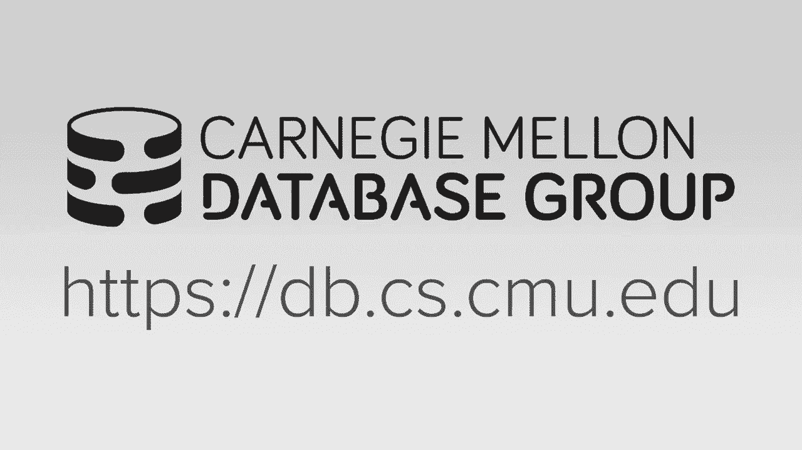
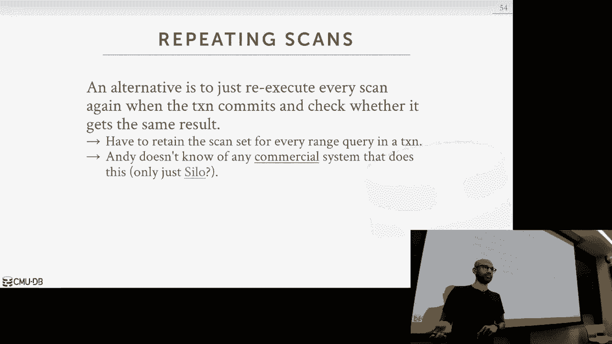

# 18：时间戳排序并发控制 🕒

在本节课中，我们将学习一种不依赖于锁的并发控制协议——时间戳排序。我们将探讨其基本思想、两种主要实现方式（基本时间戳排序和乐观并发控制），并了解如何通过分区技术来优化性能。最后，我们会简要讨论幻读问题及其解决方案。

---

## 概述

上一节我们介绍了基于锁的两阶段锁定协议。本节中，我们将探讨一系列不依赖锁，而是基于时间戳来保证事务可串行化执行的并发控制协议。这些协议通常更为乐观，假设系统中事务冲突较少。

---

## 基本时间戳排序协议

基本时间戳排序协议的核心思想是为每个事务分配一个唯一且单调递增的时间戳。数据库系统通过比较事务时间戳与数据对象上的时间戳，来决定是否允许读写操作，从而在运行时生成可串行化的调度。

### 时间戳的生成

时间戳是一种独特的数值，需要满足两个条件：
1.  **单调递增**：时间戳必须随时间推移而增加。
2.  **唯一性**：任何两个事务不能拥有相同的时间戳。

生成时间戳有几种常见方法，各有优缺点：

以下是几种时间戳生成方法：
*   **系统时钟**：使用当前物理时间。缺点是分布式系统中难以同步，且可能因（如夏令时）导致时间回退。
*   **逻辑计数器**：使用一个CPU内的计数器原子递增。缺点是计数器可能溢出。
*   **混合方法**：结合物理时钟和逻辑计数器，是大多数系统的选择。

### 协议规则

为了使协议工作，每个数据库元组需要维护两个额外的时间戳：
*   **`RT(x)`**：最近成功读取该元组的事务的时间戳。
*   **`WT(x)`**：最近成功写入该元组的事务的时间戳。

设事务 `T_i` 的时间戳为 `TS(T_i)`。

**读操作 `read(x)`**：
事务 `T_i` 请求读取对象 `x`。
1.  如果 `TS(T_i) < WT(x)`，则拒绝读取，并中止 `T_i`，然后以**新的时间戳**重启 `T_i`。
2.  如果 `TS(T_i) >= WT(x)`，则允许读取。将 `RT(x)` 更新为 `max(RT(x), TS(T_i))`。同时，事务必须将 `x` 的值复制到其**私有工作区**，以保证可重复读。

**写操作 `write(x)`**：
事务 `T_i` 请求写入对象 `x`。
1.  如果 `TS(T_i) < RT(x)`，则拒绝写入，并中止且重启 `T_i`。
2.  如果 `TS(T_i) < WT(x)`，则拒绝写入，并中止且重启 `T_i`。
3.  如果以上条件均不满足，则允许写入。将 `WT(x)` 更新为 `TS(T_i)`。同样，写入操作在私有工作区中进行。

### 示例与托马斯写规则

考虑以下场景：一个旧事务试图写入一个已被新事务写入过的对象。根据基本规则，旧事务必须中止。但观察发现，旧事务的写入最终会被新事务的写入覆盖，从外部看，忽略这次写入是安全的。

因此可以引入 **托马斯写规则** 进行优化：
*   当 `TS(T_i) < WT(x)` 时，事务 `T_i` 可以**忽略**此次写操作（即不更新数据库中的 `x` 和 `WT(x)`），仅在其私有工作区中记录，并继续执行。

这个优化允许某些原本会被中止的事务成功提交。

### 优缺点

**优点**：
*   不会产生死锁。
*   在低冲突场景下性能较好。

**缺点**：
*   **可能产生不可恢复的调度**：一个事务可能读取了另一个未提交事务的数据，并在后者中止后提交，导致数据不一致。
*   **开销大**：每个读写操作都需要复制数据到私有工作区。
*   **可能饿死长事务**：短事务频繁更新数据可能导致长事务不断重启。

---

## 乐观并发控制 (OCC) 😊

乐观并发控制协议采取了更乐观的假设：认为事务间冲突很少。它将事务执行分为三个阶段，把冲突检查推迟到事务结束前。

### 三个阶段

1.  **读阶段（工作阶段）**：
    *   事务读取任何数据时，都将数据库中的值及其写时间戳复制到**私有工作区**。
    *   所有的读写操作都在私有工作区中进行，不直接修改数据库。

2.  **验证阶段**：
    *   当事务提交时，进入验证阶段。此时，系统才为该事务分配一个**最终时间戳**。
    *   系统检查该事务的读写集是否与其他**并发执行**且**时间戳更新**的事务的读写集冲突。若无冲突，则通过验证。

3.  **写阶段**：
    *   通过验证后，事务将其私有工作区中的所有更新**原子地**写回全局数据库，并更新相关数据项的写时间戳。

### 验证机制

验证是关键，确保调度的可串行化。主要有两种策略：
*   **向后验证**：检查当前事务是否与所有**更早的**（时间戳更小）并发事务冲突。
*   **向前验证**：检查当前事务是否与所有**更新的**（时间戳更大）并发事务冲突。

系统必须统一采用一种验证方向。

### 优缺点

**优点**：
*   在**低冲突、只读或访问数据集不相交**的工作负载下性能优异，因为避免了锁开销。
*   无死锁。

**缺点**：
*   在**高冲突**工作负载下性能差：事务做了大量工作后可能在验证阶段失败，导致浪费。
*   验证阶段可能成为瓶颈，且需要闩锁来保护读写集的检查过程。
*   仍需要维护私有工作区副本，内存开销大。

---

## 基于分区的时间戳排序

为了进一步减少锁和副本开销，可以将数据库水平分区，并确保每个分区在某一时刻最多只有一个事务在执行。

### 工作原理

1.  数据库被划分为多个逻辑分区（例如，按客户ID范围划分）。
2.  每个分区有一个单独的执行线程和一个事务队列。
3.  事务到达时，根据其访问的数据被路由到特定分区队列，并分配时间戳。
4.  每个分区串行地执行其队列中的事务（按时间戳顺序）。由于单线程执行，**分区内无需任何锁或闩锁**。
5.  如果一个事务需要访问多个分区，它可能需要先获取所有相关分区的锁，这可能导致中止和重试。

### 优缺点

**优点**：
*   对于**单分区事务**，性能极高（裸机速度），无锁无副本开销。
*   通过多个分区实现并行性。

**缺点**：
*   **多分区事务**处理复杂，可能需要中止重试以获取所有锁，性能下降。
*   需要工作负载易于分区，否则可能产生数据倾斜（热分区）。

---

## 幻读问题与隔离级别

我们之前的讨论假设事务只读写现有数据。但当事务可以插入新数据时，会引入**幻读**问题：一个事务两次执行相同的范围查询，由于中间有另一个事务插入了满足条件的新数据，导致两次结果不同。

### 解决方案

以下是解决幻读的几种常见方法：
*   **谓词锁**：直接在查询条件（如 `status = ‘lit’`）上加锁。概念强大但实现复杂昂贵，很少使用。
*   **索引锁**：在相关的索引项上加锁。如果插入的新数据要进入某个索引范围，会因无法获得锁而被阻塞。
*   **间隙锁**：锁住索引记录之间的“间隙”，防止在范围内插入。
*   **表级或页级锁**：通过粗粒度锁（锁住整个表或页）来阻止插入，简单但并发度低。

这些解决方案引出了数据库不同的**隔离级别**概念（如可重复读、可串行化），它们定义了事务在并发执行时可能遇到的各种现象（脏读、不可重复读、幻读）的允许程度。我们将在后续课程中详细讨论。

---

## 总结

本节课我们一起学习了基于时间戳的并发控制协议。
*   我们从**基本时间戳排序**开始，了解了其通过比较时间戳来即时决定操作是否有效的悲观但无死锁的特性。
*   接着，我们探讨了**乐观并发控制**，它通过将冲突检测推迟到事务结束前，在低冲突场景下实现了高性能。
*   然后，我们介绍了**基于分区的时间戳排序**，它通过将数据分区和串行执行，极大地减少了锁和内存复制的开销，尤其适合单分区事务。
*   最后，我们指出了当存在数据插入时产生的**幻读**问题，并简要介绍了通过索引锁、间隙锁等高级锁机制来解决该问题，这为理解事务隔离级别打下了基础。

这些协议各有适用场景，数据库系统会根据不同的工作负载特点选择合适的并发控制策略。