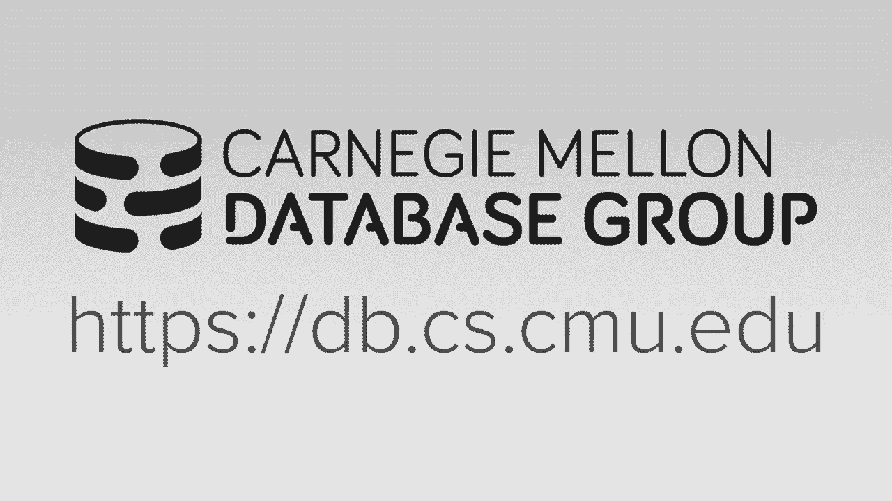

# 19：多版本并发控制 (MVCC) 🧬

在本节课中，我们将学习多版本并发控制（MVCC）的核心概念。MVCC是一种通过维护数据的多个版本来实现高并发访问的数据库技术。它允许读写操作互不阻塞，从而显著提升系统性能，特别是在只读事务较多的场景下。接下来，我们将详细探讨MVCC的工作原理、设计决策及其实现方式。

---

## 概述

多版本并发控制（MVCC）并非一个独立的并发控制协议，而是一种构建数据库系统的方法。它通过为数据项维护多个版本，为每个事务提供一个一致的数据库快照。这种方法使得读者不会阻塞写者，写者也不会阻塞读者，只有在两个事务同时写入同一对象时，才需要依赖传统的并发控制协议（如两阶段锁）来解决冲突。

---

## MVCC的基本思想

上一节我们介绍了MVCC的核心理念。本节中，我们来看看其具体的工作方式。

高层工作方式是，系统为每个到达的事务分配一个时间戳，并为该事务提供数据库在该时间戳下的一致性快照。这意味着事务只能看到在其开始之前已提交的更改，而看不到其他未提交或之后开始的事务的修改。这个快照是逻辑上的，并非物理复制整个数据库。

MVCC对只读事务特别有效。如果SQL方言允许声明事务为只读，数据库系统就无需获取任何锁或维护读写集，因为事务基于其开始时的快照进行操作，这使得只读事务非常高效。

另一个优点是能够支持“时间旅行查询”，即查询数据库在过去某个时间点的状态。然而，由于需要永久保留所有旧版本，这可能导致存储空间迅速耗尽，因此并非所有系统都默认支持此功能。

---

## MVCC运行示例

为了理解MVCC如何管理版本和可见性，我们将通过两个例子来演示。请注意，MVCC独立于底层的并发控制协议，这些例子主要展示版本信息的更新和可见性判断逻辑。

### 示例一：无写冲突

假设数据库表中有一个对象A，其初始版本为`A0`，`start_timestamp=0`，`end_timestamp=INF`。

1.  **事务T1**到达，被分配时间戳`TS=1`。它读取对象A。系统检查发现`TS=1`在`A0`的起止时间戳`[0, INF)`范围内，因此T1读取版本`A0`。
2.  **事务T2**到达，被分配时间戳`TS=2`。它要写入对象A。
    *   系统创建新版本`A1`，其`start_timestamp=2`，`end_timestamp=INF`。
    *   接着，更新旧版本`A0`的`end_timestamp`为`2`。
3.  此时，如果另一个时间戳为`TS=1.5`的事务读取A，由于`1.5`仍在`A0`的`[0, 2)`范围内，它仍会读取`A0`。
4.  事务T2提交后，其状态被更新。

### 示例二：存在写冲突

初始状态同上。

1.  **事务T1**（`TS=1`）读取`A0`，然后要写入A。它创建新版本`A1`（`start_timestamp=1`, `end_timestamp=INF`），并更新`A0`的`end_timestamp=1`。
2.  **事务T2**（`TS=2`）开始，尝试读取A。在可串行化隔离级别下，由于`A1`的创建者T1尚未提交，T2必须读取已提交的版本`A0`（`TS=2`不在`A0`的`[0,1)`范围内？这里需要修正：对于T2，`TS=2`，它需要找到一个版本V，满足`V.start_timestamp <= 2 < V.end_timestamp`。此时`A0`的`end_timestamp`已被T1更新为1，而`A1`的`start_timestamp=1`。因此T2可以读取`A1`吗？这取决于T1是否已提交。如果T1未提交，`A1`对T2不可见，T2可能被阻塞或回滚。这正体现了MVCC与并发控制协议的结合：版本链由MVCC维护，但写-写冲突由底层协议（如锁或时间戳排序）处理）。
3.  假设T1提交。T2现在可以安全地创建新版本`A2`（`start_timestamp=2`），并更新`A1`的`end_timestamp=2`。

这些示例说明了系统如何通过时间戳和版本链来决定数据对事务的可见性。

---

## MVCC的关键设计决策

实现一个MVCC系统需要做出一系列设计决策。以下是四个核心方面：

### 1. 并发控制协议

MVCC本身处理读-写冲突，但写-写冲突仍需底层并发控制协议处理。您需要选择并结合使用如**两阶段锁（2PL）**、**乐观并发控制（OCC）** 或**时间戳排序（T/O）** 等协议，并设定隔离级别。

### 2. 版本存储

版本存储决定了如何物理地保存数据的多个版本。以下是三种主要方法：

*   **仅追加存储**：每次更新都将新版本作为完整的元组追加到主表中。版本通过指针形成链表。
    *   **优点**：实现简单，读取旧版本快。
    *   **缺点**：写操作开销大，需要复制整个元组；主表容易膨胀。
    *   **代码/指针示例**：`tuple_v1.next -> tuple_v2`

*   **时间旅行存储**：主表只保存最新版本。旧版本被移动到单独的“时间旅行表”中。主表元组包含指向时间旅行表中对应旧版本的指针。
    *   **优点**：主表保持紧凑。
    *   **缺点**：查询可能需要访问两个表。

*   **增量存储**：主表保存最新版本。更新时，只将更改的字段（增量）写入“增量存储区”。每个版本通过指针链接到其前一个版本的增量。
    *   **优点**：写操作高效，尤其当只更新少数字段时。
    *   **缺点**：读取旧版本需要“重放”增量以重构数据，开销较大。
    *   **公式/概念**：`Version_N = Apply(Delta_N, Version_{N-1})`

### 3. 垃圾回收

旧版本在不再对任何活动事务可见后，需要被回收以释放空间。主要有两种方法：

*   **元组级垃圾回收**：由后台线程（“真空”进程）定期扫描表，根据所有活动事务的时间戳范围，识别并回收过期的版本。
*   **事务级垃圾回收**：每个事务在提交时，就知道自己修改了哪些数据。系统可以立即回收那些只对该事务可见且事务已提交的旧版本。

### 4. 索引管理

索引必须指向正确的版本（通常是版本链的头部）。这里有两种策略：

*   **物理指针**：索引直接存储元组的物理地址（如页面ID和偏移量）。每次版本链头部更新，**所有相关索引都必须更新**，开销大。
    *   **代码示例**：`INDEX -> (PageID: 123, Offset: 45)`

*   **逻辑指针**：索引存储一个不变的逻辑标识符（如主键或人造的元组ID）。通过一个中间映射层（如主键索引或哈希表）将逻辑ID转换为当前版本的物理地址。
    *   **优点**：版本链头部更新时，只需更新中间映射层，无需更新所有二级索引。
    *   **代码示例**：`SECONDARY_INDEX -> TupleID: 1001` -> `Mapping_Table[1001] -> (PageID: 456, Offset: 78)`

---

## 总结

本节课中，我们一起学习了多版本并发控制（MVCC）。我们了解到MVCC通过维护数据的历史版本，为事务提供一致性快照，从而实现了读写操作的非阻塞并发。要实现MVCC，需要做出几个关键设计决策：选择底层并发控制协议来处理写-写冲突；决定版本数据的物理存储方式（仅追加、时间旅行或增量存储）；设计有效的垃圾回收机制来清理旧版本；以及管理索引以确保其指向正确的数据版本。现代数据库系统根据其目标工作负载，在这些设计点上做出了不同的选择，形成了各自的性能特性。理解这些原理有助于我们更好地使用和调优数据库系统。