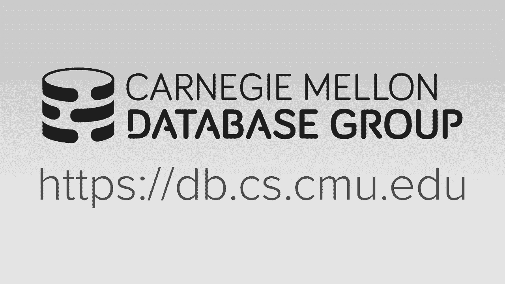
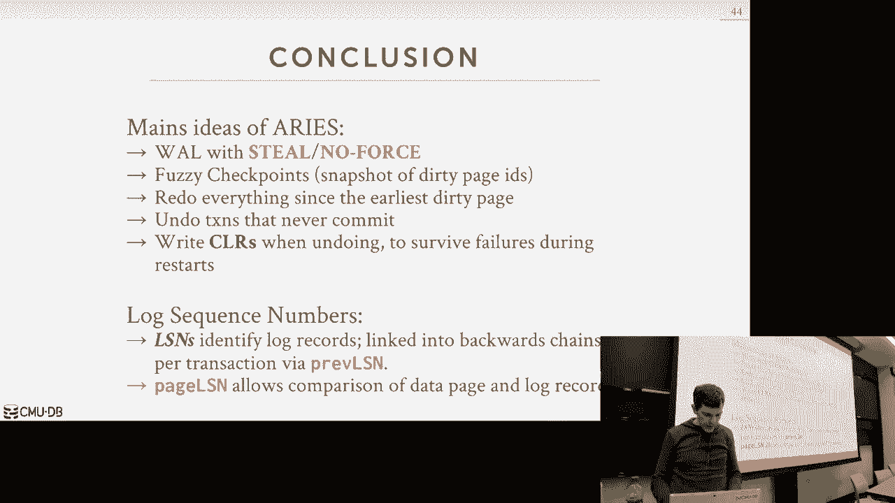
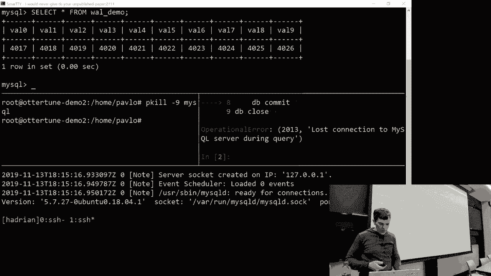
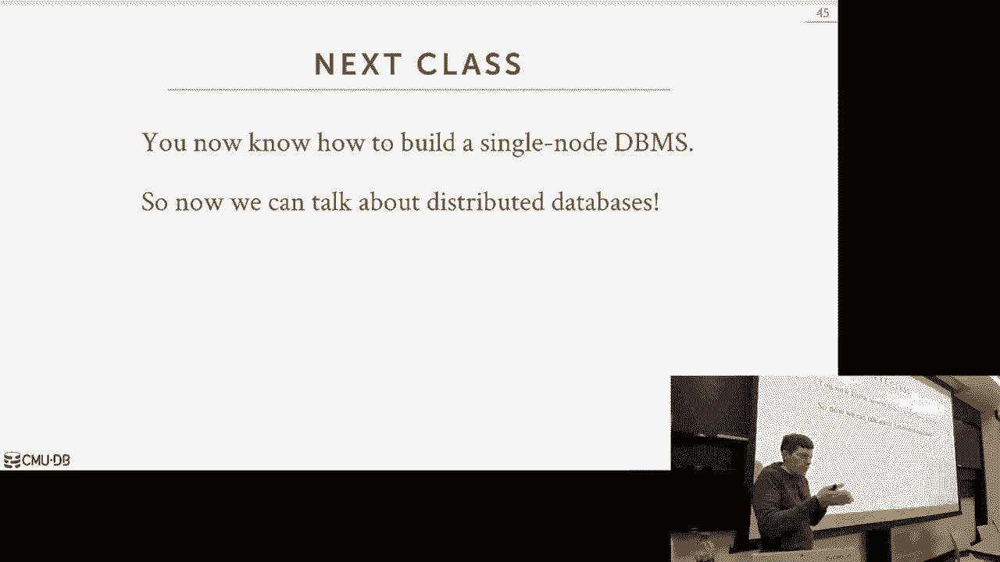

# 21：ARIES数据库恢复算法 🛠️

在本节课中，我们将学习数据库恢复算法的核心部分——ARIES。我们将探讨在系统崩溃后，如何利用日志将数据库恢复到一致状态。课程将涵盖运行时日志记录策略、检查点技术以及详细的三阶段恢复过程。

---

## 运行时操作与日志序列号 📝

上一节我们介绍了恢复的基本概念和写前日志。本节中，我们来看看在常规事务处理过程中，系统需要记录哪些额外信息来支持恢复。

ARIES协议基于IBM开发的技术，是现代数据库恢复的基石。其核心思想是：在事务正常运行时记录足够信息，以便在崩溃后能“重演”和“撤销”历史，从而恢复数据。

为了跟踪日志记录的顺序，系统引入了**日志序列号**。LSN是一个单调递增的计数器，系统在生成每条日志记录时为其分配一个唯一的LSN。

系统各个部分都会使用LSN来追踪数据状态：
*   **FlushLSN**：一个内存计数器，记录已持久化到磁盘的最后一条日志记录的LSN。
*   **PageLSN**：存储在每一数据页中，记录最后一次修改该页的日志记录的LSN。
*   **RecLSN**：存储在每一数据页中，记录自该页上次从磁盘读入后，第一次使其变脏（被修改）的日志记录的LSN。

每个事务也会记录其最后生成的日志记录的LSN（`LastLSN`）。此外，还有一个**主记录**指向日志中最后一个成功完成的检查点的位置。

**关键保证**：在将脏页写回磁盘前，必须确保修改该页的所有日志记录（即LSN小于等于该页`PageLSN`的记录）都已持久化（即其LSN ≤ `FlushLSN`）。这通过写前日志和Steal/No-Force策略实现。

以下是系统各部分LSN的汇总：
| LSN 类型 | 存储位置 | 描述 |
| :--- | :--- | :--- |
| `LogRecord.LSN` | 日志记录中 | 该日志记录的唯一序列号 |
| `PageLSN` | 数据页中 | 最后一次修改此页的日志记录的LSN |
| `RecLSN` | 数据页中 | 此页在内存中首次被修改时的日志记录LSN |
| `FlushLSN` | 内存中 | 已刷新到磁盘的最后一条日志记录的LSN |
| `LastLSN` | 事务元数据中 | 该事务生成的最后一条日志记录的LSN |
| `MasterRecord` | 磁盘固定位置 | 最后一个完整检查点开始位置的LSN |

---

## 事务提交、中止与补偿日志记录 🔄

本节我们来看看事务在正常执行时，提交和中止过程与之前有何不同，并引入一个关键概念——补偿日志记录。

当事务提交时，系统会写入一条`COMMIT`日志记录。**在`COMMIT`记录本身及其之前该事务产生的所有日志记录都持久化到磁盘后**，系统才能通知客户端事务已提交。此后，系统会在内部稍后时间写入一条`TXN-END`记录，表示该事务的所有相关工作（如释放锁）已完成，可以从活跃事务表中移除。

当事务中止时，情况更为复杂。系统需要撤销该事务已做的所有修改。关键点在于：**每一个撤销操作本身也必须被记录到日志中**。这种记录称为**补偿日志记录**。

CLR描述了为撤销某个更新操作所执行的动作。它看起来像一条普通的更新日志记录，但“前像”和“后像”的值是相反的。此外，CLR还包含一个`UndoNxtLSN`字段，指向同一事务中**下一个**需要被撤销的日志记录的LSN，这形成了一个链表，方便按逆序进行撤销。

事务中止的步骤如下：
1.  立即向客户端返回中止结果。
2.  从最后一条日志记录开始，沿`LastLSN`和`PrevLSN`形成的链表逆向扫描。
3.  为每个需要撤销的更新生成一条CLR，并写入日志。
4.  完成所有撤销后，写入该事务的`TXN-END`记录。

**注意**：与提交不同，中止操作无需等待任何日志记录刷新到磁盘就可以响应客户端。CLR会像普通日志记录一样被异步写出。

---

## 模糊检查点 📌

上一节我们提到了检查点的必要性。本节我们介绍一种高性能的检查点技术——模糊检查点，它允许在创建检查点期间事务继续执行。

简单的检查点方案需要停止所有新事务，甚至暂停所有写操作，这会导致系统不可用。模糊检查点解决了这个问题。

模糊检查点过程如下：
1.  在日志中写入一条`CHECKPOINT-BEGIN`记录。
2.  **允许事务继续正常执行和修改数据**。
3.  将当前内存中的**活跃事务表**和**脏页表**的快照写入日志。ATT记录了检查点开始时所有未完成事务的ID、状态及其`LastLSN`。DPT记录了所有脏页的ID及其`RecLSN`。
4.  将缓冲池中所有脏页（包括在检查点过程中新变脏的页）刷新到磁盘。
5.  在日志中写入一条`CHECKPOINT-END`记录，其中包含第3步中记录的ATT和DPT信息。
6.  更新主记录，指向这个`CHECKPOINT-BEGIN`记录的位置。

由于检查点过程中事务仍在运行，此时写入磁盘的数据可能包含未提交事务的修改，因此是不一致的。但通过记录ATT和DPT，恢复算法可以知道在检查点“瞬间”有哪些事务和脏页是活跃的，从而能够从日志中正确重放或撤销后续修改。

---

## 三阶段恢复算法 🔁

现在，我们拥有了崩溃后恢复所需的所有组件。ARIES的恢复过程分为三个顺序阶段：分析、重做和撤销。

### 阶段一：分析

分析阶段的目标是确定崩溃发生时系统的状态：哪些事务未完成，以及哪些数据页可能包含未持久化的更改。

1.  从`MasterRecord`找到最后一个完整检查点的`CHECKPOINT-BEGIN`位置。
2.  从该点开始，正向扫描日志直到末尾。
3.  重建崩溃时的**活跃事务表**和**脏页表**：
    *   遇到`TXN-BEGIN`，将事务加入ATT，状态为`UNDO`。
    *   遇到`COMMIT`，将ATT中对应事务状态改为`COMMIT`。
    *   遇到`TXN-END`，从事务表中移除该事务。
    *   遇到`UPDATE`或`CLR`，如果被修改的页不在DPT中，则将其加入，并设置其`RecLSN`为当前日志记录的LSN。

分析阶段结束后，ATT包含了所有需要处理的事务（状态为`UNDO`），DPT包含了所有在崩溃时可能脏的页。

### 阶段二：重做

重做阶段的目标是重复历史，将数据库恢复到崩溃发生时的物理状态，即使这个状态包含未提交事务的修改。

1.  从DPT中找到最小的`RecLSN`。这是重做扫描的起点。
2.  从该LSN开始，正向扫描日志。
3.  对每一条`UPDATE`或`CLR`记录：
    *   如果其修改的页**不在DPT中**，说明该页的所有修改已持久化，跳过。
    *   如果其修改的页**在DPT中，但当前记录的LSN < 该页的`PageLSN`**，说明这个特定修改已持久化，跳过。
    *   **否则**，重新应用该修改（重做操作），并更新该页的`PageLSN`为当前记录的LSN。
4.  重做所有操作，包括已中止事务产生的CLR。

### 阶段三：撤销

撤销阶段的目标是回滚所有在崩溃时未提交的事务（即ATT中状态为`UNDO`的事务），使数据库达到逻辑一致的状态。

1.  从ATT中找出具有最大`LastLSN`的事务，从其`LastLSN`指向的日志记录开始处理。
2.  按LSN**逆序**处理每个需要撤销的事务：
    *   遇到普通`UPDATE`记录，则执行撤销操作，并生成一条对应的`CLR`写入日志。`CLR`的`UndoNxtLSN`指向该事务中**前一条**需要处理的日志记录的LSN（即`PrevLSN`）。
    *   遇到`CLR`记录，则跳过（因为它是对一个已撤销操作的记录）。
3.  当一个事务的所有操作都被撤销后，为其写入一条`TXN-END`记录，并将其从ATT中移除。
4.  重复步骤1-3，直到ATT为空。

**关键点**：在撤销阶段生成CLR是必须的，这保证了即使在恢复过程中再次发生崩溃，系统也能在下次重启时正确恢复，不会丢失撤销操作的进度。

---

## 总结 📚

本节课我们一起学习了ARIES数据库恢复算法的完整流程。我们首先介绍了**日志序列号**这一核心概念，它用于在整个系统中追踪更改的顺序和持久化状态。接着，我们探讨了事务**提交**和**中止**时的详细步骤，特别是**补偿日志记录**的引入，它确保撤销操作本身也是可恢复的。

然后，我们学习了**模糊检查点**技术，它通过记录活跃事务和脏页的快照，允许在检查点期间系统继续运行，从而大大减少了性能开销。最后，我们深入分析了恢复过程的三个关键阶段：**分析**阶段用于确定崩溃时的系统状态；**重做**阶段通过重复历史将数据库恢复到崩溃前的物理状态；**撤销**阶段则回滚所有未提交的事务，最终达到逻辑一致的状态。

ARIES算法通过写前日志、Steal/No-Force策略、模糊检查点以及严谨的三阶段恢复，为数据库系统提供了强大且高效的容错能力，确保了事务的原子性和持久性。理解这些机制是构建可靠数据库系统的基石。