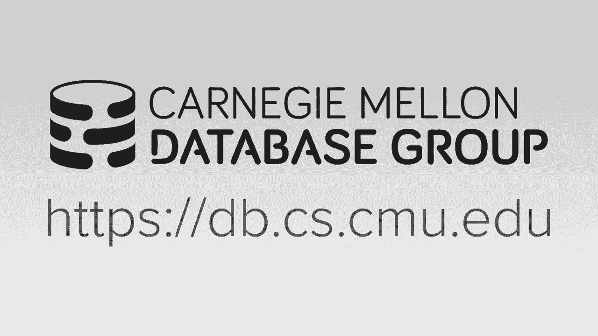
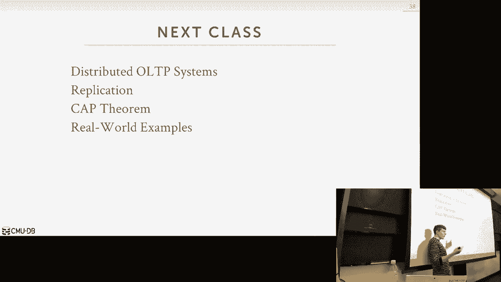

# 22：分布式数据库简介 🚀

在本节课中，我们将要学习分布式数据库系统的基本概念。我们将从理解分布式数据库的架构开始，探讨数据分区的不同方法，并初步了解在分布式环境中进行并发控制的挑战。本节内容为后续深入学习分布式事务和一致性模型打下基础。

## 系统架构概述

上一节我们介绍了单节点数据库的工作原理。本节中我们来看看当数据库扩展到多台机器时，系统架构会发生哪些变化。分布式数据库的架构主要分为三类：共享内存、共享磁盘和共享无。

### 共享内存架构

在共享内存架构中，多个CPU资源运行在不同的机器上，但通过一个高速互连层（如InfiniBand）共享一个统一的内存视图。数据库实例运行在这些CPU上，它们知道彼此的存在，可以通过写入全局数据结构或发送进程间通信消息来协调。然而，这种架构在数据库领域并不常见。

### 共享磁盘架构

共享磁盘架构是当今云环境中的主流架构。计算节点拥有自己的本地内存（可用于缓存），但数据库的持久化状态存储在一个共享的后端存储设备中（如Amazon S3或EBS）。这种架构的优势在于计算资源和存储资源可以独立扩展，因为计算节点是无状态的。但缺点是数据访问的局部性较差，且节点间需要额外的协调机制来通知数据变更。

### 共享无架构

共享无架构是大多数人想到分布式数据库时的模型。每个节点都是一个独立的“孤岛”，拥有自己的本地内存和本地磁盘。节点之间协调的唯一方式是通过顶层的网络消息传递。数据被分区（或分片）存储在不同的节点上。这种架构能提供更好的性能和效率，因为可以充分利用数据的局部性，但扩展容量和确保一致性也最为困难。

## 数据分区

理解了架构之后，我们需要知道如何将数据分布到不同的节点上。这个过程称为分区或分片。

以下是两种主要的分区策略：

*   **垂直分区**：将不同的表存储在不同的节点上。例如，节点1存储表A，节点2存储表B。这种方式简单，但只适用于查询主要访问单一表的情况。
*   **水平分区**：将同一个表按行拆分到不同节点。这是更常见的做法，通常基于一个或多个分区键的值来决定行的归属。

水平分区有两种主要方法：

*   **哈希分区**：对分区键的值进行哈希运算，然后根据哈希值（通常取模分区数）决定数据归属。适用于等值查询，但不适合范围查询。
*   **范围分区**：根据分区键值的连续范围进行分区。例如，ID 1-100在分区1，101-200在分区2。适合范围查询。

### 一致性哈希

当需要动态增加或减少分区数量时，传统的哈希分区需要重新哈希并移动大量数据。一致性哈希技术解决了这个问题。它将哈希空间视为一个环（0到1），节点和数据键都通过哈希映射到环上。数据归属于从该数据键位置沿环顺时针方向找到的第一个节点。

当新增节点D时，只需要将原本属于节点C的部分数据（环上C和D之间的部分）迁移到D，其他数据位置不变。这大大减少了数据迁移量。Memcached、Cassandra和DynamoDB等系统都使用了这项技术。

## 分布式并发控制简介

在单节点数据库中处理事务已经颇具挑战。在分布式环境中，当事务需要跨多个节点更新数据时，保证ACID属性（特别是原子性和一致性）变得异常复杂和昂贵。

我们需要一种机制来协调跨节点的事务提交。这通常通过事务协调器来实现。

### 集中式协调

在集中式方法中，有一个中心化的协调器（如TP监视器）或中间件。所有事务请求都通过它，它维护全局状态（如锁表），负责路由查询，并在提交阶段与所有相关分区通信，确保它们都同意提交后，才向应用返回提交成功。Facebook的MySQL集群就使用了这种中间件方法。

### 去中心化协调

在去中心化方法中，没有单一的协调器。应用可能直接与分区通信。当事务需要提交时，会指定一个主节点（可能是参与事务的节点之一），由该主节点负责与其他节点通信并达成提交共识。

无论采用哪种方式，分布式环境下的死锁检测和解决都更加困难，因为没有一个节点拥有完整的全局等待图视图。

**本节课中我们一起学习了分布式数据库的基本架构（共享内存、共享磁盘、共享无），探讨了数据分区的核心策略（垂直、水平、哈希、范围）以及用于动态扩展的一致性哈希技术。最后，我们初步了解了在分布式环境中进行事务并发控制所面临的巨大挑战，这为下一节课深入探讨分布式事务、复制和CAP定理等内容做好了准备。**