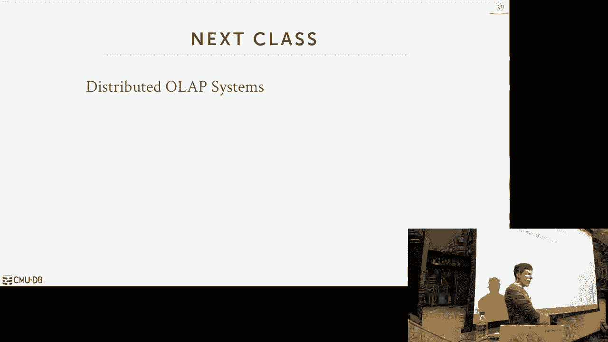

# 23：分布式OLTP数据库

在本节课中，我们将要学习分布式在线事务处理数据库的核心概念。我们将重点探讨如何让多个节点就事务提交达成一致，如何处理数据复制以确保高可用性，以及理解分布式系统中的一致性权衡。

上一节课我们介绍了分布式数据库的基本概念和架构。本节中，我们来看看专门针对OLTP工作负载的分布式数据库所面临的特定挑战和解决方案。

## 原子提交协议

在分布式数据库中，当一个事务涉及多个节点时，我们需要一个机制让所有参与者就“提交”还是“中止”达成一致。这就是原子提交协议的作用。

### 两阶段提交

两阶段提交是最经典的原子提交协议，它分为两个阶段：准备阶段和提交阶段。

以下是两阶段提交的基本流程：

1.  **准备阶段**：协调者向所有参与者发送“准备”消息，询问是否可以提交事务。
2.  **投票阶段**：每个参与者执行本地检查（如写日志），然后回复“同意”或“中止”。
3.  **决策阶段**：如果所有参与者都回复“同意”，协调者进入提交阶段，向所有参与者发送“提交”命令；否则，发送“中止”命令。
4.  **完成阶段**：参与者执行命令（提交或中止）并回复确认。

两阶段提交的关键在于**所有参与者都必须同意**，事务才能提交。只要有一个节点不同意或失效，整个事务就会中止。

### axos协议

Paxos是另一种共识协议，它不要求所有节点同意，而是要求**多数节点**同意即可提交。

Paxos协议的核心思想是：
*   一个提案（例如，提交事务T）需要被大多数接受者接受才能通过。
*   每个提案都有一个唯一的、递增的编号，这确保了即使有多个提案者同时提案，系统也能最终就一个值达成一致。

与两阶段提交相比，Paxos能更好地处理节点故障，因为只要多数节点存活，协议就能继续推进，而不会像两阶段提交那样被单个故障节点阻塞。

## 数据复制

复制是分布式数据库中实现高可用性和容错的关键技术。它通过在多个节点上保存数据副本来确保即使某些节点失效，数据依然可访问。

以下是复制配置的主要模式：

*   **主从复制**：所有写操作都发送到主节点，主节点负责将更改传播到从节点。读操作可以发送到主节点或从节点。当主节点故障时，会进行选举产生新的主节点。
*   **多主复制**：写操作可以发送到任意副本节点。这些节点需要协调解决潜在的写入冲突（例如，对同一数据的并发更新）。

接下来，我们看看数据同步的两种策略：

*   **同步复制**：主节点等待从节点确认已将更改持久化后，才向客户端确认写操作成功。这保证了强一致性，但增加了延迟。
*   **异步复制**：主节点在本地提交更改后立即向客户端确认，随后异步地将更改传播到从节点。这提供了更低延迟，但存在数据丢失的风险（如果主节点在传播前故障）。

## CAP定理

CAP定理是理解分布式系统设计权衡的重要框架。它指出，在一个分布式系统中，一致性、可用性和分区容错性三者不可兼得，最多只能同时满足其中两项。

*   **一致性**：每次读取都能获得最新写入的数据。
*   **可用性**：每个请求都能得到响应（不保证是最新数据）。
*   **分区容错性**：系统在遇到网络分区（节点间无法通信）时仍能继续运行。

以下是常见的取舍：

*   **CP系统**：优先保证一致性和分区容错性。当发生网络分区时，系统可能拒绝请求，牺牲可用性以确保数据一致性。许多传统关系数据库的分布式版本属于此类。
*   **AP系统**：优先保证可用性和分区容错性。即使发生网络分区，系统也继续提供服务，但可能返回过时数据，牺牲强一致性。许多NoSQL数据库属于此类。
*   **CA系统**：优先保证一致性和可用性。这通常意味着系统不能很好地处理网络分区，因此这类系统通常不是严格意义上的分布式系统。

## 联邦数据库

联邦数据库旨在将多个异构的、自治的数据库系统整合成一个逻辑上统一的数据库视图。

其基本架构是：
*   一个中间件层接收用户查询。
*   中间件将查询分解，重写为适合底层不同数据库（如MySQL, MongoDB, Redis）的查询。
*   中间件从各数据库收集结果，进行整合后返回给用户。

然而，联邦数据库的挑战在于其功能受限于所有底层数据库的“最小公分母”，难以实现跨所有数据源的高级功能（如分布式事务）。

本节课中我们一起学习了分布式OLTP数据库的核心机制。我们探讨了如何通过两阶段提交和Paxos协议实现分布式事务的原子性，了解了主从和多主复制策略以提升可用性，并通过CAP定理理解了分布式系统在一致性、可用性和分区容忍性之间的根本权衡。最后，我们简要介绍了联邦数据库的概念。这些知识是理解和设计可靠、高效的分布式事务处理系统的基础。