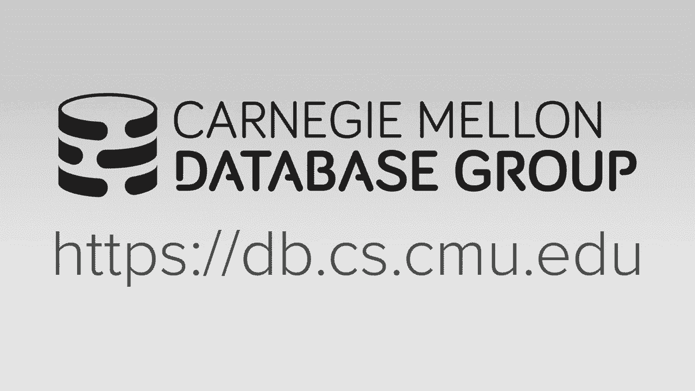
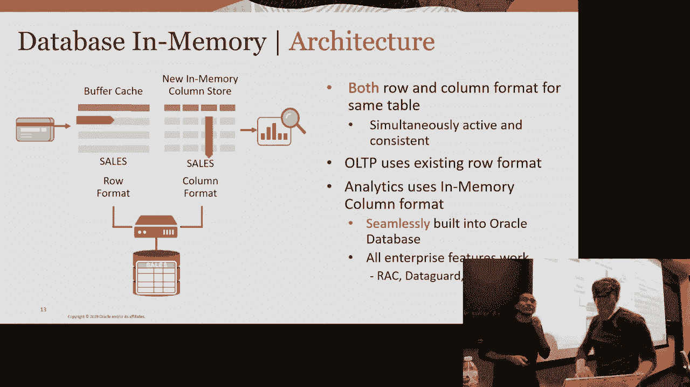
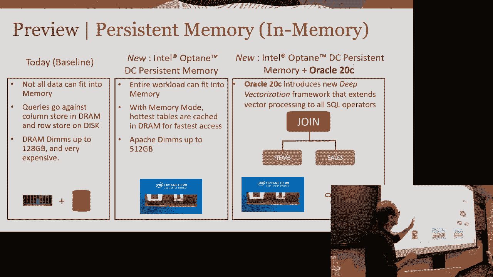
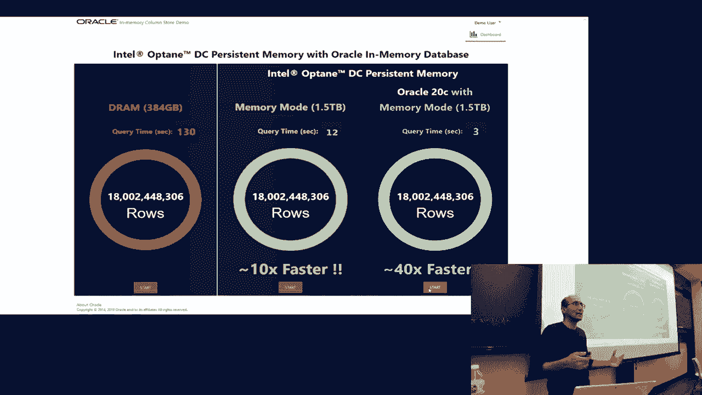
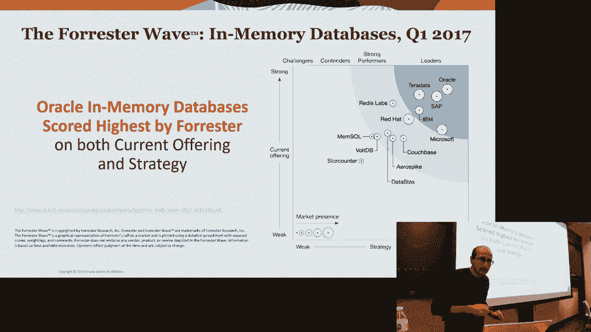

# 25：Oracle内存数据库创新





在本节课中，我们将学习Oracle内存数据库的核心创新。我们将探讨其双格式架构、矢量化分析、存储层扩展、智能自动化以及持久内存等关键技术，了解现代企业级数据库如何应对实时数据处理的需求。

## 双格式架构：支持混合工作负载与更快分析

上一节我们介绍了内存数据库的背景，本节中我们来看看其核心架构。Oracle内存数据库采用双格式架构，同时维护行存储和列存储，以支持混合工作负载。




*   **行存储**：适用于事务处理（OLTP），如通过键快速查找并更新特定行。例如，ATM取款交易需要快速定位并修改特定账户记录。
*   **列存储**：适用于分析查询（OLAP），如扫描全表但只针对少数列进行聚合或筛选。数据以连续内存块按列存储，访问特定列时效率极高。

优化器会根据查询类型自动选择访问路径。对于点查询，使用行存储和传统索引；对于分析查询，则使用列存储。

## 数据存储与压缩

我们了解了架构，现在深入看看数据在列存储中是如何组织和压缩的。数据被组织在内存压缩单元（IMCU）中，每个IMCU包含约50万到100万行数据的所有列。

以下是主要的压缩技术：

*   **字典编码**：识别列中的不同值，排序并分配数字代码，然后用代码替换原始值。例如，值 `[cat, cat, fish, fish, horse]` 可能被编码为 `[0, 0, 1, 1, 2]`。
*   **游程编码**：识别连续重复的代码，并将其替换为（值，重复次数）对。例如，编码流 `[0, 0, 1, 1]` 可压缩为 `[(0,2), (1,2)]`。
*   **前缀编码**：对已排序的字典值，移除相邻符号间的公共前缀，仅存储差异部分，以进一步节省空间。

压缩数据在扫描时无需完全解压，执行引擎可直接在压缩格式上操作，结合SIMD指令提升效率。

## 矢量化分析处理

上一节提到压缩数据可直接处理，本节中我们来看看如何利用现代CPU硬件进行高速矢量化分析。SIMD（单指令多数据）指令集允许在一个CPU周期内对一组数据（如64个值）执行相同操作。

以下是一个谓词求值的矢量化过程示例：
```cpp
// 假设 state 列已字典编码并加载到SIMD寄存器
simd_vector states = load_from_memory(state_column_chunk);
simd_vector california = broadcast_to_vector(“CA”);
// 单条指令完成64次比较
bitmask result = compare_vector_equal(states, california);
```
通过矢量化，扫描、连接、聚合等操作均可大幅提速，实现每秒数十亿行的处理能力。例如，利用布隆过滤器和字典编码，可将等值连接简化为快速的代码匹配操作。

## 存储层扩展：内存+闪存

当数据量超出内存容量时，需要扩展到存储层。Oracle Exadata数据库机将架构分为计算节点和存储节点。

*   **计算节点**：执行复杂的SQL操作（连接、聚合）。
*   **存储节点**：数据持久化存储在SSD，热点数据缓存在闪存中，并以列格式存储。

系统自动实现存储分层：最热数据驻留内存，温数据缓存在闪存，冷数据留在持久存储。查询时，存储节点可利用矢量化技术快速过滤，仅将必要数据传回计算节点。

## 智能自动化与容错

管理内存和列存储内容可能很复杂，因此需要智能自动化。系统通过监控数据访问模式（频率、类型）自动对数据进行冷热分类。

以下是自动化策略：
*   将热数据和频繁用于谓词判断或聚合的列保留在内存中。
*   对很少访问的列进行压缩或移出列存储。
*   动态调整内存分配，平衡行缓存与列存储的需求。

在容错方面，数据在内存压缩单元级别跨集群节点复制。若某个节点故障，查询可自动重定向到拥有数据副本的其他节点，确保高可用性。

## 持久内存的应用

持久内存是一种新型硬件，其容量和价格介于DRAM和闪存之间，断电后数据不丢失。它能为内存数据库带来变革。





*   **内存模式**：将持久内存与DRAM结合，DRAM作为持久内存的高速缓存。最热数据缓存在DRAM以实现最快访问，大部分数据驻留在容量更大的持久内存中。
*   **优势**：允许在“内存”中容纳TB级数据集，避免访问磁盘带来的性能断崖，显著提升处理超大规模数据分析的性能。



## 总结


本节课中我们一起学习了Oracle内存数据库的五项核心创新。我们了解了**双格式架构**如何兼顾事务与分析；看到了**矢量化处理**如何利用硬件实现极致性能；探讨了通过**内存与闪存分层**扩展存储能力；认识了**智能自动化**如何简化管理；最后展望了**持久内存**技术带来的未来潜力。这些技术共同构成了支撑现代实时企业数据处理的基石。