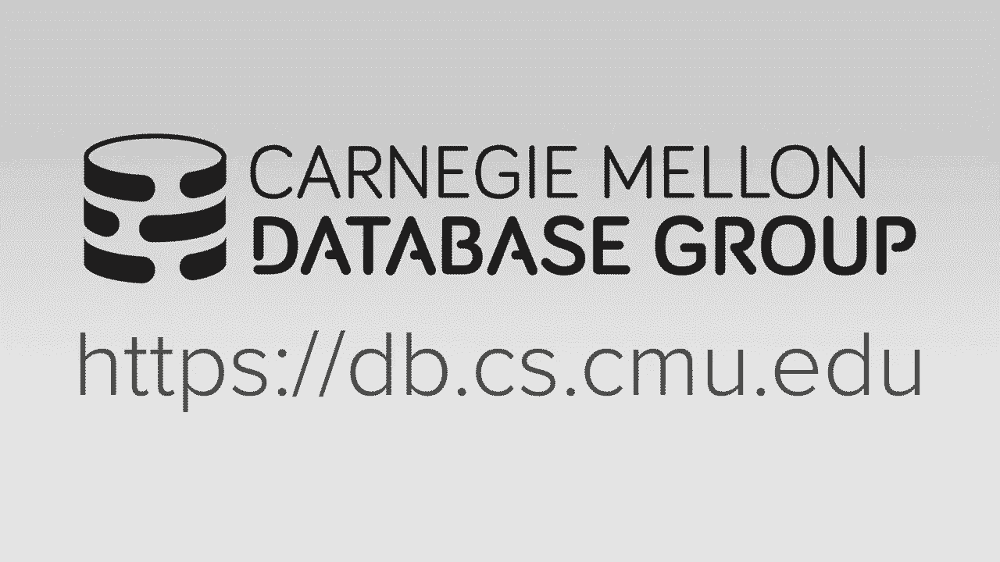
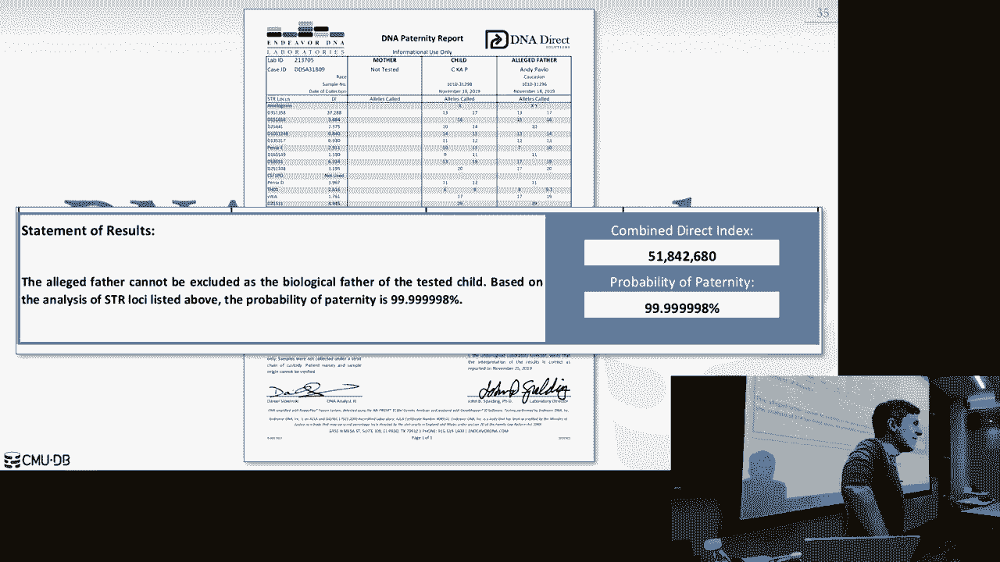

# 26：更多数据库系统杂烩（Facebook Scuba、MongoDB、CockroachDB） 🗄️

在本节课中，我们将学习三个现代数据库系统的核心概念：Facebook Scuba、MongoDB和CockroachDB。我们将了解它们各自的设计目标、系统架构以及它们如何应用我们本学期所学的数据库原理。

## 课程概述与期末安排 📅

在深入探讨新系统之前，我们先回顾一下本课程的期末安排。期末考试定于12月9日（星期一）下午5:30在波斯纳大厅举行。考试内容涵盖整个学期的知识，特别是事务、并发控制、崩溃恢复和分布式数据库等核心主题。考试时允许携带一页手写的双面笔记。

关于最终项目和额外学分，提交截止日期是12月10日。请注意学术诚信，抄袭将导致严重后果。请务必填写课程评估，你们的反馈对改进课程至关重要。

## Facebook Scuba：实时指标分析系统 📊

上一节我们回顾了课程安排，本节中我们来看看第一个系统：Facebook Scuba。Scuba是Facebook内部开发的数据库系统，专为低延迟查询和摄取海量指标数据而设计。

### 核心设计目标
Scuba的核心目标是快速处理从Facebook各种服务生成的性能指标日志。它不运行核心业务应用，而是用于内部调试和性能分析，例如追踪某个函数调用为何变慢。

### 系统架构
Scuba采用**分布式共享无状态架构**，并利用分层存储（内存、闪存、磁盘）。其架构是异构的，包含不同类型的节点。

以下是Scuba数据处理管道的核心组件：
*   **应用服务器**：生成结构化的调试日志（如JSON格式）。
*   **Scribe**：一个类似于Kafka的内部日志聚合工具，负责收集和分类日志。
*   **Tailer服务**：将日志记录批量转换为**列式存储文件**（如Parquet或ORC格式）。
*   **叶节点**：存储列式数据文件，并执行查询中的扫描和基础计算。它们不维护元数据或索引。
*   **聚合器节点**：接收来自“根”的查询计划片段，分发给叶节点，并聚合返回的结果。
*   **根节点**：接收SQL查询（仅支持单表查询，含WHERE过滤和聚合，不支持连接和全局排序），将其分解并协调整个查询过程。

### 容错与数据一致性
Scuba的一个独特之处在于其对数据丢失的容忍度。由于指标数据的价值并非绝对关键，系统允许最终的数据丢失。它通过在不同区域部署多个冗余的Scuba集群来实现容错。查询会同时发送到所有集群，系统通过一个“验证服务”来了解每个集群读取了多少数据，最终选择数据丢失最少、结果最准确的查询结果。

## MongoDB：分布式文档数据库 📄

了解了面向实时分析的Scuba后，我们转向一个更通用的系统：MongoDB。MongoDB是一个开源的分布式文档模型数据库管理系统。

### 文档数据模型
MongoDB的核心是文档数据模型，使用JSON-like的BSON格式存储数据。它与关系模型的区别在于**反规范化**。例如，在关系数据库中，客户、订单、订单项会分三张表存储并通过外键连接；而在MongoDB中，这些信息可以嵌入到一个客户文档中，形成嵌套结构，旨在减少查询时的连接操作。

### 查询与系统演进
MongoDB提供自己的JSON查询API，而非SQL。在查询优化方面，早期版本采用了一种“试错”方法：并行尝试多种查询计划，选择最先返回结果的计划并缓存以供后续相同查询使用。
系统架构属于**无共享架构**，包含查询路由器、配置服务器和分片节点。它早期因支持**自动分片**而受欢迎，但初版存储引擎使用`mmap`，存在全局写锁等问题。后来MongoDB收购了**WiredTiger存储引擎**，这是一个高性能的键值存储引擎，提供了健全的事务、并发控制和崩溃恢复机制，使MongoDB变得稳定可靠。

### 重要特性
MongoDB现在已支持多文档事务和连接操作，但其核心优势仍在于灵活的文档模型和对分布式扩展的支持。

## CockroachDB：分布式SQL数据库 🪳

最后，我们探讨CockroachDB，这是一个受Google Spanner启发、但架构不同的分布式SQL数据库。

### 核心架构
CockroachDB是一个**分布式共享无状态同构系统**。它使用**范围分区**，底层存储引擎是**RocksDB**（一个嵌入式键值存储）。CockroachDB支持PostgreSQL有线协议，这意味着许多为PostgreSQL编写的应用可以相对容易地迁移到CockroachDB。

### 事务与一致性
在事务管理上，CockroachDB默认使用**乐观并发控制** 并提供**可序列化的快照隔离**级别。它使用**Raft共识协议**来跨多台机器协调数据复制和事务提交，确保强一致性。为了在分布式环境下生成全局有序的事务时间戳，它采用了**混合逻辑时钟**，结合物理时钟和逻辑计数器来减少时钟偏差带来的影响。

### 查询路由
与Scuba不同，CockroachDB维护一个分布式的**分区表**，用于跟踪哪个节点是特定数据范围的“领导者”。查询首先查询此元数据，然后将请求路由到正确的领导者节点执行，这提高了查询效率。

## 总结与课程寄语 🎓

本节课中，我们一起学习了三个现代数据库系统：Facebook Scuba、MongoDB和CockroachDB。
*   **Scuba** 展示了为特定场景（实时指标分析）定制设计的重要性，其容忍数据丢失的架构与传统数据库形成鲜明对比。
*   **MongoDB** 的演进说明了工程实践的重要性，从快速原型（使用`mmap`）到构建稳健产品（集成WiredTiger）的路径。
*   **CockroachDB** 体现了将经典数据库理论（事务、并发控制）与分布式系统技术（共识协议、混合时钟）结合，以构建全局分布式SQL数据库的努力。

希望本课程为你提供了理解数据库系统内部运作的基础。无论未来从事何种工作，数据库知识都至关重要。记住，在构建应用时，应避免过早优化，通常从像PostgreSQL或MySQL这样成熟的关系数据库开始是一个好选择，随着业务增长再考虑更复杂的分布式方案。

祝大家在期末考试中取得好成绩！