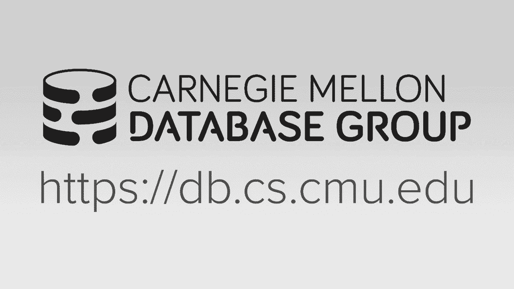
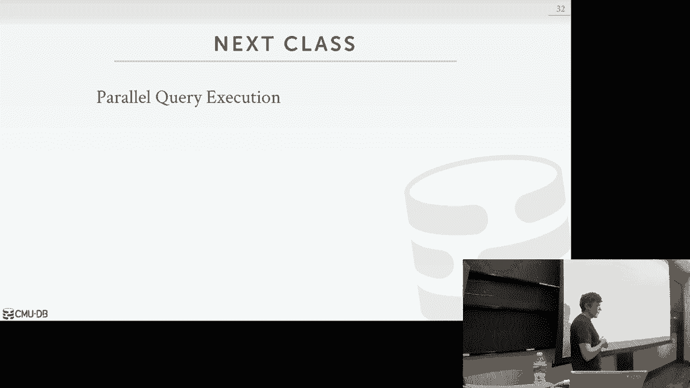

# 数据库系统导论：L12：查询执行 1




## 概述
在本节课中，我们将学习如何将查询计划中的各个操作符组合起来，执行一个端到端的查询并生成最终结果。我们将重点讨论查询处理模型、访问方法以及谓词和表达式的求值。

---

## 处理模型
上一节我们介绍了查询计划中的各个操作符。本节中，我们来看看数据库系统的处理模型，它定义了如何执行查询计划，本质上规定了数据在操作符之间的流动方向与方式。主要有三种主要方法，它们在不同的工作负载和运行环境下有不同的权衡和性能影响。

以下是三种主要的处理模型：

1.  **迭代器模型**：这是最常见的模型，几乎每个数据库系统都使用它。每个操作符都实现一个 `next` 函数，父节点调用子节点的 `next` 函数来获取下一个需要处理的元组。
2.  **物化模型**：这是迭代器模型的一个特化版本，主要用于内存数据库系统。每个操作符一次性输出其所有结果元组。
3.  **向量化模型**：基于迭代器模型，但每次 `next` 调用返回一批元组（向量），而不是单个元组，这对分析型工作负载更有利。

### 迭代器模型详解
迭代器模型有时也被称为火山模型或流水线模型。其核心思想是，每个操作符都维护一个状态，并实现一个 `next` 方法。当父操作符调用子操作符的 `next` 时，子操作符会返回下一个元组。这种方式允许单个元组在查询计划中尽可能向上“流动”，在获取下一个元组之前完成尽可能多的工作。这对于基于磁盘的系统很重要，因为我们可以尽量利用已读入内存的数据。

考虑以下查询计划的伪代码示例：
```sql
SELECT * FROM R JOIN S ON R.id = S.id WHERE S.value > 100
```
对应的操作符 `next` 函数可能如下所示（伪代码）：
```python
# 投影操作符 (根节点)
def next(self):
    for tuple in self.child.next():
        yield self.project(tuple)

# 哈希连接操作符
def next(self):
    if not self.hash_table_built:
        # 构建阶段：从左子节点读取所有元组构建哈希表
        for tuple in self.left_child.next():
            self.build_hash_table(tuple)
        self.hash_table_built = True
    # 探测阶段：从右子节点读取元组进行探测
    for tuple in self.right_child.next():
        if self.probe_hash_table(tuple):
            yield self.join(tuple)

# 扫描操作符 (叶节点)
def next(self):
    for page in self.table.pages:
        for tuple in page.tuples:
            if self.predicate(tuple):  # 例如 S.value > 100
                yield tuple
```
这种模型的优点是易于理解和实现，并且能很好地支持输出控制（如 `LIMIT` 子句）和并行查询。

然而，某些操作符会中断这种流水线，被称为**流水线中断器**。例如，哈希连接在构建阶段必须读取所有左侧元组后才能开始向上传递结果；排序操作符（`ORDER BY`）也需要看到所有元组才能确定全局顺序。这些操作符无法避免。

### 物化模型
在物化模型中，每个操作符不是通过 `next` 函数逐个返回元组，而是通过一个 `output` 函数一次性输出所有结果元组。这对于OLTP（联机事务处理）工作负载非常有效，因为通常只涉及少量记录，避免了频繁函数调用的开销。然而，对于OLAP（联机分析处理）工作负载，如果谓词选择性不高，可能会向上传递大量不需要的数据。

### 向量化模型
向量化模型是迭代器模型的扩展。每次调用 `next` 函数时，返回的是一批元组（一个向量），而不是单个元组。操作符的内部循环（内核）被设计为能高效处理这批数据。这对于现代CPU的SIMD（单指令多数据）指令集非常有利，可以显著提升分析型查询的性能，因为这类查询通常需要扫描大量数据。近年来构建的主要数据仓库系统都采用了向量化模型。

---

## 访问方法
上一节我们讨论了如何组织查询执行流程。本节中，我们来看看查询计划中叶节点的访问方法，即如何从数据库表中实际检索数据。

访问数据主要有两种方式：通过索引进行**索引扫描**，或直接对表进行**顺序扫描**。通常，索引扫描可能更优，但最终的回退方案总是顺序扫描。

### 顺序扫描优化
顺序扫描是当没有合适索引时的默认方法。虽然它受限于磁盘I/O速度，但我们可以通过一些优化来减少不必要的工作：

以下是几种优化顺序扫描的方法：

1.  **预取**：提前将后续可能需要的页面读入缓冲区。
2.  **缓冲区旁路**：为特定查询线程使用单独的缓冲区，避免污染全局缓冲池。
3.  **区域映射**：为每个数据页预计算并存储一些元数据（如某列的最小值、最大值、平均值）。在执行查询时，先检查区域映射，如果确定该页没有符合谓词条件的元组，则直接跳过该页，避免不必要的I/O和元组检查。
4.  **延迟物化**：在列存储数据库中，可以延迟组装完整的元组。操作符间只传递偏移量或记录ID，直到查询计划中确实需要某列数据时，才去读取该列。这减少了早期阶段的数据移动量。
5.  **堆聚类**：如果表上有聚簇索引，数据页的物理顺序与索引键顺序一致，那么顺序扫描可以按照索引顺序高效读取数据。

### 索引扫描
索引扫描的目标是利用索引快速定位所需数据，减少处理无关数据的工作量。选择哪个索引取决于多个因素：查询引用的属性、谓词类型（等值、范围等）、数据的实际分布（选择性）以及索引类型（唯一或非唯一）。

例如，对于查询：
```sql
SELECT * FROM students WHERE age < 30 AND dept = ‘CS‘ AND country = ‘US‘
```
假设在 `age` 和 `dept` 上分别有索引。如果计算机科学系（`dept=‘CS‘`）的学生非常少，那么使用 `dept` 上的索引就更具选择性，效果更好。反之，如果年龄小于30的学生非常少，则使用 `age` 上的索引更好。数据库的查询优化器会基于统计信息来做出这个选择。

### 多索引扫描
如果查询的 `WHERE` 子句包含多个条件，并且有多个相关索引，数据库系统可以执行多索引扫描。它分别从每个索引中获取匹配的记录ID集合，然后根据逻辑操作符（`AND` 或 `OR`）对这些集合进行**交集**或**并集**操作，最后根据合并后的结果去获取实际元组。

例如，对于上面的查询，如果 `age < 30` 和 `dept = ‘CS‘` 都有索引且都很有选择性，系统可以：
1.  使用 `age` 索引找出所有 `age < 30` 的记录ID集合 A。
2.  使用 `dept` 索引找出所有 `dept = ‘CS‘` 的记录ID集合 B。
3.  计算 A 和 B 的**交集** C（因为条件是 `AND`）。
4.  根据 C 中的记录ID去获取元组，并应用剩余的谓词 `country = ‘US‘` 进行过滤。

PostgreSQL 等系统将此称为**位图扫描**，它们使用位图来高效地表示和组合这些记录ID集合。

### 索引扫描与排序
对于非聚簇索引，索引扫描可能引发随机I/O。如果一个查询不需要按索引键排序的结果，系统可以先通过索引扫描收集所有需要的记录ID，然后**按照这些记录ID对应的页面ID进行排序**。这样，在读取实际数据时，对每个页面只需一次I/O，就能处理该页上所有需要的元组，将随机I/O转换为顺序I/O。关系模型的无序性允许我们进行这种优化。

---

## 表达式求值
上一节我们讨论了如何获取数据。本节中，我们来看看如何对查询中的谓词和表达式（如 `WHERE` 子句）进行求值。

我们将 `WHERE` 子句表示为一棵**表达式树**。树的节点代表各种表达式类型：比较操作（=， >）、逻辑连接（AND， OR）、算术运算符、函数调用、属性查找、常量值等。

例如，对于谓词：`R.id = S.id AND S.value > 100`，其表达式树如下：
```
        AND
       /   \
      =     >
     / \   / \
 R.id S.id S.value 100
```
为了对表达式求值，我们需要一些上下文信息：当前正在处理的元组、查询的输入参数（如预编译语句中的占位符值）、以及关系的模式信息。

求值过程从根节点开始，以深度优先的方式遍历树。到达叶节点（如属性、常量、参数）后，获取它们的值，然后将这些值向上传递，在父节点应用相应的操作符（如加法、比较），最终在根节点得到布尔结果（`true` 或 `false`）。

虽然表达式树易于理解和实现，但逐元组遍历树进行求值的开销很大。高性能的数据库系统会采用**即时编译**技术。它们不是解释执行表达式树，而是将整个谓词（甚至整个查询计划）编译成一段高效的、直接的机器代码。这样就去除了遍历树和类型判断的开销，可以像手写代码一样快速执行。

---




## 总结
本节课中，我们一起学习了查询执行的核心组成部分。我们了解到，同一个查询计划在不同的系统环境中可以通过多种方式执行，这取决于它是行存储还是列存储，以及是OLTP还是OLAP工作负载。迭代器模型（自上而下）是最常见的处理模型。在可能的情况下，系统总是倾向于使用索引扫描而非顺序扫描。表达式树为谓词求值提供了清晰的逻辑表示，但在生产系统中，为了追求极致性能，通常会将其编译为高效的本地代码。下一节课，我们将继续探讨查询执行，重点关注如何利用并行性来加速查询处理。