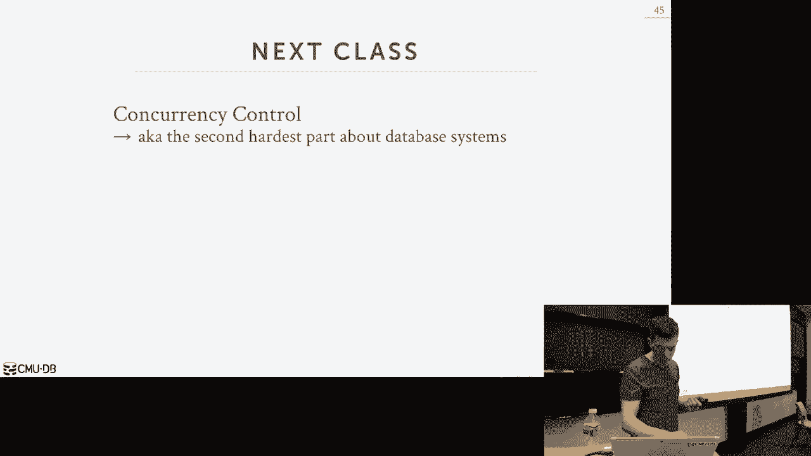
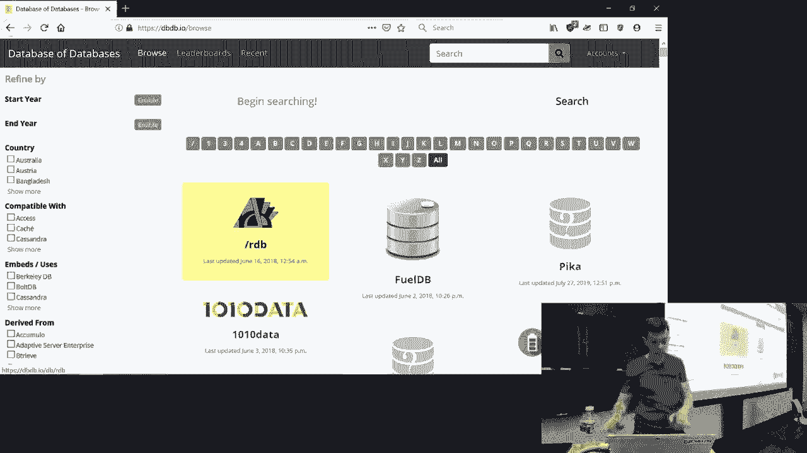

# 数据库系统导论：15：查询规划与优化 2

## 概述
在本节课中，我们将继续深入学习查询优化。上一节我们介绍了基于规则和启发式的查询重写，本节中我们来看看查询优化的第二个核心部分：基于代价的查询规划。我们将学习如何使用代价模型来评估不同查询计划的执行成本，如何高效地枚举和选择最优的查询计划，以及如何处理嵌套查询。

## 代价模型与成本估算
上一节我们介绍了如何在不检查数据的情况下应用规则和启发式来改变查询计划。本节我们将聚焦于更复杂的部分：使用代价模型来评估查询计划在执行前需要完成的工作量。其核心思想是，我们希望能够枚举尽可能多的查询计划，然后选择我们认为最优的一个。代价模型越精确，我们对最优查询计划的选择就越准确。然而，这是一个非常困难的问题，目前仍未完全解决。

### 代价模型的构成
代价模型本质上是一种估算查询执行所需工作量或时间的方法。我们通常希望选择成本最低的计划。成本可以是多种底层硬件指标的组合：
*   **CPU使用量**：在基于内存的系统中很重要，但在基于磁盘的系统中，磁盘通常是主要瓶颈。
*   **磁盘I/O次数**：这是我们主要关注的指标，与连接算法、排序算法等密切相关。
*   **内存使用量**：某些算法可能使用大量内存以获得更快性能，但系统可能没有足够内存。
*   **网络消息数**：在分布式数据库中，机器间通过网络传输数据通常非常昂贵。

通常，我们会以**将要访问的元组数量**作为所有这些指标的代理，用它来估算需要在操作符之间传递的数据量，从而推导出我们认为的最佳计划。

### 数据库统计信息
为了进行估算，数据库系统依赖其内部的**系统目录**来收集关于表的信息。这些统计信息可以通过多种方式更新：
*   手动命令：如 `ANALYZE TABLE`、`UPDATE STATISTICS`、`RUN STATS`。
*   定时任务：系统定期自动更新。
*   查询附带：在执行查询时顺便更新。
*   触发器：当表中一定比例的数据发生变化时触发更新。

一个常见的做法是在OLTP系统的白天交易时段禁用统计更新，在夜间进行全表扫描来更新，因为更新统计信息本身（涉及全表顺序扫描）开销很大。

#### 核心统计信息
对于每个表，我们主要维护两类信息：
1.  **表的元组总数** (`num_tuples`)。
2.  **表中每个属性的不同值数量** (`num_distinct`)。

基于这些信息，我们可以推导出一个新的统计量：**选择基数**。

**选择基数** (`SC`) 定义为：`SC(A, R) = num_tuples(R) / num_distinct(A, R)`
它表示给定属性 (`A`) 上每个不同值平均出现的次数。

这里我们做了一个关键假设：**数据是均匀分布的**。即假设每个不同的值出现的次数相同。现实世界的数据往往是有偏的，但为了简化计算，我们暂时使用这个假设。

### 选择率估算
**选择率** 是指给定表上谓词匹配的元组比例。我们可以根据选择基数来计算不同谓词的选择率。

以下是计算选择率的公式示例（假设数据均匀分布）：
*   **等值谓词（唯一键）**：选择率 = `1 / num_tuples`
*   **等值谓词（非唯一属性）**：选择率 = `SC(A, R) / num_tuples(R) = 1 / num_distinct(A, R)`
*   **范围谓词（如 `age >= 2`）**：选择率 = `(high_key - constant) / (high_key - low_key)`
*   **否定谓词**：选择率 = `1 - selectivity(predicate)`

一个重要的观察是，**选择率估计本质上是一个概率问题**。它表示一个元组匹配给定谓词的概率。基于这个认识，我们可以使用基本的概率论知识来组合更复杂的谓词。

#### 组合谓词的选择率
假设谓词之间是独立的（这是另一个关键假设），我们可以用以下方式组合：
*   **合取（AND）**：`selectivity(p1 AND p2) = selectivity(p1) * selectivity(p2)`
*   **析取（OR）**：`selectivity(p1 OR p2) = sel(p1) + sel(p2) - sel(p1) * sel(p2)`

### 代价估算的挑战与假设
我们目前讨论的方法基于三个可能不成立的简化假设：
1.  **均匀数据假设**：假设所有值均匀分布。
2.  **谓词独立假设**：假设不同谓词之间没有关联。
3.  **连接包含原则**：假设连接时，内表的每个元组都能在外表中找到匹配项。

这些假设会使估算产生误差，尤其是在处理复杂查询时，误差会不断累积。例如，考虑一个查询：`WHERE make = ‘Honda’ AND model = ‘Accord’`。如果假设“品牌”和“型号”独立，估算的选择率会是 `(1/10) * (1/100) = 0.001`。但实际上，这两个属性高度相关（只有本田生产雅阁），真实选择率是 `1/100`。估算值误差达一个数量级。

#### 应对策略
*   **应对数据倾斜**：为高频出现的“热点”值维护单独的直方图或列表，对其他值仍使用均匀假设。
*   **应对属性相关**：高级商业数据库系统支持声明列之间的相关性，优化器可以据此使用特殊的公式。
*   **应对连接包含**：这个问题在基础场景中不那么突出。

## 统计信息的存储：直方图与采样
为了获取属性值的分布信息（如每个值出现的次数），数据库系统内部使用**直方图**。

### 直方图的类型
1.  **等高直方图**：为每个不同的值存储一个计数项。最精确，但如果不同值很多，存储开销巨大。
2.  **等宽直方图**：将值域划分为若干个宽度相等的桶，每个桶存储该桶内所有值的总计数。节省空间，但会引入误差。
3.  **等高直方图**：调整桶的宽度，使得每个桶内值的总计数大致相等。通常能提供比等宽直方图更准确的估计。

### 替代方案：数据采样
另一种方法是直接维护表的一个**样本**（例如，定期随机抽取一部分元组）。当需要估算选择率时，直接在样本上运行谓词，并假设样本的分布代表了全表的分布。一些高端系统（如SQL Server）会结合使用直方图和采样技术。

**采样 vs 直方图**：采样可能更准确，但在优化器枚举计划时需要即时对样本进行扫描，可能比查询直方图更慢。因此，对于简单查询可能用直方图，对于复杂、耗时的查询，花费额外时间进行采样以获取更精确的估算可能是值得的。

## 基于代价的查询规划
在完成基于规则的查询重写后，我们进入基于代价的搜索阶段，目标是将逻辑计划转化为实际的物理执行计划。

### 单表查询规划
对于只涉及单个关系的查询，规划相对简单，核心是选择**访问路径**：
*   **顺序扫描**：总是可用，但通常最慢。
*   **二分查找**：如果存在聚集索引。
*   **索引扫描**：使用一个或多个索引。

此外，还需要考虑**谓词求值顺序**。将选择率更高的谓词放在前面求值，可以尽早过滤掉更多数据。对于OLTP查询，优化器通常使用启发式方法，例如直接选择选择性最强的索引或谓词，而不需要进行复杂的代价搜索。

### 多表连接查询规划
这是查询优化中最困难的部分。难点不仅在于选择连接算法（嵌套循环、哈希连接、排序合并连接），还在于确定**连接的顺序**。对于n个表的连接，可能的连接顺序数量是n的阶乘级别，再加上每种顺序可用的不同连接算法，搜索空间会爆炸式增长。

由于这是一个NP难问题，我们无法进行穷举搜索，必须使用策略来减少搜索空间。

#### 动态规划
System R 开创性地使用**动态规划**来解决这个问题。其核心思想是将问题分解为子问题：
1.  首先，枚举所有可能的第一个连接（两个表的连接），计算每种连接方式（使用不同算法）的代价，并为每对表保留代价最低的方案。
2.  然后，基于上一步的结果，枚举所有可能的第二个连接（将已连接的结果与第三个表连接），同样计算并保留最低代价方案。
3.  如此递归，直到所有表都连接完毕。最后回溯即可得到全局最优（在搜索空间内）的连接顺序和算法。

为了进一步缩减搜索空间，System R 引入了一个关键假设：**只考虑左深连接树**。
*   **左深连接树**：所有连接节点的右孩子都是基表，左孩子是另一个连接节点或基表。这种树形结构有利于流水线执行，避免中间结果的物化。
*   **其他树形**：如右深连接树、浓密连接树，则不被考虑。

现代数据库系统的优化器可能支持更多树形，但动态规划的基本框架仍然被广泛使用。

#### 遗传算法
对于涉及大量表（例如超过12个）的连接，动态规划的搜索空间仍然过大。PostgreSQL 在这种情况下会启用一种称为**遗传查询优化器** 的备选方案：
1.  **初始化**：随机生成一组查询计划（包含连接顺序、算法等）作为“第一代”。
2.  **评估**：计算每个计划的代价。
3.  **选择**：保留代价最低的计划作为当前最优解。
4.  **进化**：淘汰代价高的计划，对保留的计划进行“交叉”和“变异”（随机交换部分连接顺序或算法），产生“下一代”计划。
5.  **迭代**：重复评估和进化过程，直到达到时间限制或连续多代没有改进。
这种方法是一种随机搜索，不能保证找到最优解，但能在可接受的时间内找到一个较好的解。

## 嵌套查询优化
嵌套查询（子查询）需要特殊的处理方式，目标是将它们转化为更高效的连接或其他形式。

### 优化策略
主要有两种优化策略，这些通常可以在查询重写阶段完成，无需进入代价搜索：
1.  **重写为连接**：如果子查询引用了外层查询的列（相关子查询），可以尝试将其重写为连接。例如：
    `SELECT s.name FROM Sailors s WHERE EXISTS (SELECT * FROM Reserves r WHERE r.sid = s.sid AND r.date = ‘2023-10-27’)`
    可以重写为：
    `SELECT s.name FROM Sailors s JOIN Reserves r ON s.sid = r.sid WHERE r.date = ‘2023-10-27’`
2.  **解嵌套/物化**：对于非相关子查询，可以将其单独执行一次，将结果物化（存入临时表或变量），然后供外层查询使用。这避免了对外层查询的每一行都执行一次子查询。

## 总结
本节课我们一起深入学习了基于代价的查询规划与优化。我们首先探讨了如何使用代价模型和统计信息（如选择基数、选择率）来估算查询计划的成本，并指出了其中基于均匀分布、谓词独立等假设带来的挑战。接着，我们了解了数据库如何通过直方图和采样来维护统计信息。然后，我们重点学习了多表连接查询的规划，介绍了使用动态规划算法在左深连接树空间中搜索最优计划的方法，以及PostgreSQL应对复杂连接的遗传算法。最后，我们简要讨论了嵌套查询的优化策略，包括重写为连接和解嵌套。查询优化是数据库系统中极其复杂但至关重要的环节，它使得用户能够以声明式语言提出查询，而系统能自动找到高效的执行方式。