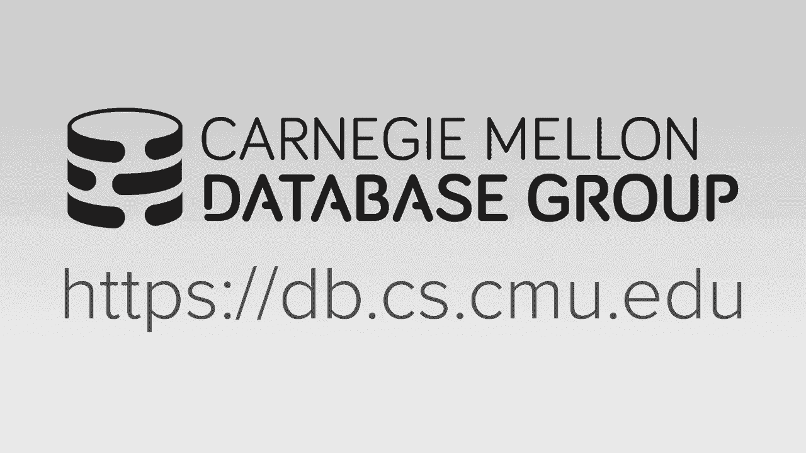
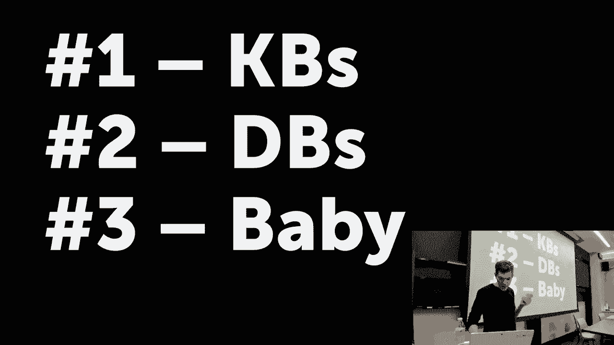
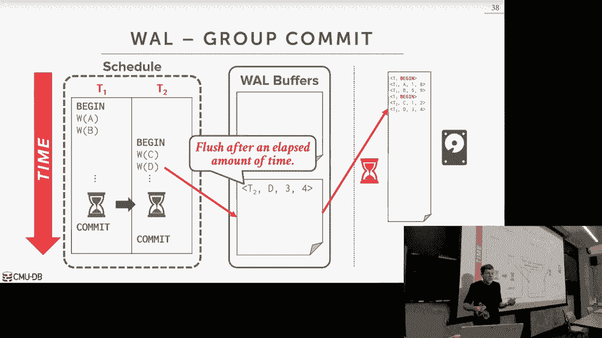

# 数据库系统导论：L20：数据库日志记录方案 📝

在本节课中，我们将学习数据库系统中一个至关重要的概念：日志记录与恢复。我们将探讨为什么需要日志、系统可能面临的各种故障类型，以及如何通过不同的日志记录方案来确保数据的原子性、一致性和持久性。本节课的重点是理解在系统正常运行时需要做什么来为可能的故障恢复做好准备。

---

## 故障类型 🛑

上一节我们概述了日志记录的目的，本节中我们来看看数据库系统可能遇到的故障类型。理解这些故障是设计有效恢复机制的基础。

数据库系统的故障主要分为三类：

*   **事务故障**：指单个事务执行过程中出现的错误。这包括：
    *   **逻辑错误**：例如，事务试图违反数据库的完整性约束（如外键约束）。
    *   **内部状态错误**：例如，在并发控制中因死锁或时间戳冲突而导致事务需要中止。
*   **系统故障**：指导致整个数据库系统停止运行的软硬件问题。
    *   **软件故障**：数据库系统自身的Bug导致崩溃。
    *   **硬件故障**：运行数据库的机器断电或操作系统崩溃。我们假设硬件故障是“可停止的”，即故障不会造成存储介质的物理损坏，系统重启后可以恢复。
*   **存储介质故障**：指磁盘等存储设备发生不可修复的物理损坏（如磁头划伤盘片）。**数据库系统本身的恢复协议无法处理此类故障**，通常需要通过数据冗余（如备份、分布式复制）来应对。

我们的日志恢复协议主要需要处理**事务故障**和**系统故障**。

---

## 缓冲区管理策略：Steal与Force 🔄

在深入日志方案之前，我们需要理解缓冲区管理的两个关键策略，它们决定了脏页（已被修改但未写回磁盘的页）何时可以写回磁盘。

以下是两个核心策略的定义：

*   **Steal策略**：允许将**未提交事务**修改的脏页写回磁盘。
*   **No-Steal策略**：**禁止**将未提交事务修改的脏页写回磁盘。
*   **Force策略**：要求事务在**提交前**，必须将其所有修改的脏页**强制写回**磁盘。
*   **No-Force策略**：**不要求**事务在提交前将脏页写回磁盘。

不同的策略组合在运行时性能和恢复复杂度上各有优劣。我们将分析其中一种组合。

---

### No-Steal / Force 策略分析

这种组合意味着：不允许写出来提交的更改，但提交时必须强制写出所有更改。

**优点**：
*   恢复简单。因为提交后所有数据都已持久化，崩溃后无需重做；未提交的数据从未写入磁盘，也无需撤销。

**缺点**：
*   **事务工作集受内存限制**：如果事务要修改的数据量超过缓冲区容量，则无法运行。
*   **提交延迟高**：提交时需要等待所有脏页写回磁盘，这是一个慢速的I/O操作。
*   **写放大**：如果多个事务修改同一页，该页会被反复写回磁盘，增加I/O负担，影响SSD寿命。

由于其性能限制，现代数据库系统通常不采用这种策略。

---

## 影子分页方案 👥

为了解决No-Steal/Force的一些问题，历史上曾出现过**影子分页**方案。它的核心思想类似于写时复制。

工作原理如下：
1.  维护一个**主页表**，指向当前已提交的所有数据页。
2.  当事务开始时，创建**影子页表**，初始内容复制自主页表。
3.  事务修改数据时，并不直接覆盖原数据页，而是将数据页复制到磁盘的新位置，并在影子页表中更新指向。
4.  事务提交时，只需原子性地更新**数据库根指针**，使其指向影子页表。这个操作通常通过持久化一个包含新根指针的页来实现。
5.  提交后，影子页表变为主页表，旧的主页表及其指向的旧数据页成为可回收的“垃圾”。

**优点**：
*   恢复极快，崩溃后只需读取最后的根指针即可获得一致状态。

**缺点**：
*   提交开销大（需写回多个页表页和根指针）。
*   导致磁盘碎片，需要后台垃圾回收。
*   通常需要批量提交或串行化写事务以实现原子性切换。

由于其局限性，现代主流数据库系统已不再使用纯影子分页。

---

## 预写日志方案（Write-Ahead Logging, WAL）🚀

上一节我们看到了影子分页的不足，本节中我们来看看目前数据库系统事实上的标准方案：**预写日志**。WAL是Steal/No-Force策略的典范，在运行时性能和恢复能力之间取得了最佳平衡。

### 核心原则

WAL的核心原则非常简单却至关重要：
> **任何数据页在写回磁盘之前，其对应的所有日志记录必须已经持久化在日志中。**

这意味着，日志的写入顺序优先于实际数据的写入。

### 如何工作

1.  **日志记录**：事务对数据所做的每一个修改，都会先被转化为一条**日志记录**，并追加到内存中的**日志缓冲区**。一条基本的日志记录包含：**事务ID**、**修改的对象ID**、**旧值（用于UNDO）**、**新值（用于REDO）**。
2.  **修改数据**：日志记录存入缓冲区后，事务才被允许在缓冲区中修改实际的数据页。
3.  **提交事务**：事务提交时，系统会生成一条`COMMIT`日志记录并放入日志缓冲区。**在通知应用程序提交成功之前，系统必须确保该事务产生的所有日志记录（包括`COMMIT`记录）都已持久化到磁盘的日志文件中。** 此时，数据页本身可以仍然留在内存中。
4.  **刷脏页**：脏页由缓冲区管理器在后台择机写回磁盘，不受事务提交的即时约束。

### 优势

*   **高效的提交**：提交只需等待一次顺序的日志文件追加写（`fsync`），远比随机写回多个数据页快。
*   **支持大事务**：事务工作集可以远超内存容量，因为未提交的脏页可以被“偷”（Steal）出缓冲区以腾出空间，只要其日志已持久化即可。
*   **组提交优化**：可以将多个事务的日志一次性刷盘，分摊`fsync`的开销，极大提升吞吐量。

### 日志记录的类型

*   **物理日志**：记录数据页上具体字节的变化。恢复精确，但日志量大。
*   **逻辑日志**：记录高级操作（如SQL语句）。日志量小，但恢复时可能需要重新执行整个操作，且UNDO复杂。
*   **生理日志（Physiological Logging）**：**大多数系统采用**。它是物理和逻辑的折衷，记录类似“在页面P的槽位S更新元组T为以下新值”的信息。它提供了足够的灵活性，且恢复效率较高。

---

## 检查点机制 ⏱️

如果日志无限增长，恢复时将需要重放整个日志历史，耗时极长。**检查点**机制用于截断日志，限制恢复时需要回看的日志范围。

一个简单的**一致性检查点**过程如下：
1.  暂停所有新事务的开始。
2.  等待所有当前活跃事务完成。
3.  将当前所有脏页（包括已提交和未提交事务的）强制写回磁盘。
4.  在日志中写入一条`CHECKPOINT`记录。
5.  恢复事务处理。

**检查点的作用**：系统崩溃后恢复时，只需从最近一个检查点开始扫描日志，而不需要处理检查点之前的日志。因为检查点保证了在那一刻，所有已提交事务的修改都已持久化在数据页中。

**检查点的频率**需要在恢复时间（检查点越频繁，恢复越快）和运行时性能（做检查点会消耗I/O资源）之间进行权衡。一种常见的策略是基于日志大小触发检查点。

---

## 总结 📚

本节课我们一起学习了数据库日志记录与恢复的基础知识。

*   我们首先了解了数据库系统可能面临的**故障类型**，明确了恢复协议需要处理的范围。
*   接着，我们探讨了缓冲区管理的**Steal/No-Steal**和**Force/No-Force**策略，这些策略决定了数据持久化的时机。
*   然后，我们分析了**影子分页**这一历史方案，理解了其原理和优缺点。
*   之后，我们深入学习了现代数据库系统的核心方案——**预写日志**。我们掌握了其“日志先行”的核心原则、工作流程以及带来的性能优势。
*   最后，我们介绍了**检查点**机制，它通过定期将脏页刷盘并记录日志位置，来限制恢复范围并提升恢复速度。

预写日志方案通过`UNDO`（撤销未提交事务）和`REDO`（重做已提交事务）这两个基本操作，并结合检查点，共同确保了数据库的原子性和持久性。在下节课中，我们将学习在系统崩溃后，如何利用WAL日志和检查点信息来执行具体的恢复算法。