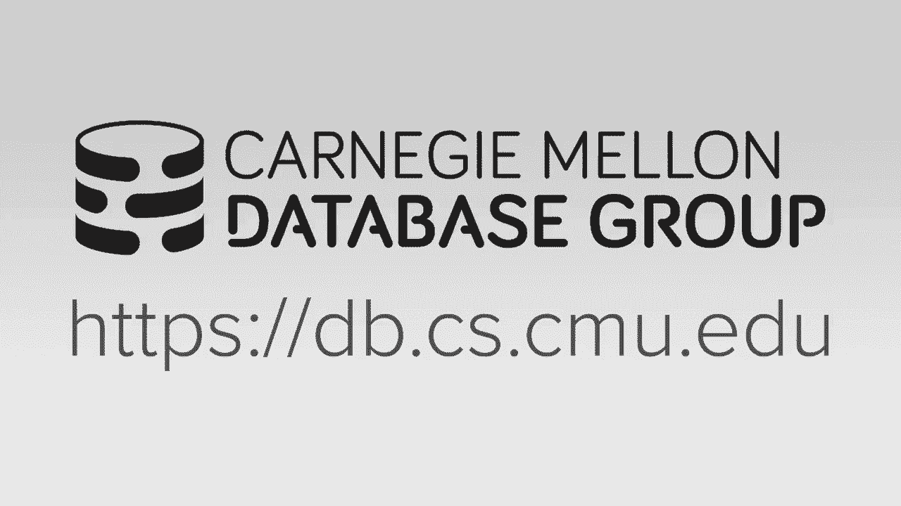

# 数据库系统导论：L24：分布式OLAP数据库 🚀

在本节课中，我们将要学习分布式在线分析处理（OLAP）数据库的核心概念。我们将探讨其架构、执行模型、查询规划，以及如何高效地执行分布式连接。课程内容将帮助初学者理解在分析型工作负载下，如何管理和处理大规模分布式数据。

---

## 概述 📋

上一节我们介绍了分布式数据库的事务处理（OLTP），重点在于保证ACID属性。本节中，我们将离开事务处理的世界，转向分析处理（OLAP）。在OLAP中，我们主要执行只读查询，但处理的数据量通常非常庞大，远超单机处理能力。我们将学习如何在这种环境下高效地组织数据、规划查询和执行连接。

---

## 典型架构与数据建模 🏗️

一个典型的分析系统架构包含前端OLTP数据库和后端分析数据库（数据仓库）。数据通过ETL（提取、转换、加载）过程从前端流入后端，并在后端进行清理和整合，形成统一的模式。

在数据仓库中，有两种常见的数据建模方法：星型模式和雪花模式。

以下是两种模式的核心区别：

*   **星型模式**：包含一个中心**事实表**和多个一级**维度表**。事实表存储核心业务事件（如销售记录），维度表存储描述性属性（如产品信息）。这种模式连接简单，查询性能通常更好，但可能导致数据冗余。
*   **雪花模式**：是星型模式的规范化扩展。维度表可以进一步连接到其他**查找表**。这减少了数据冗余，保证了更好的数据完整性，但增加了查询的复杂性，因为需要更多的连接操作。

选择哪种模式需要在查询性能和数据管理复杂度之间进行权衡。

---

## 分布式查询执行模型 ⚙️

在分布式环境中执行查询，核心问题在于决定将计算推向数据，还是将数据拉向计算。

上一节我们讨论了分布式事务的协调问题。本节中，我们来看看在只读的分析查询场景下，如何执行查询。主要策略如下：

*   **推送查询**：将查询计划片段发送到存储数据的节点，在本地进行过滤和计算，然后只将结果返回。这在**无共享**架构中很常见，能最大限度地减少网络传输数据量。
*   **拉取数据**：协调节点从存储节点获取所需的数据页，在本地进行计算。这在**共享磁盘**架构中更常见，但现代云存储（如Amazon S3）也开始支持谓词下推，模糊了界限。

对于长时间运行的OLAP查询，节点故障是一个需要考虑的问题。大多数传统分布式OLAP系统**不支持查询容错**。如果节点在查询中途崩溃，查询通常会失败并需要重启。这是因为为中间结果创建检查点的开销很大。而像Google这样运行在廉价硬件上的系统，则更倾向于实现容错机制。

---

## 分布式查询规划 🗺️

分布式查询规划比单机规划更加复杂。优化器不仅需要考虑连接顺序、谓词下推等，还必须考虑数据的物理位置、网络传输成本以及节点间的计算负载。

生成执行计划后，有两种方式将其分发到各节点：

1.  **发送物理计划片段**：主节点生成全局物理查询计划，将其切分成片段发送到对应节点执行。这是大多数系统的做法。
2.  **发送重写的SQL查询**：主节点将原始SQL查询根据数据分区进行重写，然后将子查询发送到各节点。各节点拥有自己的优化器，可以基于本地数据统计信息生成最优的本地执行计划。MemSQL等系统采用类似方法。

---

## 分布式连接算法 🔗

连接是分析查询中最昂贵、最常见的操作。分布式连接算法本身与单机算法（如哈希连接、排序合并连接）并无不同，核心挑战在于**如何高效地将需要连接的数据汇集到同一节点**。

以下是四种常见的场景及处理策略：

*   **场景一：最佳情况**
    *   **描述**：一张表在连接键上分区，另一张表**完全复制**到所有节点。
    *   **策略**：每个节点可独立进行本地连接，无需跨节点协调。最后合并结果即可。
    *   **公式**：`本地连接(分区数据, 全量复制数据) -> 合并结果`

*   **场景二：次佳情况**
    *   **描述**：两个表都在相同的连接键上，并且按**相同范围**分区。
    *   **策略**：具有相同键范围的分区可以直接进行本地连接（如分区1的数据只与分区1的数据连接）。这被称为**分区连接**。
    *   **代码逻辑**：`for each partition i: 本地连接(Partition_R[i], Partition_S[i])`

*   **场景三：广播连接**
    *   **描述**：一张表未在连接键上分区，且该表**尺寸较小**。
    *   **策略**：将小表**广播**到所有拥有大表分区的节点，然后在每个节点上进行本地连接。
    *   **公式**：`广播(小表) -> 各节点本地连接(本地大表分区, 小表副本)`

*   **场景四：最坏情况 - 重分区连接**
    *   **描述**：两个大表都未在连接键上分区，或分区方式不匹配。
    *   **策略**：必须根据连接键对两个表的数据进行**重分区**（洗牌），使具有相同键的数据落到同一节点，然后再进行本地连接。这是开销最大的方式。
    *   **代码逻辑**：`重分区(R, join_key) -> 重分区(S, join_key) -> 本地连接(新分区_R, 新分区_S)`

为了最小化网络传输，优化器会尝试使用**半连接**等技术，即只传输判断连接是否存在所需的最小信息（如连接键本身），而非整个元组。

---

## 云数据库现状 ☁️

云数据库正在改变分布式系统的构建方式。它们主要分为两类：

*   **托管数据库**：将现有的数据库系统（如MySQL, PostgreSQL）运行在云虚拟机上，由云提供商负责运维。用户无需管理底层硬件。
*   **云原生数据库**：专为云环境设计，深度集成云服务（如对象存储S3）。它们通常是共享磁盘架构，计算层与存储层分离。**无服务器数据库**是云原生数据库的一种演进，其计算资源可以按需伸缩，在空闲时甚至可以降为零，从而优化成本。

此外，为了实现不同系统间的数据共享，出现了开放的**列式存储格式**，如 **Parquet**、**ORC**、**Arrow**。这些格式不绑定于任何特定数据库，提高了云上数据生态的互操作性。

---

## 总结 🎯

本节课中我们一起学习了分布式OLAP数据库的关键知识。我们了解了用于分析的星型与雪花数据模型，探讨了在分布式环境下推送查询与拉取数据的执行策略，并认识到查询容错在OLAP中并非默认提供。我们深入研究了分布式查询规划的复杂性，以及针对不同数据分布情况下的四种连接策略：本地复制连接、分区连接、广播连接和重分区连接。最后，我们概述了云数据库（托管与云原生）的现状及开放数据格式的重要性。掌握这些概念，有助于理解如何在大规模数据分析场景下，有效利用分布式数据库系统。