# 数据库系统导论：P2：L2- 高级SQL 📚


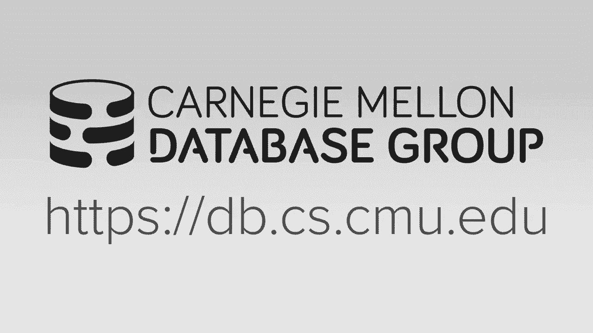


在本节课中，我们将要学习高级SQL的概念和操作。我们将超越基础的SQL知识，探讨更复杂和有趣的功能，包括聚合、分组、字符串与日期处理、输出控制、嵌套查询、公共表表达式以及窗口函数。这些知识对于高效地操作和分析数据库至关重要。

---

## 聚合与分组 📊

上一节我们介绍了SQL的基本概念，本节中我们来看看如何使用聚合函数和分组来汇总数据。聚合函数可以对一组行进行计算并返回单个值。

以下是SQL-92标准中定义的聚合函数：
*   **AVG()**：计算平均值。
*   **MIN()**：找出最小值。
*   **MAX()**：找出最大值。
*   **SUM()**：计算总和。
*   **COUNT()**：计算行数。

例如，要计算登录名以“@cs”结尾的学生数量，可以使用以下查询：
```sql
SELECT COUNT(login) FROM student WHERE login LIKE '%@cs';
```
由于我们只是计数，`COUNT(login)` 可以简化为 `COUNT(*)` 甚至 `COUNT(1)`，它们语义相同。

我们可以组合多个聚合函数。例如，同时获取学生数量和平均GPA：
```sql
SELECT COUNT(*), AVG(gpa) FROM student WHERE login LIKE '%@cs';
```
使用 `DISTINCT` 关键字可以只计算唯一值：
```sql
SELECT COUNT(DISTINCT login) FROM student WHERE login LIKE '%@cs';
```

当我们想要查看聚合结果的详细信息时，需要使用 `GROUP BY` 子句。例如，计算每门课程的平均学生GPA：
```sql
SELECT AVG(s.gpa), e.cid FROM enrolled AS e, student AS s WHERE e.sid = s.sid GROUP BY e.cid;
```
**重要规则**：`SELECT` 输出列表中任何非聚合的列，都必须出现在 `GROUP BY` 子句中。

如果我们想对聚合结果进行过滤，不能使用 `WHERE` 子句，因为聚合计算在过滤之后。此时应使用 `HAVING` 子句。例如，只显示平均GPA大于3.9的课程：
```sql
SELECT AVG(s.gpa) AS avg_gpa, e.cid FROM enrolled AS e, student AS s WHERE e.sid = s.sid GROUP BY e.cid HAVING avg_gpa > 3.9;
```

---

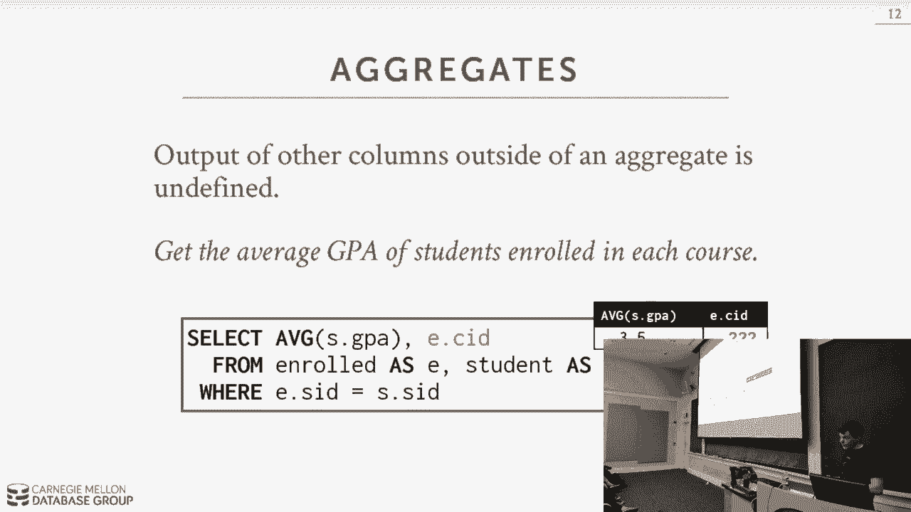

## 字符串与日期/时间操作 ⏳

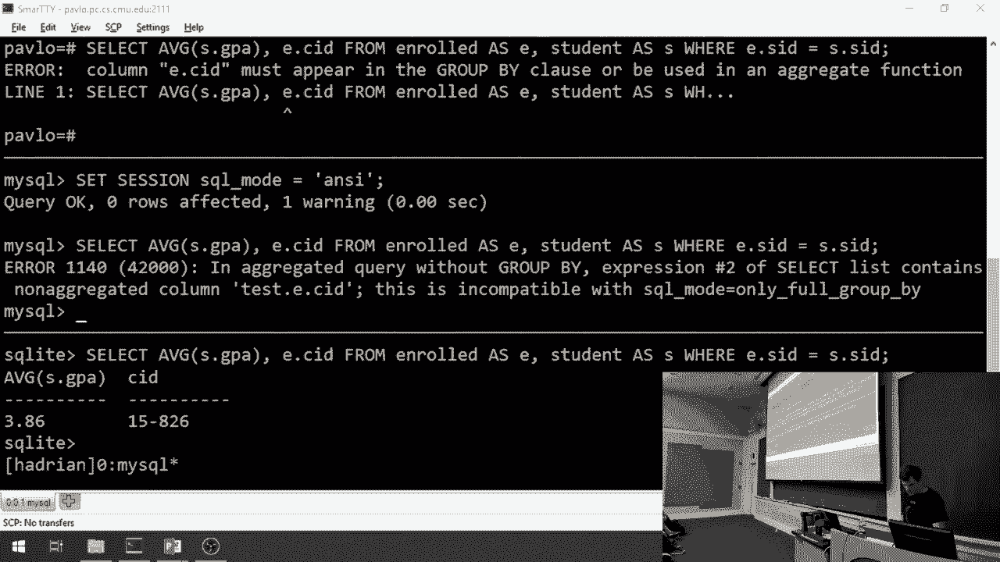

本节我们将探讨如何处理字符串和日期时间数据。不同数据库系统在这些操作上的实现差异较大。

SQL标准规定字符串使用单引号，并且是大小写敏感的。`LIKE` 操作符用于模式匹配：
*   `%` 匹配任意长度的任意字符序列。
*   `_` 匹配单个任意字符。

例如，查找课程ID以“15-445”开头的记录：
```sql
SELECT * FROM enrolled WHERE cid LIKE '15-445-%';
```
查找登录名以“@cs”结尾，且前面只有一个字符的学生：
```sql
SELECT * FROM student WHERE login LIKE '%@c_';
```

字符串函数（如 `SUBSTRING`, `UPPER`, `LOWER`）可以出现在查询的多个位置。例如，获取学生姓名的前五个字符：
```sql
SELECT SUBSTRING(name, 1, 5) AS abbrv_name FROM student WHERE uid = 123;
```
使用 `UPPER` 函数进行不区分大小写的匹配：
```sql
SELECT * FROM student WHERE UPPER(name) LIKE 'KAN%';
```

字符串拼接在不同数据库中有不同语法：
*   **SQL标准**：使用双竖线 `||`。`SELECT name || ‘!!!’ FROM student;`
*   **MySQL**：使用 `CONCAT` 函数。`SELECT CONCAT(name, ‘!!!’) FROM student;`

日期和时间操作更为复杂。一个简单的任务——计算从年初到今天的天数——在不同数据库中的写法截然不同：
*   **PostgreSQL**：`SELECT DATE('2018-08-30') - DATE('2018-01-01') AS days;`
*   **MySQL**：`SELECT DATEDIFF('2018-08-30', '2018-01-01') AS days;`
*   **SQLite**：`SELECT julianday('now') - julianday('2018-01-01') AS days;`

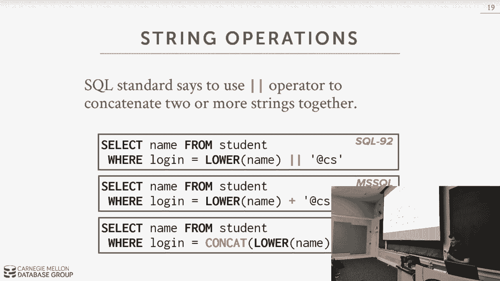

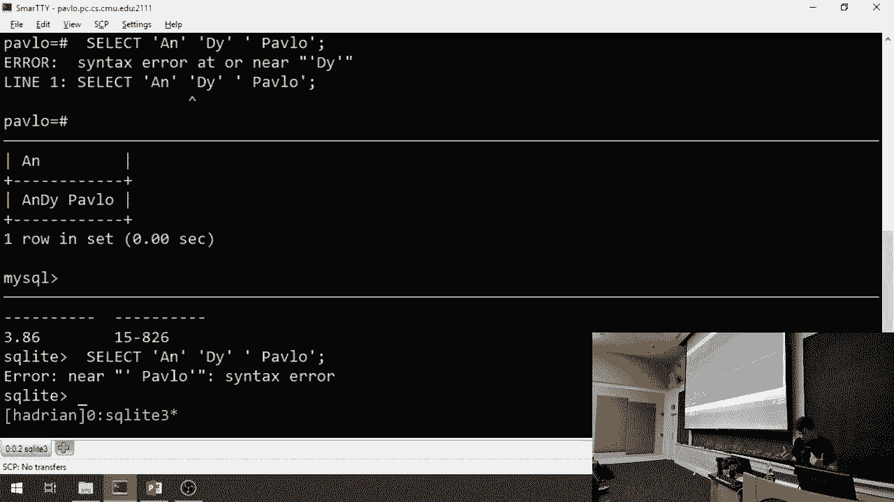

---

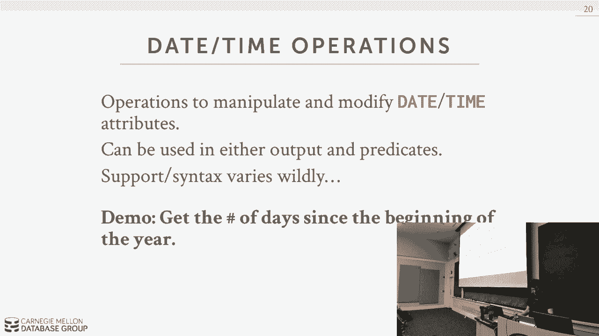

## 输出控制与重定向 📤

现在，我们来看看如何控制查询结果的输出。默认情况下，SQL基于“包”代数，结果是无序的。使用 `ORDER BY` 可以对结果进行排序。

例如，按成绩降序排列选课记录：
```sql
SELECT sid, grade FROM enrolled WHERE cid = '15-721' ORDER BY grade DESC;
```
可以按多个列排序。例如，先按成绩降序，再按学生ID升序：
```sql
SELECT sid, grade FROM enrolled WHERE cid = '15-721' ORDER BY grade DESC, sid ASC;
```
`ORDER BY` 中的列不必出现在 `SELECT` 输出列表中。

使用 `LIMIT` 和 `OFFSET` 可以限制返回的行数并实现分页。例如，获取成绩最高的前10条记录：
```sql
SELECT sid, name FROM student ORDER BY gpa DESC LIMIT 10;
```
跳过前10条，获取接下来的10条：
```sql
SELECT sid, name FROM student ORDER BY gpa DESC LIMIT 10 OFFSET 10;
```

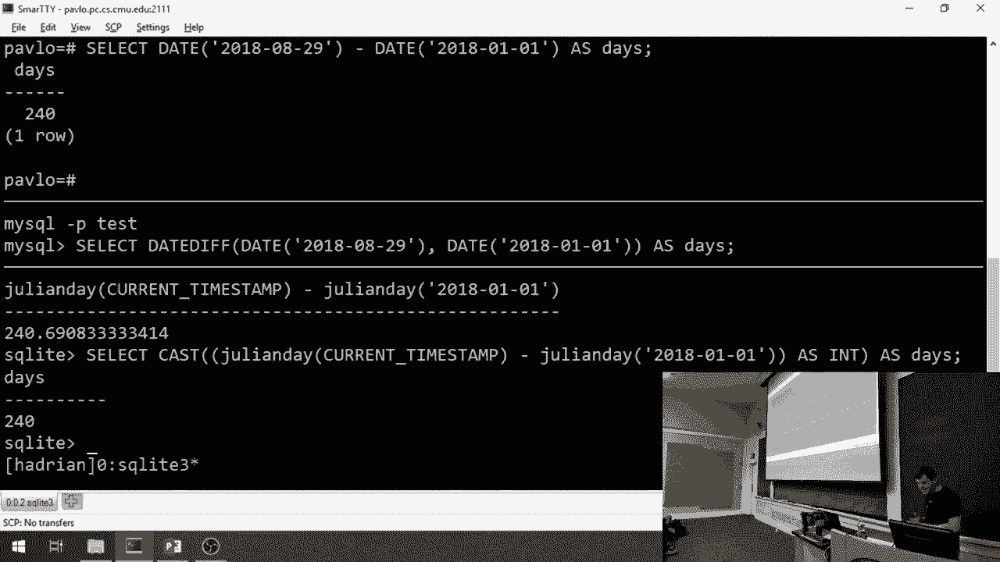

我们可以将查询结果重定向到一个新表或已存在的表中。使用 `INTO` 创建新表：
```sql
SELECT DISTINCT cid INTO CourseIds FROM enrolled;
```
使用 `INSERT INTO ... SELECT` 插入到已存在的表：
```sql
INSERT INTO CourseIds (cid) SELECT DISTINCT cid FROM enrolled;
```
目标表的列数和类型必须与查询输出匹配。

---

## 嵌套查询 🔄

嵌套查询允许我们将一个查询的结果作为另一个查询的输入，这提供了强大的表达能力。

一个简单的例子是查找至少选修了一门课程的学生姓名。我们可以用连接（JOIN）实现，也可以用嵌套查询：
```sql
SELECT name FROM student WHERE sid IN (SELECT sid FROM enrolled);
```
这里，内层查询返回所有选课学生的ID集合，外层查询检查哪些学生的ID在这个集合中。

嵌套查询可以出现在 `WHERE` 子句中，使用 `IN`, `EXISTS`, `ANY`, `ALL` 等操作符。例如，查找选修了“15-445”课程的学生：
```sql
SELECT name FROM student WHERE sid = ANY (SELECT sid FROM enrolled WHERE cid = '15-445');
```
也可以出现在 `SELECT` 输出列表中。例如，另一种方式查找选修了“15-445”课程的学生：
```sql
SELECT (SELECT S.name FROM student AS S WHERE S.sid = E.sid) AS sname FROM enrolled AS E WHERE cid = '15-445';
```

更复杂的例子：查找选课学生中ID最大的学生信息。不能直接使用 `MAX` 聚合函数和非聚合列，但可以通过嵌套查询实现：
```sql
SELECT sid, name FROM student WHERE sid >= ALL (SELECT sid FROM enrolled);
```
或者使用 `IN` 和子查询：
```sql
SELECT sid, name FROM student WHERE sid IN (SELECT MAX(sid) FROM enrolled);
```

查找没有学生选修的课程：
```sql
SELECT * FROM course WHERE NOT EXISTS (SELECT * FROM enrolled WHERE course.cid = enrolled.cid);
```

---

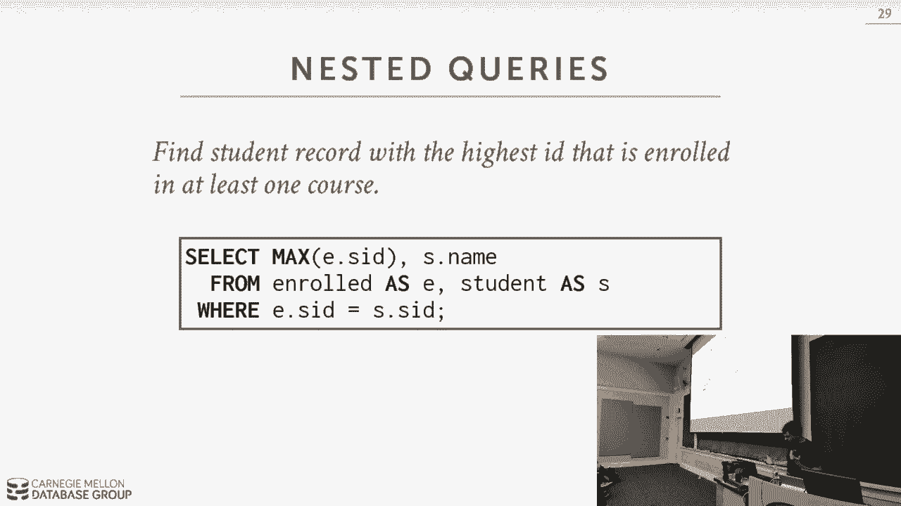

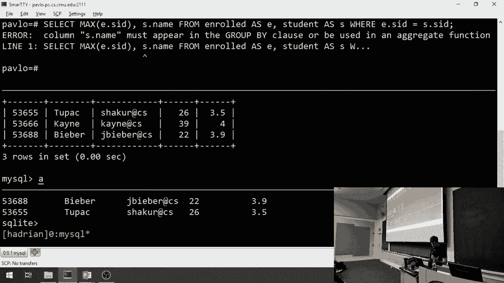

## 窗口函数 🪟

窗口函数允许我们在不将行分组到单一输出行的情况下，对一组相关的行进行计算。它像是聚合函数和 `GROUP BY` 的结合，但会保留所有原始行。

基本语法是 `function_name OVER (...)`。`OVER` 子句定义了如何对行进行分区和排序。常见的窗口函数包括：
*   标准聚合函数：`AVG()`, `SUM()`, `COUNT()`
*   特殊窗口函数：`ROW_NUMBER()`, `RANK()`

例如，为 `enrolled` 表中的每一行添加一个行号：
```sql
SELECT *, ROW_NUMBER() OVER () AS row_num FROM enrolled;
```
使用 `PARTITION BY` 在每个分区内重新开始编号。例如，按课程ID分区编号：
```sql
SELECT cid, sid, ROW_NUMBER() OVER (PARTITION BY cid) AS row_num FROM enrolled ORDER BY cid;
```
使用 `ORDER BY` 在窗口内排序。例如，按成绩排序后编号：
```sql
SELECT cid, sid, grade, ROW_NUMBER() OVER (ORDER BY grade) AS row_num FROM enrolled;
```

一个强大的应用是查找每门课程中成绩最高的学生。这需要结合嵌套查询和窗口函数：
```sql
SELECT * FROM (
    SELECT *, RANK() OVER (PARTITION BY cid ORDER BY grade ASC) AS rank FROM enrolled
) AS ranking WHERE ranking.rank = 1;
```
内层查询使用 `RANK()` 函数为每门课程（`PARTITION BY cid`）内的学生按成绩升序排名。外层查询只选取排名第一的记录。

---

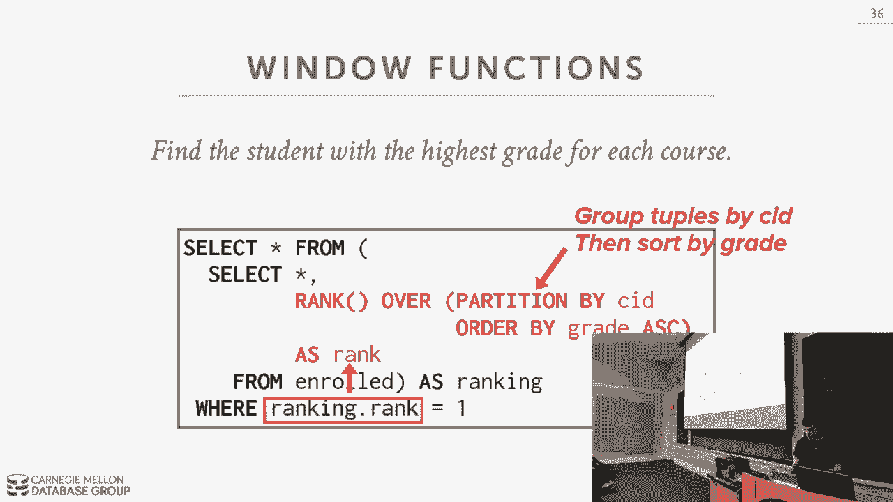

## 公共表表达式 (CTE) 🧩

公共表表达式（CTE）提供了一种更清晰的方式来编写嵌套查询，并且支持递归，这是普通嵌套查询无法做到的。

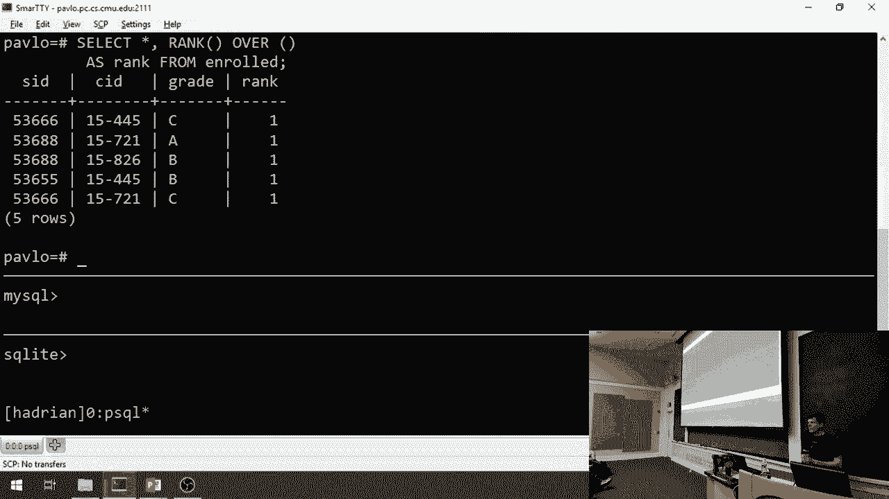

CTE 使用 `WITH` 子句定义，其结果可以在后续的主查询中像普通表一样被引用。例如：
```sql
WITH cteName (col1, col2) AS (SELECT 1, 2) SELECT col1 + col2 FROM cteName;
```
这个CTE创建了一个包含一列（值为1）的虚拟表 `cteName`，然后主查询从中选择数据。

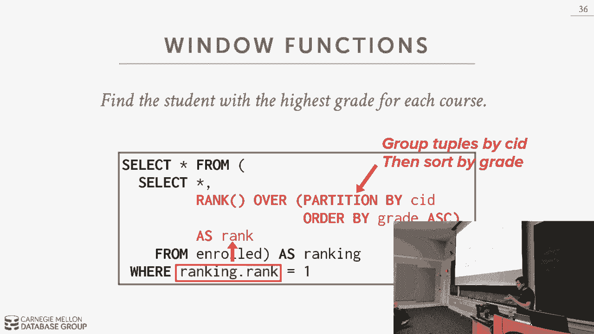

CTE 可以简化复杂查询。例如，重写之前查找最大学生ID的查询：
```sql
WITH maxID (max_id) AS (SELECT MAX(sid) FROM enrolled) SELECT name FROM student, maxID WHERE student.sid = maxID.max_id;
```

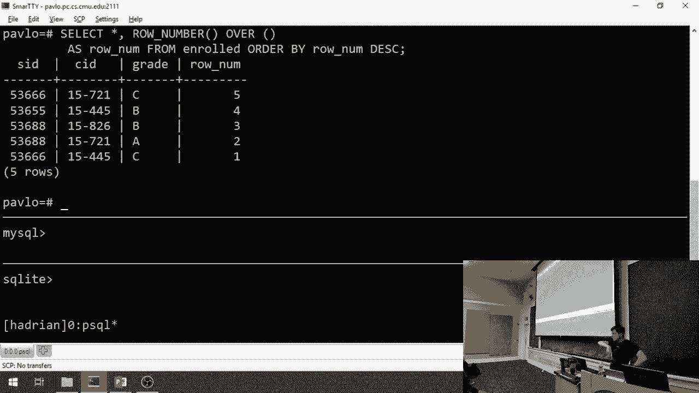

CTE 最强大的特性是递归。使用 `WITH RECURSIVE` 可以执行迭代操作。例如，生成一个从1到10的数字序列：
```sql
WITH RECURSIVE cteSource (counter) AS (
    (SELECT 1)                 -- 初始查询（锚点成员）
    UNION ALL
    (SELECT counter + 1 FROM cteSource WHERE counter < 10) -- 递归成员
)
SELECT * FROM cteSource;
```
这个递归CTE首先产生数字1（锚点成员），然后反复执行递归成员（将计数器加1），直到条件 `counter < 10` 不再满足为止。

---

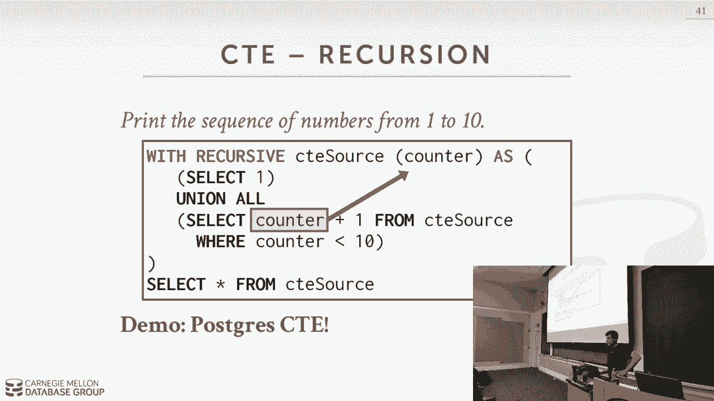

## 总结 ✨

本节课中我们一起学习了高级SQL的多个核心主题。我们探讨了如何使用聚合函数和 `GROUP BY` 对数据进行汇总分析，了解了不同数据库在字符串和日期操作上的差异。我们学习了如何通过 `ORDER BY`、`LIMIT` 和 `OFFSET` 控制输出，以及如何将结果重定向到其他表。

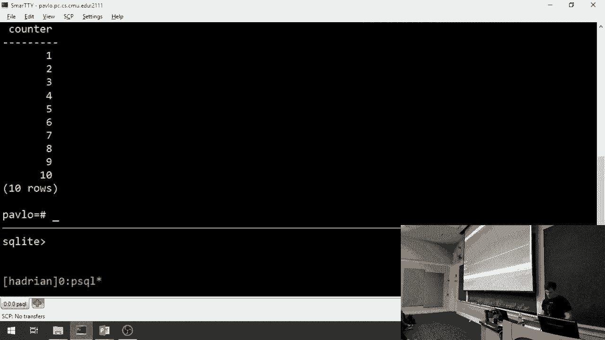

我们还深入研究了强大的嵌套查询，它允许查询之间相互引用。接着，我们介绍了窗口函数，它能够在保留所有行的同时进行跨行的计算。最后，我们学习了公共表表达式（CTE），它提供了更清晰的结构化查询方式，并且通过递归支持了迭代计算。

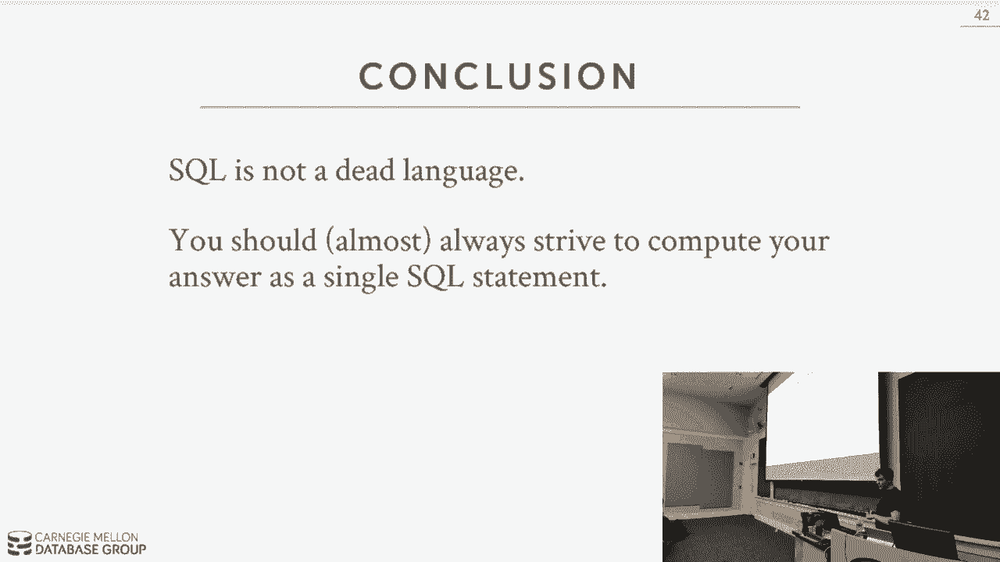

掌握这些高级SQL技术将使你能够更高效、更灵活地从数据库中提取和处理信息，解决复杂的数据分析问题。SQL虽然诞生于上世纪70年代，但至今仍在不断演进，是数据领域不可或缺的核心技能。