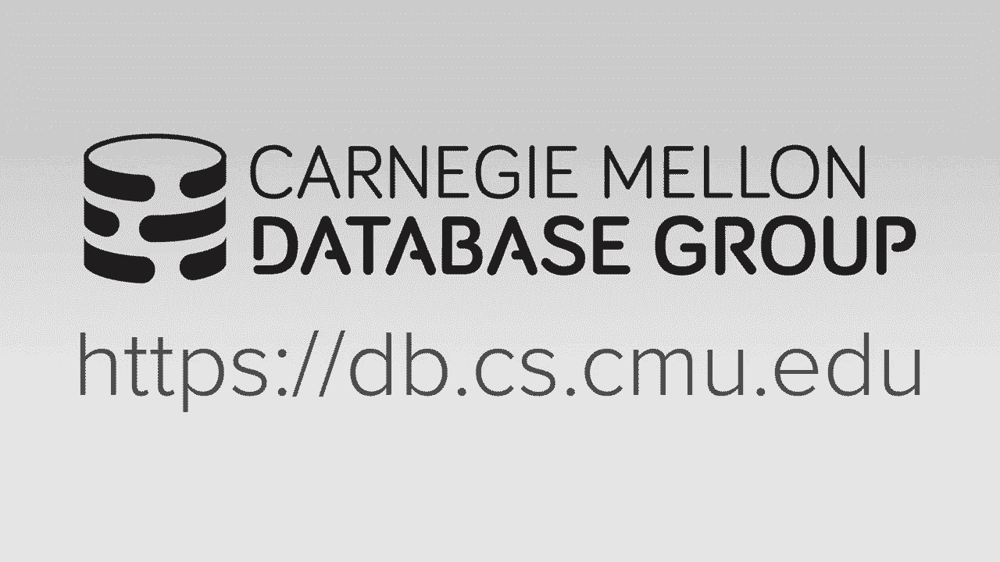
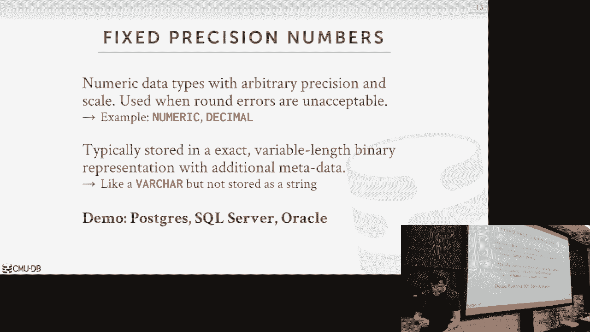
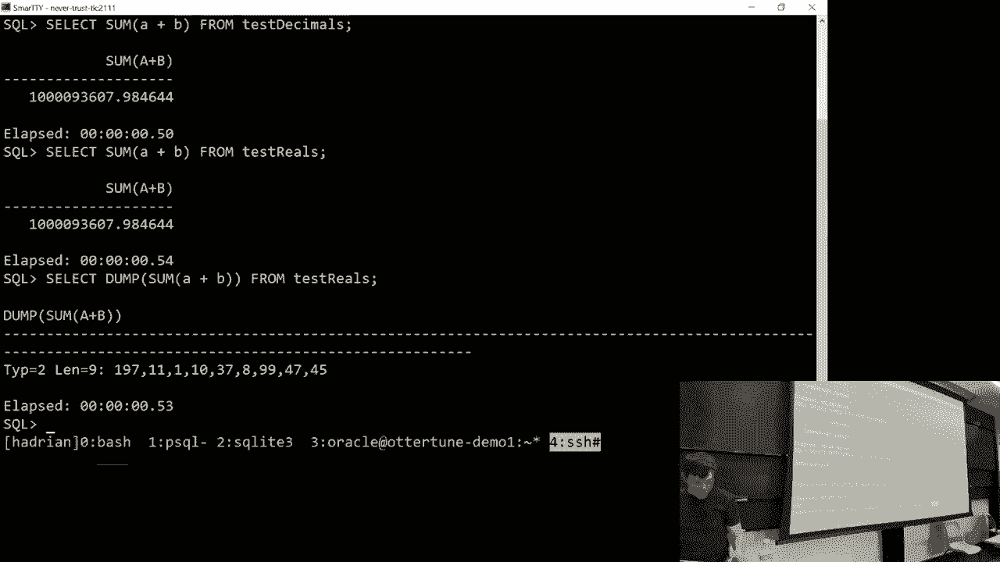
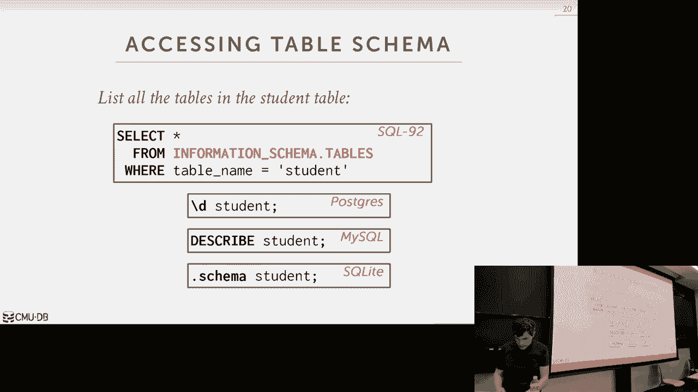
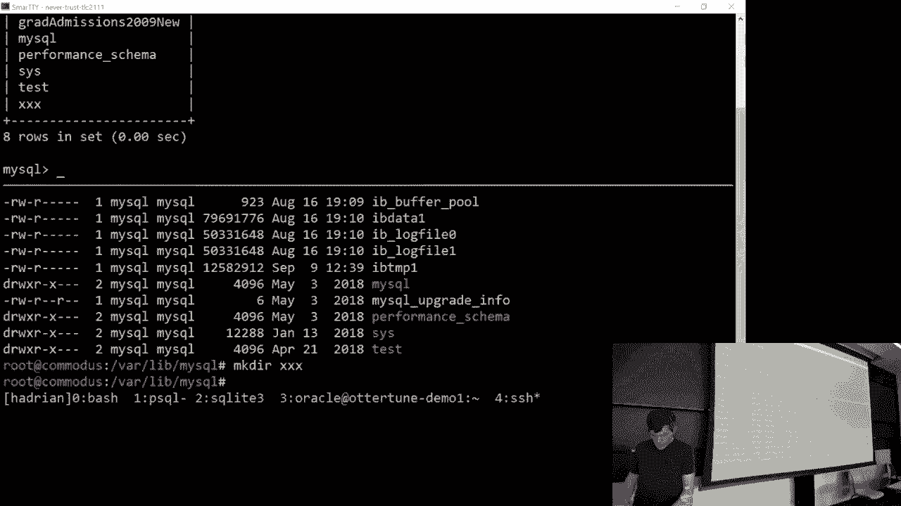
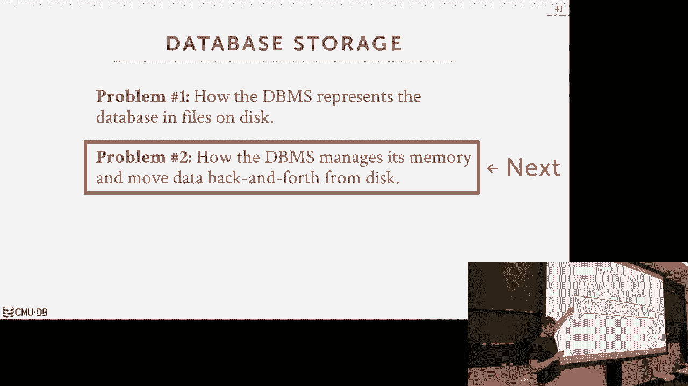

# 数据库系统导论：L4：数据库存储 2




## 概述

在本节课中，我们将继续深入学习数据库存储的内部机制。我们将探讨如何在元组内部表示数据、如何管理元数据（系统目录），并深入分析两种核心的存储模型：行存储与列存储。理解这些底层设计对于构建高效、适应不同工作负载的数据库系统至关重要。

## 数据表示

上一节我们讨论了如何在页面和文件中组织数据。本节中，我们来看看如何表示元组内部的具体数据。

一个元组本质上是一个字节序列（字节数组）。数据库管理系统需要解释这个字节数组，识别出整数、浮点数、字符串等不同属性的数据。系统目录中的元数据（如表模式）将指导系统如何解析这些字节。

以下是不同类型数据的常见表示方法：

*   **固定长度类型**：如整数、浮点数，通常遵循硬件/编程语言（如C/C++）的标准表示方式（例如IEEE 754标准）。
*   **可变长度类型**：如字符串（VARCHAR）、二进制大对象（BLOB）。通常会在数据前添加一个头部，用于存储数据的长度信息，然后是实际的字节序列。这与C语言中以空字符结尾的字符串不同。
*   **日期与时间戳**：不同系统实现差异很大。常见做法是存储自某个纪元时间（如UNIX纪元：1970年1月1日）以来的秒数或微秒数。
*   **定点小数**：为了精确表示十进制数（如金融数据），避免浮点数的舍入误差，数据库系统需要自行实现定点数的存储和运算逻辑。这比使用CPU原生浮点指令要慢，但能保证精度。



### 浮点数与定点数的性能对比

以下是一个简单的演示，说明在PostgreSQL中，对`REAL`（浮点数）和`DECIMAL`（定点数）类型进行相同聚合查询的性能差异：

```sql
-- 使用REAL（浮点数）类型
EXPLAIN ANALYZE SELECT SUM(a + b) FROM real_table;
-- 执行时间约 0.8 秒

-- 使用DECIMAL（定点数）类型
EXPLAIN ANALYZE SELECT SUM(a + b) FROM decimal_table;
-- 执行时间约 1.6 秒
```



定点数运算更慢，是因为数据库系统需要在软件层面实现复杂的算术逻辑，而不是依赖CPU的单一浮点运算指令。

## 大值存储

当某个属性的值太大，无法放入单个页面时，有两种主要的处理策略。

以下是两种大值存储策略：

1.  **溢出页**：在元组中存储一个指针（如页号+偏移量），指向一个或多个专门的“溢出页”，这些页面链式地存储大值数据。这样，大值数据仍然受数据库系统的事务和恢复机制保护。PostgreSQL的TOAST、MySQL/ SQL Server的溢出页都采用此方式。
2.  **外部存储**：不在数据库内部存储数据，而是存储一个外部文件路径（如本地文件系统、HDFS、S3的路径）。当查询需要该数据时，再读取外部文件。这种方式节省了数据库的存储空间，但数据不受数据库系统的事务控制，可能被外部修改。

选择哪种方式取决于数据大小、访问模式以及对性能、一致性和成本的综合考量。

## 系统目录



系统目录是数据库的“元数据”，它记录了数据库自身的信息，例如有哪些表、表的结构（列名、类型）、索引以及内部统计信息等。



几乎所有数据库系统都将系统目录存储在普通的表里，即“自食其果”。为了便于应用程序移植，SQL标准定义了`INFORMATION_SCHEMA`视图，提供了一种统一的方式来查询元数据。当然，各数据库也提供了自己的快捷命令（如PostgreSQL的`\d`，MySQL的`SHOW TABLES`）。

在实现上，数据库内部通过低级代码直接访问这些目录表，以获取解释元组字节数组所需的模式信息。

## 存储模型

关系模型本身并未规定数据的物理存储方式。根据不同的工作负载，主要衍生出两种存储模型。

### 工作负载类型

首先，我们需要了解两种典型的工作负载：

*   **联机事务处理**：这类应用频繁地插入、更新或删除少量数据，查询通常只访问少量记录（例如，用户登录、下订单）。其特点是写操作多，查询简单且涉及数据量小。
*   **联机分析处理**：这类应用主要用于分析海量历史数据，查询复杂（常涉及多表连接和聚合），需要扫描大量数据，但通常是只读的（例如，生成月度销售报告、用户行为分析）。其特点是读操作多，查询复杂且涉及数据量大。

### 行存储

行存储（或N-ary存储模型）是将一个元组的所有属性值连续地存储在一起。这是最常见的存储方式，非常适合OLTP工作负载。

**优点**：
*   插入、更新、删除整个元组的效率高。
*   需要访问单个实体全部属性的点查询效率极高（一次磁盘I/O即可获取所有数据）。

**缺点**：
*   对于OLAP查询，如果只需要表中少数几列，也必须将整个元组（包含所有列）读入内存，造成了大量的I/O浪费。

### 列存储

列存储（或分解存储模型）是将表中每一列的所有值连续地存储在一起。即，每个数据页只存储一个列的数据。这种模型非常适合OLAP工作负载。

**优点**：
*   **减少I/O浪费**：查询只需读取涉及的列，无需读取无关列的数据。
*   **高效压缩**：同一列的数据类型相同，值域相似，更容易获得高压缩比，进一步减少I/O和内存占用。
*   **利于向量化处理**：可以对整列数据进行批量操作，充分利用现代CPU的SIMD指令集，提高处理速度。

**缺点**：
*   需要重建整行数据的点查询或更新操作性能较差，因为需要从多个列文件中收集数据。
*   插入单条记录开销大，需要分散写入多个列文件。

列存储并非新技术，但在2000年代后随着数据分析需求的爆发而广泛应用。Vertica、Amazon Redshift、Google BigQuery等都是著名的列存储系统。

## 总结




本节课我们一起深入探讨了数据库存储的多个关键层面。我们学习了如何在元组内部表示各种数据类型，特别是定点小数与浮点数的取舍。我们了解了当数据过大时的溢出页和外部存储策略。我们还认识了系统目录的作用，它是数据库自我描述的元数据仓库。最后，我们重点对比了行存储和列存储两种核心模型，理解了它们分别最适合OLTP和OLAP两种不同的工作负载场景。掌握这些底层存储知识，是设计、优化和选用数据库系统的基础。从下节课开始，我们将研究如何将这些存储在磁盘上的数据高效地管理在内存中。