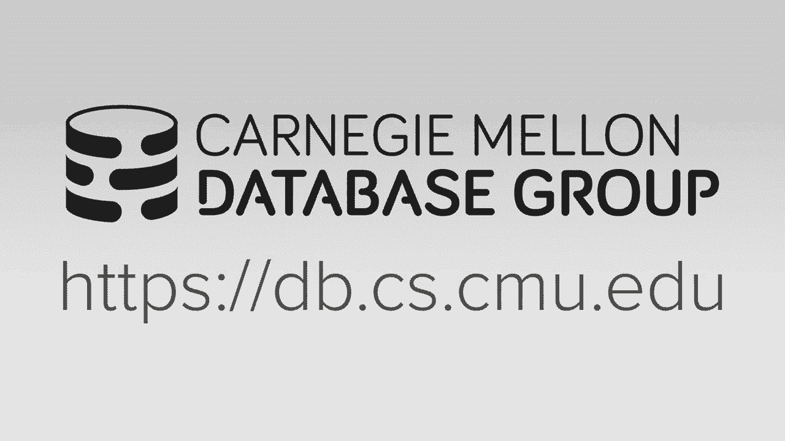
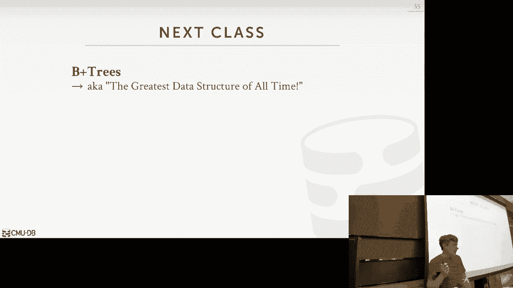

# 数据库系统导论：P6：L6-哈希表 🗂️




在本节课中，我们将要学习数据库系统中一个核心的数据结构：哈希表。哈希表是一种提供快速查找功能的数据结构，它通过哈希函数将任意键映射到特定的存储位置。我们将探讨其工作原理、不同类型的哈希方案以及在实际数据库系统中的应用。

## 概述

哈希表是一种无序的关联数组实现，用于将任意键映射到任意值。其核心思想是使用哈希函数计算键的存储位置，从而实现平均情况下的常数时间复杂度查找。在数据库系统中，哈希表被广泛用于内部元数据管理、核心数据存储、临时数据处理以及表索引等场景。

## 哈希函数 🔑

哈希函数的作用是将任意键（如字符串、整数）转换为一个固定大小的整数值（如32位或64位）。这个整数值用于确定键在哈希表中的起始查找位置。

一个理想的哈希函数需要在速度和碰撞率之间取得平衡。碰撞是指两个不同的键被哈希到同一个表位置的情况。

**核心公式**：`slot_index = hash(key) % table_size`

现代数据库系统通常使用高性能的哈希函数，例如 Facebook 的 **xxHash**。它因其出色的速度和低碰撞率而被认为是目前最佳选择之一。其他历史选项包括 MurmurHash、CityHash 和 FarmHash，但它们在性能或碰撞率上通常不及 xxHash。

## 静态哈希方案

静态哈希方案要求预先知道或估算要存储的键的大致数量，以便分配固定大小的存储空间。如果表变得过满，则需要重建整个表（即重新哈希所有键到一个更大的表中），这是一个昂贵的操作。

### 线性探测哈希

线性探测是最简单的哈希表实现之一。其解决碰撞的方法是：如果目标位置已被占用，则顺序扫描下一个位置，直到找到空槽为止。

**操作流程**：
1.  **插入**：计算哈希位置。如果该位置为空，则插入；否则，顺序向下查找第一个空槽并插入。
2.  **查找**：计算哈希位置。从该位置开始顺序扫描，直到找到目标键或遇到空槽（表示键不存在）。
3.  **删除**：直接删除会导致查找链断裂。常用方法是使用“墓碑”标记该位置已被逻辑删除但物理上仍视为占用，或者执行复杂的数据移动来填补空缺。

以下是线性探测的简单示例：
```python
# 伪代码示例：线性探测插入
def linear_probe_insert(table, key, value):
    index = hash(key) % len(table)
    while table[index] is not None and table[index].key != key:
        index = (index + 1) % len(table) # 循环回到开头
    table[index] = Entry(key, value)
```

### 罗宾汉哈希

罗宾汉哈希旨在通过平衡键的“贫富”程度来优化线性探测。每个键记录其当前位置与原始哈希位置的偏移量（即“距离”）。

**核心思想**：在插入时，如果新键的偏移量小于当前位置上已有键的偏移量（即新键更“穷”），则新键会“窃取”这个槽位，迫使原有键继续向下探测。目标是使所有键的探测距离尽可能平均，避免个别键的查找路径过长。

### 布谷鸟哈希

布谷鸟哈希使用两个（或更多）独立的哈希表和哈希函数。每个键可以放在两个表对应的任一位置。

**操作流程**：
1.  **插入**：检查两个候选位置。如果任一为空，则插入。如果均被占用，则随机选择一个位置，踢出原有的键，并尝试将该旧键插入到它的另一个候选位置（可能引发连锁反应）。
2.  **查找与删除**：只需检查两个固定位置，时间复杂度为严格的 O(1)。

布谷鸟哈希的插入可能触发无限循环，此时需要触发哈希表扩容。

## 动态哈希方案

动态哈希方案允许哈希表根据需要动态增长，而无需一次性重建整个数据结构。

### 链式哈希表

这是最直观的动态哈希方案。哈希表的每个槽位不再直接存储数据，而是存储一个桶（如链表）的指针。所有哈希到同一位置的键值对都存储在对应的链表桶中。

-   **优点**：实现简单，易于并发控制。
-   **缺点**：如果某个链表变得非常长，性能会退化为线性查找。

### 可扩展哈希

可扩展哈希使用一个指向桶的指针数组（目录）。目录的大小基于一个全局深度（位数）。每个桶有一个本地深度。

**工作流程**：
1.  插入时，根据键哈希值的前`全局深度`位找到目录项及对应的桶。
2.  如果桶已满，则增加全局深度（目录大小翻倍），并分裂溢出的桶。分裂时，根据新的位数将原桶中的条目重新分布到两个新桶中。
3.  目录翻倍成本较低，因为它只包含指针。

### 线性哈希

线性哈希旨在避免像可扩展哈希那样一次性翻倍目录所带来的全局锁竞争。它引入一个“分裂指针”，指向下一个待分裂的桶。

**工作流程**：
1.  当任何桶溢出时，并不立即分裂该桶，而是分裂由“分裂指针”指向的桶（即使它未满）。
2.  分裂时，添加一个新的桶，并使用一个新的哈希函数（通常为 `hash(key) mod 2N`）来重新分布被分裂桶中的部分数据。分裂指针随后向前移动。
3.  查找时，需要根据键的哈希值和当前分裂指针的位置，判断应该使用哪个哈希函数来确定桶的位置。

这种方法将扩容开销分摊到多次插入操作中，避免了集中式的重组。

## 总结

本节课我们一起深入探讨了哈希表这一数据库系统中的关键数据结构。我们从哈希函数的选择讲起，比较了不同函数的性能。接着，详细介绍了多种哈希方案：从简单的线性探测，到优化的罗宾汉哈希和布谷鸟哈希，再到支持动态扩容的链式哈希、可扩展哈希和线性哈希。



每种方案都有其权衡：静态哈希简单快速但需预知数据量；动态哈希灵活但逻辑更复杂。在数据库的实际应用中，哈希表因其平均 O(1) 的查找速度，被广泛用于内部元数据管理、连接操作等场景。然而，由于其无法支持范围查询，对于通用的表索引，数据库更常使用下一讲将要介绍的 B+ 树。理解这些权衡对于设计和实现高效的数据库系统至关重要。