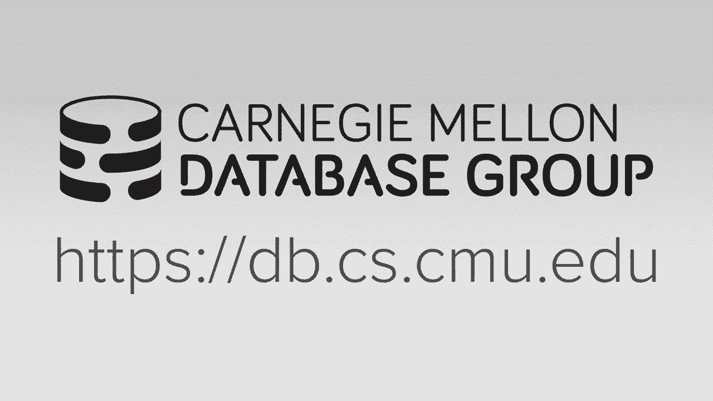
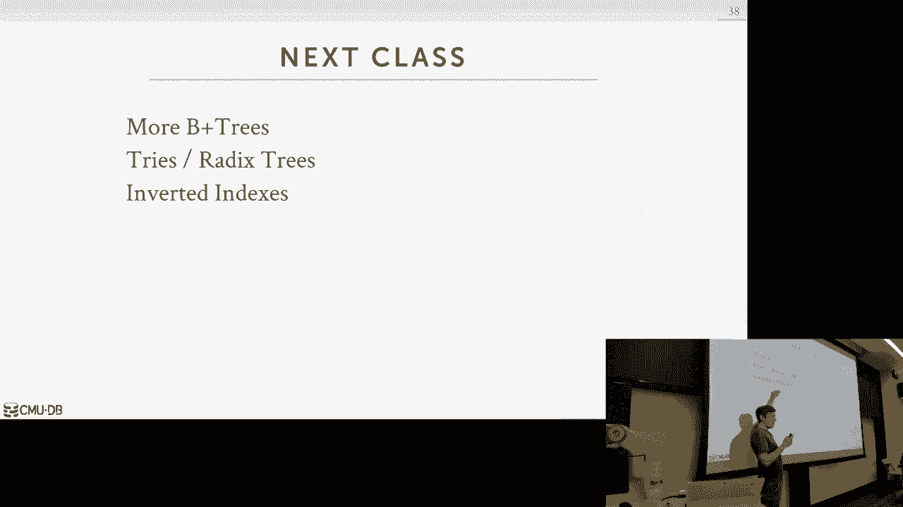

# 数据库系统导论：P7：L7- 树索引 1 🌳




在本节课中，我们将要学习数据库系统中的一种核心数据结构——树索引。我们将从回顾哈希表的局限性开始，引出为什么需要树索引，并深入探讨B+树的基本概念、结构、操作以及在实际系统中的优化。

上一节我们介绍了哈希表，它适用于点查询，但无法高效支持范围查询。本节中我们来看看如何通过树索引来解决这个问题。

## 概述

表索引是表中某些属性子集的副本，以更有效的方式存储，允许我们进行高效的查找，避免对整个表进行顺序扫描。数据库系统负责维护索引与底层表的同步，这对应用程序程序员是透明的。虽然索引能加速查询，但也会带来额外的存储和维护成本。

## B+树简介

B+树是一种自平衡的树数据结构，它保持数据有序，支持高效的搜索、插入、删除和顺序扫描操作，时间复杂度为 O(log n)。与哈希表不同，B+树能很好地支持范围查询。它最初设计用于磁盘I/O效率，至今仍在各种数据库系统中广泛使用。

### B+树与B树的区别

在实践中，“B树”一词常被用来指代B+树，但两者有本质区别：
*   **B树**：值（记录ID或元组）可以出现在树的任何节点（内部节点或叶节点）。每个键只出现一次。
*   **B+树**：值**只**出现在**叶节点**中。内部节点仅存储用于导航的“路标”键，这些键可能会重复（例如，一个键可能出现在内部节点中，但实际数据已在叶节点中被删除）。

现代数据库系统（如PostgreSQL、MySQL）实际使用的是B+树或其变体。

### B+树的结构与性质

B+树具有以下关键性质：
*   **M路搜索树**：每个节点最多有 M 条到子节点的路径。
*   **完美平衡**：从根节点到任何叶节点的距离总是相同的。
*   **半满保证**：除了根节点，每个节点必须至少半满（即至少包含 ceil(M/2) - 1 个键）。
*   **内部节点**：存储键和指向子节点的指针。如果有 K 个键，则有 K+1 个非空子指针。
*   **叶节点**：存储键值对，并通过**兄弟指针**相互连接，支持高效的范围扫描。

以下是B+树结构的简化图示：
```
         [ 内部节点 / 根 ]
         /      |       \
        /       |        \
[叶节点] <-> [叶节点] <-> [叶节点]
(键值对)    (键值对)    (键值对)
```

在内部节点中，键用于决定搜索路径（例如，小于键X的走左边，大于等于的走右边）。叶节点中的“值”可以是记录ID（指向堆文件中元组的位置），也可以是元组数据本身（聚集索引）。

## B+树的操作

理解了B+树的结构后，我们来看看如何对其进行插入和删除操作，并保持其平衡性。

### 插入操作

插入新键时，我们需要：
1.  遍历树，找到应插入的叶节点。
2.  如果叶节点有空间，则直接插入并保持键有序。
3.  如果叶节点已满，则需要进行**分裂**：
    *   将原节点一分为二。
    *   将中间的键提升到父节点。
    *   更新父节点的指针以指向新节点。
    *   如果父节点也因此变满，则分裂操作可能递归向上传播，直至根节点。根节点的分裂是树长高的唯一途径。

### 删除操作

删除键时，我们需要：
1.  遍历树，找到包含该键的叶节点并删除它。
2.  如果删除后，叶节点仍至少半满，则操作完成。
3.  如果删除后，叶节点少于半满，则需要重新平衡：
    *   **借用**：首先尝试从相邻的兄弟节点“借”一个键（及其对应的值），前提是兄弟节点在借用后仍能保持半满。这通常不需要修改父节点。
    *   **合并**：如果无法借用，则将该节点与一个兄弟节点**合并**。合并后，需要从父节点中删除指向被合并子节点的指针和对应的分隔键。这个删除操作可能导致父节点不满足半满条件，从而可能触发父节点的合并操作，并递归向上传播。

**注意**：在实际系统中，为了性能，可能不会立即执行合并，而是允许节点暂时低于半满，通过后台任务或重建来最终整理树的结构。

## B+树的优化与实践

在真实的数据库系统中，B+树的实现包含了许多优化，以适应不同的工作负载和硬件特性。

以下是实践中常用的一些优化技术：

*   **节点/页面大小调整**：节点大小通常与磁盘页面大小对齐。对于慢速磁盘（如HDD），使用较大的页面（如1MB）有利于顺序I/O；对于SSD，页面可以更小（如10KB）；对于内存数据库，页面可以非常小（如512字节）。
*   **延迟合并**：不立即执行删除后的合并操作，以避免频繁的分裂-合并振荡，提升整体吞吐量。
*   **变长键处理**：有几种方法处理长度不固定的键（如字符串）：
    1.  **指针法**：在节点中只存储指向实际键的指针。节省空间但增加一次查找开销。
    2.  **填充法**：用空字符填充所有键至固定长度。简单但可能浪费空间。
    3.  **键映射/间接法**（最常用）：在节点头部存储一个有序的“键指针”数组，指向节点尾部存储的实际变长键值。这样可以在指针数组中进行高效的二分查找。
*   **非唯一键处理**：对于允许重复值的列建立索引，有两种主要方法：
    1.  **重复键**：在叶节点中简单地多次存储相同的键，每个键对应其自己的值（记录ID）。
    2.  **值列表**：每个键只存储一次，并附加一个列表，包含所有拥有该键的记录ID。
*   **节点内搜索优化**：
    *   **线性搜索**：简单，无需保持键在节点内严格有序，适用于小节点或插入频繁的场景。
    *   **二分查找**：在有序的键数组中查找，效率更高（O(log k)），是常见选择。
    *   **插值搜索**：如果知道键的分布（如整数范围），可以估算键的大致位置，作为搜索起点。
*   **压缩技术**：
    *   **前缀压缩**：在叶节点中，由于键是有序的，相邻键通常有共同前缀。可以提取并只存储一次公共前缀，然后存储每个键独有的后缀部分。
    *   **后缀截断**：在内部节点中，用于导航的键可能不需要存储完整的值，只需存储能区分左右子树的最小前缀即可。
*   **批量加载**：当需要为一个已有大量数据的表创建索引时，自下而上批量构建比逐条插入高效得多。方法是先对所有键排序，然后直接构建满的叶节点层，再向上构建内部节点层。
*   **指针切换**：对于确信会常驻内存的页面（如B+树的上层节点），可以直接在父节点中存储子节点的**内存指针**，而不是**页面ID**。这样可以避免每次遍历时都查询缓冲池管理器进行页ID到指针的转换，从而显著提升遍历速度。当页面被换出时，需要将指针恢复为页面ID。

## 总结




本节课中我们一起学习了数据库索引的核心——B+树。我们首先了解了为什么需要树索引来支持范围查询，然后深入探讨了B+树的结构、性质以及与B树的区别。我们详细分析了B+树的插入、删除操作以及保持平衡的机制。最后，我们介绍了一系列使B+树在现代数据库系统中高效运行的优化技术，包括节点大小调整、变长键处理、压缩和批量加载等。B+树因其出色的磁盘I/O友好性和强大的操作性能，至今仍是关系数据库中最主要的索引数据结构。