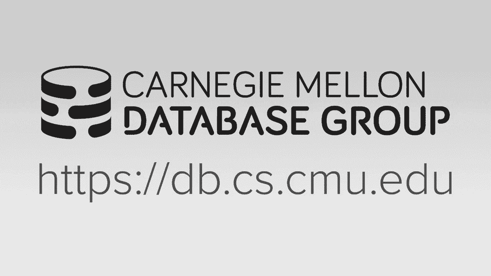
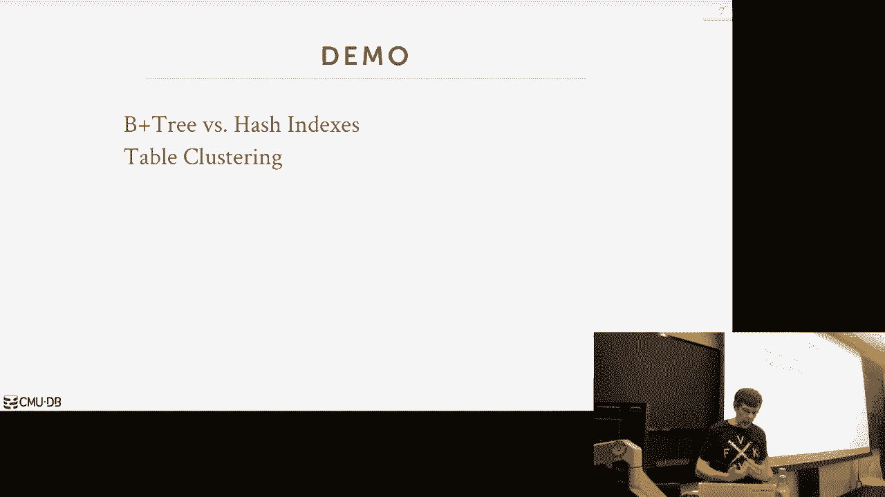
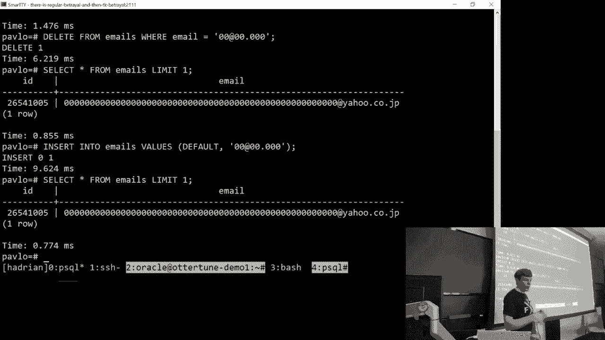
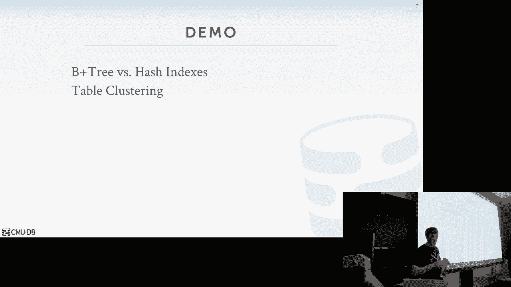
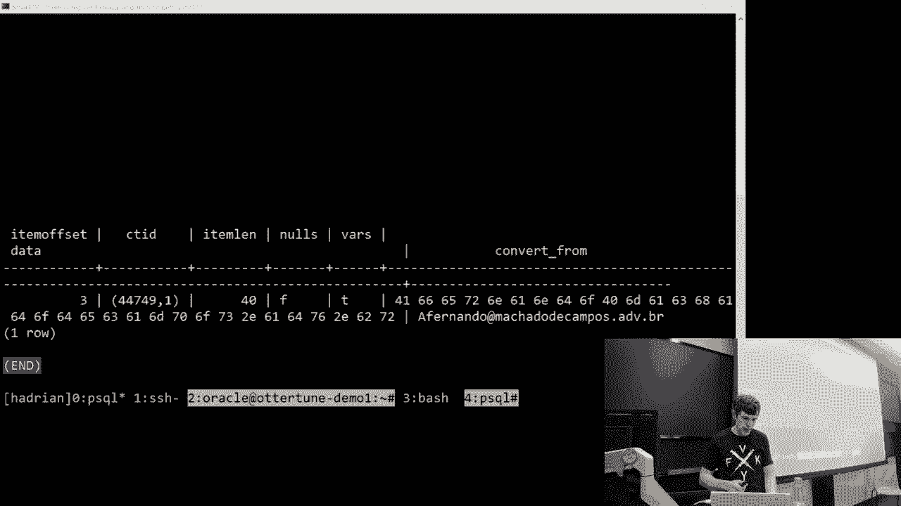
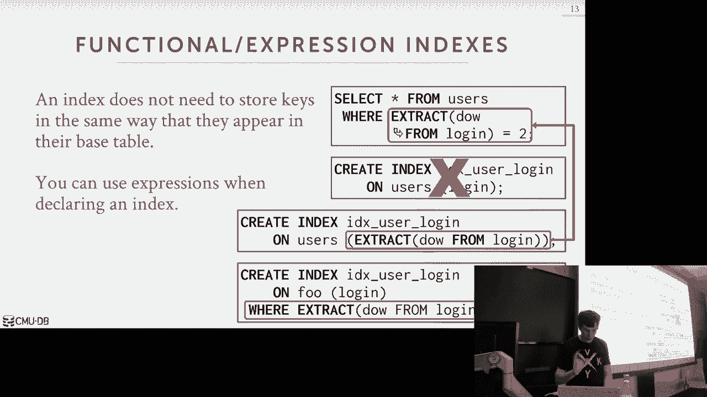
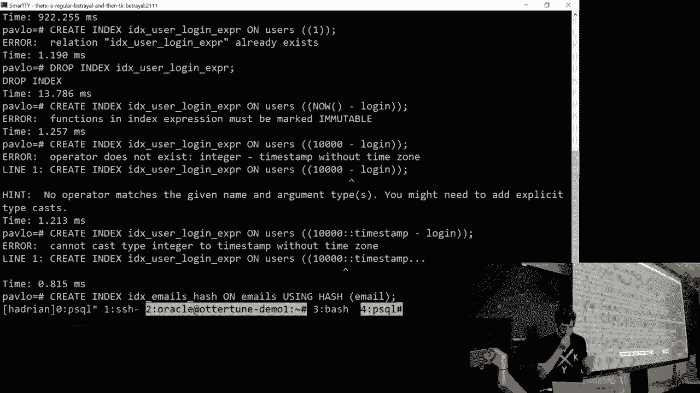

# 数据库系统导论：L8：树索引 2

在本节课中，我们将继续深入学习树索引。我们将探讨如何处理B+树中的重复键，了解表聚簇的概念，并学习几种高级索引技术，如部分索引、覆盖索引和函数索引。最后，我们将简要介绍基数树和倒排索引，作为B+树和哈希索引的替代方案。

## 处理重复键

上一节我们介绍了B+树的基本结构，本节中我们来看看如何处理B+树索引中的重复键。有两种主要方法。

第一种方法是自动使每个键变得唯一。具体做法是在插入索引的键后附加该元组的记录ID（Record ID）。记录ID通常是页面ID和槽偏移量的组合，用于唯一标识元组的物理位置。这样，即使属性值相同，组合键（属性值+记录ID）也是唯一的。在B+树中，我们仍然可以进行部分键查找（例如，仅根据属性值查找），然后沿着叶节点扫描找到所有匹配项。

第二种方法是使用溢出叶节点。当叶节点已满且需要插入重复键时，不进行节点分裂，而是添加一个溢出页面来存放新条目，类似于链式哈希表。这样，一个逻辑叶节点可能由多个物理页面组成。

以下是两种方法的对比：
*   **附加记录ID**：优点是不需要修改数据结构逻辑；缺点是增加了索引的存储大小。
*   **溢出页**：优点是不存储冗余信息；缺点是增加了管理的复杂性，例如在反向扫描时需要额外逻辑。

## 表聚簇

表聚簇是指使用某个索引来强制表中元组本身的物理存储顺序。在默认情况下，关系数据库中的表是无序的。

一些数据库系统（如SQL Server、Oracle）支持创建聚簇索引，这意味着表数据将按照索引定义的顺序存储。对于这类表，顺序扫描可能非常高效，甚至可以直接在表上进行二分查找。

在PostgreSQL中，可以使用 `CLUSTER` 命令基于某个索引对表进行一次性的重新排序。但这并非自动维护，在后续插入后，顺序可能会被打乱，需要再次执行 `CLUSTER`。

## 高级索引技术

除了标准的B+树索引，还有几种高级索引技术可以优化特定类型的查询。

### 部分索引

部分索引只对表中满足特定条件（`WHERE`子句）的元组子集创建索引。这可以减小索引的大小，提高查询效率，并减少缓冲池的污染。

例如，可以为每个月的数据创建一个部分索引，以快速查询该月内的订单。

### 覆盖索引

当一个查询所需的所有列都包含在某个索引中时，数据库可以仅通过扫描索引来获取结果，而无需回表查找数据页。这被称为覆盖索引。覆盖索引不是一种特殊的索引类型，而是数据库查询优化器可以识别并利用的一种特性。

例如，如果索引包含列`(a, b)`，查询 `SELECT b FROM table WHERE a = 10` 就可以使用覆盖索引。

### 包含列的索引

某些数据库系统（如SQL Server， PostgreSQL 11+）支持`INCLUDE`子句。这允许在索引的叶节点中包含额外的列，但这些列不作为索引键的一部分用于查找。这结合了覆盖索引的优点，同时避免了将这些列作为搜索键可能带来的开销。

例如：`CREATE INDEX idx ON table (a) INCLUDE (b, c);`。查找`a=10`时，可以直接从叶节点获取`b`和`c`的值。

### 函数/表达式索引

索引不仅可以建立在列的直接值上，还可以建立在列的函数或表达式上。这对于查询条件中包含函数计算的场景非常有用。

例如，有一个`login_time`字段，想要查找所有在星期二登录的用户。可以创建一个表达式索引：`CREATE INDEX idx_day ON users (EXTRACT(dow FROM login_time));`。之后，查询 `SELECT * FROM users WHERE EXTRACT(dow FROM login_time) = 2;` 就可以利用这个索引。

**注意**：表达式在创建索引时被计算并固定，因此如果表达式依赖于如`CURRENT_TIMESTAMP`这样的动态值，可能无法达到预期效果。

## 基数树简介

基数树是字典树的一种压缩形式。与B+树在节点中存储完整键的副本不同，基数树将键分解为数字（如字节），并沿着树的不同层级存储这些数字。

它的特点包括：
*   **形状确定**：树的形状只取决于键的分布和长度，与插入顺序无关。
*   **无需再平衡**：不像B+树需要复杂的分裂与合并操作。
*   **操作复杂度为O(k)**：查找、插入和删除的复杂度取决于键的长度`k`，而不是数据量`N`。
*   **隐式存储键**：键由从根到叶的路径隐式表示，节省了空间。
*   **点查询快，范围扫描慢**：对于点查询，可能在到达叶节点前即可确定键不存在；但进行顺序扫描比B+树更复杂。

基数树通过**水平压缩**（不存储数字值本身，仅通过指针偏移隐含）和**垂直压缩**（合并只有一个子节点的路径）来进一步优化。虽然基数树在学术和特定系统（如HyPer）中很有趣，但目前B+树仍然是商用数据库系统中主流的索引结构。

## 倒排索引简介

B+树和哈希索引擅长处理点查询和范围查询，但不适用于关键字搜索（例如，在文本中查找包含某个单词的记录）。

倒排索引正是为此设计。它将文档中的单词（或词条）映射到包含该单词的文档列表（记录ID）。这有时被称为全文搜索索引。

使用倒排索引，可以高效执行：
*   **关键字搜索**：查找包含特定单词的所有记录。
*   **短语搜索**：查找包含特定单词序列的记录。
*   **邻近搜索**：查找两个单词在特定距离内出现的记录。

倒排索引可以在数据库内部实现（如PostgreSQL的全文搜索），也可以由外部专用系统提供（如Elasticsearch）。其内部通常使用B+树或哈希表来存储从词条到发布列表的映射，并在发布列表中存储额外的上下文信息（如位置、频率）以支持高级查询。

## 总结

本节课中我们一起深入探讨了树索引的多个高级主题。我们学习了处理B+树中重复键的两种策略，了解了表聚簇如何优化数据物理布局。接着，我们介绍了几种强大的索引技术：部分索引、覆盖索引、包含列的索引和函数索引，它们能显著提升特定查询模式的性能。最后，我们简要了解了作为B+树替代方案的基数树，以及用于全文搜索的倒排索引的基本概念。掌握这些知识，将帮助你更好地理解和设计高效的数据库索引策略。