# 2：课程概述 🎬

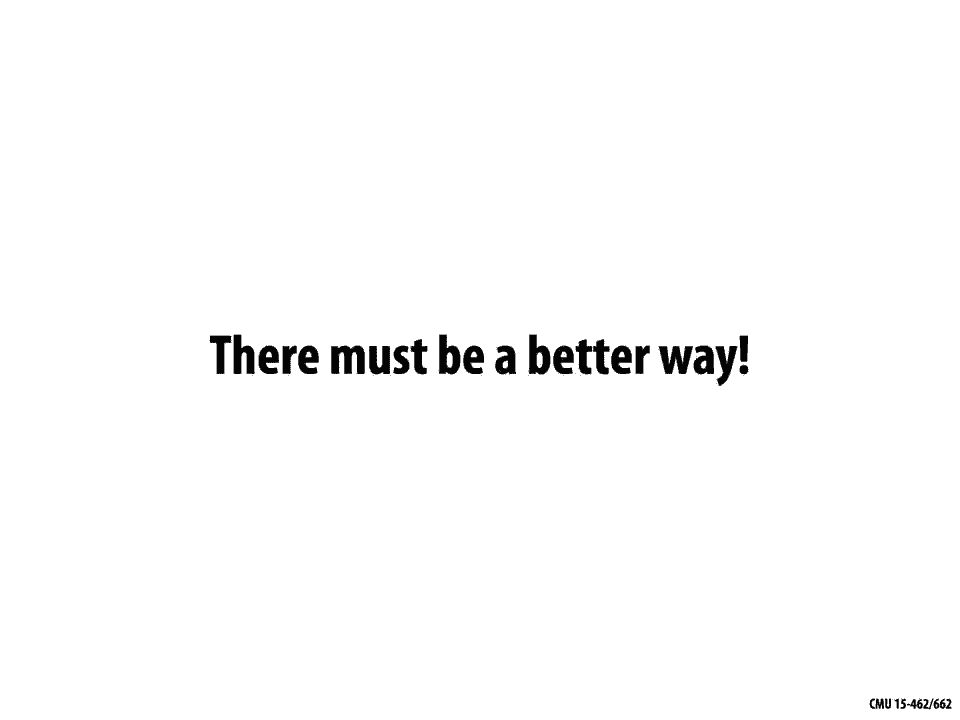

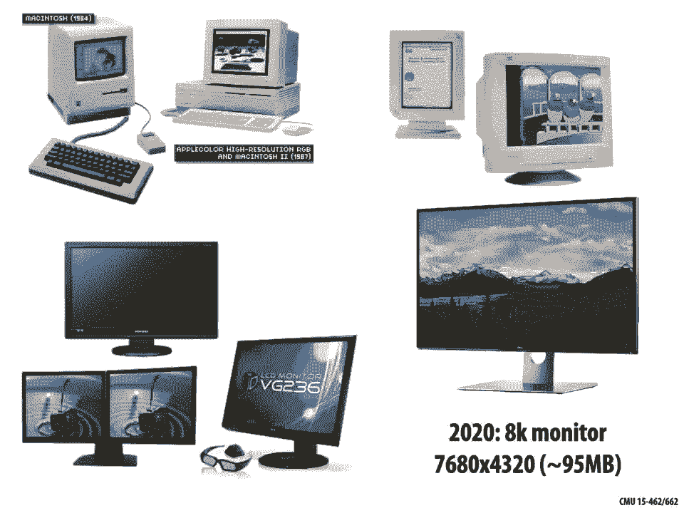

在本节课中，我们将对计算机图形学进行一个全面的概述。我们将探讨计算机图形学是什么，它在世界中的应用，并实际动手实现第一个从三维形状生成图像的算法。课程的所有后勤信息都可以在网页上找到，今天我们将直接深入内容。

## 什么是计算机图形学？ 🤔

当你想到计算机图形学时，脑海中可能会浮现出这样的图像，比如来自动画电影或视觉特效的画面。然而，在本课程中，我们更想从根本上研究计算机图形学在计算机科学中的广泛体现，它在数字计算中的作用，以及我们为什么需要它。

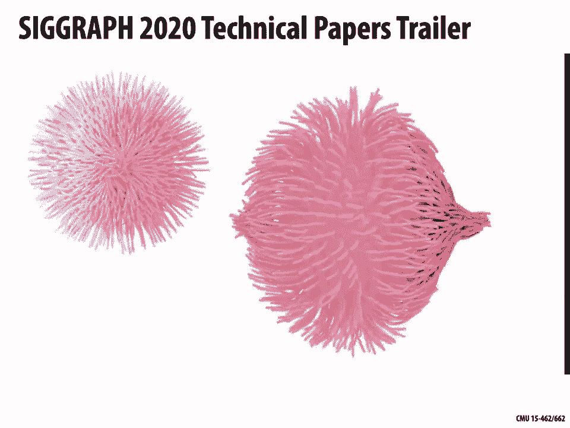

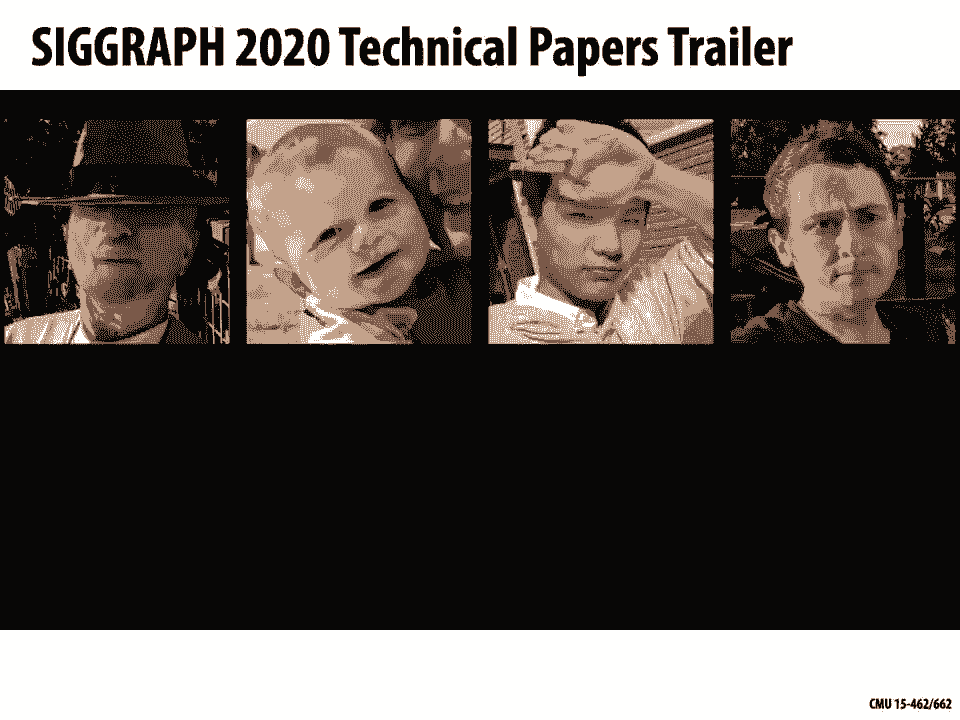

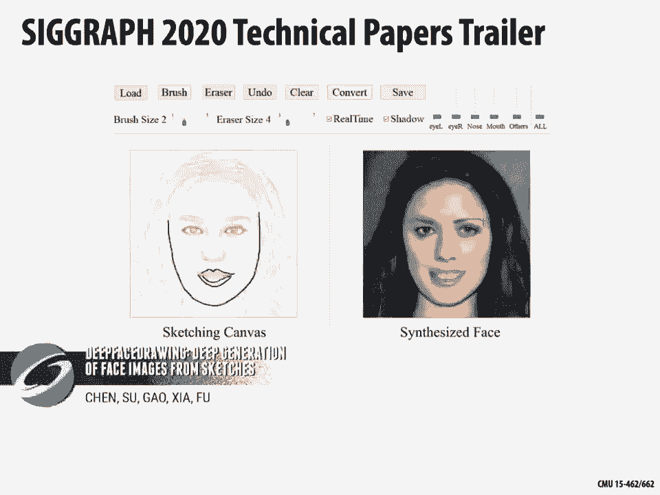

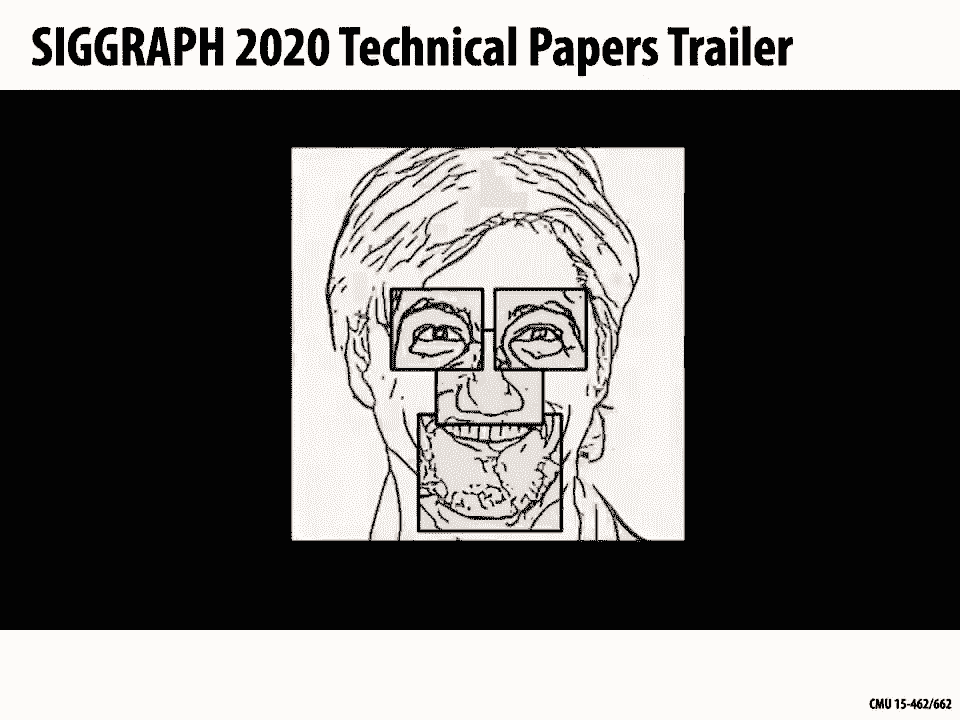

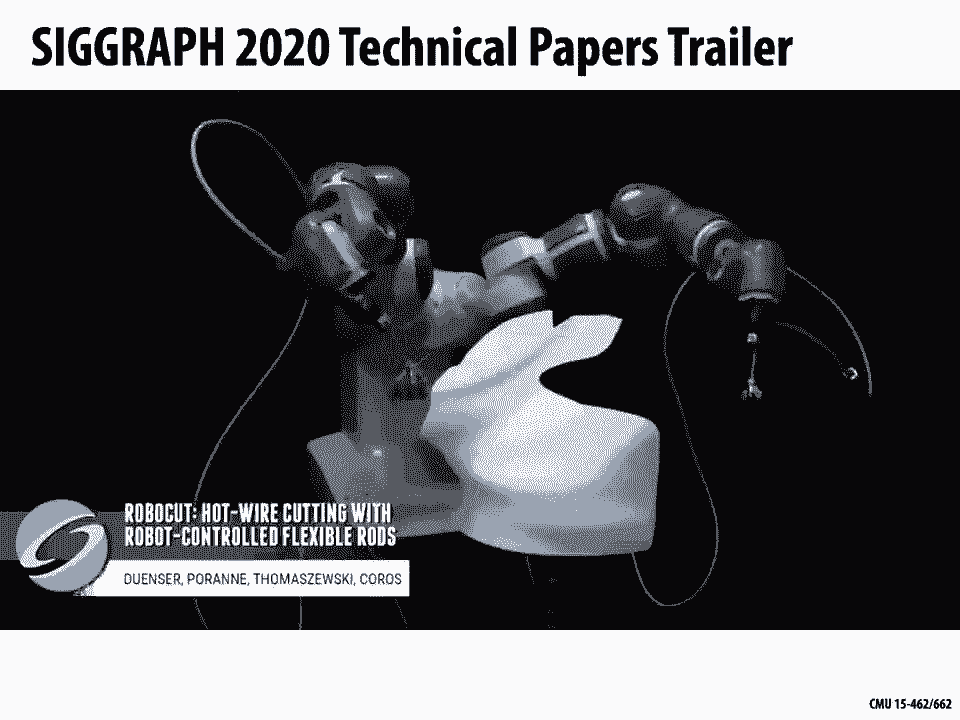

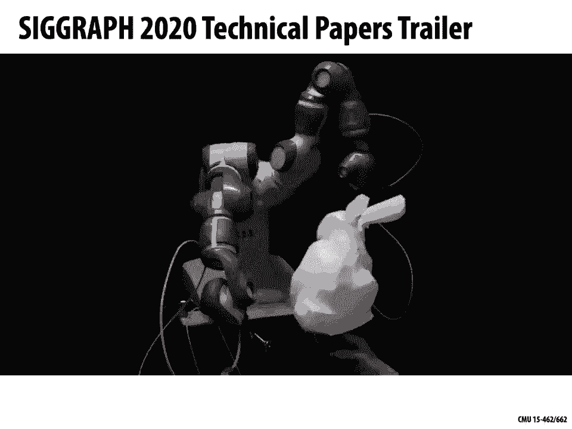

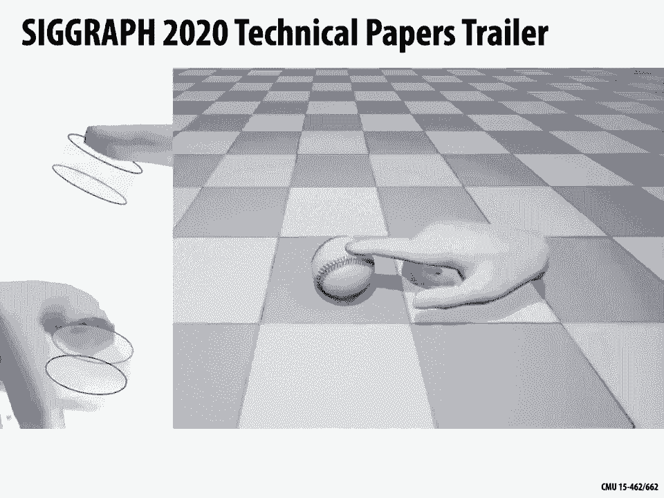

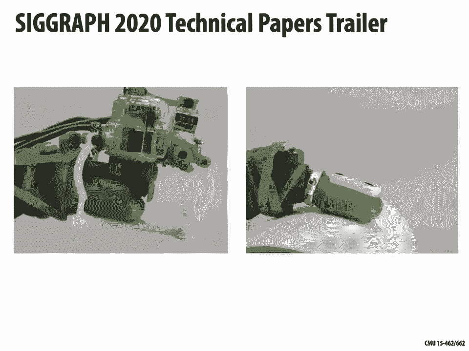

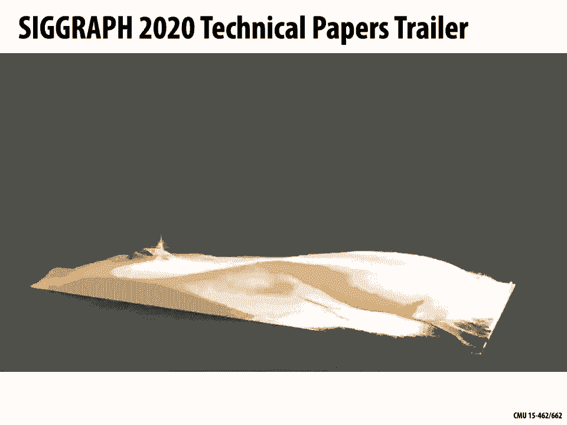

回顾最早的计算机，它们看起来像这样，这些巨大的机器占据了整个房间。与这些机器交互的方式非常原始，你可能需要在卡片上打孔，然后将其输入计算机进行计算，最后计算机再输出一张同样打了孔的卡片。显然，这需要大量时间来设置程序，也需要大量时间来解读结果，以理解计算机输出了什么。因此，你会想，一定有更好的方法来获取数字信息，使其以一种我们可以理解和消化的形式呈现。

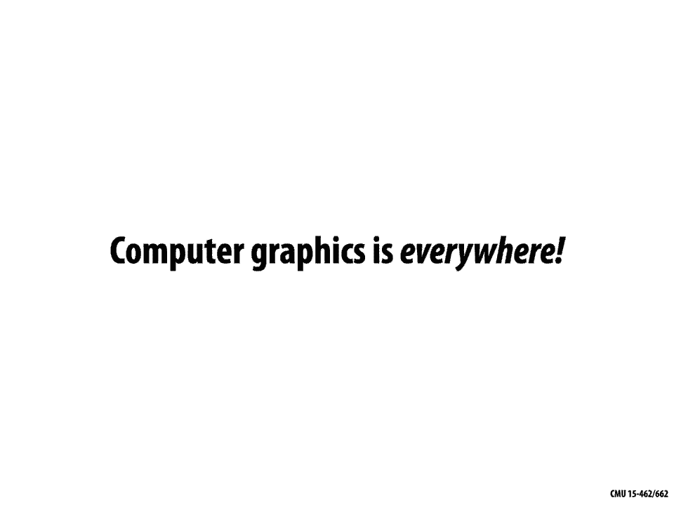

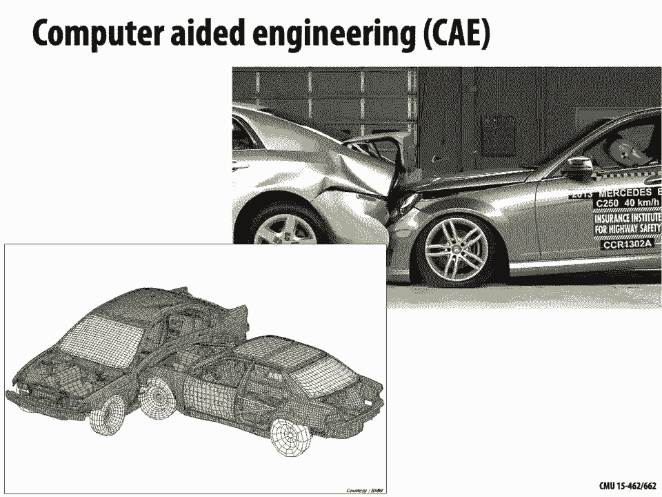

如果你开始审视计算的历史，你会发现随着时间的推移，人们很自然地倾向于使用某种视觉显示来传达机器存储或计算的信息。最终，我们达到了这样一个阶段：人们开始真正将显示和交互问题作为一个独立的研究课题来思考。这是最早有人真正开始思考计算机图形学和人机交互的例子之一。这是一个名为“画板”的演示，由伊万·萨瑟兰开发。我们播放一小段视频，看看如何以图形方式与计算机进行通信。我们在这里使用示波器，它很像电视机，但由计算机驱动。为了将信息输入计算机，我们必须以某种方式绘制，我们使用光笔。因此，人们确实开始思考如何将信息输入计算机，尤其是如何从计算机输出信息。

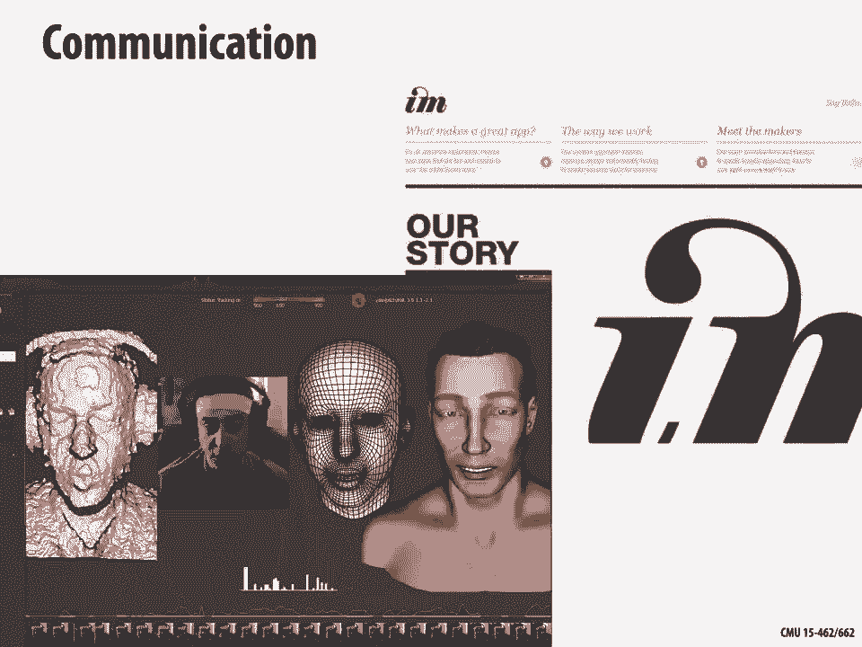

如果我们快进到2020年，显示技术已经发展到具有越来越高的分辨率和更丰富的色彩。我们不再只是从机器中获取一张带有少量信息的打孔卡片，而是现在可以在显示器上显示单个图像。一个8K显示器可能传达大约95兆字节的信息。因此，我们确实可以从机器中输出大量信息。如果我们开始关注即将出现的新设备，如虚拟现实头显、增强现实头显，这些设备需要我们提供海量信息来驱动它们。今天你可能购买的头显有两个显示器，每只眼睛一个，每个显示器的分辨率是2160 x 2160像素。它们有一定数量的比特来表示颜色，并且为了获得某种逼真的视觉再现，它们必须每秒显示90次图像。如果你做一个小小的计算，这意味着我们每秒从计算机输出大约2.3千兆字节的信息，这比计算技术诞生之初要多得多。

这里一个自然而然的问题是：为什么视觉信息如此重要？我们本可以尝试通过许多其他方式从机器获取信息，比如播放声音或产生某种振动。为什么我们在计算机科学和计算机图形学中如此专注于视觉信息？一个重要的原因是，这就是你的大脑的工作方式。大约30%的大脑专门用于视觉处理。因此，如果你从系统层面思考，你的眼睛就像是进入大脑的最高带宽端口。所以，如果你试图将信息从机器传递到你的大脑，进行视觉处理就非常有意义。

这或许解释了为什么计算机图形学得以发展，以及为什么它成为计算机科学中如此重要的一部分。我们至少可以尝试性地给出计算机图形学的定义：计算机图形学是什么？我们可能会说，计算机图形学是使用计算机合成视觉信息。我们拥有数字信息，即0和1，我们希望通过某种计算将其转化为人类可以消费的某种视觉信息。

如果我们这样定义，如果说其目的是为人类创造消费信息，那么很自然地会问：为什么只专注于视觉信息？当然，大脑拥有很强的视觉计算能力，但我们还可以做其他事情。事实上，自早期以来，图形学已经发展到关注比仅仅如何在高清显示器上开关像素更广泛的一系列问题和议题。因此，有人致力于模拟声音，从虚构或虚拟的三维模型生成声音；有人致力于合成或模拟触觉，以便你能感受到物体在物理现实中可能的感觉。因此，我们可以拓宽计算机图形学的定义，说我们真正感兴趣的是使用计算机来合成和操纵感官信息。你可以继续思考味觉、嗅觉和其他感官，这可能很有趣，但这里的关键词是“合成”。计算机图形学是计算机科学中一个独特的学科，它获取信息并合成感知刺激。还有其他学科，比如计算机视觉，研究的是逆问题：我有现实世界中的刺激，我想消费它们，解释它们，并将它们转换为数字信息。从这个意义上说，你可能认为计算机图形学和计算机视觉是彼此的逆过程。这两个学科的相互作用实际上非常重要，这是非常当代的。

超越在屏幕上显示像素的是将数字信息转化为我们可以体验的另一件事物，即物理实体。例如，在3D打印方面，计算机图形学有很多工作。我有一个数字模型，我想把它打印出来。在这里，我正一片一片地打印这只兔子，直到得到一个可以握在手中的实体物理模型。但这远不止3D打印。人们正在研究各种将数字模型转化为物理模型的不同方式，无论是将数字物体转化为食物、服装还是建筑。右下角的例子是一只出生时缺少一只脚的鸭子，有人扫描了它的另一只脚，在计算机上镜像，然后打印出来，制作了一个假肢。因此，利用计算机图形学的技术可以做很多有趣的事情，这些技术超越了图像生成，并开始对更广阔的世界产生重大影响。

因此，这将是我们本课程的工作定义：如何使用计算将数字信息转化为感官刺激。我想说，如果你和从事大量计算机图形学工作的人交谈，他们仍然会说，这个定义还是有点狭隘，它并没有真正涵盖计算机图形学中发生的所有有趣的事情。因此，如果你想很好地了解计算机图形学正在发生什么，一个很好的地方是ACM SIGGRAPH会议，每年都会在那里展示计算机图形学所有的新成果。有很多令人兴奋的新研究论文，他们制作了一个很好的技术论文预告片，重点介绍图形学中一些很酷的东西。让我们来看一下。

欢迎来到SIGGRAPH 2020技术论文预告片。我们将展示技术论文项目中一些令人兴奋的突破性成果的片段。一种基于学习的关键帧视频风格化方法使这位艺术家能够实时打造个人风格。通过使用四个鱼眼单色相机，我们可以在空间中追踪某人的手，使他们能够对这些积木进行分类并赢得游戏。利用巧妙的铰链设计，一个由薄柔性条组成的扁平晶格可以变形为复杂的三维结构，然后再次展平。为了创建逼真的针织兔子，该算法使用能量密度函数来驱动薄壳模拟器。它还可以通过插值稀疏的三维姿态序列来编织犰狳。该算法产生平滑复杂的运动，同时仍允许艺术控制。该算法支持浸入式气泡和自由表面流模拟器，产生饮水机熟悉的咕噜声。一种管理非线性可变形物体动力学的方法让我们可以将这个毛茸茸的弹性玩具弹到墙上。窄带网络可以通过去除外部阴影和模拟柔和的填充光来改善人像照片。高效耦合固体物体和湍流之间的相互作用让我们能够生成对抗网络和深度强化学习，帮助这个四足动物阿比盖尔找到惊喜。通过动画化各向同性和正交各向异性材料的动态断裂，我们可以撕下五花肉的表层。一种利用配置空间中的隧道的算法可以解决由纠缠刚性形状组成的复杂谜题。一种隐式建模合理人脸空间的方法让我们可以通过素描或合并现有部分来发现新面孔。通过规划其两个机器人手臂的运动，手持一根可变形热线，该设备可以切割复杂的三维形状，比如兔子。该系统测量我们在真实和模拟世界中感受到的力，然后通过指尖设备施加这些力，这样我们就能感受到我们看到的东西。这块土壤是由一种用于物理材料的大规模并行物质点方法模拟的。它也可以让犰狳发生碰撞。该算法让我们可以从新颖的视角观察我们的场景。这种技术模拟了大量带有摩擦的碰撞弹性体。因此，运行基于粒子的流体模拟方法让我们可以将神经纹理应用于流体，即使它们在移动时也可以。一种用于非线性固体和流体双向耦合的物质方法让我们可以绘制装满水和橙汁的墙壁。

希望从这些内容中，你能感受到计算机图形学确实是一个丰富多样的学科，它远远超出了仅仅在屏幕上开关像素，它触及了生活的各个不同领域。计算机图形学确实无处不在。我们很多人首先想到计算机图形学出现在娱乐领域，如电影和游戏中，这当然是计算机图形学的一个非常重要的用途。但即使在娱乐领域，它也出现在你可能甚至没有想到的地方。不仅仅是卡通动画，如今你去看的很多电影可能都有特效，这些特效如此之好，以至于你没有意识到它们的存在。它们可能是在去除皮肤皱纹，或者将某人插入一张旧照片中，而这个人实际上并不在那里，这有点可怕。

当然，计算机图形学如今在艺术和设计中也被大量使用。除了传统媒介，人们几乎总是在进行某种数字媒体绘画或建模等。同样，在工业设计中，你希望制造的产品不仅美观，而且具有特定的功能，因此你需要在美学方面与功能或工程方面进行平衡。这正是计算机图形学中人们研究的那类问题的核心：如何平衡物理和机械约束与美学考虑。同样，在进行工程尝试时，你可能只需要可视化数据，这是非常重要的事情。你进行汽车碰撞模拟，需要了解发生了什么。这些模拟中产生的数据量如此之大，以至于很难真正理解发生了什么，而可视化技术对此非常重要。建筑学正被计算机图形学的技术所革新，特别是被称为离散微分几何的领域，对于易于建造但仍能以非常自由形式设计的结构有很多见解。在科学和数学可视化中，你同样有大量可能来自某些高分辨率模拟的数据。计算机能够完成所有这些工作固然很好，我们能够构建解决如此大规模问题的系统固然很好，但一旦你解决了这些问题，人类如何解读答案呢？有太多的信息需要理解。同样，在医学或解剖学可视化中，我们有设备可以对身体进行非常详细的扫描。如何开发技术和算法，让你能够高效地查看所有这些数据并理解发生了什么？计算机图形学在导航、在世界中移动的方式中扮演着巨大角色，从简单的二维地图到更复杂的三维地图，再到自动驾驶汽车进行自动驾驶，或者像将不同游客拍摄的照片集合起来，以某种方式组装它们，让人们了解那个地方的样子等有趣的事情。你可以做很多有趣的事情。在通信方面，有些东西你不认为是计算机图形学，但需要一些相当惊人的技术。实际上，当你在阅读报纸或网站时，你在屏幕上看到的每一个字母，都需要一些相当复杂的算法来绘制所有这些字体，并且绘制得非常非常快。它就像魔法一样工作，你甚至没有意识到有一些复杂的算法在运行，因为人们在开发这项技术方面做得非常好，但它就在后台运行。同样，人们正在探索各种超越书面文字的新通信机制，比如虚拟化身，你可以坐在摄像头前，将自己变成三维模型。可能性是无穷无尽的。

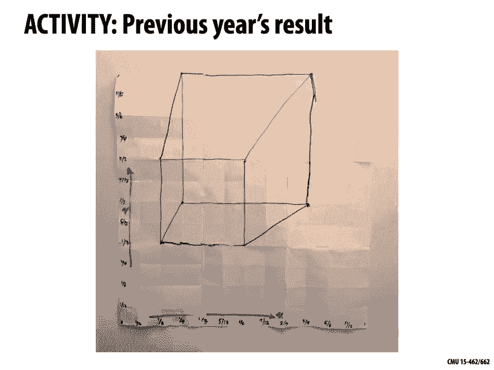

有这么多事情要做，我们在这门课中要做什么呢？我们真的要研究所有这些不同应用背后的计算基础。因为所有这些应用，无论你对哪个领域感兴趣，都需要复杂的理论和计算机系统的复杂处理。在理论类别中，我们将讨论诸如基本表示之类的东西：如何对形状或运动进行数字编码？本课程的一个大主题将是采样和混叠：如何获取信号并再现信号，以便你再现的东西忠实地代表你获取的东西？我们将大量讨论数值方法：如何数值地操纵信号？如何数值地解方程？在许多计算机科学教育中，重点是离散组合问题、处理整数等。这将是真正深入探讨你第一次真正动手体验，也许是大量使用浮点数表示数字，这可能有点棘手。我们将讨论辐射学和光传输：如何以非常精确的方式讨论光的颜色、亮度以及它在场景中的分布方式？这些问题对于尝试创建逼真的图像都非常重要。我们还将至少稍微联系到感知。请再次记住，目标是将数字信息转化为人类可以消费的刺激。如果是这样的话，那么理解人类如何感知视觉信息和其他刺激，将真正以重要的方式影响我们的算法。例如，如果我们说我们想压缩一张图像，以便人们不会注意到任何变化，我们真的必须了解一些人类心理学。在系统方面，如果我们想创建算法，将千兆字节的数据输出到VR头显，那么我们真的需要考虑性能，以及信息在我们的流水线中由不同进程和算法交换的方式。因此，我们将讨论诸如并行或异构处理之类的事情，这些可能是运行快速图形算法所需要的。我们将稍微讨论一下图形特定的编程语言，比如着色器语言。更一般地说，我们将讨论如何根据流水线来表述计算机图形学中的问题：将我们的问题分解成哪些基本元素是合适的，以便我们能够有效地通过硬件流式传输计算？

以上就是高层次概述。让我们真正深入探讨，动手解决一些具体问题。在本节课剩余的大部分时间里，我们将尝试思考如何建模一个三维物体，将其编码为数字信息，然后将该物体的数字编码转化为一张我们可以看的二维图片。特别是，我们将考虑一个非常简单的几何体：一个立方体。我们想生成一个看起来有点逼真的立方体绘图，并且我们希望以算法方式完成，而不仅仅是在纸上素描。因此，我们必须回答这两个关键问题：一个是建模问题，我们如何在计算机上描述或编码立方体？然后是一个渲染问题，“渲染”这个词在本课程中会经常出现。当我们说渲染时，我们指的是如何将数字描述转化为具体图片。那么，我们如何可视化我们的立方体模型？

为了让我们开始，这显然是一个简单的例子，但为了具体起见，假设我们有一个以三维空间原点（0， 0， 0）为中心的立方体。它是一个2x2x2的立方体，宽2，高2，深2。立方体的边将与X、Y和Z轴平行，是一种轴对齐的立方体。我们可能问的第一个问题是：我们已经编码了立方体吗？我们已经给出了立方体的描述，这相当精确。我们知道它在空间中的位置，知道它有多大，知道它的方向。但是，这个描述不能很好地推广。如果我们想开始描述其他物体，比如一张脸或一辆车，仅仅给出位置、大致大小和方向是不够的。为了最终制作它的图片并渲染它，我们还需要以某种方式编码关于形状的更详细信息。也许你可以思考一下，对于立方体，我能给出什么更明确的描述，真正详细说明它的几何形状是什么样子？

好吧，这是一个有点棘手的问题，有点抽象，但让我们试试这个。我们可以做的一件非常具体的事情是，首先，我们可以说出所有角点或立方体所有顶点的坐标。根据立方体的这个描述，我们应该能够找出它在空间中的八个角点位于哪里。那么，一个例子可能是什么？也许你想一想，其中一个角点的坐标是什么？你能想到任何一个吗？如果你思考一下，你会想，它是2x2x2，但以原点为中心，所以它的半径大概是1。那么，至少有一个角点会在（1， 1， 1），另一个可能在（-1， -1， -1），然后我们还有其他所有可能的符号组合。我们有三个坐标，每个坐标有两种可能的符号，2的3次方是8，所以我们得到了立方体的八个顶点。这里的重点是，对于立方体来说这很容易，而且对于立方体来说似乎几乎是不必要的。但是，如果我想传达一张脸或一辆车的形状，我也可以列出该形状上的一堆点。所以，这里的重点是，我们有一个可以推广到更有趣几何形状的描述。

但我们还没有完全完成。到目前为止，我们还没有一个真正捕捉立方体本质的描述。我们只有这八个漂浮在空间中的点。如果我只是向你展示这八个点，如果我现在将这些点渲染到一个二维画布上，可能很难看出这是一个立方体。我只会得到这八个点，它们位于一些奇怪的位置。那么，为了真正捕捉立方体，我可能还需要提供什么额外信息呢？这里有几个自然的选择。一个相当直接的方法是，我可以列出所有的边。我可以说，不仅知道八个角点在空间中的位置，还要知道哪些点通过立方体的边相互连接。指定这一点的一个简单方法是说，一条边有两个端点。所以，如果我有这八个点A到H，我将一条边指定为一对字母。例如，AB是一条边，CD是一条边，EF是一条边，等等。如果你愿意，可以暂停视频检查一下。你想检查什么？你如何知道我是否正确？对于这些边中的一条，你应该检查的是，当我从一个端点移动到另一个端点时，只有一个坐标发生变化。边与X、Y和Z轴对齐，这意味着当我从一个边的端点移动到另一个端点时，只有X坐标变化，或者只有Y坐标变化，或者只有Z坐标变化。但我相当确定这些是我立方体的所有正确边。

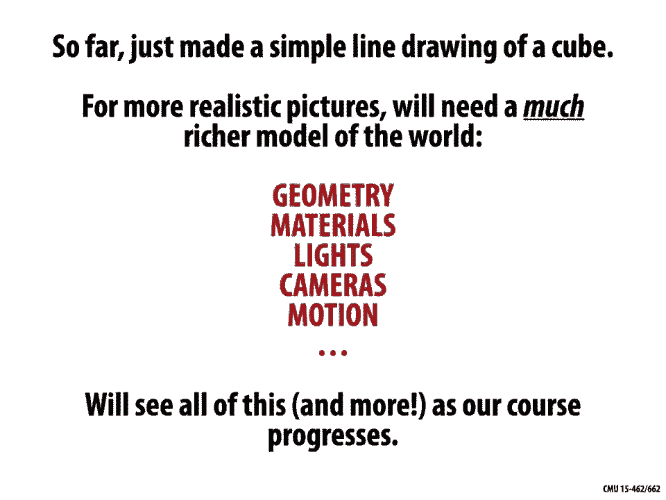

现在，我们有了立方体的数字描述。它不再是一个概念，不再只是一个词或字符串“立方体”，而是立方体非常非常明确的数字编码。如果我们愿意，我们可以一直将其编码为二进制数据，而不是幻灯片上看到的这些文本字符串。但这就是我们所说的几何或场景的数字编码。因此，我们基本上完成了建模任务。这有点麻烦，我们可能通常不希望以这种方式描述我们的模型。在本学期晚些时候，我们将看到如何构建工具，使我们能够更轻松地设计和建模三维物体。但现在，我们对立方体有了一个合理的数字描述。

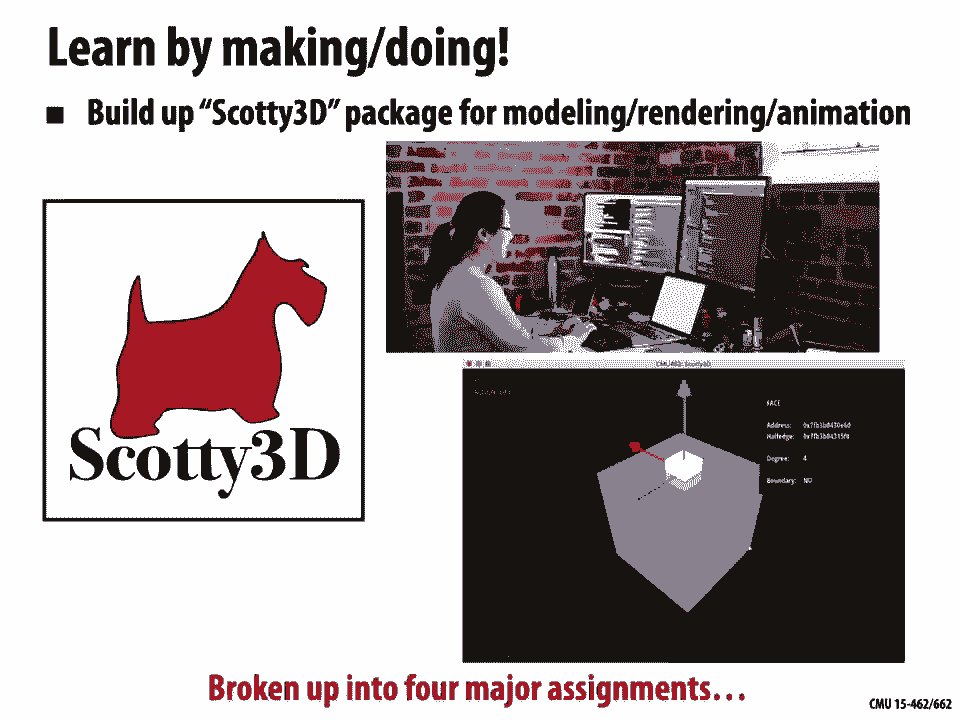

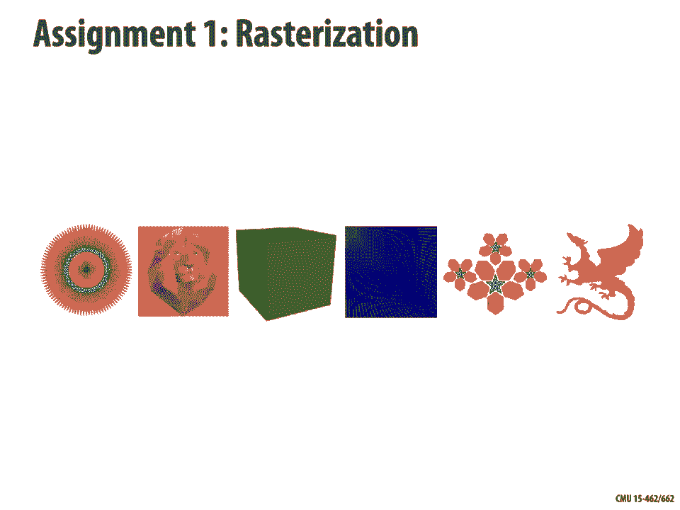

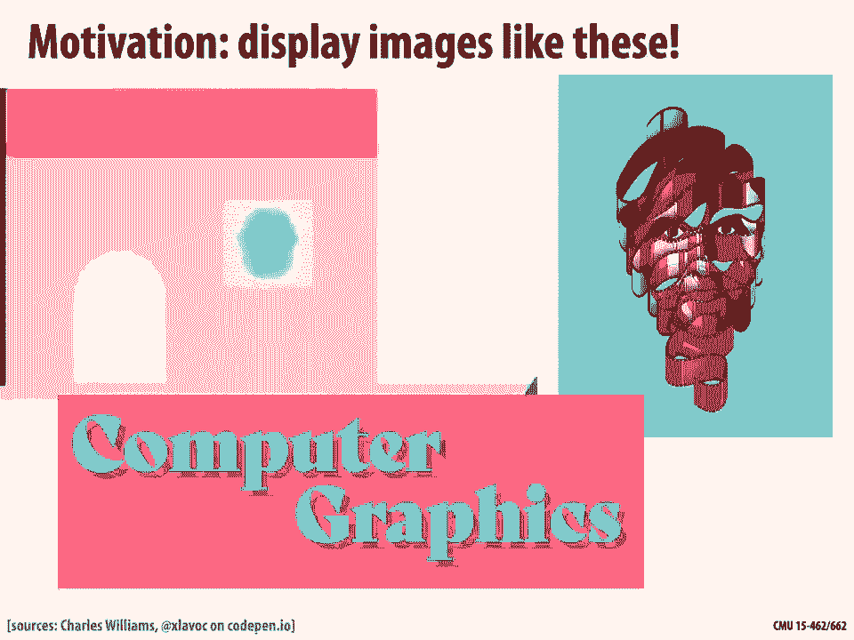

下一个问题是：我们如何将这个立方体绘制成平面的二维图像？我们如何渲染它？基本问题在于，每个顶点都有三个坐标，但如果我们想在二维纸上绘制它，我们需要二维坐标。那么，我们如何将这三个坐标转化为两个坐标？这就是我们基本的渲染问题。这里有很多可能性。首先，我们可以直接丢弃其中一个坐标。我们可以说，如果我想在二维平面上绘制一个三维点，我就直接丢弃Z坐标，只绘制X和Y。这样做可以，但如果我们这样做，我们并不能真正获得这个立方体的三维感。在那种情况下你会看到什么？假设我丢弃了Z坐标，将这些点投射到平面上，然后连接属于一条边的任何一对点，你只会看到一个正方形。这就像从侧面看立方体，但没有任何透视，这将是一个非常无聊的图像。所以我们想做点更有趣的事情。

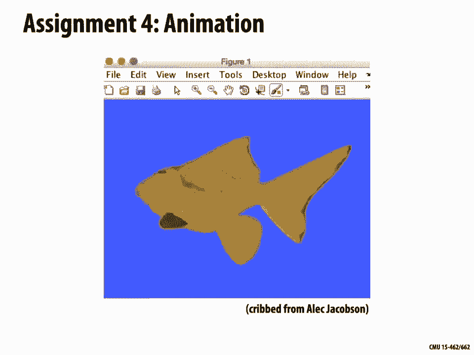

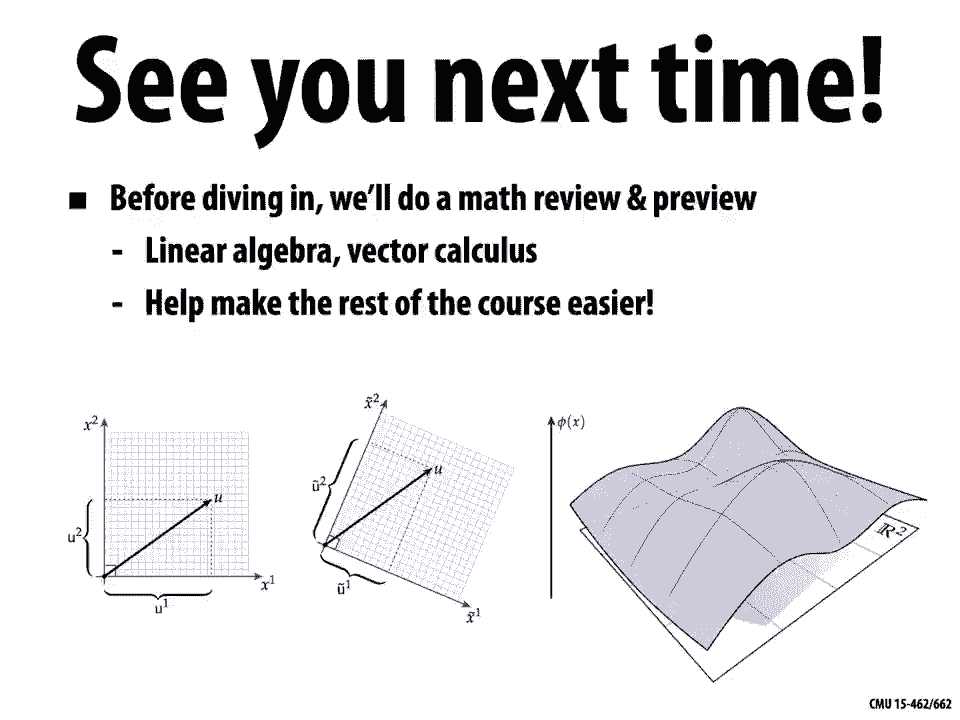

我们的基本策略是以某种有趣的方式将三维点映射到二维点。然后，我们将用直线连接这些二维点。这是一个算法吗？这真的是我们可以去实现的东西吗？还不完全是，因为它还没有真正分解成计算机知道如何执行的原子操作。但它是我们想要设计的算法的一个很好的草图。那么，让我们更详细地讨论一下这些步骤中的每一个将如何实现。第一个是透视投影。我们说过，仅仅丢弃一个坐标这个非常简单的想法不会给我们一个非常有趣的图像。我们想做的是捕捉我们从日常观察世界的经验中知道是真实的东西。我们从在世界上行走中知道的一件事是，物体离得越远，看起来就越小。这就是透视现象。这是如此自然的事情，以至于大多数人从未真正想过为什么会发生这种情况。为什么如果我看着市中心的一栋建筑，而我站在一个高山上，那栋建筑看起来非常小？难道那栋建筑真的缩小了吗？当我走到山顶时？不，我的意思是这很疯狂，那栋建筑没有改变。那么，为什么它看起来那么小？你有没有想过这个问题？让我们真正思考一下这个问题。理解正在发生什么的一种方法是考虑所谓的针孔相机模型。这实际上是一种你可以建造的真实相机。它的工作原理是，你可以想象你有一个内部完全黑暗的纸板箱，然后你戳一个非常小的洞让光线进入，在戳洞的对面放一张胶片。传统的胶片是一种感光材料，里面有卤化银晶体之类的。它的工作原理是，每次光线进入，每次光子击中胶片，都会引起化学反应，那些小晶体粘在相纸上。任何光线没有照射到的地方，晶体就不会粘住。然后你进入你的照片实验室，用某种特定的化学物质冲洗胶片，所有没有结晶的东西都被洗掉，所有粘住的东西留在相纸上。这真的是你的底片，它创造了通过那个孔照射进来的亮度或暗度的印象。这就是数字相机出现之前传统摄影的工作原理。所有这些化学过程和胶片如何工作并不是非常重要。我们想再次