# 计算机图形学：P4：向量微积分复习 📚

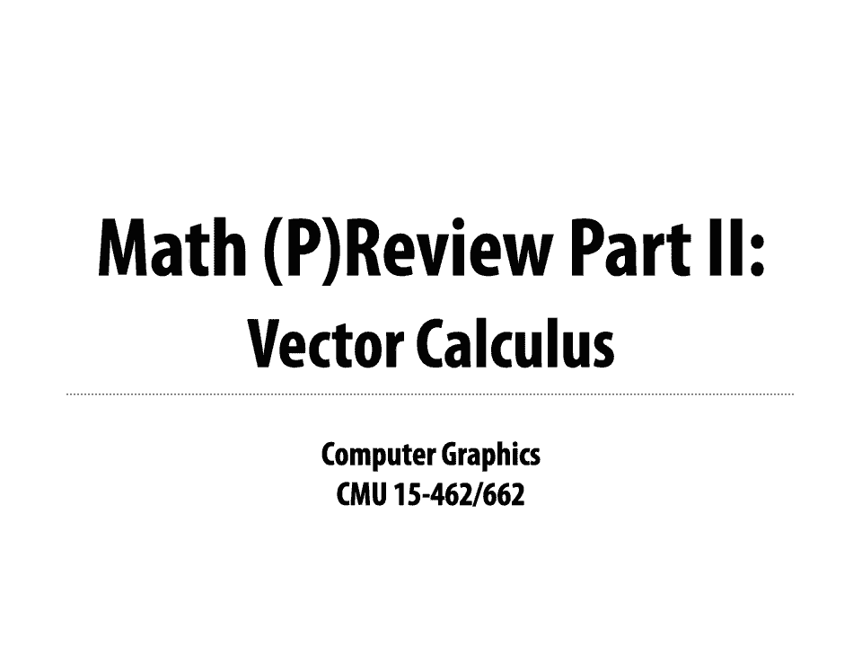

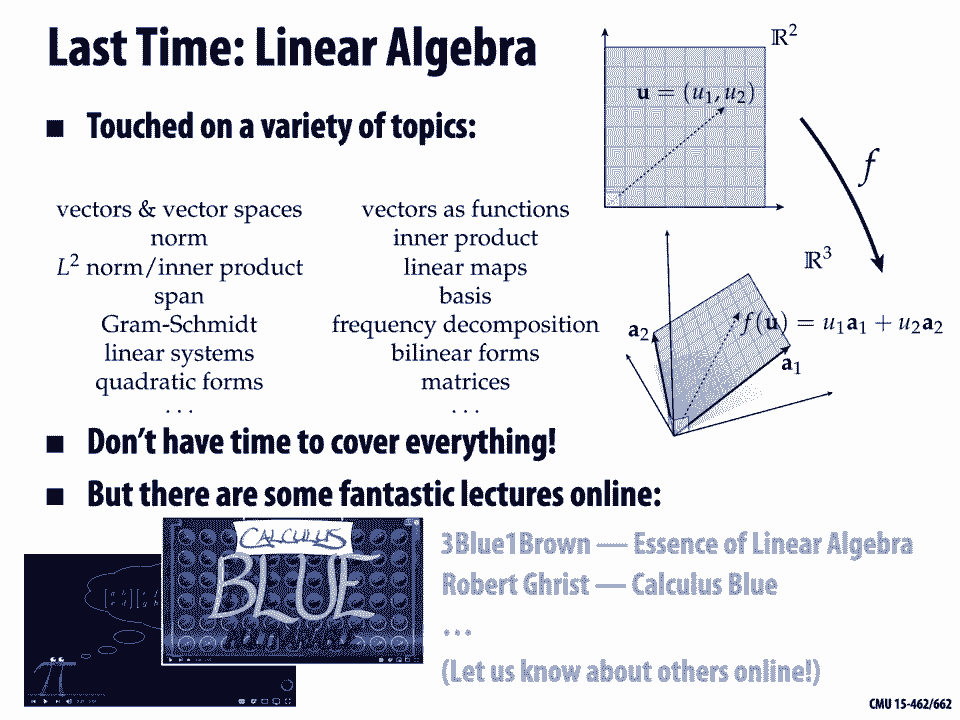

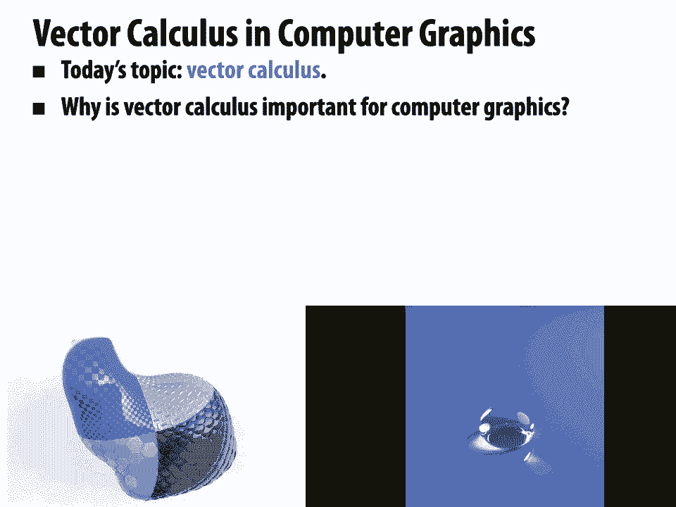

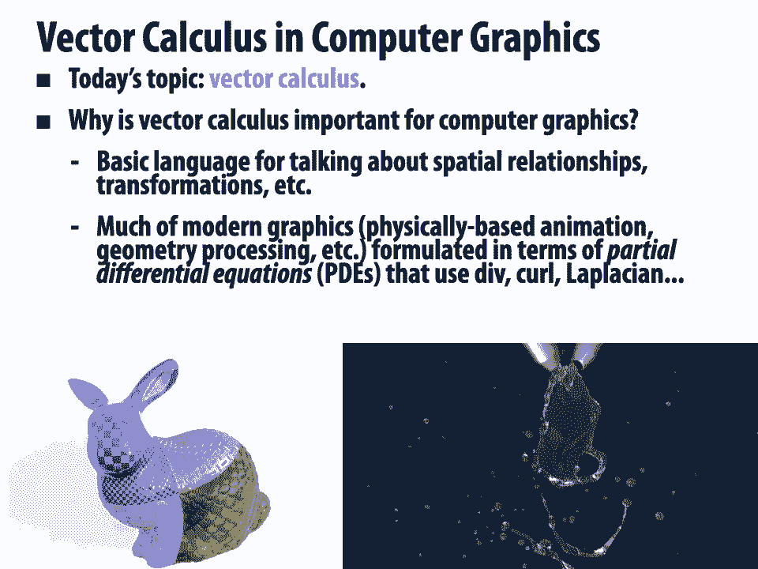

在本节课中，我们将复习向量微积分（或称多元微积分）的核心概念。这些数学工具对于理解计算机图形学中的空间关系、变化率、变换以及物理模拟至关重要。我们将从基本的向量运算开始，逐步深入到梯度、散度、旋度、拉普拉斯算子和海森矩阵等微分算子。

---

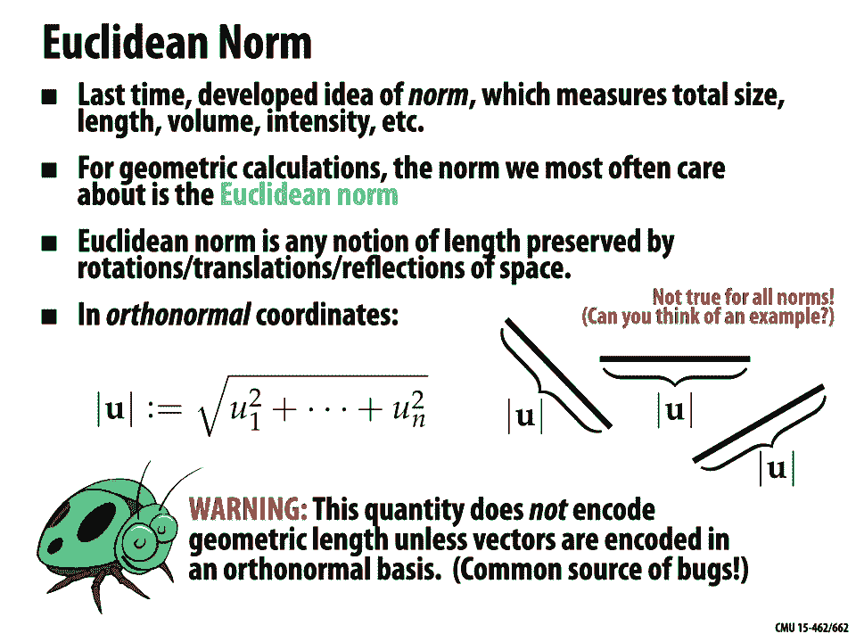

## 向量运算回顾 🔄

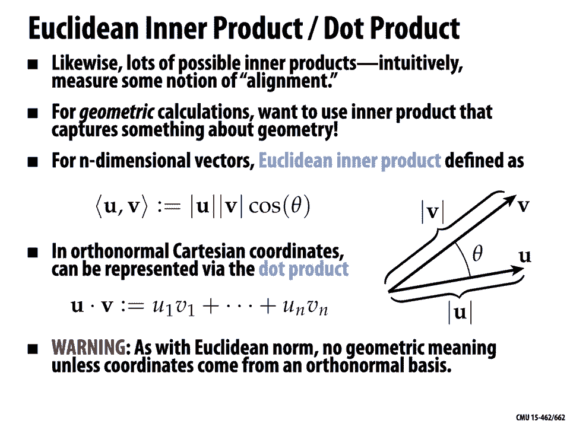

上一节我们介绍了线性代数的基础知识。本节中，我们来看看在几何背景下，向量运算的具体含义。

### 欧几里得范数

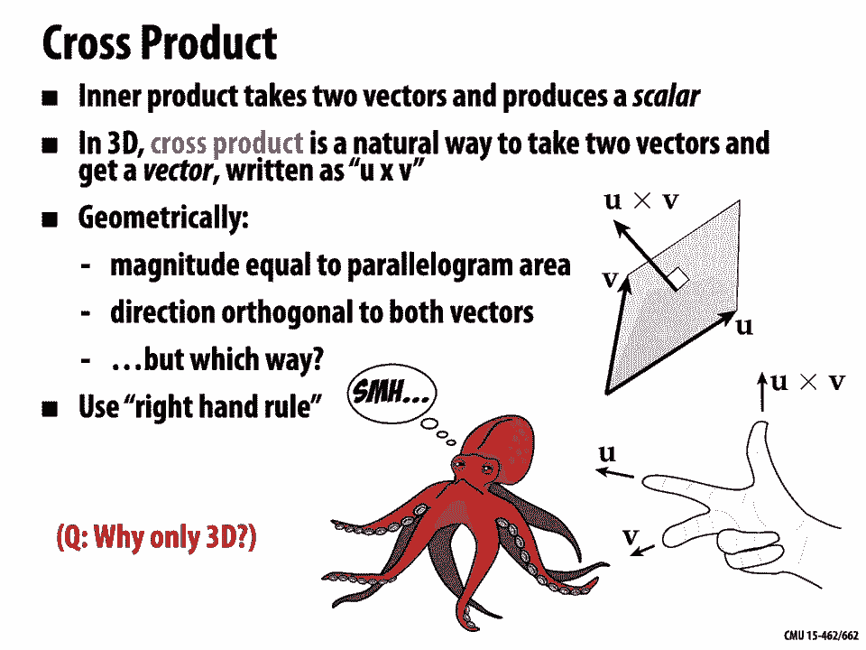

在几何计算中，我们最常关心的是**欧几里得范数**。它衡量的是向量的几何长度，并且这个长度在空间的刚性运动（旋转、平移、反射）下保持不变。在正交归一化基下，向量 **u** 的欧几里得范数可以写为：
\[
\| \mathbf{u} \| = \sqrt{u_1^2 + u_2^2 + \dots + u_n^2}
\]
**注意**：这个坐标表达式仅在向量表示在正交归一化基下时，才代表其几何长度。

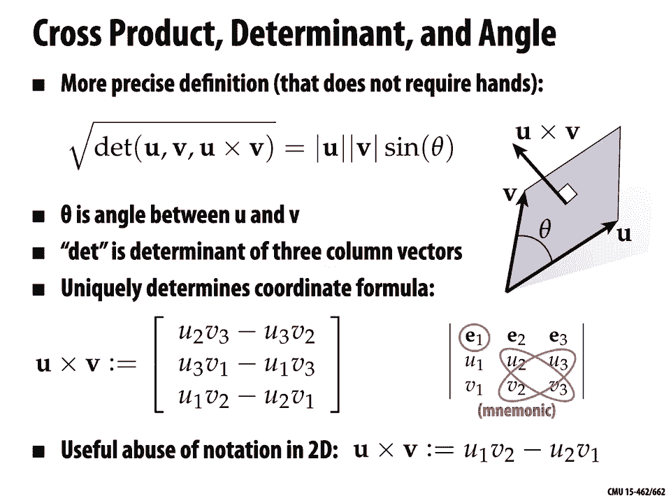

### 欧几里得内积（点积）

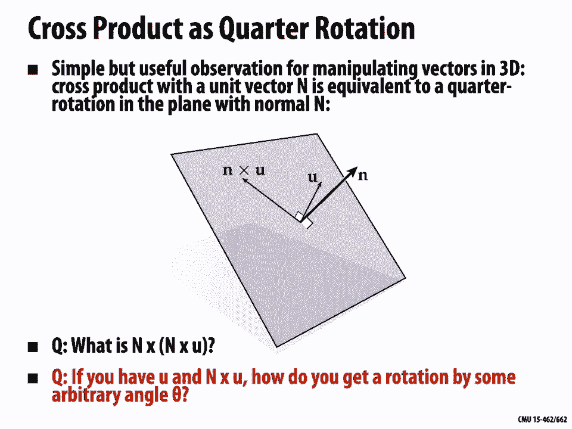

对于几何计算，我们使用欧几里得内积来衡量两个向量的对齐程度。它的几何定义不依赖于坐标：
\[
\langle \mathbf{u}, \mathbf{v} \rangle = \| \mathbf{u} \| \| \mathbf{v} \| \cos \theta
\]
其中 \(\theta\) 是两向量间的夹角。在正交归一化基下，这等价于点积：
\[
\mathbf{u} \cdot \mathbf{v} = \sum_{i=1}^{n} u_i v_i
\]
同样，此表达式仅在正交归一化基下才有几何意义。

### 叉积

叉积是三维空间特有的运算，它输入两个向量，输出一个向量：\(\mathbf{u} \times \mathbf{v}\)。
*   **几何意义**：结果向量的**大小**等于由 **u** 和 **v** 张成的平行四边形的**面积**。
*   **方向**：结果向量**正交**于 **u** 和 **v** 所在的平面。

方向由右手定则或行列式定义确定。在正交归一化基下，其坐标表达式为：
\[
\mathbf{u} \times \mathbf{v} = \begin{pmatrix}
u_2 v_3 - u_3 v_2 \\
u_3 v_1 - u_1 v_3 \\
u_1 v_2 - u_2 v_1
\end{pmatrix}
\]
一个有用的技巧是：与单位法向量 **n** 的叉积，等价于在垂直于 **n** 的平面内旋转90度。

---

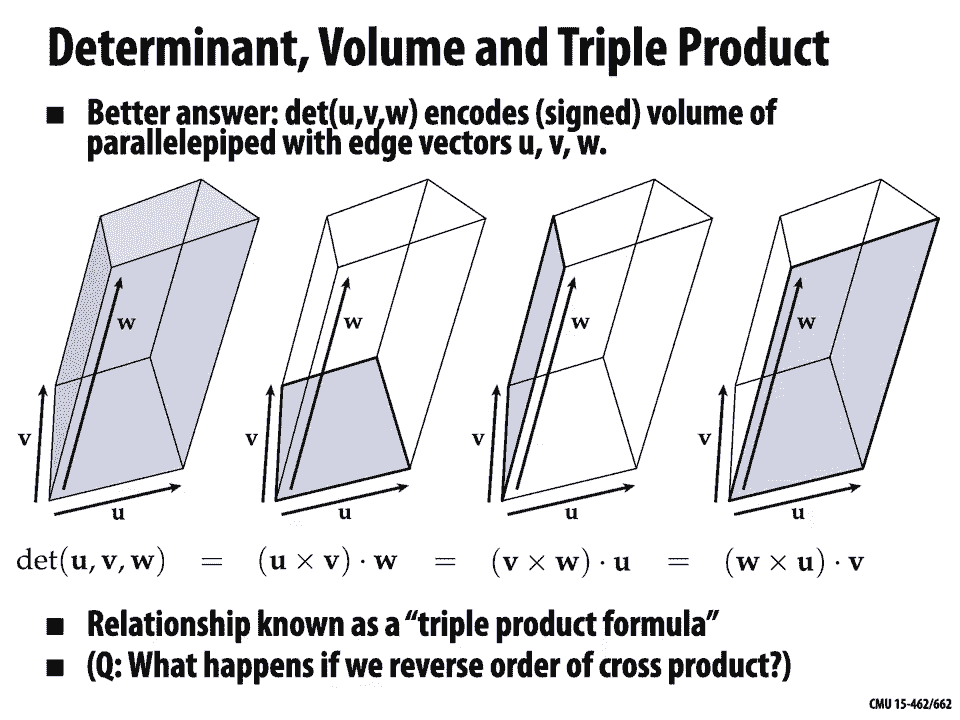

## 行列式与体积 📦

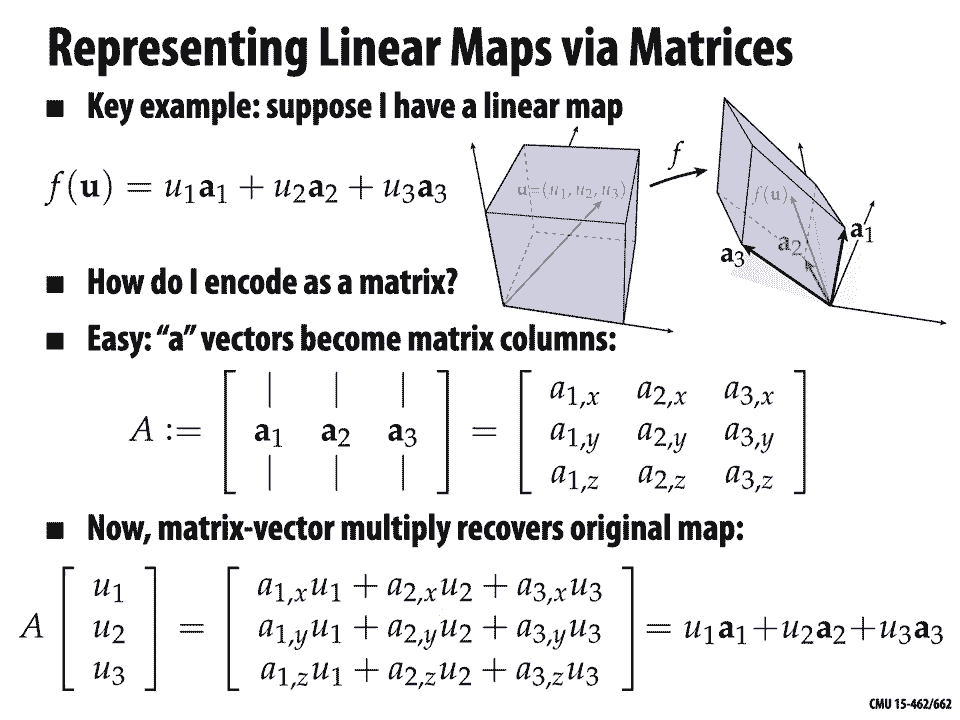

现在，让我们将视角转向行列式，并理解其深刻的几何意义。

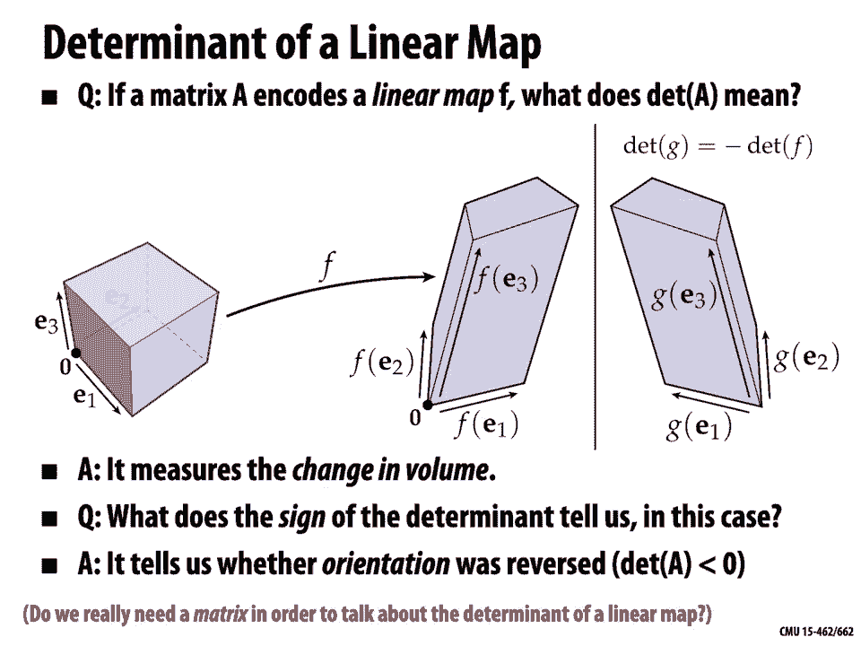

行列式在三维空间中有清晰的几何解释：三个向量 **u**, **v**, **w** 的行列式的绝对值，等于由它们张成的平行六面体的**体积**。其符号表示向量的**取向**（手性）。

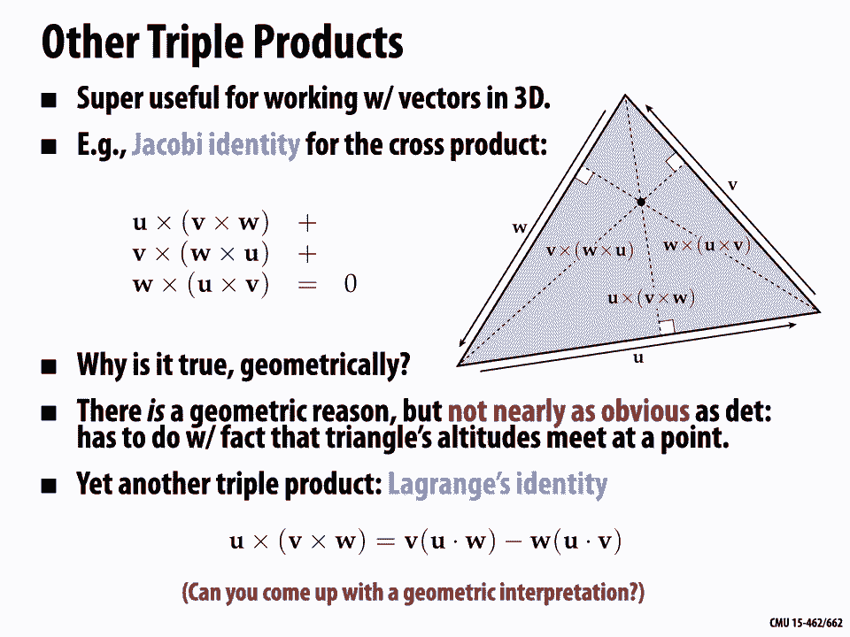

这通过**三重积公式**联系起来：
\[
\text{det}(\mathbf{u}, \mathbf{v}, \mathbf{w}) = \mathbf{u} \cdot (\mathbf{v} \times \mathbf{w}) = \mathbf{v} \cdot (\mathbf{w} \times \mathbf{u}) = \mathbf{w} \cdot (\mathbf{u} \times \mathbf{v})
\]
对于一个表示线性映射的矩阵 **A**，其行列式的绝对值表示该映射对单位体积的**缩放因子**。

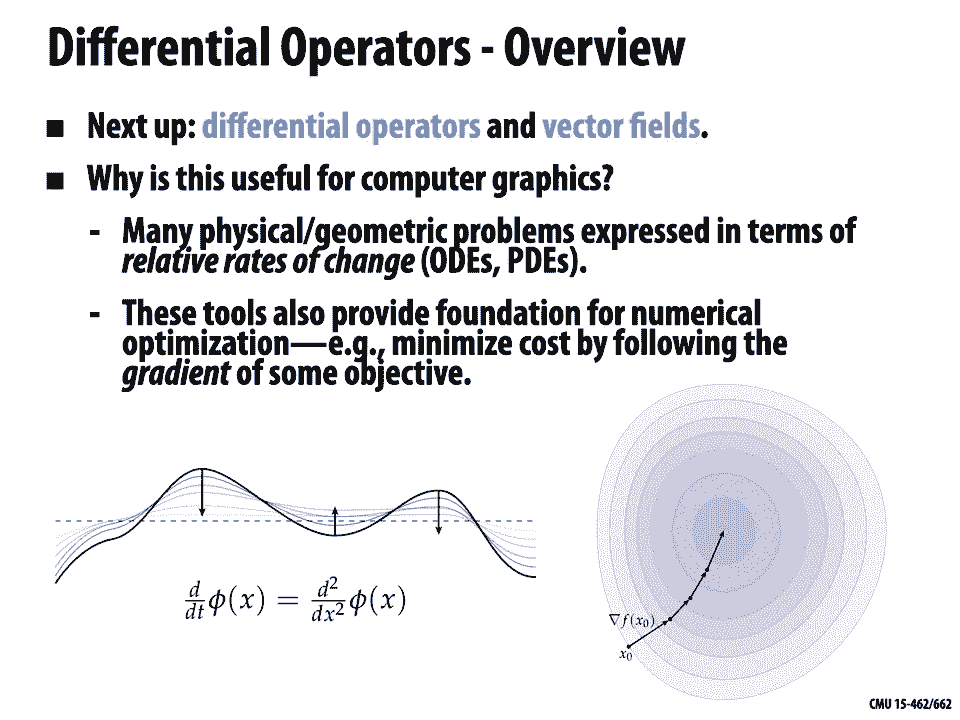

以下是几个有用的向量恒等式：
*   **标量三重积**：\(\mathbf{u} \cdot (\mathbf{v} \times \mathbf{w}) = \mathbf{v} \cdot (\mathbf{w} \times \mathbf{u}) = \mathbf{w} \cdot (\mathbf{u} \times \mathbf{v})\)
*   **向量三重积**：\(\mathbf{u} \times (\mathbf{v} \times \mathbf{w}) = \mathbf{v}(\mathbf{u} \cdot \mathbf{w}) - \mathbf{w}(\mathbf{u} \cdot \mathbf{v})\)
*   **雅可比恒等式**：\(\mathbf{u} \times (\mathbf{v} \times \mathbf{w}) + \mathbf{v} \times (\mathbf{w} \times \mathbf{u}) + \mathbf{w} \times (\mathbf{u} \times \mathbf{v}) = 0\)

---

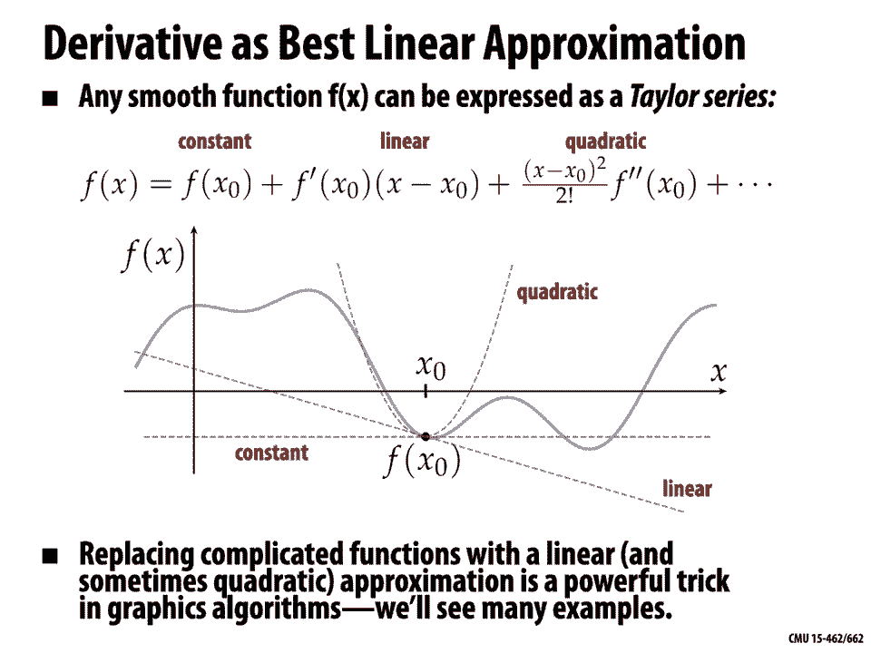

## 微分算子 🔍

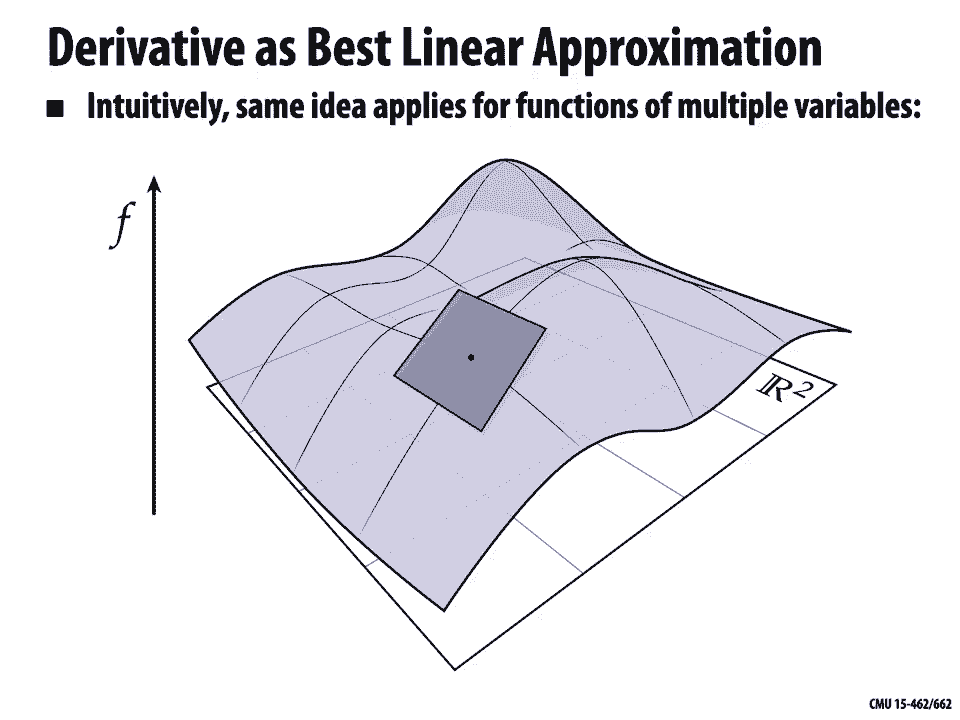

理解了静态的向量关系后，本节我们来看看如何描述向量场的变化率，这些是物理模拟和几何处理的核心。

微分算子为我们提供了描述变化率的语言，广泛应用于求解偏微分方程和数值优化中。

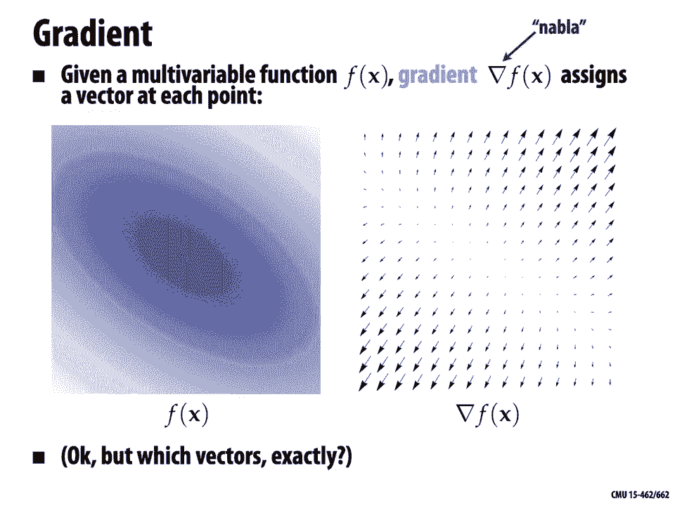

### 方向导数与梯度

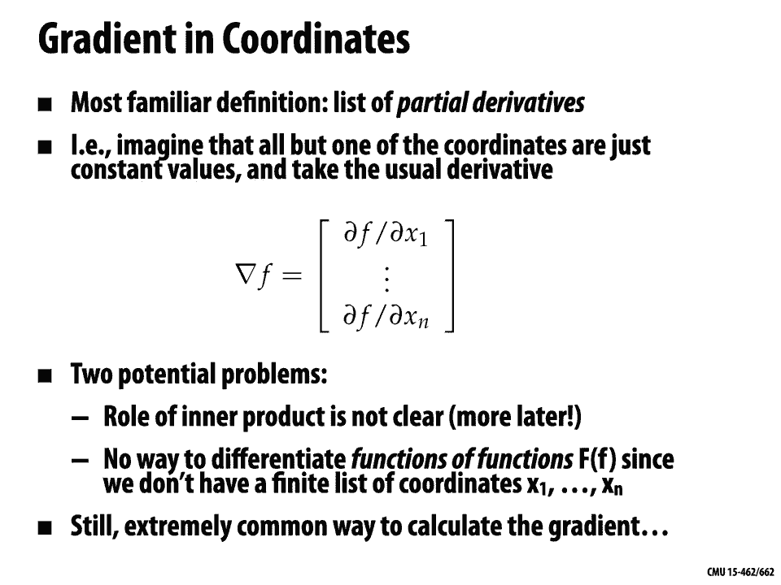

对于多元函数 \(f: \mathbb{R}^n \to \mathbb{R}\)，在点 \(\mathbf{x}_0\) 沿方向 \(\mathbf{u}\) 的**方向导数**定义为：
\[
D_{\mathbf{u}} f(\mathbf{x}_0) = \lim_{\epsilon \to 0} \frac{f(\mathbf{x}_0 + \epsilon \mathbf{u}) - f(\mathbf{x}_0)}{\epsilon}
\]
**梯度** \(\nabla f\) 是一个向量场，它包含了函数在所有方向上的变化信息。梯度方向是函数值**上升最快**的方向。
*   **坐标定义**：\(\nabla f = \left( \frac{\partial f}{\partial x_1}, \frac{\partial f}{\partial x_2}, \dots, \frac{\partial f}{\partial x_n} \right)^\top\)
*   **与方向导数的关系**：\(D_{\mathbf{u}} f = \nabla f \cdot \mathbf{u}\)
*   **线性近似的观点**：\(f(\mathbf{x}) \approx f(\mathbf{x}_0) + \nabla f(\mathbf{x}_0) \cdot (\mathbf{x} - \mathbf{x}_0)\)

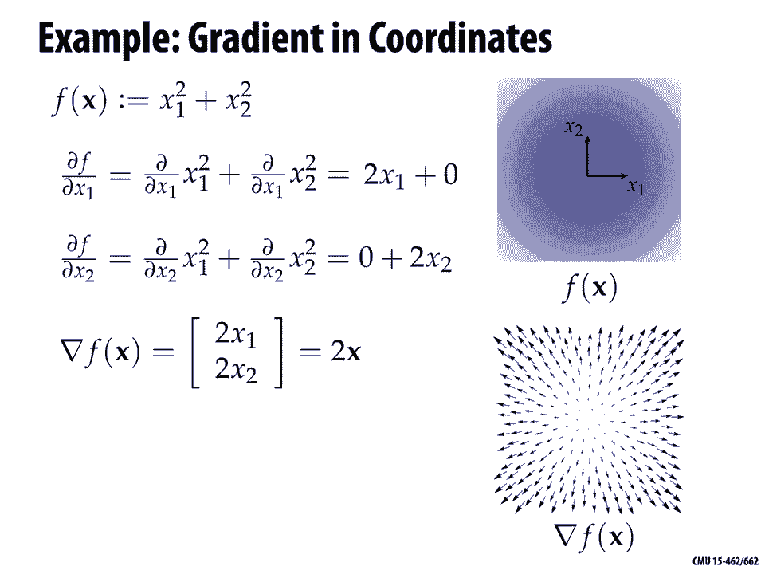

### 矩阵与函数的梯度

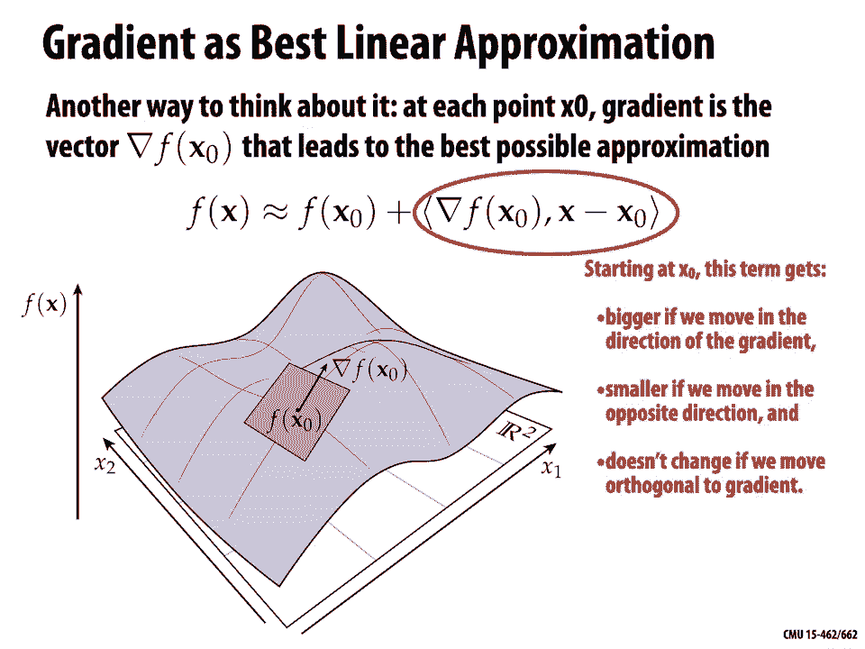

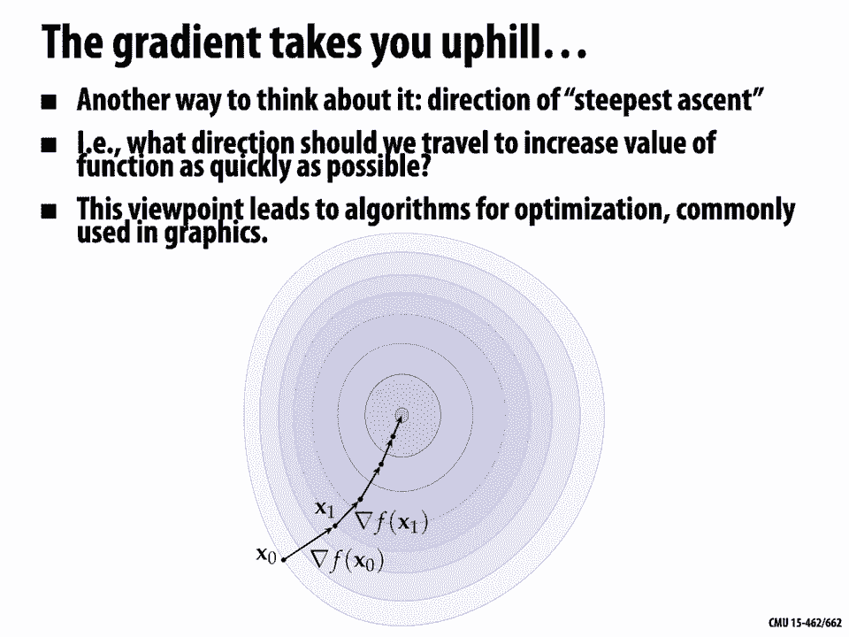

梯度计算可以推广到更抽象的对象。例如：
*   对于 \(f(\mathbf{x}) = \mathbf{x}^\top \mathbf{y}\)，有 \(\nabla_{\mathbf{x}} f = \mathbf{y}\)。
*   对于 \(f(\mathbf{x}) = \mathbf{x}^\top \mathbf{x}\)，有 \(\nabla_{\mathbf{x}} f = 2\mathbf{x}\)。

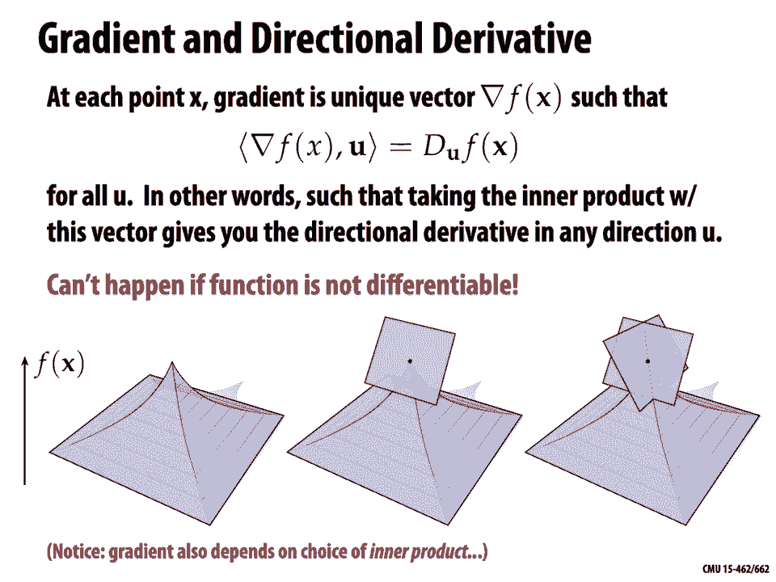

甚至对于“函数的函数”（泛函），如 \(F(f) = \langle f, g \rangle_{L^2} = \int f g\)，其“梯度”为 \(\nabla F = g\)。这表明处理更复杂对象的微分时，其核心模式与普通微积分相似。

---

## 向量场的导数：散度与旋度 🌪️

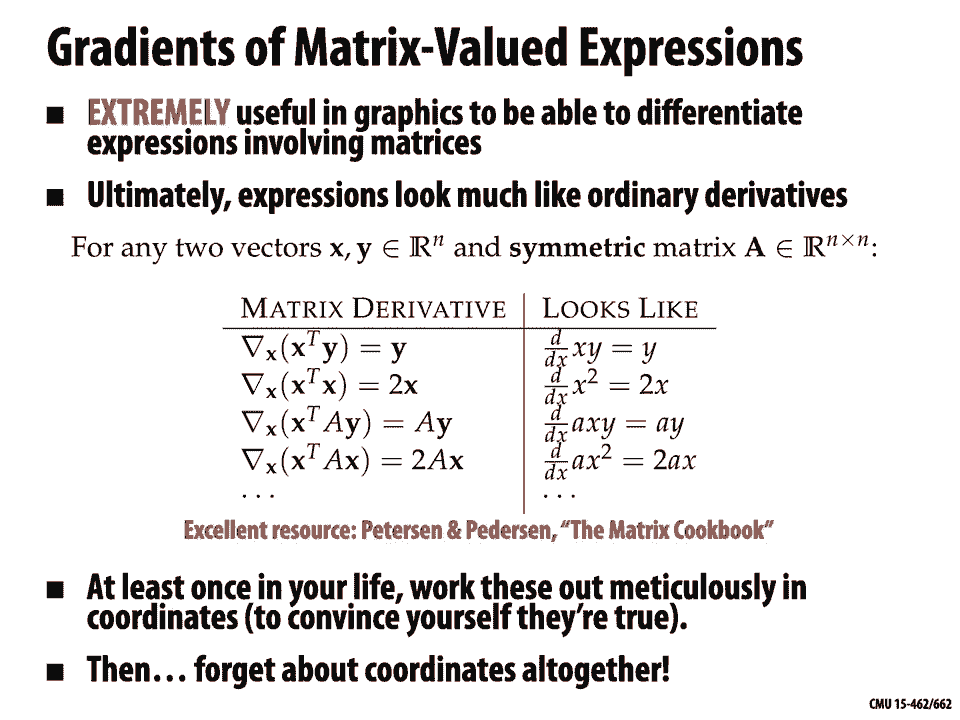

对于向量场 \(\mathbf{X}: \mathbb{R}^n \to \mathbb{R}^n\)，我们有两种基本的导数。

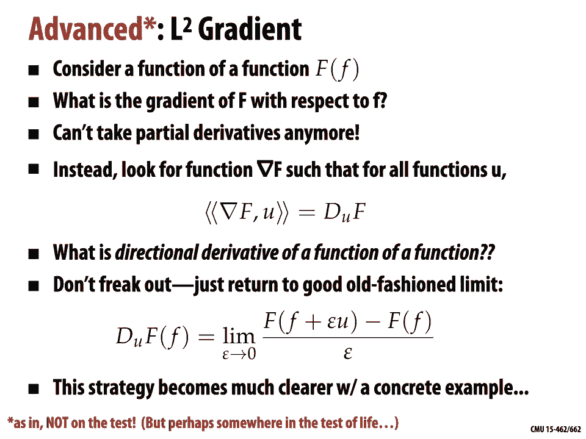

### 散度

散度 \(\nabla \cdot \mathbf{X}\) 衡量向量场在某点是“源”（发散）还是“汇”（汇聚）。
*   **直观理解**：想象流体的流动，散度为正表示流体从该点流出，为负表示流入。
*   **坐标定义**（在 \(\mathbb{R}^n\)）：\(\nabla \cdot \mathbf{X} = \sum_{i=1}^n \frac{\partial X_i}{\partial x_i}\)
*   **输出**：**标量场**。

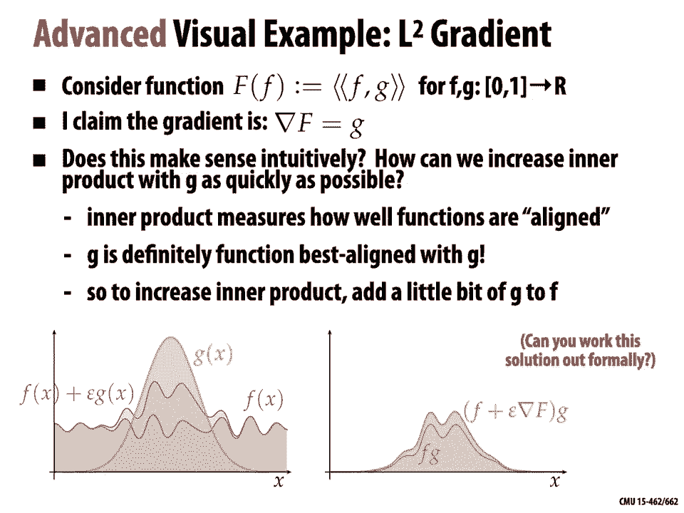

### 旋度

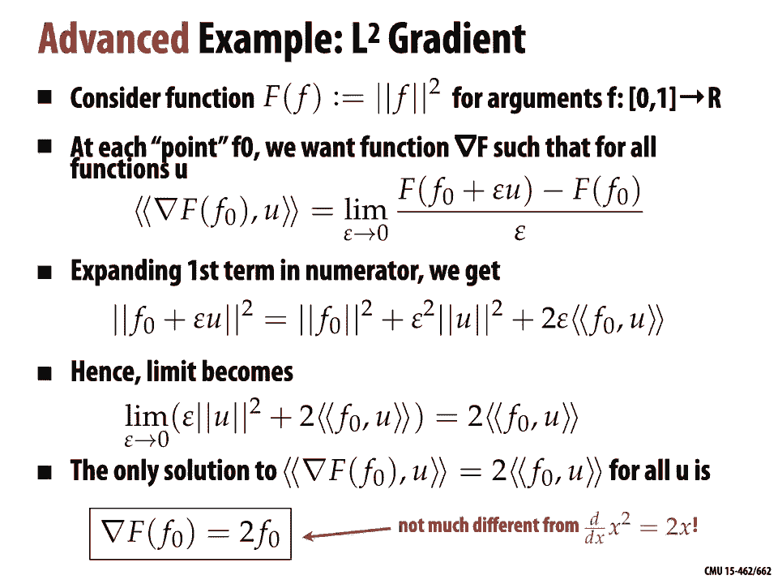

旋度 \(\nabla \times \mathbf{X}\) 衡量向量场在某点的**旋转强度**和**方向**。
*   **直观理解**：想象流体的漩涡，旋度的大小表示旋转的强弱，方向由右手定则确定（垂直于旋转平面）。
*   **坐标定义**（在 \(\mathbb{R}^3\)）：
    \[
    \nabla \times \mathbf{X} = \left( \frac{\partial X_3}{\partial x_2} - \frac{\partial X_2}{\partial x_3},\ \frac{\partial X_1}{\partial x_3} - \frac{\partial X_3}{\partial x_1},\ \frac{\partial X_2}{\partial x_1} - \frac{\partial X_1}{\partial x_2} \right)^\top
    \]
*   **输出**：**向量场**（在3D中）。
*   **二维旋度**：常指上述结果的第三个分量，是一个标量场，表示垂直于平面的旋转。

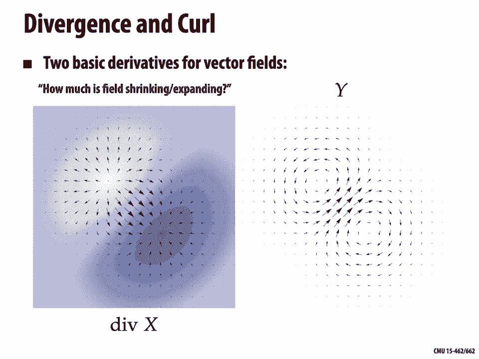

在二维中，一个有趣的联系是：一个向量场的散度，等于将该场旋转90度后所得向量场的旋度。

---

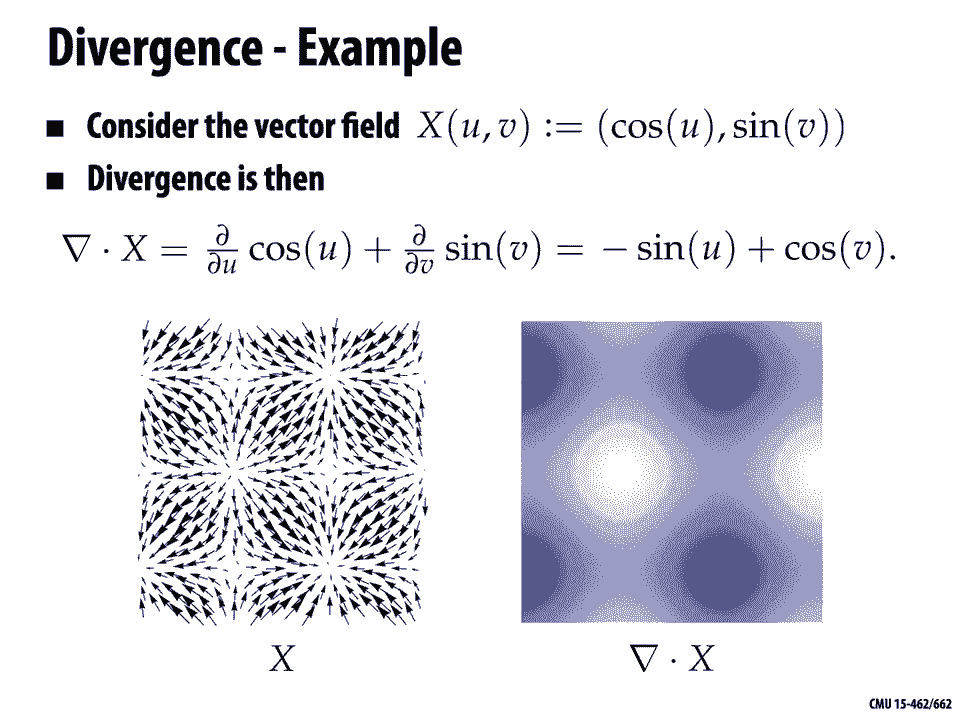

## 拉普拉斯算子 Δ 📐

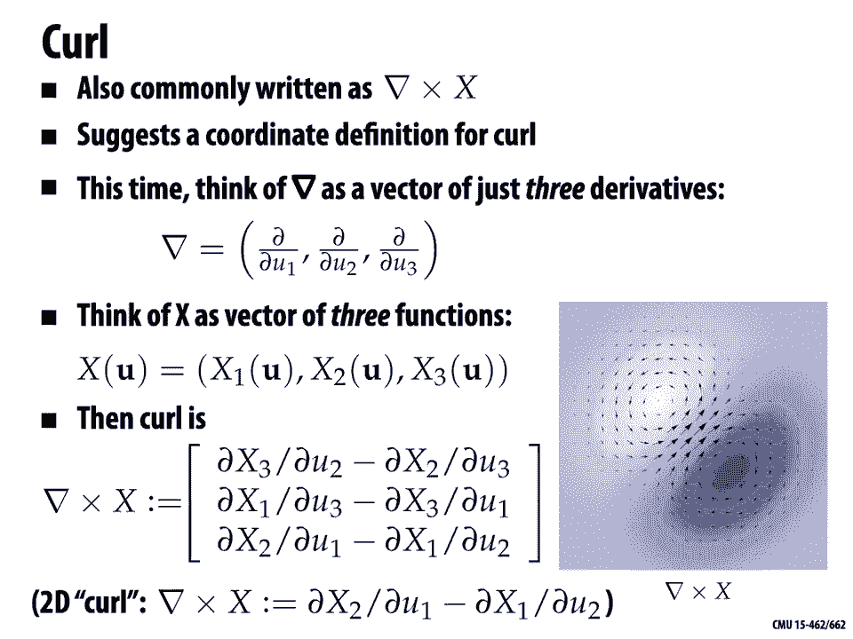

拉普拉斯算子是图形学中无处不在的核心算子，用于描述函数的“平均曲率”或“平滑度”，是模拟热传导、波动等现象的基础。

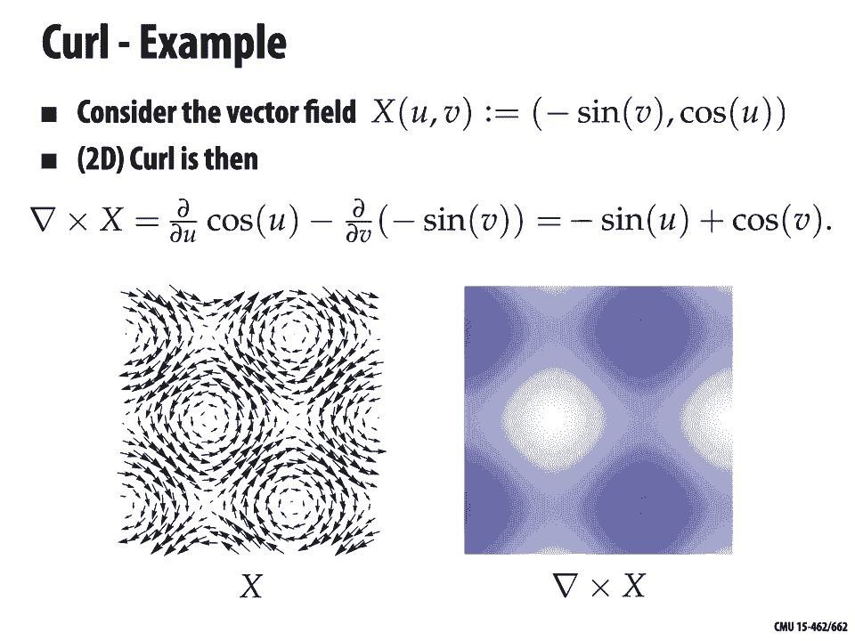

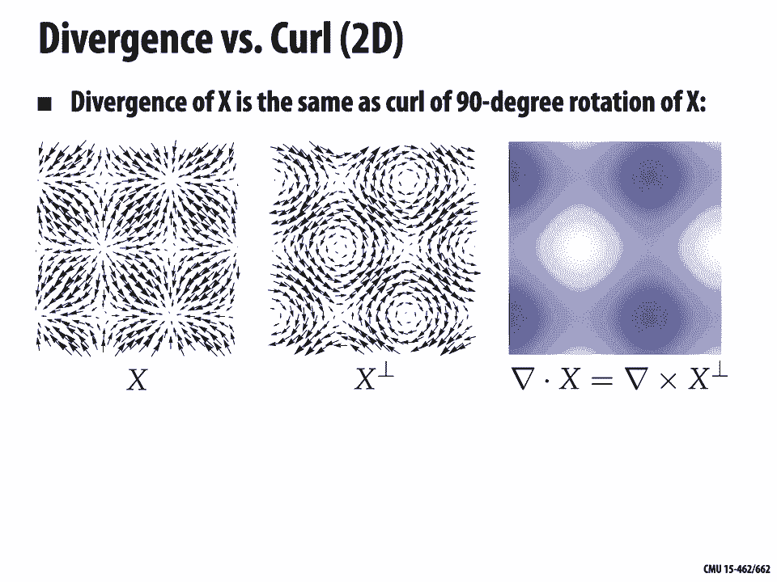

拉普拉斯算子 \(\Delta f\) 作用在标量函数上，输出另一个标量函数。它是一个线性算子。
*   **多种等价定义**：
    1.  **梯度的散度**：\(\Delta f = \nabla \cdot (\nabla f)\)
    2.  **二阶偏导和**：\(\Delta f = \sum_{i=1}^n \frac{\partial^2 f}{\partial x_i^2}\)
    3.  **狄利克雷能量的梯度**：\(\Delta f = -\nabla \left( \frac{1}{2} \| \nabla f \|^2 \right)\) （在 \(L^2\) 内积下）
    4.  **与邻域平均的偏差**：在离散网格上，\(\Delta f\) 近似于“邻居值的平均”减去“中心值”。
*   **直观意义**：在一点处，拉普拉斯算子值为正，说明该点函数值低于其周围平均值（如山谷底部）；为负则说明高于周围平均值（如山峰顶部）。

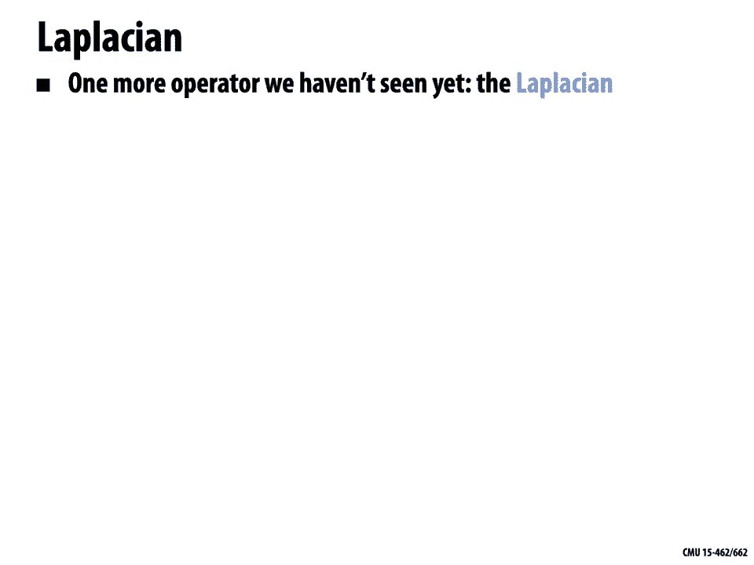

---

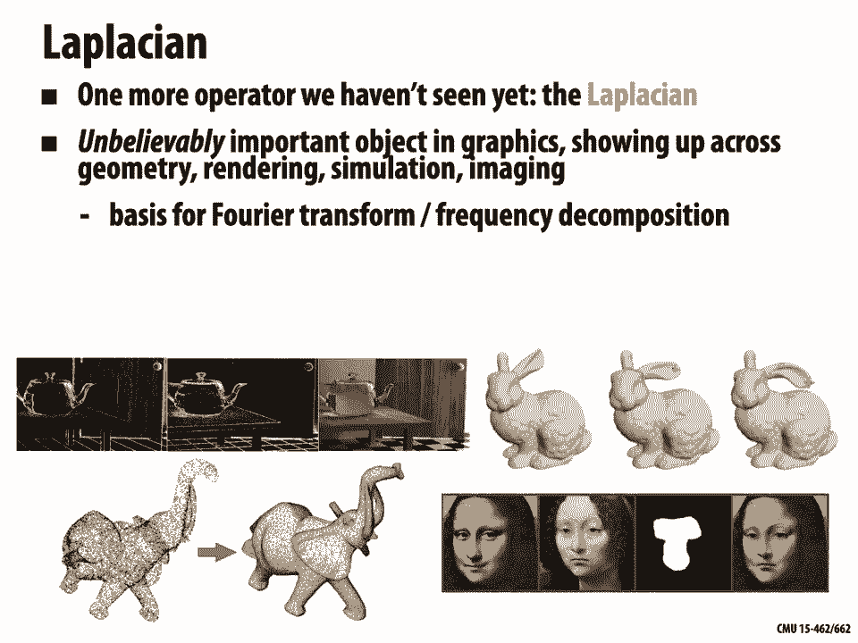

## 海森矩阵 ∇² 📈

最后，我们介绍海森矩阵，它包含了函数的所有二阶导数信息，对于构建局部二次近似和设计高级优化算法至关重要。

海森矩阵 \(\nabla^2 f\) 是函数 \(f: \mathbb{R}^n \to \mathbb{R}\) 的二阶导数矩阵。
*   **定义**：它是一个 \(n \times n\) 的对称矩阵，其第 \((i, j)\) 项为 \(\frac{\partial^2 f}{\partial x_i \partial x_j}\)。
*   **作用**：对向量 \(\mathbf{u}\) 应用海森矩阵，得到的是梯度在方向 \(\mathbf{u}\) 上的方向导数：\((\nabla^2 f) \mathbf{u} = D_{\mathbf{u}} (\nabla f)\)。
*   **在泰勒展开中的应用**：函数在点 \(\mathbf{x}_0\) 附近的二阶泰勒展开为：
    \[
    f(\mathbf{x}) \approx f(\mathbf{x}_0) + \nabla f(\mathbf{x}_0)^\top (\mathbf{x} - \mathbf{x}_0) + \frac{1}{2} (\mathbf{x} - \mathbf{x}_0)^\top [\nabla^2 f(\mathbf{x}_0)] (\mathbf{x} - \mathbf{x}_0)
    \]
    这给出了函数在局部的最佳二次近似。

---

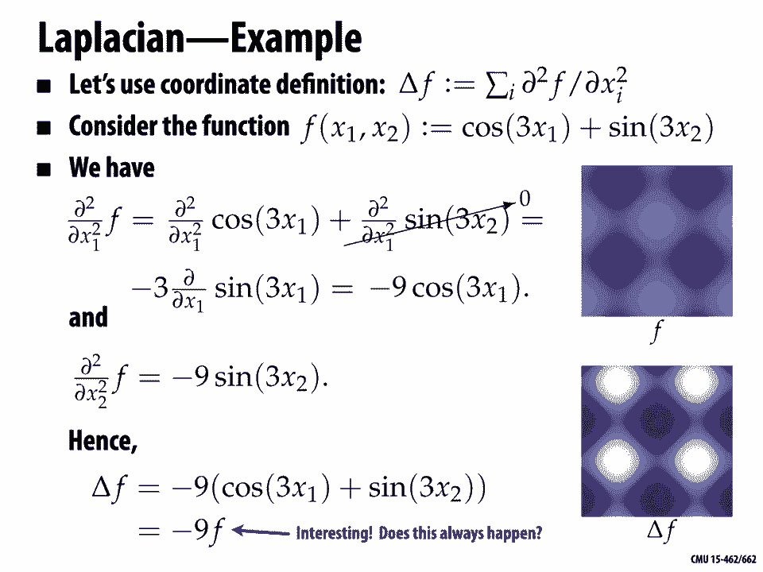

## 总结 🎯

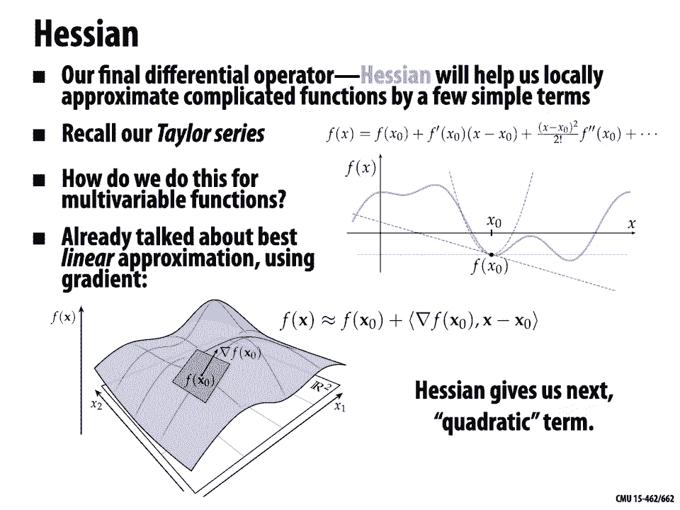

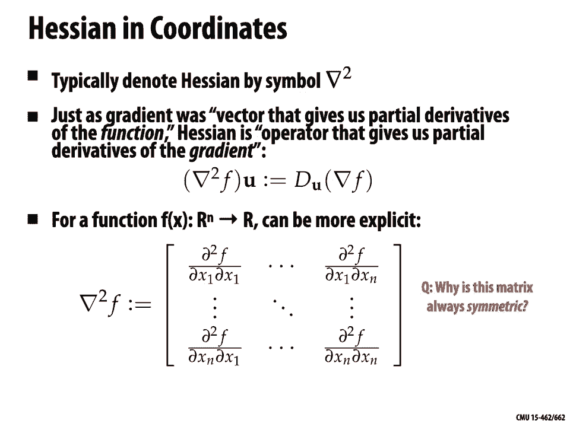

本节课中我们一起学习了向量微积分的关键内容：
1.  **几何向量运算**：欧几里得范数、内积（点积）和叉积的几何意义与坐标表示。
2.  **行列式**：其几何解释是体积（或面积），并通过三重积与点积、叉积关联。
3.  **梯度**：描述了多元函数增长最快的方向，是方向导数的汇集，也是线性近似的核心。
4.  **散度与旋度**：分别描述了向量场的“源汇”特性和“旋转”特性。
5.  **拉普拉斯算子**：衡量函数的曲率或平滑度，是许多物理过程（如扩散、波动）的数学基础。
6.  **海森矩阵**：包含了函数的所有二阶信息，用于构建二次近似和进行二阶优化。

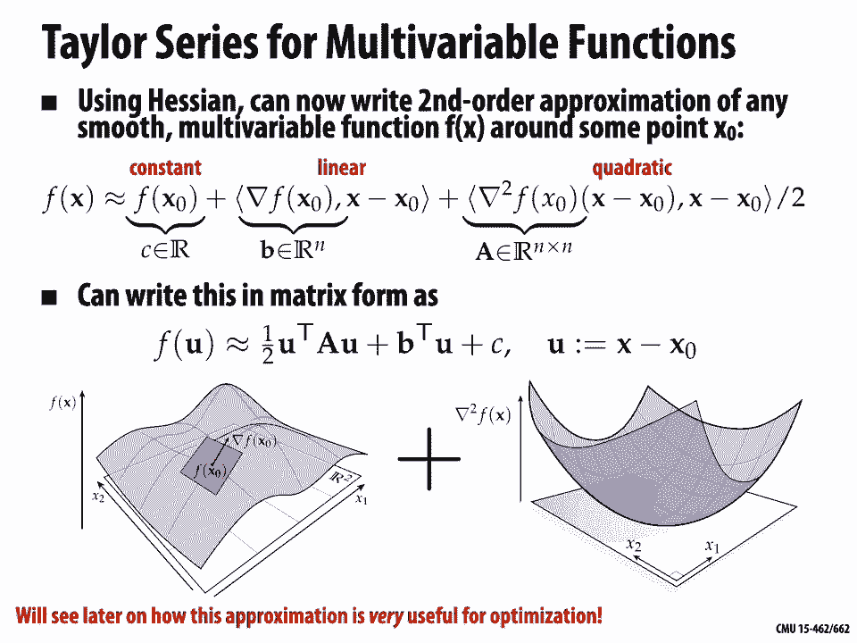

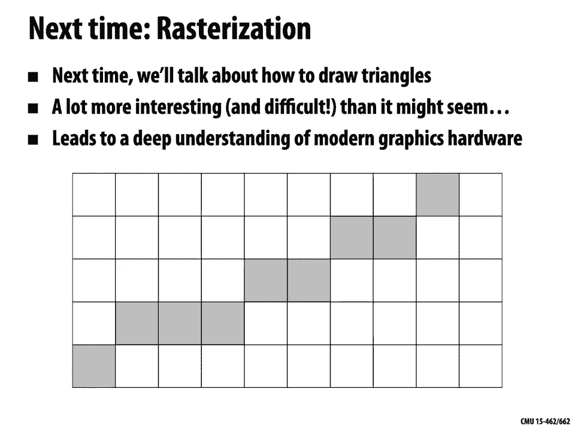

掌握这些概念和它们的几何直观，将为后续学习计算机图形学中的光照、着色、几何处理、物理模拟等高级主题打下坚实的数学基础。下一讲，我们将正式进入光栅化，探讨如何将三角形快速绘制到屏幕上。