# 6：空间变换 🎨

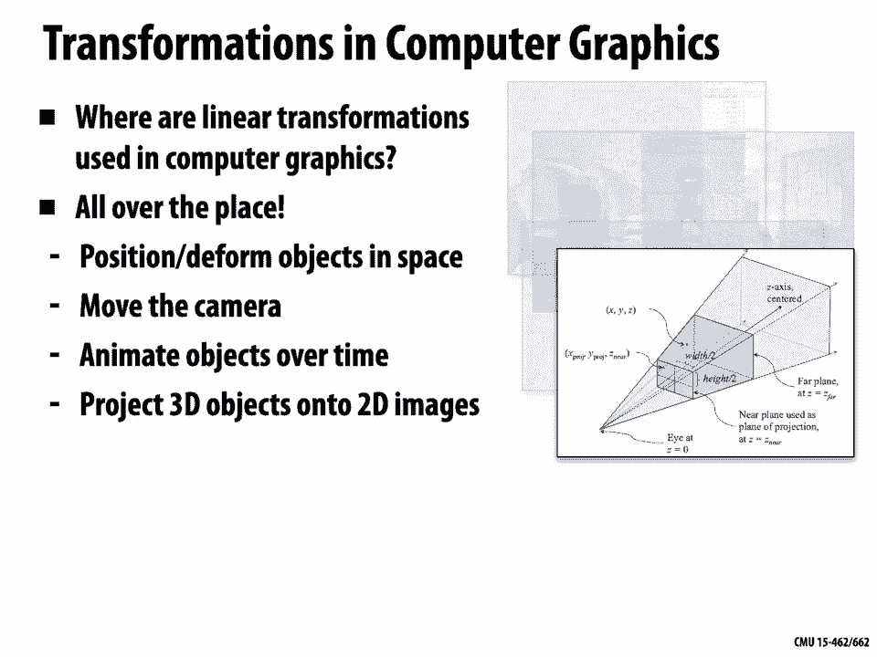

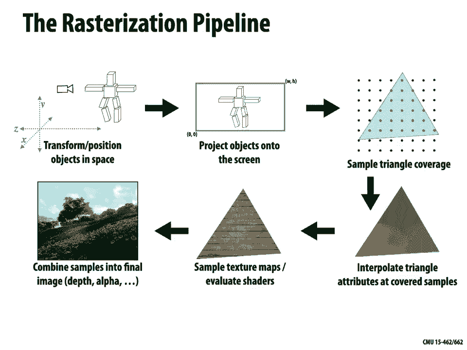

在本节课中，我们将要学习计算机图形学中一个非常基础的部分：对空间中的物体应用变换。我们将探讨不同类型的空间变换，了解它们的数学表示，并学习如何组合这些变换来创建复杂的图形效果。

## 概述

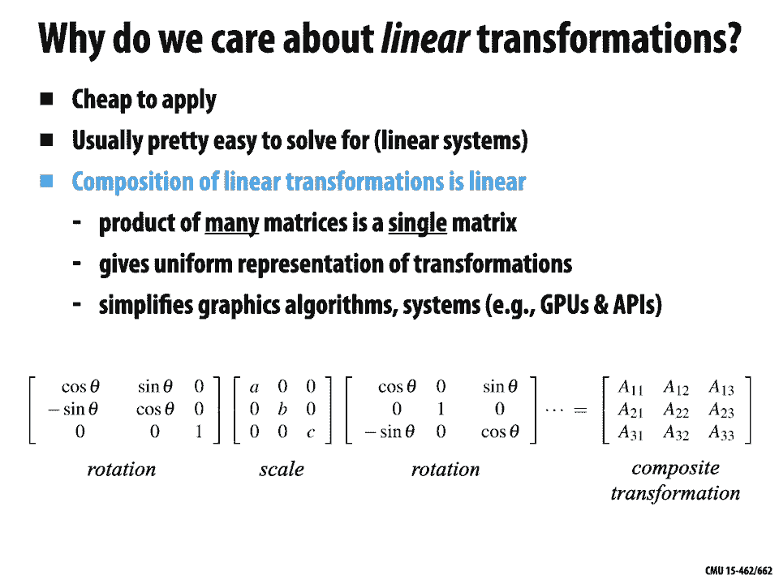

空间变换本质上是一个函数，它为空间中的每个点分配一个新的位置。我们可以将其视为一个函数 **f**，它将 **R^n** 中的点映射到 **R^n** 中的点。本节课我们将特别关注那些可以用线性映射（如旋转、缩放等）编码的空间变换。这些变换在计算机图形学中无处不在，用于定位或变形空间中的物体、移动摄像机、制作动画等。

## 什么是线性变换？ ➕

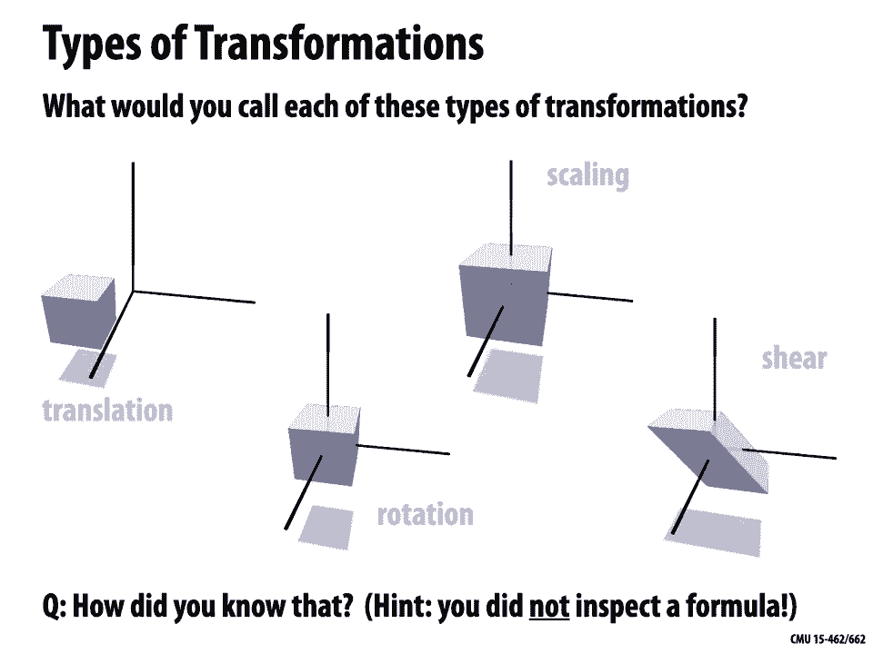

上一节我们介绍了空间变换的基本概念，本节中我们来看看线性变换的具体定义。

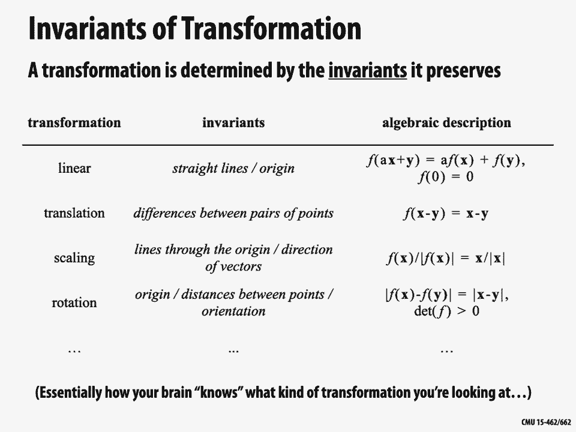

线性变换在几何上意味着它将直线映射为直线，并且保持原点不变。从代数角度看，线性变换是保持向量加法和标量乘法运算的映射。

以下是线性变换的两个等价定义：

*   **几何定义**：一个映射 **f: R^n → R^n** 是线性的，如果它将每条直线映射为一条直线，并且保持原点固定（即 **f(0) = 0**）。
*   **代数定义**：一个映射 **f: R^n → R^n** 是线性的，如果对于任意向量 **u, v ∈ R^n** 和任意标量 **a ∈ R**，满足：
    *   **f(u + v) = f(u) + f(v)**
    *   **f(a * u) = a * f(u)**

我们关心线性变换的原因有很多。首先，应用线性变换的计算成本很低。其次，线性变换的组合仍然是线性的，这允许我们将多个变换矩阵相乘，合并成一个单一的变换矩阵。这种统一的表示简化了图形算法、系统（如GPU和API）以及我们的思考方式。

## 常见的线性变换示例 🔄

现在，让我们通过一些常见的例子来具体了解线性变换。以下是几种基本的线性变换类型及其核心不变性：

*   **旋转**：保持原点固定、任意两点间距离不变以及方向（如文本从左到右的阅读顺序）不变。
*   **反射**：保持原点固定和任意两点间距离不变，但会反转方向。
*   **缩放**：保持所有向量的方向不变，但改变其大小（模长）。
*   **剪切**：沿一个给定方向 **u** 位移每个点 **x**，位移量与该点在另一个固定方向 **v** 上的投影距离成正比。

这些变换的核心并非由公式或矩阵属性定义，而是由它们在变换过程中所**保持的不变量**所决定。例如，旋转保持距离和方向，缩放保持方向但改变大小。

## 旋转的表示 🌀

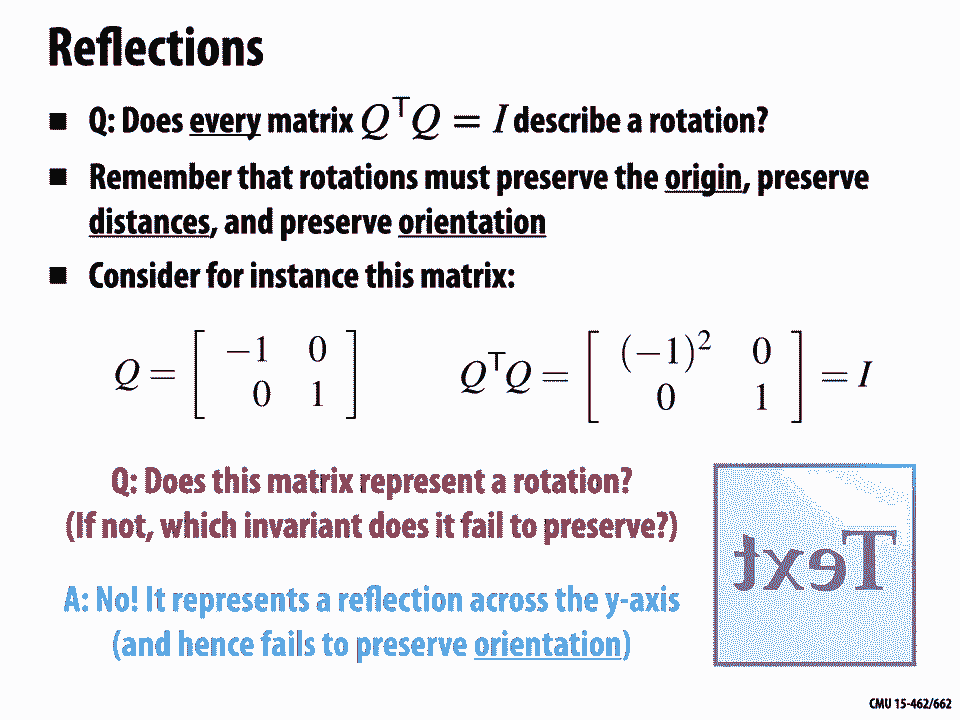

我们已经了解了旋转的特性，本节中我们来看看如何用数学公式和矩阵来表示旋转。

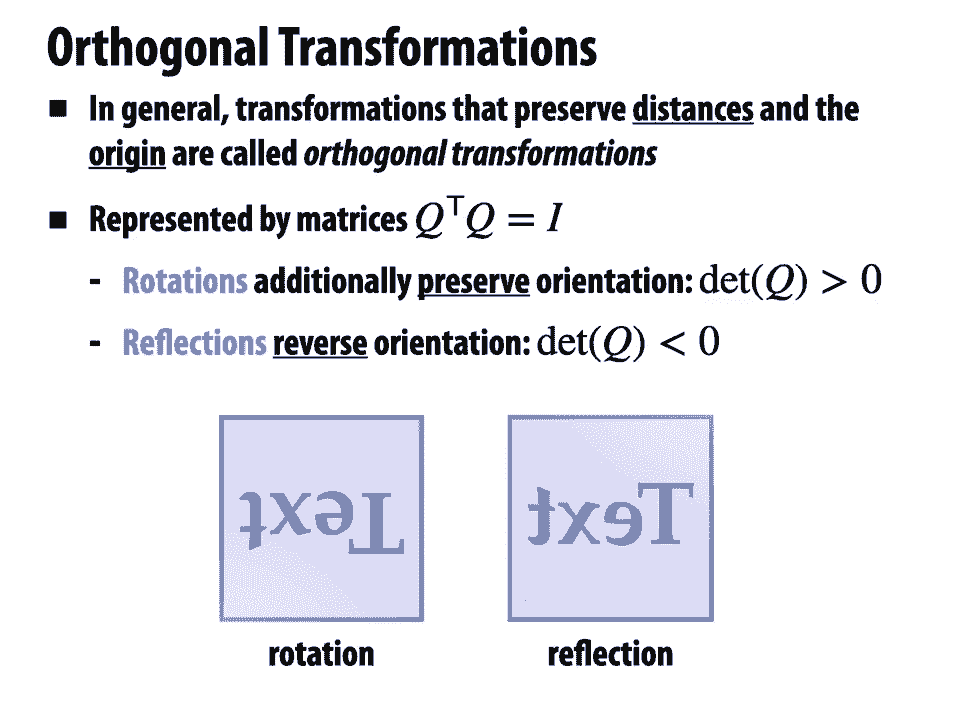

一个2D旋转可以通过一个角度 **θ** 来描述。它将点 **x** 映射到半径为 **||x||** 的圆上的一个新点。对于标准基向量：
*   点 **(1, 0)** 旋转 **θ** 后变为 **(cos θ, sin θ)**。
*   点 **(0, 1)** 旋转 **θ** 后变为 **(-sin θ, cos θ)**。

利用线性性质，我们可以将任意向量 **x = (x1, x2)** 表示为基向量的线性组合，然后分别旋转。这导出了2D旋转矩阵：

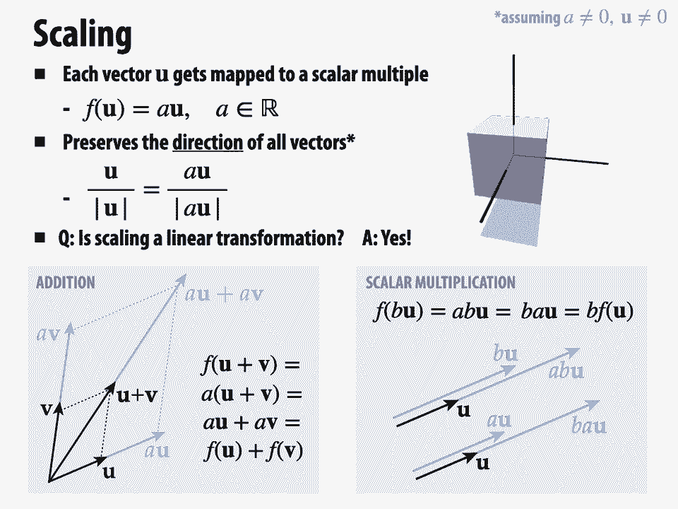

**R(θ) = [[cos θ, -sin θ], [sin θ, cos θ]]**

在3D中，围绕单个坐标轴的旋转可以类似地构造。例如，围绕 **z** 轴旋转 **θ** 角的矩阵为：

**R_z(θ) = [[cos θ, -sin θ, 0], [sin θ, cos θ, 0], [0, 0, 1]]**

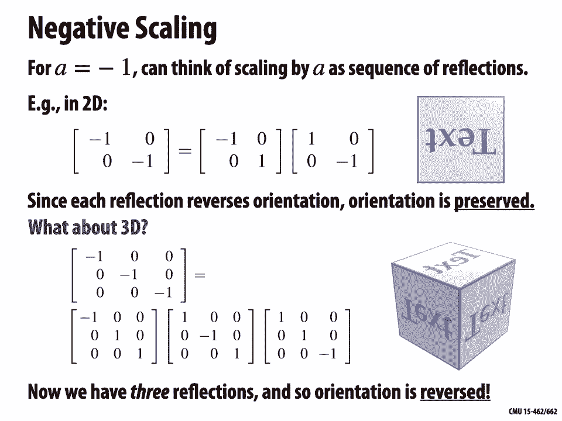

围绕 **x** 轴和 **y** 轴的旋转矩阵结构类似，只是余弦和正弦项出现在对应的行和列中。

一个关于旋转的重要性质是：旋转矩阵的逆等于其转置，即 **R^T = R^{-1}**。满足 **Q^T Q = I** 的矩阵称为**正交矩阵**，它代表旋转或反射。其中，**行列式为正**的正交矩阵代表旋转，**行列式为负**的则代表反射。

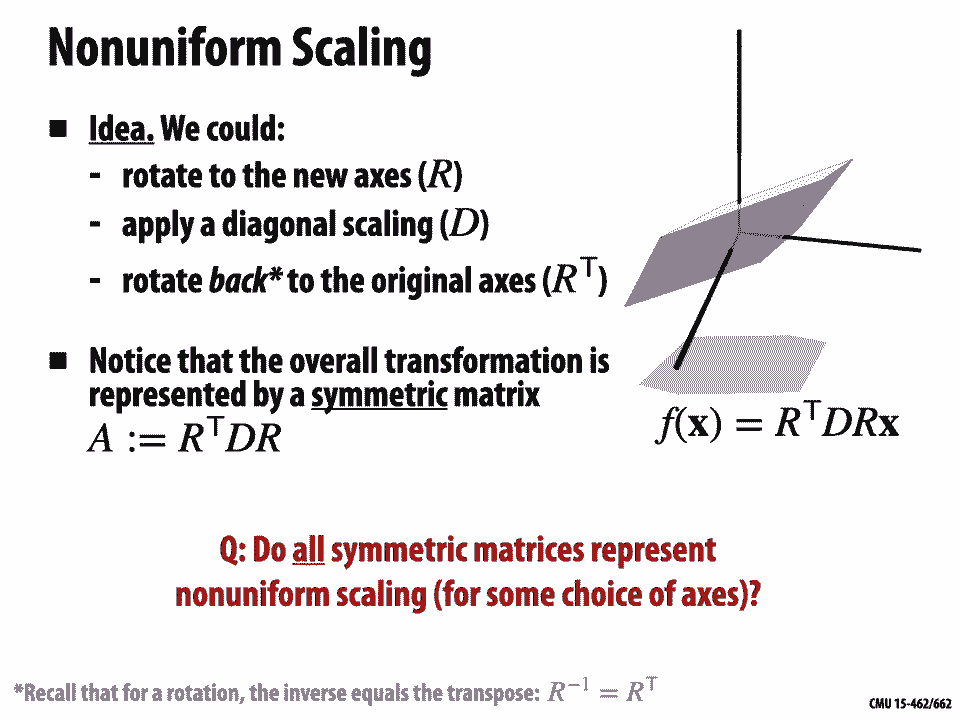

## 缩放的表示 📏

上一节我们讨论了旋转，本节中我们来看看另一种基本变换：缩放。

缩放将每个向量 **u** 映射为一个标量倍数 **a u**，其中 **a** 是一个实数。它的基本不变量是保持所有向量的方向。缩放是一个线性变换。

均匀缩放（所有轴按相同比例）可以用一个对角矩阵表示：

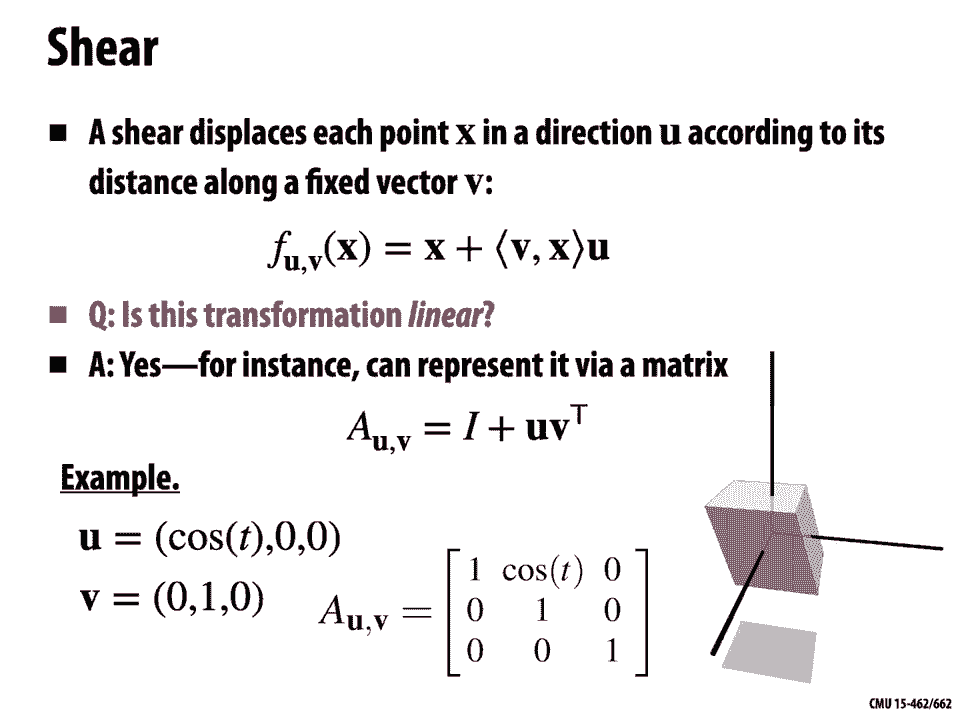

**D = a * I**，其中 **I** 是单位矩阵。

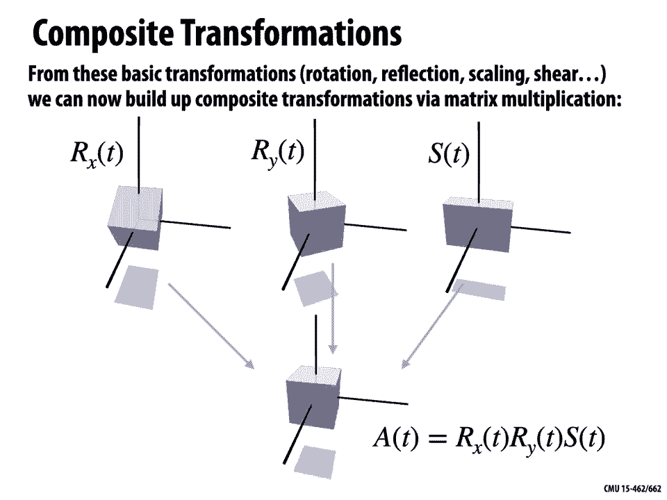

非均匀缩放（各轴按不同比例）的矩阵为：

**D = diag(a, b, c)**，作用于向量 **(u1, u2, u3)** 得到 **(a u1, b u2, c u3)**。

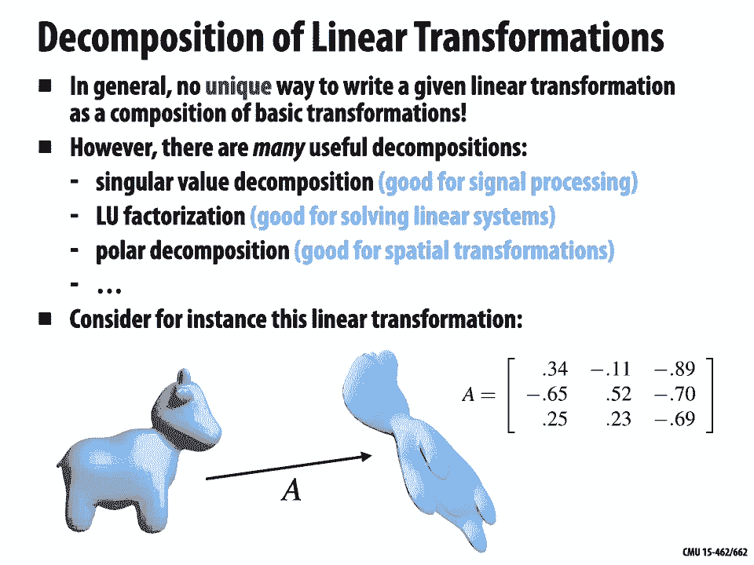

如果我们想沿着任意一组正交轴进行非均匀缩放，可以先旋转到新坐标系，应用对角缩放矩阵，再旋转回来。这可以表示为 **A = R^T D R**，其中 **R** 是旋转矩阵。有趣的是，这样得到的矩阵 **A** 是一个对称矩阵（**A = A^T**）。

事实上，根据**谱定理**，任何对称矩阵都对应着沿某一组正交轴的非均匀缩放。如果对称矩阵是**正定**的（所有特征值为正），则代表的是纯粹的拉伸，没有翻转。

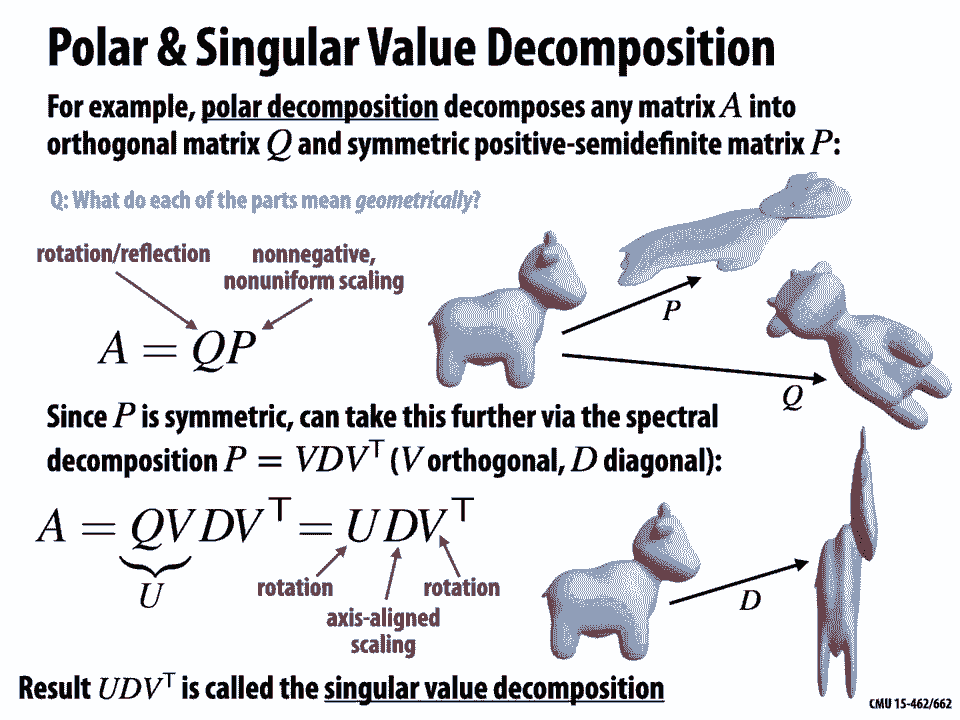

## 剪切的表示 ✂️

除了旋转和缩放，剪切也是一种基本的线性变换。

剪切沿一个给定方向 **u** 位移每个点 **x**，位移量等于 **x** 在另一个固定方向 **v** 上的投影（点积）。其函数形式为：

**f_{u,v}(x) = x + (v · x) * u**

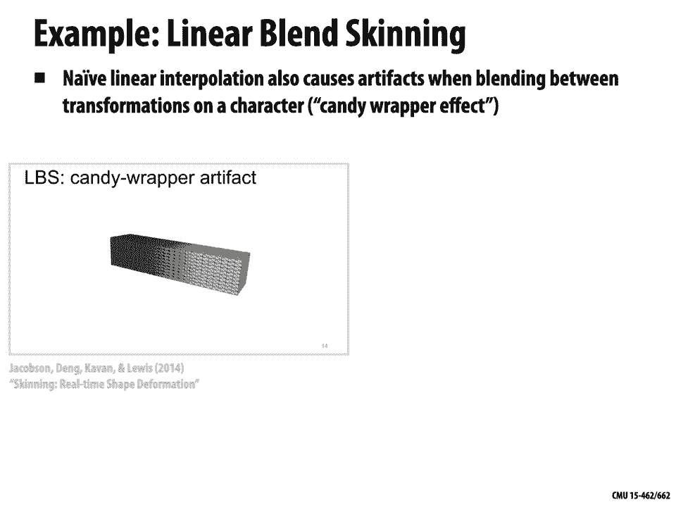

这可以表示为一个矩阵：**A = I + u v^T**，其中 **I** 是单位矩阵。例如，一个在2D中随时间 **t** 变化的剪切矩阵可能如下所示（假设位移方向与 **x** 轴相关，且依赖于 **y** 坐标）：

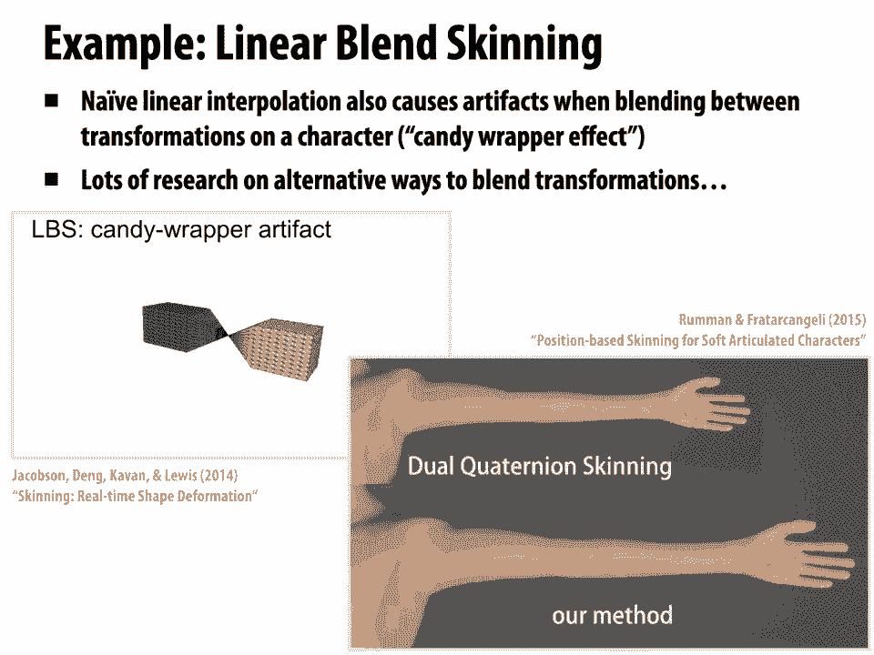

**A(t) = [[1, cos t, 0], [0, 1, 0], [0, 0, 1]]**

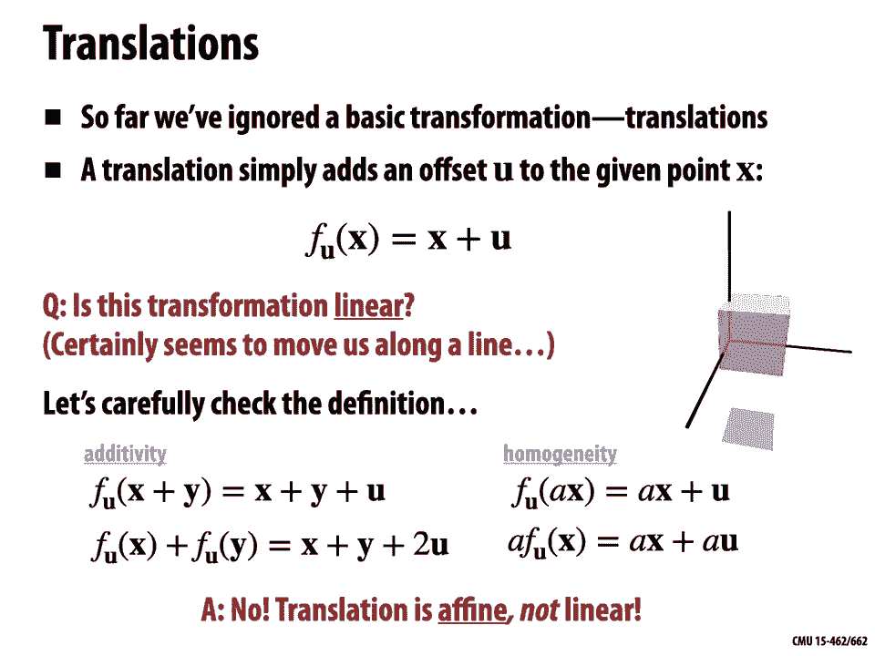

## 变换的组合与分解 🧩

我们已经学习了多种基本变换，本节中我们来看看如何将它们组合起来，以及如何分解复杂的变换。

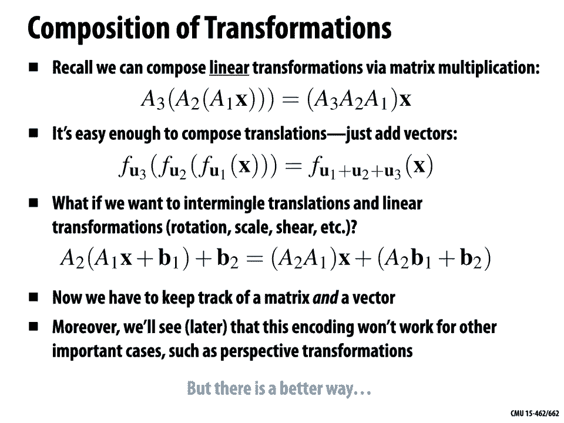

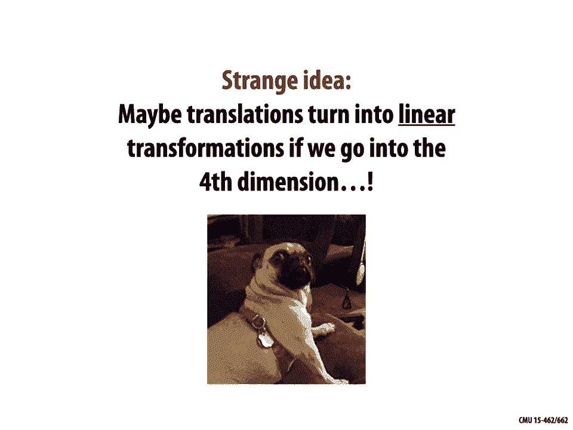

通过矩阵乘法，我们可以将基本的旋转、缩放、剪切等变换组合成复杂的复合变换。例如：**A(t) = R_x(t) * R_y(t) * S(t)**。需要注意的是，矩阵乘法的顺序很重要，最后一个（最右边）矩阵最先被应用。

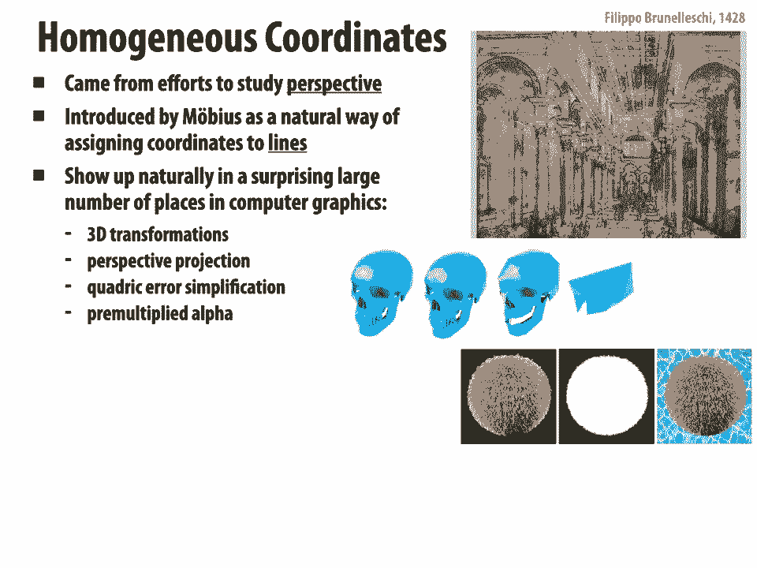

反过来，我们常常需要将一个给定的线性变换矩阵分解成更基本的组成部分。这种分解不是唯一的，但有多种标准方法，每种都有其用途：
*   **奇异值分解 (SVD)**：在信号处理等领域很常见。
*   **LU分解**：用于求解线性方程组。
*   **极分解**：对处理空间变换特别有用。

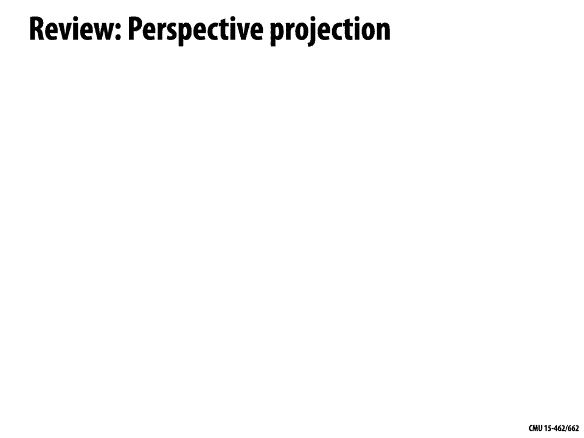

**极分解**将任意矩阵 **A** 分解为一个正交矩阵 **Q**（代表旋转/反射）和一个对称半正定矩阵 **P**（代表非负缩放）的乘积：**A = Q P**。这让我们可以直观地理解 **A** 中的旋转/反射成分和缩放/拉伸成分。

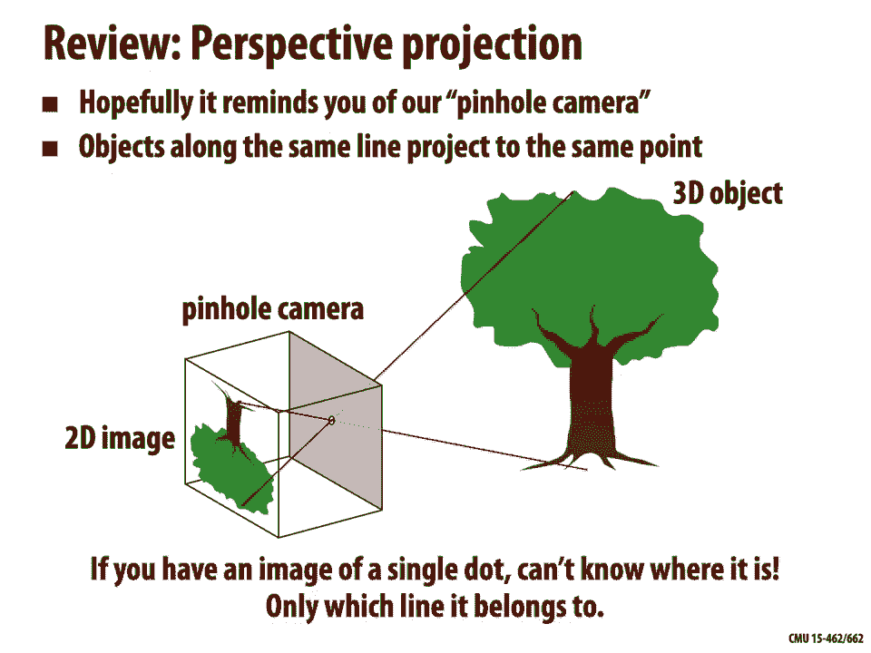

进一步，对 **P** 应用谱分解（**P = V D V^T**），我们可以得到**奇异值分解 (SVD)**：**A = U D V^T**，其中 **U** 和 **V** 是正交矩阵，**D** 是对角矩阵（奇异值）。这可以解释为先旋转 (**V^T**)，再沿坐标轴缩放 (**D**)，最后再旋转 (**U**)。

这些分解在图形学中非常有用，例如用于在动画中**插值**两个变换。简单地线性插值两个变换矩阵通常会产生不自然的效果。更好的方法是分别对极分解中的旋转部分和缩放部分进行插值，然后再组合起来。

## 齐次坐标：统一表示的关键 🔑

到目前为止，我们忽略了一个非常基本的变换：平移。平移只是简单地给一个点加上一个偏移向量 **u**：**f(x) = x + u**。

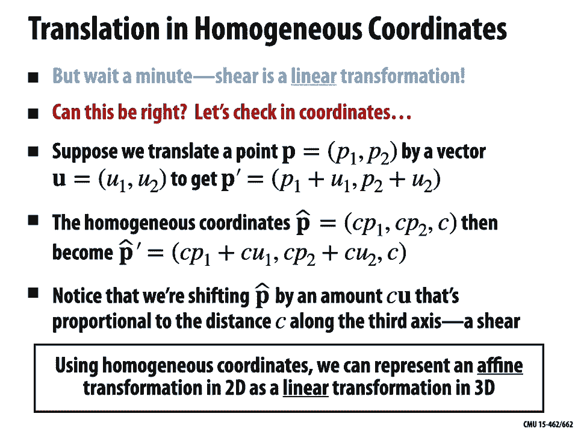

然而，平移**不是**线性变换，因为它不保持原点，也不满足线性加法和数乘的性质。这带来了一个难题：我们如何将平移与我们之前讨论的线性变换（旋转、缩放等）统一地组合起来？

解决方案是一个巧妙的想法：使用**齐次坐标**。齐次坐标通过增加一个维度，将 **n** 维空间中的仿射变换（包括平移）表示为 **n+1** 维空间中的线性变换。

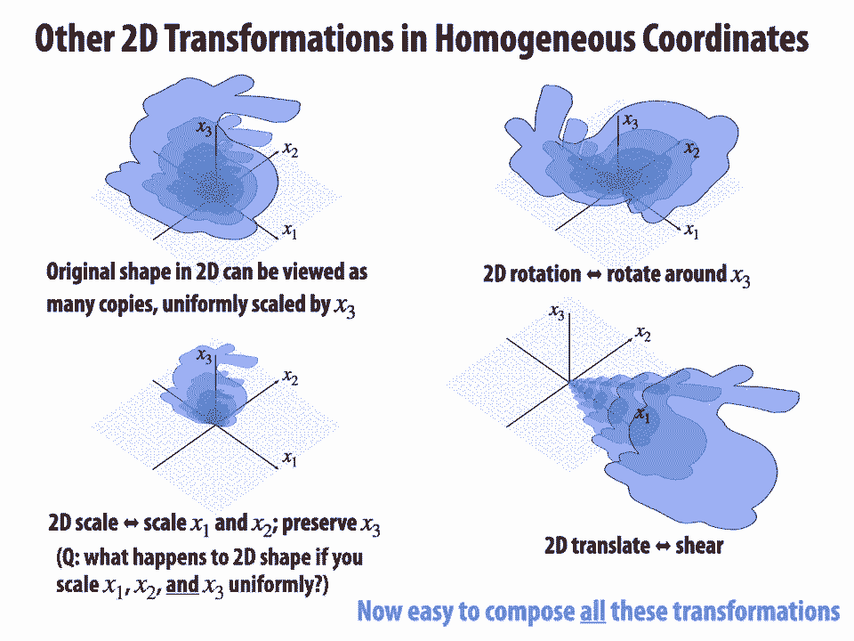

对于2D点 **(x, y)**，其齐次坐标可以是 **(x, y, 1)** 或任何非零标量倍数 **(c*x, c*y, c)**。要恢复原始2D坐标，只需将前两个分量除以第三个分量。

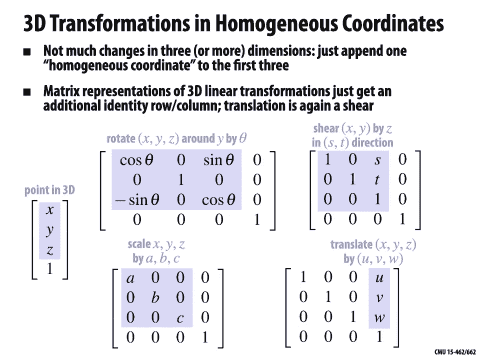

在齐次坐标下，2D平移可以表示为一个3D剪切矩阵：

**T(u1, u2) = [[1, 0, u1], [0, 1, u2], [0, 0, 1]]**

当这个矩阵作用于齐次坐标 **(x, y, 1)** 时，得到 **(x+u1, y+u2, 1)**，投影回2D后正是平移后的点。

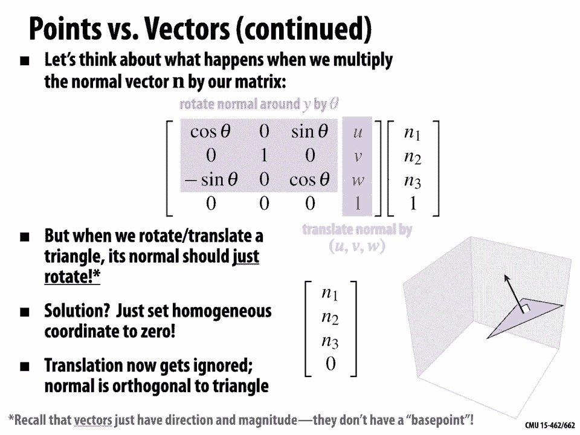

类似地，2D旋转和缩放在齐次坐标下表示为3x3矩阵，只是在右下角增加了一个1，其他地方与2x2形式相同。这样，所有变换（线性变换和平移）都可以统一为矩阵乘法，极大地简化了组合操作。

在3D中，我们使用4x4齐次坐标矩阵。平移矩阵形式如下：

**T(u, v, w) = [[1, 0, 0, u], [0, 1, 0, v], [0, 0, 1, w], [0, 0, 0, 1]]**

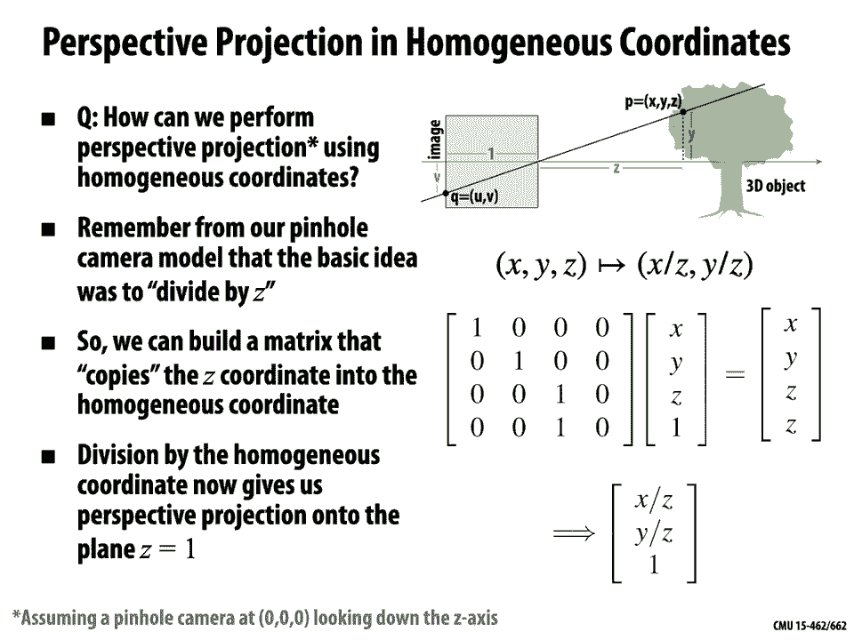

齐次坐标的另一个巨大优势是它能清晰地区分**点**和**向量**：
*   **点** 的齐次坐标最后一个分量为非零值（通常为1），例如 **(x, y, z, 1)**。平移会影响点的位置。
*   **向量** 的齐次坐标最后一个分量为0，例如 **(dx, dy, dz, 0)**。平移不会影响向量，因为其方向性不受位置影响。这确保了在变换物体时，其法向量能正确保持正交性。

此外，齐次坐标天然地支持**透视投影**。透视投影矩阵可以将3D点变换为带透视除法的齐次坐标，从而实现近大远小的效果。

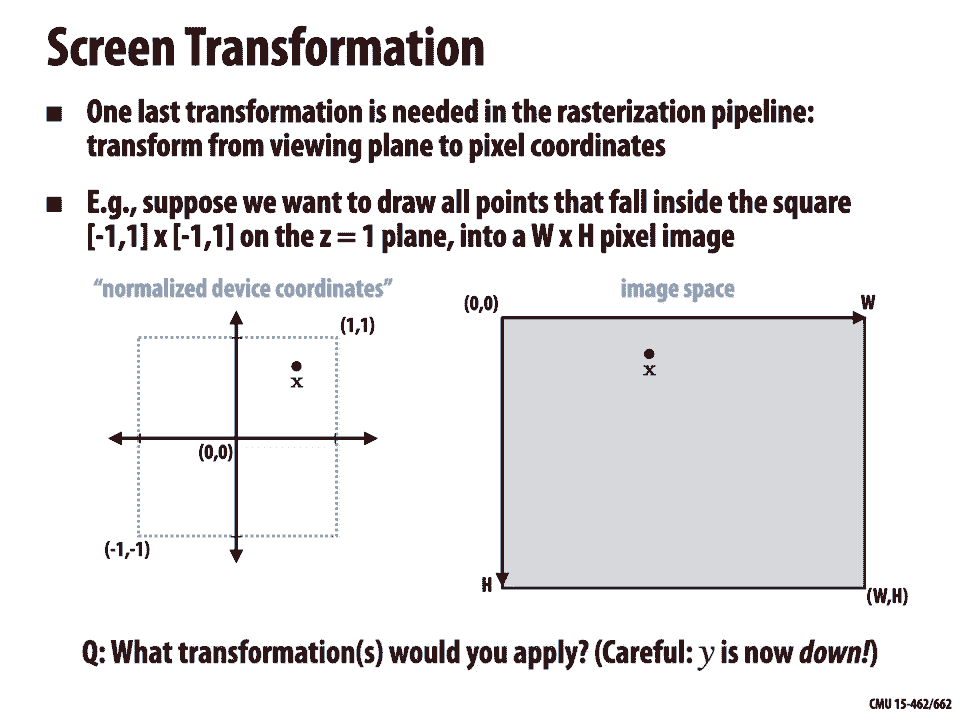

## 场景图：组织复杂变换 🌳

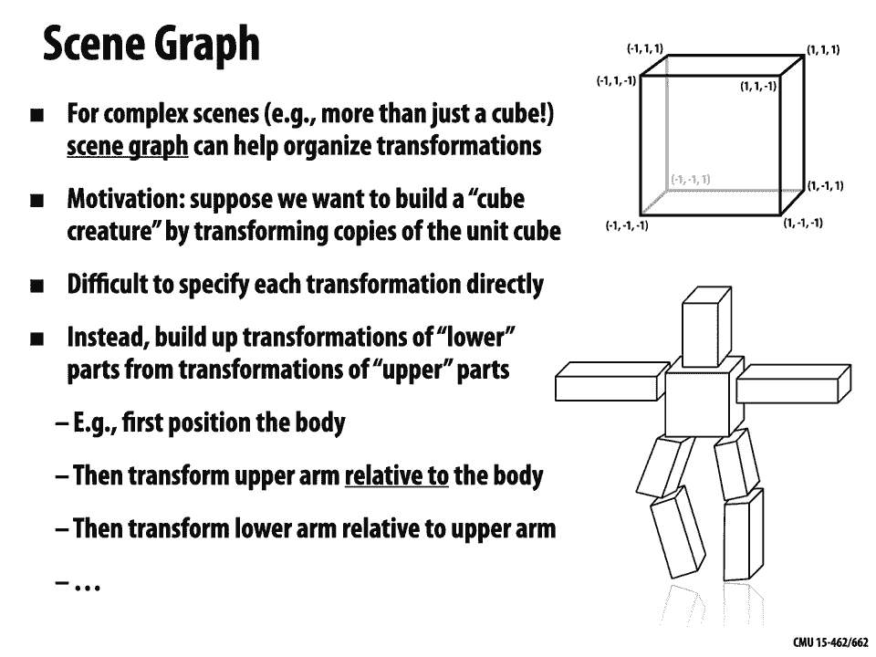

当场景中有许多物体以层级关系组织时（如机器人、角色），使用**场景图**来管理变换非常有效。

场景图是一种有向图结构，每个节点存储一个相对于其父节点的变换矩阵（通常是4x4齐次坐标矩阵）。要计算某个节点在世界空间中的最终变换，需要将从根节点到该节点路径上的所有变换矩阵依次相乘。

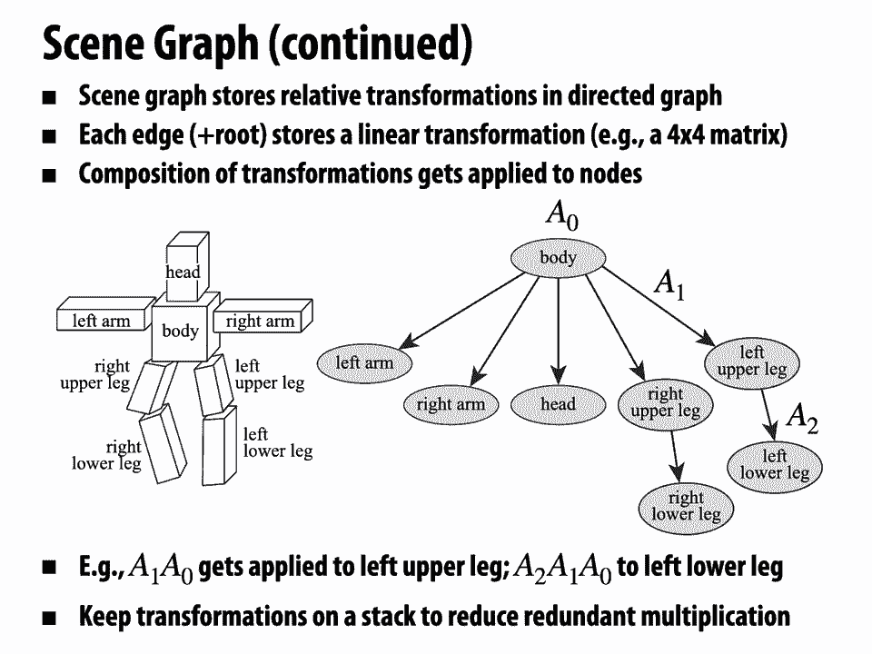

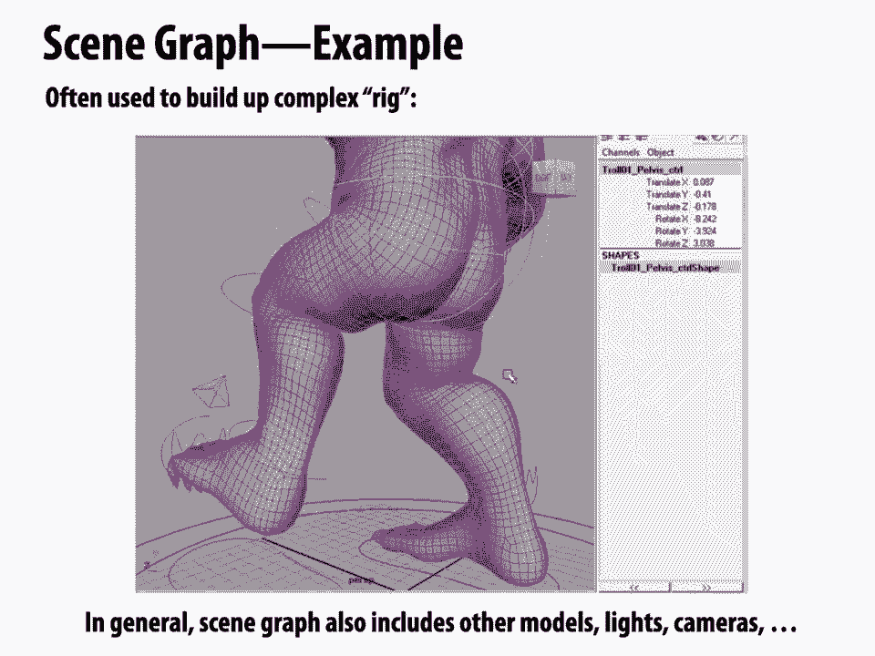

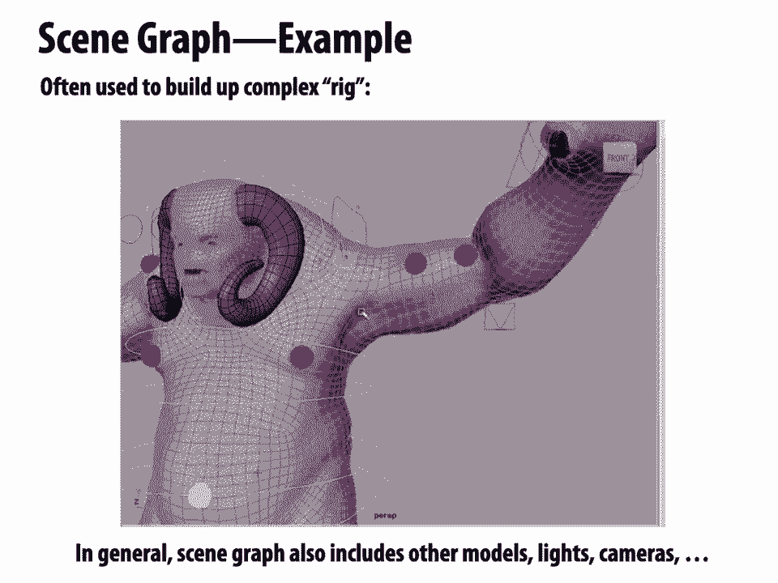

这种层级结构的好处是：
1.  **局部控制**：移动父节点（如身体）会自动影响所有子节点（如手臂、腿）。
2.  **消除冗余**：可以通过**实例化**来重复使用相同的几何模型，只需在不同节点应用不同的变换矩阵即可，无需复制几何数据。
3.  **组织清晰**：可以方便地管理模型、灯光、摄像机等场景元素。

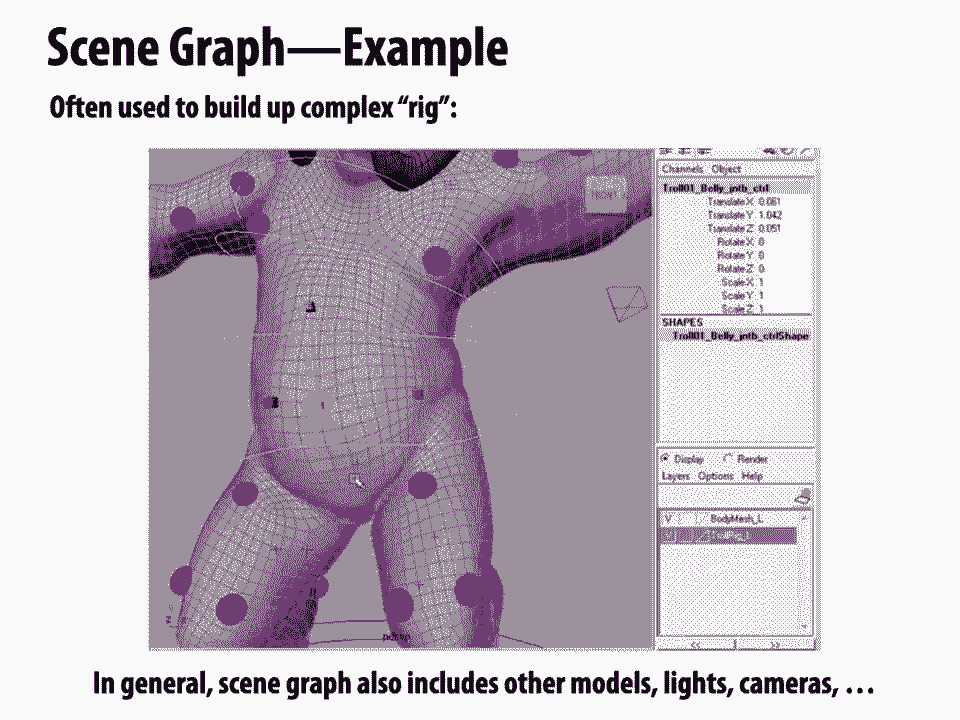

在遍历场景图应用变换时，必须牢记**变换顺序至关重要**。不同的乘法顺序会产生完全不同的结果。例如，“先缩放再平移”与“先平移再缩放”得到的效果是不同的。

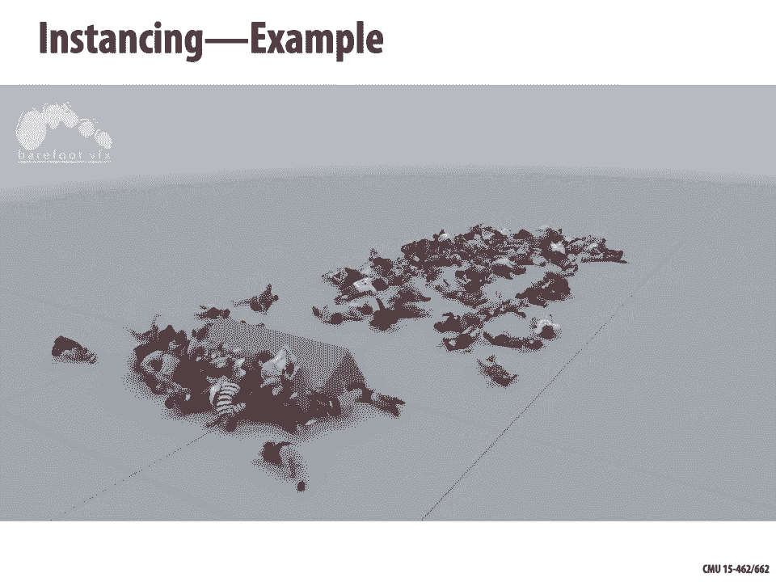

一个常见的技巧是：要绕一个物体的自身中心旋转，需要先将物体平移到原点，旋转，再平移回原位置。

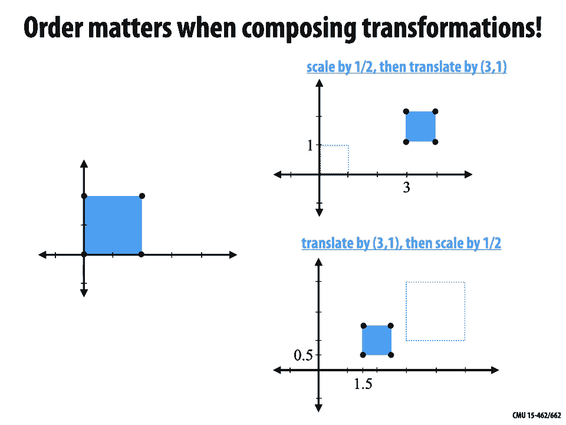

## 总结

本节课中我们一起学习了计算机图形学中空间变换的核心知识。

我们了解到，变换从根本上是由其**保持的不变量**所定义的。我们探讨了几种基本的线性变换：缩放、旋转、反射、剪切，以及非线性的平移和透视投影。我们看到了通过引入**齐次坐标**，可以将平移和透视投影也表示为高维空间中的线性变换，从而实现所有变换的**统一矩阵表示**。

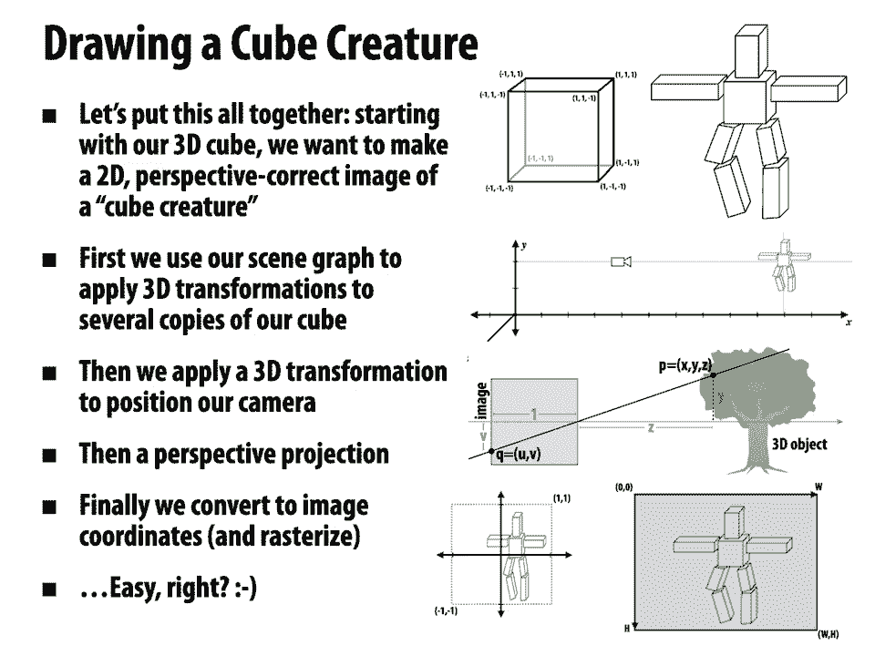

我们还学习了如何通过矩阵乘法**组合**基本变换来创建复杂效果，以及如何通过极分解、SVD等方法**分解**复杂变换。这些分解有助于理解变换的几何意义并进行平滑插值。

最后，我们介绍了**场景图**这一强大工具，它利用变换的层级关系来高效、清晰地组织复杂场景中的众多物体及其变换。

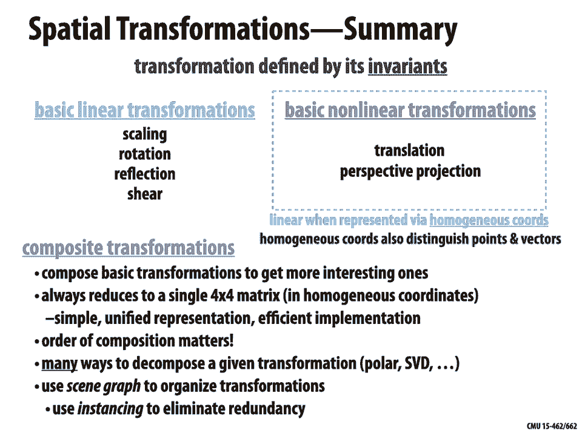

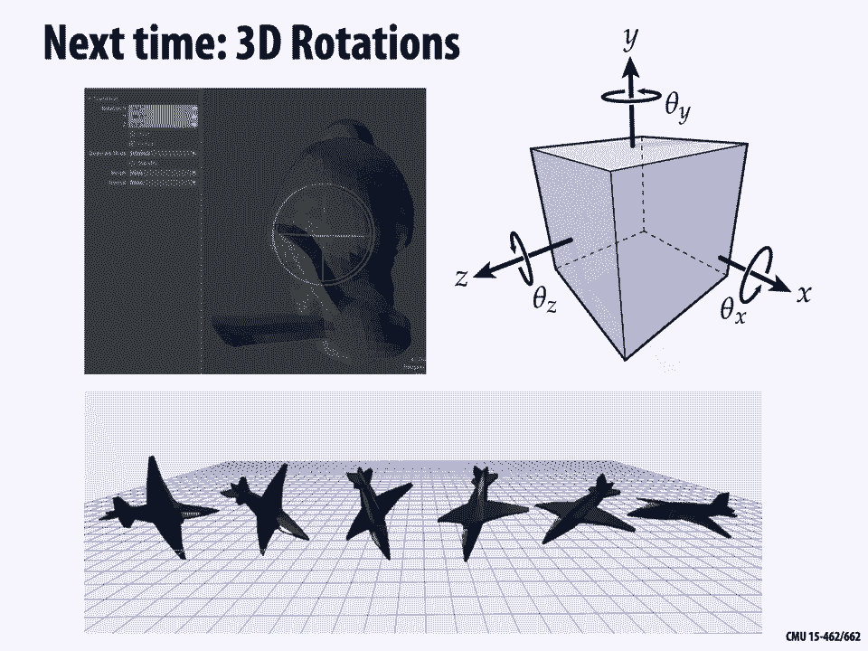

所有这些知识为我们构建完整的图形渲染管线奠定了基础：从定义模型局部坐标，通过场景图进行层级变换，应用视图和投影变换，最终到屏幕像素坐标，每一步都离不开对空间变换的深入理解和熟练运用。