# 8：深度与透明度 🎨

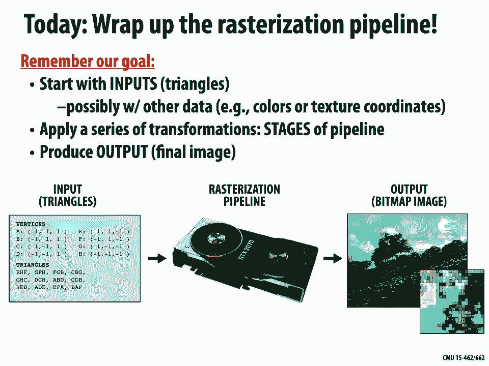

在本节课中，我们将为光栅化管线添加两个关键特性：**深度处理**与**透明度混合**。我们将学习如何将来自不同图元的采样点组合成最终图像，同时正确处理物体间的遮挡与半透明效果。

---

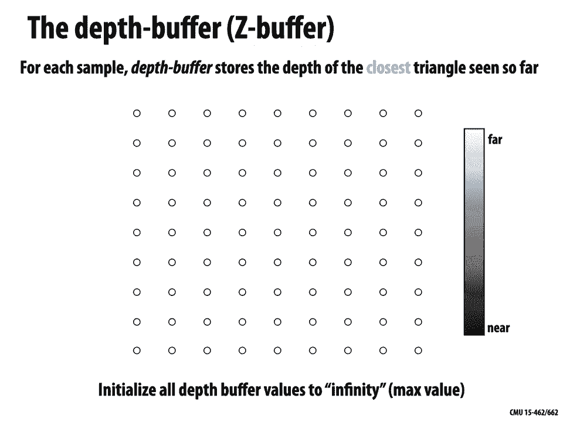

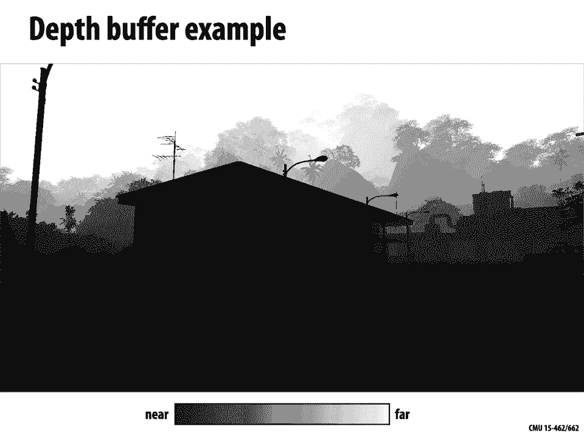

## 深度与遮挡

上一节我们介绍了如何通过光栅化对三角形进行采样和着色。本节中，我们来看看如何确定在每一个采样点上，哪个三角形是可见的。这个问题对于不透明物体称为**遮挡**处理。

对于一个三角形，我们在投影后除了得到其顶点的2D屏幕坐标 `(x, y)`，还保留了每个顶点在观察空间中的**深度值** `z`。深度值代表了该顶点到观察者的距离。

为了计算三角形内部任意采样点 `(x, y)` 的深度 `d`，我们可以利用**重心坐标插值**。因为深度在三角形表面是线性变化的，所以插值结果是准确的。

```cpp
// 伪代码：使用重心坐标(alpha, beta, gamma)插值深度
d = alpha * d_i + beta * d_j + gamma * d_k;
```

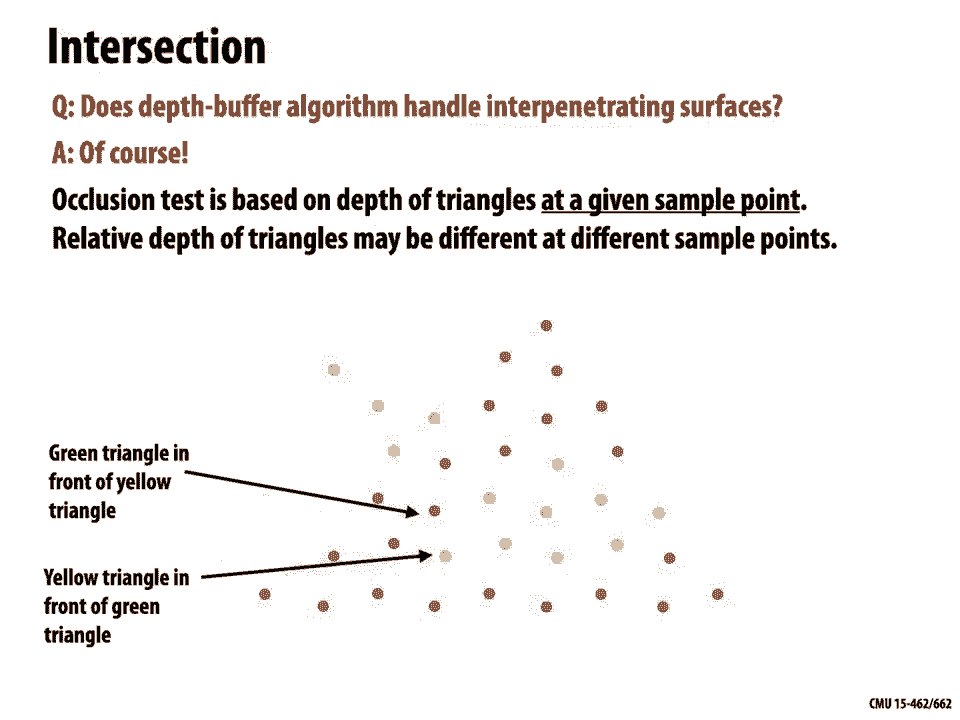

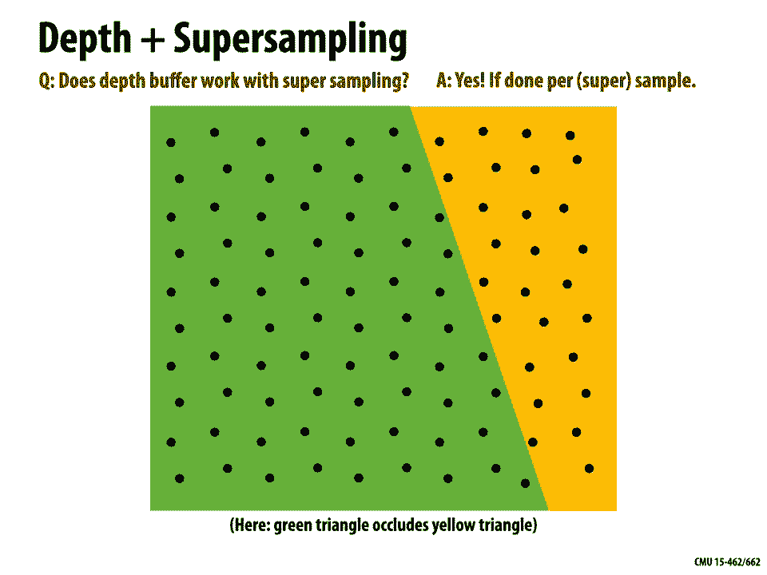

现在面临的挑战是：光栅化管线一次只处理一个三角形，而我们最终需要知道在每个采样点上，**深度最小**（即离观察者最近）的三角形是哪一个。解决方案是使用一个称为**深度缓冲区**（或Z缓冲区）的辅助数据结构。

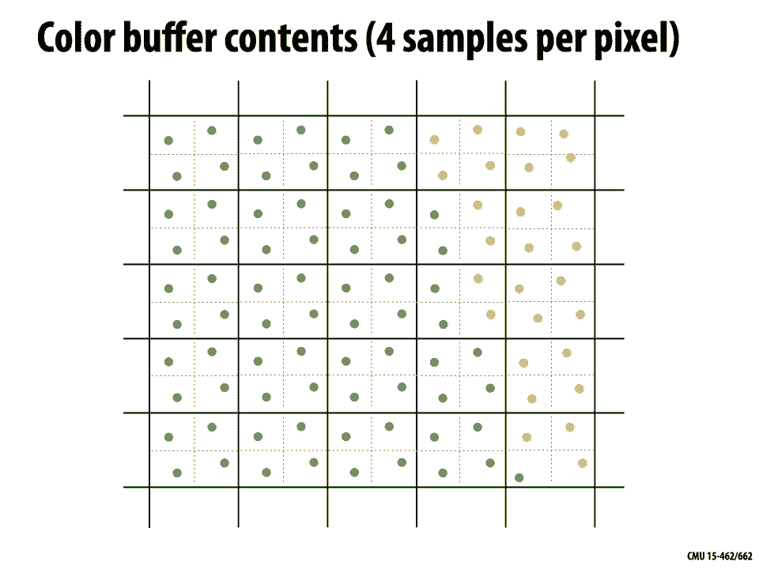

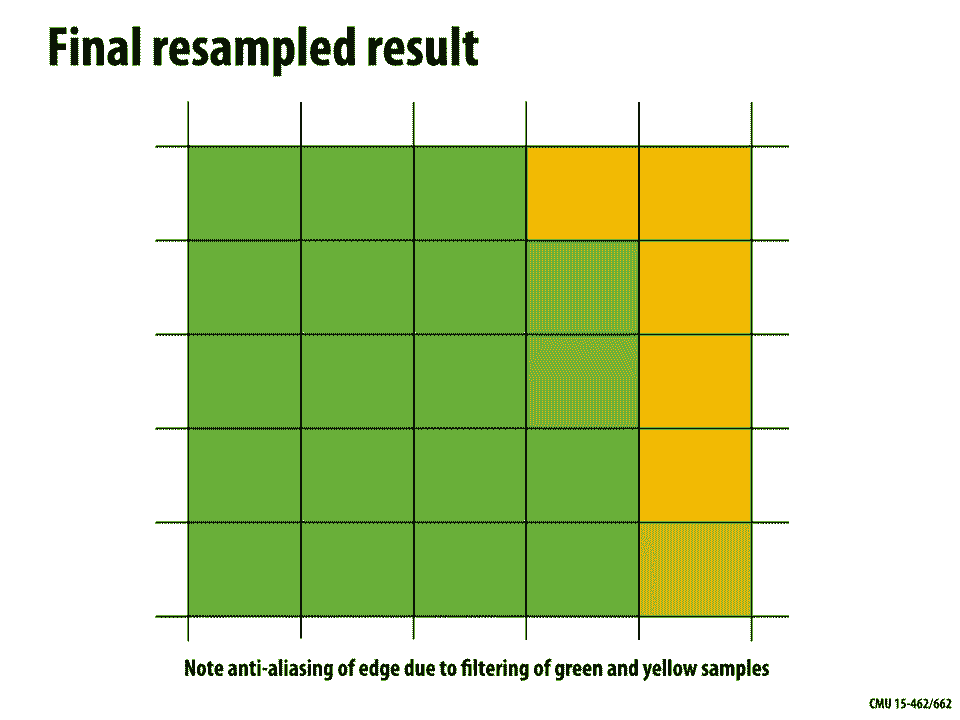

深度缓冲区为每一个采样点（或像素）存储一个深度值，代表**当前已处理的所有图元中，离观察者最近的那个的深度**。初始时，所有深度值被设置为一个很大的数（如无穷大）。

以下是深度测试的基本流程：

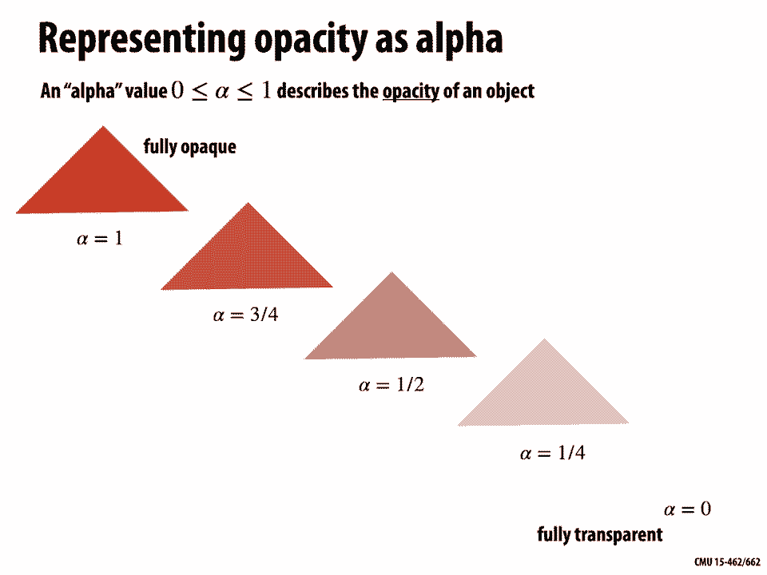

1.  对当前三角形进行光栅化，得到一系列采样点及其插值后的深度 `d_new`。
2.  对于每个采样点 `(x, y)`，读取深度缓冲区中存储的当前深度 `d_buffer`。
3.  比较 `d_new` 和 `d_buffer`。如果 `d_new < d_buffer`，说明当前三角形更近，则：
    *   用当前三角形的颜色更新颜色缓冲区。
    *   用 `d_new` 更新深度缓冲区。
4.  如果 `d_new >= d_buffer`，则不做任何操作，当前三角形在该点被遮挡。

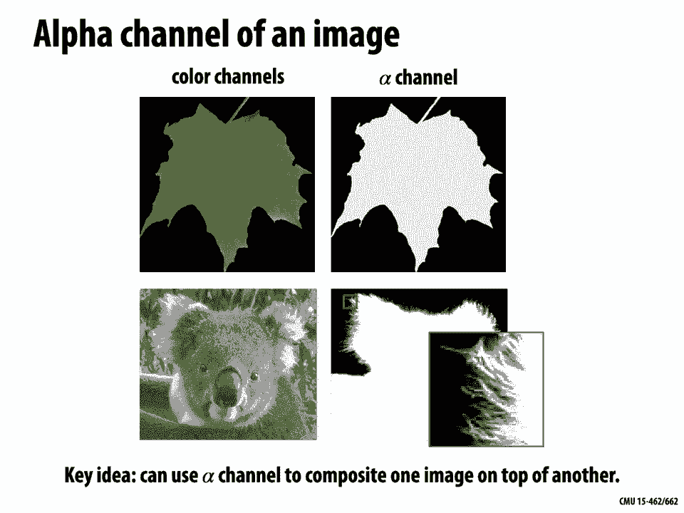

深度缓冲区算法**逐采样点**进行比较，因此能正确处理三角形相互穿插的情况，无需对三角形进行全局排序或分割，实现简单高效。

---

## 透明度与混合

现在我们来处理半透明表面。半透明表面的不透明度（或相反，透明度）通常用一个在0到1之间的**Alpha值** `α` 来表示。`α=1` 表示完全不透明，`α=0` 表示完全透明。

为了将半透明图像 `B` 合成到背景图像 `A` 之上，我们使用 **“Over”操作符**。这个操作不是可交换的，`B over A` 与 `A over B` 结果不同，因此合成顺序至关重要。

如果直接使用颜色 `C` 和 Alpha `α` 进行合成，在图像缩放或反复合成时容易产生颜色失真和**黑边/白边伪影**。为了解决这个问题，图形学中普遍采用**预乘Alpha**的颜色表示法。

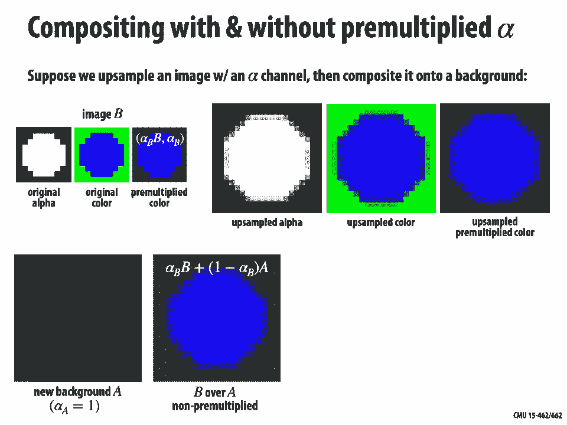

预乘Alpha将颜色通道预先乘以Alpha值：
```cpp
// 原始颜色: (R, G, B, A)
// 预乘后颜色: (R*A, G*A, B*A, A)
Color_premultiplied = (R * A, G * A, B * A, A);
```

使用预乘Alpha颜色进行Over操作的公式如下：
```cpp
// 合成 B over A，其中颜色均已预乘
Color_result = Color_B + (1 - Alpha_B) * Color_A;
Alpha_result = Alpha_B + (1 - Alpha_B) * Alpha_A;
```

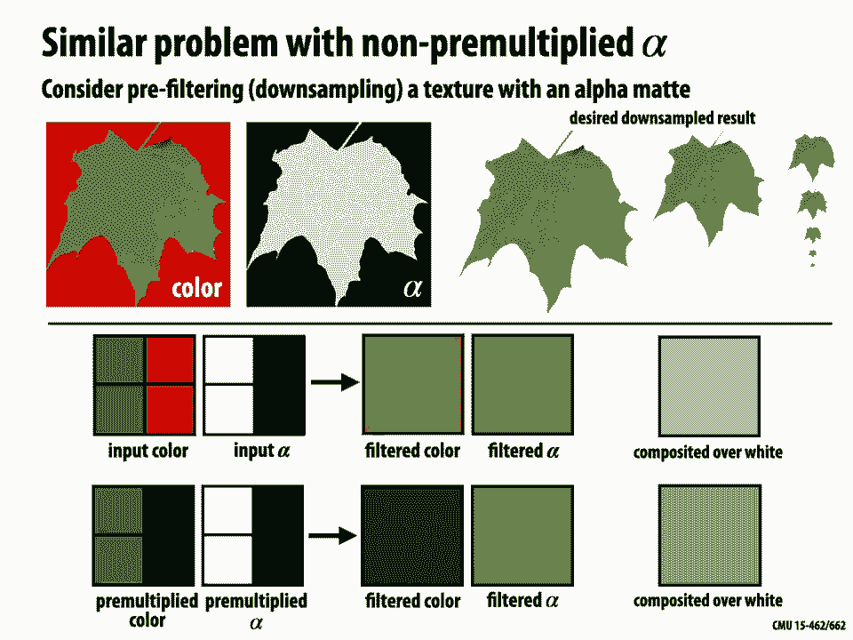

合成完成后，如果需要得到标准颜色，可以进行“反预乘”：
```cpp
Color_standard = (R_result / A_result, G_result / A_result, B_result / A_result);
```

预乘Alpha的优势包括：
*   所有通道（RGB和A）使用相同的合成公式，实现简单。
*   合成操作是封闭的，支持多层半透明表面的正确混合。
*   能避免图像缩放（如生成Mipmap）时的颜色伪影。
*   其数学形式与齐次坐标相似，能自然地融入现有的图形管线。

---

## 在管线中整合深度与透明度

在实际渲染包含不透明和半透明物体的场景时，通常采用以下策略：

1.  **渲染所有不透明物体**：使用深度缓冲区算法，以任意顺序绘制。这会正确解决不透明物体间的遮挡问题，并填充好深度缓冲区。
2.  **渲染所有半透明物体**：
    *   **禁用深度写入**：不再更新深度缓冲区。
    *   **启用深度测试**：仍然进行深度比较，确保半透明物体只有在其深度值小于缓冲区值（即在不透明物体之前）时才被绘制。
    *   **按从后到前的顺序绘制**：对半透明物体进行排序（通常按到相机的平均距离），然后依次使用Over操作符进行混合。这是实现正确半透明效果的关键，但也是光栅化管线的难点，因为排序可能很耗时，且对于相互交叉的半透明物体可能无法正确排序。

处理大量无序半透明物体是光栅化管线的一个弱点。更高级的技术（如深度剥离）或像光线追踪这样的替代渲染算法能更好地处理此问题。

---

## 光栅化管线总结 🚀

本节课中我们一起学习了如何通过深度缓冲区和透明度混合来完成光栅化渲染管线的最后一步。现在，我们可以回顾整个从3D场景到2D图像的光栅化管线流程：

1.  **输入**：三角形列表、纹理坐标、模型/视图/投影变换矩阵、纹理贴图、输出图像尺寸。
2.  **顶点处理**：对每个三角形顶点应用视图和投影变换，将其变换到裁剪空间。
3.  **裁剪**：剔除完全在视锥体外的三角形，对部分在内部的三角形进行裁剪。
4.  **透视除法与视口变换**：将顶点变换到2D屏幕坐标。
5.  **光栅化**：遍历三角形覆盖的采样点，利用重心坐标插值深度、纹理坐标等属性。
6.  **片段着色**：使用插值得到的纹理坐标查询纹理，并进行滤波（如双线性过滤），确定片段颜色。
7.  **深度测试与混合**：
    *   对于不透明片段：进行深度测试，通过则写入颜色和深度。
    *   对于半透明片段：通常需要在所有不透明物体渲染后，按从后到前顺序进行深度测试和颜色混合。
8.  **输出**：最终颜色被写入帧缓冲区，形成图像。

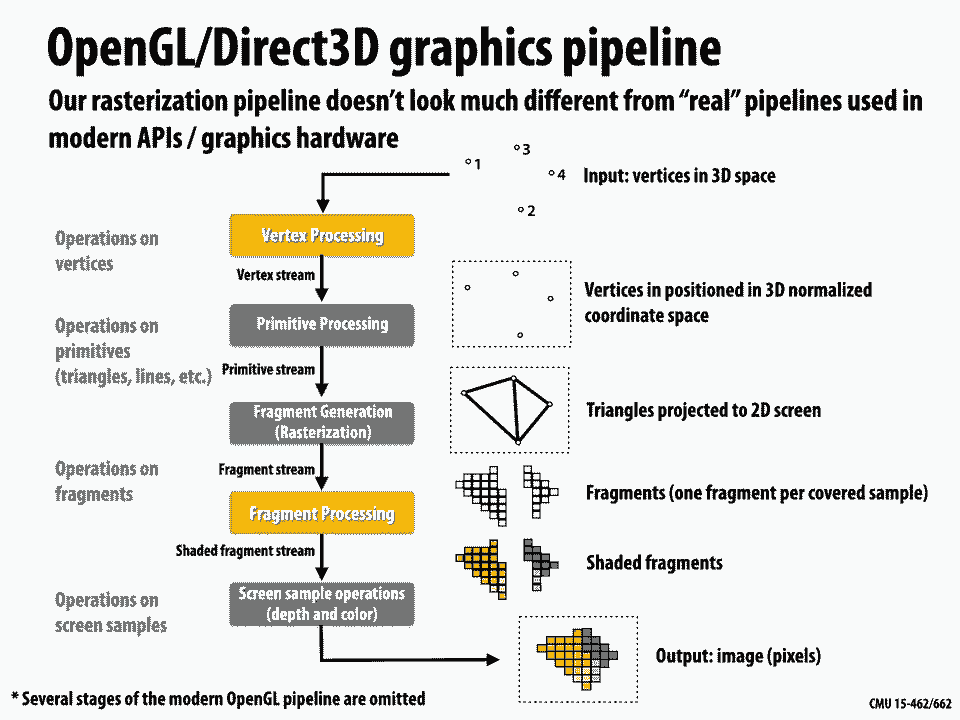

现代GPU硬件将这一管线高度并行化和固定功能化，以实现实时的高性能渲染。尽管管线正变得更加可编程和灵活，但其核心原理与我们在此讨论的完全一致。

---

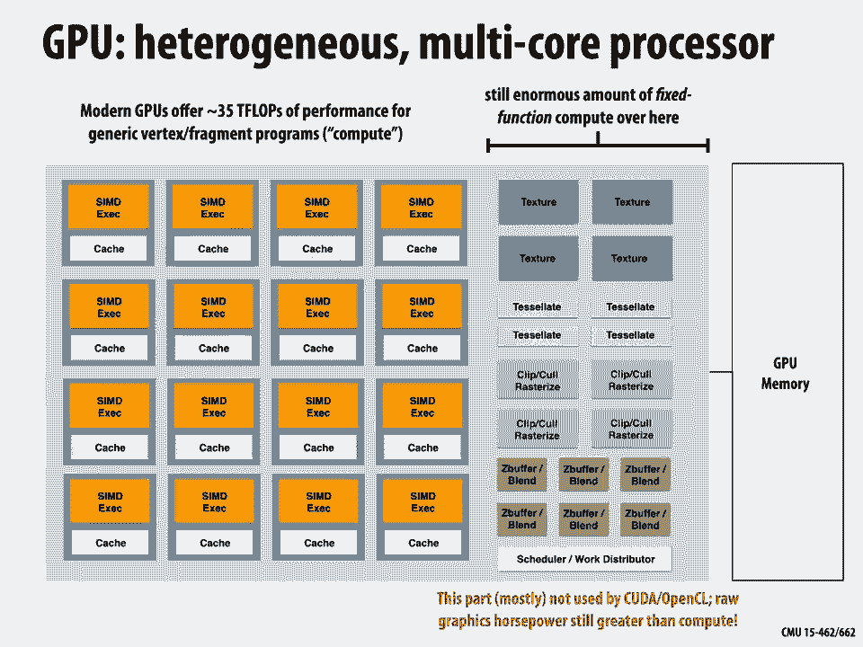

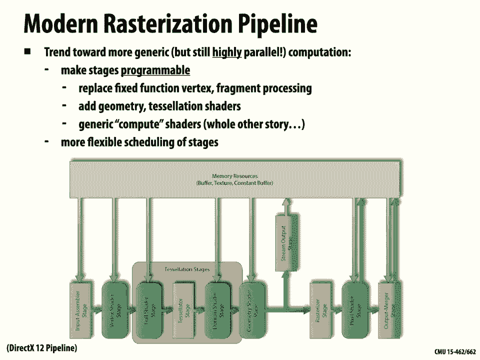

## 展望未来 🔮

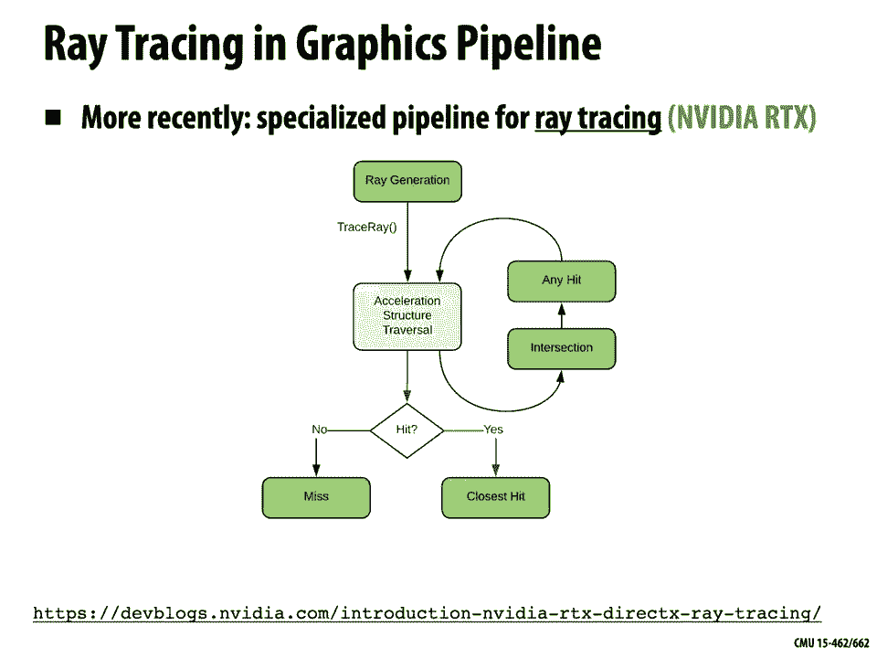

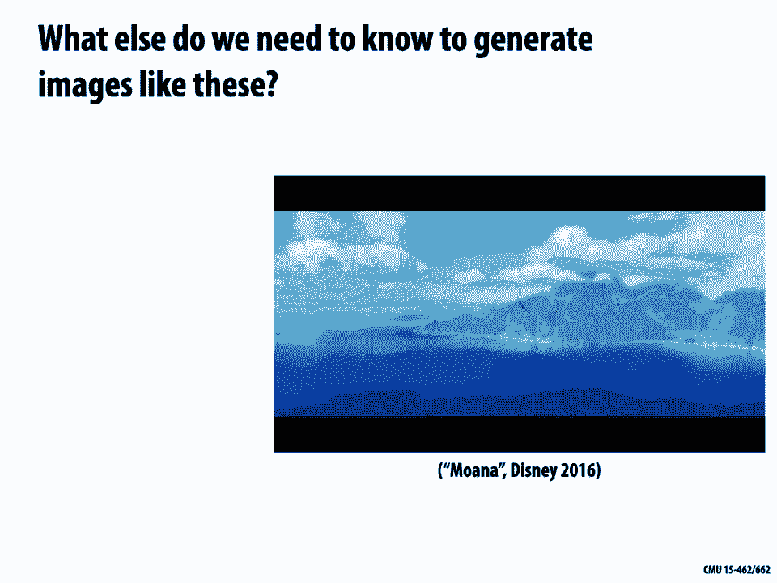

至此，我们已经完成了对**光栅化渲染管线**的全面讨论。然而，要生成我们在电影和游戏中看到的复杂、逼真的图像，我们还有很长的路要走。在接下来的课程中，我们将探索：
*   **几何**：如何表示和建模复杂的形状，而不仅仅是三角形。
*   **材质与光照**：光如何与物体表面交互，从而实现照片级真实感渲染。
*   **动画**：如何数字化地描述物体的运动。

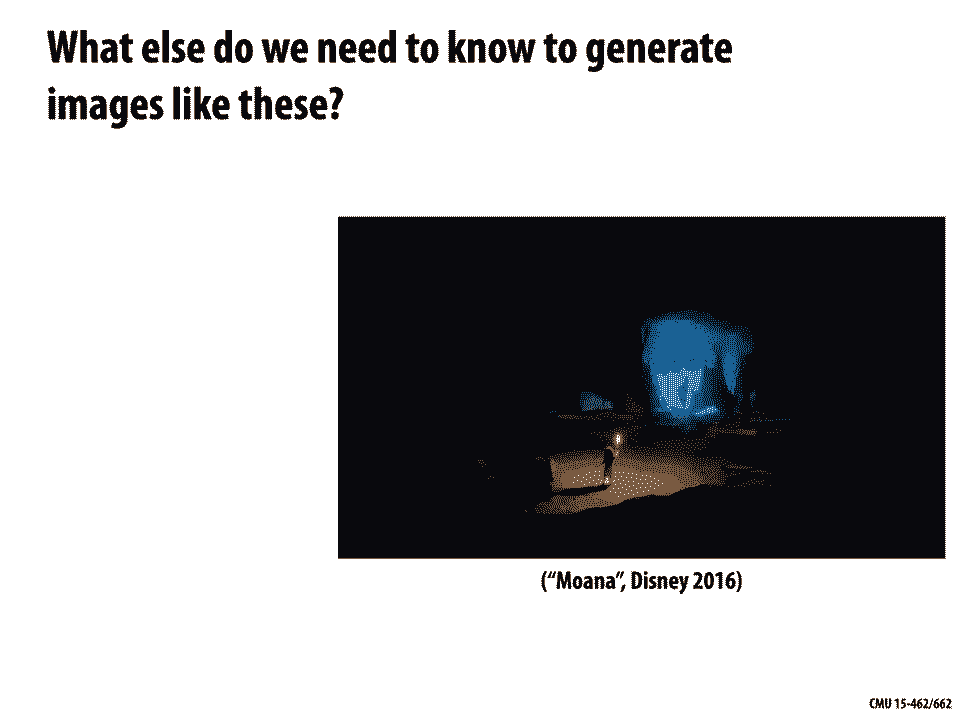

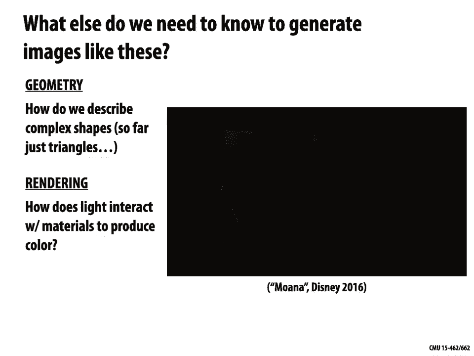

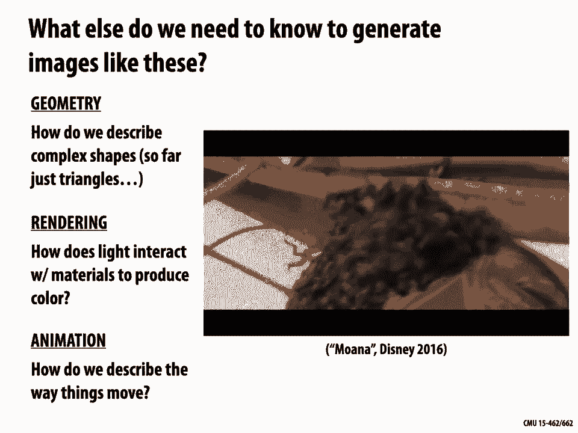

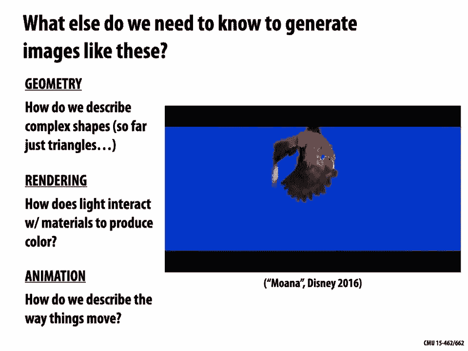

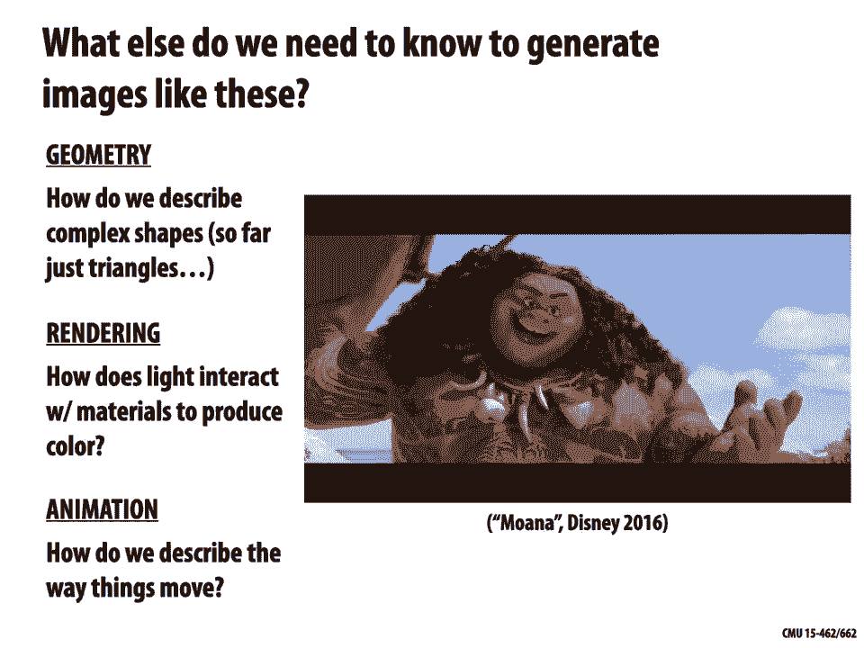

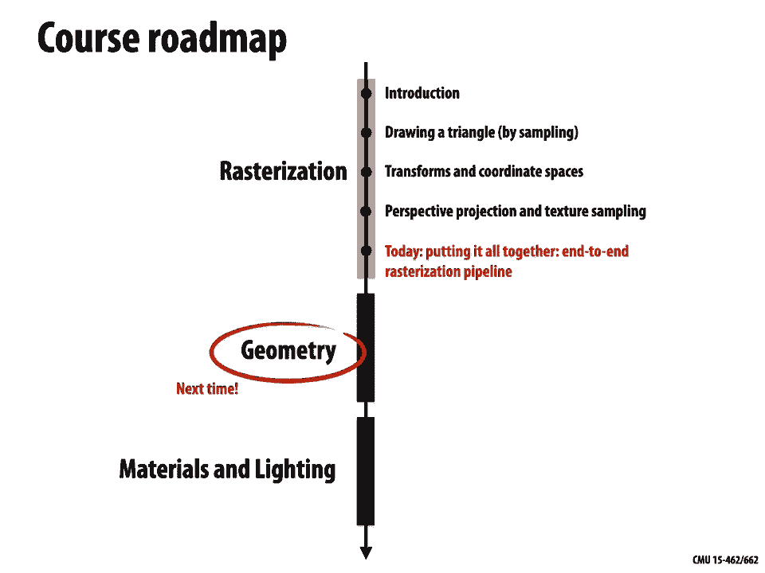

这些主题将带领我们超越基础的光栅化，进入计算机图形学更广阔、更精彩的领域。下次课，我们将从“几何”开始我们的新旅程。