# 计算机图形学：L9：几何导论 🎨

在本节课中，我们将要学习几何处理与建模的基础知识。我们将从光栅化的讨论转向几何处理，探索如何为模型增加几何复杂度，例如添加有趣的曲线、褶皱和细节。

## 概述 📋

上一节我们完成了对光栅化的讨论。本节中，我们将探讨几何处理与建模的核心概念。几何学不仅仅是关于角度和三角形的证明，它更广泛地研究形状、大小、模式和位置。在计算机图形学中，我们需要用数字数据来编码形状，这涉及到多种不同的表示方法。

## 什么是几何学？ 🤔

从语言学的角度看，“几何”（Geometry）一词源于“geo”（地球）和“metry”（测量），最初指对地球的测量。广义上，几何学是研究形状、大小、模式和位置的学科。另一种定义是，几何学研究可以测量长度、角度等量的空间。

历史上，人们很早就开始用类似计算机图形学中多边形网格的离散模型来描述几何。例如，柏拉图曾将地球描述为一个十二面体。在计算机科学中，我们需要讨论如何用数字表示来描述形状。

## 描述形状的方法 📐

有多种方法可以描述一个给定的形状。以屏幕上的红色曲线（单位圆）为例：

*   **语言描述**：直接称之为“单位圆”。在某些编程语言（如SVG）中，可以直接使用“circle”这个词。
*   **隐式描述**：将圆描述为满足方程 **x² + y² = 1** 的所有点 (x, y) 的集合。这并不直接给出圆上的点，但可以测试一个给定点是否在圆上。
*   **显式描述**：使用参数方程，将圆描述为所有点 **(cosθ, sinθ)** 的集合，其中 **θ ∈ [0, 2π]**。这通过参数直接生成圆上的点。
*   **其他方法**：包括微分方程（描述粒子轨迹）、离散近似（用多边形逼近圆）、对称性描述（圆在旋转下保持不变），或通过曲率等属性定义。

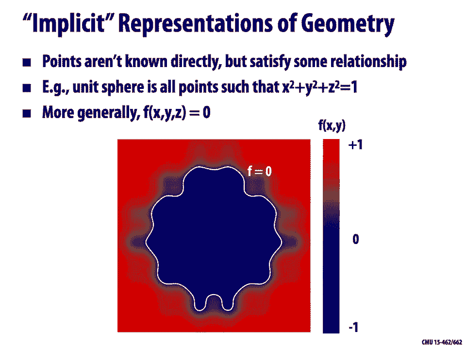

关键在于，对于任何形状，都可能存在多种描述方式。因此，我们需要思考：在计算机上编码几何的最佳方式是什么？

## 几何表示的多样性 🌍

现实世界中的形状种类繁多，没有一种“最佳”的表示方法适用于所有情况。

*   **厨房器皿**：可能由一条曲线绕圆旋转而成，相对容易表示。
*   **汽车引擎**：由多个组件通过交集、并集等布尔运算组合而成。
*   **人脸**：几何结构复杂且微妙，细微变化都承载大量信息，对表示的准确性要求极高。
*   **动态布料或流体**：形状随时间剧烈变化，甚至可能发生分裂或融合，需要能处理拓扑变化的表示方法。
*   **复杂结构（如神庙）**：具有跨越不同尺度的细节，可能需要实例化等解决方案。
*   **毛发或微观结构（如蛋白质）**：可能具有体积特性，而不仅仅是表面；形状对其功能至关重要。

正如皮克斯高级研究科学家David Baraff所说：“我讨厌网格，我无法相信这有多难。” 几何处理确实充满挑战，但我们可以通过一些基本思路来分解并处理这些复杂性。

## 数字编码几何的两大类别 🗂️

数字编码几何的方法主要可分为两大类：

### 1. 显式表示

显式表示直接给出形状上的点。

*   **点云**：最简单的表示，即属于物体的点的列表。优点是简单，缺点是缺乏连接信息。
*   **多边形网格**：不仅存储点（顶点），还存储连接关系（多边形，通常是三角形）。这是我们描述立方体时使用的方法。
*   **更复杂的显式几何**：如细分曲面和NURBS（非均匀有理B样条）。

显式表示使某些任务（如采样表面点）变得非常容易。

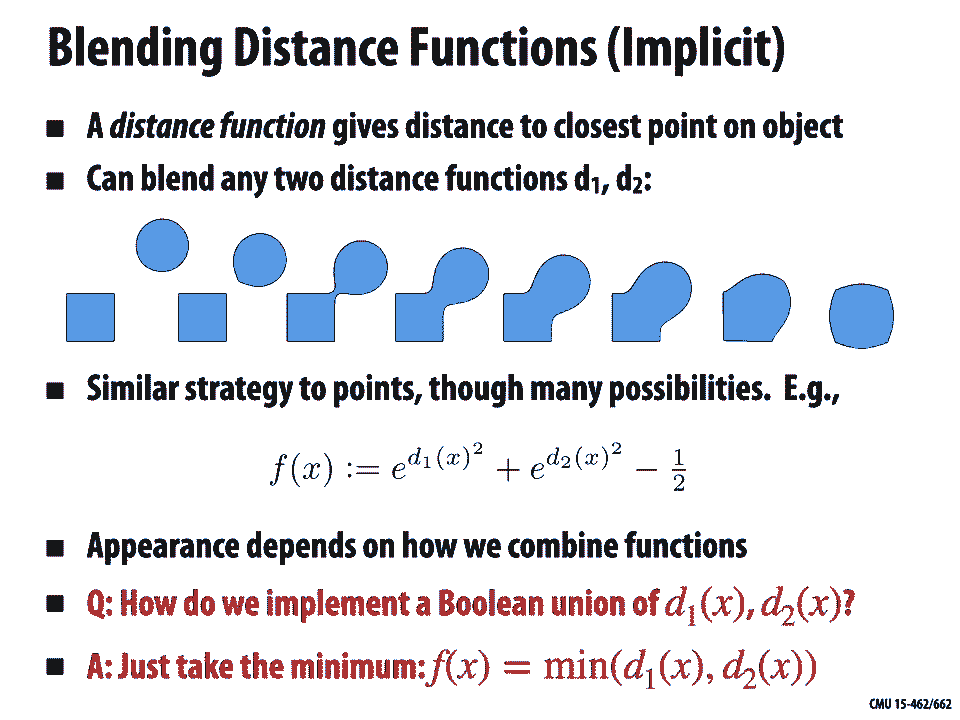

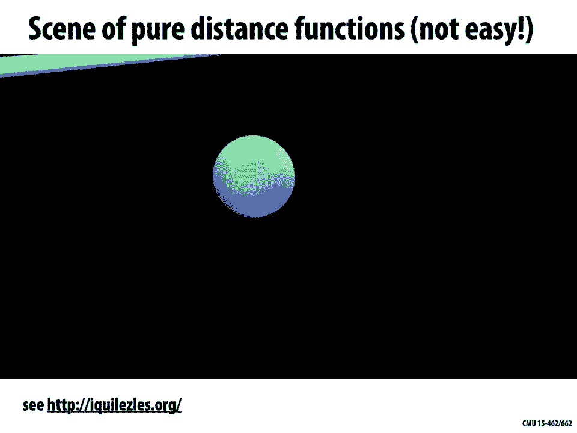

### 2. 隐式表示

隐式表示不直接给出点，而是提供一个测试，判断给定点是否在形状内。

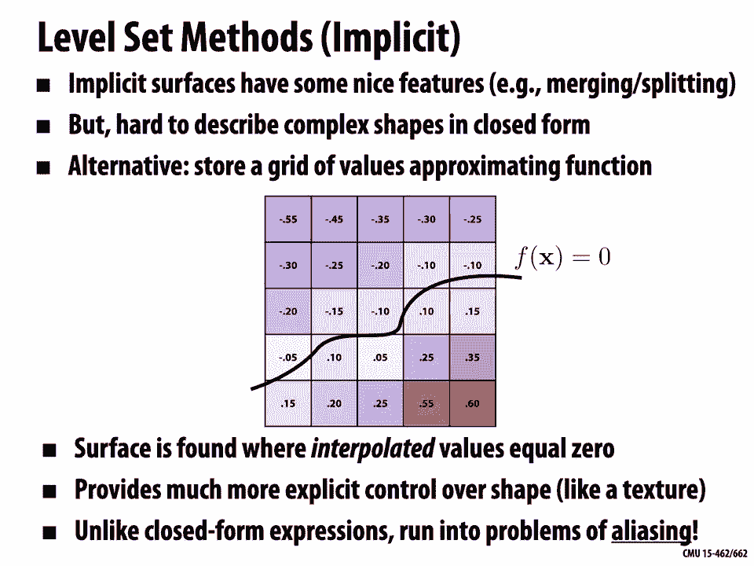

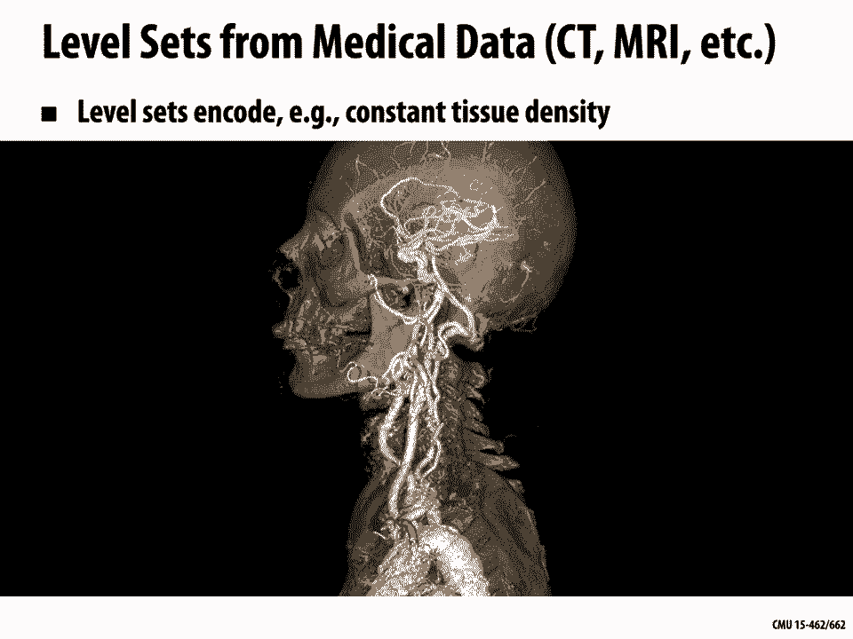

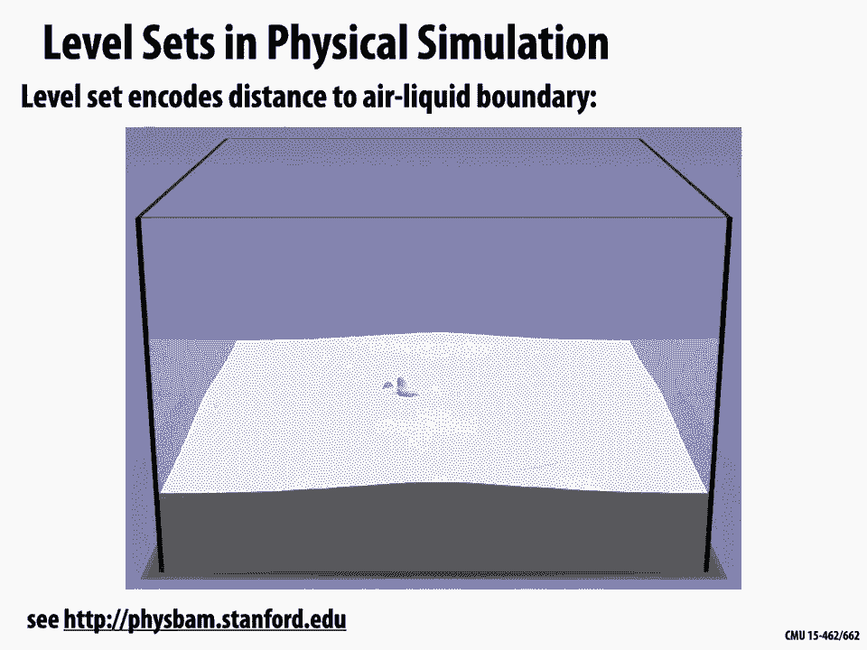

*   **基本思想**：形状是所有满足 **F(x, y, z) = 0** 的点 (x, y, z) 的集合，其中 **F** 是一个函数。
*   **例子**：单位球体是所有满足 **x² + y² + z² = 1** 的点。

隐式表示使其他任务（如判断点在内/外）变得非常容易。

## 隐式与显式表示的比较 ⚖️

通过两个思维游戏可以理解它们的优缺点：

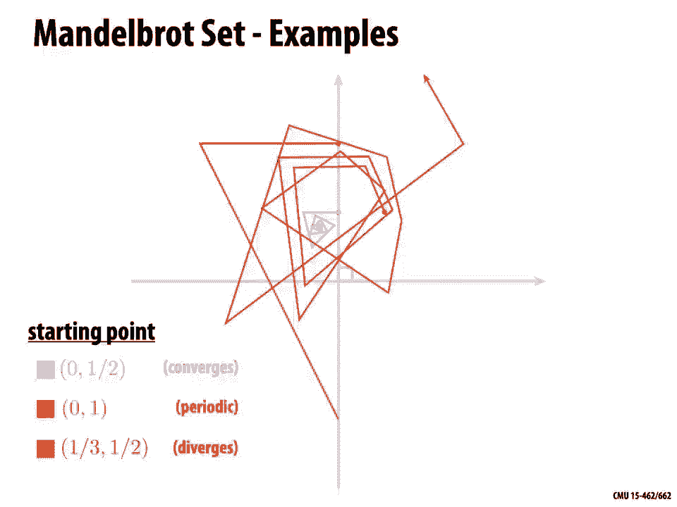

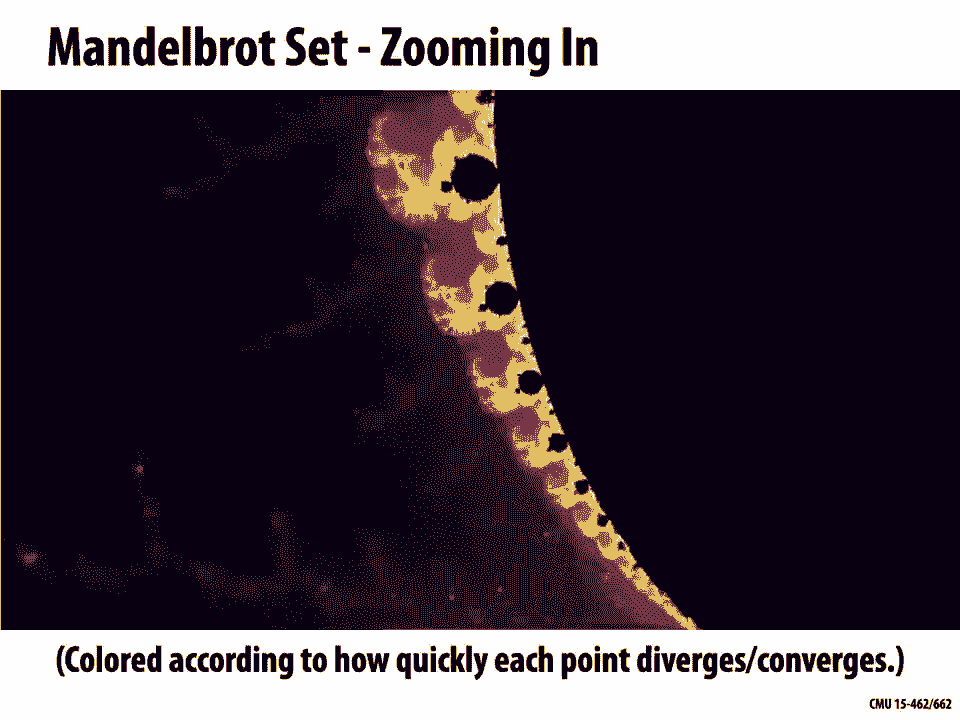

**游戏一（隐式）**：给定隐式函数 **F(x, y, z) = x - 1.23**，其零值点构成一个平面。任务是找出该平面上的任意一点。这很困难，因为你需要解方程。
**结论**：隐式表示难以直接采样表面上的点。

**游戏二（隐式）**：给定隐式函数 **F(x, y, z) = x² + y² + z² - 1**（单位球体）。任务是判断点 (3/4, 1/2, 1/4) 是否在球体内。这很容易，只需计算函数值。
**结论**：隐式表示很容易进行内外测试。

**游戏三（显式）**：给定显式参数曲面 **f(u, v) = (1.23, u, v)**（一个平面）。任务是采样该曲面上的点。这很容易，只需为 u 和 v 选择任意值。
**结论**：显式表示很容易采样表面点。

**游戏四（显式）**：给定显式参数曲面描述一个圆环面。任务是判断一个给定点是否在圆环面内部。这非常困难，因为需要反解参数。
**结论**：显式表示很难进行内外测试。

因此，**没有一种表示在所有任务上都最优**。最佳选择取决于具体任务和几何类型。在实践中，经常需要在不同表示之间进行转换。

## 常见的隐式表示方法 🧊

以下是几种常见的隐式表示：

### 1. 代数曲面
将曲面表示为多项式 **P(x, y, z) = 0** 的零值集。
*   **例子**：球体 **x² + y² + z² = 1**；圆环面有更复杂的公式。
*   **缺点**：很难为复杂形状构造合适的多项式。

### 2. 构造实体几何
通过布尔运算（并集、交集、差集）组合基本形状（球体、圆柱体等）来构建复杂形状。
*   **优点**：适合建模机械零件等硬边物体。
*   **例子**：通过球体与立方体的交集，再减去三个圆柱体，可以得到一个带圆角且穿孔的立方体。

### 3. 水平集方法
不使用封闭公式，而是使用一个网格来存储函数 **F** 的近似值。曲面位于插值后函数值为零的地方。
*   **优点**：可以表示非常复杂的形状（如飞溅的流体），易于处理拓扑变化（合并、分裂）。
*   **缺点**：存储和计算成本高（**O(n³)**），存在走样问题。常用窄带存储等稀疏数据结构来优化。
*   **应用**：医学成像（CT/MRI）、流体模拟。

### 4. 分形
描述具有自相似性和大量细节的自然现象。
*   **例子**：曼德博集合。对于复平面上的每个点 **c**，通过迭代公式 **z_{n+1} = z_n² + c**（从 **z₀ = 0** 开始）判断其是否发散。不发散的点属于该集合。
*   **特点**：能用简单规则产生极其复杂的图案，但形状难以精确控制。

**隐式表示的优缺点总结：**
*   **优点**：描述可能很紧凑；内外测试简单；易于计算到表面的距离；对于简单形状有精确描述；易于处理拓扑变化。
*   **缺点**：难以采样所有表面点；用解析形式建模复杂形状困难。

## 常见的显式表示方法 🔷

以下是几种常见的显式表示：

### 1. 点云
最简单的表示，即属于表面的点的列表，可附带法线、颜色等属性。
*   **优点**：可以表示任何几何；易于绘制（点渲染）。
*   **缺点**：如果采样稀疏，需要填补空白；难以进行需要连接信息的处理或模拟。

### 2. 多边形网格
存储顶点列表和连接这些顶点的多边形（通常是三角形）列表。
*   **表示**：顶点列表：`[(x1, y1, z1), (x2, y2, z2), ...]`；三角形列表：`[(v_idx1, v_idx2, v_idx3), ...]`，索引指向顶点列表。
*   **表面解释**：每个三角形通过重心插值填充：**P = α * P_i + β * P_j + γ * P_k**，其中 **α + β + γ = 1** 且均非负。
*   **优点**：易于处理和模拟；支持自适应采样（在曲率大的地方用更多三角形）；是计算机图形学中最常见的表示之一。
*   **缺点**：数据结构更复杂；邻域关系不规则，编码比图像处理更复杂。

### 3. 曲线与曲面（贝塞尔、B样条、NURBS）
使用参数方程和控制点来定义平滑的曲线和曲面。

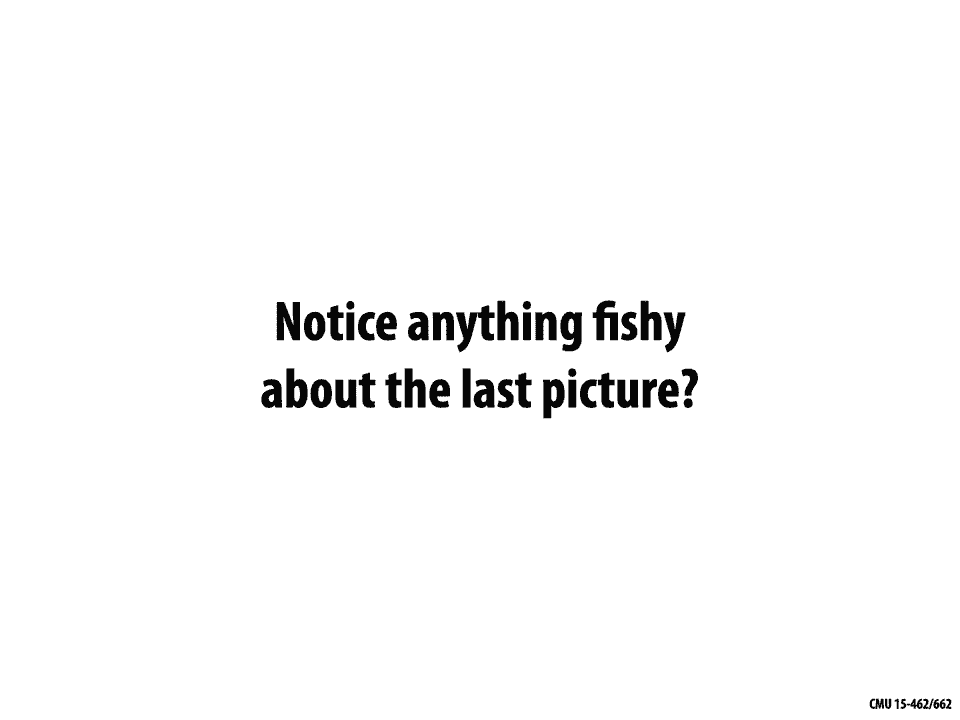

**贝塞尔曲线**：
*   使用伯恩斯坦基函数 **B_i^n(t)** 定义：**C(t) = Σ_{i=0}^{n} B_i^n(t) * P_i**。
*   **性质**：插值端点；端点切线与控制多边形边重合；曲线位于控制点的凸包内。
*   **高次曲线问题**：难以控制。实践中常使用**分段低次（如三次）贝塞尔曲线**，并确保连接处的位置和切线连续（**C¹连续**）。

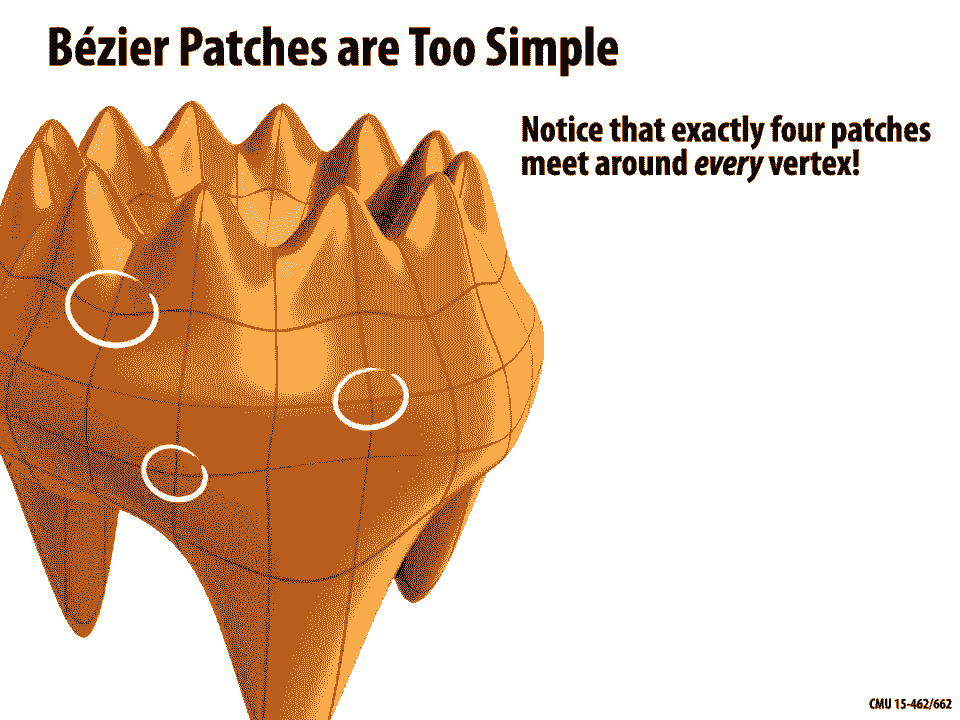

**从曲线到曲面（贝塞尔曲面片）**：
*   通过张量积将曲线推广到曲面：**S(u, v) = Σ_{i=0}^{m} Σ_{j=0}^{n} B_i^m(u) B_j^n(v) * P_{ij}**。
*   连接多个曲面片可以形成复杂曲面，但确保片与片之间的光滑连接比曲线情况更复杂。

**NURBS（非均匀有理B样条）**：
*   **NURBS = Non-Uniform Rational B-Splines**。
*   **非均匀**：节点向量可以非均匀。
*   **有理**：在齐次坐标下进行插值，然后投影回平面，这允许**精确表示圆锥曲线**（如圆、圆柱）。
*   **优点**：易于求值；可精确表示圆锥曲线；具有高阶连续性。
*   **缺点**：拼接曲面片以保证连续性较难；编辑可能复杂。

### 4. 细分曲面
从一个粗糙的控制网格（控制笼）开始，通过重复地**细分**（分割面）和**平均**（按规则更新顶点位置）来生成越来越光滑的曲面。
*   **例子**：Lane-Riesenfeld算法用于曲线，Catmull-Clark细分用于四边形网格，Loop细分用于三角形网格。
*   **优点**：建模更容易（只需移动控制笼顶点）；非常流行（如皮克斯广泛使用）。
*   **缺点**：求值比参数曲面稍复杂；在奇异点（如非四边面汇合点）需要特殊处理连续性。

**显式表示的优缺点总结：**
*   **优点**：易于采样表面点；适合渲染；某些表示（如细分曲面）易于编辑。
*   **缺点**：内外测试困难；数据结构可能复杂；确保参数曲面片之间的连续性可能具有挑战性。

## 总结 🎓

本节课中，我们一起学习了计算机图形学中几何处理的基础。我们探讨了：
1.  **几何学的多种描述方式**，以及数字表示的必要性。
2.  **隐式与显式表示**的根本区别及其核心优缺点：隐式利于查询（内外测试），显式利于采样。
3.  **多种具体的几何表示方法**，包括代数曲面、构造实体几何、水平集、分形等隐式方法，以及点云、多边形网格、贝塞尔曲线/曲面、NURBS和细分曲面等显式方法。

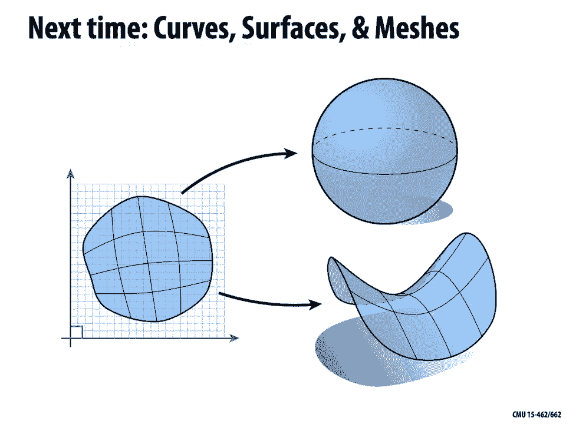

每种表示方法都有其适用的任务和几何类型。在计算机图形学实践中，根据需求（如建模难度、渲染效率、模拟要求）选择合适的表示，并经常在它们之间进行转换，是一项关键技能。下一讲，我们将更深入地探讨曲线、曲面以及处理网格数据结构。