# 11：网格和流形 📐

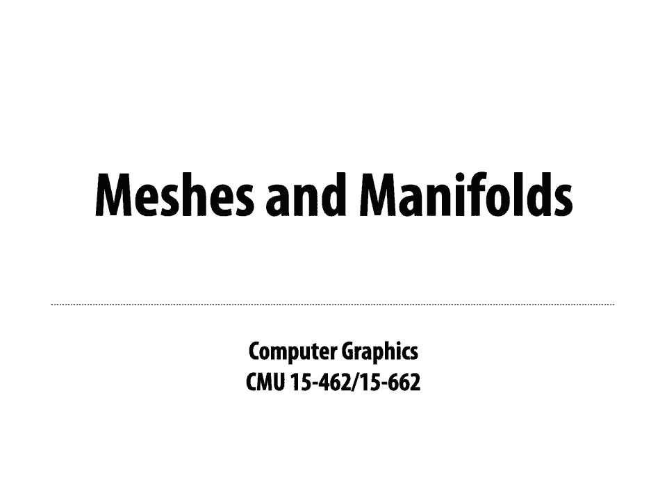

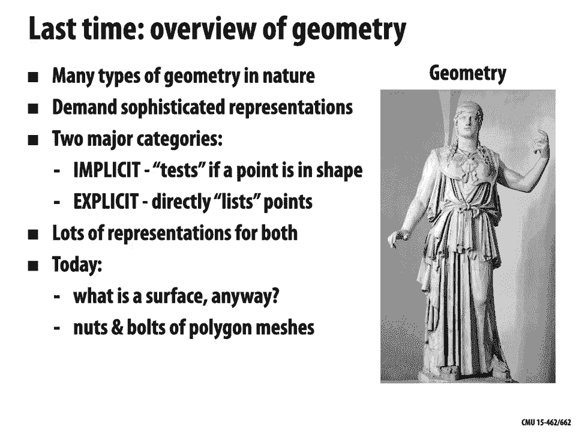

在本节课中，我们将深入学习几何表示的核心内容，特别是多边形网格。我们将探讨什么是“流形”表面，并详细介绍几种用于存储和处理网格的数据结构，从简单的列表到更复杂的半边数据结构。

## 概述：从几何到网格

上一节我们开始讨论几何表示。本节中，我们将深入探讨处理网格的具体细节。我们之前看到，几何表示主要分为两类：**隐式**（通过测试点是否在形状内来定义）和**显式**（直接列出或生成形状中的点）。多边形网格属于显式表示。

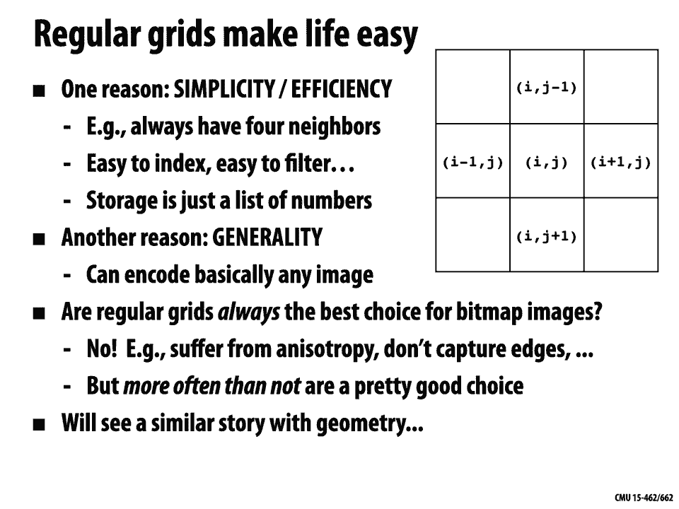

为了在计算机图形学中高效地处理几何，我们需要做出一些关键的假设，并使用合适的数据结构。这自然地将我们引向下一节关于几何处理的内容。

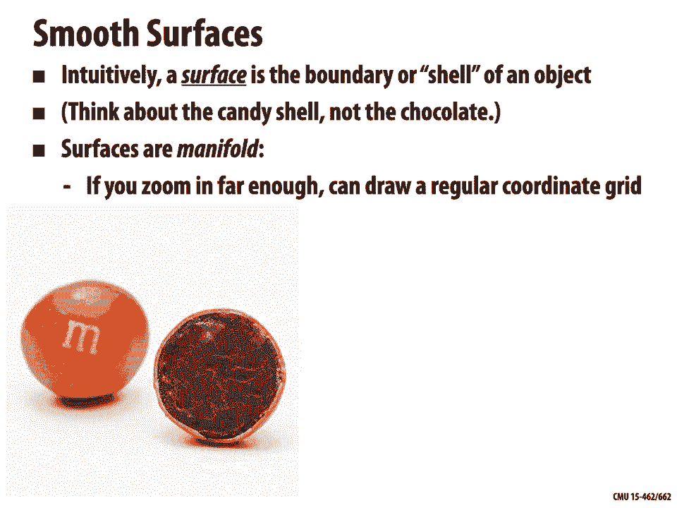

## 为什么是网格？一个图像的类比

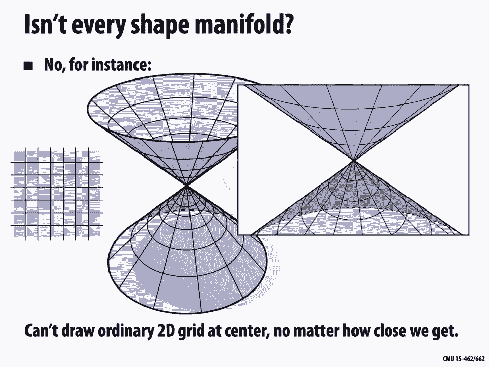

在深入网格之前，让我们回顾一个更熟悉的例子：二维图像。在光栅化中，我们将图像表示为**像素**的**正方形网格**。为什么选择正方形？

*   **简单高效**：每个像素有四个邻居（上、下、左、右），易于索引、应用滤波器和存储（一个长数组）。
*   **通用性**：理论上可以表示任何图像。

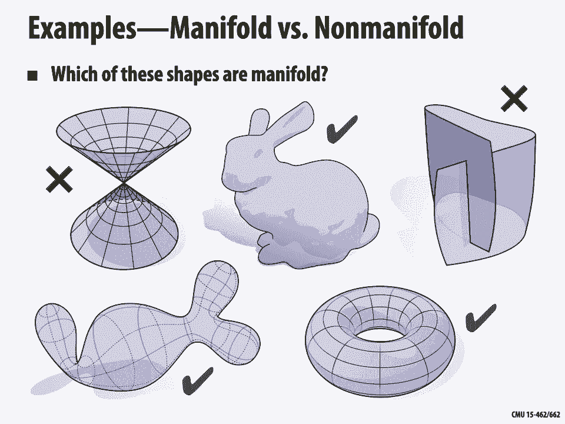

当然，正方形网格并非完美（例如，它偏好水平和垂直方向），但在简单性、效率和通用性之间取得了良好平衡。我们在为几何选择数据结构时，也需要权衡类似的准则。

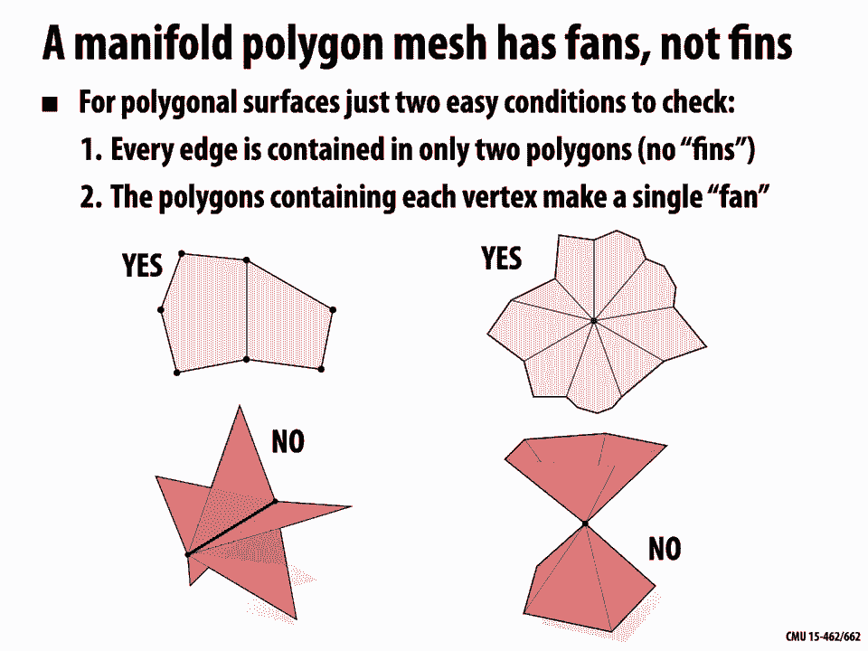

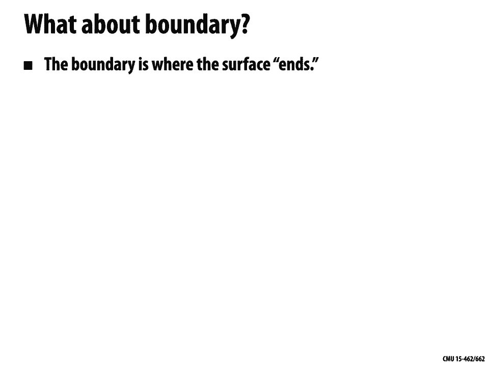

## 什么是表面与流形？🧩

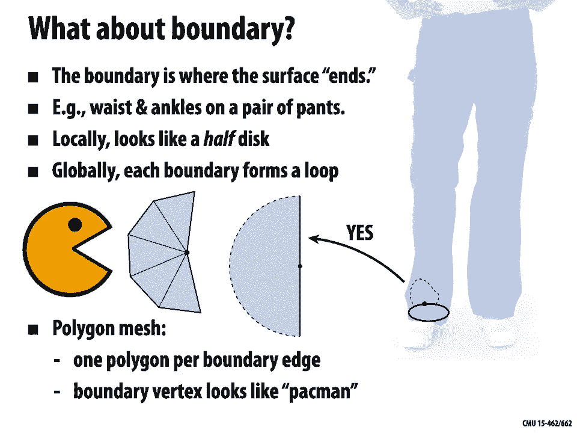

首先，我们需要明确“表面”的含义。在数学上，表面特指物体的**边界或外壳**，而非其内部实体。一个关键属性是，表面通常是**流形**。

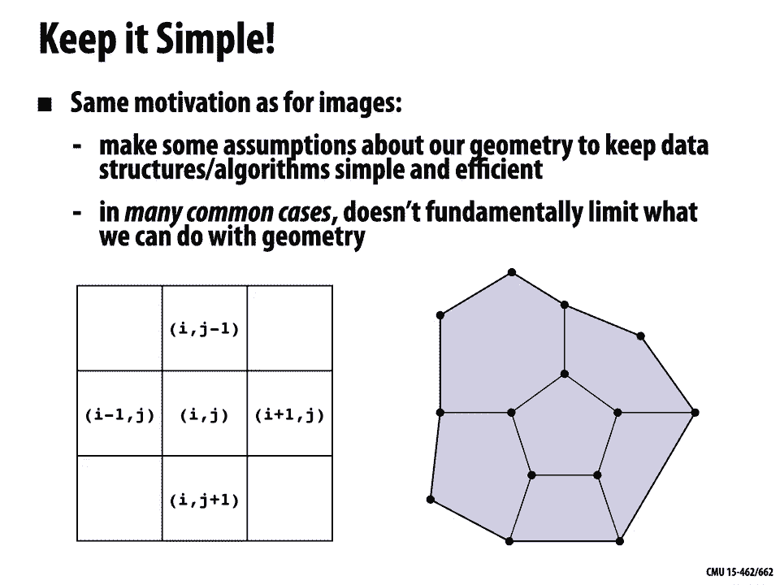

流形的直观理解是：在形状上的**任意一点**，如果你**足够放大**，该点的邻域应该看起来像一个**二维坐标网格**（即一个平面片）。例如，地球从太空看是球体，但放大到曼哈顿岛，你可以用街道和大道建立一个局部网格。

那么，是否所有形状都是流形？并非如此。考虑一个“沙漏”形状的中心点，无论放大多少，都无法在其上放置一个简单的二维网格，因为该点连接了多个方向。因此，**并非所有形状都是流形**。

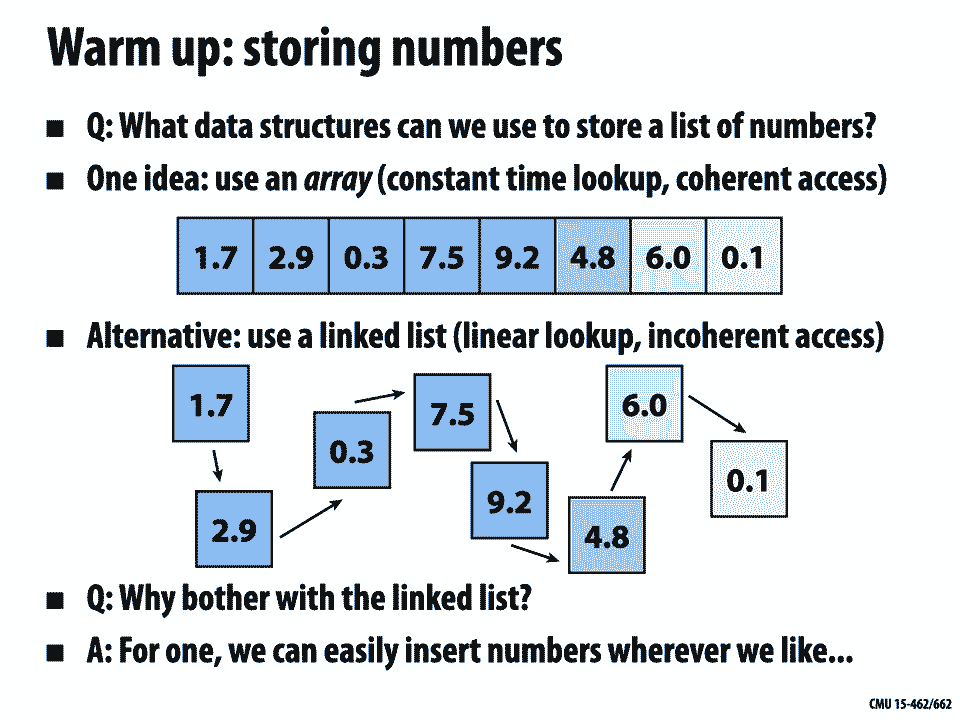

## 流形网格的判定条件

对于多边形网格（特别是三角形网格），流形条件可以具体化为两条简单的规则，可以用一个口诀记忆：**有扇区，无鳍片**。

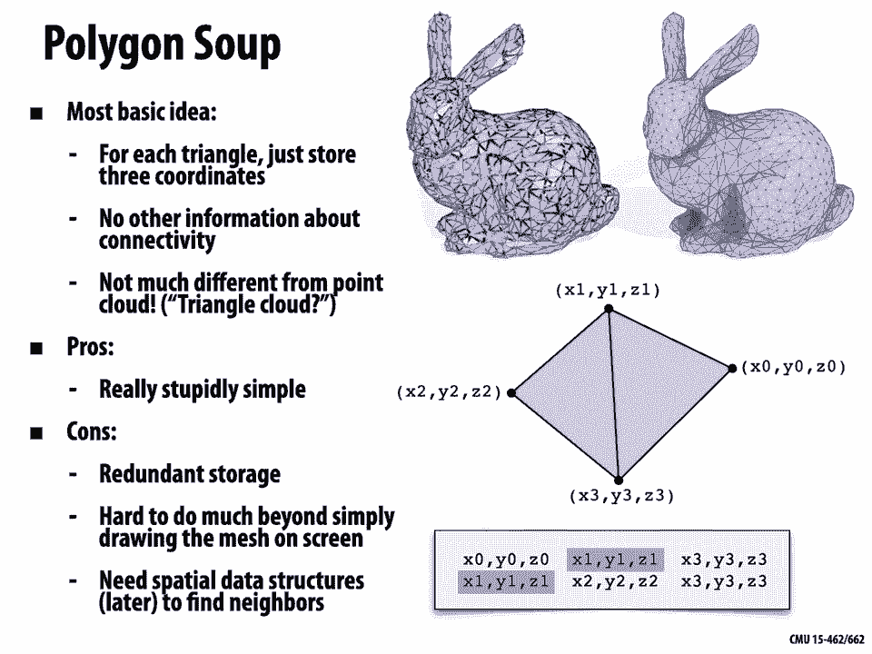

以下是判定条件：

1.  **边的条件**：网格中的每条边**必须恰好被两个多边形共享**（对于内部边），或者**只被一个多边形共享**（对于边界边）。
2.  **顶点的条件**：网格中的每个顶点**必须被一个单一的多边形扇区（或环）所包围**（对于内部顶点），或者被一个多边形条带所包围（对于边界顶点）。

违反这些条件的例子包括：一条边被三个或更多多边形共享（形成“鳍片”），或者一个顶点属于两个分离的多边形扇区（如沙漏尖端）。

## 为什么假设流形？⚖️

做出流形假设的原因与我们选择正方形像素网格类似：
*   **简单性与高效性**：流形结构规则，可以简化算法和数据结构的设计，我们无需处理各种奇怪的连接情况。
*   **通用性**：对于动画、模拟和建模中需要表示的大多数形状（如角色、物体），流形假设通常是成立的。

这个假设将帮助我们设计出强大而高效的数据结构。

## 如何存储网格？数据结构探索 🗃️

面对存储网格数据的挑战，让我们从一个简单问题开始：如何存储一个数字列表？两种基本选择是：
*   **数组**：查找快，内存访问连贯，但插入/删除元素成本高。
*   **链表**：易于插入/删除，但查找慢，内存访问可能不连贯。

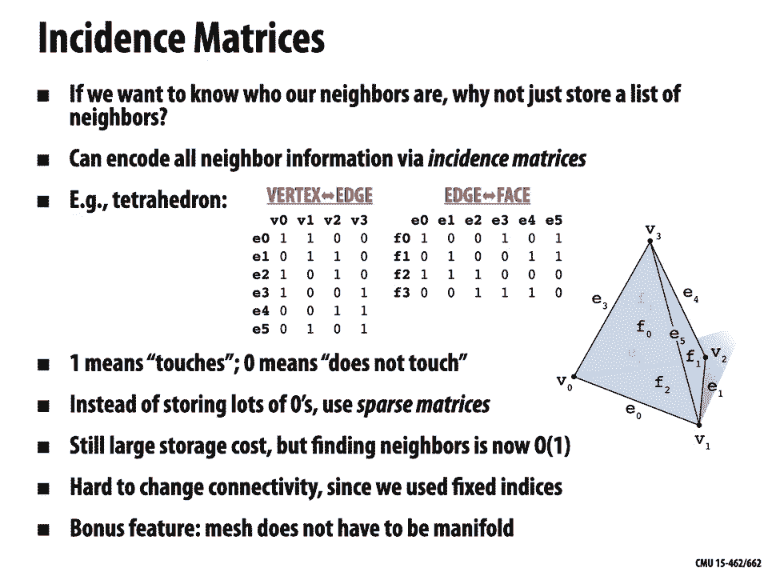

多边形网格的数据结构也体现了类似的权衡。让我们逐一探讨。

### 1. 多边形汤（Polygon Soup）

这是最简单的方法：直接存储每个三角形的三个顶点坐标 `(x, y, z)`。
```cpp
// 例如：两个三角形
[x1, y1, z1, x2, y2, z2, x3, y3, z3] // 三角形1
[x1, y1, z1, x3, y3, z3, x4, y4, z4] // 三角形2
```
*   **优点**：极其简单，易于光栅化。
*   **缺点**：数据冗余（顶点被重复存储）；难以进行任何需要邻域信息的操作（如平滑）。

### 2. 邻接列表（Adjacency List）

这种方法将数据分为两部分：
1.  **顶点列表**：存储所有唯一的顶点坐标 `(x, y, z)`。
2.  **面列表**：存储构成每个三角形的顶点索引。
```cpp
// 顶点列表
V = [v0(x,y,z), v1(x,y,z), v2(x,y,z), v3(x,y,z)]
// 面列表（索引）
F = [[0, 1, 2], [0, 2, 3], ...]
```
*   **优点**：消除了顶点冗余，分离了几何（位置）和拓扑（连接关系）。
*   **缺点**：查找一个顶点的所有邻接面效率低下（需要遍历所有面）。

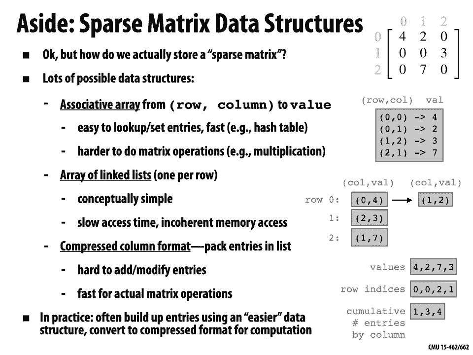

### 3. 关联矩阵（Incidence Matrices）

这种方法显式地存储元素之间的关联关系，使用矩阵。例如：
*   **顶点-边关联矩阵**：行代表边，列代表顶点，如果边包含顶点，则对应位置为1。
*   **边-面关联矩阵**：行代表面，列代表边，如果面包含边，则对应位置为1。

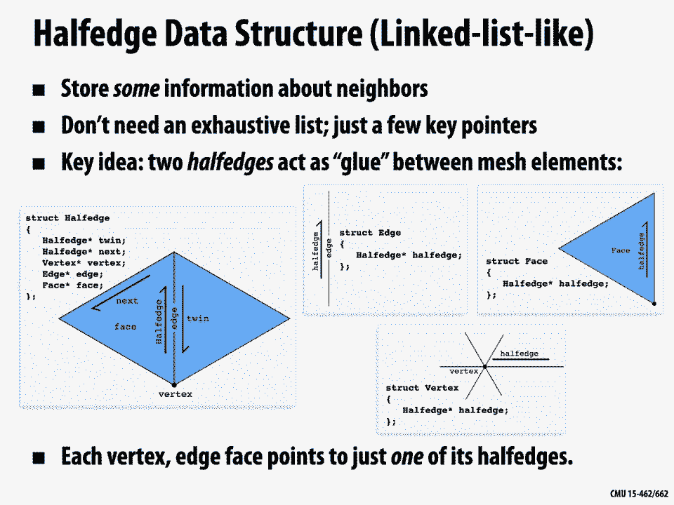

由于矩阵非常**稀疏**（大多数元素为0），我们使用稀疏矩阵格式存储，如**压缩列存储格式**：
*   存储所有非零值及其行索引。
*   用一个额外数组记录每列非零值的累积数量。
*   **优点**：能快速回答邻域查询。
*   **缺点**：存储开销相对较大；修改网格连接性较复杂。

### 4. 半边数据结构（Half-Edge Data Structure）🔗

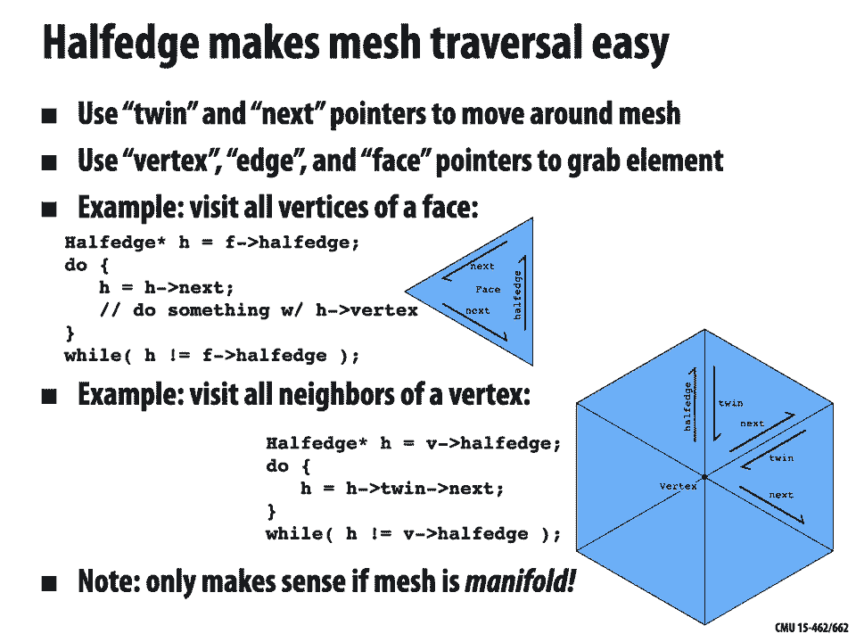

这是最强大、最常用的网格数据结构之一，它类似于链表的思想。核心概念是将每条边拆分为两个方向相反的**半边**。

每个半边存储以下指针：
*   `twin`：指向同一原始边上的另一个半边。
*   `next`：指向同一多边形内按顺序的下一个半边。
*   `vertex`：指向该半边起点的顶点。
*   `face`：指向该半边所属的多边形。
*   `edge`：指向该半边所属的边。

其他元素（顶点、边、面）只需存储一个指向其关联的半边的引用。

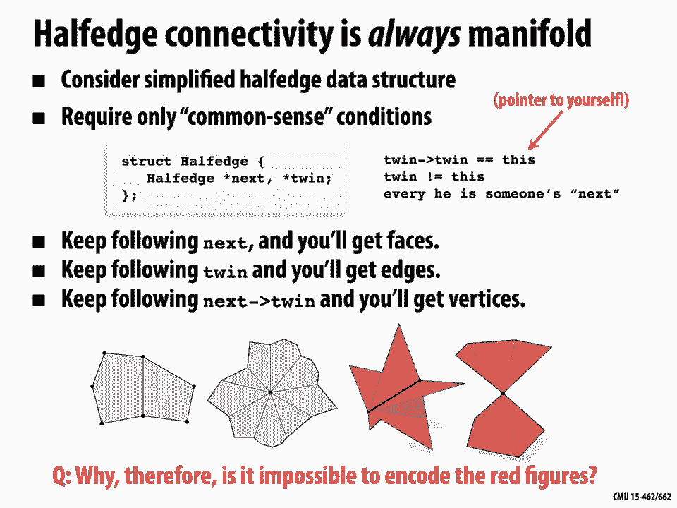

**遍历示例**：要遍历一个面的所有顶点，可以从 `face.halfedge` 开始，然后重复执行 `halfedge = halfedge.next`，直到回到起点，并沿途收集 `halfedge.vertex`。

半边数据结构**天然强制流形条件**。有效的半边连接（满足 `twin.twin == self`，`twin != self`，每个半边都是某个半边的 `next`）必然描述一个流形网格。

**优点**：
*   支持高效的局部网格操作（如翻转、分裂、收缩边）。
*   邻域查询速度快。

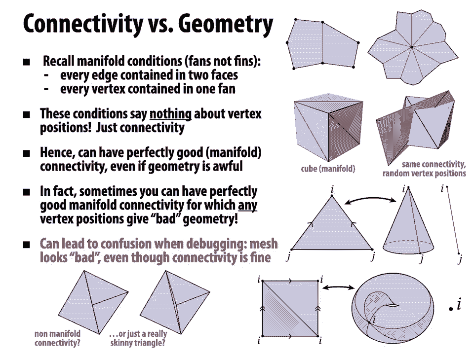

**缺点**：
*   存储开销大（许多指针）。
*   内存访问可能不连贯。
*   通常假定流形网格。

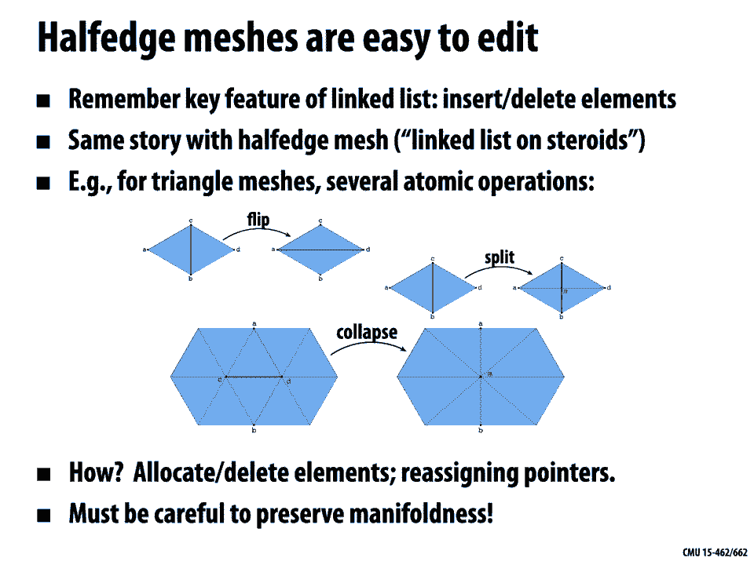

## 连接性与几何的分离 💡

一个关键且容易混淆的点是：**完美的流形连接性并不保证合理的几何形状**。
*   连接性（拓扑）指的是顶点、边、面如何连接。
*   几何指的是顶点的实际 `(x, y, z)` 坐标。

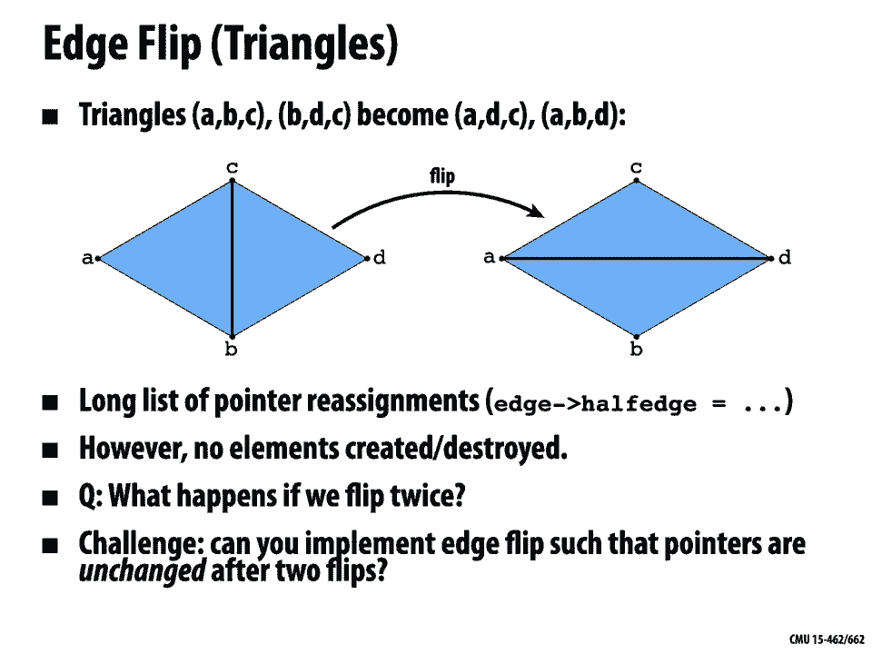

你可以有一个连接性完全正确（流形）的网格，但将顶点位置设置得乱七八糟，导致面相交、重叠等视觉上的“错误”。在调试时，需要区分是连接性问题还是几何问题。

## 网格操作与应用 🛠️

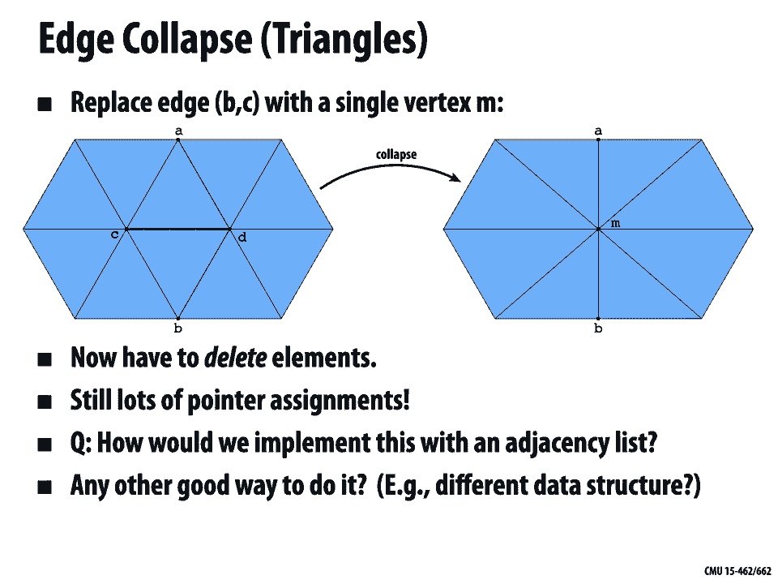

拥有了像半边结构这样强大的数据结构，我们可以实现许多局部网格操作：
*   **边翻转**：改变共享边的两个三角形的对角线连接。
*   **边分裂**：在边中点插入新顶点，细分相邻面。
*   **边收缩**：将一条边的两个顶点合并为一个。

这些操作是**细分曲面建模**的基础。艺术家可以从一个粗糙的“控制笼”开始，通过局部操作塑造大体形态，然后通过细分规则自动生成光滑的细节表面。

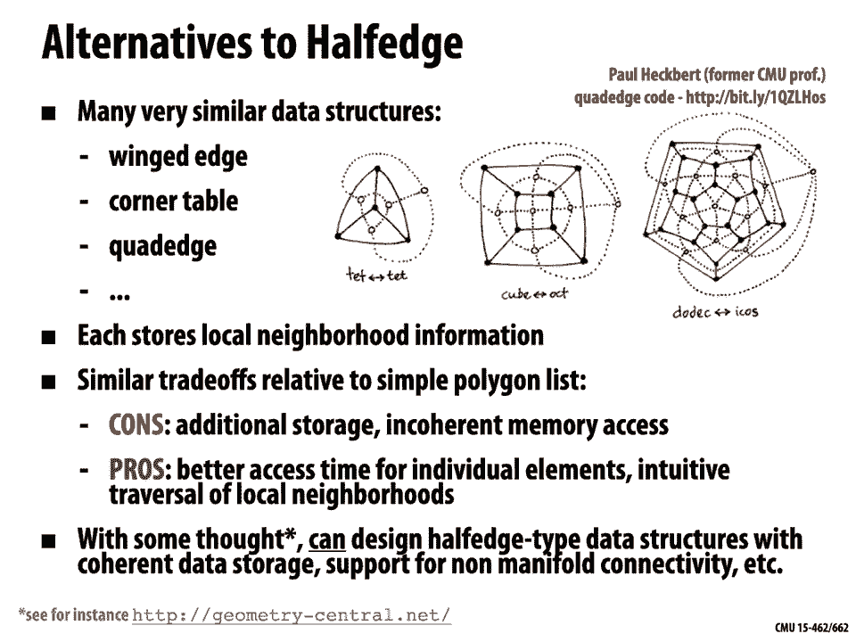

此外，这些数据结构使得**数字几何处理**成为可能，即像处理音频、图像信号一样，对几何形状进行滤波、平滑、简化等操作。

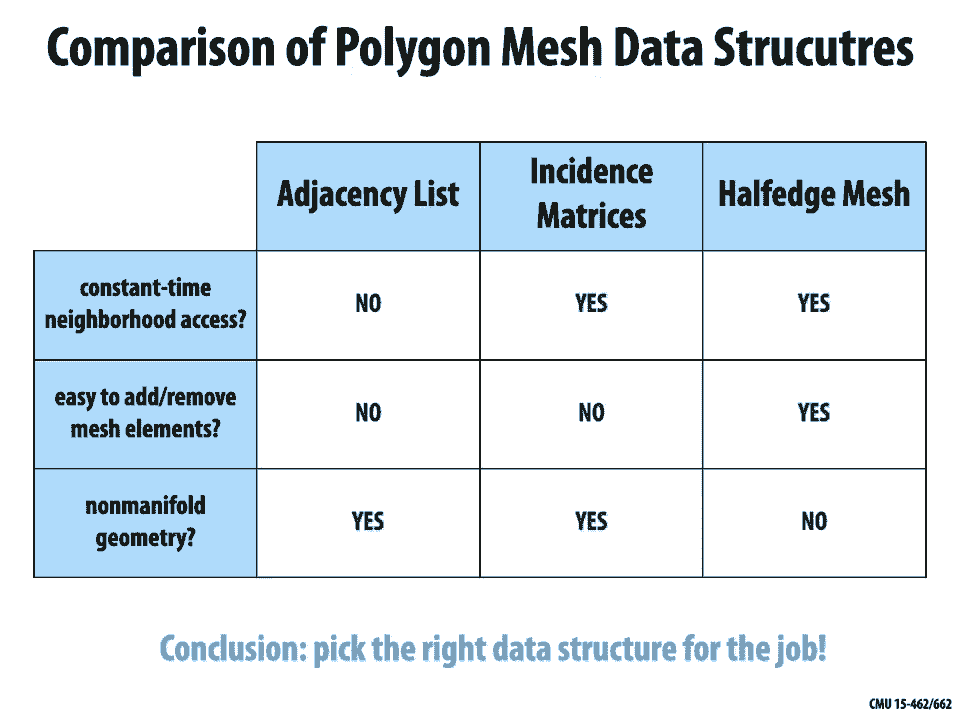

## 总结

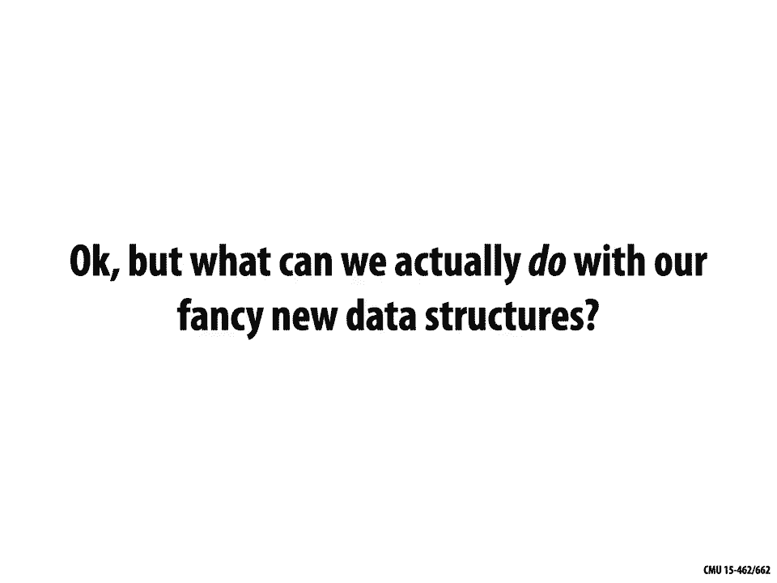


本节课我们一起深入探讨了多边形网格的核心概念：
1.  **流形表面**：定义了我们可以有效处理的“规整”形状类型，其局部类似于平面。
2.  **数据结构权衡**：我们比较了从简单的多边形汤、邻接列表、关联矩阵到复杂的半边数据结构。没有一种结构是万能的，选择取决于任务需求（如是否需要快速邻域查询、动态编辑）。
3.  **半边数据结构**：作为重点，它通过丰富的指针网络高效编码流形网格，支持复杂的局部操作和遍历，是许多几何处理算法的基础。
4.  **连接性与几何**：理解了拓扑连接和顶点位置是独立的概念，这对于调试和算法设计至关重要。

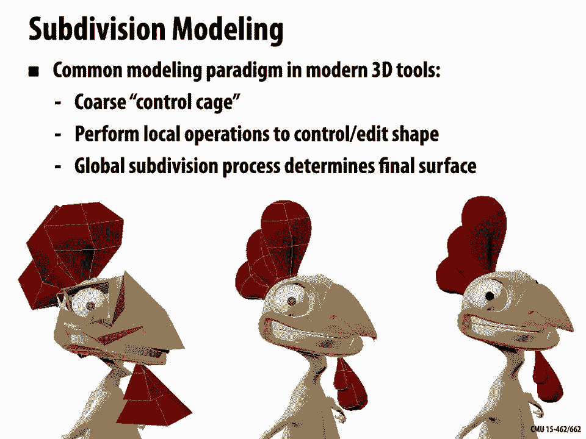

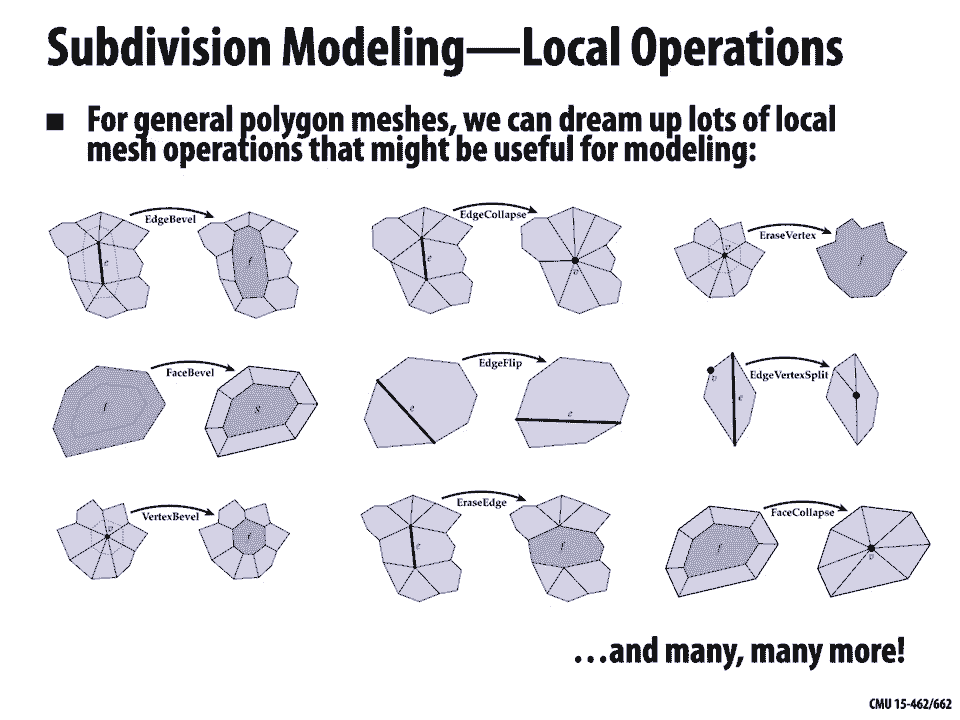

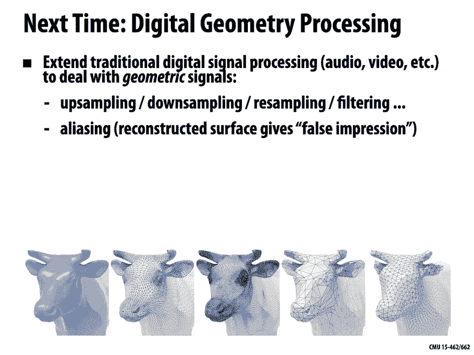

掌握这些基础知识，为我们下一节进入几何处理领域做好了准备。