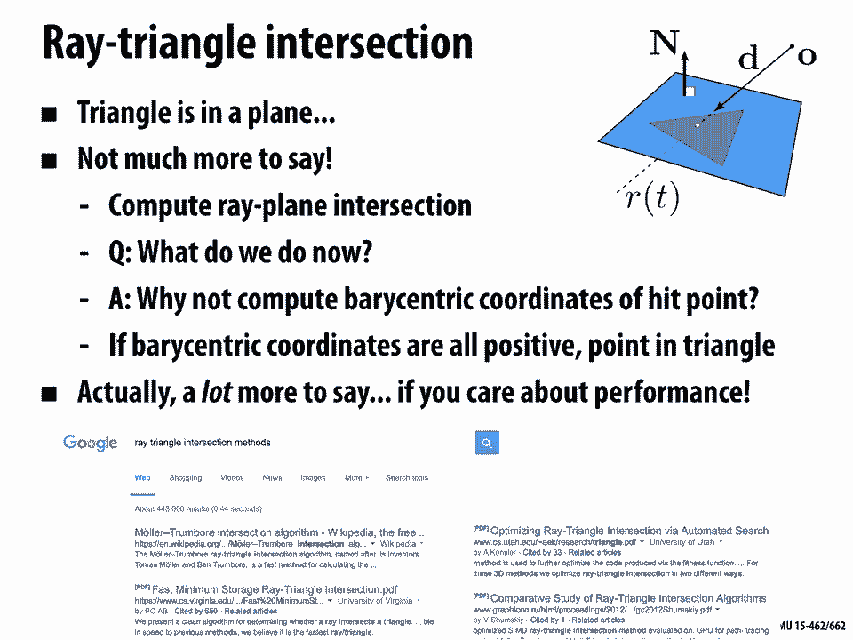
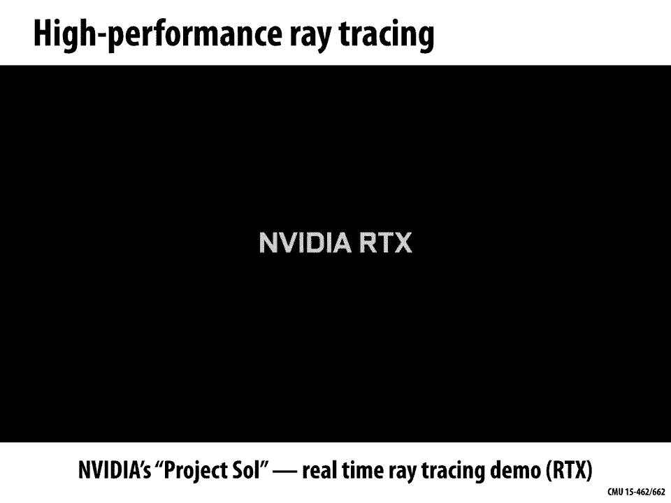
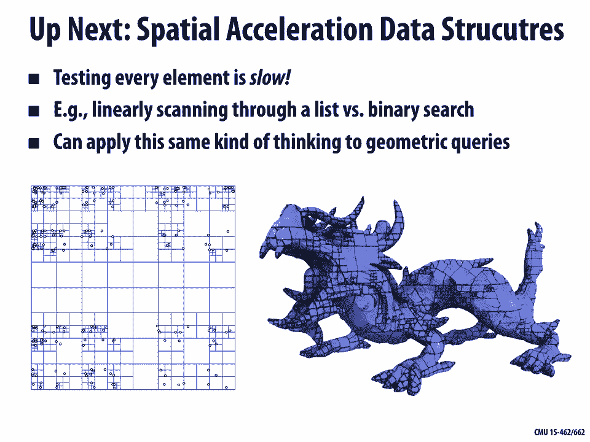

# 13：几何查询 🧮

在本节课中，我们将学习如何对几何体进行各种查询，例如计算点到几何体的最近距离、射线与几何体的交点，以及判断几何体之间是否相交。这些查询是计算机图形学中许多核心任务的基础，包括动画、渲染和几何处理。

上一节我们讨论了网格数据结构，本节我们将重点转向如何利用这些结构回答具体的几何问题。

---

## 几何查询概述

几何查询的核心是询问两个或多个几何对象之间的空间关系。常见的查询包括：
*   **最近点查询**：给定一个点，找到几何体上离它最近的点。
*   **射线相交查询**：判断一条射线是否与几何体相交，并找出交点。
*   **相交测试**：判断两个几何体是否相交。

这些查询在图形学中无处不在。例如，在动画中用于碰撞检测，在渲染中用于计算阴影和可见性。

---

## 最近点查询

最近点查询是许多几何处理任务的基础。例如，在处理网格时，我们可能希望将变形后的顶点“拉回”到原始表面上，以保持形状的保真度。这需要为每个顶点找到其在原始表面上的最近点。

### 点到点的最近距离

我们从最简单的情况开始：计算一个查询点 `P` 到另一个点 `A` 的距离。这很简单，距离就是两点之间的欧几里得距离。

**公式**：
`distance(P, A) = sqrt((P.x - A.x)^2 + (P.y - A.y)^2 + (P.z - A.z)^2)`

### 点到直线的最近点

现在考虑查询点 `P` 到一条无限直线 `L` 的最近点。直线可以用隐式方程 `n^T * X = c` 表示，其中 `n` 是单位法向量。

**算法思路**：
从点 `P` 出发，沿着（或反方向）法向量 `n` 移动一段距离 `t`，直到到达直线上的点 `X`。即求解 `X = P + t * n`，并满足直线方程 `n^T * X = c`。

**推导与公式**：
1.  将 `X = P + t * n` 代入直线方程：`n^T * (P + t * n) = c`
2.  展开：`n^T * P + t * (n^T * n) = c`
3.  由于 `n` 是单位向量，`n^T * n = 1`。
4.  解得：`t = c - n^T * P`
5.  因此，最近点为：`closest_point = P + (c - n^T * P) * n`

### 点到线段的最近点

线段由两个端点 `A` 和 `B` 定义。点到线段的最近点可能是线段内部的点，也可能是某个端点。

**算法步骤**：
1.  首先，将线段视为其所在的无限直线，利用上述方法找到查询点 `P` 在该直线上的投影点 `X_proj`。这可以通过参数 `t` 表示：`X_proj = A + t * (B - A)`，其中 `t` 的计算方式与点到直线类似，但需针对线段进行调整。
2.  然后，检查参数 `t`：
    *   如果 `0 <= t <= 1`，则投影点在线段内部，它就是最近点。
    *   如果 `t < 0`，则最近点是端点 `A`。
    *   如果 `t > 1`，则最近点是端点 `B`。

### 点到三角形的最近点（2D & 3D）

对于二维平面内的三角形，查询点 `P` 的最近点可能是三角形的某个顶点、某条边上的点，或者就是 `P` 本身（如果 `P` 在三角形内部）。

**算法思路（3D情况）**：
1.  **投影到平面**：首先，将查询点 `P` 垂直投影到三角形所在的平面上，得到点 `P_proj`。计算点到平面的最近点方法与点到直线类似，只是将直线法向量替换为平面法向量。
2.  **判断位置**：判断投影点 `P_proj` 是否在三角形内部（使用重心坐标或符号面积等测试）。
    *   如果在内部，则 `P_proj` 就是最近点。
    *   如果在外部，则最近点必定在三角形的某条边上。此时，问题转化为分别计算 `P` 到三条边的最近点，然后取其中距离最小的一个。

### 点到三角形网格的最近点（朴素算法）

对于一个由许多三角形组成的网格，最直接的算法是遍历网格中的每一个三角形。

**朴素算法步骤**：
1.  对于网格中的每个三角形，计算查询点 `P` 到该三角形的最近点及其距离。
2.  在遍历过程中，始终记录当前找到的最小距离以及对应的最近点。
3.  遍历完成后，记录的点即为全局最近点。

**复杂度分析**：该算法需要检查每一个三角形，因此时间复杂度为 **O(n)**，其中 `n` 是三角形的数量。对于包含数百万甚至数十亿三角形的复杂模型，这个开销非常大。我们将在下一讲讨论如何利用空间加速数据结构来优化此类查询。

---

## 隐式表面的最近点查询

当几何体以隐式表面（例如，符号距离函数 SDF）表示时，最近点查询可以采用不同的策略。

**算法思路（梯度下降）**：
1.  从查询点 `P` 开始。
2.  计算距离场在该点的梯度 `∇f(P)`。梯度的方向指向距离增加最快的方向，因此反方向 `-∇f(P)` 指向表面。
3.  沿着 `-∇f(P)` 方向移动一小步，得到新的点 `P_new`。
4.  重复步骤2和3，直到 `f(P)` 的值接近零（即到达表面），或达到最大迭代次数。

**优缺点**：
*   **优点**：算法是局部的，不需要遍历整个几何表示。
*   **缺点**：可能需要多次迭代；可能收敛到局部最近点而非全局最近点；需要计算梯度。
*   **内存与计算权衡**：另一种策略是预计算并存储每个网格单元对应的最近点坐标。这会占用大量内存，但查询时只需一次查找，速度极快，适用于需要执行海量查询的场景。

---

## 射线相交查询

射线相交查询在光线追踪、碰撞检测和内外测试中至关重要。一条射线由起点 `O`（原点）和单位方向向量 `D` 定义：`R(t) = O + t * D`，其中 `t >= 0`。

### 射线-球体相交

球体（以原点为中心，半径为1）的隐式方程为：`f(X) = ||X||^2 - 1 = 0`。

**算法步骤**：
1.  将射线方程代入球体方程：`||O + tD||^2 - 1 = 0`。
2.  展开并整理成关于 `t` 的二次方程：`at^2 + bt + c = 0`，其中：
    *   `a = D·D` （通常为1，因为 `D` 是单位向量）
    *   `b = 2*(O·D)`
    *   `c = O·O - 1`
3.  求解二次方程。判别式 `Δ = b^2 - 4ac` 决定了相交情况：
    *   `Δ > 0`：两个实根，射线穿过球体（进和出）。
    *   `Δ = 0`：一个实根（重根），射线与球体相切。
    *   `Δ < 0`：无实根，射线与球体不相交。
4.  在得到的正实根中，取最小的 `t` 值作为首次交点。

### 射线-平面相交

平面由隐式方程 `n^T * X = c` 定义，`n` 为单位法向量。

**算法步骤**：
1.  将射线方程代入平面方程：`n^T * (O + tD) = c`。
2.  求解 `t`：`t = (c - n^T * O) / (n^T * D)`。
3.  特殊情况处理：
    *   如果 `n^T * D = 0`，射线方向与平面平行。若 `n^T * O = c`，则射线在平面内；否则不相交。
    *   如果求得的 `t < 0`，交点在射线起点后方，不算有效相交。

### 射线-三角形相交

这是图形学中最核心的几何查询之一。

**算法步骤（常用Möller-Trumbore算法）**：
1.  首先利用射线-平面相交公式，求出射线与三角形所在平面的交点 `P` 及其参数 `t`。
2.  然后判断交点 `P` 是否在三角形内部。最有效的方法之一是使用重心坐标 `(u, v)`：
    *   如果 `u >= 0`, `v >= 0`, 且 `u+v <= 1`，则交点在三角形内。
    *   否则，交点不在三角形内。
3.  重心坐标可以通过向量运算直接求解，避免显式计算平面方程和投影，效率更高。

**代码示意（Möller-Trumbore核心思想）**：
```cpp
vec3 edge1 = v1 - v0;
vec3 edge2 = v2 - v0;
vec3 h = cross(rayDir, edge2);
float a = dot(edge1, h);
if (abs(a) < epsilon) return false; // 射线与三角形平行
// ... 计算重心坐标 u, v 和射线参数 t ...
if (u < 0.0 || u > 1.0 || v < 0.0 || (u + v) > 1.0) return false; // 交点不在三角形内
```
由于其极端重要性（每帧可能需要进行数亿次射线-三角形相交测试），该算法有大量高度优化的实现，并已被集成到现代GPU的硬件光追单元中。



---

## 相交测试

相交测试用于判断两个几何体是否在空间上重叠，常见于碰撞检测。



### 基础相交测试

以下是构建更复杂测试的基础：

1.  **点-点相交**：直接比较坐标是否相等。
2.  **点-线相交**：将点坐标代入线的隐式方程，检查是否成立。
3.  **线-线相交（2D）**：求解两条线 `a^T X = b` 和 `c^T X = d` 构成的线性方程组。需要特别注意数值稳定性，尤其是当两线接近平行时。

### 三角形-三角形相交测试

这是检测两个网格是否碰撞的基础。

**算法思路（基于边-三角形测试）**：
一个可靠的策略是将问题分解为一系列更简单的测试：
1.  检查三角形 `T1` 的每条边是否与三角形 `T2` 相交。
2.  同样，检查三角形 `T2` 的每条边是否与三角形 `T1` 相交。
3.  如果任何一条边与对面三角形相交，则两个三角形相交。
4.  还需要考虑两个三角形共面但边不相交的特殊情况（如一个三角形完全包含另一个），这需要通过顶点内外测试来补充。

**边-三角形测试步骤**：
1.  将边视为一条有限长的射线。
2.  测试该射线与对面三角形所在平面的交点。
3.  检查该交点是否同时位于**边的线段范围内**和**对面三角形的内部**。

**连续碰撞检测（CCD）**：在动画中，我们不仅关心某一时刻是否相交，更关心在上一帧到当前帧的时间间隔内是否发生过碰撞。这可以通过将时间作为额外维度，将运动的三角形体视为四维空间中的“棱柱”来进行相交测试，或者使用保守推进（Conservative Advancement）等算法。

---

## 总结与前瞻

本节课我们一起学习了计算机图形学中几种基本的几何查询：
*   **最近点查询**：我们从点到点、线、线段、三角形，最后到完整网格，逐步构建了解决方案。对于显式表示（网格），朴素算法是 `O(n)` 的；对于隐式表示（如SDF），则可以使用基于梯度的迭代方法。
*   **射线相交查询**：我们探讨了射线与球体、平面以及最重要的三角形之间的相交测试。射线-三角形相交是光线追踪的基石，拥有大量高度优化的算法和硬件支持。
*   **相交测试**：我们了解了如何通过分解为更简单的子问题（如边-三角形测试）来判断两个三角形是否相交，并简要提到了连续碰撞检测的概念。



所有这些基础查询在朴素实现下，对于复杂几何体都可能非常缓慢。下一节课，我们将学习**空间加速数据结构**（如包围盒层次结构BVH、四叉树、八叉树等）。这些数据结构的核心思想类似于在有序列表中进行二分查找，但它们将这种思想推广到了二维和三维空间，能够让我们大幅减少需要检查的图元数量，从而高效地处理大型场景的几何查询。