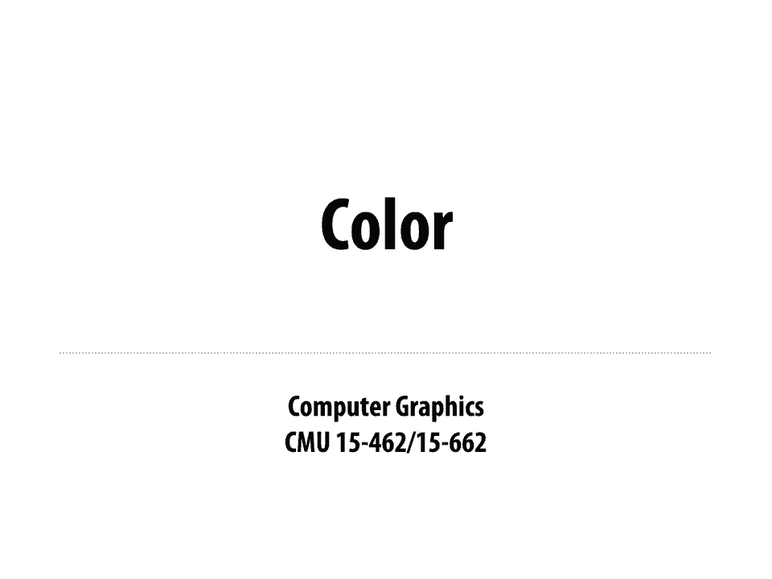
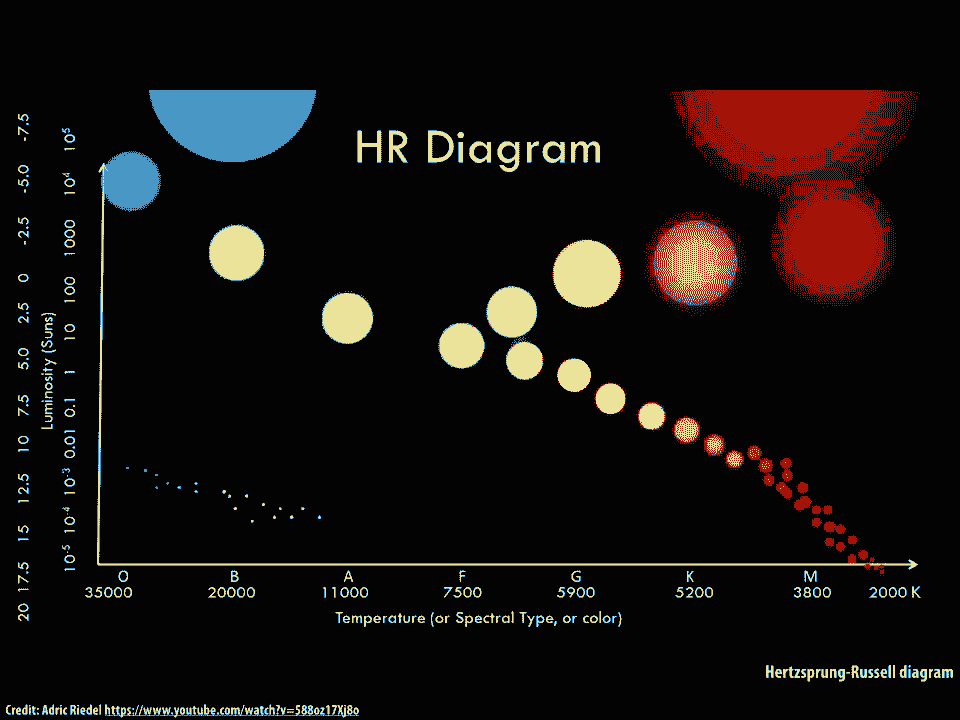
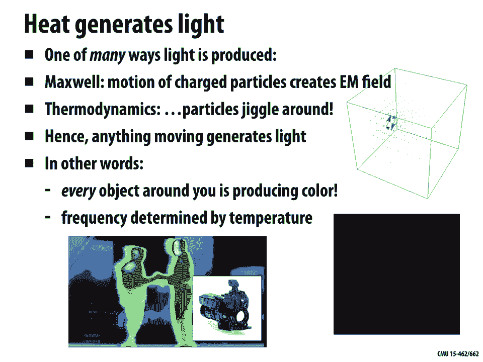
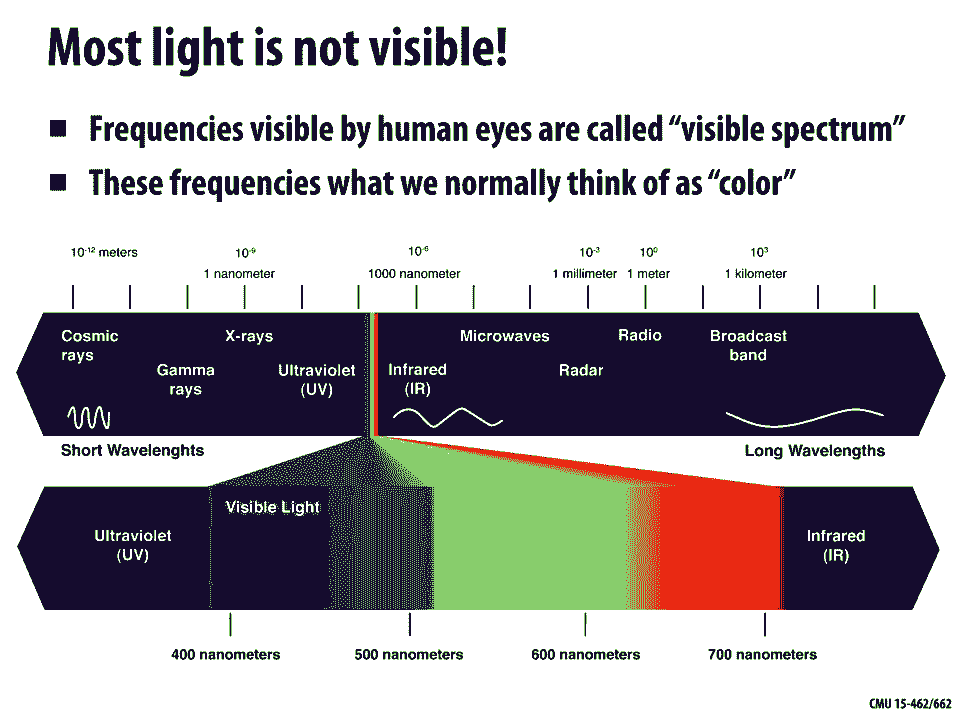
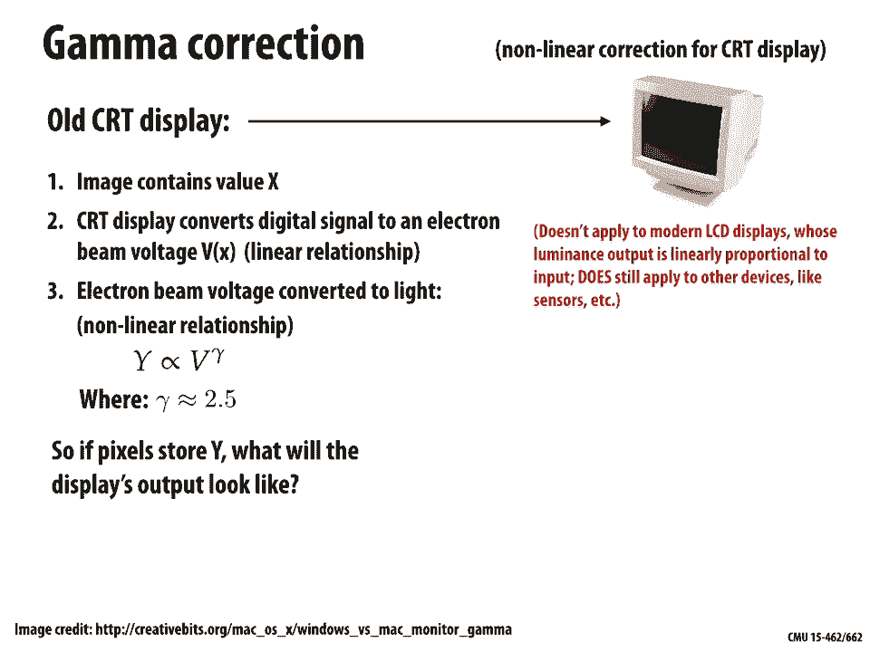
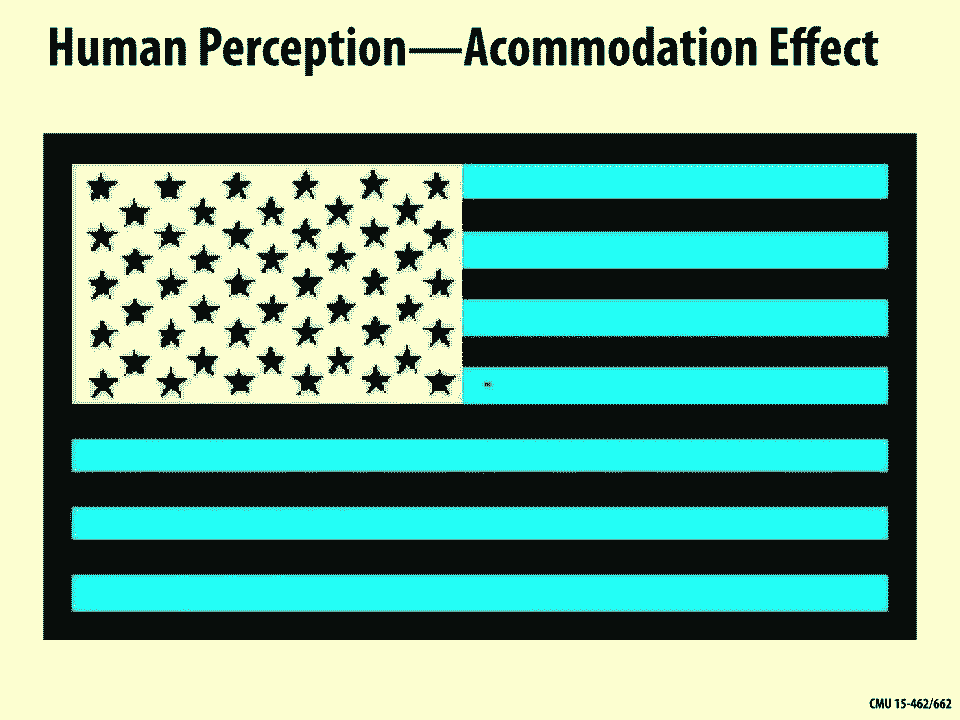
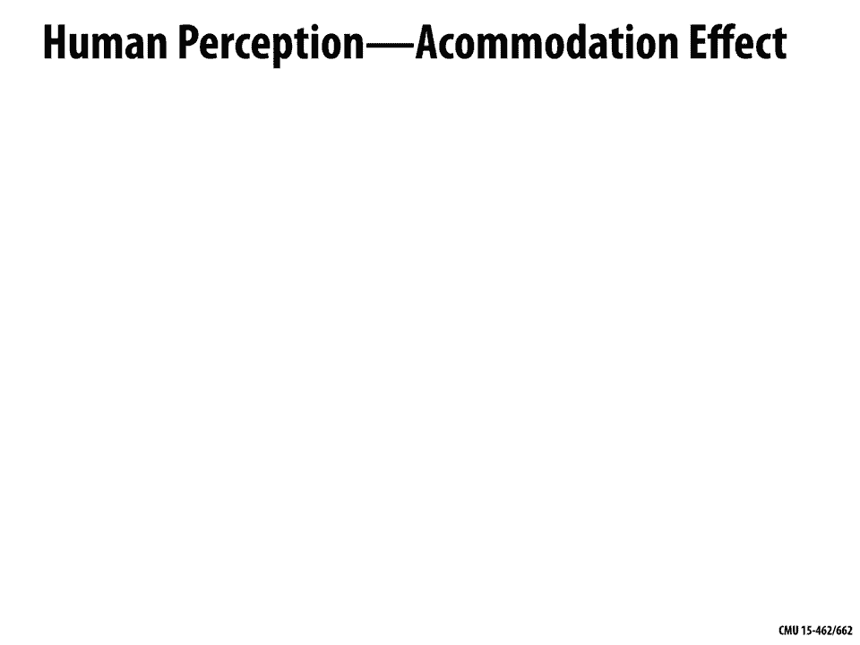
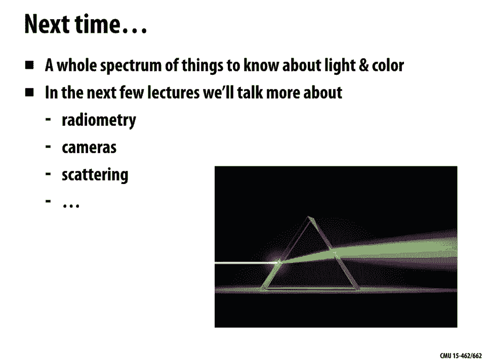

# 15：颜色 🎨

在本节课中，我们将要学习颜色的物理基础、人类视觉系统如何感知颜色，以及如何在计算机图形学中表示和处理颜色。理解颜色对于实现逼真的渲染、跨设备色彩管理以及处理各种视觉现象至关重要。

## 什么是颜色？🤔

上一节我们介绍了课程概述，本节中我们来看看颜色的本质。从物理角度来看，颜色是光波振荡频率的表现。光是一种振荡的电磁场，其振荡频率决定了光的颜色。频率（f）和波长（λ）是描述同一现象的两个相关量，它们的关系是：**f = c / λ**，其中 c 是光速。

一个常见的现象是，当炉子加热时会变红。这是因为热量会使物体内的带电粒子运动，从而产生电磁辐射，即光。物体的温度决定了粒子运动的频率，进而决定了发出光的颜色。

## 可见光谱与光谱 🌈

然而，并非所有频率的光人类都能看见。人类可见的光波长范围非常狭窄，这被称为**可见光谱**，大致从红色（长波）到紫色（短波）。超出此范围的光，如红外线和紫外线，人类无法直接感知。

描述光源颜色最根本的方式是使用**光谱**。光谱描述了光强度随波长（或频率）的分布。有两种主要的光谱：
*   **发射光谱**：描述光源本身在各个波长上发出的光强度。
*   **吸收/反射光谱**：描述物体材料对不同波长光的吸收或反射比例。

以下是不同类型光源的发射光谱示例：
*   **日光**：在可见光范围内分布相对均匀。
*   **白炽灯**：红光部分较多，蓝光较少，呈现“暖”色调。
*   **荧光灯**：光谱呈尖峰状，分布不均匀，可能让人感觉不自然。

## 颜色感知：人类视觉系统 👁️

上一节我们了解了颜色的物理描述，本节中我们来看看人类如何感知颜色。颜色感知是一个复杂的生理和心理过程，始于眼睛。

光线通过瞳孔进入眼睛，在视网膜上成像。视网膜上有两种感光细胞：
*   **视杆细胞**：对光强敏感，负责暗视觉，但不区分颜色。
*   **视锥细胞**：负责明视觉和色觉。人类通常有三种视锥细胞，分别对短（S）、中（M）、长（L）波长的光最敏感，大致对应蓝、绿、红光。

每种视锥细胞的敏感度由**光谱响应函数**描述。眼睛对入射光谱的测量结果，实际上是光谱强度与三种视锥细胞响应函数乘积的积分。最终，大脑接收到的是三个数值信号（S, M, L），而非完整的光谱。

这个机制引出了一个关键概念：**同色异谱**。即两种不同的光谱分布，可能在人类眼中产生完全相同的颜色感知。这是因为眼睛的积分测量是粗略的，丢失了光谱细节。同色异谱现象是颜色复制（如显示器和打印）能够实现的基础，但也可能导致在不同光源下颜色看起来不同。

## 颜色模型与颜色空间 🎯

由于人眼感知的局限性和工程实践的需要，我们使用各种**颜色模型**在特定的**颜色空间**中表示颜色。颜色空间定义了可用的颜色范围（调色板），而颜色模型则提供了在该空间中指定具体颜色的方法（如坐标或名称）。

以下是几种常见的颜色模型：

*   **RGB（加色模型）**：用于发光设备（如显示器）。通过混合**红（R）、绿（G）、蓝（B）** 三种色光来产生各种颜色。例如，`#FF6600` 这个十六进制编码表示一个橙色的RGB值。
*   **CMYK（减色模型）**：用于吸光材料（如印刷）。使用**青（C）、品红（M）、黄（Y）、黑（K）** 四种油墨，通过吸收白光中的某些颜色成分来呈现色彩。
*   **HSV/HSL**：更符合人类直觉的模型，用**色调（H）、饱和度（S）、明度（V）或亮度（L）** 来描述颜色，便于艺术家选择和调整颜色。
*   **CIE XYZ / Lab**：基于人类颜色感知实验建立的与设备无关的颜色空间。Lab 空间在设计上追求**感知均匀性**，即数值上的均匀变化对应感知上的均匀变化。

选择不同的颜色模型出于多种考虑：用户指定颜色的便利性、颜色处理的方便性（如混合、插值）、存储与编码效率等。

## 颜色管理中的挑战 ⚙️

在计算机图形学中处理颜色时，我们面临几个核心挑战：

1.  **色域**：指一个设备或颜色模型能够表示的颜色范围。不同设备（如高端显示器与普通打印机）的色域差异很大。将广色域图像转换到窄色域设备时，可能需要进行**色域映射**，处理无法显示的颜色。
2.  **伽马校正**：显示设备（尤其是传统的CRT显示器）的输入电压与输出亮度之间通常是非线性关系，近似为 **亮度 ∝ 电压^γ**。为了确保存储的像素值能线性地对应感知亮度，需要在图像处理管线中进行伽马编码和解码（校正）。
3.  **感知压缩**：人眼对亮度的变化比对颜色的变化更敏感。利用这一点，许多图像和视频压缩格式（如JPEG, MPEG）会使用类似 **Y‘CbCr** 的颜色模型，对亮度分量（Y’）保留高分辨率，而对色度分量（Cb, Cr）进行大幅降采样，从而高效压缩数据。

## 总结 📚

本节课中我们一起学习了颜色的核心知识。我们从颜色的物理定义（光的频率/波长）出发，探讨了光谱如何描述光。接着，我们深入了解了人类视觉系统如何通过三种视锥细胞将丰富的光谱信息压缩为三个信号，从而产生颜色感知，并解释了同色异谱现象。然后，我们介绍了多种实用的颜色模型和颜色空间（如RGB, CMYK, HSV, CIE XYZ），以及它们各自的用途。最后，我们探讨了在实际颜色管理和图像处理中遇到的挑战，包括色域限制、伽马校正和基于感知的压缩技术。理解这些原理对于在计算机图形学、视觉设计和跨媒体内容创作中准确、高效地处理颜色至关重要。