# 15：辐射测量学 🌟

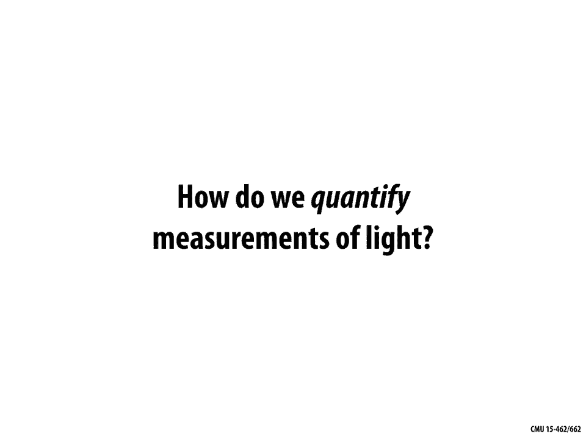

在本节课中，我们将学习辐射测量学。辐射测量学是计算机图形学中用于物理精确地量化和描述光与照明的核心知识。我们将从基本概念入手，逐步理解如何测量光能，并最终将这些概念应用于生成逼真的图像。

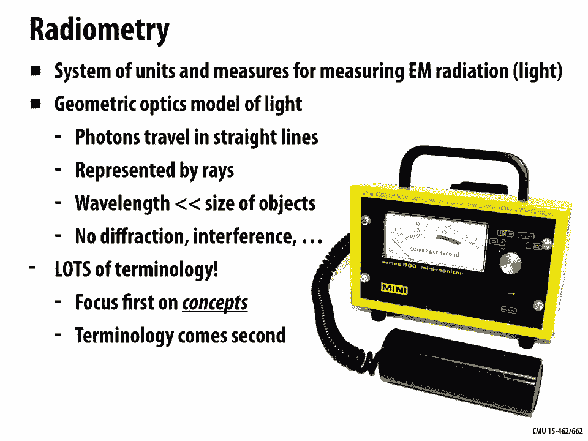

---

## 概述 📖

为了生成与照片难以区分的逼真图像，我们必须以物理上准确的方式量化光和照明。上一讲我们深入讨论了颜色，了解到光的颜色与其波长有关。然而，一幅完整的图像不仅需要颜色信息，还需要知道场景中每个点接收或反射了多少光。辐射测量学正是为此建立的一套测量电磁辐射的单位和体系。

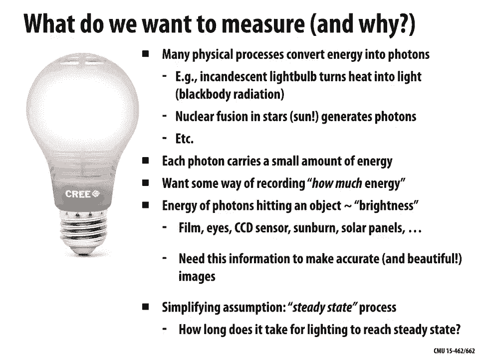

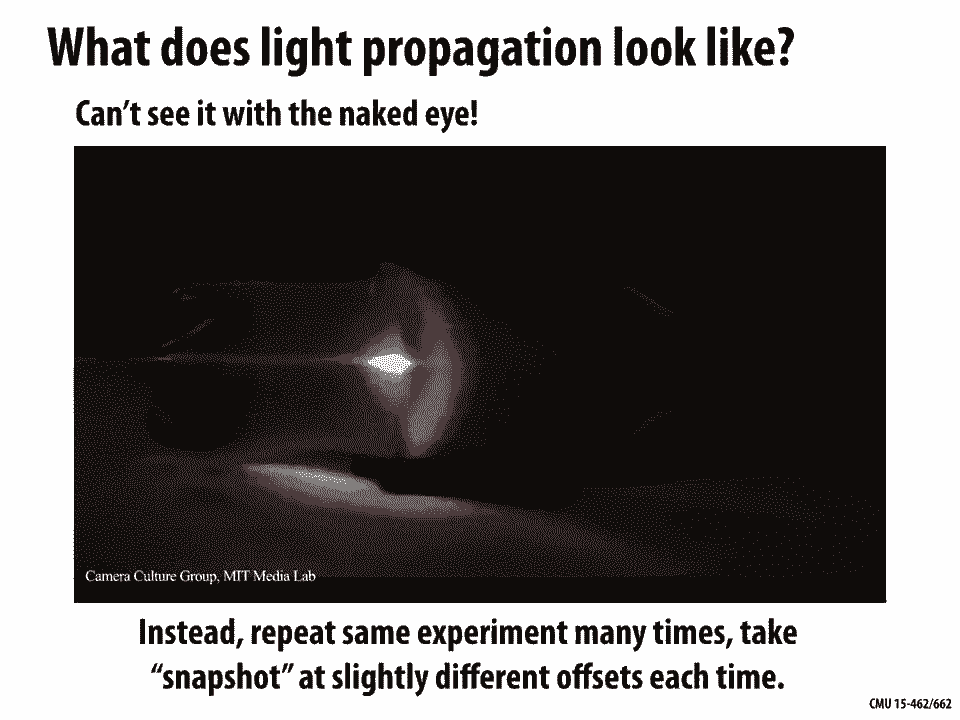

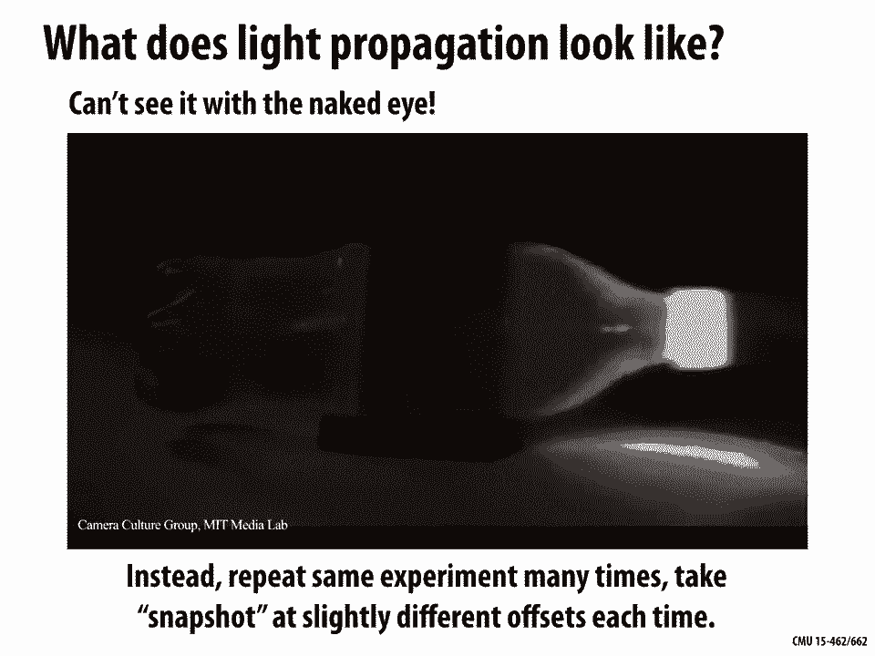

## 光的几何光学模型 🔦

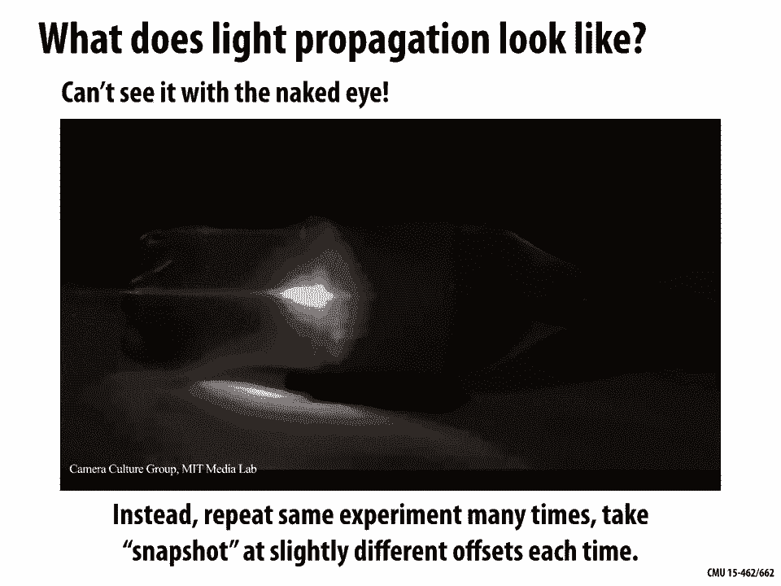

在宏观层面，为了人类视觉感知和图像生成，我们采用**几何光学模型**。该模型基于两个关键假设：
1.  **光子沿直线传播**：我们可以用几何上的“光线”来表示光子的路径。
2.  **光的波长远小于场景物体尺寸**：因此我们可以忽略衍射、干涉等小尺度效应。

这个模型简化了问题，使我们能够专注于光在场景中的宏观分布。

## 核心测量概念与术语 📐

理解概念比记住术语更重要。让我们从最直观的概念开始，逐步引入辐射测量学的标准术语和单位。

### 辐射能量 (Radiant Energy)

想象光子像小球一样击中场景中的表面。**辐射能量**就是所有光子击中表面的总次数。它代表了场景中所有光子的总能量。

*   **概念**：总击中次数。
*   **单位**：焦耳 (Joules)。
*   **公式**：`Q = Σ (每个光子的能量)`。单个光子的能量公式为 `Q_photon = (h * c) / λ`，其中 `h` 是普朗克常数，`c` 是光速，`λ` 是波长。

### 辐射通量 (Radiant Flux)

我们通常更关心单位时间内到达的能量，而不是总能量。**辐射通量**（或称辐射功率）就是单位时间内的辐射能量，即每秒的击中次数。

*   **概念**：每秒击中次数。
*   **单位**：瓦特 (Watts, W)，即焦耳/秒 (J/s)。
*   **公式**：`Φ = dQ / dt`。总辐射能量是辐射通量对时间的积分：`Q = ∫ Φ dt`。

### 辐照度 (Irradiance)

为了生成图像，我们需要知道能量在空间上的分布。**辐照度**是单位面积上接收到的辐射通量，即每秒每单位面积的击中次数。这类似于相机传感器上每个像素点接收到的光能。

*   **概念**：每秒每单位面积击中次数。
*   **单位**：瓦特/平方米 (W/m²)。
*   **公式**：`E = dΦ / dA`。对于面积为 `A` 的表面，平均辐照度为 `E = Φ / A`。

**重要现象：余弦定律**
辐照度与表面朝向有关。如果一束光垂直照射面积为 `A` 的表面，其辐照度为 `Φ/A`。如果表面倾斜角度 `θ`，相同的光束会散布在更大的面积 `A' = A / cosθ` 上，因此辐照度变为 `E = (Φ * cosθ) / A`。这就是**余弦定律**：`E ∝ cosθ`。
在计算机图形学中，这引出了最基本的着色模型：表面亮度与表面法向量 `n` 和光线方向 `l` 的点积成正比，即 `max(0, n·l)`。

### 辐射强度 (Radiant Intensity) 与立体角

为了更精细地描述光的方向性，我们引入**立体角**的概念。立体角是二维角度在三维球面上的推广，用于度量一个锥形方向区域的大小，单位是球面度 (steradian, sr)。整个球面的立体角是 `4π` sr。

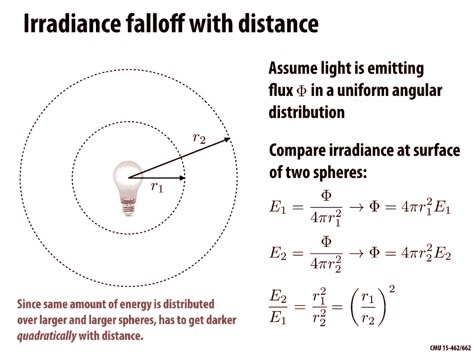

**辐射强度**描述点光源在特定方向上的发光能力，定义为**单位立体角内发出的辐射通量**。

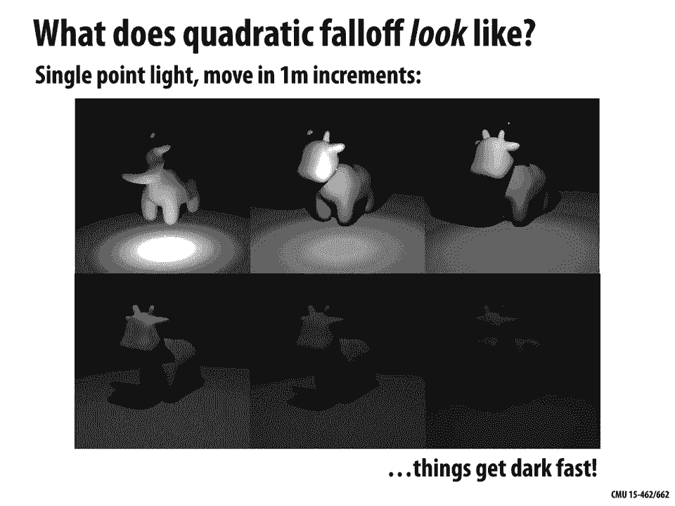

*   **概念**：每立体角方向的辐射通量。
*   **单位**：瓦特/球面度 (W/sr)。
*   **公式**：`I = dΦ / dω`。

对于一个向所有方向均匀发光的**各向同性点光源**，其总通量 `Φ = 4π * I`。

**距离衰减**
点光源的辐照度会随着距离增加而减弱。这是因为从光源发出的恒定通量 `Φ`，会散布在半径不断增大的球面上。球面面积为 `4πr²`，因此某点的辐照度 `E = Φ / (4πr²) = I / r²`。这意味着辐照度与距离的平方成反比，即**平方反比定律**。

### 辐射亮度 (Radiance)

**辐射亮度**是辐射测量学中最核心、信息最完整的量。它描述了在空间某一点、沿某一方向、通过单位投影面积和单位立体角的辐射通量。简单说，它衡量的是“沿着一根特定光线”的亮度。

*   **概念**：每秒、每单位投影面积、每单位立体角的能量。
*   **单位**：瓦特/(平方米·球面度) (W/(m²·sr))。
*   **公式**：`L(p, ω) = d²Φ / (dA * cosθ * dω)`，其中 `θ` 是表面法线与方向 `ω` 的夹角。

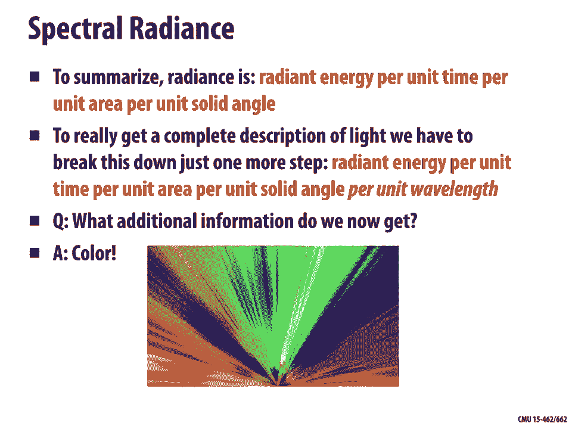

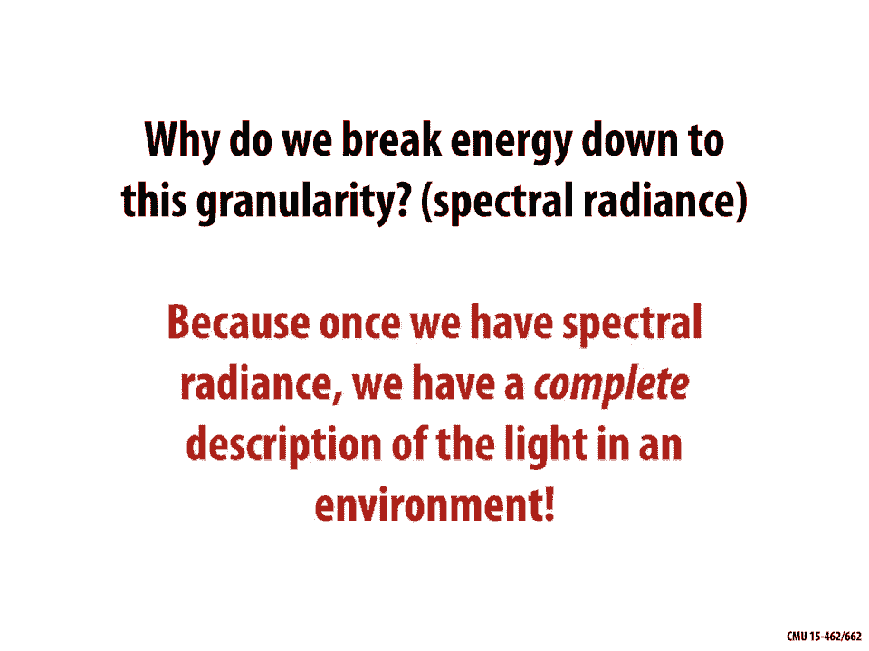

**辐射亮度的关键特性**
1.  **与光线关联**：辐射亮度是直接与一条几何光线相关联的物理量。
2.  **在真空中沿直线传播不变**：在无介质（如真空）中，沿一条光线传播时，辐射亮度保持不变。
3.  **相机直接测量**：一个理想的小孔相机模型，其传感器上每个点测量的正是来自对应方向光线的辐射亮度。

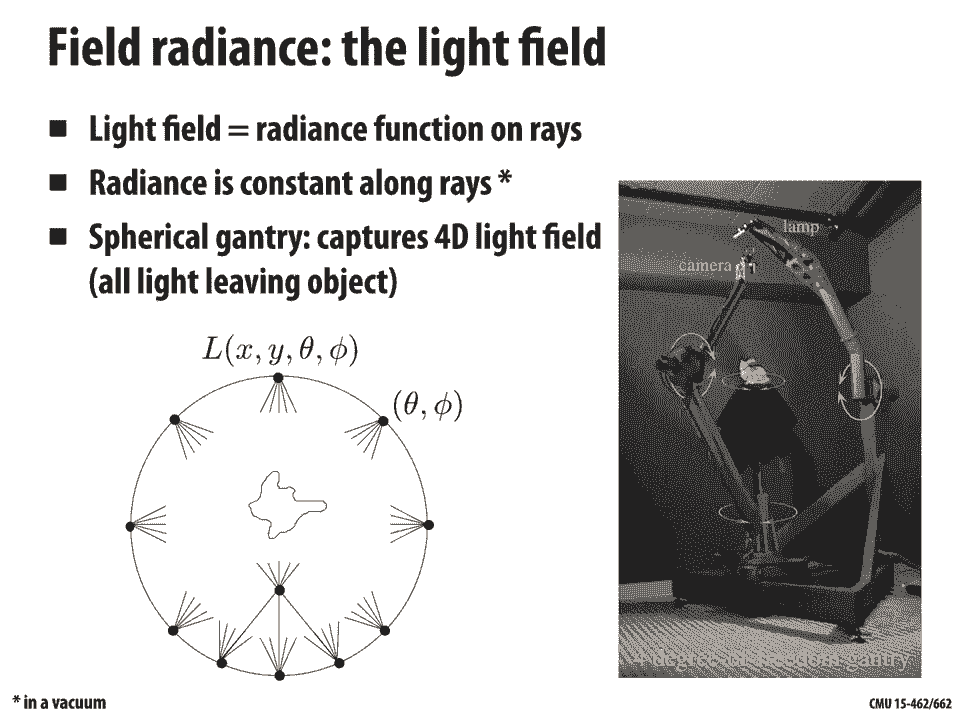

### 光谱辐射亮度 (Spectral Radiance)

为了包含颜色信息，我们将辐射亮度按波长进一步分解，得到**光谱辐射亮度**。它给出了每个波长上的辐射亮度，完整地描述了光在位置、方向、波长上的分布。

*   **概念**：每单位波长的辐射亮度。
*   **单位**：W/(m²·sr·m)。

拥有场景中所有点和所有方向的光谱辐射亮度信息，就等同于掌握了整个**光场**。光场摄影等技术正是基于捕获和操作这部分高维信息来实现重对焦、视角变换等效果。

---

## 入射与出射辐射亮度 ↔️

在讨论光与表面的交互时，区分**入射辐射亮度** `L_i` 和**出射辐射亮度** `L_o` 至关重要：
*   `L_i(p, ω)`：从方向 `ω` 到达点 `p` 的光线亮度。
*   `L_o(p, ω)`：从点 `p` 向方向 `ω` 发出的光线亮度。
对于大多数表面（除光源本身），这两者通常不相等，其关系由材料的**双向反射分布函数**决定（这将是下一讲的内容）。

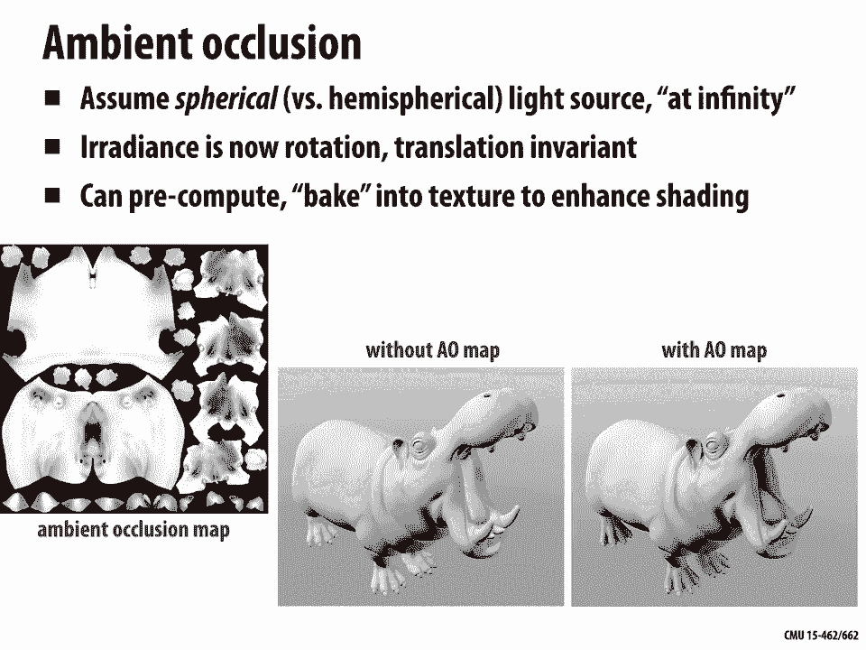

## 从辐射亮度计算辐照度 🔄

在渲染中，一个常见任务是计算表面上某点 `p` 接收到的总辐照度 `E(p)`。这需要**积分**来自半球所有可能入射方向 `ω` 的辐射亮度贡献，并考虑余弦定律：
`E(p) = ∫_H L_i(p, ω) cosθ dω`
其中 `H` 是以点 `p` 法线为中心的半球，`θ` 是入射方向与法线的夹角。

**实例：环境光遮蔽**
假设有一个均匀的**半球面光源**（如阴天天空），其入射辐射亮度 `L_i` 在所有方向上是常数 `L`。那么，点 `p` 的辐照度理论上为 `E = L * π`。然而，由于场景几何体的**遮挡**，某些方向的光线无法到达点 `p`。计算被遮挡后的辐照度，就得到了**环境光遮蔽**值。这个值可以预计算并存储为纹理（环境光遮蔽贴图），用于实时渲染中以近似全局光照的阴影效果，增加场景的真实感。

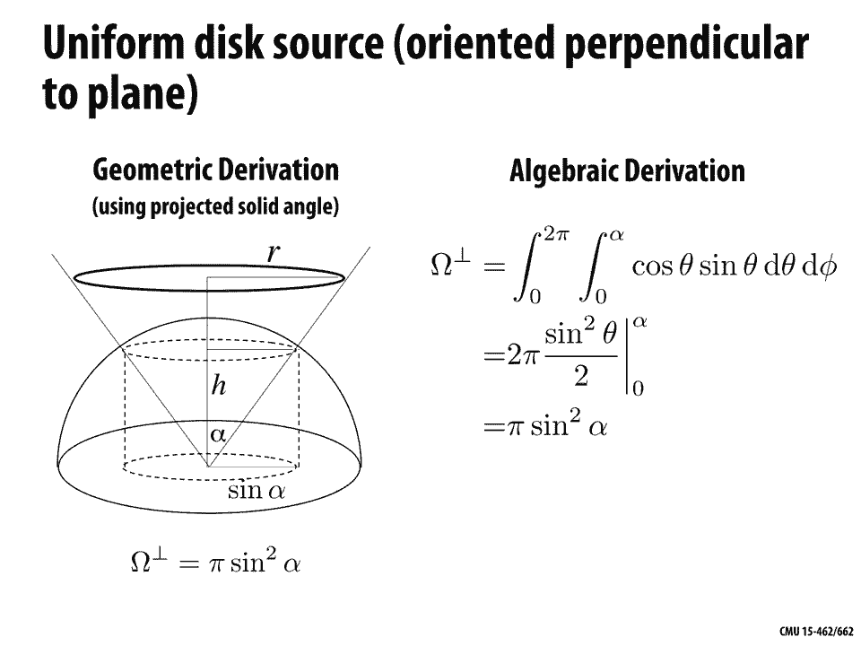

## 光度学：与人眼感知关联 👁️

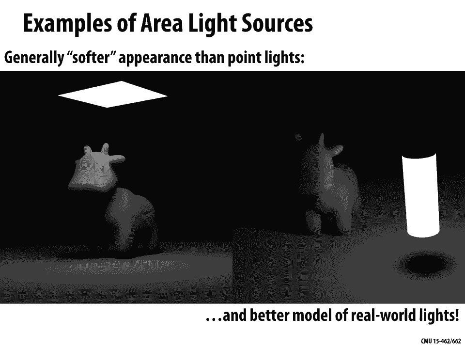

以上所有量都属于**辐射度量学**，基于物理能量。**光度学**则将其与人眼视觉响应相结合。例如，与辐射亮度 `L` 对应的是**光亮度** `Y`：
`Y(p, ω) = ∫ L(p, ω, λ) * V(λ) dλ`
其中 `V(λ)` 是人眼的视见函数（光度效率曲线）。光度学单位包括流明、勒克斯、尼特等。对于追求视觉真实感而非物理绝对精确的应用，光度学量更为直接相关。

---

## 总结 🎯

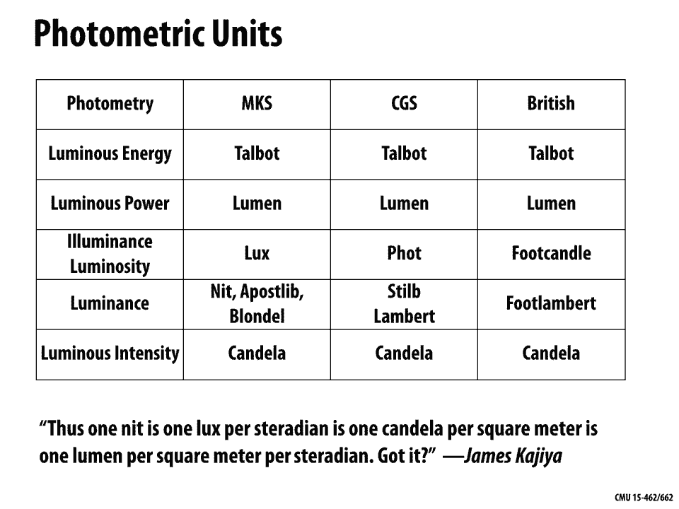

本节课我们一起学习了辐射测量学的基础知识：
1.  我们首先明确了使用**几何光学模型**来简化光的行为描述。
2.  从最基本的**辐射能量**概念出发，逐步引入了**辐射通量**、**辐照度**、**辐射强度**和**辐射亮度**等核心概念，理解了它们如何从时间、空间、方向维度分解和量化光能。
3.  我们学习了**余弦定律**和**平方反比定律**这两个影响表面亮度的基本规律。
4.  我们认识到**辐射亮度**是描述光场信息的最基本单位，它在真空中沿光线传播保持不变。
5.  我们了解了如何通过积分入射辐射亮度来计算表面的辐照度，并以**环境光遮蔽**为例说明了其应用。
6.  最后，我们简要对比了物理基础的**辐射度量学**和与人眼感知相关的**光度学**。

掌握这些概念是理解光与材质交互、实现全局光照等高级渲染技术的基础。下一讲，我们将探讨光如何与不同材质表面发生作用，即**反射模型**。