# 计算机图形学：P17：L16- 渲染方程 🎨

在本节课中，我们将把之前几讲中讨论的关于颜色、光的测量等概念整合起来，形成一个核心方程——**渲染方程**。这个方程是生成照片级真实感图像的基础。我们将从辐射度量学的基本概念出发，逐步推导出渲染方程，并解释其核心组成部分，特别是光与表面交互的散射函数。最后，我们将概述如何通过**路径追踪**等算法来求解这个复杂的方程。

---

## 辐射度量学回顾 📐

上一节我们介绍了辐射度量学中的关键术语。其中最重要的概念是**辐射亮度**。它完整地描述了场景中光的信息（至少是光谱辐射亮度）。如果我们知道空间中每个点、每个方向上的光的颜色，那么我们就掌握了场景中光传输的全部信息，并可以用它来生成图像。

一个重要的区分是**入射辐射亮度**和**出射辐射亮度**。它们并非不同的物理量，而是描述场景中辐射亮度的不同约定。

*   **入射辐射亮度**：指从环境中到达某一点的光。例如，你站在街角仰望天空和建筑物，每个方向都有不同颜色的光入射。
*   **出射辐射亮度**：指从某一点（如光源）发射出去的光。从光源的不同方向看出去，它会向不同方向发射不同强度和颜色的光。

两者的核心思想是：光照强度不仅取决于空间位置或时间，还**高度依赖于方向**。这意味着，在图像生成中，要确定一个点的总照度，我们必须考虑来自（或去往）所有方向的光照。

我们还区分了**辐射亮度**和**辐照度**。它们的区别在于是否考虑了方向积分。具体来说，辐照度 **E** 是辐射亮度在半球上的积分。例如，要计算从天空半球入射的总光量，需要对入射辐射亮度 **L_i(ω)** 在半球 **H** 上进行积分：

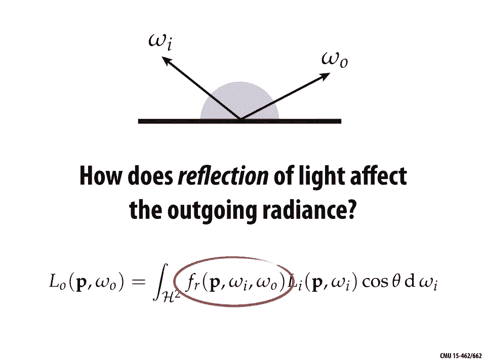

**E = ∫_H L_i(ω) cosθ dω**

其中 **ω** 是入射方向，**θ** 是入射方向与表面法线的夹角，**cosθ dω** 是积分所需的投影立体角微元。

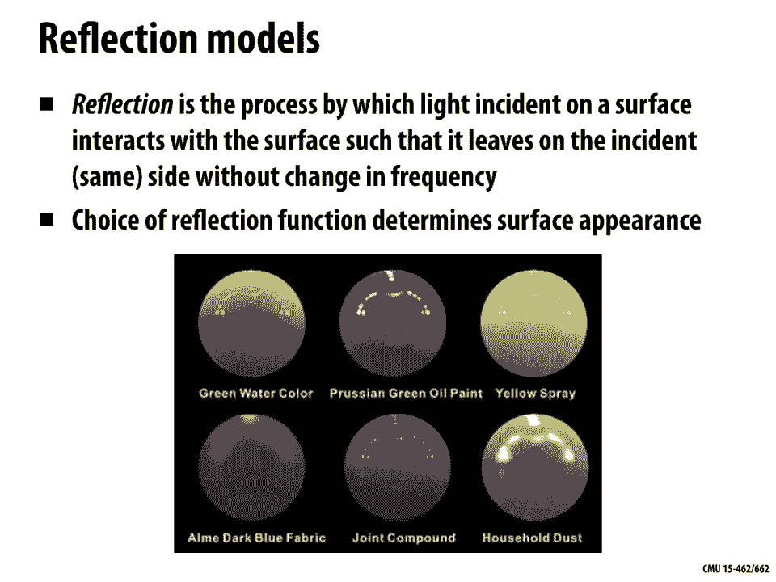

更精确地说，在法线为 **n** 的表面点 **p** 处、方向 **ω** 上的辐射亮度 **L**，定义为：单位时间内、单位立体角内、垂直于 **n** 的单位面积上通过的辐射能量。其公式为：

**L = dΦ / (dω * dA * cosθ)**

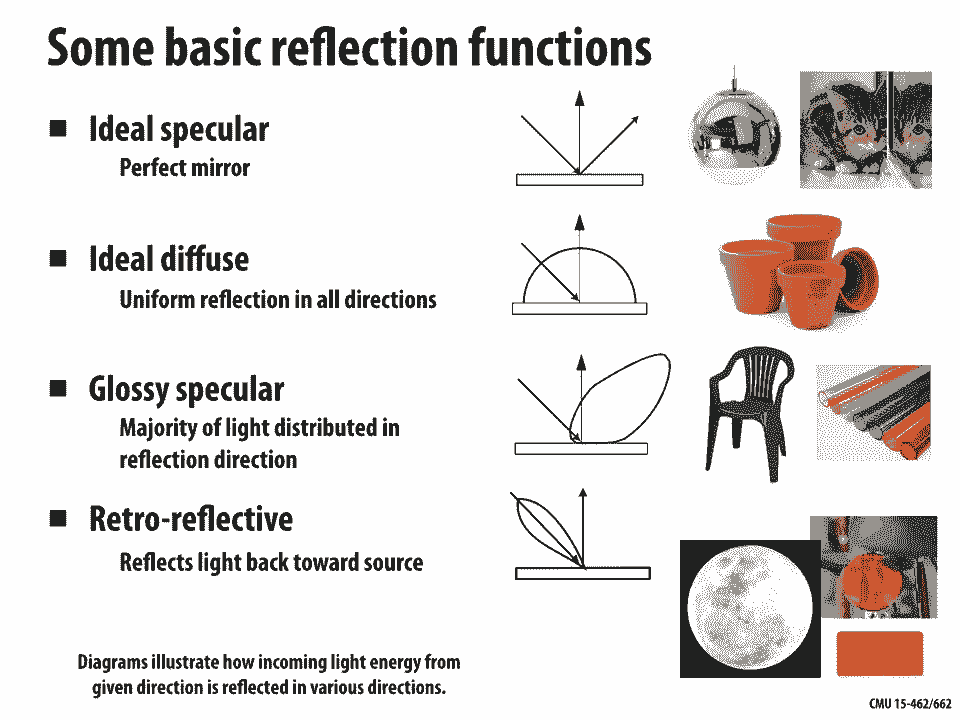

这里需要澄清一个容易混淆的点：公式中的 **cosθ** 可能因两种完全不同的原因出现。
1.  **物理原因（朗伯余弦定律）**：当一束相同总能量的光斜射到表面时，覆盖的面积会变大，导致单位面积接收的能量变少，表面显得更暗。
2.  **数学原因（球面积分参数化）**：当我们对球面上的函数 **f** 进行积分时，如果用经纬度 **(θ, φ)** 参数化，积分微元会包含 **cosθ dθ dφ**。这里的 **cosθ** 项纯粹是由于参数化方式导致的，与物理定律无关。

---

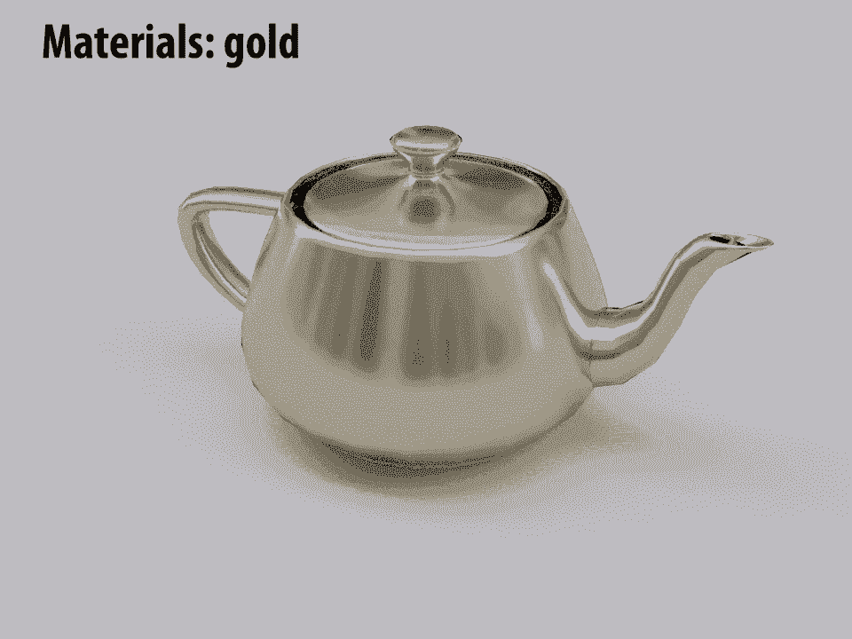

## 渲染方程：核心框架 ⚙️

回到今天的主要问题：如何利用这些知识生成照片级真实感的图像？答案由所谓的**渲染方程**给出。

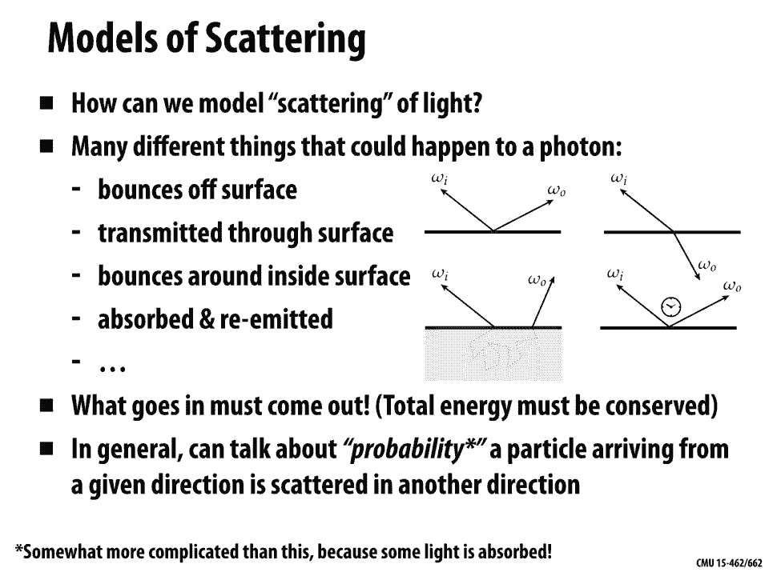

一个照片级真实感渲染器的核心功能，是估计给定点 **p** 在给定方向 **ω_o** 上的（入射或出射）辐射亮度 **L_o(p, ω_o)**。渲染方程总结了这一计算：

**L_o(p, ω_o) = L_e(p, ω_o) + ∫_H f_r(p, ω_i → ω_o) L_i(p, ω_i) cosθ_i dω_i**

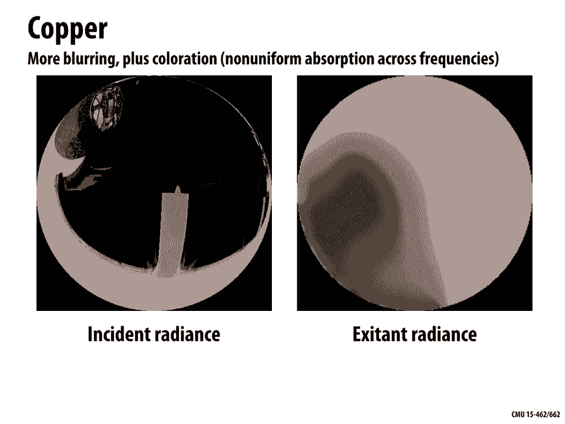

让我们分解这个方程：
*   **L_o(p, ω_o)**：在点 **p**、沿方向 **ω_o** 出射的辐射亮度（即我们最终想要求得的值）。
*   **L_e(p, ω_o)**：点 **p** 自身在方向 **ω_o** 上**发射**的辐射亮度（例如，光源）。
*   **∫_H ... dω_i**：对点 **p** 上方的整个半球 **H** 所有入射方向 **ω_i** 进行积分。
*   **f_r(p, ω_i → ω_o)**：**双向反射分布函数**。它描述了从入射方向 **ω_i** 来的光，有多少被散射到出射方向 **ω_o**。这是决定表面外观的关键。
*   **L_i(p, ω_i)**：从方向 **ω_i** 入射到点 **p** 的辐射亮度。
*   **cosθ_i**：入射方向 **ω_i** 与表面法线 **n** 夹角的余弦值。

这个方程求解困难的关键在于它的**递归性**。方程左侧要求解 **L_o**，而右侧需要知道 **L_i**。那么 **L_i** 又由什么决定呢？它由另一个点的渲染方程决定！具体来说，**L_i(p, ω_i)** 等于从点 **p** 沿 **-ω_i** 方向反向追踪光线，所到达的下一个表面点 **q** 在方向 **ω_i**（相对于 **q** 的出射方向）上的出射辐射亮度 **L_o(q, ω_i)**。

因此，计算辐射亮度就归结为递归地求解这个渲染方程。这个过程最终会在遇到发射体（如灯泡）时终止，因为发射项 **L_e** 提供了递归的基准情况。

这种递归求值的复杂性，正是我们需要**光线追踪**而非光栅化的原因。光栅化难以灵活控制需要评估哪些光线路径。

---

## 光的散射与BRDF 🌈

上一节我们介绍了渲染方程的整体框架，本节中我们来看看其中最关键也最复杂的部分：**散射函数 f_r**，即**双向反射分布函数**。

在几何光学模型中，**散射**是光入射到表面后，在不改变频率的情况下从同一侧离开表面的过程，也就是我们常说的“反射”。**BRDF** 描述了这一过程：给定入射方向 **ω_i**，有多少光被散射到出射方向 **ω_o**。它决定了表面的外观，例如吸收哪些颜色的光、在哪些方向上反射强烈。

以下是几种基本的反射类型：
*   **镜面反射**：光在特定方向反射，如完美镜子。反射方向由法线决定：**ω_o = -ω_i + 2(ω_i·n)n**。其BRDF可用狄拉克δ函数描述，表示光只沿精确的反射方向出射。
*   **漫反射**：光被均匀地散射到所有方向，如粗糙的墙面。理想的漫反射（朗伯反射）的BRDF是一个常数：**f_r = ρ/π**，其中 **ρ** 是**反照率**（介于0和1之间），表示表面的整体亮度。
*   **光泽反射**：介于镜面和漫反射之间，光在镜面反射方向周围的一个锥形区域内散射，如塑料材质。
*   **逆向反射**：光被反射回入射方向，如自行车尾部的反光片。月亮的视觉特性也近似于此。

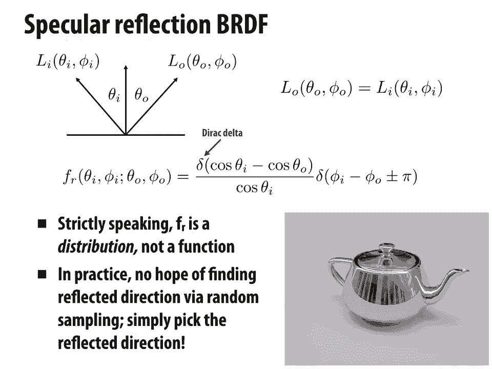

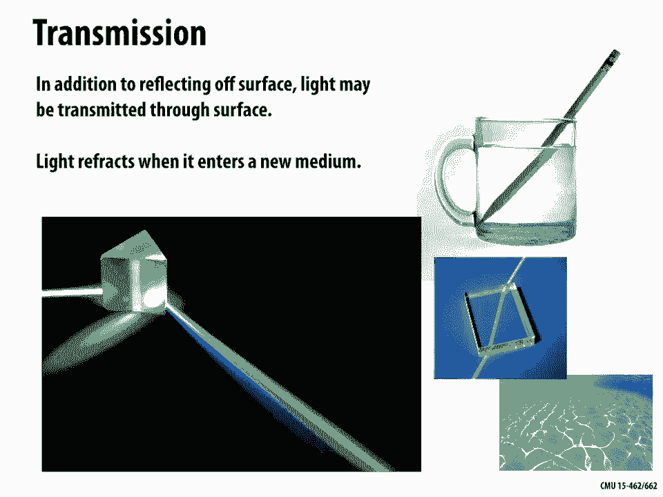

BRDF 具有两个重要性质：
1.  **能量守恒**：对于所有方向，BRDF的积分应 ≤ 1。小于1的部分代表光被吸收并转化为热能。
2.  **亥姆霍兹互易性**：**f_r(ω_i → ω_o) = f_r(ω_o → ω_i)**。这意味着光路是可逆的。

除了反射，光还可能**透射**（如穿过玻璃），此时方向由**斯涅尔定律**决定：**η_i sinθ_i = η_t sinθ_t**，其中 **η** 是折射率。当光从光密介质射向光疏介质且入射角大于临界角时，会发生**全内反射**。

更复杂的现象还包括：
*   **菲涅尔效应**：反射率随观察角（入射角）变化，在掠射角时接近100%。
*   **各向异性反射**：反射特性随方位角变化，如拉丝金属。
*   **次表面散射**：光进入材质内部，经过多次散射后从另一点射出，如皮肤、玉石、树叶。这需要用更复杂的**双向表面散射反射分布函数**（BSSRDF）来建模，它考虑了入射点和出射点不同的情况。

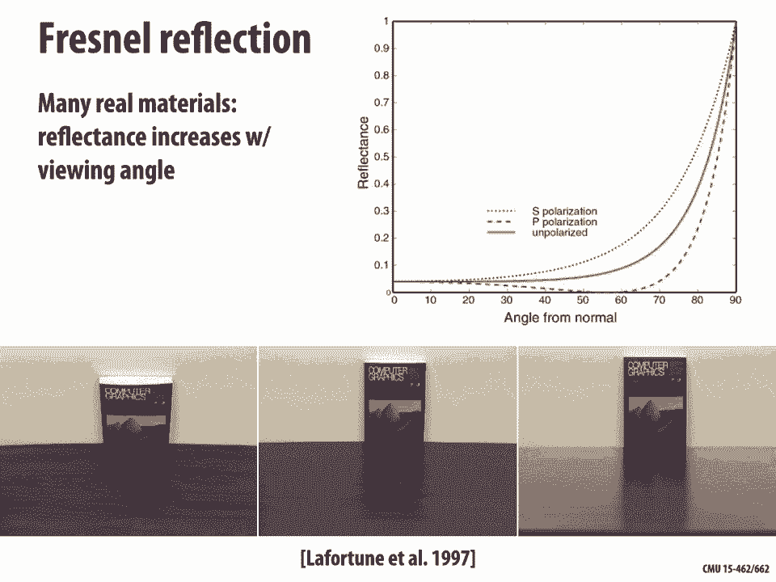

---

## 求解渲染方程：蒙特卡洛积分与路径追踪 🚀

前面我们了解了渲染方程的构成和散射的复杂性，现在来看看如何实际计算它。渲染方程中的反射项是一个复杂的积分，我们通常使用**蒙特卡洛积分**方法来近似求解。

蒙特卡洛积分的基本思想是：通过随机采样来估计积分值。对于反射方程：

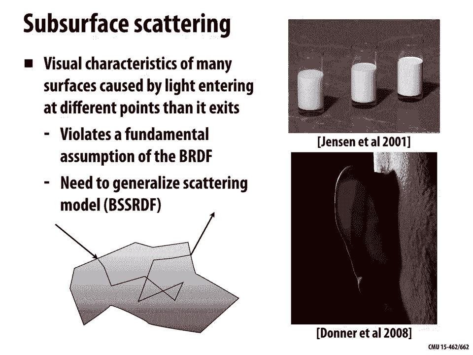

**L_o = ∫_H f_r L_i cosθ dω**

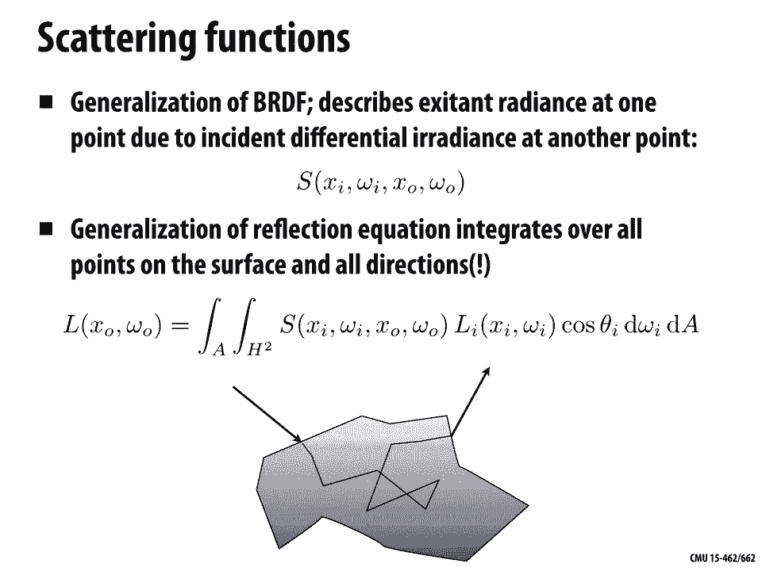

我们可以通过以下步骤进行估计：
1.  随机选择 **N** 个入射方向 **ω_j**，采样概率为 **p(ω_j)**。
2.  对每个样本，计算被积函数值 **f_r(ω_j) * L_i(ω_j) * cosθ_j**。
3.  将所有样本的函数值除以对应的概率 **p(ω_j)**，然后取平均。

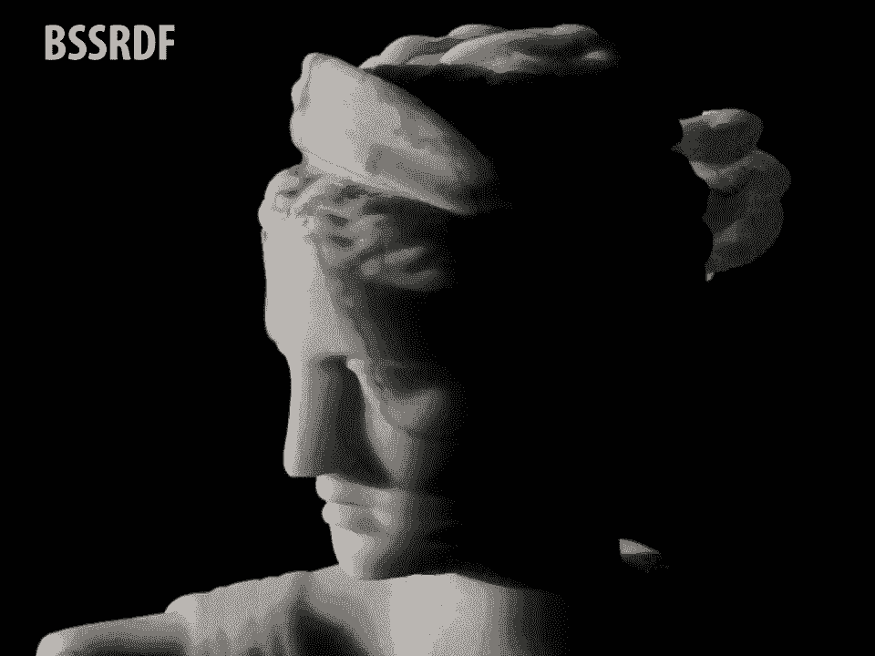

估计公式为：

**L_o ≈ (1/N) * Σ_{j=1}^{N} [ f_r(ω_j) L_i(ω_j) cosθ_j / p(ω_j) ]**

其中，递归地获取 **L_i(ω_j)** 是核心挑战，这需要沿着 **ω_j** 方向发射新的光线并递归调用相同的着色程序。采样概率 **p(ω)** 的选择会影响效率，理想情况下应使其形状接近被积函数（重要性采样）。

基于这种蒙特卡洛积分思想，**路径追踪**算法被提出以求解完整的渲染方程。其关键策略是将光照分为两部分：
*   **直接光照**：光从光源直接照射到表面点，然后进入相机。
*   **间接光照**：光在场景中经过多次反射/散射后到达表面点，再进入相机。

路径追踪算法递归地追踪从相机出发的光线，在每次与表面相交时，同时采样直接光照（连接光源）和间接光照（随机采样新的反射方向），并将结果累加。为了避免无限递归，会使用**俄罗斯轮盘赌**等技术来以概率方式终止路径。

直接光照与间接光照的结合对于真实感至关重要。仅包含直接光照的图像看起来生硬、不自然；而加入间接光照（如颜色渗透、柔和阴影）后，图像会立刻呈现出照片级的真实感与丰富的细节。

---

## 总结 📝

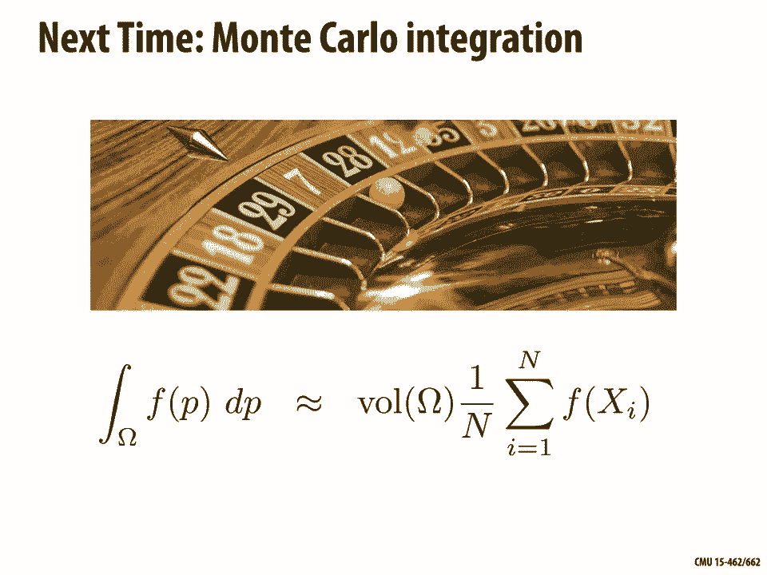

本节课中我们一起学习了计算机图形学中最为核心的**渲染方程**。我们从辐射度量学的基础概念（辐射亮度、辐照度）出发，推导出了描述光能传输的渲染方程，并深入分析了其递归本质。我们重点探讨了决定材质外观的**双向反射分布函数**，涵盖了从理想的镜面反射、漫反射到复杂的次表面散射等多种现象。最后，我们介绍了通过**蒙特卡洛积分**和**路径追踪**算法来求解这一复杂方程的基本思路，理解了直接光照与间接光照在合成真实感图像中的关键作用。渲染方程及其求解方法构成了现代照片级真实感渲染的基石。