# 计算机图形学：18：数值积分 📊

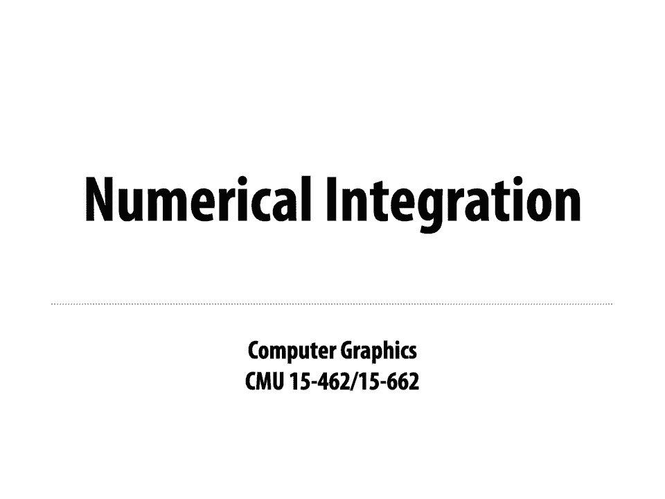

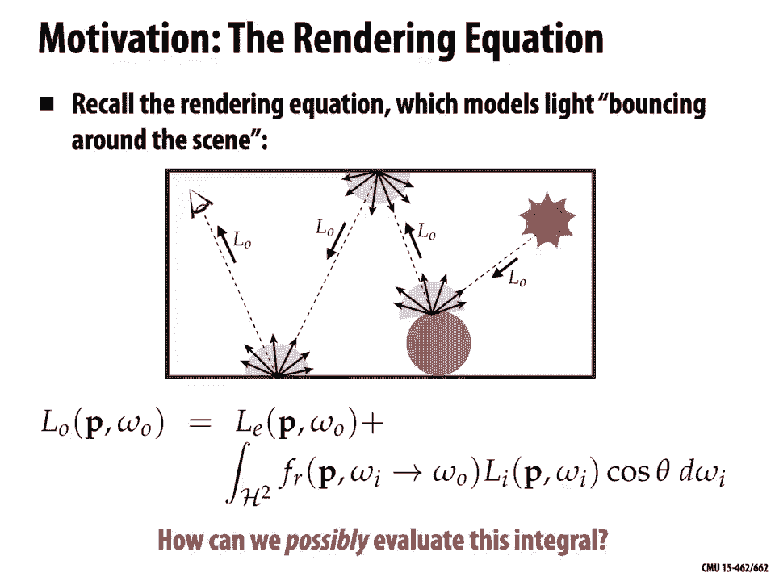

在本节课中，我们将学习数值积分。这是一个在计算机图形学乃至整个计算机科学和科学计算领域都极其重要的主题。我们的学习动机源于计算机图形学中的一个核心问题——照片级真实感渲染。

上一节我们讨论了渲染方程，它是我们模拟光线在场景中反弹以生成图像的基本工具。我们看到，渲染方程是一个递归的积分方程。为了确定从一个点P沿方向ω₀出射的辐亮度，我们需要对所有可能的入射方向ωᵢ进行积分。

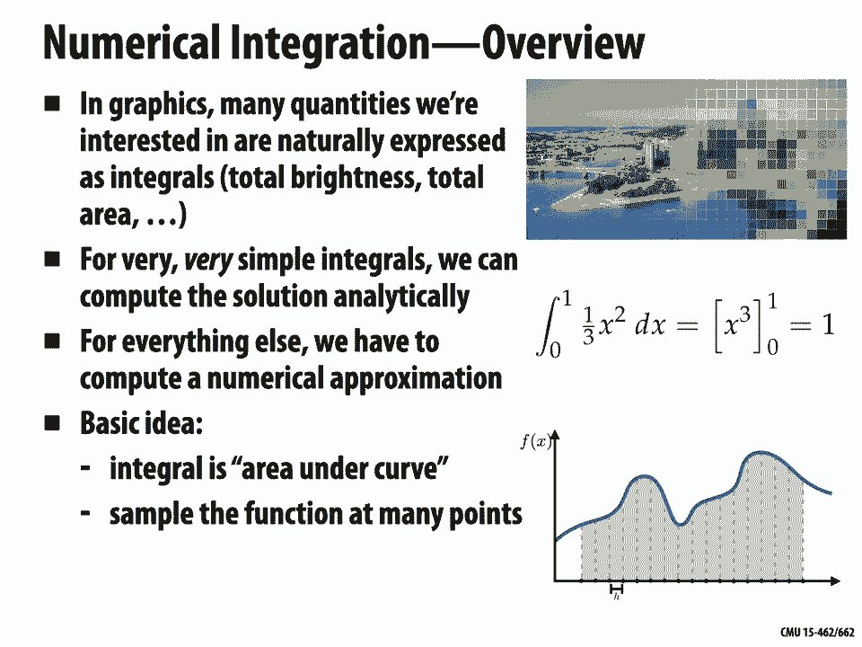

在图形学中，我们关心的许多量（如总亮度、像素接收的光量、总面积、总曲率等）都自然地表达为积分。对于像微积分课上学到的简单多项式，我们可以解析地求解积分。然而，在实际的图形学、计算机视觉、科学计算和模拟问题中，大多数积分无法以这种方式求解。它们要么没有闭式解，要么求解过程过于复杂，要么积分项来自数据本身。因此，我们需要计算某种数值近似。

## 如何数值近似积分？ 🔍

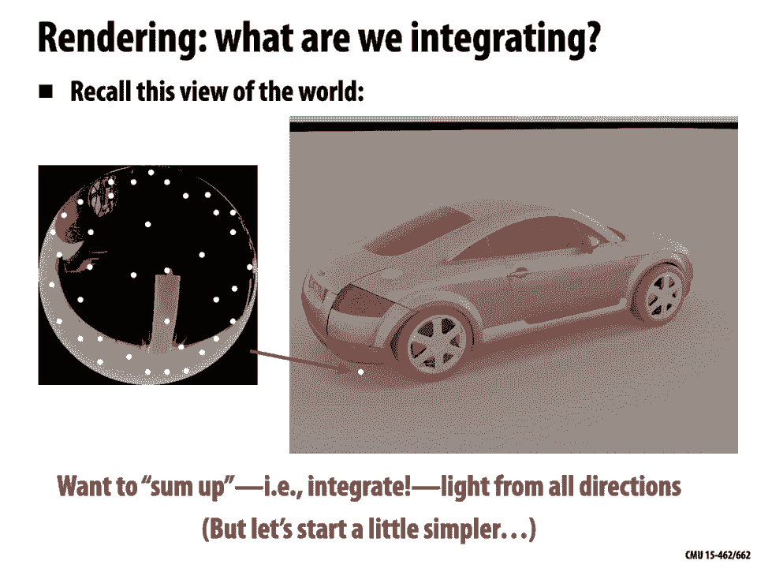

要理解数值积分，我们可以回到积分的定义。从概念上讲，积分是函数曲线下的面积。在微积分中，我们通过将区间分割成小柱体，然后随着柱体越来越细，将这些小柱体的面积相加来逼近积分。这正是我们数值计算要做的事情。

我们将对要积分的函数在一系列点上进行采样，然后将积分近似为这些点上函数值的加权和。公式如下：

```
I ≈ Σ w_i * f(x_i)
```

其中，`w_i` 是权重，`f(x_i)` 是在采样点 `x_i` 处的函数值。

在渲染中，我们积分的“面积”概念可能不太直观。例如，在场景中的一个点，我们需要累加来自所有方向的入射光。这就是为什么我们需要进行积分。

## 从简单情况开始：一维积分 📈

让我们从实轴上的函数开始。积分 `∫_a^b f(x) dx` 表示从 `a` 到 `b` 的曲线下面积（蓝色区域）。另一种有用的思考方式是：积分等于函数在区间 `[a, b]` 上的平均值乘以区间长度 `(b - a)`。

一个重要的基础是微积分基本定理。它指出，一个函数导数的积分等于该函数在区间端点处的值之差：`∫_a^b f'(x) dx = f(b) - f(a)`。这表示从 `a` 到 `b` 的总变化量。

### 简单函数的积分

*   **常数函数**：积分 `∫_a^b C dx = C * (b - a)`。这只是一个矩形的面积。
*   **仿射函数**：函数形式为 `f(x) = Cx + D`。对于仿射函数，积分可以通过在区间中点采样精确求得：`∫_a^b f(x) dx = (b - a) * f((a+b)/2)`。这是因为仿射函数在区间上的平均值恰好等于其中点的函数值。

### 高斯求积法

对于更一般的多项式，是否存在一种通用的精确积分方法？答案是肯定的，即**高斯求积法**。它指出，对于任何 `n` 次多项式，总可以通过在一组特殊的点（高斯点）上采样函数值，并进行加权求和，来得到积分的精确值。

*   对于一次多项式（仿射函数），这个特殊点就是中点。
*   对于更高次的多项式，这些点的位置和权重计算更复杂，但原理相同。

高斯求积法是我们遇到的第一个**求积法则**的例子：通过在一组有限点采样，取这些样本值的加权组合来近似积分。对于多项式，高斯求积是精确的。

## 处理更复杂的函数：分段仿射函数 🔧

分段仿射函数在小子区间上是仿射函数。对于这样的函数，只在中点采样一个点会导致欠采样（或混叠），从而产生误差。

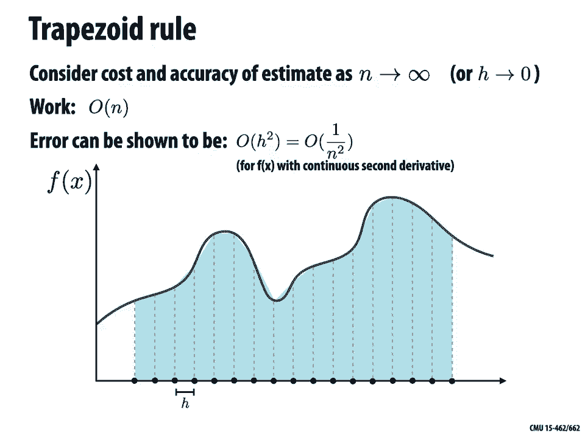

更明智的做法是：对分段定义的函数，我们可以将每个子区间的积分相加。对于每个仿射区间，我们已经知道精确的积分法则（梯形法则的雏形）。将每个子区间的积分结果 `(f(x_i) + f(x_{i+1}))/2 * (x_{i+1} - x_i)` 相加，就得到了整个函数的积分近似。

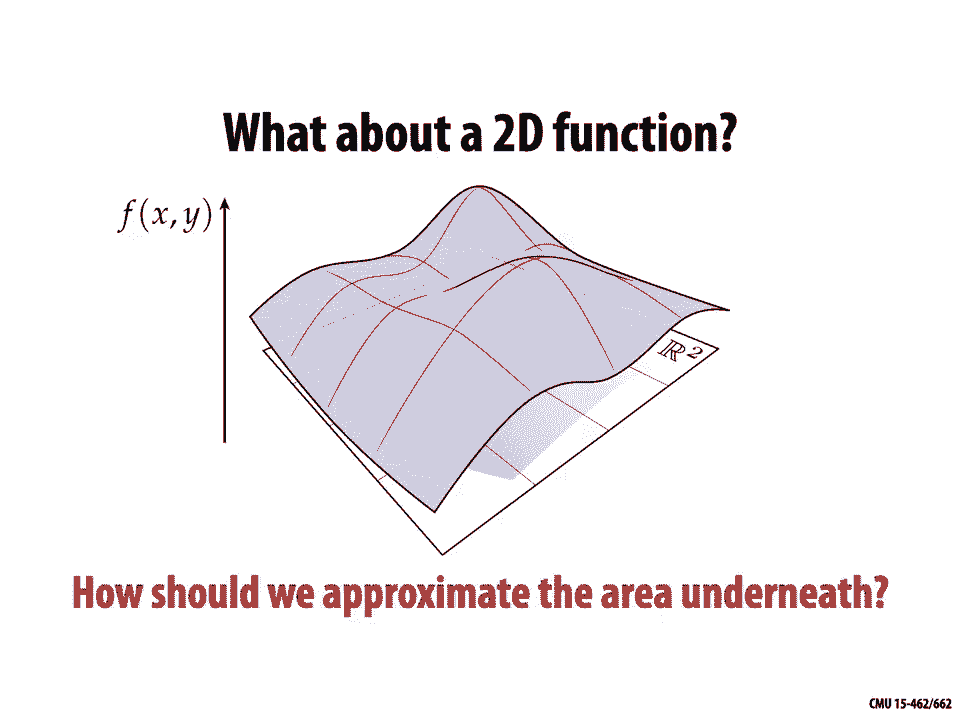

这个求和式可以展开并重新整理，最终表示为一组采样点 `f(x_i)` 乘上特定权重 `w_i` 的和。这再次印证了求积法则的核心思想：**我们需要两组信息：求积点（在哪里采样）和权重（每个样本对最终积分的贡献）**。

## 积分任意函数：梯形法则 📐

对于任意函数 `f(x)`（我们可能不知道其具体形式，只能将其视为黑盒），我们如何积分？一个策略是：用分段仿射函数来近似它。

具体方法是：选择一些区间，在区间端点采样，用直线连接相邻样本点，从而构造一个分段仿射近似函数。然后，应用分段仿射函数的积分法则。这种方法称为**梯形法则**。

如果区间是等宽的（宽度 `h = (b-a)/(n-1)`），梯形法则的公式为：
```
I ≈ (h/2) * [f(x_0) + 2f(x_1) + 2f(x_2) + ... + 2f(x_{n-1}) + f(x_n)]
```

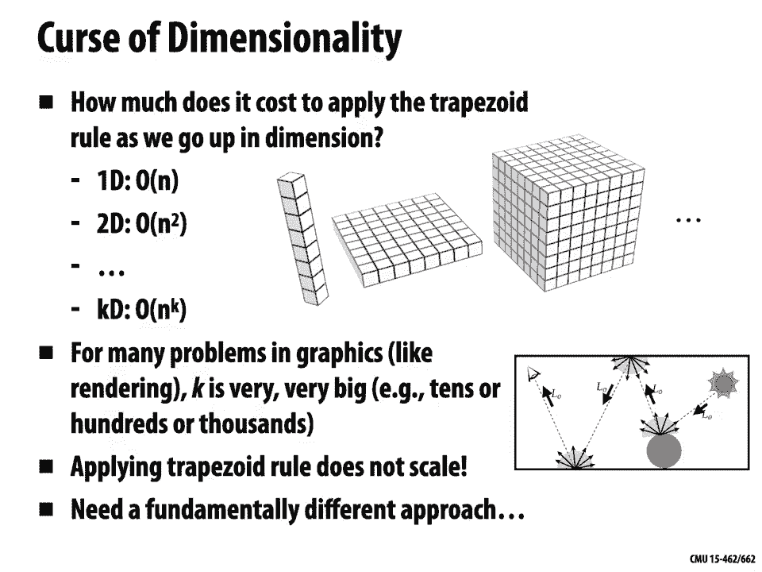


### 计算成本与误差

我们关心计算成本如何随着精度（区间数 `n`）增加而增长。假设每次函数求值 `f(x)` 是固定成本 `O(1)`。

*   **工作量**：`O(n)`。我们需要对 `n+1` 个点进行求值，并进行线性量级的算术运算。
*   **误差**：如果函数 `f` 足够光滑，梯形法则的误差为 `O(h²)` 或 `O(1/n²)`。这意味着我们以线性增长的工作量，换来了误差的平方级减少。

## 高维积分与维度灾难 🚨

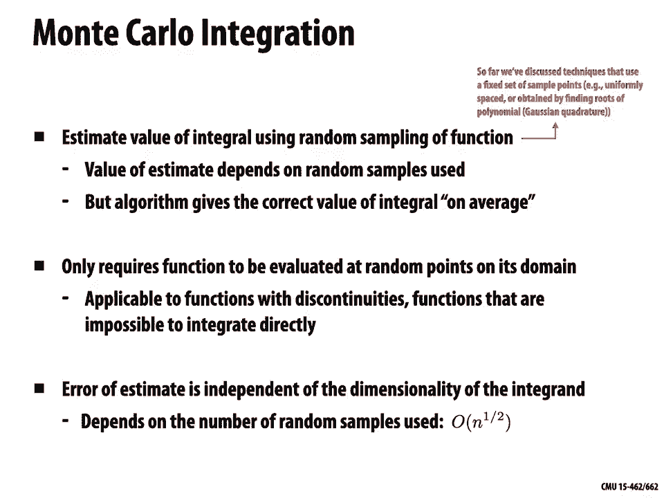

现在考虑二维函数 `f(x, y)` 的积分，即计算曲面下的体积。我们可以将梯形法则推广到二维：先在 `x` 方向固定 `y`，用一维梯形法则近似关于 `x` 的积分，结果是一个关于 `y` 的函数；然后再对这个函数关于 `y` 应用梯形法则。

最终形式是双重求和：`I ≈ Σ_i Σ_j w_{i,j} * f(x_i, y_j)`。

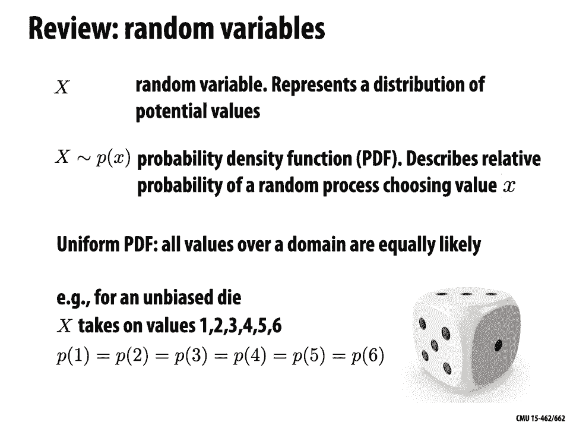

*   **误差**：仍然是 `O(h²)`。
*   **工作量**：在一维是 `O(n)`，在二维是 `O(n²)`（需要在 `n×n` 的网格上采样）。

推广到 `K` 维，工作量将变为 `O(n^K)`，而精度仍仅为 `O(h²)`。这种随着维度增加，计算量指数级增长而精度提升缓慢的现象，被称为**维度灾难**。

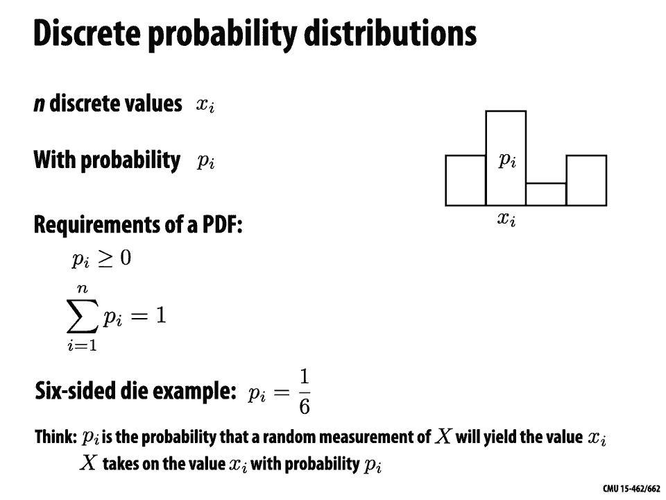

在图形学渲染中，由于渲染方程的递归性，我们需要积分的维度 `K` 可能非常高（数十、数百甚至数千）。因此，梯形法则这类方法无法扩展，我们需要一种根本不同的方法。

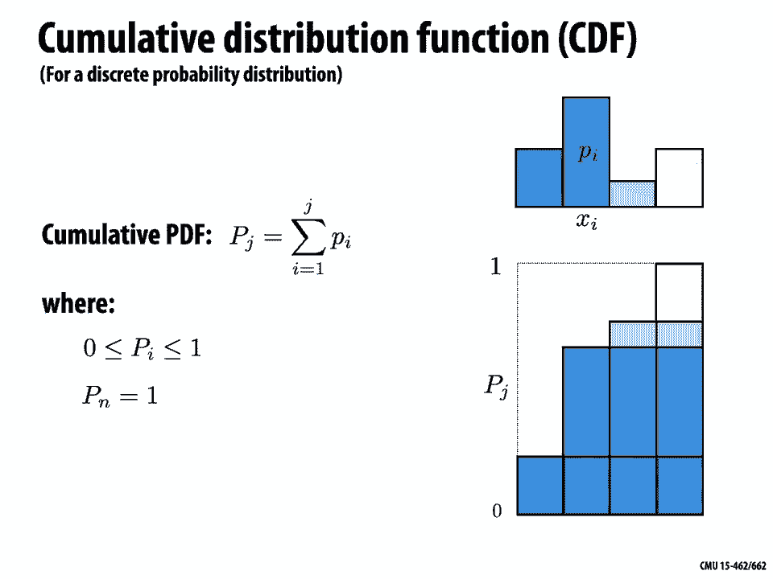

## 蒙特卡洛积分：应对高维的利器 🎲

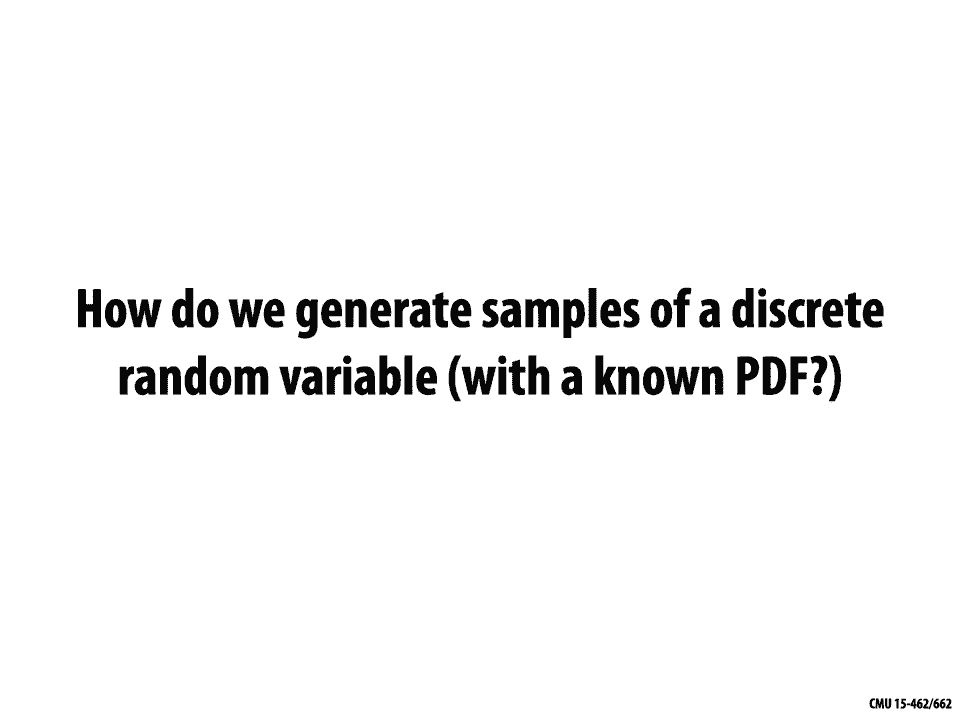

蒙特卡洛积分是20世纪最重要的算法之一，它通过引入随机性来打破维度灾难。

其核心思想是：不再在确定性的规则点采样，而是**随机地**在积分域中选取样本点，用这些随机样本的函数值的平均来估计积分。这意味着每次运行算法，得到的估计值都可能不同。

### 蒙特卡洛积分的优点

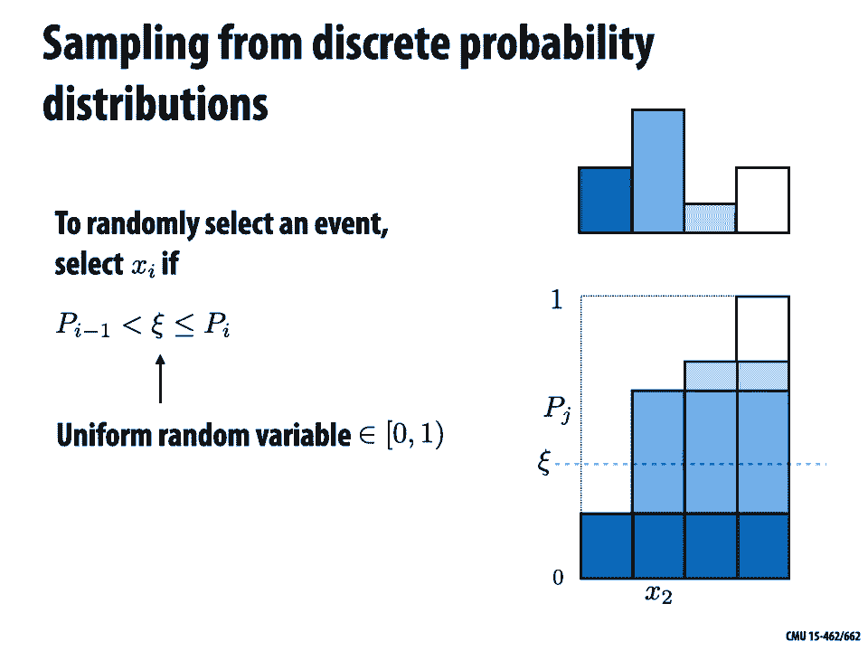

1.  **只需函数求值**：只需要在随机点计算函数值，不要求函数光滑，甚至可以处理有间断的函数（这在渲染中很常见）。
2.  **误差与维度无关**：这是最关键的优势。蒙特卡洛估计的误差仅取决于使用的**总样本数 `N`**，与积分维度 `K` 无关。误差以 `O(1/√N)` 的速度下降。
3.  **适用于复杂积分**：对于无法解析求积或维度很高的积分，蒙特卡洛通常是唯一可行的方法。

在一维时，梯形法则 (`O(1/N²)`) 可能比蒙特卡洛 (`O(1/√N)`) 更高效。但随着维度升高，蒙特卡洛的优势变得无可替代。

## 概率论基础回顾 🎯

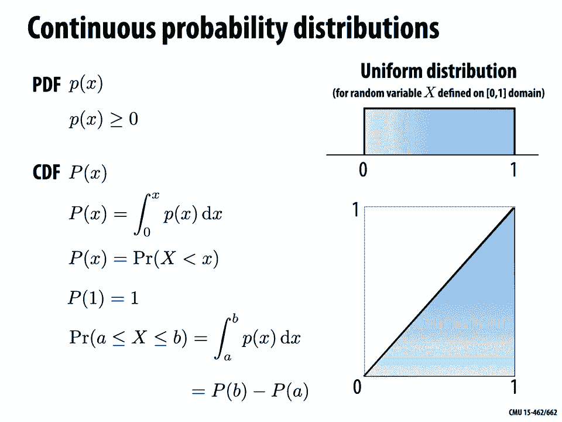

要深入理解蒙特卡洛积分，我们需要回顾一些概率论基本概念。

### 随机变量与概率密度函数 (PDF)

随机变量 `X` 代表一系列可能取值的分布。我们用**概率密度函数** `p(x)` 来描述这个分布，它表示随机过程选择特定值 `x` 的相对可能性。

*   **离散分布**：随机变量取有限个值 `{x_i}`，每个值有概率 `p_i`。概率必须非负且总和为1：`p_i ≥ 0`, `Σ p_i = 1`。
*   **连续分布**：随机变量在连续域上取值。PDF `p(x)` 必须非负，且在定义域上积分为1：`p(x) ≥ 0`, `∫ p(x) dx = 1`。某个区间 `[a, b]` 的概率是 PDF 在该区间上的积分。

### 累积分布函数 (CDF)

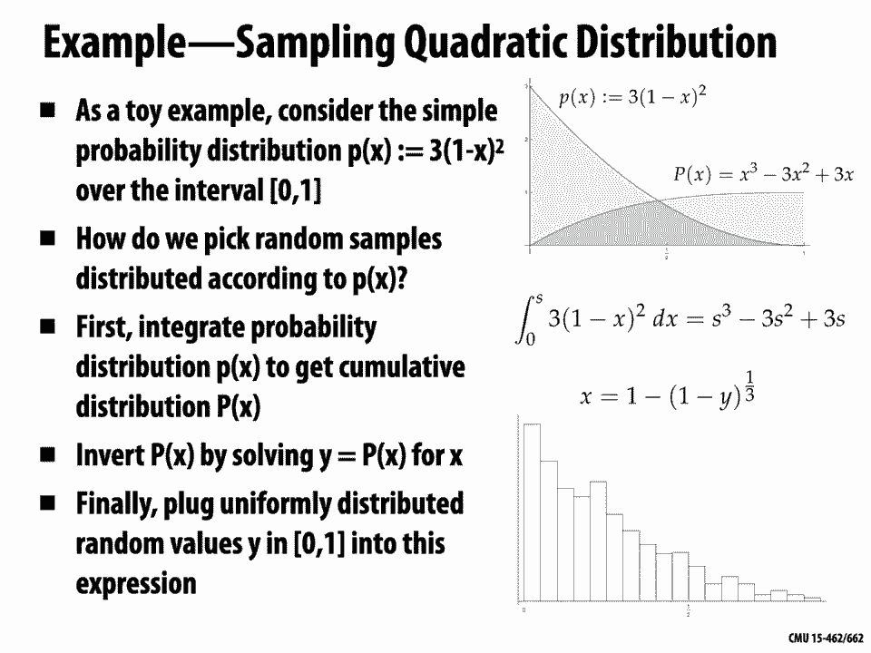

CDF `P(x)` 表示随机变量取值小于等于 `x` 的概率。
*   **离散**：`P_j = Σ_{i=1}^{j} p_i`。
*   **连续**：`P(x) = ∫_{-∞}^{x} p(t) dt`。

根据微积分基本定理，`P(b) - P(a)` 给出了 `X` 落在 `[a, b]` 内的概率。

### 如何生成随机样本？

给定一个 PDF，我们如何让计算机生成服从该分布的随机样本？

1.  **逆变换法（适用于可逆CDF）**：
    *   计算 CDF `P(x)`。
    *   生成一个在 `[0, 1]` 上均匀分布的随机数 `ξ`。
    *   计算 `x = P^{-1}(ξ)`，则 `x` 即为服从 PDF `p(x)` 的样本。
    *   *原理*：因为 `ξ` 是均匀的，`x` 落在某个区间的概率正比于该区间对应的 CDF 变化量，即原 PDF 在该区间的积分（概率）。
    *   *挑战*：需要能够解析地计算并求逆 CDF。

2.  **拒绝采样法（适用于有界域且可找到包围盒）**：
    *   用一个简单区域（如矩形、立方体）包围目标概率密度区域。
    *   在简单区域内均匀采样一个点。
    *   如果该点落在目标区域内，则接受它作为一个样本；否则，拒绝并重新采样。
    *   *优点*：实现简单，无需计算 CDF。
    *   *缺点*：如果目标区域占包围盒的比例很小（接受概率低），则效率低下，会浪费大量采样。

**示例：均匀采样单位圆盘**
*   *错误方法*：均匀采样半径 `r ∈ [0,1]` 和角度 `θ ∈ [0, 2π)`，然后转换 `(r cosθ, r sinθ)`。这会导致样本点向圆心聚集，分布不均匀。
*   *正确方法之一（逆变换法）*：通过计算可知，应让 `r` 的分布密度与 `r` 成正比（而非均匀），即采样 `r = √ξ₁`, `θ = 2πξ₂`，其中 `ξ₁, ξ₂` 是独立的 `[0,1]` 均匀随机数。
*   *正确方法之二（拒绝采样法）*：在包围圆的正方形 `[-1,1]×[-1,1]` 内均匀采样点 `(x,y)`。如果 `x² + y² ≤ 1`，则接受该点；否则拒绝并重试。这种方法简单，且接受率约为 `π/4 ≈ 78.5%`，效率尚可。

在选择采样方法时，需要在实现的复杂度和采样效率之间进行权衡。对于渲染中的常用分布，通常已有优化好的采样方法。

## 总结 📝

本节课我们一起学习了数值积分。
*   我们从积分的定义和简单函数的积分开始，介绍了求积法则的核心思想：通过采样点的加权和来近似积分。
*   我们探讨了梯形法则及其在一维和高维下的性能，并指出了传统方法在应对高维积分时的**维度灾难**问题。
*   为了克服维度灾难，我们引入了**蒙特卡洛积分**，它利用随机采样，使误差估计与维度无关。
*   为了实施蒙特卡洛积分，我们回顾了必要的概率论知识，包括概率密度函数、累积分布函数，以及生成特定分布随机样本的两种主要方法：**逆变换法**和**拒绝采样法**。

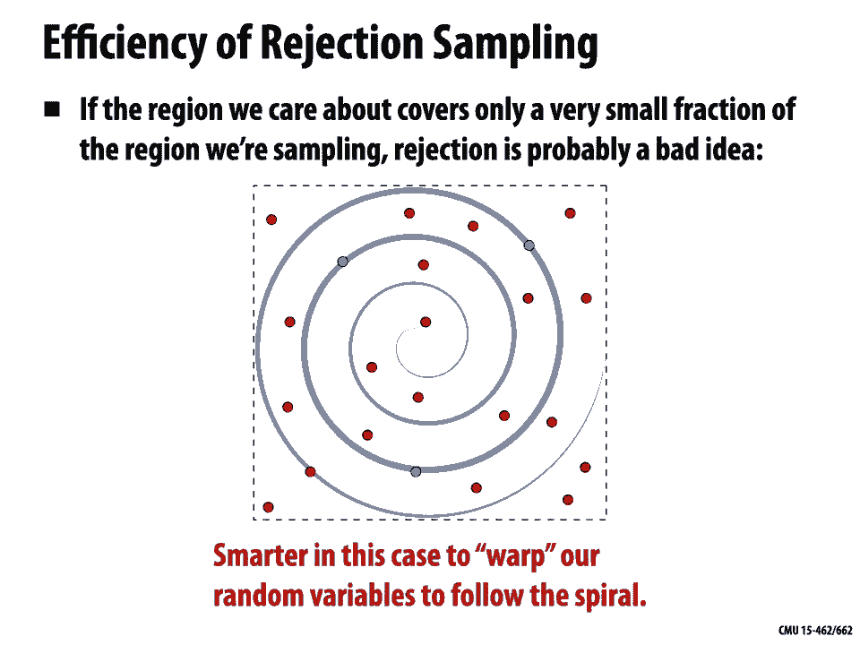

下一节，我们将把这些知识结合起来，把蒙特卡洛积分应用到递归的渲染方程中，从而学习如何生成真实感图像。