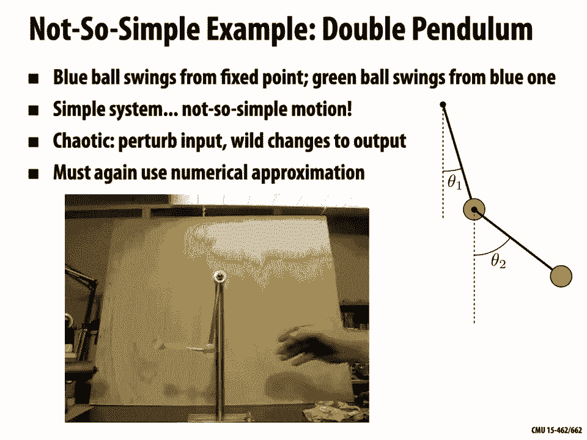
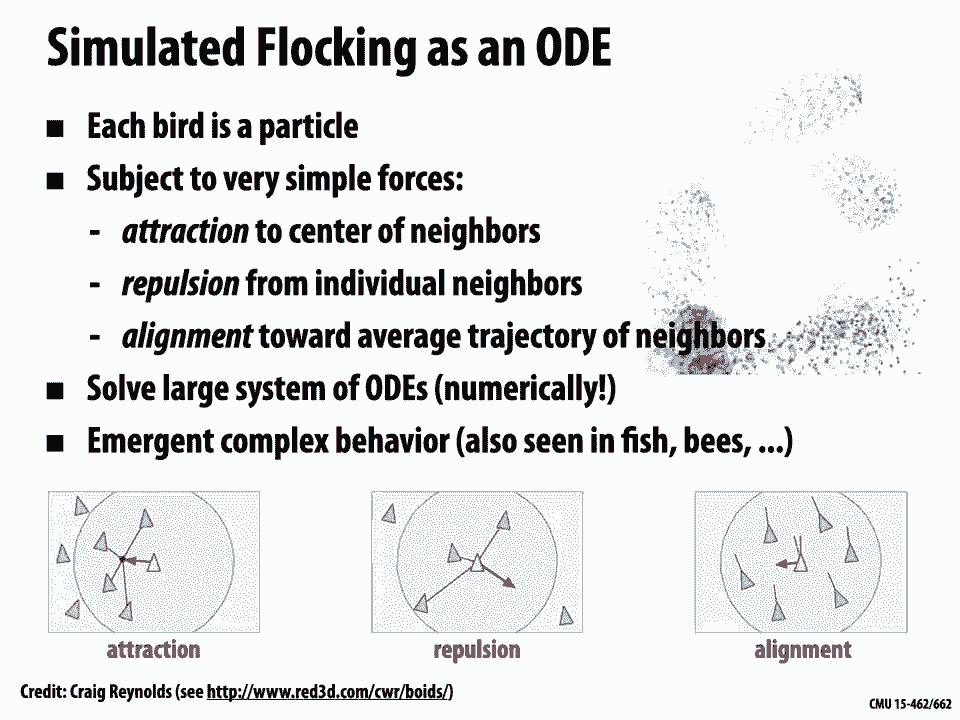
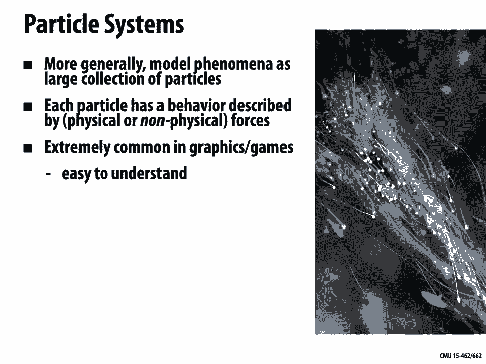
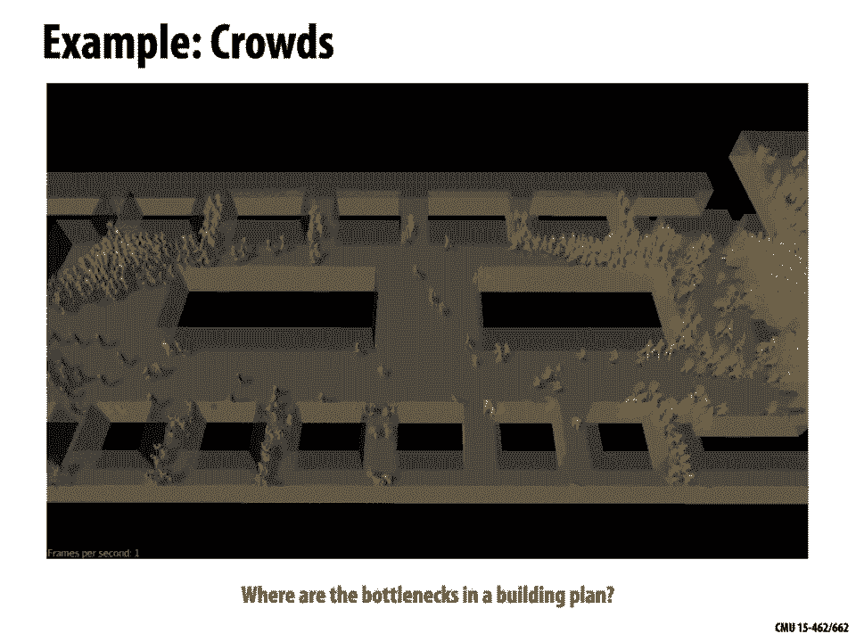
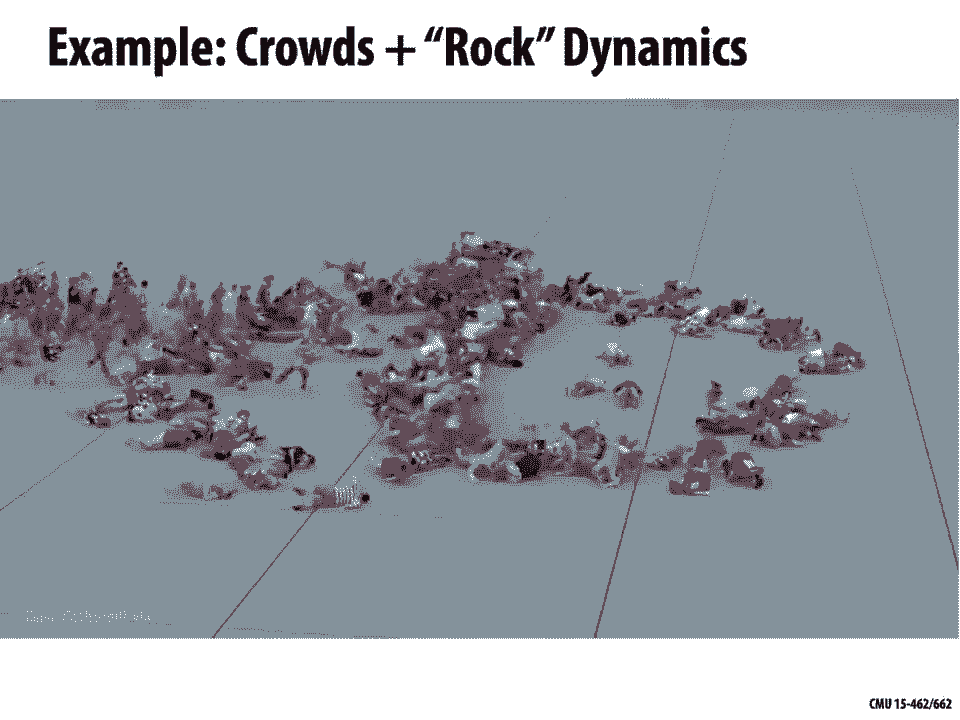
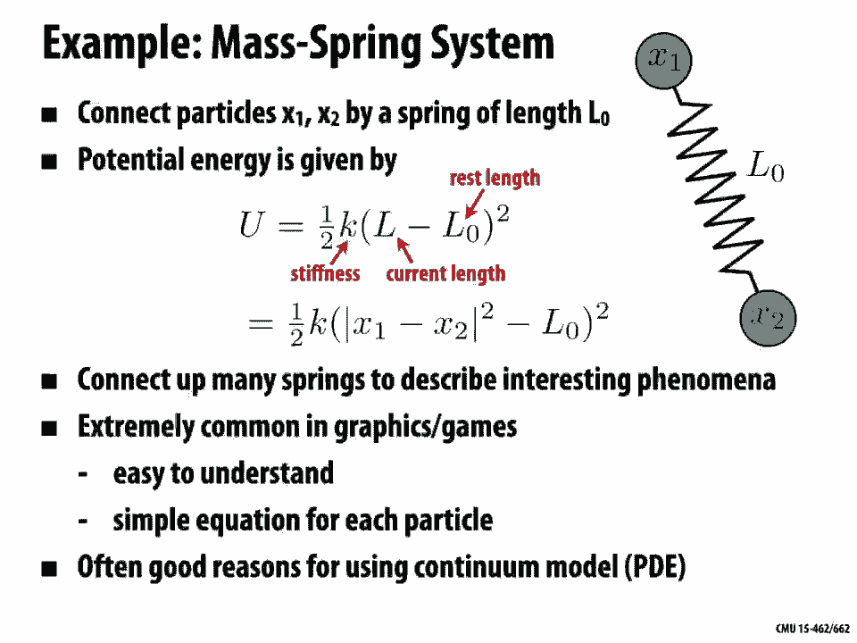
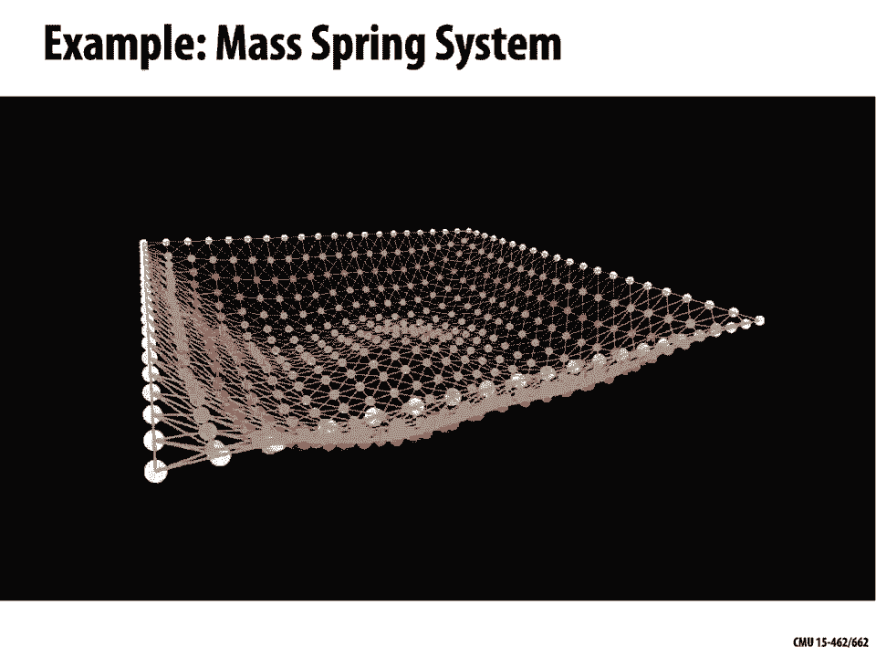
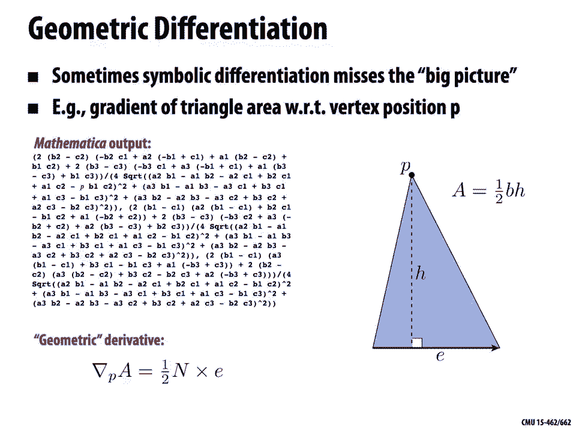

# 计算机图形学：P22：动力学和时间积分 🎬

在本节课中，我们将学习如何使用数值模拟来生成计算机动画。我们将探讨动力学描述、时间积分方法，以及如何通过物理模拟来为虚拟世界添加复杂的运动。

---

## 概述

上一讲我们开始讨论动画，其基本思想是为世界模型添加运动。我们探讨了如何建模几何、材料以及光与这些几何和材料的交互。现在，我们希望**通过添加运动让事物“活”起来**。

上节课我们研究的基本技术是关键帧插值。这可以追溯到动画的起源，艺术家手工绘制关键姿势，然后由另一位艺术家填充中间帧。在数字时代，我们可以在三维几何模型上设置关键帧，让计算机通过样条插值来填充中间帧。

然而，即使是这种半自动化的过程，工作量也很大，因为可能需要为每个关键帧设置大量参数。今天，我们将探讨一种不同类型的计算机动画——**基于物理的模拟动画**。

---

## 动力学描述与物理模拟

### 动力学 vs. 运动学

**动力学**关注力的研究及其对运动的影响。与之相对的是**运动学**，它只研究物体的运动，而不考虑其产生的原因。关键帧插值或样条插值是一种**运动学**描述，因为我们只是指定了物体在不同时间点的期望位置，而没有理解导致其运动的力。

### 动画方程：牛顿第二定律

在渲染中我们有渲染方程，在计算机动画中，我们则有**动画方程**，即牛顿第二定律：

**F = ma**

其中，**F** 是力，**m** 是质量，**a** 是加速度。这是我们生成动画时需要求解的核心方程。我们描述系统中的质量和作用其上的力，然后求解这个二阶微分方程，从而得到速度，进而得到物体的运动轨迹。

### 广义坐标与系统状态

为了统一描述复杂系统，我们引入**广义坐标**的概念。任何系统在任何时刻都有一个**构型**，它是时间的函数。这个构型是一个很长的列表，包含了描述系统当前状态的所有变量。

例如，对于台球系统，这个向量会存储每个球的平面位置 (x, y)。如果我们有6个球，就会有12个坐标。我们可以将整个系统的演化想象为一个在更高维空间（本例中是12维）中移动的点的轨迹。

这种观点的优势在于，它自然地映射到我们实际用计算机求解方程的方式。我们将所有描述系统的变量堆叠成一个大向量，交给求解器，然后得到描述下一时刻所有位置的新向量。

---

## 拉格朗日力学：一种优雅的建模方法

对于复杂系统，直接分析受力可能很困难。**拉格朗日力学**提供了一种更通用、更优雅的方法来推导运动方程。

以下是使用拉格朗日力学的步骤：
1.  **写出系统的动能 (T)**。例如，对于质点，动能为 `(1/2) * m * v²`。
2.  **写出系统的势能 (U)**。例如，重力势能为 `m * g * h`。
3.  **定义拉格朗日量 (L)**：`L = T - U`。
4.  **应用欧拉-拉格朗日方程**：
    `d/dt (∂L/∂q̇) = ∂L/∂q`
    其中，`q` 是广义坐标，`q̇` 是广义速度。

这个方程的左端项类似于“质量 × 加速度”，右端项类似于“力”，本质上仍然是牛顿第二定律。这种方法的优点在于：
*   **更容易处理**：能量是标量，无需考虑方向，不易出错。
*   **适用于任何广义坐标**。
*   **自然地引向一类优秀的数值模拟技术**。

### 示例：单摆运动

让我们用拉格朗日方法推导单摆的运动方程。
*   **广义坐标**：摆角 `θ`。
*   **动能**：`T = (1/2) * m * l² * θ̇²`。
*   **势能**：`U = -m * g * l * cosθ`（以悬挂点为零势能点）。
*   **拉格朗日量**：`L = T - U = (1/2) * m * l² * θ̇² + m * g * l * cosθ`。
*   **应用欧拉-拉格朗日方程**：
    *   `∂L/∂θ̇ = m * l² * θ̇`
    *   `d/dt (∂L/∂θ̇) = m * l² * θ̈`
    *   `∂L/∂θ = -m * g * l * sinθ`
    *   得到方程：`m * l² * θ̈ = -m * g * l * sinθ`，即 **`θ̈ = -(g/l) * sinθ`**。

这就是单摆的运动方程。对于小角度摆动（`sinθ ≈ θ`），方程简化为 `θ̈ = -(g/l) * θ`，其解是简谐运动：`θ(t) = A * cos(√(g/l) * t + B)`。

然而，对于大角度摆动或更复杂的系统（如**双摆**），这个方程通常**没有解析解**。双摆系统是一个经典的混沌系统，初始条件的微小变化会导致轨迹的巨大差异。这时，我们必须依靠**数值模拟**。

---

## 粒子系统与质点-弹簧系统

在计算机图形学中，**粒子系统**和**质点-弹簧系统**是模拟复杂现象的强大工具。

### 粒子系统

粒子系统将现象建模为大量相互作用的粒子。每个粒子有自己的位置、速度，并受到各种力的影响。通过为粒子定义简单的行为规则，可以涌现出复杂的群体行为。

一个著名的例子是**鸟群模拟（Boids模型）**，其中每个“鸟”（粒子）遵循三条基本规则：
1.  **分离**：避免与邻居太近。
2.  **对齐**：与邻居的平均飞行方向保持一致。
3.  **聚集**：向邻居的平均位置靠拢。

通过数值积分这些粒子所受的力，就能模拟出逼真的鸟群运动。粒子系统也广泛用于模拟火焰、烟雾、流体和沙粒等。

### 质点-弹簧系统

质点-弹簧系统通过弹簧连接粒子，常用于模拟可变形体，如布料、头发和软组织。

*   **弹簧势能**：对于连接两点 `x₁` 和 `x₂` 的弹簧，其势能为 `U = (1/2) * k * (||x₁ - x₂|| - l₀)²`，其中 `k` 是刚度，`l₀` 是原长。
*   **布料模拟**：可以将布料网格的顶点视为质点，网格的边视为弹簧。通过调整弹簧参数并处理碰撞，就能模拟出布料的各种动态效果。

---

## 时间积分：数值求解运动方程

既然我们得到了运动方程（通常是常微分方程 ODE），如何用计算机求解呢？核心思想是用**差分**来近似**微分**。

我们不再求解连续函数 `q(t)`，而是在离散时间点 `t₀, t₁, t₂, ...` 上采样，时间步长为 `Δt`。我们的目标是，已知当前时刻 `t_k` 的状态 `q_k`，计算下一时刻 `t_{k+1}` 的状态 `q_{k+1}`。

### 前向欧拉法

最直接的方法是**前向（显式）欧拉法**：
`q_{k+1} = q_k + Δt * f(q_k)`
其中 `f(q)` 是速度函数（对于二阶方程，需先化为一阶方程组）。

*   **优点**：简单，计算快（显式）。
*   **缺点**：**稳定性差**。对于“刚性”系统（如很硬的弹簧），需要非常小的时间步长 `Δt` 才能避免模拟爆炸（能量激增）。这会导致计算量巨大。

### 后向欧拉法

另一种方法是**后向（隐式）欧拉法**：
`q_{k+1} = q_k + Δt * f(q_{k+1})`
注意，等式右边依赖于未知的 `q_{k+1}`，因此这是一个需要求解的隐式方程。

*   **优点**：**无条件稳定**。即使使用较大的时间步长，模拟也不会爆炸。
*   **缺点**：**数值阻尼**。模拟会逐渐损失能量，导致运动看起来“粘滞”，不够生动。并且每步都需要求解（可能非线性的）方程，计算更复杂。

### 辛欧拉法

在计算机图形学中，经常使用一种折中的方法——**辛欧拉法**（或蛙跳法）。其更新步骤是交错的：
1.  用当前构型更新速度：`v_{k+1} = v_k + Δt * f(q_k)`
2.  用新速度更新构型：`q_{k+1} = q_k + Δt * v_{k+1}`

*   **优点**：能很好地**保持能量**（对于保守系统），长期模拟效果稳定，且实现简单。
*   **缺点**：精度和稳定性介于前向和后向欧拉法之间。

**没有一种积分器是万能的**。选择时需要权衡**稳定性、精度、能量守恒性和计算效率**。

---

## 微分计算：获取力与梯度

在模拟中，我们经常需要计算势能的梯度（即力）或其他导数。有几种方法：

1.  **手工推导**：准确、高效，但工作量大且容易出错。
2.  **数值微分**：通过有限差分近似，`f'(x) ≈ (f(x+h) - f(x)) / h`。通用但**不精确**，且需要为每个变量多次计算函数值，速度慢。
3.  **自动微分**：通过重载算术运算，让计算机在计算函数值的同时，利用链式法则计算导数值。**精度高，速度快**，是现代深度学习框架的核心，但需要改变代码使用特定的库。
4.  **符号微分**：使用计算机代数系统（如 Mathematica）进行符号求导。适用于推导公式，但得到的表达式可能非常复杂，且不易集成到实时应用中。
5.  **几何微分**：利用几何直觉直接推导梯度表达式。通常能得到**最简洁、物理意义最明确**的结果，但需要洞察力，且只适用于特定问题。

例如，求三角形面积关于其一个顶点 `p` 的梯度。符号微分可能给出一长串复杂的表达式。但几何上我们知道，面积梯度方向垂直于该顶点的对边，大小与对边长度成正比。因此，梯度向量就是 `(1/2) * (对边向量) × (三角形单位法向)` 的某种形式，非常简洁。

---

## 总结

本节课我们一起学习了计算机动画中的动力学模拟与时间积分。

*   我们首先区分了**运动学**（描述运动）和**动力学**（从力推导运动），并引入了基于牛顿第二定律 `F=ma` 的物理模拟思想。
*   为了描述复杂系统，我们学习了使用**广义坐标**将整个系统的状态编码为一个高维向量，并将其运动视为在高维空间中的轨迹。
*   我们介绍了**拉格朗日力学**这一强大工具，它通过动能和势能标量来优雅地推导运动方程，并以单摆和双摆为例进行了说明。
*   我们探讨了**粒子系统**和**质点-弹簧系统**这两种在图形学中模拟群体行为、流体、布料等现象的常用模型。
*   核心挑战在于求解运动方程。我们学习了**数值时间积分**的基本方法：**前向欧拉法**（简单但不稳定）、**后向欧拉法**（稳定但有阻尼）和**辛欧拉法**（在能量守恒和效率间取得良好平衡）。
*   最后，我们讨论了计算模拟中所需要的**微分**（如力）的几种技术：手工推导、数值微分、自动微分、符号微分和几何微分，并比较了它们的优缺点。

通过将物理定律与数值计算相结合，我们可以让计算机自动生成丰富、复杂且逼真的动画，极大地扩展了动画创作的可能性。下一讲，我们将进入另一个核心主题：**优化**。