# 24：L23- 基于物理的动画和 PDE 🎬

在本节课中，我们将要学习如何通过求解偏微分方程来实现基于物理的动画。我们将从回顾优化和常微分方程开始，逐步引入包含空间导数的偏微分方程，并探讨其在模拟水、烟雾、布料等自然现象中的应用。课程将涵盖PDE的基本概念、分类、离散化方法以及数值求解策略，并通过简单的代码示例展示其强大的图形学应用。

## 回顾：从优化到常微分方程

上一节我们简要介绍了优化方法，其核心思想是通过数值下降法来最小化目标函数。我们选择一个初始猜测，然后沿着梯度下降方向迭代，期望最终得到一个良好的解。

如果我们回顾更早的课程，会发现梯度下降等策略本质上是**常微分方程**的例子。ODE只涉及时间导数，其基本形式可以描述一个函数随时间的变化率。

例如，要模拟一块石头在空中的弹道轨迹，我们可以说石头的位置 **x** 在任何时间 **t** 的二阶时间导数等于重力方向。这给出了一个隐式关系，要得到精确轨迹需要求解这个方程。

**公式**：`x''(t) = g`

## 引入偏微分方程

本节中，我们将在ODE的基础上增加空间导数，从而引入**偏微分方程**。PDE同时包含时间和空间导数，能够描述更丰富的自然现象。

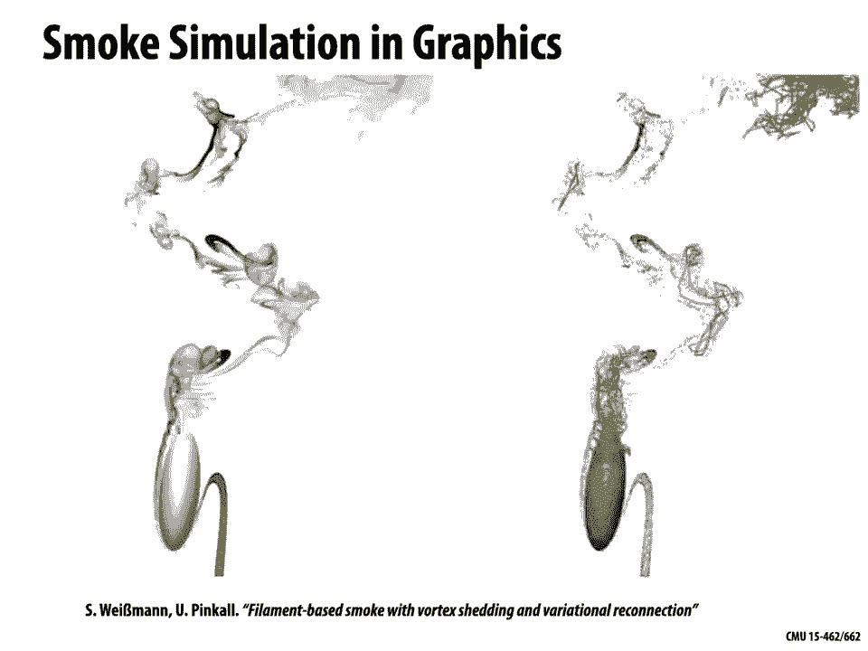

例如，石头落入池塘后产生的涟漪，其高度 **u** 的变化可以用一个PDE来描述：高度的二阶时间导数等于其拉普拉斯算子（空间二阶导数的和）。

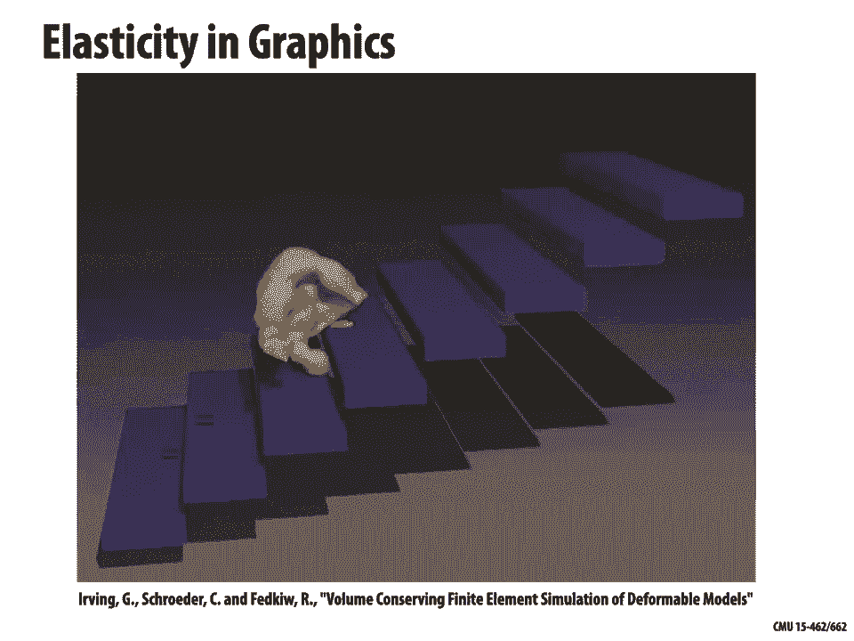

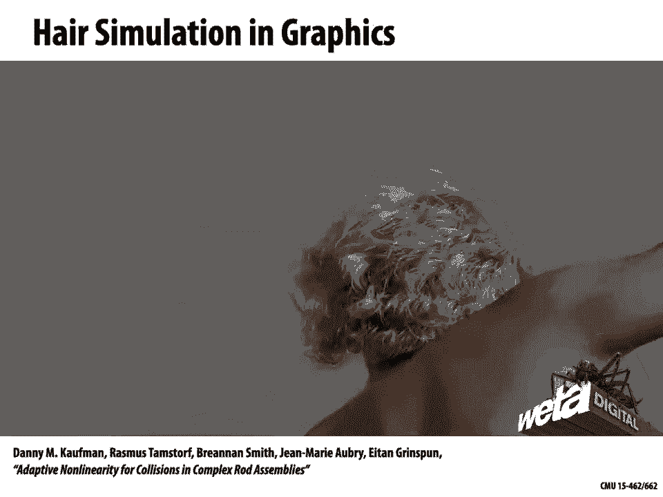

**公式**：`∂²u/∂t² = ∇²u`

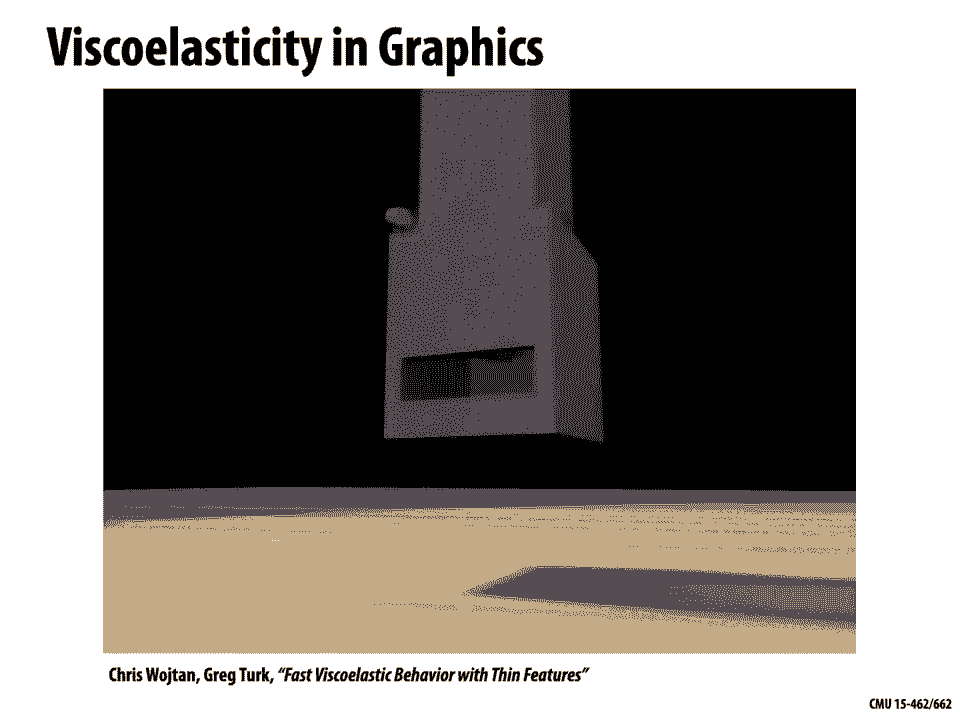

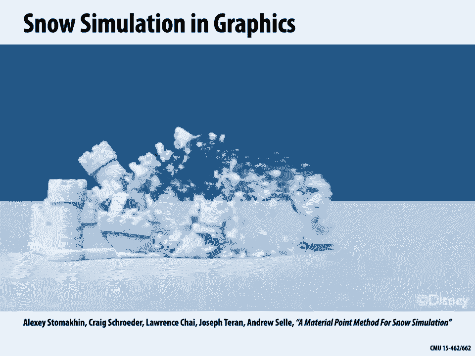

这同样是一个隐式描述，我们需要通过求解这个方程才能看到水的实际运动。这正是我们今天要探讨的核心。

## PDE求解的基本思路

求解ODE的基本策略是在每个时间步长上增加一点速度。如果我们知道当前状态 **q_k** 和速度函数 **f(q)**，那么新状态可以通过以下方式获得：

**公式**：`q_{k+1} = q_k + τ * f(q_k)`

其中 **τ** 是一个小的时间步长。

求解PDE在思想上与此类似，我们仍然在时间上向前推进。区别在于，现在的速度函数将涉及对邻域值的加权组合。例如，在波动方程中，更新规则可能类似于将直接邻居的值相加，然后减去4倍自身的值。

**代码示例（概念）**：
```python
# 伪代码示例：基于网格的简单更新
for each grid point (i, j):
    velocity[i, j] += τ * (neighbor_sum - 4 * self_value)
    height[i, j] += τ * velocity[i, j]
```

尽管PDE求解有更多细节和技术，但这个简单的思路为我们提供了入门的基础。令人惊讶的是，非常简单的代码就能产生相当逼真的行为，这正是PDE在图形学中备受青睐的原因。

## 一个简单的波动模拟示例

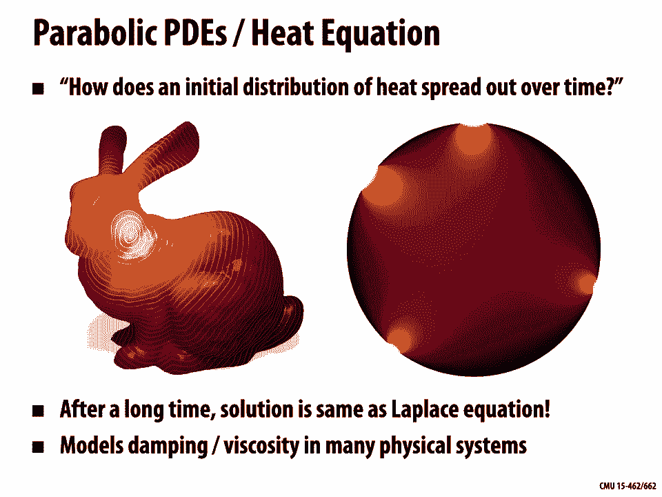

以下是模拟池塘波纹的一个简化代码框架，它展示了PDE求解的核心循环：

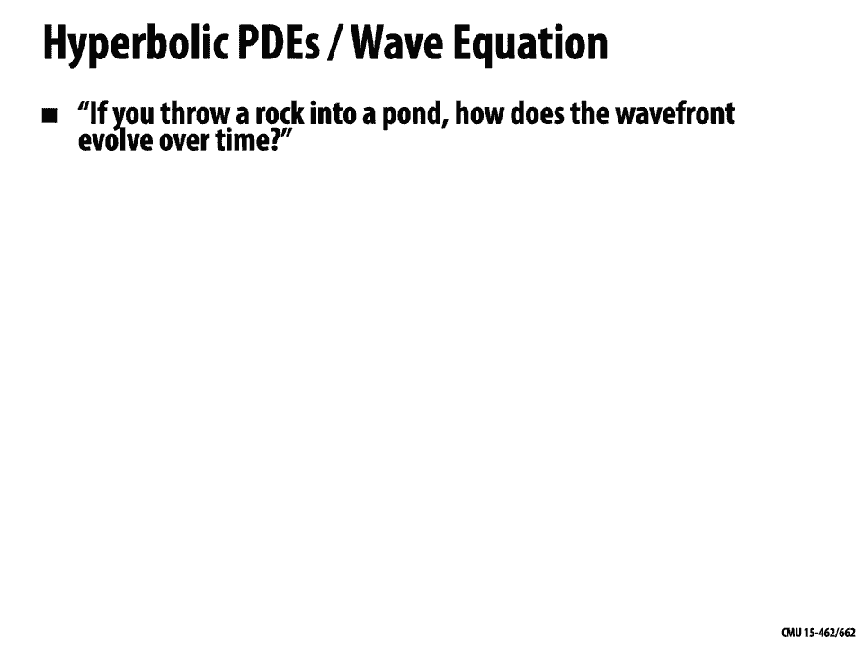

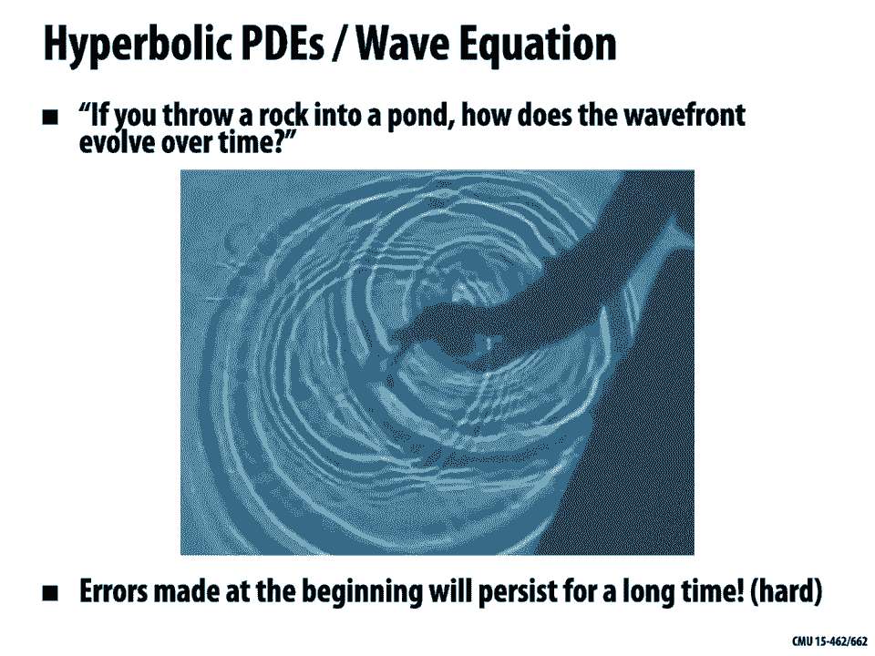

**代码示例**：
```python
# 初始化
grid_size = 128
u = np.zeros((grid_size, grid_size))  # 高度场
v = np.zeros((grid_size, grid_size))  # 速度场
tau = 0.01  # 时间步长
alpha = 0.99  # 阻尼因子

# 主循环
while True:
    # 随机投掷“石头”
    if frame_count % 100 == 0:
        i, j = random_position()
        u[i, j] = -1.0

    # 更新速度（基于拉普拉斯近似）
    for i in range(grid_size):
        for j in range(grid_size):
            left = u[(i-1)%N, j]
            right = u[(i+1)%N, j]
            bottom = u[i, (j-1)%N]
            top = u[i, (j+1)%N]
            laplacian = (left + right + bottom + top - 4*u[i, j]) / (h*h)
            v[i, j] += tau * laplacian
            v[i, j] *= alpha  # 应用阻尼

    # 更新高度
    for i in range(grid_size):
        for j in range(grid_size):
            u[i, j] += tau * v[i, j]

    # 显示结果（例如，渲染为高度图或图像）
    display(u)
```

这段代码虽然简单，却能产生美丽的波动行为。当然，真实的图形学应用（如流体、烟雾模拟）会复杂得多，但核心原理是相通的。

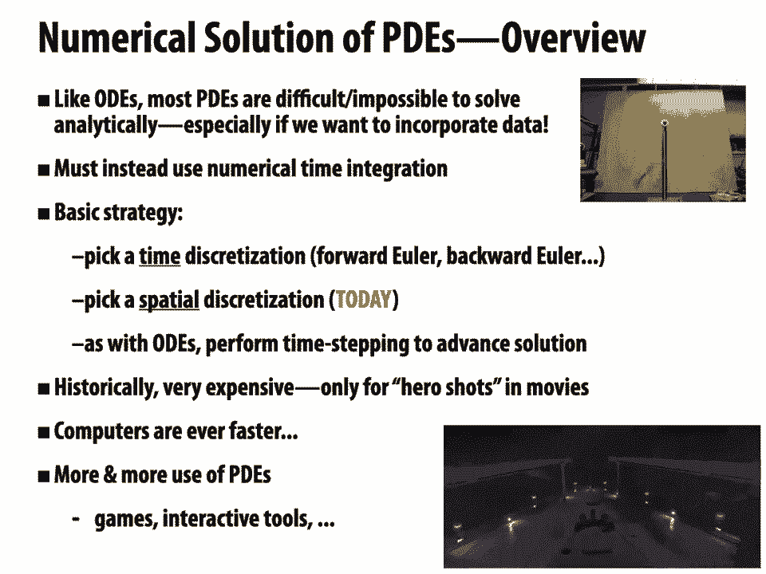

## PDE在图形学中的应用实例

通过求解更复杂的PDE，我们可以创造出各种令人惊叹的视觉效果。以下是几个例子：

*   **流体模拟**：模拟不同密度液体的相互作用，产生复杂的流动和混合效果。
*   **烟雾模拟**：使用涡度方法模拟出飘逸、真实的烟雾。
*   **布料模拟**：模拟布料在跌落、碰撞时的褶皱和弯曲。
*   **弹性体模拟**：模拟可变形物体（如橡胶）的拉伸、压缩和断裂。
*   **头发模拟**：将头发视为一维弹性体，模拟其摆动和扭曲。
*   **粘弹性材料**：模拟像面团一样被挤压后发生永久形变的材料。
*   **物质点法**：用于电影《冰雪奇缘》中的雪模拟，混合了粒子和网格方法。

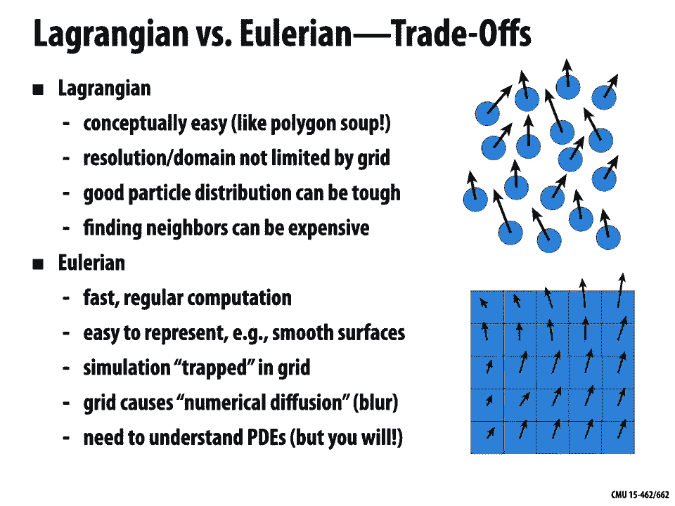

这些应用表明，PDE已成为电影特效、游戏和交互式工具中不可或缺的技术。

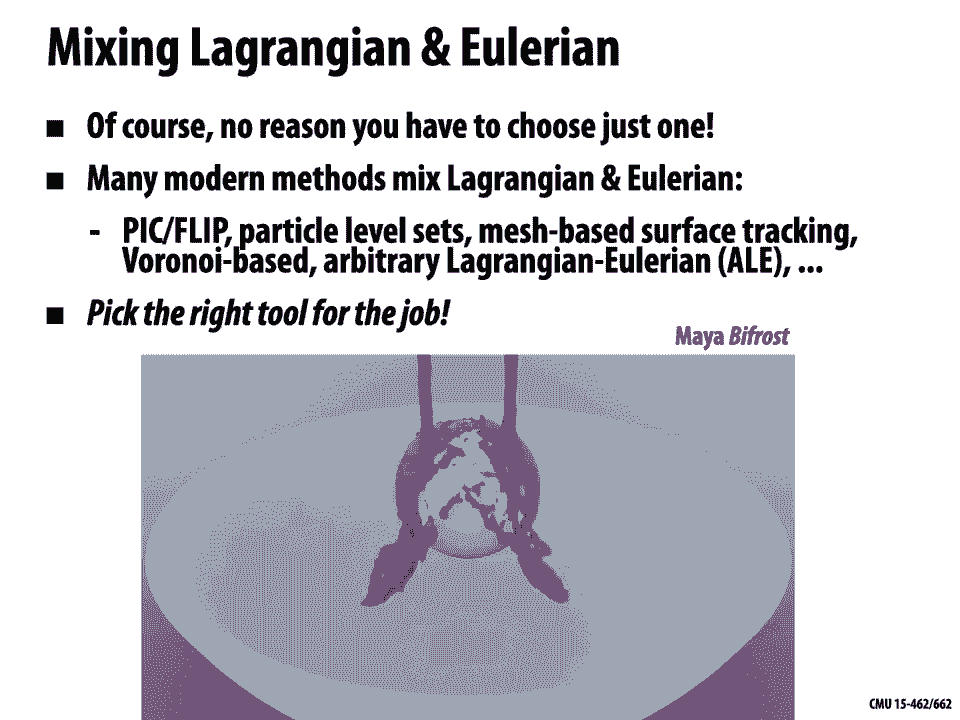

## PDE的基本概念与分类

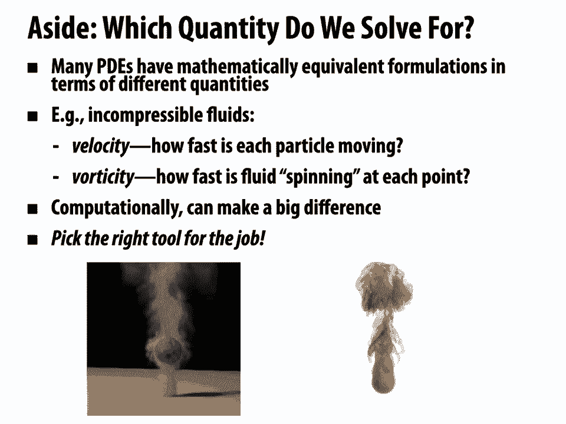

要开发这些技术，我们需要回到基础，理解PDE究竟是什么。PDE求解的是一个同时依赖于时间和空间的函数 **u(t, x)**，该函数通过其导数的关系被隐式定义。

我们可以用一些术语来描述PDE的特性，这些特性决定了问题的求解难度和计算方法：

*   **线性 vs 非线性**：如果方程中未知函数及其导数仅以线性方式组合（如相乘、相加），则为线性PDE，通常更容易求解。如果包含像 **u * ∂u/∂x** 这样的项，则为非线性PDE。
*   **阶数**：方程中出现的最高阶导数的阶数。例如，波动方程在时间和空间上都是二阶的。

尽管PDE种类繁多，但有几类基本的**模型方程**，理解它们有助于把握不同类型PDE的特性和求解方法：

1.  **拉普拉斯方程**：`∇²u = 0`。这是**椭圆型方程**的典型例子。直观上，它寻求在给定边界数据下的“最平滑”插值函数。
2.  **热方程**：`∂u/∂t = ∇²u`。这是**抛物型方程**的典型例子。它描述了热量（或类似物质）随时间扩散的过程。
3.  **波动方程**：`∂²u/∂t² = ∇²u`。这是**双曲型方程**的典型例子。它描述了波（如水波、声波）的传播。

一般来说，椭圆型问题最容易求解，抛物型次之，双曲型则更具挑战性。非线性高阶方程最为复杂，但在图形学中又非常常见。

## 空间离散化：拉格朗日 vs 欧拉视角

要数值求解PDE，我们需要将连续的时空导数转化为计算机可以计算的离散形式。这涉及时间离散化和空间离散化。

在空间离散化中，一个基本的区分是**拉格朗日**描述和**欧拉**描述：

*   **拉格朗日视角**：跟踪单个“质点”（如粒子）随时间的运动。这类似于点云，粒子可以自由移动，分辨率不固定。但计算空间导数时需要查找邻居，可能较慢。
*   **欧拉视角**：在空间固定位置（如网格点）上观察物理量如何随时间变化。计算规则、快速（易于缓存和矢量化），但模拟被限制在网格范围内，且可能因分辨率不足而产生数值耗散。

现代方法常常混合使用这两种视角，例如FLIP流体模拟方法和物质点法，以结合两者的优点。

## 核心算子：拉普拉斯算子

我们看到的模型方程都包含了**拉普拉斯算子** **∇²**。它在物理、几何和图形学中极其重要。

拉普拉斯算子是一个微分算子，输入一个函数，输出其某种二阶导数。对于函数 **u: ℝⁿ → ℝ**，其拉普拉斯算子定义为：

**公式**：`∇²u = ∂²u/∂x₁² + ∂²u/∂x₂² + ... + ∂²u/∂xₙ²`

更直观地，**拉普拉斯算子衡量了一个点的函数值与其邻域平均值的偏差**。在波动方程中，如果一个点的水面高度远高于周围，拉普拉斯值就大，意味着该点将快速运动；如果水面平坦，拉普拉斯值为零，没有运动。

## 数值离散化：有限差分法

我们需要将拉普拉斯算子这样的连续算子离散化。**有限差分法**是用于规则网格的一种自然方法。

*   **一阶导数近似**：`∂u/∂x ≈ (u_{i+1} - u_i) / h`
*   **二阶导数近似**：`∂²u/∂x² ≈ (u_{i+1} - 2u_i + u_{i-1}) / h²`

将其推广到二维网格，拉普拉斯算子的一个常见离散近似为：

**公式**：`∇²u_{i,j} ≈ (u_{i-1,j} + u_{i+1,j} + u_{i,j-1} + u_{i,j+1} - 4u_{i,j}) / h²`

对于三角形网格，则有著名的**余切公式**来计算拉普拉斯算子，它适用于非规则网格。

## 边界条件

在定义PDE问题时，我们必须指定**边界条件**，即解在求解区域边界上的行为。两种最基本的类型是：

*   **狄利克雷边界条件**：直接指定边界上的函数值 **u = a**。
*   **诺伊曼边界条件**：指定边界上函数法向导数的值 **∂u/∂n = b**。

边界条件必须与PDE本身相容，否则问题可能无解。例如，对于拉普拉斯方程，诺伊曼边界条件必须满足**净通量为零**（即所有边界法向导数的积分和为零），否则内部无处安放这些“源”或“汇”。

**重要提示**：数值求解器可能不会自动检查边界条件的相容性。因此，在调用求解器后，计算残差（`b - A x`）进行验证是一个好习惯。

## 求解模型方程

现在我们可以尝试求解三个模型方程。

1.  **拉普拉斯方程** `∇²u = 0`
    *   离散化后，方程要求每个网格点的值等于其邻居的平均值。
    *   这可以转化为一个大型的**稀疏线性系统** `A x = 0`（或 `A x = b`，如果包含非零边界条件）。
    *   应使用高效的稀疏线性求解器（如Eigen、SuiteSparse）来求解，而不是使用收敛很慢的雅可比迭代法。

2.  **热方程** `∂u/∂t = ∇²u`
    *   结合时间离散化（如向前欧拉法）和空间离散化（有限差分拉普拉斯）。
    *   更新公式为：`u_{k+1} = u_k + τ * ∇² u_k`
    *   这允许我们观察热量从边界扩散到内部的过程。

3.  **波动方程** `∂²u/∂t² = ∇²u`
    *   有两种常见处理方式：
        *   **降阶法**：引入速度变量 `v = ∂u/∂t`，将二阶方程转化为两个一阶方程组：`∂u/∂t = v` 和 `∂v/∂t = ∇²u`。
        *   **中心差分法**：直接对时间二阶导数使用有限差分：`(u_{k+1} - 2u_k + u_{k-1})/τ² = ∇² u_k`，然后求解 `u_{k+1}`。
    *   需要初始条件（初始位移和初始速度，或前两个时间步的状态）。

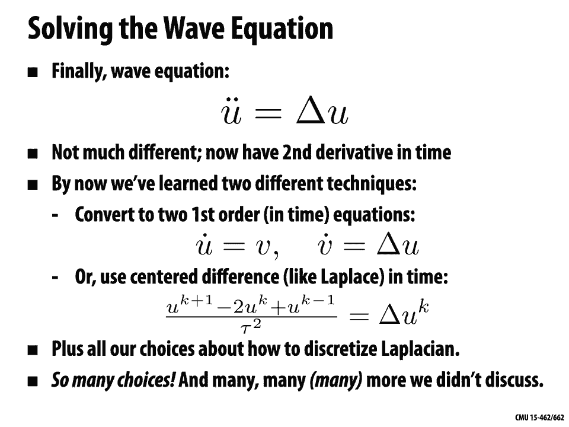

这些原理可以很容易地移植到不同的几何表示（如网格、点云）上，只需替换相应的拉普拉斯算子离散化公式即可。这种基于PDE的算法设计思想，使得图形学算法能够更通用地应用于不同场景。

## 总结与展望

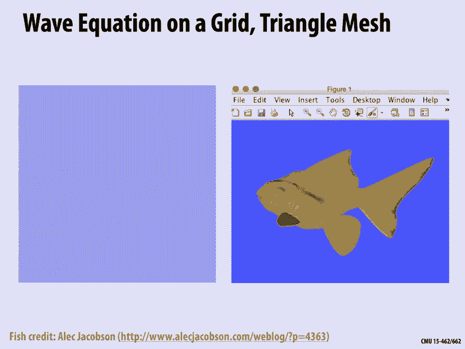

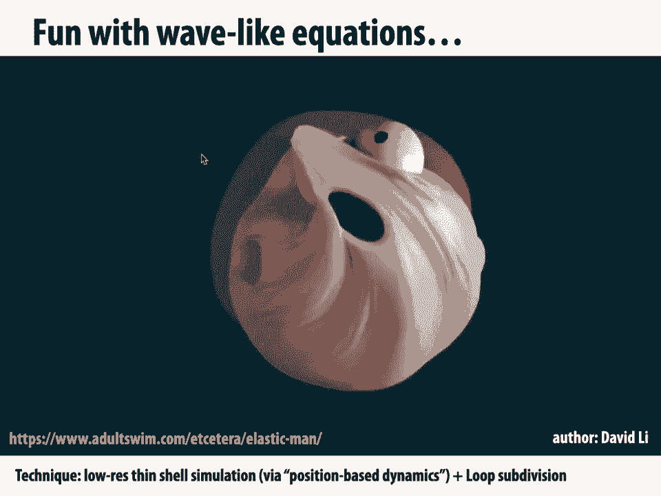

本节课中，我们一起学习了基于物理的动画与偏微分方程的基础知识。我们从ODE出发，引入了包含空间导数的PDE，并了解了其在模拟水、烟、布料等现象中的强大能力。我们探讨了PDE的分类（椭圆、抛物、双曲）、空间离散化的不同视角（拉格朗日 vs 欧拉）、核心的拉普拉斯算子、有限差分离散化方法、边界条件的重要性，以及如何数值求解几个经典的模型方程。

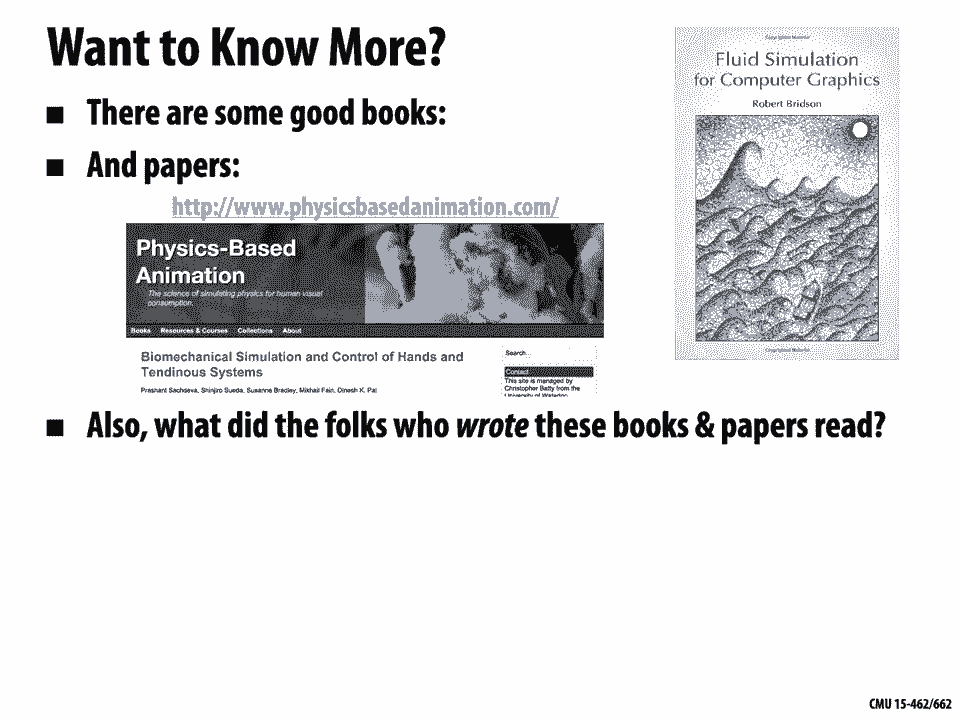

通过简单的代码示例，我们看到即使基础的PDE求解也能产生迷人的视觉效果。而更复杂的模拟，则建立在深入理解计算物理、应用数学和几何学的基础之上。PDE已成为现代计算机图形学中创造逼真动态世界的核心工具，从电影特效到实时交互应用，其影响力日益增长。鼓励有兴趣深入该领域的同学，去探索相关学科更丰富的文献和知识。