# 【双语字幕+资料下载】CMU 15-462 ｜ 计算机图形学(2020·完整版) - P10：L9- 几何导论 - ShowMeAI - BV1Pf4y1E7GJ

[Music]，welcome back to computer graphics so we，are done with our discussion of。

rasterization and we're moving on to a，new topic of，geometric processing and geometric，modeling。

so in the long term in this course what，we want to do is work on increasing the。

complexity of our models，going from very simplistic models like，our。

cube creature that we can make by just，applying simple linear transformations，to a cube。

to things that look a lot more like，people in the real world things that，have a lot of。

complexity and richness and interesting，materials and so forth。

in this next little bit we're going to，talk specifically about how to add，geometric complexity。

so how do we add interesting curves and，wrinkles and details，to the shape of our objects。

okay so let's take a step back i think，one thing we should think about is。

what is geometry when people hear this，word uh they might think back to their。

high school class on geometry and think，oh yeah geometry that's。

that's something about two column proofs，i'm trying to，deduce or or prove something about。

angles and triangles and so forth，this is not geometry okay these are。

useful and important facts about，geometry but this is really not at the，core of what geometry is。

so what is geometry we can look at this，from a，from a linguistic point of view geometry。

really means well geo，is like the earth and metry is，measure so really geometry came from。

people trying to make，measurements of the earth trying to，figure out where they are how to make。

maps and so forth in general we could，say geometry is，the study of shapes sizes patterns and。

positions that's kind of the dictionary，definition，another definition i like is to say that。

geometry is the study of spaces where，some quantity like，lengths angles and so forth can be，measured。

and kind of depending on which，quantities you look at that's the kind，of geometry you're studying。

actually geometry if we go back，in history people have been looking at，it from the beginning。

in terms of things that look like the，kind of polygon meshes we use in。

computer graphics from the beginning，people had often some pretty discreet。

models of geometry even plato，said that the earth isn't in appearance。

like one of those balls which have，saying，yeah the earth is kind of like a。

dodecahedron right rather than talking，about，a sphere so，how else can we describe the earth how。

can we describe，a given piece of geometry this is really，at the core。

of connecting geometry to computer，science we need to talk about，how to come up with digital。

representations how can we use digital，data to encode，shape okay well what are just。

forgetting about digital data what are，just all the ways we can think of to。

describe a given shape like this，shape that i have here on the screen，this red。

curve what would you how would you，describe that，okay maybe the most basic thing is you'd。

give it a linguistic description you，would just say，it's a unit circle and there are，certainly。

programming languages in which you，specify things that way if you're。

doing something in svg file you might，literally type the word circle to，describe a circle。

okay but that's a pretty special case，how else，might you describe this circle。

mathematically can you think of any，okay well one common thing is you could，say the circle is。

the set of all points x y such that x，squared plus y squared is equal to one。

right that's a sort of implicit，description it doesn't tell us which。

points are in the circle but it does，tell us how to，decide if a given point is in the circle。

what's another common formula that you，well we could also write this in terms，of sine。

and cosine so the circle is the set of，all points，cosine theta sine theta for theta in 0，to 2 pi。

right that gives us our x and y，components，okay and that's what i would call an。

explicit description of the circle i，plug in a parameter theta and i get out，a point。

i'm not just testing if the point is in，the circle，what are other ways we can describe a。

circle can you think of other，well actually there are a bunch so for，one i could think of this。

in sort of dynamic terms if i have a，particle or an object like the earth，orbiting the sun。

i could write down some differential，equation that says what's the path，traced out by that particle。

what's the solution to that differential，equation the solution to that equation。

gives me a curve i could also，have a discrete representation right so，i could。

approximate the circle by a polygon kind，of like，plato approximated the earth by a。

dodecahedron and as i add more and more，edges to my，polygon i get closer and closer to the。

original circle，i could also talk about the circle in，terms of symmetry so i could say well。

the circle is this shape that is，preserved by，rotations if i apply a rotation of the，circle it。

doesn't change right that，almost pins down the circle i could also，talk about。

other attributes of the circle the，curvature，so i could say the circle is the unique。

planar curve with curvature equal to，plus one everywhere okay，and then there's other things that you。

might not think about there's for，instance what i would call，a tomographic description so if you go。

and get a，ct scan what that's really reading is，what is the total density。

of the object in the ct scan along lines，through space，for a circle this is going to be。

constant for other shapes i get some，other description，okay so so the point in saying this is。

at any moment for any shape there may be，many many different ways，of characterizing that shape of。

communicating to somebody，what shape that is and so it's natural，to ask given that we have all these。

different options，what is the best way to encode geometry，on a computer。

okay and i think what you'll discover if，shapes，is there doesn't really seem to be one。

best way to do it and the reason is，because if we go out into the world and。

look at all the different kinds of，shapes we might want to represent or，model。

boy there are a lot of different kinds，a lot of different things going on so we。

might go into our kitchen and find some，glassware and think okay this is。

actually not so difficult to represent，we might have a curve that gets swept，around a circle。

okay and then we still have to think a，little bit about how would we represent，that curve。

if we look in the hood of our car if we，look at an engine，we get something that maybe it has。

components that we could maybe describe，in a similar way but actually。

have to assemble these components take，intersections and unions of these。

components in some interesting way，other important geometry that we。

encounter in our daily lives has a very，different，character so for instance faces are。

extremely important，faces convey all sorts of information，about who somebody is and how they're。

feeling and what they're thinking，and so for one thing this geometry，doesn't look at all like。

you know the glass where we find in our，kitchen the same kind of descriptions，really won't work。

well and for another it's really really，important that we get，the description of the geometry right。

right just a very very subtle，variation in somebody's facial，expression can really change。

what they're communicating or what what，they might be feeling，so if you imagine you're trying to。

represent geometry for some kind of，telepresence right online communication。

it's really really important that you，get the geometry right。

for yet other applications we might have，very different demands on our geometry。

so for instance if i'm trying to，simulate dynamic cloth blowing in the，wind。

then well on on the one hand there are，some simplifying assumptions we can make。

based on the constraints so for instance，cloth doesn't stretch very much。

but on the other hand i somehow have to，be able to，handle the fact that the shape of this。

thing is changing a lot over time，this gets even more important for things，like。

liquids and fluids because now not only，is the shape，changing but actually you might have。

pieces breaking off or droplets merging，back together，to describe the surface of the water。

right so you，really really need different，descriptions of geometry here。

another challenge you run into is，geometry in the real world can be，extremely。

complex so this is just one，small corner of this giant temple。

right and you'd have to think about how，do you deal with detail at。

vastly different scales simply having，just one big mesh，is probably not the right solution right。

we talked a little bit about，instancing for instance when we talked，about spatial transformations。

so you might want to start to think，about solutions like that，also there's a question of kind of。

dimensionality，one common model for geometry is we're，going to model it as a。

two-dimensional surface kind of the，shell of a shape，but a lot of the shapes we encounter。

have a little bit more of a volumetric，nature，so for instance the fur on this。

hungarian sheepdog has been braided or，has just ended up in this interesting。

way should we really be using a surface，model for that that seems really。

complicated is there some volumetric way，getting the shape of geometry right is。

also really really important in terms of，describing its function so especially if。

we're thinking about，things on a microscopic scale we're，thinking about proteins and viruses and。

so forth，shape is everything right the shape of a，cell，will determine whether it functions in a。

healthy way or not，the shape of a pathogen will tell you，how it interacts with cells and so forth。

so it's really a jungle out there，there's no one right way to represent。

geometry because we have so many，different kinds of geometry and so many。

different things that we might want to，do with that geometry，right geometry is hard and this is this。

is something that even people who are，real experts，in computer graphics encounter this is a。

great quote from david barrow who's a，senior research scientist at pixar。

animation studios he says i hate meshes，i cannot believe how hard this is。

geometry is hard and that is true，handling all the kinds of geometry that。

you might want to work with，is a real challenge but we can start to，break this down。

and get some basic ideas that will help，us think about and work。

with geometry so as we've said there are，many ways to digitally encode geometry。

today we're going to kind of break them，down into two big categories，one is explicit representations。

so explicit representations are ones，that immediately tell you，most。

basic example perhaps is a point cloud i，just have a，list of points these points belong to。

the object，okay that's a very simple representation，it has its drawbacks。

another one is a polygon mesh this is，kind of how we，described our cube we didn't just say。

here are some points in the object but，we said here's some points。

and here's how they're connected up，right，we also are going to look at some more。

sophisticated versions of explicit，geometry like subdivision surfaces and。

nurbs and there are a lot more out there，the other major category is implicit。

descriptions of geometry so，in contrast to explicit representations。

implicit ones don't actually tell you，where any particular point is in the，shape。

they simply give you a test to say am i，in the shape or not and we'll look at。

lots of examples of those，level sets algebraic surfaces l systems，and so forth。

each of these choices is best suited to，a different task or a different type。

of geometry and as you do more and more，computer graphics you'll start to get a。

sense of which representations are，appropriate for which problems。

and you'll also find yourself often，having to convert back and forth between。

different representations，i have an explicit representation i need。

to turn it into something implicit，start，with implicit representations we said。

the basic idea of an implicit，representation，is that points aren't known directly but。

instead they just satisfy，some relationship so we've already seen，one example with a。

circle or we could say with a sphere the，unit sphere is，all points or all coordinates x y z。

such that x squared plus y squared plus，z squared，is equal to one okay。

that doesn't tell me how to find three，numbers x，y and z that satisfy this equation it。

just gives me a，test if i have an x and a y，and a z i can plug them into the left。

hand side and see if it's equal to one，more generally we could say an implicit。

representation looks like this an，implicit function，f of x y z is equal to zero。

for points that belong to the shape，so on the bottom here i've plotted some，interesting function。

it's negative in part of the plane it's，positive in other parts of the plane。

and exactly where it's zero is，where the shape lives，okay so how do we，describe such functions f。

right there are lots and lots of。

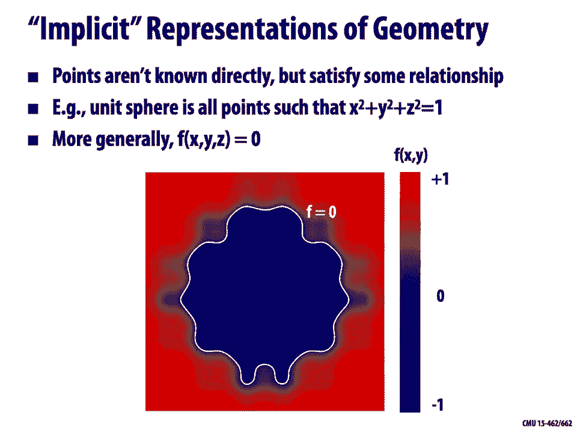

different ways to express a function，and for that reason there are many。

different implicit representations that，are used in computer graphics。

algebraic surfaces constructive solid，geometry level set methods blobby，surfaces fractals。

we'll actually see a bunch of these，later okay but before getting into，any particular representation。

let's play a couple of games that help，us understand，the pros and cons of this way of，thinking。

okay so we're going to play this game，where i think of an implicit surface。

okay so i have some function in my head，some function f，that describes my shape i know wherever。

that function is equal to 0，that's where the surface exists，and i would like you watching this video。

to please，read my mind and find a point on this，surface please just。

shout out in front of your computer，screen the coordinates for some。

point that satisfies the equation that，okay so you did it you found a point or。

or did you give up there wasn't really，much to go on there，right so actually the function i was。

thinking of is the simple function，f of x y z is equal to x minus 1。23。

so where is this function going to be，equal to 0 it's going to be equal to 0，for any point。

whose x coordinate is equal to 1。23，and so that's going to describe a plane。

that's shifted along the x-axis from the，origin，right okay so what。

what was the point of doing this the，point is，that working with implicit surfaces，makes some tasks。

hard if i just have a black box function，f，and i know nothing else about it it's。

really really hard to even find，or name a single point on the surface。

right so if i want to draw the surface，let's say i wanted to draw the surface。

by just sampling a bunch of random，points on the surface，and plotting them on the screen this。

would be really hard to do，with an implicit representation，okay but implicit surfaces are。

not useless let's play a different game，that hopefully helps us understand。

where they're valuable right so we're，going to play a game，this time i have a different surface in。

mind i'll tell you this time this this，time the surface is，f of x y z is equal to x squared plus y。

squared plus z squared minus 1。okay so you should know what that is，that's a unit sphere。

because when f is equal to zero i'm on，the sphere i want to see if a given，point is。

inside the sphere right，so in particular i would like you to，please check is。

this point three-fourths one-half，one-fourth，inside the unit sphere or not，calculation。

okay all you had to do here pretty，straightforward is，square the three entries so we get 9 16。

plus 4 16 plus 1 16。 we add them up，and we get 7 8 and 7，8 is less than 1 so the function，evaluates。

to a negative value yes we know，that we're inside the sphere，right really really easy so implicit。

surfaces make other，tasks like checking if we're inside or，outside the surface。

incredibly easy that's nice that seems，like a useful，okay now let's look at the other side of。

the coin so let's look at explicit，representations of geometry，so in this case all points are given。

directly in some way so，so for instance if we look at again at。

the sphere rather than x squared plus y，squared，plus z squared minus 1 is equal to 0。

we'd have a formula like this we'd say，okay for all values u and v。

where used between 0 and 2 pi and v is，between 0 and pi，cosine u sine v sine u sine v and cosine，v。

is a point on the sphere，it's explicit because i know immediately，plug in。

any valid valid value of u and v，and it'll spit out a point on the sphere，okay。

more generally we can think of explicit，representations or explicit functions，this way。

if i want to describe a surface in，three-dimensional space，then i have some function f that takes。

two parameters u and v two three，coordinates x y and z，in general i might not just have one of。

these functions to describe the shape，but i might have，let's say a collection of such functions。

so if we think about a triangle mesh for，instance，right and we think about barycentric，coordinates。

then what we really have is one little，map f for every triangle。

that says if i plug in my barycentric，coordinates，what are the xyz coordinates in space。

okay so that's one simple example in，general there are lots of different。

explicit representations of geometry and，graphics，there are triangle meshes polygon meshes。

subdivision surfaces nurbs point clouds，we'll talk about these in a bit but，first let's play a game。

so i'm going to give you an explicit，surface，and i would like you to sample some。

points on this surface，okay so in fact it's going to be the，same one we saw before。

my surface is this plane my explicit，expression for this plane，is f of u v is 1。23。

u v so please in front of your computer，as loud as you possibly can。

okay so hopefully it was a lot easier，this time around all you had to do。

was pick any number you like for you and，any number you like，for v and you got points on the surface。

right so we can see that explicit，surfaces，really make some tasks very very easy if。

i just want to sample points on the，surface to plot it，no problem i plug in some parameter。

values i get those points i draw them on，the screen，all right so let's play one last game。

so this time i have a another explicit，surface，f as a function of u and v and i would。

like you to check，this，surface so in particular my surface is，f of uv is equal to 2 plus cosine u。

cosine v，2 plus cosine u sine v sine u which，describes，a taurus and what i want to know is，point，1。

96 minus 0。39 0。9，is that point inside，the torus，okay this was something that was really。

easy to do with our implicit surface but，this time，it's really not so obvious how you would，do this。

i can't just plug something in right i，have three numbers and i only have two，parameters。

maybe i can try to solve for a u and a v，such that i get these three numbers but。

what if that's not possible，right that would only be possible if，it's sitting right on the surface。

so actually turns out for this example，it just happens to be the point is。

not inside the taurus okay it's pretty，hard to see，and so what we get from this is that。

explicit surfaces，make other tasks hard like inside，outside tests。

right so for implicit surfaces they were，hard to sample，but easy to check if you're inside or。

outside for explicit surfaces，it was super easy to sample but really。

hard to check for inside or outside，and so the conclusion that we can draw，from this little。

thought experiment is that well some，representations work better。

than others depending on the task right，also different representations will be。

better suited to different types of，geometry，so let's actually take a look now at。

some common representations that are，used in computer graphics，so going back to implicit。

representations one of our most basic，ideas we've seen a couple times now is。

to think of a surface as a zero set of a，polynomial，in the three coordinates x y and z。

so we've already seen the example of a，sphere x squared plus y squared plus z。

squared is equal to one，if we work a little harder we can figure，capital。

r is the outer radius and little r is，the inner radius，we can look for points x y z such that r。

minus square root x squared plus y，squared squared plus z squared is equal，to little r squared。

and if we work really really hard，actually i have no idea how somebody，figured this out。

but if we want to draw this kind of，balloon，heart shape well we can look for points。

x squared plus 9y squared over 4 plus z，squared minus 1 cubed equals x squared z。

cubed plus 9y squared z cubed over 80。that's that's obvious right。

no not at all right really really hard，to cook up these，implicit functions and what if we want。

to work with more，complicated shapes things that aren't，just a simple sphere or taurus or。

heart even right it's very very hard to，come up with，polynomials that describe these more。

complicated shapes，maybe there's an algorithmic procedure，to do it right but it's not something。

you're going to do by hand it's not，the way you're going to directly model，these shapes。

so there are other ways we can build up，implicit descriptions，one really popular one is something。

called constructive solid geometry，and the idea is to build up more，complicated shapes。

using boolean operations so let's say we，already have some，very basic shapes like spheres and。

cylinders and tori and so forth，we're going to take those shapes and do，things like。

take a union or an intersection，or a difference and so that already adds。

some nice complexity i can carve out a，piece of a sphere from the cylinder for，instance。

and if i want to take this idea even，further i can start chaining together。

expressions one on top of the other and，i get this kind of tree。

of boolean operations that describe my，shape，right so i could union together three。

cylinders to get this，kind of triaxial figure and then i could。

take the intersection of a sphere and a，cube to get kind of a rounded cube。

and then i could subtract these three，axis from my，rounded cube to get this final shape。

okay so this doesn't let me model very，organic looking things but it is good。

for modeling kind of hard，edged machine parts which is something，that people really do。

with boolean operations if we want to，make things a little more organic a，little softer。

then instead of booleans we can，gradually blend surfaces together。

right so here i have these two spheres，and，as they come closer together rather than。

doing a hard union，i'm having them kind of attract each，other a little bit it looks like a water。

droplet merging together maybe，how do we actually do this this is maybe，easier to understand。

in two dimensions okay so，let's think of an implicit function，given by a gaussian so if we have a。

gaussian phi sub p，of x equals e to the minus x minus p，norm squared。

that's giving us a kind of a bump，centered at the point p，right it falls off to zero as we go。

further and further away from p，and then we can take a sum of two，gaussians。

centered at different points so，something that looks like，this okay our implicit function。

is actually going to be this f minus a，constant，right so wherever the sum of these two。

gaussians is equal to the constant，we're going to get some curve and we can。

visualize that by imagining we，slice the height function f，by different constants point five point。

four point three，and what do you notice if you if you，look at where this。

white plane intersects these blue bumps，what happens to these curves as we，change。

well it looks a lot like our image up，above initially we have these。

two circles that are distinct and，separate，and then as the plane moves down there's。

this moment where they meet，and as we move it further down we get，this kind of peanut shape。

where they're starting to merge together，right so that's a good way of thinking，about。

how these blobby implicit surfaces work，except，we might be starting out in three。

dimensions and you can imagine this，sort of height function is in four，dimensions right。

in general we might not want to just mix，together points but we，and。

a useful object is the distance function，associated with that shape so the，distance function。

just gives at each point of space the，distance to the closest point on the，object。

using these two distance functions we，can blend together lots of different。

shapes we could take a square，and a circle and we could combine them。

in some way to get a blend between the，square and the circle，with a similar strategy to what we just。

did for points a lot of different，possibilities for what functions we use，for blending。

a simple one is well we just plug this，distance into a gaussian。

we sum up the gaussians just like we did，before and we subtract off。

a constant maybe one half the appearance，of the blended shape is going to depend。

on just how we combine these functions，okay and just as a little thought，exercise。

let's say that we didn't want a smooth，blend but we went，want to go back and just have a hard。

boolean union of these two shapes，so how might you combine their distance，functions。

well one simple thing you could do is，you could just take at each point x。

the minimum distance to either of the，two shapes，right so f x is min of d1 of x d2 of x。

so if x is a point on either of the two，shapes，this is going to be equal to 0 right if，x is on。

shape 1 d1 of x evaluates to zero if x，is on d2，d2 of x evaluates to zero so you know。

that you're going to get the zeros of，both of those shapes actually in this。

particular case something，especially nice happens and the minimum。

of the two distance functions for these，two separate shapes actually gives you。

the distance function for，the boolean union of those shapes okay。

so this is something you can do to build，up more complicated geometry。

start out with a bunch of simple。

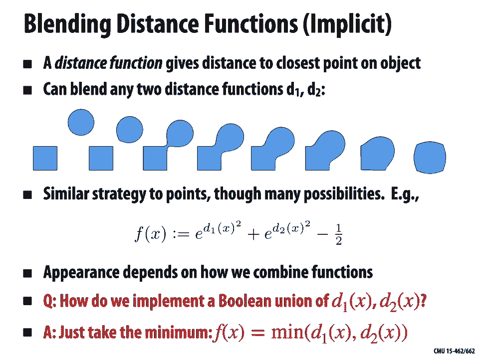

components blend them together combine，them in various ways。

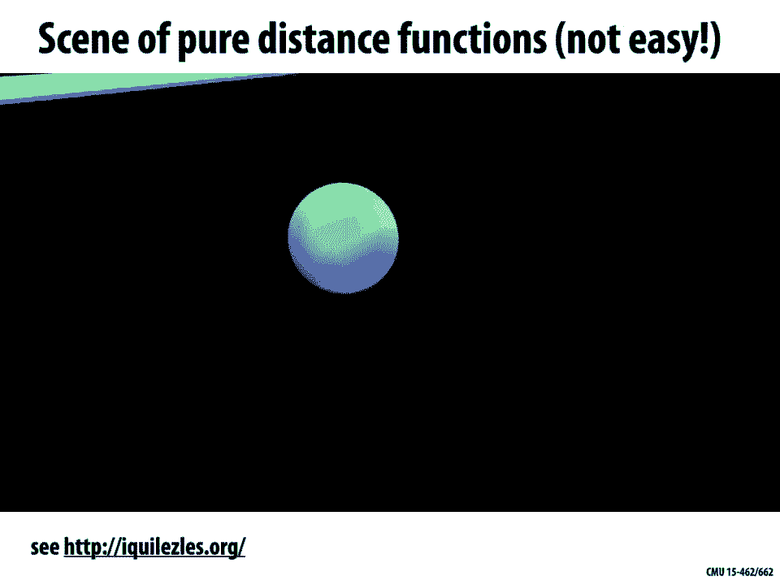

and if you're a real real expert at this，you can，use this idea to build up some really。

amazing geometry this is a，video made by somebody who's a super，expert in this idea of distance。

functions，and blending and combining them together，and you can see kind of the progression。

as more and more shapes are added and，combined，we start to get this interesting。

character bouncing around this kind of，strange looking world，okay but this is not i would say how。

most people would approach，describing geometry it's really hard to，cook up。

beautiful looking stuff by combining，formulas and writing this。

all out explicitly that being said there，are，still other ways to use implicit，descriptions of shape。

to model some very complicated，geometric objects so we've seen that。

implicit services have some very nice，features like they have this nice way。

of merging and splitting and maybe，smoothly merging and splitting different，shapes。

but it can be really hard to describe，complex shapes in closed form。

so an alternative is rather than using a，formula to describe our implicit。

function we're going to use a grid of，values，that approximate the function that we，want to draw。

so here we have a grid of values where，some are negative some are positive。

right and the surface is found wherever，the interpolated values are equal to，zero。

so you can imagine maybe you bilinearly，interpolate these values，the points where those interpolated。

black，provides，much more explicit control over the，shape this is a lot more like a texture，map。

you could really imagine going in and，painting with some kind of interesting，brush。

right some brush that's positive inside，and negative outside，or vice versa to draw implicit。

shapes of course，no representation is perfect and there，are definitely some drawbacks with this，one。

the biggest one relative to these closed，form expressions we were just looking at。

is that you run into problems of，aliasing right you've now sampled your，geometry onto a grid。

if your grid is not fine enough or if，you have very very high resolution，features these might get。

lost or you might have to do，sophisticated，sampling and filtering to reconstruct。

the shape in a nice way。

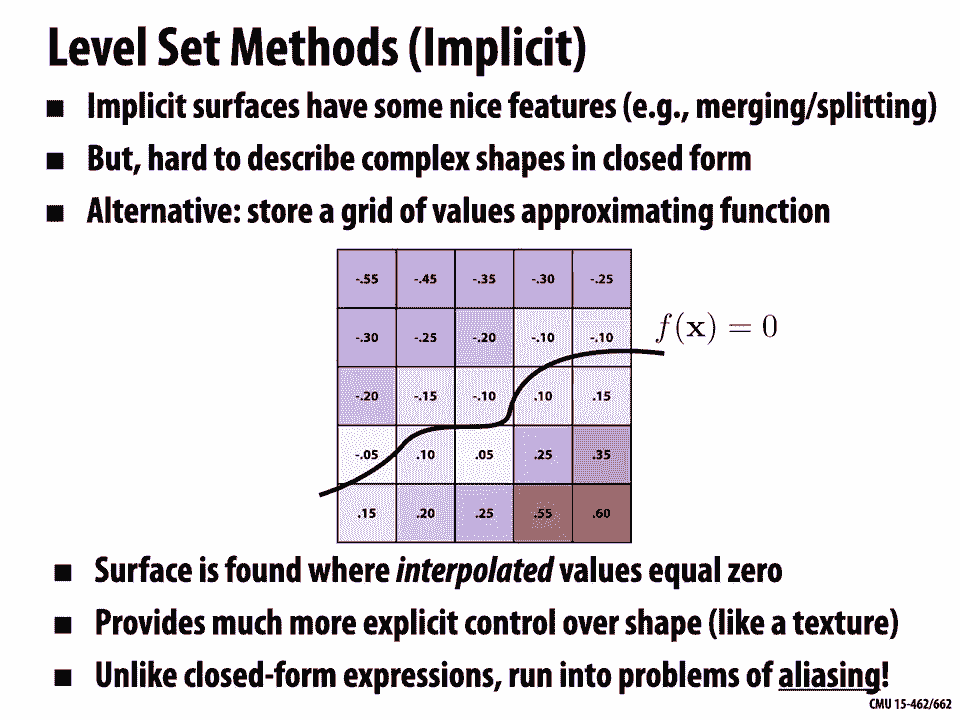

that being said these grid based level，sets are extremely important for。

lots of real world problems for instance，if you have medical data，ct or mri then。

level sets regions of constant，value might describe let's say constant，tissue density。

so this would let you extract things。

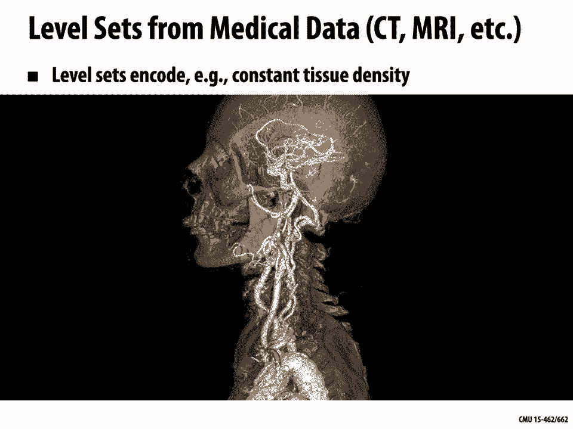

other，important features from a medical scan，level sets also show up in physical，simulation。

so one common example is you want to do，fluid simulation and so you have a level，set that describes。

where is the air and where is the water，maybe it's negative inside the water and，positive。

in the air and where that function is，equal to zero is exactly where the。

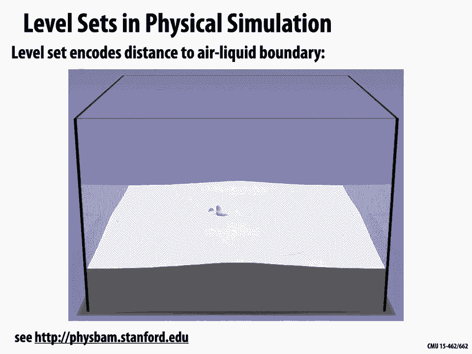

surface of the water should appear lots，of beautiful examples there。

another big drawback of working with，these explicit grid based level sets。

is boy now you have a lot of storage，right before if i just need to store a。

sphere or a cylinder or a torus okay，this is just a tiny tiny amount of data。

in the case of a grid i'm storing you，know order n cubed pieces of information。

and this is really costly not only for，storage but also for computation for，simulation。

like that fluid we just saw so a common，thing to do is to dramatically reduce。

the cost by storing just a narrow band，of grid cells around the surface so you，use some kind of。

sparse data structure that doesn't，actually need to store values everywhere。

okay very different implicit，representation of geometry is，a fractal actually i would say there's。

not a great，precise definition of a fractal but what，people noticed over time if you。

look especially at nature a lot of the，model，might have self-similarity and lots and，lots of detail。

at the，coastline of a continent，from up in an airplane or you come down。

to the ground or you zoom in with a，magnifying glass，you might find that you have these very。

very intricate kind of details at all，different scales，or you can find even plant life so this，is a。

kind of broccoli that has these，recursive，self-similar details in it so there were。

some people who said hey this is kind of，a new language for describing。

natural phenomena in terms of this，self-similarity in terms of this fractal。

structure and you can get a lot of，beautiful detail，out of this so the picture on the far，left is a。

synthetic fractal but the downside is，generally，it has a shape that's really really hard，to control。

these fractals are described in terms of，very specific，mathematical formulas and it's not。

really clear，how to bend them into the shape that，you're interested in。

okay but there's still a really terrific，and really beautiful example of implicit，geometry。

maybe the most classical version is，what's called the mandelbrot set。

so how this works is you look at the，plane，and you say for each point c in the，plane。

i'm going to decide does this point，belong to the shape，or not that's the whole idea behind。

implicit representations right we have，some tests，to check is this point in the shape or。

is it not in the shape，so here what we're going to do is we're，going to take our point in the plane。

and we're going to run it through a，process，to check is it in the shape so we first。

look at the angle theta that it makes，with a horizontal，we double the angle and get a new point。

then we square the magnitude so if the，magnitude's two，now it's four okay then we add back in。

the original point c，and we repeat this process，we repeat this process over and over and，over again。

or we can look at this a lot more simply，if we write this down using complex，numbers。

right we said complex numbers let us，easily talk about rotation and scaling。

it's kind of perfect here，we just say we take our initial point，which i'll call。

z right now think about my current point，as a point z in the complex plane。

and i'm going to replace that with z，squared plus c so just square。

it add c square it add c over and over，and over again，okay how do i know if a point is in the。

mandelbrot set or not，well here's the criterion we just say if，the magnitude。

remains bounded if this point doesn't，zip off to infinity，as we keep iterating this process then。

the point is in the mandelbrot set，so to make this more explicit let's say，we start。

at the point zero one half，and we start iterating this process well，of。

spirals inward and it has this，convergent point，and because it didn't go off to infinity，point。

is in the set we could also have a point，like this，0 1 that actually just goes back and。

forth and back and forth and back and，forth，it never converges to a point but it。

also doesn't zip off to infinity so，okay sure that's in the set two and then。

we have a point like this one one third，one half，and okay it spirals around for a little。

while but eventually it zips off toward，infinity，okay how do i draw a picture of this。

well i could just draw，the points that are in the set as black。

and the ones that are out of the set as，white，or maybe i could color these points。

according to how long did it take before，they zipped off to infinity。

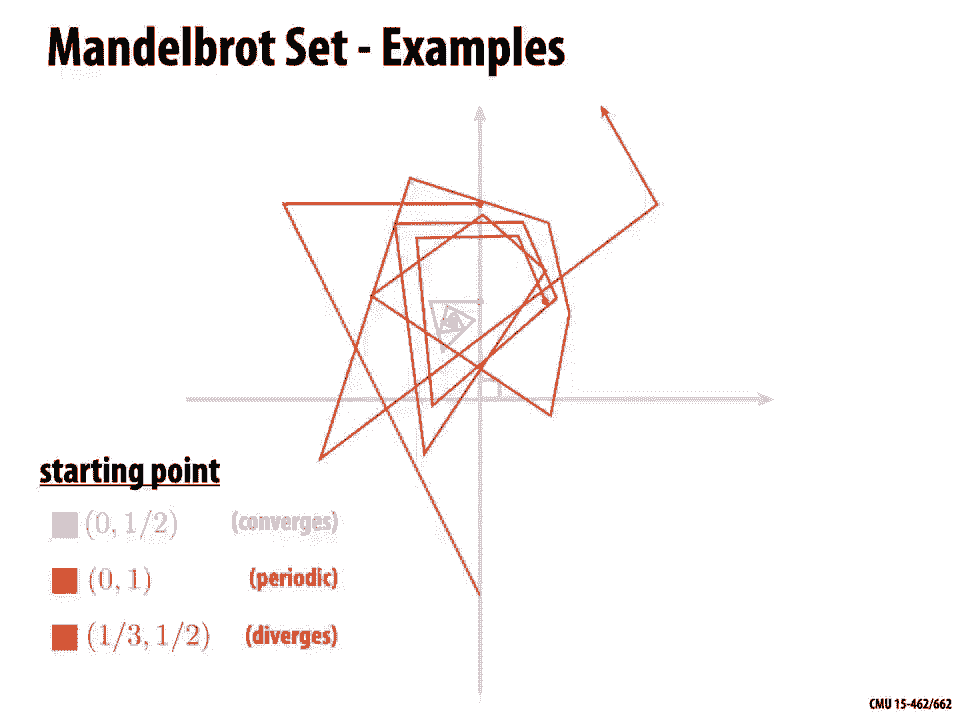

and if you do that you get these，absolutely beautiful，images of this set so here we're drawing。

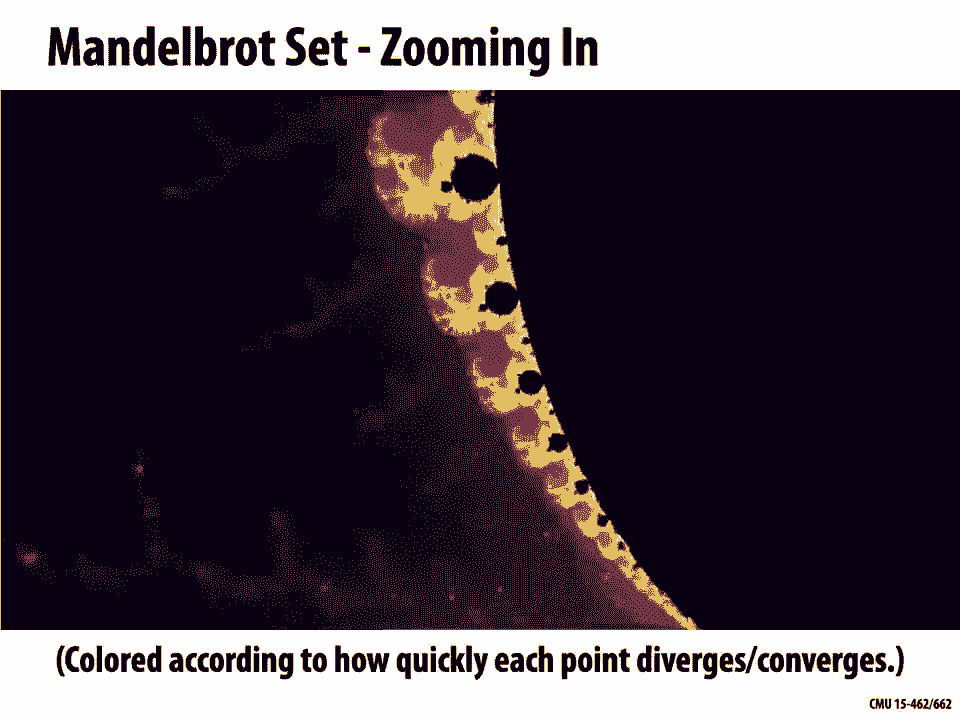

the mandelbrot set and we're just，zooming in，to some region of the plane and what's。

absolutely remarkable is that this，really really simple，process or equation z squared plus c。

right all we're doing is iterating z，squared plus c and yet this phenomenal。

complexity comes out of this，this process right just this absolutely，stunning and gorgeous。

imagery comes from some stupidly simple，iteration why is that true well。

because nature is amazing i mean that's，okay and you can see we've zoomed in now。

the scale is 10 to the minus 50 and we，so over time people have come up with，other kinds of fractals。

just beautiful evolving fractals this is，one called，an iterated function system and the cool。

thing about this is it was，developed by a cmu alum scott draves in，fact。

if you walk around gates hillman center，you'll see a display，that shows some of these up on the wall。

so just really beautiful stuff all right，so overall what are some pros and cons。

of implicit representations，one basic pro is that we may have，descriptions that are very compact。

right if we're describing let's say a，mechanical part we might just have a few。

polynomials and a few boolean operations，it's very easy to determine if a point。

is inside or outside our shape we just，plug，the coordinates into our implicit，function and see。

is it positive or is it negative other，queries may also be easy to do we might。

easily be able to get the distance to，the surface which is useful if we're。

trying to let's say avoid collisions，or at least get a good estimate of the，distance to the surface。

four very simple shapes like spheres and，torai and so forth，we have a completely exact description。

of the shape there's no sampling error，we don't have to think about aliasing。

we really sidestep a lot of the issues，that we normally encounter，or we can go to a grid-based。

representation okay now we have a bigger，storage cost we have to deal with，aliasing。

but we can talk about very intricate，geometry，like a fluid splashing around and a。

a pro in general about these implicit，representations is they make it really，easy。

to handle changes in topology like two，droplets merging together，or a thin sheet breaking up into。

droplets，how about some cons well for one thing，as we saw it's very expensive very very。

difficult to find，all the points in the shape if we want，to draw it on the screen。

and it can be very difficult to model，complex shapes，at least if we stick to these really。

analytic closed form，representations okay all right，so let's now move to explicit，representations。

what are some specific examples so the，most basic one as we mentioned is a，point cloud。

a point cloud is the most dead simple，thing you could do when you're trying to。

communicate a shape to somebody，you just say here's a list of points。

that are in the shape i'm going to give，you a big long list，all these points are in the shape it's。

not exhaustive，right how many points are in a sphere，you a，dense sampling of points in the shape。

we can also attach other data to these，points often，we might also provide a normal direction。

you could also put in colors or other，attributes，what are the good things about point。

clouds well for one thing，you can definitely represent any kind of，geometry you want this way。

right every every piece of geometry is，made up of points so just give me some，of those points，the。

shape then it's easy enough to draw a，nice picture i just，splat all those points onto the screen。

but on the other hand，if i have regions that are under-sampled，if i have only a few。

sparse samples of the surface like we，see at the bottom of the statue on the，right。

then i have to think about okay how，should i，fill in the gaps how do i draw this in，some nice way。

and so there you know it's not clear，that this is a huge win，over using something like triangles it。

also becomes，harder to do processing or simulation，where you need to understand。

how is each point connected to other，points，so this is kind of a good maybe input。

format good for certain kinds of，visualization，but won't let us do all the things that，with。

significant additional effort okay，another representation that's very。

common perhaps the most common in，computer graphics and one，that we'll talk about a lot are polygon。

meshes，so the basic idea is to store not only，points not only vertices。

but also some kind of connectivity so，polygons that connect up these points，and usually。

these are triangles or maybe they're，triangles mixed with quadrilaterals and，other polygons。

why is this a good representation so for，one thing，it's a lot easier to do processing and。

simulation every，point every vertex knows kind of where，its neighboring points are。

we don't have to do any additional work，to figure that out，it's possible to do an adaptive sampling。

of the surface，right so i can put detail only where i，need it if i look at this。

cylindrical surface with these spherical，end caps，what you notice is i can put lots and。

lots of detail on the end caps where i，have a lot of curvature。

and in the middle i can just connect it，up with these long skinny triangles。

right so i can put information really，where it's needed，the downside is well the data structures。

get more complicated，we don't just have a list of points，anymore but we have to think about how。

do we encode the connectivity，how do we talk about neighborhoods and。

so forth and we'll really get into that，a lot，especially in our next few lectures，another complaint。

some people might have about meshes is，that you have kind of irregular。

neighborhoods in your mesh when it comes，to writing，code it's not as simple as an image in。

an image you have a pixel to your left，to your right above and below。

in a mesh there's lots of possibilities，of things that can happen so this makes，things。

a fair bit more complicated although，we'll talk about in our upcoming。

lectures how to make some simplifying，assumptions，that make polygon mesh processing a bit，easier。

so to give a explicit example，of a polygon mesh we can talk just about，a triangle mesh。

where we store the vertices as triples，of coordinates x y and z。

and so we really just again have a point，cloud of vertices，but then we also have triangles which we。

store as triples，of indices into our vertex list，okay to make that clear let's say we，want to encode。

the four triangles on the boundary of a，tetrahedron，then we might have a list of vertices。

like this right four，vertices with coordinates x y and z，and then we have our triangle list which。

says okay we have four triangles，the first triangle connects vertex 0 2，and 1。

 the next one connects vertex 0 3，and 2 and so on by the way the fact that。

they're the same number of vertices and，this is，just something about the tetrahedron in。

general we can have a different number，of vertices and triangles。

okay what are we really saying what are，we how are we，interpreting this data to describe a。

surface what we're really saying，is once we know the location of the，vertices of each triangle。

we can just use barycentric，interpolation to kind of fill in，the rest of the triangle okay so if i。

have a triangle，with vertices pi pj and pk，then i can imagine that triangle is，actually the image。

of some standard reference triangle，which is the set of all points in three。

dimensions that satisfy the，barycentric coordinate conditions the，three values sum to one。

and they're all greater than zero okay，and the map that takes me from my，mesh。

is just this simple linear map it's a，linear combination，of the three vertices pi pj and pk。

by the three barycentric coordinates fi，vj，and phike okay so in some very loose，sense。

you can imagine that a triangle mesh is，kind of a linear interpolation。

of a point cloud we have these points we，know those are on the surface。

how do we get the surface while we，linearly interpolate，so remember that in 1d linear。

interpolation of two values f，i and fj just means i have a parameter，that goes between，0 and 1。

 i do 1 minus t，times the first value fi plus t times，the second value，fj if we're close to zero。

we get a value close to five if we're，close to one we get a value close to fj。

and one way we thought about this linear，interpolation process was as a linear，combination。

of two basis functions so what i'm，really doing is i'm taking，that function on the left one minus t。

and i'm scaling it up and down according，to the，magnitude of fi and i take the second。

basis function t，i'm scaling it up and down based on the，magnitude of f j and then i'm summing up。

those two functions，and that's giving my me my linear，interpolation that's。

effectively what i what's happening when，i'm drawing a triangle，right i have these linear basis。

functions these barycentric，basis functions and i'm using the，locations in space as coefficients for。

those functions，and so that leads to a natural question，why should we limit ourselves to。

just linear basis functions right what's，special about linear can't we get more。

interesting geometry than flat triangles，by using other bases okay so let's look，at this first。

in 1d so linear interpolation，essentially uses，first order polynomials in 1d。

we can provide more flexibility by using，higher order polynomials，basis。

1 x x squared x cubed right we're not，going to write，a plus b x plus c x squared plus d x，cubed。

instead we're going to express our，polynomials in something called the，bernstein。

basis okay so just a different set，of basis functions they look like this。

not so different in spirit from the two，linear basis functions we saw in the，previous slide。

and they have a pretty straightforward，definition so i say，the bernstein polynomial b of degree。

n well there are n plus one of them from，zero up through n，at any point x to evaluate this。

polynomial i do n，choose k times x to the k，times 1 minus x to the n minus k。

okay so there you go you have some funky，expression for the bernstein basis。

why is this useful why do i want to do，things this way，well the picture kind of gives you a。

sense of why this is a good thing，if i want to adjust the height of my，function。

at the left endpoint i just adjust the，coefficient for，b03 if i want to adjust the。

height of the function at the far right，i adjust the coefficient for b33。

and similarly the other basis functions，really，kind of control the height in some。

region of the interval，this is not true in my standard basis。

if i have a plus b x plus c squared plus，d cubed，it's not really clear what the effect of。

adjusting a b c and d，is right and so this makes，bernstein polynomials a good choice。

for building up bases for things like，curves and surfaces，i can adjust the coefficient for one of。

these bases and it，has some real meaning i'm i'm playing，with this region of the curve。

or this part of the surface as a，specific example a bezier curve。

is a curve expressed using the bernstein，basis，so now rather than scalar values f i i，have points。

p k which could be points in the plane，let's say，and i'm just going to take a linear。

combination i sum up over all the，bernstein，bases that basis function times the，control point。

the control point is a vector but the，bernstein polynomial is still just a，scalar。

for each s okay and we can choose the，degree，of this curve by picking the degree of。

these polynomials so if i just use the，first order bernstein bases i get just a。

linear curve a line segment if i use，cubic bernstein polynomials then i get，what's called a cubic。

bezier curve that looks like this blue，curve on，the right okay so this blue curve is the，curve i get。

by interpolating the four points p0 p1，p2 p3，using the bernstein polynomials。

these bezier curves have some very nice，properties，for one thing they exactly interpolate。

the endpoint，right they actually pass through p0 and，p3，they are tangent to the n segments。

so i know that the curve at the，beginning will be tangent to the segment。

p0 p1 and the curve at the end will be，tangent to p2 p3，and also really nice property they're。

contained in the convex hull of the，control points，so you can see that the blue curve is。

contained inside this blue，quadrilateral this actually turns out to，be really nice for。

lots of things like rasterization if i，want to rasterize，a bezier curve then i really only need。

to consider the region，covered by this quadrilateral okay，so this is great i can draw a really，nice。

curve with four control points if i want，a curve with，more control points what should i do。

i think a natural idea is okay just keep，going if i，want to have more points i just increase。

the degree of，the bernstein basis so if i want 10，points，right i use 10th degree polynomials。

actually this is not a great idea，because even though the bezier curves。

will interpolate the two endpoints they，only approximate the intermediate points。

right so even if i have this black，control，polyline that goes back and forth many。

times i only get this very slight，wiggling，of the interpolated curve so this makes，high degree。

bezier curves very hard to control，what we often do instead is to just，piece together。

many low order bezier curves and this is，in fact exactly what's happening anytime，you see，like。

illustrator or inkscape it's also how，svg files represent curves it's also how。

every single character of text，on your screen is displayed every piece。

of text is broken up into these little，bezier curves a bit more formally we。

could write our piecewise bezier like，this so gamma of u is the whole curve。

we have some parameter values u sub i，along the curve，which break it up into the individual。

bezier pieces these，parameter values are sometimes referred，to as knots in the curve。

and when we want to evaluate the curve，we just figure out okay。

which two knots is the current parameter，value between，maybe it's between ui and ui plus one。

and then we convert，that parameter value for the whole curve，into a local parameter value。

between 0 and 1 for just the single，piece，okay so there are a couple things we。

have to think about when we start，piecing together these curves。

if we want the whole curve to look nice，in particular if we want to get。

kind of smooth seamless curves we need，the points and the tangents，to line up so for one thing。

the endpoints of one piece of the curve，have to agree with the endpoints of the。

next piece of the curve，otherwise we'll just get a gap we'll get，a discontinuity。

even if the endpoints agree we can get，these kind of sharp kinks in the curve。

if we don't think carefully about how，the tangents look，and so often we'd really like something。

like this，something where both the endpoints and，the tangents match and we get this。

nice seamless transition from one piece，to the next，okay sounds good but how do we do that。

well let's，think about this in terms of the actual，polynomials，so let's say we have a collection of。

cubic bezier curves each each piece of，our curve is cubic，right so we have u cubed times the first。

control point p 0，times 3u squared times 1 minus u times，the second control point and so on。

and we'd like the endpoints of our，segment to meet，and we'd like the tangents of the。

endpoints to meet，so the very first thing we should ask，ourselves is。

is this always possible if i have these，two cubic bezier curves，can i always make them meet with the。

same，endpoint and the same tangent so a good，way to think about this is to start，counting。

how many constraints do i have how many，conditions am i trying to satisfy。

and how many degrees of freedom do i，have how many variables。

right so let's think about this for this，cubic curve here how many degrees of，freedom do i have。

well i have these four endpoints p0 p1，p2 p3，right and we have to be a little bit。

careful when we count degrees of freedom，for problems involving points and，vectors，freedom。

or since each of those points has two，coordinates，do we think of it as eight degrees of，freedom。

okay so when thinking about this kind of，question，it's good to be careful to distinguish。

between scalar degrees of freedom and，vector degrees of freedom。

okay how many constraints do we have in，this case，well in some sense we just have two。

we want n points to meet and we want，tangents to meet，okay but each of those is a。

vector condition right the two，components of the endpoints have to both。

agree the two components of the tangents，okay so with that in mind let's ask the。

question again let's say i have，just two cubic bezier curves，and i want them to meet。

at one of their endpoints with position，continuity and tangent continuity。

can i always do this can i always put，the control points somewhere so that，this happens。

well sure right i have four，vector degrees of freedom i have two。

vector constraints i have more degrees，of freedom than，i have constraints life is good。

what if i want to make this a little，harder let's say i want to make a closed。

loop out of these two segments，so if i have a segment a b and a segment，cd。

i want b to agree with c and d to agree，with a，will this still work out well，freedom。

eight vector degrees of freedom and i，also have，eight vector constraints。

right because for each curve for each of，its two endpoints，i have two conditions okay。

and that kind of also tells you that if，i have a big closed loop。

of lots of cubic bezier segments then i，can always make them meet up。

with position and tangent continuity i，can always get a fairly nice smooth。

curve right could you do this with a，quadratic bezier curve，could you do this with a linear bezier。

curve，well i think hopefully it's pretty clear，that you can't because we said we had，exactly。

the same number of degrees of freedom as，constraints，we，reduce the number of degrees of freedom。

we can't get this，nice continuity anymore so that's maybe，one argument for why。

you might like to use cubic bezier，curves because you can at least get。

tangent and position continuity okay so，that's great we can get，higher order curves how about higher。

order surfaces，well one way we can do this is to kind，of，bootstrap our surfaces using our curves。

so we can use a pair of curves，to get a surface actually let's just，start by talking about。

a scalar function so we can construct a，scalar function，whose value at any point u v is given by。

a product of a curve f at u and a curve，g at v okay，so at any point uv。

the value of my function is just f of u，times g of v this is，called a tensor product very fancy name。

for a very very simple idea，and you can kind of see that this tensor。

product captures the behavior of the two，individual curves，f and g okay。

so if we now instead of using just，scalar values f and g we replace these，with。

vector values points in space we can get，what's called a bezier patch，so a bezier patch is a sum of。

tensor products of bernstein bases，okay so here were our one-dimensional，bases。

our tensor product bases are going to，say okay，basis i j at any point u v is just。

basis i at u times basis j at v，we can plot these spaces for all of our，cubic。

functions we get 16 of them and what you，notice about these，little basis functions is they give us。

the same，notion of local control right one of，these，bases b30 kind of controls how how tall。

the function is at one corner，b03 controls how tall it is at another，corner the ones in the middle。

control the height somewhere in the，middle okay and so，if we associate each of these 16 basis。

functions，with some control point pij in space，then we can take a linear combination of，these。

basis functions using the control points，to get a，patch of surface in space to get a，bezier patch。

very very nice looking smooth surface，right much more interesting than a flat，triangle。

okay how do we get a bigger，surface right this just gives us one，little tiny patch well。

just as we connected bezier curves，together to get a，bigger curve we can connect together。

bezier patches to get a bigger surface，so here's a i don't know interesting，looking surface。

made by gluing together all these，different patches，what's nice about this representation。

this this bezier patch or spline，representation well it's very easy to，draw。

if we wanted to draw this object，on the screen we could just dice each，patch into a regular uv grid。

we could evaluate these bernstein，functions on this grid，and that gives us the location of the。

all right but if we want the surface to，look nice we have to be careful just。

like we had to be careful with，curves to make sure that each piece met，up nicely with the。

adjacent piece so question，can we always get tangent continuity。

with bezier patches right and this is，not，super trivial to figure out you have to，sit down and。

think about this for a while okay how，degrees，of freedom do i have i want tangent。

continuity maybe where these two patches，meet what does that mean。

how many degrees of freedom do i have，and i'll tell you it's not nearly as，simple for surfaces。

as it is for curves not even close，in fact there's maybe something fishy。

you notice about this picture，did you notice anything particularly。

strange about the surface that i drew，that just happens to make that example。

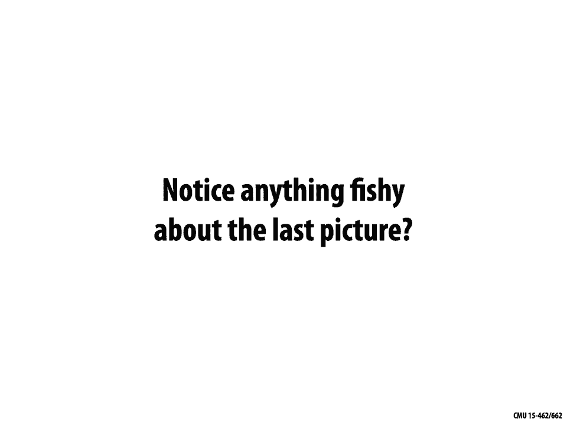

now there's something very special about，the structure of the patches that i used，which is that。

i made a surface where i could have four，patches around every vertex，okay and if you do this。

if you have this nice regular layout of，patches，then the degree of freedom counting。

works out you can get good tangent，continuity，these surfaces are easy to draw and all。

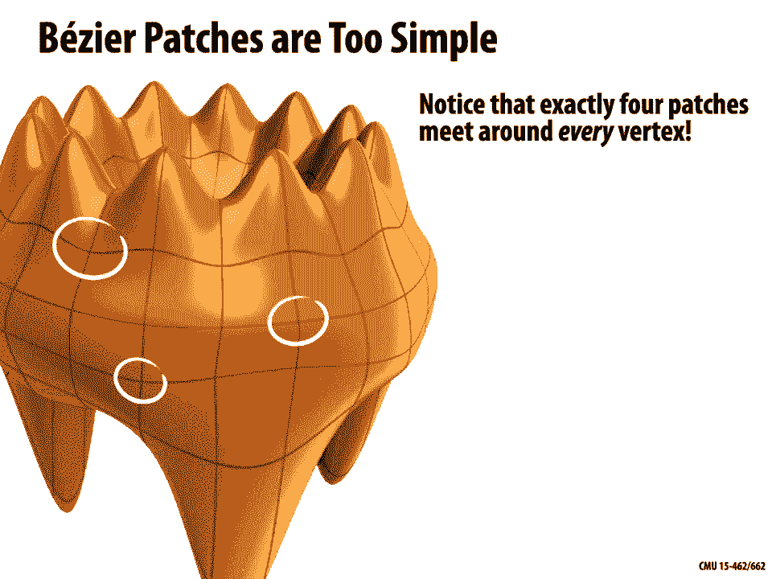

that kind of thing unfortunately，this is too constrained in practice。

to make interesting shapes with good，continuity you really need to allow。

patches with more interesting，connectivity in fact there's a theorem。

that if you have a surface that has a，spherical，kind of shape or the shape of a double。

taurus basically anything but just a，donut shape，you have to have irregular points in。

your patch layout，so for this reason people have cooked up，all sorts of alternatives。

to the basic bezier patch idea，there are nurbs patches they're gregory。

patches there are pm patches there are，polar patches，and all of these different options have。

different trade-offs，for instance how many degrees of freedom，do i have。

what order of continuity do i get how，difficult is it to edit，what's the cost of evaluation how。

general can i get in terms of patch，layout，and on and on as usual you want to pick。

the right tool for，the job so am i modeling mechanical，parts or more organic surfaces。

am i trying to do high quality offline，ray tracing or am i trying to do。

real time rasterized rendering and，there's a whole great literature on all，these questions。

there's also some very basic things that，i can't do with the，bezier curves and bezier patches that。

we've discussed，so far so one really simple thing is，the bezier curves can't exactly。

represent conics，so for instance with curves i can't，exactly represent circles。

with surfaces i can't exactly represent，cylinders and you can imagine this is a。

pretty important shape，to be able to represent especially if，i'm designing mechanical parts。

so the solution amazingly enough is to，once again，use homogeneous coordinates。

so what you can do is do the same kind，of interpolation same interpolation by。

bernstein polynomials in homogeneous，coordinates，and then do a projection back to the，plane。

to get what's called a rational b spline，if i do this then i'm。

able to represent these conics exactly，going to the surface case one of the。

representations we mentioned was，nurbs nurbs stands for non-uniform。

rational b-splines so what that means is，these，knots that we discussed can be at。

arbitrary locations not at regular，intervals that's the non-uniform part。

things are expressed in homogeneous，coordinates and then we do it divide。

that's the rational part we're taking a，and we have a piecewise polynomial curve。

that's what gives us this，b spline okay and there's some，interesting things that happen here for。

have，a specific meaning the homogeneous，coordinate w，controls the sort of strength or。

influence of a vertex，on the curve so here for example you，notice that as we adjust。

this w value this homogeneous coordinate，the curve gets pulled further。

toward or away from this middle vertex，okay and that's useful if we want curves。

that have both smooth parts and maybe，sharp kinks or creases，so how do we take this idea from curves。

to surfaces，well again we're going to do a tensor，product we're going to take a tensor，product of。

and then just as we did with bezier，curves we can，piece together multiple patches to form，a surface。

what are some pros well these patches，are easy to evaluate i plug in。

a uv value i get out a point with a very，simple expression i can exactly。

represent conics i get a high degree of，continuity，cons are well just like we saw with。

bezier curves it can be hard to piece，together the different patches while，ensuring that you have。

the continuity that you want and，similarly it can be really hard to edit。

nurbs surfaces you have lots of degrees，of freedom to manipulate。

so a very popular alternative to nurbs，is what are called subdivision surfaces。

so a completely different starting point，for curves，and surfaces is this idea of subdivision。

for curves you could imagine you start，with a control curve or control polygon。

and then you repeatedly well you，subdivide you split，each edge of the polygon into two let's，say。

and then you take some weighted average，new，vertex positions okay so that's one。

iteration of subdivision we do it again，and for a careful choice of averaging。

rule how do i take this weighted，combination，in the limit of this subdivision process。

you approach a nice，limit curve like we see here now the，really interesting thing。

is if you have a carefully chosen，averaging rule then you'll often get the，same。

curve as some of these spline schemes，that we've been talking about so，actually subdivision。

gives a different perspective on bezier，curves on b-spline curves。

right except there will be a point where，these two perspectives diverge and there。

will be things that will be easy to do，with subdivision，that are hard to do with nurbs things。

that are easy to do with nurbs that are，hard to do with subdivision，okay basic question。

is subdivision an explicit or implicit，you know honestly i think this question，is a little bit of a。

know，where the points are but i would still，say subdivision，is definitely an explicit representation。

for a given parameter value，i have a deterministic procedure that，produces。

the point on the surface right，it's not a test it's not something that。

lets me check whether a given point in，space，belongs to the shape or not。

all right just as one specific example，of a subdivision，scheme the lane reason feld scheme。

is something we can do to subdivide，curves so，what we're going to do is for each edge，we'll insert。

the midpoint and then to get our weights，without explaining really why we're，going to use row k。

of pascal's triangle normalized to 1，as weights for our neighbors so for，instance if we said。

k is equal to two then we're going to，use the weights，one-fourth one-half one-fourth so that。

those sum up to one，right and we're gonna average，the neighboring vertices to get the new。

vertex location we're gonna do that for，every vertex，along our subdivided curve the limit of。

this subdivision process，in this case actually turns out to be a，b spline。

of degree k plus one so a cubic b spline，here's what that looks like we have our。

first iteration second iteration third，iteration，and in the end we get this beautiful，limit curve。

okay subdivision surfaces，exactly the same idea we start with a。

coarse polygon mesh which is our control，cage we subdivide each element into。

some number of pieces now depending on，this，subdivision might look different we then，update the。

vertices via local averaging and there，are many possible rules there are，catmull clark。

subdivision surfaces which work with，quads quite easily there are loop。

subdivision surfaces which are natural，for triangles，but many many more common issues。

or common attributes you might look at，with subdivision schemes is。

are they interpolating or approximating，does the，new surface the limit surface actually，cage。

or does it just come close to them do we，have，good continuity at vertices do things。

kind of meet up and have a nice tangent，plane and a nice curvature。

okay why do people like subdivision，surfaces well，they're a lot easier than splines for。

modeling i don't have，all these degrees of freedom to，manipulate i don't have to control the。

tangents i just have to move the，vertices of the control cage around。

and i'll get some nice smooth surface as，a result，on the other hand it can be a lot harder。

to evaluate these，surfaces point wise if i want to just，know for a given parameter value。

what's the limit point you can do it，it's just a little more complicated and。

also you have to worry about issues of，continuity near irregular vertices so。

where more than four patches or fewer，than four patches meet in a quad mesh，for instance。

all that being said subdivision surfaces，are extremely popular in computer。

graphics they're used all over the place，by companies like pixar。

where they really got their start and，have even been honored at the。

academy awards so the model above comes，from a，short film called jerry's game which is。

a movie by pixar and was one of the，very first uses of subdivision in。

film so there's a nice article by tony，derose and others，talking about the motivation and the use。

of subdivision，in animation all right that's it for，today，next time we're going to take a deeper。

dive into curves and surfaces，and the mesh data structures that we're，really going to work with。

in this class to play around with。

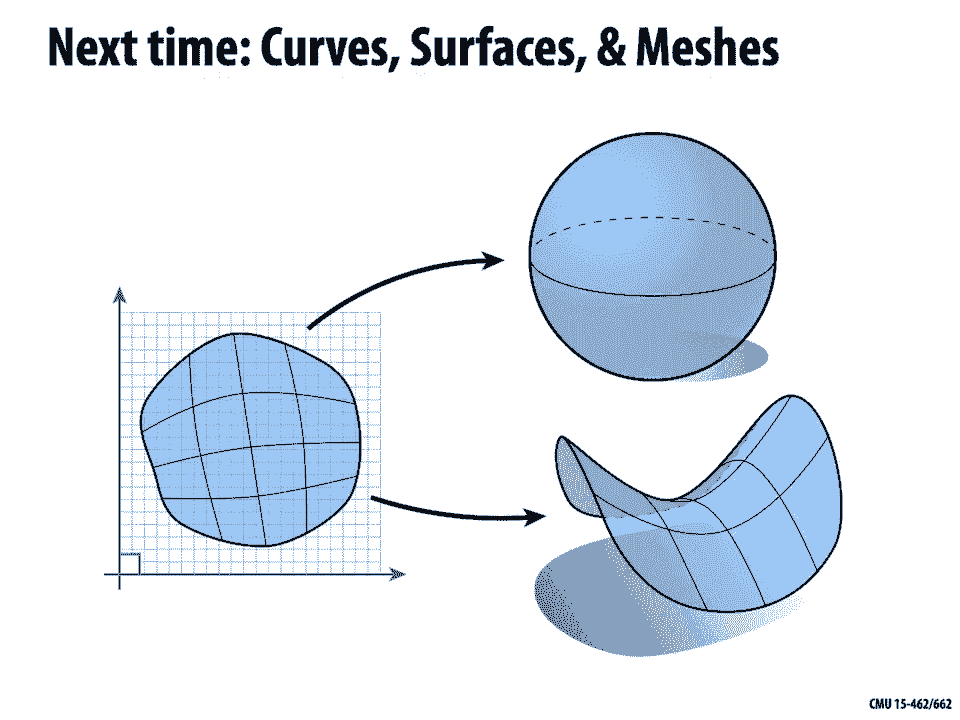