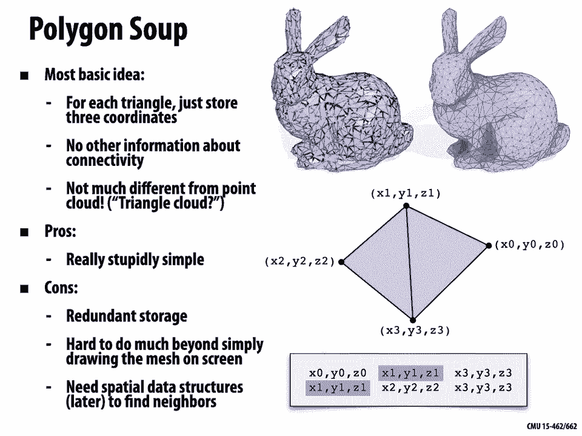

# 【双语字幕+资料下载】CMU 15-462 ｜ 计算机图形学(2020·完整版) - P11：L10- 网格和流形 - ShowMeAI - BV1Pf4y1E7GJ

[Music]，all right，so last time we started talking about，geometry today we're going to dive。

in and talk about some of the real nuts，and bolts of working。

with meshes so remember that we saw，there are many different types of，geometry in nature。

and because there's so many different，types of geometry and so many different，possible use cases。

we really need sophisticated，representations of geometry not just。

one but actually many different data，structures，and representations we looked at two。

major categories，one was implicit descriptions of，geometry，and the basic idea behind an implicit。

representation，is it will let us test if a given point，is part of our shape the other big。

category were，explicit representations which in some，sense directly。

list points in the shape or let us，generate points，in the shape there are lots of specific。

representations for，both of these kinds of shape so for，implicit surfaces we had algebraic，surfaces。

we had level sets and so forth with，explicit，uh representations we had point clouds。

we had polygon meshes，and things of that nature okay so today。

we're going to talk a little bit more in，detail about what really is a，word。

surface and what are the nuts and bolts，of working with，polygon meshes when we really want to do。

computer graphics，so this is going to lead us naturally，into our next lecture where we'll talk。

really about geometry processing and how，we can connect，geometry and shape to some of the。

thoughts that we had earlier on，about sampling signals and aliasing，and so forth all right so one。

big assumption we're going to make when，we work with geometry，is the so-called manifold assumption。

so we're going to introduce this idea，today the idea of manifold geometry。

it can be a little bit hard to，understand the motivation at first，although it does turn out to be。

extremely useful so before diving into，the full-blown definition let's。

revisit a more familiar example let's，just go back to，two-dimensional images and remember that。

when we did rasterization，of，pixels right if i have some detailed，image on the screen。

if i zoom in far enough i noticed that，it's made up of just little blocks of。

color or at least that was our，model that was our abstraction okay。

but if we look at images in the real，world if i were to look at a painting。

and zoom far far in on that painting，well images in the real world are not，made of little squares。

right if i have a，image that's made by paint or by ink if，i zoom in i might see little，no。

little squares that's something we，did in our rasterizer，so why did we do that why did we choose。

to represent our digital image using a，square，grid i think it's something that。

you've seen so many times it shows up in，so many places on a，computer that you think why even。

question that that's just the way it is，well why is that just the way it is。

who decided that that should be the case，for one thing，there are lots of other ways you could。

tile the plane，i could tile the plane by triangles i，could tile it by hexagons。

i could tile it by a mix of hexagons and，triangles and squares and。

i could even even tile it by shapes that，are not regular，lots of different polygons at each point，so。

why why squares who said that was the，so there are a lot of possible reasons，why squares。

could be nice one thing is that，regular grids make life easy right。

simplicity and efficiency are things we，care about when we're developing。

digital representations when we're，developing algorithms，so what's nice about a regular square。

grid well，we always have four neighbors every，pixel has，a pixel to its left a pixel to its right。

above and below，okay it's easy to index it's easy to，apply filters like averaging maybe you。

have to be a little careful near the，boundary，but no big deal okay and。

storage is also easy storage is just a，big long，list of numbers i can just concatenate，the rows。

of my image into just one long array，okay what what are other reasons why。

well another really important feature of，grids of pixels is they're completely。

general in a sense we can encode any，image，we want we haven't limited the kinds of，images。

we can draw or represent by，okay so those are two things we'll look。

for when we try to come up with a data，structure we want it to be。

simple and efficient and as general as，possible，without compromising too much on。

sticking with images for a moment are，regular grids，always the best choice for bitmap images。

are there，reasons why they might not be the，perfect，well one thing you really notice looking，are。

definitely some preferred directions the，horizontal，and the vertical directions right so。

we might say that we have kind of an，anisotropic，sampling of our image certain directions。

are preferred more than others certain，edges，like vertical and horizontal ones will。

show up a bit better，than edges in different directions maybe，that's okay maybe we think okay we're。

going to be taking photographs a lot of，things that have，horizontal and vertical edges that's。

okay but in general it's maybe not，the best choice there are in fact。

some people who build computer displays，out of hexagonal pixels。

because maybe you can pack more pixels，into the same area，okay but more often than not square。

grids are，a pretty good choice and we're going to，see a similar story。

with geometry where we're trying to。

balance these different criteria okay，so let's go back to geometry how should，we encode。

surfaces well，first we need to understand a little bit，what we mean by。

the word surface what kind of geometry，is it that we're，trying to encode in the first place。

so this word surface actually has a，pretty specific mathematical meaning it，doesn't just mean。

a shape intuitively，a surface one important thing about a，surface is that it's capturing the。

boundary or the shell of an object，rather than its interior so you could，think about a。

candy like an m m it has a solid，chocolate interior it has a，thin candy shell when we say surface we。

really just mean the shell，not the solid interior，another key property of surfaces is that。

surfaces are，manifold okay so，what does manifold mean i'm not going to，be able。

in a short time to give a really precise，definition，but the right intuition is that if you。

pick any point，on your shape and you zoom in far enough，then if it's manifold you should be able。

to draw a nice，coordinate grid with two distinct，directions。

okay perfect example is the planet earth，right from space this looks like it has。

some interesting curved，shape it's almost spherical but if you。

zoom in close enough to any point let's，say you zoom in，to manhattan island then you can put a，nice。

grid at least in a neighborhood around，that point i can put the。

streets and avenues of new york city on，okay and，so when faced with this definition。

the first thing you should ask is well，doesn't that apply to every shape。

isn't every shape manifold if i zoom in，far enough it feels like i should be，able to put a little。

coordinate grid on my surface，and if you think for a minute maybe take。

a moment to think is that always true，so if you think about that for a minute。

you could cook up a shape i don't know，maybe like this one，the shape isn't manifold or at least。

it's not manifold at every point because，let's say i try to zoom in really far on，the center。

so if i keep zooming in and zooming in，and zooming in it never really changes，the way it looks。

i can never put a nice little grid on，just，two directions to go there's a more，complicated。

way in which this shape is arranged，everywhere else i can draw a nice grid。

you can see it i've drawn it，right but that center point is really，problematic。

okay so not every shape is manifold。

let's take a look at some other examples，so here's just a bunch of paper shapes。

that i picked at random，okay we've uh this kind of hourglass we，have a bunny。

we have this thing that's folded on，itself，this funny bumpy thing we have a taurus。

so which of these shapes do you think，are manifold，which of these shapes do you think are。

well we already know one of them is，non-manifold the，one we saw in the previous slide this。

hourglass shape，the other one that's not manifold is the，one in the upper right。

all right there's this place where it，looks like two，pieces of the surface have been welded，together。

and now where they meet i don't have，just two directions i can go。

up down and left right but i have a，third direction，back and forth alright so i can't put a。

2d coordinate grid，on those points therefore the shapes not，manifold。

okay the rest of these are nice and，manifold，even if i have lots of little bumps or，whatever。

or even if i have let's say the edge of，a cube，put，down a little grid okay。

obviously this is a pretty imprecise，discussion，i'm not really giving you the formal。

definition of a manifold and i won't，and part of the reason for that is that。

this becomes a lot easier to discuss，than，smooth surfaces so with polygon meshes。

it's really really easy to define what，it means to have，manifold connectivity and the mnemonic。

we're going to use，has，fans but not fins so what do i mean by，that。

so for polygon mesh we can just check，two really simple conditions。

one is that every edge of our mesh，is contained in only two polygons。

so for instance i have these two blue，polygons，every interior edge so this edge in the，middle。

is contained in two distinct polygons，we'll talk about the boundary edges in a，second，have this。

middle edge that's contained in，not two but five distinct polygons，so this is not a manifold edge。

for exactly the same reason as before if，i were to zoom in，on the edge in the blue mesh okay i can。

put down a，coordinate grid if i zoom in on the edge，second condition is about vertices。

so we're going to say that every vertex，in a manifold mesh or a mesh with，manifold connectivity。

should be contained in a single fan or a，single loop，of polygons okay。

so this blue mesh on the top i have this，center vertex，it's contained in a single loop of。

blue polygons i could enumerate those，one two three four five six seven。

up through n and then come back to one，again on the bottom i have this。

middle vertex that's contained in two，distinct fans or loops of。

polygons right this looks just like our，cone or our hourglass that we saw a，minute ago。

all right what about the boundary can we，make this a little more。

general okay well the boundary first of。

all what is the boundary of a surface，intuitively the boundaries where the。

surface kind of ends so for instance，if i have a pair of pants then the waist。

and the ankles of the pants are what i'm，going to call the boundary。

okay what does it mean for a smooth，surface to have boundary，well it means that locally if i look at。

a little neighborhood a little tiny，neighborhood of a，point and it looks like。

a half disk so if i zoom in on it and it，looks like a half disc like that。

okay that's something that can happen in，a manifold with boundary。

also an important fact about boundaries，every boundary，forms a single closed loop so if i find。

any one boundary point，and keep following it along the boundary。

i'll always come back to where i started，by making a single loop。

okay that's a useful property especially，when working with meshes。

in a polygon mesh we're going to say，i have a manifold with boundary if i。

have one polygon per boundary edge，and if the boundary vertices look like。

a pac-man so a strip of triangles rather，than a loop of triangles。

okay so to summarize a polygon mesh is a，manifold with boundary。

if every edge is contained in either two，polygons on the interior or one on the，boundary。

and if every vertex is contained on by，either，one loop of polygons or one strip of。

polygons on the boundary。

okay so this is all，very interesting but where are we going，with this why。

why is this useful why is this a，good assumption to make about our，geometry。

well it comes back to exactly what we，were talking about with images we want，to。

keep things simple right，so we want to make some assumptions，about our geometry。

to keep our data structures and our，algorithms simple and efficient。

we don't want to handle every crazy，weird case and how the polygons could be。

glued up and connected and，right we want to kind of say well let's，consider a。

certain type of polygon mesh that's，going to make life easier for，the rest of our computation。

on the flip side we also want to make，sure we're not，limiting what we can do with our。

geometry by making these，assumptions and for many many of the，kinds of objects we want to represent。

digitally making this manifold，assumption is okay，for a lot of the kinds of shapes you。

want to work with in animation and，simulation and，so forth this is a pretty good。

assumption and we're really going to，start to see how this helps us as we，design。

data structures so let's do it，how do we actually encode all of this，data。

well whenever you're faced with a，challenging daunting task it's good to，start with a。

simpler problem that maybe you already，know how to think about。

so let's do a little warm-up where our，goal is to just store a list of numbers。

right we just want to store a list of，numbers on our computer，okay and the question is what's a good。

data structure for this，what data structure would you pick if，somebody said i would like to，numbers。

all right well there are a couple，perfectly reasonable，answers here one idea。

that may have come to mind is to just，use an array，right i allocate a contiguous block of，memory。

and this has some really nice features i，can，look up entries in this array in，constant time。

i have coherent memory access so for，instance if i'm just，walking down the list reading off the。

numbers right i'm not jumping over，all over memory i'm not kicking stuff，out of cash。

it's a really nice data structure，store，a list of numbers what does it make it，mind。

is that it's hard to insert，elements into the array or delete，elements。

from the array so what kind of data，knew，ahead of time that you were probably。

going to insert and delete a lot of，well one other basic data structure you，can use is a。

linked list right so now i have，some number sitting next to a pointer。

that pointer points to the next number，and stores the next pointer and so on。

until finally that pointer is null and i，get to the end of the list。

okay why bother with the linked list，well because as we said we can easily。

insert and delete numbers wherever we，like，okay so as elementary as this might seem，problem。

an array or a linked list are really，pretty representative of the different，kinds of。

polygon mesh data structures that we。

might work with，so let's start with the absolute most，basic thing we could do。

to store a polygon mesh and just to keep，it simple，we're going to talk mostly about。

triangle meshes here，okay so what's the simplest thing we，could do to store a triangle mesh we。

could just store，for each triangle it's three vertex，coordinates。

so if i have these two blue triangles，with these four vertices，then i'm just going to have a list a。

long list，well in this case a short list that has，the x coordinate y coordinate z。

coordinate of the first corner，the second corner the third corner then，i go to a new line。

and i have the xyz coordinate of the，first corner of the next triangle。

right second vertex and third vertex，other than that i don't store anything。

else i don't store any other information，about how things are connected or。

or anything okay and in a sense this is，not really so different from a point，cloud。

point cloud was just a long list of，points this is just a long list of，triangles。

right in fact this is kind of the input，we had to our rasterization pipeline。

so what are the good things about this，representation，well for one thing it's really stupidly。

simple it's hard to be，confused about what this data represents。

or or what to do with it right okay i，see it i've got a list of triangles i，can。

draw them on the screen what are the，downsides why is this，not the greatest data structure in the。

well for one thing it's redundant，we stored the same vertex twice，okay so we're repeatedly。

storing x1 y1 z1 and you can imagine if，we had even more data associated with。

every vertex let's say not only，a vertex position but we also have。

texture coordinates and we also have，colors and we also have normals。

right then you're storing a lot of data，that you don't need to be。

it's also hard to do much with this，data or this data structure beyond just。

simply drawing the mesh on the screen，right we can send these triangles one at。

a time down our rasterization pipeline，but，if i need to do anything else if i need。

to i don't know put a vertex at the，average of its neighboring。

vertices or something like that all of a，sudden it becomes really hard。

so in order to do more sophisticated，things we would need some kind of。

spatial search data structure which，we'll actually talk about，all right so let's get a little more。

sophisticated how else can we store a，polygon mesh or triangle mesh well。

we can use an adjacency list this is，still going to be kind of an array-like。

data structure but a little more，sophisticated so this time in fact we're，going to。

split our mesh into two distinct lists，one list is just going to store triples，of coordinates x y z。

one for each vertex and our second list，is gonna store indices into this vertex，list。

that tell us what our polygons or what，our triangles are，okay so to make that clear let's say we。

want to encode，the triangles in this tetrahedron，then our first list would just have the。

x y z coordinates for the four vertices，minus one minus one minus one one minus，one one。

and so on the second list，is going to say how should those，vertices get connected up into polygons。

okay so the first，row 0 to 1 is saying that we have，a triangle made from those first three。

vertices the next，row 0 032 is saying we have a triangle，made from well those three vertices and。

so on，okay and this is the first time we're，doing something，very important something we'll do for。

all remaining data structures，we're splitting up our mesh into the，geometry，and。

the connectivity this list of indices，that just tells us how things are，connected up。

okay these are really two distinct，pieces of information，you can imagine having the same。

connectivity with a different geometry，for instance，all right so。

this is a little more interesting data，structure but let's think about。

whether it really lets us do all the，kinds of queries we might。

want to do when working with a match so，here's a really really basic question。

i load up this mesh and then i just want，to find what are all the polygons all，the triangles。

okay so of course you can look at the，picture and you can tell me the answer。

but how would you do this，algorithmically if i just handed you，these two lists。

what would be your algorithm for finding，all right well no trick question here。

all you have to do is go down the list，of polygons，one at a time and check。

the three indices and see is two one of，those three indices，so i go to the first row okay zero two。

one yep polygon zero touches vertex 2，i go to the next one 0 3 2 yep polygon。

1 touches vertex 2 go to the next row，3 0 1 nope that one doesn't touch vertex，2 and then 3 1，2。

 yeah that one does touch vertex two，okay really simple algorithm。

seems fine if i want to find polygons，touching a vertex no big deal，mesh。

not just a little tetrahedron but let's，say，a scanned statue of uh michelangelo's，david。

so this mesh has about a billion，polygons in it，thing i，again would like you to find all the。

polygons touching vertex 2。well really there's not much you can do。

other than run the same algorithm you，just start going down the list one，polygon at a time。

check if that polygon contains vertex，two but now，this really seems like kind of a。

kind of an inefficient way to do this，right i have a billion polygons。

probably there's only going to be four，polygons that touch vertex 2。

but i have to look at a billion things，to find that just small，neighborhood of polygons right really。

really expensive to find，what's going on here so so this is，something that's now。

like linear in the input even though，it's kind of constant size output。

so there has to be a better way to do，this，all right so let's look at another data，structure。

another really nice data structure for，storing connectivity，is the idea of incidence matrices。

and the starting point for this is to，say well，if we want to know who our neighbors are。

why don't we just store a list of，neighbors，what could be what could be more，straightforward。

right and so in particular we're going，to encode all this neighborhood，information。

using incidence matrices so for a，tetrahedron，right we have our same tetrahedron we're。

going to still store the vertex，positions exactly as before just a long，list of xyz values。

okay but now to store the connectivity，well first，we have a vertex edge incidence。

matrix so for every，vertex we have a column for every edge，we have a row。

and we just enumerate the edges and the，vertices in any order。

completely irrelevant what the order is，i just，pick okay this is edge zero this is edge，like。

likewise this is vertex one this is，vertex two vertex three，really doesn't matter okay and this。

matrix the entries in this matrix，well if they're one that means that this。

edge and this vertex touch，if they're zero that means they don't。

touch okay so we can compare the picture，and the matrix and make sure things，agree。

so for instance if we look at the first，row e0，and a 1，in column v 1。 so what that should tell。

us is that edge 0，has as its endpoints vertex 0 and vertex，1。

if we go over the picture we find edge 0，kind of on the bottom。

then indeed we see its endpoints r v 0，and v 1。okay what if i look at a。

column of this matrix what is a column，of the，well it's going to tell me the。

complementary thing it's going to say，for this vertex which edges touch it。

right so let's pick i don't know the，second column v1 i see that i have ones。

for e0 e1 and e5 and zeros for，e2 e3 e4 and indeed if i look at，vertex v1 in the picture。

i see that it's touching edges e0，e1 and e5 right but not edges e，2 e 3 and e4 okay great。

does that do it i mean that gives us a，pretty good sense of how things are。

connected up but it doesn't tell us one，thing，which is okay are these all。

if i have three edges that make a loop，is that loop actually filled in by a。

triangle or is there a hole there，is there a boundary there so to make。

that clear i'm also going to store，another matrix，the edge face incidence matrix。

and this is going to work exactly the，same way，right i have for each edge i have a。

column for each face i have a row，if there's a one in an entry that means。

that face and that edge touch each other，if there's a zero，then they don't so for instance。

if i look in the first row f0 i see i，have a 1 in，column e0 column e3 and column e5。

that must mean that face 0 has edges，well，0 3 and 5 we look at the picture and。

indeed that front face，f0 has those edges，okay that's the basic idea now。

if we think again about our much bigger，model this billion polygon model。

this starts to feel like a bad idea，why might this be a bad idea for a very。

well the issue here is we used to be，storing，just a linear list of things。

right i have all my vertex positions and，i have all my，triangles now we're storing something。

that looks，quadratic in the size of our mesh，we have edges times vertices faces times，edges。

so we're going to end up with these huge，matrices if i have，a billion polygons and you know。

roughly a billion edges then my edge，face matrix is going to be roughly a，billion times a billion。

okay but there's a really really，important thing we can，notice here which is that most mesh。

elements don't touch，most other mesh elements in fact a very，very very small fraction。

of let's say edges are connected to，vertices a very small，fraction of vertices are connected to。

edges okay，so instead of storing the zeros in this，matrix explicitly。

right most of the entries of our，matrices are going to be zero，so instead of storing all those zeros。

it's kind of stupid to store them，we can try doing something else right we。

don't just want to store zero zero，zero zero zero zero zero zero one zero。

zero zero zero zero zero zero zero，right so we'll talk in a second about。

how we can use something called a sparse，matrix，to store these matrices much more，efficiently。

okay so we're still going to have a，larger storage cost than，just using our ordinary vertex face。

adjacency matrices but we've gained a，really really important，feature which is that we can now find。

neighbors of a given element，and how do i do that well i just go down，the columns or the rows。

i have an edge i want to know what faces，it's touching i look in，some column i have a face。

and i want to know what vertices it's，touching how do i do that actually。

let's say i give you f1 and i want to，know what its three vertices are，have face。

f1 i want to know what its three，vertices are i don't have a matrix that。

immediately gives me that information，all right but what i could do is i could，still go to。

row f1 in the edge face matrix i can see，that it's got a one，in columns e1 e4 and e5。

okay now i can go over to my vertex edge，matrix，and i can say ah okay well then i'll。

look in rows e1 e4 and e5，e1 i see vertices v1 and v2，e4 ic v2 and v3 and e5 i see。

v1 and v3 and so i know the vertices of，my original face，f1 must be v1 v2 and v3。

okay so you can kind of see how starting，with these basic matrices i can start。

walking around the mesh，and getting different connectivity，another slight downside here is it's a。

little bit hard to change，the connectivity of the mesh since we，use。

these kind of fixed ordering of the mesh，elements，so if now i want to delete edges or。

faces or insert vertices or or something，like this，i really have to do some pretty serious。

manipulation to these matrices，so if i know that my geometry is static。

i'm not going to change the connectivity，as i go，i'm in good shape but otherwise this。

could be a bit tricky，another bonus feature of these incidence。

matrices is that the mesh doesn't have，to be manifold nothing we said about。

this representation really，asks that an edge be contained only by，in。

only a single loop of polygons right，i could easily have more entries in in。

each row or column，okay so before moving on from incidence，matrices。

it is important that we say how did we，actually encode that sparse matrix。

rather than just letting it be this，magical concept so how do we。

how do we store a sparse matrix and this，is a good thing to understand actually。

not just for encoding mesh data，structures，but in general in graphics all the time。

you'll be working with，large sparse matrices that represent，systems of equations you might want to。

solve here they represent，the connectivity of a mesh and so on so，just as a running example。

let's consider this matrix okay it's a，small three by three matrix。

not that many of its entries are zero，but we'd still like to store it without，storing these zeros。

okay so there are a lot of different，data structures we can use to encode a，sparse matrix。

maybe the most simple thing we could do，is say，let's use an associative array so we'll。

use a data structure that maps，a row column pair just the location of a，non-zero entry in the matrix。

to that non-zero value how do we，represent a an associative array well。

there are lots of different data，structures you can use for that you can。

use a hash table you can use a tree，but generally these are pretty fast it，set。

entries on the other hand，if we represent things in this way it's，kind of hard to do。

matrix operations if we want to do a，matrix vector multiply，for instance this is not really the best。

way to do it i have to，iterate over these entries and find the，ones that are relevant to the。

matrix computation i want to do so，it has its downsides another thing we。

could do another kind of straightforward，thing we could do is say okay。

most of the entries of our matrix are，zero，so why don't we just store for each row。

of the matrix a list，of the non-zero entries okay so for each，row i'm going to store。

the first non-zero entry in the matrix，so i'm going to store not only its value，but also。

the index of its column and then，a pointer to the next non-zero entry。

so for our matrix here for instance in，the first row i have the entry four。

in the column zero and then i have a，pointer that goes to the next entry。

okay the value two in the column one and，then maybe i have a null pointer，terminating that list。

in the next row i just have one non-zero，entry so i store that。

entry and then a null pointer and then，in the next，entry i have again one next row i have，one entry。

okay so this is really conceptually，simple if you understand how a linked，list works。

then okay you understand how this sparse，matrix representation works an array of。

on the other hand it's pretty slow to，access，as usual with linked lists i have to。

kind of walk down the list，until i find the entry i'm looking for，and i've pretty incoherent。

memory access unless i'm really careful，about how these pointers are set up i'm。

going to be jumping all over memory，as i look at entries okay，so finally we get to a data structure。

that's really used to do a lot of，numerical linear algebra，which is the so-called compressed column。

format，so the idea of the compressed column，format is to just。

pack all the entries kind of as tightly，as possible，into dense lists okay and this this is a，little。

takes a little bit of work to really，wrap your head around how this works but。

let's take a look at least at this，example，so the compressed column format's going。

to have three different arrays，one is a dense array of values just the，values of，one。

is the list of row indices，so what are the indices of the rows，corresponding to those values。

and we construct these lists in a very，special order we start in the upper left，entry of the matrix。

we go down the first column looking for，non-zeros okay we found a four。

then we go over to the next column and，we get a two and a seven。

and we go over to the final column and，we get a three and we just concatenate。

all those non-zero values，into our first array we also put in all，the row indices so four。

appears in row zero two appears in row，zero seven appears in row two。

and three appears in row one the final，array this is the confusing one that，tells us。

what's the cumulative number of non-zero，entries，per column okay so。

in the first column we had one non-zero，entry，in the second column we had two non-zero。

entries so two plus one is three，and in the third column we had one，non-zero entry so。

and by looking at this final array，what we can figure out is which segment，of the。

value and index arrays do we need to，look at in order to inspect a given，column。

of the matrix so if we wanted to look at，the second column，for instance we could start at entry 1。

and go to entry three right stop right，before entry three so we'd have entries。

one and two indexing from zero，okay not super important that you get。

all the details here but just to give，you a sense of how this works。

so compressed column format on the one，hand it's hard to add modify entries。

honestly it's just a pain in the butt to，work with this data structure in general。

um but on the other hand it's really，really fast for doing actual。

matrix math operations if i'm doing，matrix vector multiplies or anything，with sparse matrices。

this is a really good thing to have so，in practice，what usually happens is you'll build up。

your matrix using a simpler data，structure maybe you just go with a。

simple associative array you write down，all the non-zero entries of your matrix。

and then you pass that to a routine that，turns it into this compressed。

structure for doing real uh math，that，having some kind of linked list type。

data structure or indirection or，something，seems pretty necessary for encoding kind。

of the sparse connectivity。

of a polygon mesh and so our next data，structure the half edge data structure。

is really going to adopt this mentality，from the beginning，so this is our closest analogy to a。

linked list this is also by the way the，data structure we're going to use。

for most of the rest of the class okay，store，just some information about our，neighbors。

unlike the incidence matrices we're not，going to have an exhaustive。

list of connectivity we're just going to，have a few，key pointers kind of the minimal set of，pointers。

that we can then chase around to figure，out everything else we want to know，about the mesh。

in particular what we're going to do is，we're going to split every edge。

into two so called half edges that point，the two，opposite directions along the edge and。

those half edges are going to be，the glue that connects up all the rest，of our elements。

so each half edge knows about a bunch of，things，a half edge knows its twin so it knows。

the other half edge along the same edge，it knows the next half edge within the，same。

polygon it knows the vertex that it，comes from okay this is a convention by，the way some people。

store the one that it goes to we're，going to store the one that it comes，from。

it stores the edge that it belongs to，and it stores the，face that it belongs to。

all the other mesh elements are going to，store just one thing，which is they're going to store a。

reference to one of their half edges，so an edge will know about just one of，its two half edges。

a polygon will know about just one of，the half edges around the polygon。

a vertex will know about just one of the，half edges sticking out of the vertex。

right why is that why is that enough，why is it okay to just have one if i'm a。

triangle i only know about one of my，three half edges。

well because once i have that，information because the half edge knows，about so much。

we can easily use these half edges to，traverse the mesh so we can use the。

twin and the next pointers of the half，edge to kind of move around，the mesh once we're in the。

location we want once we've moved to the，and face，pointers to grab a specific mesh element。

okay so this becomes a lot more concrete，with an example let's say，that we have a polygon。

or a face f and we want to visit all of，its vertices，how can we do that well the face。

remember knows about just one，edge，f dot half inch and then i have a little，loop。

where i replace the half edge with，the next half edge and the next half，edge and the next half edge。

until i get back around to the half edge，i started with，so i just go around essentially a linked。

list except this linked list makes a，loop，okay at each moment i can then just。

grab the vertex at the tail of each of，those half edges，okay and that lets me visit all the。

vertices around the，triangle if i wanted to visit all the，edges around the triangle。

i'd go grab the edge from the half edge，rather than the vertex。

okay a little more interesting example，is i want to walk around，to，walk around it maybe to visit the。

neighboring vertices or the triangles，that touch it or the edges that touch it，whatever。

so what i can do is start with a half，edge that's equal to the one。

outgoing half edge that the vertex knows，about，and then i can go to the。

next half edge following the twin of，that half edge，so h。twin。next if i。

look at the picture i realize what i'm，getting is another，half edge that sticks out of that same。

vertex，okay but i've gone to the next one and，if i do this again twin next i go to the。

next one twin next i go to the next one，notice by the way that this。

construction or this idea of traversing，the mesh by following。

loops of next pointers or loops of twin，next pointers，only makes sense if the mesh is manifold。

right how is it that i know i can visit，all the triangles touching a vertex by。

just going twin next to index twin next，well i know by assumption that。

i have a single loop of triangles going，what if i want to visit all the。

triangles touching a given edge well i，can just，start with a half edge of that edge i。

can look at the twin i look at the twin，of that halvage and i get back to where。

i started why is that，because i know i only have two faces。

containing any edge okay，another way of looking at this is to say，not that。

we have to have a manifold mesh in order，to work with，the half-edged data structure but the。

other way around if i have，valid half-edge connectivity then it，will always describe。

a manifold polygon mesh okay，to make this clear let's consider a。

simplified version of the half edge data，structure，where i only store half edges i only。

have half edges and each half edge only，knows about，the next half edge and the twin half，edge。

and i'm going to say that any collection，of half edges is，valid as long as it satisfies some very。

common sense conditions，okay the first one is that the twin，of the twin of any half edge is just。

that half edge right the twin of my twin，is myself，if you met somebody and they said hi。

nice to meet you，i have a twin and the twin of my twin is，not myself。

you just look at them like they're nuts，what are you talking about。

your twins twin is not you this is，crazy okay，the other condition similarly is that。

my twin is not myself，okay again if i say hey i'm keenan nice，to meet you。

i am my own twin you're gonna look at，this person like，you're crazy right okay then our third。

and final condition captures this idea，that，these next pointers should be telling us，how to。

loop around a polygon so what we say is，every half edge should be the next，of some half edge okay。

and i claim that if your half edges，satisfy these three basic conditions，then they always。

how do i convince you that well let's，let's just do it，so what i can do is i can start with any。

half edge，and if i keep following next next next，next next next next next next next。

i will eventually get back to where i，started right and those loops that i，make。

are going to define the polygons in my，mesh，similarly if i start with a half edge i。

can keep following twin twin twin twin，twin twin twin twin well actually。

not that many times i keep going until i，get back to where i started and。

those pairs of half edges will define，the edges，of my mesh and finally just as we did。

a moment ago i can follow next twin next，twin next twin next twin next twin。

and those loops of polygons that i get，by doing next twin next to index twin。

trace out the vertices of my mesh，okay so，why therefore is it impossible to encode，the red figures。

with the half-edged data structure，well simply because the half edge data。

structure by construction by definition，only describes manifold polygon meshes。

and it's kind of a nice feature of，the half-edged data structure it's what。

we set out to do at the image at the，beginning we said images are nice。

because they have this predictable，structure，right i have a left i have a right i。

have a top i have a bottom，half edge meshes are nice because they，also have。

a predictable structure there's only two，edges on，or two faces on either side of my edge。

there's only one loop of triangles。

or polygons around a vertex okay，all right one thing to be really really。

clear on and this can be very confusing，when you start working with polygon，meshes。

is that you can have perfectly good，connectivity nice manifold connectivity。

but totally crazy geometry，okay so remember that our，notion of having nice manifold geometry。

said well every edge is contained in two，faces and every vertex is contained in，one fan we have。

uh fans but not fins，and the critical thing to notice about，these conditions is they say。

nothing about the vertex positions，neither of these conditions is a。

condition on the x y z coordinates，of your vertices so you can have a，perfectly good。

correct valid manifold，connectivity for your mesh even if the，geometry is totally awful。

so here's an example here's a nice cube，right i've taken a cube and in this case。

i've split it up into triangles，it's a nice manifold i could check that，every edge has。

is contained by two triangles i can，connect the check that at every vertex i，have a loop of polygons。

okay here's exactly the same，connectivity i didn't change the half。

edge data structure at all i only moved，the vertex positions around。

and i moved them to random locations and，now faces are intersecting and all sorts。

of crazy stuff is happening，but from the perspective of connectivity。

this is not a problem i can still，find the vertices of a polygon i can，still find。

the edges touching a vertex no problem，right in fact one thing that's。

a little weird about this half edge data，structure when you first。

start working with it is you realize oh，i can actually have perfectly good，manifold connectivity。

even though there's no possible vertex，positions i can assign。

that give that good geometry so here's a，really simple case，i can have a half edge mesh consisting。

of，two vertices and two distinct edges，and what this picture means here is i've。

kind of taken this flat triangle and，i've glued together two of its edges。

i can represent this with a half edge，mesh right，i can put little you can imagine drawing。

little half edges in here and setting up，their twins that are next。

to describe this kind of cone shape，but i really only have two vertices i，and j。

and so if i try to do linear，interpolation if i try to to use，barycentric coordinates to interpolate。

these，these vertices well the best i can do is，draw a line segment。

so even though this is a perfectly valid，manifold with boundary。

from the point of view of connectivity，it's kind of collapsed when i try to，draw it with linear。

geometry okay here's another，similar example i can have manifold。

connectivity consisting of two triangles，and two edges and just one vertex so，here。

the edges marked with double arrows get，glued together the edges marked with。

a single arrow get glued together，conceptually this describes kind of a，torus。

but i only have one vertex position so，if i try to draw this you know with my，rasterizer。

the best i can do is draw a point in，space，okay so the geometry that you see on the。

screen might betray，how the mesh is actually connected up，and this can lead to confusion。

when you're debugging right the mesh，looks bad it looks like something's，broken。

even if the connectivity is perfectly，fine so you have to be really careful。

when you think about those，here's another case that shows up a fair，bit especially in。

you know low quality meshes badly，scanned meshes you，you open up a mesh you look at it and。

you think what the heck is going on here，is this a triangle mesh i have these。

kind of three triangles but，this edge is just meeting at the middle。

of another edge is this manifold is this，valid，and then you check your connectivity and，and。

and what's actually going on here is，just，really really skinny okay。

so this is a distinct phenomenon this is，just a bad small triangle。

but the other ones you really should，think about right what's going on there。

how is it that i can have，perfectly good manifold connectivity but。

i can't put any good geometry on it。

that can happen okay all right，so why do we like half edge meshes why。

why are they good thing why are we going，to use them for this class well for one，thing。

remember a key feature of linked lists，linked lists，we liked them because we could insert。

and delete elements，right we take it out we link up the the，ones that are remaining and everything's。

good，same story with a half edge mesh you can，kind of think of a half edge mesh as，these。

linked lists all over the place so，for triangle meshes for instance we can。

do lots of little atomic operations，little local modifications of our，connectivity。

that preserve this structure of a half，edge so we can take an，edge and we can flip it right connect。

the opposite vertices，we could take an edge and we could split，it we could insert a vertex in the。

middle，and we could also take an edge and we，could collapse it，and we could identify two of the。

vertices and delete some of the，triangles and edges，and lots more you'll get to experiment。

with this in your，coding assignment how do we implement，these kinds of operations these kinds of。

connectivity modifying operations with a，half-inch data structure。

well if we're doing it in a language，like c c，plus what we're going to do is allocate。

or deallocate elements，and then reassign some of these，half-edge pointers。

and we just have to be really careful，that we preserve manifold-ness that we。

assign these pointers correctly so that，they satisfy，these basic invariants that we talked。

about before，the twin of my twin is myself i am not，my own twin。

every half edge is pointed to by some，other half inch，okay a little more detail what does an。

edge flip look like so i have two，triangles a，with vertices a b c and d right。

sharing this edge c b i'm going to，replace those with the，two kind of opposite triangles sharing。

the edge a d，how do i implement this with my havog，data structure i just go through a long。

list of pointer reassignments，right the edges half edge is some new，half edge and so forth。

however no elements are created or，destroyed i don't have to。

de-allocate any elements because nothing，got deleted i don't have to allocate。

anything because nothing got created，question what happens if we apply an，edge flip twice。

we flip and then we flip again，okay hopefully not too hard to see that。

we just get back to where we were before，challenge just kind of keeping your code。

tidy can you implement an edge flip，operation，such that not only are the two figures。

the same right the two drawings of the，connectivity the same，but then actually the pointers are。

unchanged after two flips，this is something important to be aware。

of i can have two different sets of，pointers that represent the same，triangle。

right you can imagine like kind of。

rotating all the all the，half edge pointers in a in a polygon。

okay another operation is an edge split，okay the way this works is i have my，same two triangles abc。

and cbd and i insert a new，vertex m somewhere in the middle giving，me。

four triangles and four edges on the，interior this time i actually do have to。

go and add new elements，what do i have to add i guess i need to。

add three new edges and three new faces，and a new vertex，and a bunch of new half edges right do。

can we reverse this operation right，once we've inserted a vertex can we。

reverse it kind of like we reversed the，mesh，that had come from a split operation it。

might not be immediately obvious which，vertices were the inserted ones。

and which were the original ones but，okay if we were to tag these。

elements these new elements in some way，then we could of course，remove them again right so this is a。

operation that preserves completely the，geometry，of our original mesh another operation。

is an edge collapse，okay so here again i have two triangles，though two triangles touching my edge。

and i'm going to put c，and d at the same place and i'm going to。

actually turn those two vertices into，one vertex，m okay and i'm going to delete。

any elements that that edge was touching，i have these two triangles that that。

contain that edge that edge doesn't，exist anymore so i have to delete those。

triangles and so on do all sorts of，pointer reassignments，okay but once i've implemented these。

basic operations，i can kind of build on those to，implement other algorithms。

one thing you also notice about all，these operations is they all assumed。

that i had two triangles incident on one，edge so this is a really good example of，how。

making a simplifying assumption lets me，also，kind of treat this common case i just，have to implement。

this edge flip split and collapse for，the case of an edge，contained by two triangles doing this。

for a general mesh could be real，pain in the butt okay question。

how would we implement operations like，this how would we implement let's say，this edge collapse。

with an adjacency list，well the short answer is it'd be really，annoying。

i mean first i'd have to do some linear，search through the list to find the。

elements that the triangles that are，going to get affected by this operation。

then i'd have to delete elements from，the middle of the list。

so i don't know i'd have to kind of copy，these into a new shorter list or，something like that。

right so really we're also benefiting，here from this half edge data structure，that behaves。

more like a linked list that lets us，insert and delete，at will is there any other good way to，do it。

so if i was going to pick a different，data structure to do this with，could i do that。

well maybe i could do this without too，much pain with an incidence。

matrix representation i could zero out，some rows and columns of that matrix。

effectively eliminating those for my。

um or i could consider any one of many，off，you know after this class and you're。

learning more about meshes you might，encounter，all these other things sounds like。

there's so many possibilities there's，winged edge and there's corner tables。

and there's quad edge and there's，all sorts of other things and these are。

a little bit different there's subtle，differences between all of these，but all of these different。

representations are，taking the same idea as a half edge mesh，they store some local neighborhood。

information，and then you use that local information，to kind of walk around the mesh，these is。

really fundamentally uh different from，the half edge concept，they have very similar trade-offs。

relative to a simple polygon list the，downside is，well you have additional pointers you。

have additional storage you're kind of，keeping track of a lot more data。

you have pretty incoherent memory access，just like a linked list you're jumping，around memory。

but on the other hand you get much much，better access time asymptotically better，access time。

for looking at local neighborhoods，and in fact if you're a little。

thoughtful about this you know i think，half edge data structures catch a little，flack as。

being kind of memory incoherent and you，know don't support non-manifolds and so，forth but actually。

with just a little bit more uh thought，you can actually come up with half-edge，type data structures。

that do have coherent data storage that，do support non-manifold connectivity and，so forth and。

there's a link to one such example at，the bottom，okay so let's take a step back and just。

compare a little bit all these different，polygon mesh data structures we've，looked at。

right we looked at adjacency lists we，looked at incidence matrices。

we looked at half edge meshes i'm not，including polygon soup here because。

there's almost nothing you can do with，polygon soup other than to just fire。

those triangles down the rasterization，access，the neighborhood of a mesh element in，constant time。

with each of these representations with，an adjacency list the answer is no we，have to go through our。

list of a billion polygons just to find，the ones that contain vertex，2。

 okay so that's bad news but incidence，matrices，no problem i just look up that row or。

column half edge，mesh no problem i just look at my next，and twin pointers until i find the。

elements i want，okay what about，adding or removing mesh elements here。

the half edge mesh really shines，it's a lot like a linked list it's，designed from the ground up。

to be easy to add and remove elements，the other two，are either going to be a pain or just。

take a huge amount of time，to change the number of elements in the，mesh。

and finally can they deal with，non-manifold geometry this is where half，edge mesh is。

adjacency list it's super easy if i want，to represent a non-manifold mesh。

okay fine i just store a bunch of，triangles that contain the same edge i。

just store whatever triangles i like，same with incidence matrices，okay so what you see is in the end。

there's never just one right answer，there's never one right data structure，for the job。

in fact again this polygon soup，representation，is itself sometimes exactly the right。

data structure for the job，it's the right one if we want to do，rasterization。

that the rasterization pipeline only，knows about one triangle at a time so。

we can just use polygon soup there okay，so what's most important as you learn。

this kind of material is，rest，but understand which situation，is most appropriate to apply each of。

these different data structures，okay so to wrap things up，what can we actually do with these fancy。

new data structures why are we bothering，to have really sophisticated data，structures for。

polygonal meshes well one that we're。

going to see a lot of in fact that，you're going to implement in scotty 3d。

is the idea of subdivision modeling so，where do where do meshes come from where。

do these models come from，one way they come about is through a。

process like this you start out with a，cube。

and then you do all these connectivity，modifying operations i。

split it into smaller pieces you drag，the vertices around，and。

tweaking them until eventually you get a，high quality model of，okay so maybe something like this。

and this is a really common modeling，paradigm in，3d tools that you start with some course。

control cage，you perform local operations to control，or edit or even animate the shape。

and then you just let a subdivision，process determine the final surface。

so this is a really really nice way of，defining surfaces，not only from a kind of data structures。

or mathematical point of view but from，kind of a，interactivity or user interface point of，view。

you kind of get to put controls you get，to put degrees of freedom where。

they're most interesting okay so i can，just drag around a few points and get a。

lot of control over the shape，and there are a lot of different local。

operations you could do to manipulate，your control cage you'll implement a。

bunch of them so you could，be on just flipping and splitting and，collapsing you could do bevels。

you could do you know other kinds of，erasing and collapsing and so forth。

beyond subdivision modeling why do we，want sophisticated mesh data structures。

well because we want to be able to，process，geometry in much the same way that we，can process。

other types of signals audio and video，and so forth，and this is the field of digital。

geometry processing，which kind of generalizes traditional，digital signal processing。

okay so that will be the subject of our，whole next lecture，and we'll see that as always these。

issues of，will，right。

