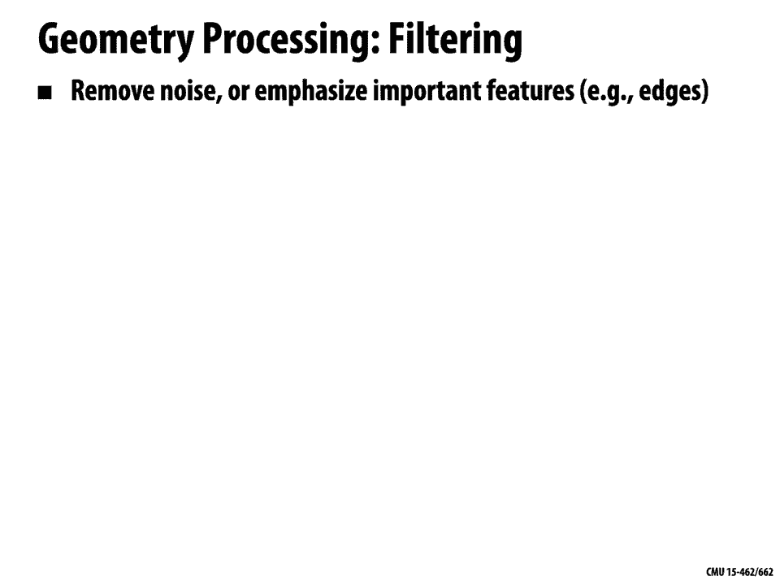
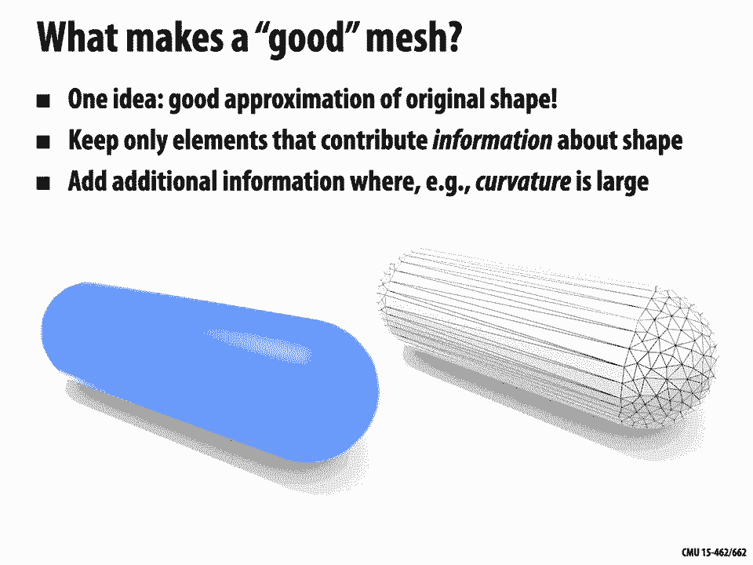
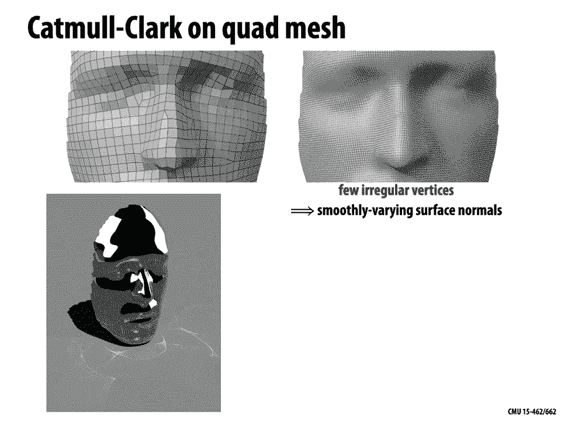
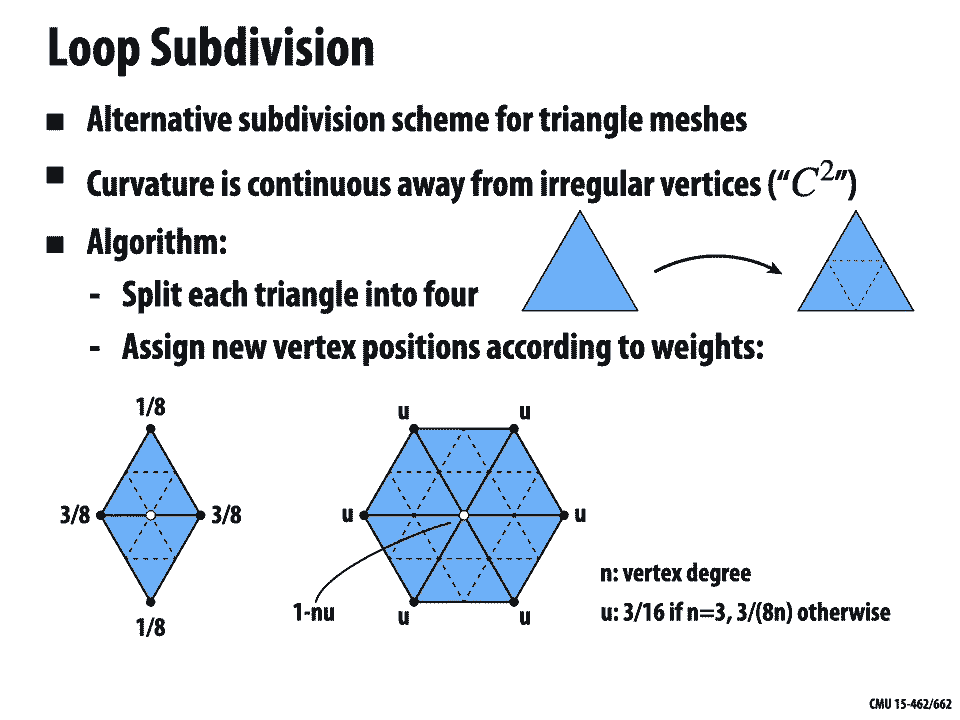
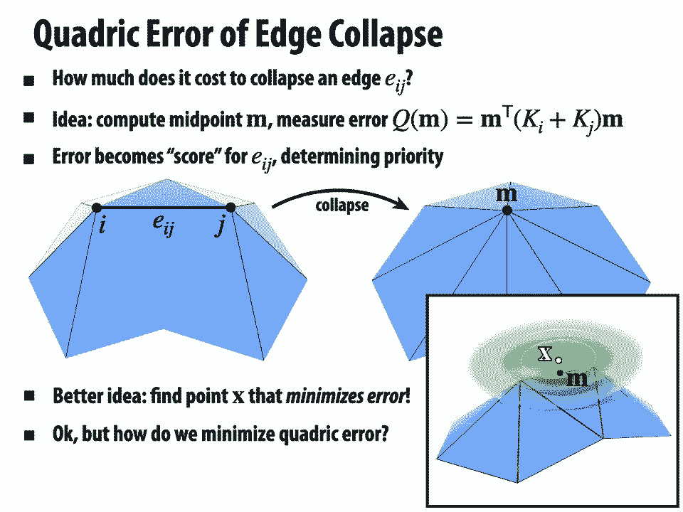

# 【双语字幕+资料下载】CMU 15-462 ｜ 计算机图形学(2020·完整版) - P12：L11- 数字几何处理 - ShowMeAI - BV1Pf4y1E7GJ

welcome back to computer graphics so，last time we got deep into mesh data，structures。

today we're going to talk a little bit，about what you can actually do。

with those data structures so remember，last time，we started out by first thinking about。

mathematical descriptions of geometry，what are some，simplifying assumptions we can make，about shapes。

that make them easy to think about and，our main assumption，was to assume that the shapes we're。

working with are，manifold that in some sense each，little tiny piece of our shape can be。

stretched out，into the euclidean plane for，meshes this became a lot more。

explicit we can say that the，connectivity of a polygon mesh is，manifold if it has fans but not。

fins so if we have just a single loop of，polygons around every vertex，two。

polygons containing that edge and，we said this simplifying assumption just，like with。

images is going to make it a lot easier，to develop，algorithms we have a regular structure，on。

and that simplifies our not only our，thinking but also our code。

we looked at some data structures for，polygonal surfaces starting with。

really basic stuff like polygonal soup，and building up，to half edge meshes something that gives。

us a lot more sophisticated，access to the connectivity of a mesh and。

we talked about the various trade-offs，between storage costs and access time，and so forth。

so today now that we have these data，structures what we want to understand。

is how can we manipulate and process，geometry so this brings us to the topic。

of digital geometry processing which is，kind of the，next wave of digital signal processing。

so traditionally digital signal，processing looks at，images and audio and video and now。

we want to generalize it to geometric，signals to shapes。

and we have a lot of the same basic，challenges we want to，up sample or down sample or resample or。

filter，geometry we're going to run into，problems of aliasing，where depending on how we acquire and。

reconstruct the geometry we might get a，and，beyond just purely working with geometry。

geometry processing and mesh algorithms，are really basic building blocks for，many areas。

of computer graphics so if you're doing，rendering，you're going to need some representation。

of geometry if you're doing animation or，simulation，you are going to need some。

representation of geometry，so the kinds of things we've been，studying in these lectures are really。

fundamental to a lot of the things you，need for computer graphics。

right now is an especially exciting time，for geometry and geometry processing。

because we're starting to see all sorts，of interesting and affordable，both。

bringing it into the computer and also，taking digital geometry and turning it。

into real physical geometry，so at the top here we see kind of a 3d，scanning process。

actually this is being done with just a，cheap consumer video game console you。

dance around in front of the screen，and at very high frame rates it's，bringing in some。

information about position and depth on，the bottom we're seeing，one technology for 3d printing so we。

have a，digital model a polygonal model of a，bunny and it's printing out。

slice by slice in some kind of plastic，resin a real physical，solid bunny this video has been sped up。

a lot but，but uh this is the basic idea and these，are really representative of a much。

broader set of things that are going on，in the computer graphics world people，are coming up with。

all sorts of interesting ways to acquire，geometry via，different kinds of sensors things that。

are showing up in autonomous vehicles，for instance and also digital。

fabrication is really taking off people，hard，rigid plastic pieces but also elastic。

soft materials that deform and change，shape and time，okay so how do you get all this to。

happen well when we talked about，rasterization and real-time graphics we。

had the rasterization pipeline，for geometry we kind of have a geometry，processing pipeline it's not。

quite as precise it's not like the，that，we're going to take some physical object，in the real world。

scan it into our computer so acquire it，sample it turn it into a digital，representation。

then process it in an algorithmic way，and so edit it transform it analyze it。

and then when we're happy with the，changes we've made we。

print it back out again to give it some，new function，what kinds of processing tasks do we。

have in the middle，well a lot of these look not so，different from traditional signal。

processing tasks，we might be reconstructing a surface，from，samples we might be filtering。

the signal so removing noise or，emphasizing certain frequencies。

but then there's tasks that look quite，different from what we do with。

traditional signals for instance taking，a curved surface，okay。

and that's something we already saw that，we needed for texture mapping right so。

there's natural motivation for these，kind of new and different questions。

so let's just take a brief look i'm，going to give kind of a high level。

overview of a lot of these different，tasks，just to give a general sense of what is。

geometry processing all about，so again one basic task is，reconstruction。

right you're given some samples of the，geometry maybe you're given a point，cloud。

and you'd like to reconstruct a surface，so you want to turn that point cloud。

into some other useful representation，maybe that's a polygon mesh，maybe it's a level set right。

what are samples could be points or，quite often what you have is a little。

richer information you might have points，and normals，at that point what was the surface。

normal direction，you might have yet richer information，you might know that those points and。

normals came from，images from photographs or sets of，photographs so then。

that might also give you color，information or other information about。

occlusion where things aren't very，different kind of，sample that you might have are line。

density integrals，so in medical imaging if you're trying，to image bone and tissue。

you have let's say mri or ct scans，which measure things like what is the，total density。

of that material along a line through，space，okay and then you need very different。

reconstruction techniques，to go from those samples to some，surface representation how do you do it。

there are many，techniques of course it depends on what，kind of data you have。

so you might use just silhouettes of an，from，computer vision like a visual hull of an，object。

if you have point samples you might take，those and use something called a voronoi。

diagram to get a sense of，where the surface is you might use。

techniques based on partial differential，equations we'll talk a little bit about。

those later in the class，if you're dealing with line density，integrals you might use。

something called the radon transform and，then take your，volumetric data and turn it into a。

surface using something called marching，cubes，there's just kind of an endless list of。

different techniques。

that you might need to know about okay，another basic task just like in all of，signal processing。

is up sampling you have a signal of a，certain，resolution you've sampled it at a。

certain frequency and now you want a。

higher resolution signal you want it，at a higher frequency so we've already。

looked at this a little bit for images，right if i have a low resolution image。

and i want to up sample it that's kind，of the same as，zooming in on a texture map right and。

there i could use，well we've seen one technique by linear，interpolation。

there are other interpolation techniques，that might give you higher quality。

results likewise if i have a very coarse，polygon mesh i only have a rough sense。

of what the surface looks like，but i want a nice smooth surface to，render i might want to。

up sample it and there we've already。

seen a little bit about the technique of，subdivision，but there are other techniques bilateral。

upsampling and so forth，you could also go the other direction，right you have a mesh that's too high。

resolution there's more information than，you strictly need，and you want to down sample it you want。

to find a coarser，simpler mesh that's stored in a smaller，file，but in that process you still want to。

preserve the basic shape and appearance，of the model，and the object's going off into the。

distance you want to coarsen it，but you still want it to look the same。

as it goes off in the distance，so for images again there's some very。

basic techniques you could just do a，simple nearest neighbor。

filtering or bilinear or pick other ways，of interpolating if we're dealing with。

geometry described by point clouds how，do i get a coarser point cloud well。

a really simple thing you could do is，you could just randomly take a subset of，points。

it's not clear that's the best down，sampling operation right because you，might have way more。

points in some region you know dense，regions and sparse regions and okay。

which one should you remove points from，so it's，even interesting to think about how to。

down sample point clouds，for polygon meshes there are all sorts，of techniques and we'll look at one。

of iterative edge decimation but there's，others like variational shape，approximation you find。

patches of the surface that roughly have，the same surface normal，and replace them by single polygons。

things like that，okay in addition to up sampling and down，sampling。

when we work with geometry there's，something we might do that's a little。

bit different than what we would do with，a traditional signal which is resampling。

and we do this not to，decrease the file size or increase the，resolution。

but rather to improve the quality of，individual，polygons individual elements so for。

images this is not really an issue i，have pixels stored on a nice，the。

shape of the pixels maybe going from，square pixels to hexagonal pixels in，some very exotic。

case okay but with meshes this is quite，common the the shape of the polygons in，our mesh。

is extremely important and depending on，what kind of algorithm we're going to，run。

we might have different criteria for，what it means，to have good quality meshes or good。

quality polygons，so for instance if i want to do，rendering if i just want to visualize，the surface。

then i want to use those polygons to get，as much geometric detail as possible i，don't。

really care so much about how the，individual，triangles in a mesh are shaped for，instance。

but if i'm solving equations on a，surface again if i'm solving，partial differential equations for。

instance i'm doing simulation of some，kind，then i care very very much about what，the shape of each。

polygon looks like with triangle meshes，for instance，it's usually helpful if they are close。

to equilateral we'll talk a bit about，that，another common task in all of signal，processing is。

filtering we might want to remove noise，or emphasize。

certain features so do edge detection，for instance，in images common things are to let's say。

take something noisy and blur，or do bilateral filters to get rid of，on。

in that image with polygon meshes，there are techniques for doing this kind。

of filtering but they look，algorithmically a bit different from，what you typically do for。

images so we have things like curvature，like，bilateral filters we can do spectral。

filterings to enhance，uh features so for instance in this，model on the lower left。

you see that we can emphasize or over，emphasize features of the face。

for instance compression is another，classic signal processing task so。

what's the goal of compression well you，want to reduce，storage size by eliminating redundant，data or。

by approximating unimportant data。

for instance data that is not，perceptually，relevant so for images for instance we，have。

a couple different categories of，compression schemes，there are lossless encoding schemes，things that。

actually preserve the exact color of，every single pixel，but change the file size reduce the file。

size，or lossy compression schemes，schemes that say we can get even smaller。

by changing a little bit the，color values but in a way that maybe the，eye doesn't。

catch very easily so here for instance，the image of the elephant gets。

compressed about a hundred times，without changing too much the way that，we perceive the image。

now for geometry say for polygon meshes，compression gets a little more，complicated because。

it's not just that we have to compress，the positions。

right where things are in space but we，also have this connectivity data。

that we don't have with images right，with an image，you just have a regular grid the only。

thing you need to describe，the connectivity of the pixels is two，numbers the width，seen。

to encode a polygon mesh we need to，actually store quite a bit of data to，say。

which vertices are connected up to which，other vertices，right and so that's a new and very。

different problem，that people have looked at in the，geometry processing regime。

and just like images there are many，different techniques lossy techniques。

and lossless techniques okay so once we，start to get our，hands on some of these basic operations。

up sampling down sampling filtering，we can start building up higher level。

algorithms on top of those operations，so for instance we can try to do。

different kinds of shape analysis，i have some model it's a long list of，encoding。

of connectivity well what is that shape，how would you get the computer to，automatically decide。

a mesh，of a human being right and with images，this is really。

kind of the domain of computer vision so，they're in an image you might be trying，to。

segment the image into meaningful pieces，or detect faces or maybe even determine。

the mood of somebody's face from the，image，what about polygon meshes well again，there's a lot of。

similar problems i might take a raw list，of polygons and try to break it up into。

meaningful pieces like oh these polygons，correspond to the legs of the chair。

these correspond to the back of the，chair how would you do that i mean。

can you think about how you do that，somebody just feeds you this long list。

of polygons and you're supposed to，figure this out，it's a really interesting challenge。

there's also things you might want to，know about the relationship between。

two different geometric models like i，have two different scans of the body。

and i want to figure out okay i pick a，point on one model let's say it's a，fingertip。

and i want to find the corresponding，fingertip on another model。

well these vertices aren't given in any，particular order the polygons。

might not even be consistent right，different numbers of polygons，triangulated in a different way。

so how would you go about doing that how，would you find you know how to match the，nose to the nose。

lots of very interesting challenges in，shape analysis。

okay so hopefully that's enticing you，believe，that geometry processing is a really。

interesting and challenging problem，let's go ahead and do some let's，actually process some geometry。

and let's start by talking about this，problem of，resampling geometry or what's more。

commonly known as remeshing，so remember our discussion of aliasing。

this is something that shows up all，throughout computer graphics what is，aliasing。

well it means that a bad sampling and，then reconstruction，of a signal can make it appear different。

than it，actually is so for example a，curve with lots of features a really，high frequency curve。

if we under sample it if we only take a，few samples then our reconstructed curve。

this piecewise linear，you know green line looks flat right we，even though we took samples that are。

perfect they're exactly on the original，signal，we get a bad impression of what this。

signal looked like，well geometry is no different，even if we put our points exactly on the。

surface even if we get the individual，coordinates exactly right，under sampling can destroy features。

and on the flip side okay we could just，be really aggressive and put samples all。

over the place，but over sampling is bad for performance，we end up using a ton of memory we end。

up using a ton of processing power，and we might not be getting anything，valuable out of it。

so it's a bit of a balancing act to make，sure that we，are kind of sampling signals at the。

right fidelity at the fidelity we need，for our task，so how do we know when we have a good。

sampling what makes a good，mesh what's a good sampling of a，geometric object。

well one reasonable idea is to say，it's a good mesh if it provides a good。

approximation of the original，shape right so if you really want to be。

sort of optimal about this you'd imagine，you keep only elements that contribute。

some useful information about shape，in this example for instance we have。

this cylindrical tube with these，spherical end caps，and we've kept track of more information。

where it's needed we need more vertices，at the end caps，in order to represent this more curved。

region of the surface，in the middle where it's kind of，straight we can get away with using。

fewer vertices so this is a pretty good，mesh it's a pretty，at least efficient approximation of the。

original shape。

however that's not the whole story，approximation of，positions is not enough so in particular。

just because the vertices of a mesh are，close to the surface or exactly on the，surface。

that does not mean that we have a good，approximation of that surface，what can happen is we get。

even though we have these these perfect，vertex positions we get the wrong。

appearance the wrong surface area the，wrong normals the wrong curvatures。

we can get everything wrong about the，geometry even if the vertices are on the，surface。

so even if we go back to just this，example of the cylinder，i'm going to take this smooth cylinder。

on the bottom left，and i'm going to sample points，on the cylinder and i'm even going to。

put these on pretty nice places，and i put them in pretty nice orderly，rows and columns。

okay and then i connect them up into，reasonable looking triangles a bunch of。

isosceles triangles okay，what happens here well you notice，something funny already from。

just the rendering of these these two，polygon meshes which is，there's this kind of checkered pattern。

light and dark pattern why is that，happening，well because some of the normals are。

tilted up and some of the normals are，tilted down just by，even though。

all the normals of the cylinder stick，straight out，if i don't triangulate this cylinder。

carefully i get a very very bad sense of，what the surface looks like what the。

even more damning is it's not just about。

like，the surface area if i measure the total，surface area of these two different，approximations。

right this coarse and fine approximation，of the cylinder，i'm actually going to end up getting。

completely different surface areas，even though the points are exactly on。

the surface and even though the，triangles have totally reasonable shape。

okay so when we think about getting a，good approximation of geometry。

we really need to consider other factors，beyond，the basic question of are the positions，close。

for instance we'd like it to be the case，that the normals of our polygon mesh are，also close。

to the normals of the smooth surface and，it turns out if that's true。

then actually a lot of the properties。

going to be，what else makes a good triangle mesh i，mean all of these are just rules of。

thumb i'm not being very formal or，precise here but there are some really，good rules of thumb。

so i mentioned earlier on that the shape，of the triangles can be very important。

for different applications if i'm，doing some kind of numerical simulation。

then for instance i might want the，triangles to look，more like the ones on the left and less。

like the ones on the right，this is again kind of a crude rule of，thumb but if you。

go through and start to learn about a，lot of different algorithms and start，working with meshes。

you'll generally have this experience，that meshes with long，skinny sliver triangles cause nasty。

problems whereas meshes with，nice fat round triangles generally do，the right thing。

so for instance we might ask that all，the angles，should be as close as we can get them to，60 degrees。

a more sophisticated condition and one，that's much less obvious。

i'm not going to try to justify why i'll，only tell you that it is true。

that meshes that are delani tend to have，very nice properties for a lot of，algorithms。

what does this mean delany one way to，say it is，if i have a triangle mesh in the plane。

then i can look at the circum circle of，every triangle，so for each triangle i have a unique。

circle passing through the three，vertices，and a mesh is delani if the。

circles are empty meaning they have no，vertices on their，interior okay by the way just as a，mnemonic。

delaney you can think this is something，like the word baloney，okay delany meshes often help with。

numerical accuracy and stability okay，that's a very loose statement but it's，approximately true also。

place，in very surprising and also natural ways，so things i can say about delany。

triangulations well for instance，they are going to maximize the minimum，angle。

of the mesh in fact it's going to do，that lexicographically，they're going to provide the smoothest。

interpolation of data on vertices so if，i use barycentric coordinates。

or linear functions to interpolate data，at vertices，a delani mesh is going to give me the。

smoothest interpolation，of any triangulation of those points，that's something called ripa's theorem。

and more sophisticated things so when we，talk about partial differential，equations。

we can talk about laplace equations，solutions to laplace equations。

satisfy something called a maximum，principle and that will also be，satisfied if we have a delani。

triangulation，okay so just all sorts of good things，come out of dalani triangulations。

the trade-off there's always trade-offs，in life the trade-off here is that。

you might not get as good of a geometric，approximation in general if you're，trying to optimize。

the shape of your triangles right，you might be giving up the accuracy of。

the approximation of your underlying，smooth surface so for instance。

it might be the case depending on your，shape that long，skinny triangles are much more efficient。

at just approximating the surface like，that，cylindrical thing that we saw earlier，right。

so it's a balancing act do you want to，do a good approximation of the geometry。

do you want to have good quality，elements well really you want to be。

somewhere in the middle or you kind of。

want both okay，what else constitutes a good match，here's another rule of thumb。

having regular vertex degree so the，degree of a vertex，is the number of edges touching that，vertex。

what does it mean for that degree to be，regular well if i have a triangle mesh。

we're going to say i have a regular，vertex degree if all the vertices are，degree，6。

 why is that well if i tile the plane，by equilateral triangles，then every vertex is going to have。

degree 6。likewise if i tile the plane by regular，squares then every vertex will have，degree four。

okay so if we see a mesh like this one，on the left，where vertex is degree six that's a。

pretty good mesh，if we deviate a little bit from six，that's not so bad if we're degree five。

or degree seven，this is a pretty you know pretty，reasonable mesh but if we start getting。

really really high degree vertices，or really low degree vertices okay we，can only go down to。

three really those are starting to get，worse in some very loose sense okay。

well why why would we care about the，vertex degree，for one thing we just talked about the，want。

triangles perhaps that are close to，equilateral okay，well in order for triangles to be close。

to equilateral they have to have a，tiling that looks，you know something like this something。

like a tiling of the plane so generally，they'll have degrees that are close to，six。

okay on the other hand if we have，triangles that all have very irregular。

degree it's very very hard to arrange，them，so that they have good shape right so。

there is some kind of，tension or relationship between vertex，degree and triangle shape。

another reason for having regular degree，is it leads to more regular computation。

if you have regions of your mesh that，are made up by just tilings by。

regular polygons right the connectivity，is regular，then it becomes easy to do things like。

map that region of the mesh，onto a regular array and then you can do。

really efficient you know parallel，computation this kind of thing，with。

subdivision so if i take a regular，degree vertex like this degree 6 vertex。

and i subdivide all the way to the limit，surface i'll get some，really nice smooth subdivided surface。

if on the other hand i start with a。

really high degree vertex degree 20，and i run my subdivision i'll often get。

nasty artifacts like this so rather than，having this smooth bump。

i get these little wrinkles all over the，surface，and in general what i'm going to get is。

shading artifacts normals are going to，look wrong reflections are going to look。

wrong and so forth now，an important mathematical fact is that，in general。

you cannot have regular vertex degree，everywhere，arrange，triangles on it so that all vertices。

have degree six there's no way to，arrange，quadrilaterals on it so that all，vertices have degree four。

but we can be thoughtful about where we，put these irregular vertices and try to。

keep them to a minimum，okay so how do we do some basic tasks。

like up sampling a mesh，well our basic tool for up sampling is，going to be subdivision。

the basic idea of subdivision is we're，going to repeatedly split each element，into smaller。

pieces so that's a statement about the，connectivity of the mesh。

once we've subdivided the connectivity，we're going to replace，the vertex positions with a weighted。

average of the neighboring vertex，positions，so that's a statement about the geometry，of the mesh。

what are some considerations when we're，thinking about how to do this averaging，or how to。

split these elements what are things，that we would like，out of this subdivision scheme right we。

could do this in a completely arbitrary，way but what's a good subdivision scheme。

well one question or one criterion we，might think about，is whether the scheme is interpolating。

versus approximating，does the limit surface exactly pass，through the vertices，just。

come near those vertices for some，applications we really care that it goes，through the vertices，the。

continuity of the limit surface so the，whole reason for doing subdivision is。

that we in some sense want to make the，surface smoother and so，we'd like to have it have kind of as。

many derivatives，as possible we could ask that it be once，differentiable or twice differentiable。

and so on，we also want to know how does it behave，at a regular vertices if i do happen to。

have a few really high degree vertices，what happens there is it really really。

bad and crazy or do we just，lose one degree of differentiability。

there are lots of different options for，subdivision schemes lots of good。

subdivision schemes that have。

nice properties the most common for，quadrilateral meshes is something called。

catmull clark subdivision，perhaps the most common for triangle，meshes is something called。

loop subdivision but there are other，schemes like butterfly square root three，and so forth。

so how does this work in more detail so，catmo clark subdivision。

actually is not just for quadrilateral，meshes but we can start with。

polygons of any kind and through the，subdivision process they will all turn，into quadrilaterals。

okay so the first thing we do is insert，somewhere in the middle of this polygon，a new vertex。

and connect that to new vertices，somewhere in the middle of each of the，edges。

how do we actually decide on the new，vertex positions，well they're a weighted combination of。

the old ones，so we can break this down into a few，steps the first step is to determine the。

coordinates of this，new vertex we inserted in the middle of，the face。

and for that we're just going to take，the centroid we're just going to take，the arithmetic。

mean of all the polygon vertices okay，once those have been determined we then，compute。

the edge coordinates the locations of，the new vertices we put。

in the middle of each edge how do we do，that well we average，two，new face points that we just made。

and then comes the only complicated part，which is，computing the new coordinates of the，vertices。

and i'm not going to try to explain，up，captain clark subdivision if you're。

interested in but basically this rule，get，nice properties so that the limit，surface is a nice。

regular surface okay but what do we do，well let's see so if the vertex is，degree n。

it has n edges sticking out of it，and q is the average of all the。

face points around the vertex so just，the arithmetic mean of all the face，points around the vertex。

and r is the average of all the edge，coordinates around the vertex。

and s is the original vertex position，then okay you see it right there the new，vertex coordinate is。

q plus 2r plus n minus 3 times s over。

n okay so let's look at what this，actually does to some，mesh so we start with this coarse mesh。

right and we apply exactly the rules，from the previous slide。

and we get this mesh and what you notice，about the subdivided mesh is because of。

the way we decided to update the，combinatorics，we have very few irregular vertices in。

the subdivided mesh，in fact the only reason we would have an，irregular vertex in the subdivided mesh。

is because there was an irregular vertex，in the original mesh，okay it doesn't introduce any new。

irregular vertices，is，well behaved almost everywhere if we，stay away from these irregular vertices。

it has really nice，normals and curvatures and all the other，nice properties you'd expect to have。

in a smooth surface why does this。

matter well let's say we wanted to，render some，really glossy mirrored surface we turned。

this，face into this mask and if we zoom in，you notice that，we have really nice smooth reflection。

lines，all right something you wouldn't see in，a coarse polygon mesh。

we also have nice smooth what are called，caustics so if you have a really shiny，surface like metal。

and you shine a really bright light on，it that light is going to get focused in。

interesting ways kind of like a，magnifying glass focuses light，and here we see that that pattern of。

light is really nice and，round like you might see in the real，world okay so。

just as a point of comparison let's go，ahead and try to apply this same。

catmull clark subdivision scheme but，this time we're going to start with a，mesh。

where all the polygons are triangles，right and remember，we can apply catmull clark to triangles。

we can apply catmoclark to any kind of，polygon，by just you know sticking a vertex in。

the middle of the polygon and away we go，but what's going to happen here is。

because all of our vertices，are degree 6。 they're not，regular from the perspective of a quad。

mash a quad mesh wants to have，vertices of degree four so when we。

subdivide this mesh with catmull clark，place，we get really kind of erratic surface。

normals if we look at the reflection，lines they look really jagged if we look，at the caustics。

that reflect off the surface they also，look jagged and，do，subdivision on a triangle mesh we need a。

different scheme，and one basic scheme is loop subdivision，right that's our basic scheme for。

triangle meshes，the limit surface will be nice the，curvature will be。

continuous away from our regular，vertices，okay so it'll be twice differentiable，and it has a very。

similar flavor of algorithm but with，different rules，so what are we going to do this time。

well first we're going to split each，triangle into four，by just inserting vertices on the edges。

and then we're going to assign new，vertex positions according to some，other set of weights so first。

we put the new vertices on each edge，add a weighted average of the four。

vertices from the triangles containing，that edge，right so the two opposite vertices get a。

weight of one-eighth，the two endpoints get a weight of 3 8。right by the way you notice something。

interesting here 1 8 plus 1，8 plus 3 8 plus 3 8 is equal to 1。 so。

that means this new vertex is a convex，combination of the neighboring vertices，in general。

points on the subdivision surface are，going to be，in the convex hull of the points used to。

generate them and that's a useful，property，for instance if we want to do collision。

detection that kind of thing，to get the new locations for the，vertices。

we again have some formula you can go，look up loop subdivision if you're。

interested in where these formulas come，from，but what we say is if n is the degree of，the vertex。

then we have a value u equal to 3 16，for the special case where it's a degree，3 vertex。

and u is equal to 3 over 8 n，that，vertex is going to be well we take a。

weighted average of all the neighbors of，the vertex we give them each a weight u。

and we give the center vertex a weight 1，minus，n u so another convex combination。

now one thing you're going to have to，think about at some point is how do we，actually。

change the connectivity if we have our，half-edged data structure for instance。

what do we do to update the connectivity，we could do a ton of pointer。

reassignments to build in those，new elements but actually you might，remember last time。

we talked about different local edge，operations like，splitting flipping and collapsing and。

conveniently enough，if we already have these basic atomic，edge operations。

we can use those to implement this，subdivision，process so the first thing we do。

is split the edges of the original mesh，in any order，right and i'm going to draw the new。

edges in blue，the new vertices in blue as well and，this might seem。

a little surprising you'd think okay，depending on what order i split the。

edges i'm going to get a different，triangulation but what we're going to do，next。

is flip any new edges so any of these，blue edges，where one of the endpoints is a new。

vertex and the other endpoint is，one of the original vertices and if you。

do this if you look at this little，picture here and you imagine in your。

head okay i'm going to flip that edge，and that edge and that edge and that，edge what you'll discover。

is the connectivity you get is well it's，exactly the one we wanted it split every，triangle into。

four smaller triangles of course to，complete the，loop subdivision process we have to。

update the vertex positions。

according to the rules that we just saw，all right so now let's go the other。

direction that was upsampling，if we want to make the mesh higher，resolution we just keep。

subdividing what if we want to go the，other direction we want to make the mesh。

lower resolution well if we happened to，have generated the mesh from subdivision，maybe we could just。

undo the subdivision but in general，that's not true somebody could just hand，us a triangle mesh。

and we'd like to down sample it，so one way to do this is to do some kind，of simplification。

based on edge collapses so this is a，popular idea，we're going to iteratively collapse。

edges to simplify the mesh，in fact we're going to do a greedy，of。

cost to each edge then we're going to，just figure out，of all edges which one has the smallest。

cost which one，basically changes our surface the least，okay，and then we're going to keep on。

collapsing edges until we reach some，target number of mesh elements and。

although this is a greedy algorithm，although this sounds like it's。

not going to do the best job this turns，out to be，really really effective especially if，you use。

a particular cost function called the，quadric error metric which by the way，was。

invented here at cmu back in 1997。okay so this image at the bottom is an，do this。

greedy edge collapse simplification we，start out with this，high resolution mesh of the skull we。

start collapsing，and we get down to a mesh of 3000，triangles so 10 times fewer triangles。

still looks pretty good，right especially if you imagine this is，some small object。

often the distance in a scene you really，probably couldn't tell the difference。

right now if we go down even another，factor of 10 we go down to 300 triangles。

still looks quite good right it's not，until we get down to 30 triangles that。

we really kind of lose track of what，this looks like okay so this was pretty，cool that a。

simple greedy heuristic can do a really，really good job of。

simplifying geometry all right so how，does this actually work，well let's start out by talking about。

how we measure，error right and the basic idea，is to store keep track of something，called a quadric。

which intuitively keeps track of，the distance to some collection of，triangles。

so for instance we might have a，quadratic that tells us how far are we。

from all the triangles around a point，okay so how do we build this thing up。

well let's start with a really，basic calculation so question，how would i compute the distance of a。

given point，x to a plane with normal n，that passes through a point p what's an。

okay well one way to think about this is，we could say，how far along the direction n is the，point x。

so if n is a unit vector right，then that's just the inner product of n，with x。

and we're going to subtract from that，how far along，the direction n is the point p right p。

is a point on the plane so we can do n，dot p so n dot x，minus n dot p or equivalently we could。

write n，inner product with x minus p what is the，extent，of the vector from p to x in the，direction n。

in the direction of the normal of the，plane，okay so that distance function will look。

something like this or actually here i'm，plotting the square of the distance，function。

and the quadratic error is then the sum，of the squared，point to plane distances for all the。

planes in this，set so for instance if i want a，quadratic for all the。

triangles around this point p or really，the planes of all the triangles around。

this point p then i'd say my quadratic，through，k in this case 5 of the normal，dot x minus p squared。

okay how can we think about this，quadratic how can we kind of。

visualize what's going on here well one，way to do it is we could plot。

level sets of the function q we could，find，places where q has a constant value。

so if we set q equal to 1 we get this，kind of ellipsoid，centered at the vertex if we set q，equals。

one half it's a little smaller q equals，one eighth it's a little smaller q。

equals zero we just get the point itself，huh that's pretty interesting so why。

is the quadratic error equal to zero，at the point p，well we said that the quadratic error is。

the sum of squared point-to-plane，distances，it gives us the tells us how far away。

from all these planes in total，and the only point that is on all of，these planes simultaneously。

is the vertex right it's the vertex of，this little，this little region of our mesh okay but。

in general the quadratic is a lot more，interesting than just the distance to，the vertex。

for one thing imagine that this，vertex neighborhood is kind of flatter，well then our。

quadratic is going to get squashed down，like a hamburger，if the vertex neighborhood is tall and。

skinny it's going to also get elongated，in the vertical direction like a。

like a hot dog right so it really is，keeping track of，kind of the distance to this little。

region not just to the point，okay the other thing that's interesting，about this is we can use。

this quadric arometric to measure the，distance to any collection of planes it，doesn't have to be。

a bunch of planes that all come from，triangles around a vertex，it could be a bunch of different。

triangles from all over our triangle，mesh，and that's really how we're going to use。

it we're going to use the quadratic，error metric，to see how far we are from some region，of the mesh。

now to make this all work a little，better we're going to express。

the quadratic error in our favorite，representation which is，homogeneous coordinates so let's say we。

want to write the quadratic error，to just a single plane again we have a。

plane passing through a point p，with unit normal n and suppose that in，ordinary coordinates。

we write our query point x as，three components xyz right this is where，we want to measure，write the。

unit normal n as three components a b，and c，and we have an offset d which tells us。

how far the plane is，from the origin right so since p is a，point on the plane。

that's going to be equal to n dot p，in homogeneous coordinates we can。

write the query point as u equal to xyz1，so we just add this fourth。

homogeneous coordinate to the query，point and we're also going to have a，homogeneous point。

v equal to abcd，okay so the first three components of v，encode the。

normal of the plane the final component，encodes the offset，and by the way this is really。

interesting this is a really kind of，cool，fact about homogeneous coordinates i can，represent。

a plane in r3，and a plane that doesn't pass through，the origin necessarily。

with a single point in homogeneous，coordinates，and so points and planes are in，correspondence。

all right in this case that let me lets，me do something really nice。

i can express the signed distance to the，plane，as just the inner product between u and，v。

right if i take the inner product i，write it out i get ax plus b。

y plus cz plus d just my usual distance，formula，the squared distance to the plane is。

then well the square of that inner，product，which in matrix notation i can write as。

u transpose v times v transpose u，and if i group those two v terms，together。

then i can also write this as a，quadratic form u，transpose k u for some fixed matrix。

k in a matrix that looks like this，so this matrix k or v v，transpose encodes the squared distance。

to the plane，if i have a query point x i can just，stick it on both sides of this matrix，and。

the key idea of this quadratic error，metric or the thing that makes it work。

really really nicely is that if i want，to take a union of planes。

and measure the distance to that union，of planes or the sum of square distances。

then i can just sum up these matrices k，so no matter how many planes are in this，set。

everything boils down to just a single，4x4 matrix，i don't get a growth in the size of my。

distance function as i add more planes，to my set，super super cool all right so if i have。

two quadrants k1 and k2，from different planes then，u transpose k1u plus u transpose k2u is。

equal to u transpose，k1 plus k2 u and so，then i can just store the sum of the。

matrices rather than the，individual matrices or the individual，points and normals。

right okay，so let's think about how we can now，apply，this quadratic error metric to our edge。

collapse operation，so let's say i have this edge in my mesh，eij with endpoints i and j。

how much does it cost to collapse this，edge，right well one thing i could do is i。

could just go ahead and perform the，collapse，the，midpoint of the edge and then plug that。

midpoint into my，quadric what does that tell me，in essence it tells me how well does。

this new collapsed region，approximate the original region，this is kind of a score for saying。

is this a good edge to collapse or not，if the quadratic value is really big，that means。

moving these endpoints to the midpoint，is really changing the geometry of the，surface。

if on the other hand this vertex，neighborhood let's say it was really，really flat。

right then my quadric is also going to，be really really flat and。

it doesn't matter as long as i keep my，new points somewhere in the plane of，those original。

triangles i didn't change the geometry，at all，right so different edges are going to。

change the geometry more or less kind of，depending on how curved the surface is，in that region okay。

something even smarter we could do，rather than just sticking the。

new vertex at the midpoint is we could，try to find the best possible point。

to put the collapsed vertex，where should i put the new vertex to，best approximate。

this little patch of surface that i，originally had，okay and how do i do that well i could。

minimize i could，i could move the point x around to，minimize，the quadratic error q of x。

in general i should be able to find a，point that's better than the midpoint so。

i've really plotted here this，green plot is really showing the actual，quadratic for this。

edge the sum of the two quadrants at the，two endpoints，okay and you can see that x moving it a。

little bit away from the midpoint，actually does a better job。

so how would we actually find that point，how would we minimize，the quadric error well as。

always in life we should start by，thinking about a simpler problem，so let's go back to just ordinary。

calculus，and let's say we have a function f of x，equals，ax squared plus bx plus c。

okay so first of all what does the graph，well it depends a little bit on our，choice of a b and c。

but generally it looks something like，this it's a parabola，like。

this it could look like a upside down，parabola，right okay question。

how do we find the place where this，function，is smallest how do we find the minimum。

okay hopefully if you took calculus then，one thing you remember，one of the most important things you。

remember is well，the first derivative test right i'm，going to find where the function looks。

flat if i really zoom in close that's，kind of where，where the interesting point is in other。

words we want to find the point，x where the first derivative vanishes。

where f prime of x is equal to 0。okay if we actually go ahead and take。

the derivative of our function ax，squared plus b x plus c，okay we just get two ax plus b is equal。

to zero，and we can solve for x to get x is equal，to minus b，over 2 a okay。

so is x the point where f of x，what does x describe for the second。

all we've really done here is figured，out where the function looks flat we've，point so。

for the first function it's a minimum，for the second function it's a maximum。

okay but what i want us to just remember，for now is that to find this critical。

point we take our quadratic function，we calculate its derivative and we solve。

for the place where this derivative is，equal to zero，okay minimizing a quadratic form。

is really not much harder than just，minimizing an ordinary quadratic，polynomial。

okay and it turns out actually we can，always write a quadratic polynomial in n。

variables in terms of a symmetric matrix，a so for instance let's say we have a，polynomial。

f of x y is equal to a x squared plus b，x y plus c y squared plus d x plus e y，plus g。

for some constants a b c d e g，okay then we can write this in kind of，matrix notation。

by encoding the two arguments x and y，in a single vector x，we can build a matrix a that stores the。

coefficients of the quadratic part，so a b over 2 b over 2，c and a vector u that has the。

coefficients of the linear part，and if we do this then we can write f。

as x transpose ax plus u transpose x，plus g，if you don't believe me multiply it out。

and you'll see you get exactly the same，formula as before，and by the way we can write a quadratic。

polynomial this way，no matter how many arguments it has no，matter how many variables。

n okay it's always going to be x，transpose ax for some symmetric matrix，plus blah blah blah okay。

most important question how do we find a，critical point，of this function how do we find a point。

that is a minimum，okay if you don't know what to do，then what you should try first the first。

thing you should think is well，what did i do in the one-dimensional。

case what did i do when i just had f of，x，what was the basic strategy to find a。

okay what you did is you set the，derivative to zero，you set the derivative to zero and solve，for x。

well that's exactly what we're going to，do here as well we're going to take the，derivative of f。

could，imagine taking the derivative with，respect to the two components。

x and y if you work this out what you'll，discover is that the derivative is，2ax plus u okay，for，move。

u to the right subtract u from both，sides divide by 2，and apply a inverse to both sides to get。

x is equal to -1 half a inverse u，okay if if this felt tricky to you then。

you should take a moment and just，make sure that you can show it's true at，least in 2d。

i think once you do this once you do it，in two dimensions okay you'll be，convinced for。

for all other dimensions and and this，won't seem so mysterious。

okay but but importantly what we notice，here is we compare with our。

1d solution it's really not so different，right，how did we get x before we did minus b。

over 2a how do we get x now we do，minus u over，2a sort of right we're kind of dividing，by a。

so not much changed here maybe we have，to invert a matrix，right okay the one。

lingering issue is this question of is，this point。

really a minimum or is it a maximum or，is it a saddle，okay and just like in 1d。

this critical point is of course not，always a minimum，and so we have this question when。

is this actually going to give us a，minimum right if we're in two dimensions。

of three dimensions or n dimensions，when is this critical point giving us a。

well the answer it turns out is it'll be，a minimum as long as the matrix a。

is positive definite meaning，if x transpose ax is greater than zero。

for all x then we will get a minimum，okay maybe you think about this in a，simpler case what about。

in one d what this means is just that x，times a，times x is greater than zero a x squared。

is greater than zero，so if，a is positive then our polynomial，ax squared plus bx plus c describes a。

parabola that is kind of convex up right，so the only critical point it has。

is at the bottom at the minimum okay，likewise what does this positive，definite condition。

mean for our matrix a if we were to plot，let's say f of x y for all points x y。

well if a is positive definite then we，have a graph that，goes up that looks like a bowl。

okay and for that reason the only，critical point we can find in this bowl。

is at the bottom is at the minimum，if this matrix is not positive definite。

let's say it's only positive，semi-definite，right so there's some vector x such that，x transpose。

ax is equal to 0 some non-zero vector x，then we get multiple minima let's say。

along the bottom of a kind of，it's，indefinite and if x transpose ax is。

sometimes positive and sometimes，negative，then the critical point will be a saddle。

okay so the case that we really want，is we want our，matrix to be positive definite if it's。

positive definite we can really find，this minimum no problem we just solve。

this linear equation we invert this，matrix，in general by the way positive。

definiteness is a really really，important concept in computer graphics。

if we can formulate our problem，in terms of a energy or a function that。

uses a positive definite matrix，then we can easily find minimal or。

optimal solutions by just solving linear，equations and this is，the starting point for all sorts of。

algorithms across geometry processing，and animation and simulation and so。

forth，okay so let's come back to this problem，of minimizing，the quadratic error which we need to do。

to place，our collapsed vertex right we wanted to，find the best point for an edge collapse。

by minimizing this quadratic form，so among all points u and r4 among all，homogeneous coordinates。

we want to find the one that makes the，sum of the squared distances to all。

these planes as small as possible，now one thing we know already is that。

any point can be encoded with a，homogeneous coordinate of，one so in fact we don't need to solve。

for all，four components of our unknown point，just the first three。

so we're going to break everything up，into two pieces，our unknown will break up into an。

unknown vector x，with just three components and the，homogeneous coordinate one。

and we'll break up our matrix k into a，three by three matrix b a，three by one vector w and a scalar。

d squared okay so we multiply this out，we get that the thing we want to，minimize is。

x transpose bx plus 2w transpose x plus，d，where x is unknown okay so we now have a。

quadratic polynomial in three variables，in the unknown position。

x and we can go ahead and minimize just，as before，right we know now how to minimize a。

quadratic polynomial，in any dimension we take the derivative，get，2bx plus 2w is equal to 0 and if we。

solve for x we get，we just get x is equal to minus b，inverse times，w okay if you've been。

paying careful attention you're maybe，thinking at this point wait a minute，b。

is this really a minimum or is it just a，okay so a really good question to think，about。

answer in the comments is b really，always a positive definite matrix。

could it ever be indefinite could ever，okay but you'll probably guess that。

things work out pretty well otherwise we，wouldn't be using it for this algorithm，okay so let's go。

and look at our final algorithm we can，put all these pieces together now。

so the first thing we're going to do is，initialize our，simplification process by computing a。

quadratic k for every triangle in our，mesh，right which just measures the square。

distance to the plane of that triangle，going to，sum up the quadratics of all the。

triangles containing that，and for each edge eij，we're going to also compute a quadratic，which is the。

sum of the quadrats at the two endpoints，ki and kj，okay to assign a cost or a score to that，edge。

we're going to find the point x，minimizing，the quadratic error for that edge and，set the cost to k。

i j of x okay so，where we are at the beginning is we，haven't touched our mesh yet we've just。

gone and assigned a score to every edge，that says，if i were to collapse this edge how。

badly would i change the geometry，if the quadratic error is small i'm not。

going to change the geometry very much，it's okay to collapse those edges。

if the quadratic error is really big，that's really going to change the way，the surface looks。

maybe i should leave those alone okay，and then until we reach a target number。

of triangles we're just going to do，a greedy collapse procedure we're going。

to find the edge with the smallest cost，we're going to collapse it to the，optimal point。

we're going to set the quadratic at the，new vertex，to well actually the same way that we。

did it during initialization right to，the sum of the。

two endpoints okay and then we're going，to update the cost，for all edges that touch this new vertex。

right all those edges kind of have an，invalid score now because well the the，geometry changed。

so we update the cost of those edges by，just summing the quadratics at their two，endpoints。

okay and there's more more details about，exactly how this works in the assignment。

write-up but it's good to take a moment，to think about what's going on here。

we start out with our fine mesh we start，collapsing these，edges and in a sense we start。

accumulating the quadratics so this，matrix，that we're adding to and adding to and。

adding to and adding to，is actually keeping track of at any，moment in time it actually represents。

the exact sum of square distances，to all the triangles from the original。

mesh that contribute to that，coarse edge right，so even though we're collapsing and。

collapsing collapsing and summing up，these matrices，somehow we're retaining some exact。

information about the original surface，and that i think is why this ends up。

being such a good heuristic why this，does such a good job，now there are a couple things you have。

to be careful with from a practical，point of view when you apply this。

and one that is kind of not well，documented is that depending on where，you put the new vertex。

one of the new triangles might be kind，of flipped in an ugly way。

so for instance let's say this black，edge here is the one we're going to，collapse。

and if we were to collapse it here if，our quadratic error，tells us to put it kind of right in the。

middle everything's good all these，triangles look perfectly reasonable，but。

you could imagine a situation where the，new vertex is in some other place。

that causes the mesh to not look so，great so it causes things to。

maybe flip over so these red triangles，are ones that，flipped over during the collapse。

what do i mean by flipped over i mean，that the normals of the red triangles，and the normals of the。

blue triangles are pointing in kind of，opposite directions，okay so an easy solution to this is for。

each triangle ijk that touches the，collapsed vertex，you can consider the two normals the。

normal of the triangle ijk and the，normal the triangle kjl，right and if the inner product of those。

two normals isn't，is negative then just don't bother，collapsing the edge just put it back and。

try another one，okay otherwise algorithm works pretty，well it's it's pretty。

pretty mean and clean and gives really。

nice results，okay so，that's it for down sampling we've done，up sampling with subdivision we've done。

down sampling with quadratic error，simplification，what if we're actually happy with how，to。

improve their quality we want to get，better triangle shape，so for instance how would we make a mesh。

more delaney we said that the delawning，condition's a nice，property right every triangle has an。

empty circum circle we're，maximizing the minimum angle all these，nice things well actually there's a。

really really simple，tool there's a really simple algorithm，for making a mesh。

more delaney and we said originally，that delany means that every triangle，has an empty circum circle。

actually you can show there's an，equivalent condition，which is that if every edge。

has an angle sum if we look at the two，opposite angles alpha and beta。

then a meshes delani if and only if that，angle sum，is less than or equal to zero for every，edge。

so what is our strategy for turning a，mesh into a delani mesh at least。

in the plane well if we find any edge，whose angle sum is greater than pi we，just flip it。

and in fact flipping in a completely，greedy way if we just do greedy flip，flip flip flip flip。

then we're guaranteed to always get a，delani mesh at least for，a planar triangulation now the。

theorists would tell you well first of，all this is not a great algorithm for。

delany triangulation because in the，worst case it's order n squared which is，pretty bad if you have。

millions of triangles in your mesh also，there's no guarantee that this works in。

three dimensions if i have a surface，mesh in 3d，i can get stuck in a loop or i keep，flipping forever。

i will tell you that in reality this，algorithm works，really well for real data it's。

really fast you don't hit this order n，squared case，and even for surface meshes in 3d。

these kind of pathological events uh，don't don't really happen，and if they do you can easily detect。

them and stop it or you can just do，only a certain number of flips right so，so in general。

again it's kind of a rough rule of thumb，this is a pretty good way to。

improve the quality of your mesh，of course we talked about other criteria。

for what makes a good mesh so for，instance，let's say i don't care about the delani。

property at all but i do care about，having regular vertex degree if i'm，going to do a lot of。

loop subdivision for instance i might，want to have nice regular vertex degrees。

so for this i can just apply the same，tool i apply，edge flips so i could look at an edge。

and if i flip that edge well of course，i'm going to change some of the vertex。

degrees i'm going to change the degrees，of the endpoints i and j and the degrees。

of the opposite points k and l，so what's a reasonable rule for，improving the vertex degree。

i could say if the total deviation from，degree 6，gets smaller then go ahead and flip it。

and by total deviation i just mean you，you see，how far it is from 6 right absolute，value of。

di minus 6 plus dj minus 6 and so forth，okay there is no，clean guarantee on this flipping。

algorithm there's nothing like this，theorem that says oh if you keep。

flipping you'll get to delany it's not，like if you keep flipping you'll always，get to all。

regular degree in fact we already talked，about the fact that，in general a triangulation of a surface。

has to have irregular degree vertices，somewhere，okay but there are some things you can。

say for sure so，if i have a triangulation of a smooth，surface，then actually you can prove that the。

average vertex degree，of any triangulation approaches six as，the number of mesh elements increases。

okay and this this is good news because，it means there's hope，that you can get regular degree almost。

everywhere，um also what you observe in behavior，what you observe in practice。

is that this iterative edge-flipping，algorithm，for degree acts kind of like a discrete。

diffusion of degrees so if you have，lots of high degree vertices，concentrated in some region。

and you start doing these kind of flips，those irregular vertices kind of diffuse。

out to the rest of the mesh they become，more regular，and so forth and so again there's no。

known guarantees on this algorithm but，it it works well in practice。

okay today we just want to give you some。

basic tools and basic rules of thumb，for getting going with geometry。

how about making triangles more round，was，was important in a lot of applications。

right that your triangle angles are，close to 60 degrees so actually this，delaney condition。

even though it is quite nice it doesn't，really guarantee anything about the。

roundness of triangles you can have，a mesh is actually where all of the。

triangles are long and skinny and，they're dylani。

so one way that you could try to improve，all your triangle shapes to make them，more。

round and more equilateral is to，repeatedly center，vertices so really really simple i could。

take every，vertex and i could move it to the mean，of all its neighbors。

this is a simple version of a technique，called laplacian smoothing you can make，this。

fancier and more sophisticated，but this is the basic version there's。

also something called optimal delani，triangulation which has a very similar，is。

well if i'm moving vertices on a curved，surface right here i've drawn something，on。

some curved surface then to preserve the，shape of that surface，i might want to only move in the。

tangential direction right i do want to，increase the quality of the elements。

but i don't want to distort or or，deteriorate the geometry，so what i could do is i could figure out。

okay what would be the direction i，should move，to go to the average of my neighbors but。

actually go ahead and just，remove the component in the normal，direction，and only slide tangentially。

okay so here's a，remeshing algorithm or resampling，algorithm that we can。

apply using some of these techniques to，to try to make our triangles uniform。

in shape and size okay and here's an，example of what we're going to get at，the bottom。

we take these triangles which are a，little skinny and，maybe irregular vertex degree and make。

them nice and close to equilateral with，very regular vertex degree。

how do we do this we just repeatedly，apply four steps，okay and we're going to use a lot of。

these little local operations we've done，so far so，first we're going to split。

any edge that is longer than four，mesh，or maybe we have some target edge length，in mind。

right we want to make all the edges，close to length，one centimeter so then we can split any。

edge that's over four thirds that target，length，likewise we're going to collapse any。

edge that's less than four fifths，of that length okay so if the edge is。

too short we just get rid of it，and flip edges to improve the vertex，degree。

and finally center vertices tangentially，like we did on the previous slide。

okay if we do this simple algorithm do，it over and over again，again no guarantees but we tend to get。

these nice beautiful meshes that are，good for things like simulation，okay so as we're having fun。

up sampling and down sampling and，resampling we should，pause to ask wait a minute what can go，wrong。

when we're resampling a signal right，so there are dangers to resampling。

and that's true not just in geometry，processing but in any kind of signal，processing。

you record this nice high fidelity，signal you stretch it and warp it and，resample it。

at some point things are going to go，haywire so for instance，what happens if we repeatedly resample。

an image let's say we，took this nice beautiful image of a cow。

what do you think is going to happen if，we let's say down sample it then。

upsample it then downsample it then up，sample it then down sample it and up，sample it。

are we just going to get the same image，back or what's going to happen。

okay well let's give it a shot so we'll，take the cow we'll，down sample it to a much smaller image。

and then we'll up sample it，in some way using some kind of，interpolation and。

okay already you notice it got blurrier，that that kind of makes sense right i。

mean i lost information when i，downsampled it there's no way。

i can recover all that information again，when i up sample it，okay but then let's downsample it again。

and upsample it again，and oh you notice it changed even more，they're kind of these almost looks like。

we did some kind of edge detection and，okay if we down sample it we up sample，it again。

yeah it gets even worse and if you kept，doing this it would turn into a total，mess。

you know why is that well because，there's some interpolation scheme and it。

uses cubic polynomials here and，so on and so on and in general when you，compose。

different resampling operations there's，no reason to，expect you're going to preserve the。

fidelity of the signal the signal。

quality is definitely going to degrade，over time，and so you can ask the same question for。

geometry what happens if we repeatedly，resample a mesh，let's say we take this cow right and。

we down sample it and then we up sample，it and we down sample it what do you。

well something similar right so if i，down sample i could down sample it using，this。

quadratic error simplification i've done，a pretty good job of preserving the，appearance。

right but some information was lost so，the，similar resolution so i up sample it。

using loop subdivision，hey it looks pretty good it's not，exactly like the cow i started with but。

it's still recognizable，but if i keep crossing processing this，if i have a lot of stages in my。

algorithm you know over time the signal，also degrades i really lose the。

appearance of the original shape。

well one interesting thing when we think，about geometry is we say hey wait a，minute。

we might have changed the triangulation，and then connectivity and all this stuff，but。

we still have the original input mesh，right，so we could play a trick we could do all。

our processing and then we could say，at the end we still want maybe these。

vertices to sit on the original surface，so why don't we just take the vertices。

of the process mesh and project them，back onto the，closest point on the original mesh。

well that sounds like a great idea but，it begs a question，given a point in space how do we find。

the closest point，on the original mesh right，and so next time we're going to talk。

about these kinds of，geometric queries how do we find the，closest point on a surface。

are we inside or outside of a surface，how do we find an，intersection between two triangles all。

sorts of geometric queries，now do the implicit and explicit，representations that we've been studying。

so far make such tasks easier does the，half edge data structure help with this。

or do we need new solutions and，how much does this cost you know if we，do this naively。

how much time does this take can we，accelerate queries for large meshes。

lots and lots of interesting questions。